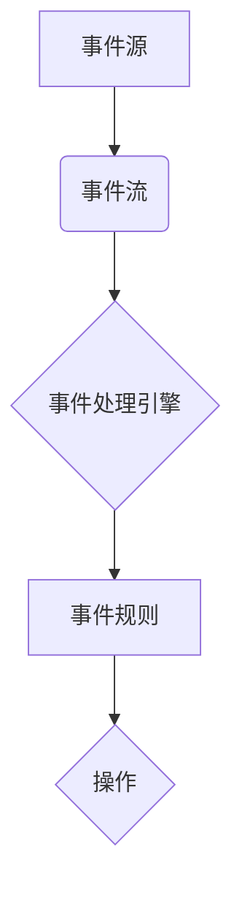

## 【AI大数据计算原理与代码实例讲解】CEP

> 关键词：CEP, 事件处理, 流式数据, 实时分析, 大数据, 规则引擎, 代码实例,  Java, Apache Flink

## 1. 背景介绍

在当今数据爆炸的时代，海量数据以高速流动的形式涌入企业系统。如何实时分析这些流动的事件数据，从中挖掘价值，并做出及时响应，成为企业数字化转型和智能化升级的关键。事件处理引擎 (CEP, Complex Event Processing) 正是在这种背景下应运而生。

CEP 是一种处理实时流式数据的技术，它能够识别复杂事件模式，并根据预先定义的规则触发相应的行动。例如，在金融领域，CEP 可以用于检测欺诈交易，在电商领域，可以用于个性化推荐，在工业控制领域，可以用于预测设备故障。

传统的数据库系统主要面向静态数据，难以处理实时流动的事件数据。而 CEP 系统则专门针对流式数据进行了优化，能够高效地处理高吞吐量、低延迟的数据流。

## 2. 核心概念与联系

CEP 系统的核心概念包括：

* **事件:**  CEP 处理的基本单位，通常表示一个发生在某个时间点的特定状态或行为。
* **事件流:**  一系列按时间顺序排列的事件。
* **事件模式:**  定义了特定事件序列的规则，例如，连续三次访问同一个商品的事件。
* **事件规则:**  基于事件模式，定义了当事件模式匹配时要执行的操作。
* **事件处理引擎:**  负责接收事件流，识别事件模式，触发事件规则，并执行相应的操作。

**CEP 系统架构**



## 3. 核心算法原理 & 具体操作步骤

### 3.1  算法原理概述

CEP 系统的核心算法是基于状态机和模式匹配的。

* **状态机:**  用于跟踪事件流的执行状态，并根据事件的类型和顺序进行状态转换。
* **模式匹配:**  用于识别事件流中符合预定义事件模式的序列。

CEP 系统通常采用以下步骤处理事件流：

1. **接收事件:**  从事件源接收事件数据。
2. **事件格式化:**  将接收到的事件数据格式化，以便引擎进行处理。
3. **状态机更新:**  根据事件数据，更新状态机的状态。
4. **模式匹配:**  检查当前状态机状态是否满足预定义的事件模式。
5. **规则触发:**  如果事件模式匹配，则触发相应的事件规则。
6. **操作执行:**  根据事件规则执行相应的操作，例如，发送报警信息、更新数据库记录等。

### 3.2  算法步骤详解

1. **事件接收:**  CEP 系统从各种数据源接收事件数据，例如，传感器数据、日志数据、网络流量数据等。
2. **事件格式化:**  CEP 系统将接收到的事件数据格式化，使其符合引擎的输入格式。通常，事件数据包含事件类型、事件时间戳、事件属性等信息。
3. **事件存储:**  CEP 系统将格式化的事件数据存储在内存或磁盘中，以便引擎进行处理。
4. **状态机更新:**  CEP 系统根据事件数据，更新状态机的状态。状态机可以是简单的有限状态机，也可以是复杂的层次状态机。
5. **模式匹配:**  CEP 系统使用模式匹配算法，检查当前状态机状态是否满足预定义的事件模式。模式匹配算法可以是基于正则表达式、基于树形结构、基于状态机的等。
6. **规则触发:**  如果事件模式匹配，则触发相应的事件规则。事件规则定义了当事件模式匹配时要执行的操作。
7. **操作执行:**  CEP 系统根据事件规则执行相应的操作，例如，发送报警信息、更新数据库记录、控制设备运行等。

### 3.3  算法优缺点

**优点:**

* **实时性:**  CEP 系统能够实时处理流式数据，并及时响应事件。
* **复杂事件处理:**  CEP 系统能够识别复杂事件模式，例如，连续三次访问同一个商品的事件。
* **可扩展性:**  CEP 系统通常采用分布式架构，能够处理海量数据流。
* **灵活性和可定制性:**  CEP 系统可以根据不同的应用场景，定义不同的事件模式和事件规则。

**缺点:**

* **开发复杂度:**  开发 CEP 应用需要一定的专业知识和经验。
* **资源消耗:**  CEP 系统处理海量数据流时，可能会消耗大量的计算资源。
* **性能瓶颈:**  如果事件模式过于复杂，或者事件流的吞吐量过大，可能会导致 CEP 系统性能瓶颈。

### 3.4  算法应用领域

CEP 算法广泛应用于以下领域:

* **金融:**  欺诈检测、风险管理、交易监控
* **电商:**  个性化推荐、用户行为分析、库存管理
* **工业控制:**  设备故障预测、生产过程优化、安全监控
* **交通:**  交通流量预测、拥堵情况分析、事故预警
* **医疗:**  疾病诊断、患者监测、药物研发

## 4. 数学模型和公式 & 详细讲解 & 举例说明

### 4.1  数学模型构建

CEP 系统的数学模型主要基于事件流的概率论和统计学。

* **事件概率:**  事件发生的概率可以根据历史数据进行统计分析。
* **事件序列概率:**  事件序列发生的概率可以根据事件之间的依赖关系进行计算。
* **事件模式概率:**  事件模式发生的概率可以根据事件序列的概率进行推导。

### 4.2  公式推导过程

假设事件 A 和事件 B 的发生概率分别为 P(A) 和 P(B)，事件 A 和事件 B 独立发生，则事件 A 发生后紧接着事件 B 发生的概率为：

$$P(A \rightarrow B) = P(A) * P(B)$$

如果事件 A 和事件 B 相关，则需要考虑事件之间的依赖关系，使用条件概率进行计算。

### 4.3  案例分析与讲解

例如，在金融领域，我们可以使用 CEP 系统检测欺诈交易。

* **事件:**  交易记录
* **事件属性:**  交易金额、交易时间、交易地点、交易账户等
* **事件模式:**  连续三次交易金额超过一定阈值的事件
* **事件规则:**  当事件模式匹配时，触发报警，并进行进一步调查

我们可以根据历史交易数据，统计事件 A (交易金额超过一定阈值) 的概率，以及事件 A 发生后紧接着事件 B (交易金额超过一定阈值) 发生的概率。如果这两个概率都比较高，则表明该事件模式的发生概率较高，需要提高警惕。

## 5. 项目实践：代码实例和详细解释说明

### 5.1  开发环境搭建

* **操作系统:**  Linux 或 Windows
* **Java JDK:**  1.8 或以上版本
* **Apache Flink:**  1.13 或以上版本

### 5.2  源代码详细实现

```java
import org.apache.flink.api.common.functions.MapFunction;
import org.apache.flink.streaming.api.datastream.DataStream;
import org.apache.flink.streaming.api.environment.StreamExecutionEnvironment;

public class CEPExample {

    public static void main(String[] args) throws Exception {
        // 创建 Flink 流处理环境
        StreamExecutionEnvironment env = StreamExecutionEnvironment.getExecutionEnvironment();

        // 定义事件数据类型
        public static class Transaction {
            public String account;
            public double amount;
            public long timestamp;

            public Transaction(String account, double amount, long timestamp) {
                this.account = account;
                this.amount = amount;
                this.timestamp = timestamp;
            }
        }

        // 创建事件数据流
        DataStream<Transaction> transactions = env.fromElements(
                new Transaction("A", 100, 1678886400000L),
                new Transaction("B", 50, 1678886401000L),
                new Transaction("A", 200, 1678886402000L),
                new Transaction("C", 100, 1678886403000L),
                new Transaction("A", 300, 1678886404000L)
        );

        // 定义事件模式匹配规则
        DataStream<String> fraudAlerts = transactions
               .keyBy(transaction -> transaction.account)
               .window(TumblingEventTimeWindows.of(Seconds.of(5)))
               .map(new FraudDetection());

        // 打印报警信息
        fraudAlerts.print();

        // 执行流处理任务
        env.execute("CEP Example");
    }

    // 定义事件模式匹配函数
    public static class FraudDetection implements MapFunction<Transaction, String> {
        @Override
        public String map(Transaction transaction) throws Exception {
            // 规则：连续三次交易金额超过 150 元
            if (transaction.amount > 150) {
                return "Fraud Alert: Account " + transaction.account + " has exceeded the threshold.";
            }
            return null;
        }
    }
}
```

### 5.3  代码解读与分析

* **事件数据类型:**  定义了一个 `Transaction` 类来表示交易记录，包含账户、金额和时间戳等属性。
* **事件数据流:**  使用 `env.fromElements()` 方法创建了一个事件数据流，包含一些示例交易记录。
* **事件模式匹配规则:**  使用 `keyBy()` 方法将事件数据分组，然后使用 `window()` 方法定义一个滑动窗口，每个窗口包含 5 秒钟内的事件数据。
* **事件模式匹配函数:**  定义了一个 `FraudDetection` 类来实现事件模式匹配规则，如果连续三次交易金额超过 150 元，则触发报警。
* **报警信息打印:**  使用 `print()` 方法打印报警信息。

### 5.4  运行结果展示

当代码运行时，如果事件数据满足预定义的事件模式，则会打印相应的报警信息。

## 6. 实际应用场景

CEP 技术在各个领域都有广泛的应用场景，例如：

* **金融领域:**  欺诈检测、风险管理、交易监控、客户行为分析
* **电商领域:**  个性化推荐、用户行为分析、库存管理、促销活动分析
* **工业控制领域:**  设备故障预测、生产过程优化、安全监控、质量控制
* **交通领域:**  交通流量预测、拥堵情况分析、事故预警、公共交通调度
* **医疗领域:**  疾病诊断、患者监测、药物研发、医疗资源管理

### 6.4  未来应用展望

随着大数据、人工智能等技术的不断发展，CEP 技术的应用场景将会更加广泛。未来，CEP 技术可能会与以下技术融合，实现更智能化的应用：

* **机器学习:**  利用机器学习算法，自动学习事件模式，提高 CEP 系统的智能化水平。
* **云计算:**  利用云计算平台的弹性伸缩能力，实现 CEP 系统的规模化部署和管理。
* **物联网:**  与物联网设备结合，实现对实时数据的实时分析和处理。

## 7. 工具和资源推荐

### 7.1  学习资源推荐

* **书籍:**
    * 《CEP: Complex Event Processing》 by  Thomas Erl
    * 《Real-Time Data Processing with Apache Flink》 by  Kostas Tzoumas
* **在线课程:**
    * Coursera:  Complex Event Processing with Apache Flink
    * Udemy:  Apache Flink for Beginners

### 7.2  开发工具推荐

* **Apache Flink:**  开源流式数据处理框架，支持 CEP 功能。
* **StreamSets Data Collector:**  开源数据集成平台，支持 CEP 功能。
* **Tibco StreamBase:**  商业 CEP 平台，提供丰富的功能和工具。

### 7.3  相关论文