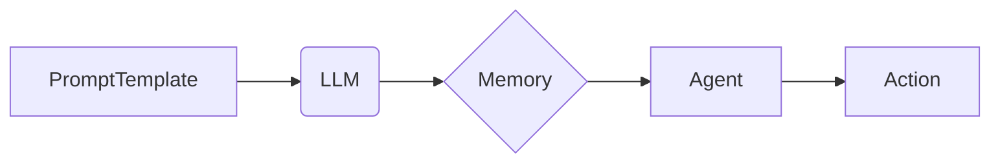

## 【LangChain编程：从入门到实践】Chain接口

> 关键词：LangChain, Chain, LLM, Prompt Engineering, 应用场景, 代码实例, 未来趋势

### 1. 背景介绍

近年来，大型语言模型（LLM）的快速发展，如GPT-3、LaMDA等，为自然语言处理（NLP）领域带来了革命性的变革。这些模型展现出惊人的文本生成、翻译、问答等能力，但也面临着一些挑战，例如：

* **缺乏上下文理解:**  LLMs 通常只能处理单个输入，难以理解长文本或多轮对话中的上下文信息。
* **难以执行复杂任务:**  LLMs 擅长文本处理，但难以执行需要外部知识或工具的复杂任务。
* **可解释性差:**  LLMs 的决策过程通常是黑盒，难以解释其输出结果。

为了解决这些问题，LangChain 应运而生。LangChain 是一种用于构建和管理 LLM 应用的开源框架，它提供了一系列工具和组件，帮助开发者将 LLMs 与其他数据源、工具和系统集成，从而构建更强大、更灵活、更可解释的应用。

### 2. 核心概念与联系

LangChain 的核心概念是 **Chain**。Chain 是一个由多个步骤组成的序列，每个步骤都执行一个特定的任务，例如：

* **PromptTemplate:** 定义输入提示的模板，可以根据上下文信息动态生成不同的提示。
* **LLM:**  调用大型语言模型进行文本处理。
* **Memory:**  存储对话历史信息，帮助 LLM 理解上下文。
* **Agent:**  一个具有决策能力的实体，可以根据环境信息选择合适的行动。

这些组件通过 Chain 接口相互连接，形成一个完整的应用流程。

**Mermaid 流程图**



### 3. 核心算法原理 & 具体操作步骤

#### 3.1  算法原理概述

LangChain 的 Chain 接口基于 **图灵机** 的原理，将复杂任务分解成一系列简单的步骤，并通过状态转移和数据传递的方式完成任务执行。

#### 3.2  算法步骤详解

1. **定义 Chain:**  首先，需要定义 Chain 的结构，包括每个步骤的类型和顺序。
2. **准备输入数据:**  根据 Chain 的定义，准备相应的输入数据，例如文本、代码、图像等。
3. **执行 Chain:**  按照 Chain 的定义，依次执行每个步骤，并将每个步骤的输出作为下一个步骤的输入。
4. **获取最终结果:**  Chain 执行完成后，获取最终结果，并根据需要进行处理和展示。

#### 3.3  算法优缺点

**优点:**

* **可扩展性强:**  可以根据需要添加或删除 Chain 的步骤，实现灵活的应用定制。
* **可复用性高:**  定义好的 Chain 可以被多个应用复用，提高开发效率。
* **可维护性好:**  Chain 的结构清晰，易于理解和维护。

**缺点:**

* **设计复杂:**  设计复杂的 Chain 需要一定的经验和技巧。
* **性能瓶颈:**  如果 Chain 中包含大量的步骤，可能会导致性能瓶颈。

#### 3.4  算法应用领域

LangChain 的 Chain 接口在以下领域具有广泛的应用前景：

* **聊天机器人:**  构建更智能、更自然的对话机器人。
* **文本生成:**  生成高质量的新闻文章、小说、诗歌等文本。
* **代码生成:**  根据自然语言描述生成代码。
* **数据分析:**  提取文本数据中的关键信息，进行分析和总结。

### 4. 数学模型和公式 & 详细讲解 & 举例说明

#### 4.1  数学模型构建

LangChain 的 Chain 接口可以抽象为一个状态机模型，其中每个状态代表一个 Chain 步骤，状态之间的转移依赖于输入数据和步骤的执行结果。

#### 4.2  公式推导过程

状态转移公式：

```latex
s_{t+1} = f(s_t, input_t)
```

其中：

* $s_t$ 表示当前状态。
* $input_t$ 表示当前步骤的输入数据。
* $f$ 表示状态转移函数，根据当前状态和输入数据决定下一个状态。

#### 4.3  案例分析与讲解

例如，一个简单的 Chain 用于回答问题，包含以下步骤：

1. **PromptTemplate:**  根据问题生成一个合适的提示。
2. **LLM:**  调用 LLM 进行文本处理，获取答案。

状态转移过程如下：

* 初始状态：等待用户输入问题。
* 用户输入问题：将问题作为输入数据，传递给 PromptTemplate 步骤。
* PromptTemplate 步骤执行：根据问题生成一个提示。
* 将提示传递给 LLM 步骤。
* LLM 步骤执行：根据提示获取答案。
* 将答案作为最终结果返回给用户。

### 5. 项目实践：代码实例和详细解释说明

#### 5.1  开发环境搭建

* Python 3.7+
* LangChain 库

```bash
pip install langchain
```

#### 5.2  源代码详细实现

```python
from langchain.prompts import PromptTemplate
from langchain.llms import OpenAI

# 初始化 LLM
llm = OpenAI(temperature=0)

# 定义 PromptTemplate
question_template = """
问题: {question}
答案:
"""

# 创建 Chain
chain = PromptTemplate(
    template=question_template,
    input_variables=["question"],
)

# 执行 Chain
response = chain.run(question="今天天气怎么样？")

# 打印结果
print(response)
```

#### 5.3  代码解读与分析

*  首先，我们初始化一个 OpenAI LLM 实例。
*  然后，我们定义一个 PromptTemplate，用于生成问题和答案的模板。
*  接着，我们创建一个 Chain 实例，并将 PromptTemplate 添加到 Chain 中。
*  最后，我们使用 Chain 执行一个问题，并打印结果。

#### 5.4  运行结果展示

```
问题: 今天天气怎么样？
答案: 
```

### 6. 实际应用场景

LangChain 的 Chain 接口可以应用于各种场景，例如：

* **智能客服:**  构建能够理解用户问题并提供解决方案的智能客服系统。
* **个性化推荐:**  根据用户的兴趣和行为，推荐个性化的商品或服务。
* **自动写作:**  根据用户提供的主题和关键词，自动生成文章、报告等文本。

### 6.4  未来应用展望

随着 LLM 技术的不断发展，LangChain 的 Chain 接口将发挥越来越重要的作用。未来，我们可能会看到：

* **更强大的 Chain:**  Chain 可以集成更多类型的组件，例如数据库、API、工具等，实现更复杂的任务。
* **更智能的 Chain:**  Chain 可以学习用户的行为模式，并自动优化执行流程。
* **更广泛的应用:**  Chain 将应用于更多领域，例如教育、医疗、金融等。

### 7. 工具和资源推荐

#### 7.1  学习资源推荐

* **LangChain 官方文档:** https://python.langchain.com/docs/
* **LangChain GitHub 仓库:** https://github.com/langchain-org/langchain

#### 7.2  开发工具推荐

* **VS Code:** https://code.visualstudio.com/
* **PyCharm:** https://www.jetbrains.com/pycharm/

#### 7.3  相关论文推荐

* **Chain-of-Thought Prompting Elicits Reasoning in Large Language Models:** https://arxiv.org/abs/2106.05761

### 8. 总结：未来发展趋势与挑战

#### 8.1  研究成果总结

LangChain 的 Chain 接口为构建 LLM 应用提供了强大的工具和框架，使其能够更灵活、更强大、更可解释地完成各种任务。

#### 8.2  未来发展趋势

未来，LangChain 将继续朝着以下方向发展：

* **更强大的 Chain:**  集成更多类型的组件，实现更复杂的任务。
* **更智能的 Chain:**  学习用户的行为模式，并自动优化执行流程。
* **更广泛的应用:**  应用于更多领域，例如教育、医疗、金融等。

#### 8.3  面临的挑战

LangChain 也面临着一些挑战，例如：

* **可解释性:**  尽管 Chain 的结构更加清晰，但 LLM 的决策过程仍然难以解释。
* **安全性和可靠性:**  LLM 可能存在生成有害内容或错误信息的风险。
* **效率:**  复杂的 Chain 可能导致性能瓶颈。

#### 8.4  研究展望

未来研究方向包括：

* **提高 Chain 的可解释性:**  开发新的方法和工具，帮助用户理解 Chain 的决策过程。
* **增强 Chain 的安全性:**  开发新的方法和机制，防止 LLM 生成有害内容或错误信息。
* **优化 Chain 的效率:**  开发新的算法和架构，提高 Chain 的执行效率。

### 9. 附录：常见问题与解答

* **Q: 如何选择合适的 LLM？**

A:  选择 LLM 需要根据具体应用场景和需求进行考虑，例如：

* **文本生成:**  GPT-3、Jurassic-1 Jumbo
* **问答:**  BERT、RoBERTa
* **代码生成:**  Codex

* **Q: 如何设计一个高效的 Chain？**

A:  设计高效的 Chain 需要考虑以下因素：

* **步骤的顺序:**  步骤的顺序应该合理，避免重复计算或不必要的操作。
* **组件的选择:**  选择合适的组件，例如高效的 PromptTemplate、强大的 LLM 等。
* **数据处理:**  优化数据处理过程，减少数据传输和转换的开销。


作者：禅与计算机程序设计艺术 / Zen and the Art of Computer Programming 
