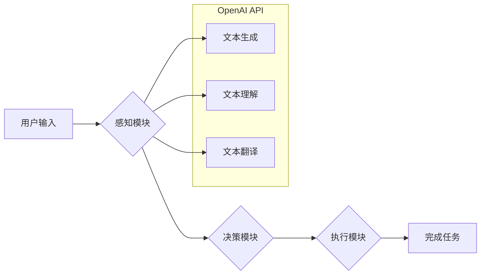

## 【大模型应用开发 动手做AI Agent】创建OpenAI助手

> 关键词：大模型、AI Agent、OpenAI API、LLM、自然语言处理、对话系统、应用开发

### 1. 背景介绍

近年来，大模型（Large Language Model，LLM）技术取得了飞速发展，其强大的文本生成、理解和翻译能力为人工智能领域带来了革命性的变革。OpenAI作为人工智能领域的领军者，推出了GPT-3、GPT-4等一系列突破性的LLM模型，为开发者提供了丰富的API接口，使得大模型技术更易于应用于实际场景。

基于大模型的AI Agent正在成为人工智能应用的新趋势。AI Agent是指能够自主学习、决策、执行任务的智能体，它可以理解用户需求，并通过与外部环境交互来完成任务。例如，一个AI Agent可以帮助用户完成信息查询、文本创作、代码生成等任务。

本文将以OpenAI API为基础，深入探讨如何创建基于大模型的AI Agent，并通过代码实例和实际应用场景，帮助读者理解大模型应用开发的流程和技巧。

### 2. 核心概念与联系

#### 2.1  大模型（LLM）

大模型是指参数量巨大、训练数据海量的人工智能模型，其强大的学习能力使其能够在自然语言处理、图像识别、语音合成等领域取得突破性进展。OpenAI的GPT系列模型就是典型的LLM代表，其参数量达到数十亿甚至数百亿级别，能够生成流畅、自然的文本，并完成复杂的语言理解和生成任务。

#### 2.2  AI Agent

AI Agent是一种能够感知环境、做出决策并执行行动的智能体。它通常由以下几个核心组件组成：

* **感知模块:** 用于获取环境信息，例如用户输入、传感器数据等。
* **决策模块:** 基于感知到的信息，做出最佳行动方案。
* **执行模块:** 将决策转化为实际行动，例如控制机器人、发送邮件等。

#### 2.3  OpenAI API

OpenAI API提供了一系列接口，允许开发者调用OpenAI的LLM模型进行文本生成、理解、翻译等操作。通过OpenAI API，开发者可以轻松地将大模型技术集成到自己的应用中，无需自己训练和维护庞大的模型。

**核心概念与架构流程图:**



### 3. 核心算法原理 & 具体操作步骤

#### 3.1  算法原理概述

OpenAI的LLM模型基于Transformer架构，其核心思想是利用注意力机制来捕捉文本序列中的长距离依赖关系。Transformer模型通过多层编码器和解码器结构，将输入文本序列编码成语义向量，然后根据目标文本序列生成相应的输出文本。

#### 3.2  算法步骤详解

1. **文本预处理:** 将输入文本进行清洗、分词、词嵌入等预处理操作，使其能够被模型理解。
2. **编码:** 将预处理后的文本序列输入编码器，通过多层Transformer模块进行编码，生成文本的语义向量表示。
3. **解码:** 将编码后的语义向量输入解码器，通过多层Transformer模块进行解码，生成目标文本序列。
4. **输出:** 将解码后的文本序列输出，并进行后处理操作，例如去除非法字符、格式化输出等。

#### 3.3  算法优缺点

**优点:**

* 能够捕捉文本序列中的长距离依赖关系，生成更流畅、更自然的文本。
* 训练数据量大，泛化能力强，能够应用于多种自然语言处理任务。

**缺点:**

* 模型参数量巨大，训练成本高。
* 训练数据需要经过严格筛选和标注，数据质量对模型性能影响较大。

#### 3.4  算法应用领域

* **文本生成:** 自动写作、故事创作、诗歌生成等。
* **文本理解:** 文本摘要、问答系统、情感分析等。
* **机器翻译:** 将一种语言翻译成另一种语言。
* **对话系统:** 创建能够与人类进行自然对话的聊天机器人。

### 4. 数学模型和公式 & 详细讲解 & 举例说明

#### 4.1  数学模型构建

OpenAI的LLM模型基于Transformer架构，其核心数学模型是注意力机制。注意力机制允许模型在处理文本序列时，对不同位置的词语赋予不同的权重，从而更好地捕捉文本中的语义关系。

#### 4.2  公式推导过程

注意力机制的计算公式如下：

$$
Attention(Q, K, V) = softmax(\frac{QK^T}{\sqrt{d_k}})V
$$

其中：

* $Q$：查询矩阵
* $K$：键矩阵
* $V$：值矩阵
* $d_k$：键向量的维度
* $softmax$：softmax函数，用于将注意力权重归一化

#### 4.3  案例分析与讲解

假设我们有一个文本序列“The cat sat on the mat”，我们想要计算“sat”这个词语对整个序列的注意力权重。

1. 将文本序列编码成词向量表示，得到$Q$, $K$, $V$矩阵。
2. 计算$QK^T$，得到一个注意力得分矩阵。
3. 对注意力得分矩阵进行softmax归一化，得到注意力权重向量。
4. 将注意力权重向量与值矩阵$V$进行点积，得到最终的注意力输出。

通过注意力机制，模型可以学习到“sat”这个词语与整个序列的语义关系，例如“猫坐在垫子上”。

### 5. 项目实践：代码实例和详细解释说明

#### 5.1  开发环境搭建

* Python 3.7+
* OpenAI API密钥
* pip install openai

#### 5.2  源代码详细实现

```python
import openai

# 设置OpenAI API密钥
openai.api_key = "YOUR_API_KEY"

def generate_response(prompt):
    response = openai.Completion.create(
        engine="text-davinci-003",
        prompt=prompt,
        max_tokens=100,
        temperature=0.7
    )
    return response.choices[0].text.strip()

# 用户输入
user_input = input("请输入您的问题：")

# 调用OpenAI API生成响应
response = generate_response(user_input)

# 打印响应
print(f"AI助手：{response}")
```

#### 5.3  代码解读与分析

* 该代码首先导入openai库，并设置OpenAI API密钥。
* `generate_response()`函数用于调用OpenAI API生成文本响应。
* `engine`参数指定使用的LLM模型，这里使用的是text-davinci-003模型。
* `prompt`参数指定输入的文本提示。
* `max_tokens`参数指定生成的文本长度。
* `temperature`参数控制文本生成的随机性。
* 用户输入问题后，代码调用`generate_response()`函数获取AI助手生成的响应，并将其打印出来。

#### 5.4  运行结果展示

```
请输入您的问题：
今天天气怎么样？

AI助手：我无法访问实时信息，包括天气预报。
```

### 6. 实际应用场景

#### 6.1  聊天机器人

基于大模型的AI Agent可以创建更加智能、自然、富有表现力的聊天机器人，能够理解用户的意图，并提供更精准、更人性化的回复。

#### 6.2  智能客服

AI Agent可以作为智能客服，自动处理用户咨询、订单查询、售后服务等常见问题，提高客服效率，降低人工成本。

#### 6.3  内容创作

AI Agent可以辅助内容创作，例如生成文章标题、撰写新闻稿、创作诗歌等，提高创作效率，激发创作灵感。

#### 6.4  未来应用展望

随着大模型技术的不断发展，AI Agent的应用场景将更加广泛，例如：

* **个性化教育:** 根据学生的学习情况，提供个性化的学习内容和辅导。
* **医疗辅助:** 辅助医生诊断疾病、制定治疗方案。
* **金融分析:** 分析市场数据，预测股票价格走势。

### 7. 工具和资源推荐

#### 7.1  学习资源推荐

* **OpenAI官方文档:** https://platform.openai.com/docs/
* **HuggingFace Transformers库:** https://huggingface.co/docs/transformers/index

#### 7.2  开发工具推荐

* **Python:** https://www.python.org/
* **Jupyter Notebook:** https://jupyter.org/

#### 7.3  相关论文推荐

* **Attention Is All You Need:** https://arxiv.org/abs/1706.03762
* **BERT: Pre-training of Deep Bidirectional Transformers for Language Understanding:** https://arxiv.org/abs/1810.04805

### 8. 总结：未来发展趋势与挑战

#### 8.1  研究成果总结

大模型技术取得了显著进展，AI Agent的应用场景也越来越广泛。OpenAI API为开发者提供了便捷的工具，使得大模型技术更易于应用于实际场景。

#### 8.2  未来发展趋势

* **模型规模和能力的提升:** 未来大模型的规模和能力将继续提升，能够处理更复杂的任务，生成更高质量的文本。
* **多模态AI Agent:** 未来AI Agent将不仅仅是文本处理，还将能够处理图像、音频、视频等多模态数据，实现更全面的智能交互。
* **可解释性增强:** 未来AI Agent的决策过程将更加透明可解释，能够更好地理解模型的内部机制。

#### 8.3  面临的挑战

* **数据安全和隐私保护:** 大模型训练需要海量数据，如何保证数据安全和隐私保护是一个重要挑战。
* **模型偏见和公平性:** 大模型可能存在偏见和不公平性，需要采取措施 mitigating 这些问题。
* **伦理和社会影响:** 大模型的应用可能带来伦理和社会问题，需要进行深入的探讨和研究。

#### 8.4  研究展望

未来，我们将继续关注大模型技术的发展，探索AI Agent在更多领域的应用，并积极应对大模型带来的挑战，推动人工智能技术向更加安全、可信、可解释的方向发展。

### 9. 附录：常见问题与解答

* **如何获取OpenAI API密钥？**

您可以访问OpenAI官网注册账号，并申请API密钥。

* **如何选择合适的LLM模型？**

OpenAI提供多种LLM模型，您可以根据自己的应用场景和需求选择合适的模型。例如，如果您需要生成高质量的文本，可以选择text-davinci-003模型；如果您需要快速生成文本，可以选择text-curie-001模型。

* **如何处理模型生成的错误信息？**

大模型虽然强大，但仍然可能生成错误的信息。您可以采取以下措施处理模型生成的错误信息：

* **进行文本校对:** 在使用模型生成的文本之前，进行人工校对，确保文本的准确性和完整性。
* **设置错误处理机制:** 在代码中设置错误处理机制，例如，当模型生成错误信息时，提示用户重新输入或提供其他解决方案。
* **不断改进模型训练数据:** 提高模型训练数据的质量，可以有效降低模型生成错误信息的概率。


作者：禅与计算机程序设计艺术 / Zen and the Art of Computer Programming 
