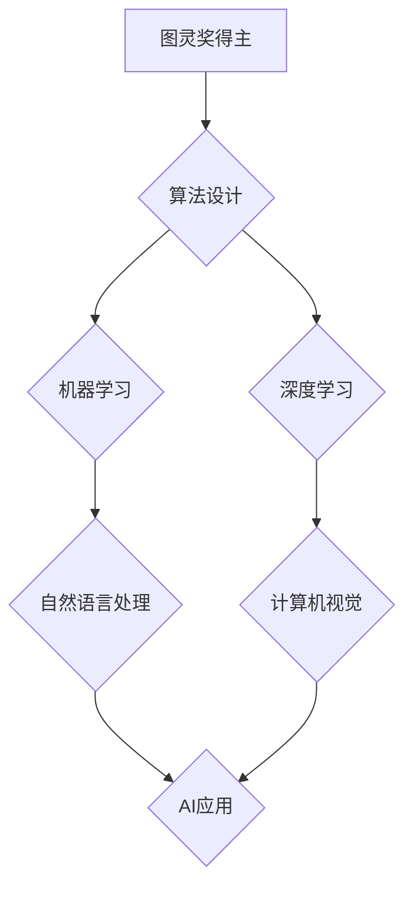

## 图灵奖得主对AI的影响

> 关键词：图灵奖、人工智能、算法、机器学习、深度学习、计算机科学、技术发展

## 1. 背景介绍

自20世纪40年代，计算机科学的诞生以来，人工智能（AI）便成为了一个备受关注的领域。从早期简单的规则系统到如今的深度学习模型，AI技术经历了飞速发展，深刻地改变着我们的生活。图灵奖，被誉为计算机科学界的“诺贝尔奖”，每年颁发给对计算机科学领域做出杰出贡献的科学家或工程师。许多图灵奖得主都对AI的发展做出了重要贡献，他们的研究成果推动了AI技术的进步，并对未来AI的发展方向指明了方向。

## 2. 核心概念与联系

### 2.1 图灵奖与AI

图灵奖的设立旨在表彰那些在计算机科学领域做出突破性贡献的人才。AI作为计算机科学的重要分支，自然也成为了图灵奖的关注焦点。许多图灵奖得主都致力于AI研究，他们的工作涵盖了算法设计、机器学习、自然语言处理等多个领域。

### 2.2 AI的核心概念

人工智能的核心概念是让机器能够像人类一样思考、学习和解决问题。这包括：

* **机器学习:** 允许机器从数据中学习，并根据学习到的知识进行预测或决策。
* **深度学习:** 一种更高级的机器学习方法，利用多层神经网络模拟人类大脑的学习过程。
* **自然语言处理:** 使机器能够理解和处理人类语言。
* **计算机视觉:** 赋予机器“看”的能力，使其能够识别图像和视频中的物体。

### 2.3 图灵奖得主对AI的影响

图灵奖得主的研究成果为AI的发展提供了重要的理论基础和技术支撑。他们的工作推动了AI算法的进步，提高了AI系统的性能，并拓展了AI的应用领域。

**Mermaid 流程图:**



## 3. 核心算法原理 & 具体操作步骤

### 3.1 算法原理概述

深度学习算法是AI领域的核心算法之一，其原理是模仿人类大脑的神经网络结构，通过多层神经网络进行数据处理和学习。深度学习算法能够自动从海量数据中提取特征，并学习复杂的模式，从而实现对图像、语音、文本等数据的识别、分类和生成。

### 3.2 算法步骤详解

深度学习算法的具体操作步骤如下：

1. **数据预处理:** 将原始数据进行清洗、转换和格式化，使其适合深度学习模型的训练。
2. **网络结构设计:** 根据任务需求设计深度神经网络的结构，包括神经元的数量、连接方式和激活函数等。
3. **参数初始化:** 为神经网络中的参数进行随机初始化。
4. **前向传播:** 将输入数据通过神经网络进行逐层传递，最终得到输出结果。
5. **损失函数计算:** 计算模型输出结果与真实值的差异，即损失值。
6. **反向传播:** 根据损失值，反向传播误差信号，调整神经网络的参数。
7. **优化算法:** 使用优化算法，例如梯度下降法，更新神经网络的参数，使其朝着最小化损失值的的方向进行调整。
8. **模型训练:** 重复步骤4-7，直到模型的性能达到预期的水平。
9. **模型评估:** 使用测试数据评估模型的性能，例如准确率、召回率等。
10. **模型部署:** 将训练好的模型部署到实际应用场景中。

### 3.3 算法优缺点

**优点:**

* **高精度:** 深度学习算法能够学习复杂的模式，从而实现高精度的预测和分类。
* **自动化特征提取:** 深度学习算法能够自动从数据中提取特征，无需人工特征工程。
* **泛化能力强:** 深度学习模型能够对新的数据进行泛化，并取得良好的性能。

**缺点:**

* **数据依赖:** 深度学习算法需要大量的训练数据才能达到良好的性能。
* **计算资源消耗大:** 深度学习模型训练需要大量的计算资源，例如GPU。
* **可解释性差:** 深度学习模型的决策过程难以解释，其内部机制较为复杂。

### 3.4 算法应用领域

深度学习算法在各个领域都有广泛的应用，例如：

* **图像识别:** 人脸识别、物体检测、图像分类等。
* **语音识别:** 语音转文本、语音助手等。
* **自然语言处理:** 机器翻译、文本摘要、情感分析等。
* **医疗诊断:** 疾病预测、图像分析等。
* **金融风险控制:** 欺诈检测、信用评分等。

## 4. 数学模型和公式 & 详细讲解 & 举例说明

### 4.1 数学模型构建

深度学习模型的核心是多层神经网络，每个神经元接收多个输入信号，并通过加权求和和激活函数进行处理，最终输出一个信号。

**神经元模型:**

$$
y = f(w_1x_1 + w_2x_2 +... + w_nx_n + b)
$$

其中：

* $y$ 是神经元的输出信号。
* $x_1, x_2,..., x_n$ 是输入信号。
* $w_1, w_2,..., w_n$ 是权重系数。
* $b$ 是偏置项。
* $f$ 是激活函数。

### 4.2 公式推导过程

深度学习模型的训练过程是通过反向传播算法来进行的。反向传播算法的核心是计算损失函数对模型参数的梯度，并使用梯度下降法更新参数。

**损失函数:**

$$
L = \frac{1}{N}\sum_{i=1}^{N} (y_i - \hat{y}_i)^2
$$

其中：

* $L$ 是损失函数的值。
* $N$ 是样本数量。
* $y_i$ 是真实值。
* $\hat{y}_i$ 是模型预测值。

**梯度下降法:**

$$
\theta = \theta - \alpha \frac{\partial L}{\partial \theta}
$$

其中：

* $\theta$ 是模型参数。
* $\alpha$ 是学习率。
* $\frac{\partial L}{\partial \theta}$ 是损失函数对参数的梯度。

### 4.3 案例分析与讲解

**举例说明:**

假设我们训练一个深度学习模型来识别猫和狗的图片。训练数据包含大量猫和狗的图片，以及对应的标签。模型通过学习这些数据，能够识别出猫和狗的特征，并对新的图片进行分类。

在训练过程中，模型会不断调整参数，以最小化损失函数的值。损失函数的值代表模型预测结果与真实结果之间的差异。当损失函数的值足够小的时候，模型的训练就完成了。

## 5. 项目实践：代码实例和详细解释说明

### 5.1 开发环境搭建

深度学习模型的开发需要使用特定的软件环境，例如Python、TensorFlow、PyTorch等。

**Python环境搭建:**

可以使用Anaconda或Miniconda等工具来搭建Python开发环境。

**深度学习框架安装:**

可以使用pip命令安装TensorFlow或PyTorch等深度学习框架。

### 5.2 源代码详细实现

以下是一个使用TensorFlow实现图像分类的简单代码示例：

```python
import tensorflow as tf

# 定义模型结构
model = tf.keras.models.Sequential([
  tf.keras.layers.Conv2D(32, (3, 3), activation='relu', input_shape=(28, 28, 1)),
  tf.keras.layers.MaxPooling2D((2, 2)),
  tf.keras.layers.Conv2D(64, (3, 3), activation='relu'),
  tf.keras.layers.MaxPooling2D((2, 2)),
  tf.keras.layers.Flatten(),
  tf.keras.layers.Dense(10, activation='softmax')
])

# 编译模型
model.compile(optimizer='adam',
              loss='sparse_categorical_crossentropy',
              metrics=['accuracy'])

# 训练模型
model.fit(x_train, y_train, epochs=5)

# 评估模型
loss, accuracy = model.evaluate(x_test, y_test)
print('Test loss:', loss)
print('Test accuracy:', accuracy)
```

### 5.3 代码解读与分析

这段代码定义了一个简单的卷积神经网络模型，用于识别手写数字。

* `tf.keras.models.Sequential` 创建了一个顺序模型，即层级结构。
* `tf.keras.layers.Conv2D` 定义了一个卷积层，用于提取图像特征。
* `tf.keras.layers.MaxPooling2D` 定义了一个最大池化层，用于降低特征图的尺寸。
* `tf.keras.layers.Flatten` 将多维特征图转换为一维向量。
* `tf.keras.layers.Dense` 定义了一个全连接层，用于分类。
* `model.compile` 编译模型，指定优化器、损失函数和评价指标。
* `model.fit` 训练模型，使用训练数据进行训练。
* `model.evaluate` 评估模型，使用测试数据计算损失和准确率。

### 5.4 运行结果展示

训练完成后，模型能够对新的手写数字图片进行分类。

## 6. 实际应用场景

### 6.1 图像识别

深度学习算法在图像识别领域取得了突破性的进展，例如人脸识别、物体检测、图像分类等。

* **人脸识别:** 用于身份验证、安全监控等场景。
* **物体检测:** 用于自动驾驶、机器人视觉等场景。
* **图像分类:** 用于医疗诊断、产品分类等场景。

### 6.2 语音识别

深度学习算法也广泛应用于语音识别领域，例如语音转文本、语音助手等。

* **语音转文本:** 用于语音输入、字幕生成等场景。
* **语音助手:** 例如Siri、Alexa等，用于语音控制、信息查询等场景。

### 6.3 自然语言处理

深度学习算法在自然语言处理领域也取得了显著进展，例如机器翻译、文本摘要、情感分析等。

* **机器翻译:** 将一种语言翻译成另一种语言。
* **文本摘要:** 自动生成文本的简短摘要。
* **情感分析:** 分析文本中的情感倾向，例如正面、负面、中性等。

### 6.4 未来应用展望

随着深度学习算法的不断发展，其应用场景将更加广泛，例如：

* **个性化推荐:** 基于用户的行为数据，推荐个性化的商品、服务等。
* **医疗诊断辅助:** 辅助医生进行疾病诊断，提高诊断准确率。
* **自动驾驶:** 提高自动驾驶系统的安全性、可靠性和智能化水平。

## 7. 工具和资源推荐

### 7.1 学习资源推荐

* **书籍:**
    * 深度学习 (Deep Learning) - Ian Goodfellow, Yoshua Bengio, Aaron Courville
    * 构建深度学习模型 (Hands-On Machine Learning with Scikit-Learn, Keras & TensorFlow) - Aurélien Géron
* **在线课程:**
    * 深度学习 Specialization - Andrew Ng (Coursera)
    * fast.ai - Practical Deep Learning for Coders
* **博客和网站:**
    * TensorFlow Blog
    * PyTorch Blog
    * Towards Data Science

### 7.2 开发工具推荐

* **深度学习框架:** TensorFlow, PyTorch, Keras
* **编程语言:** Python
* **数据处理工具:** Pandas, NumPy
* **可视化工具:** Matplotlib, Seaborn

### 7.3 相关论文推荐

* **AlexNet:** ImageNet Classification with Deep Convolutional Neural Networks
* **VGGNet:** Very Deep Convolutional Networks for Large-Scale Image Recognition
* **ResNet:** Deep Residual Learning for Image Recognition
* **InceptionNet:** In