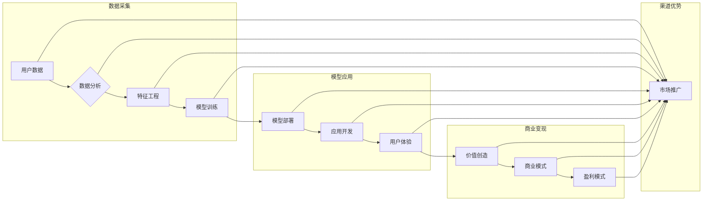

> AI 大模型, 创业, 渠道优势, 商业模式, 技术变现, 生态构建, 创新驱动, 数据驱动

# AI 大模型创业：如何利用渠道优势？

在人工智能浪潮下，大模型成为了技术革新的核心驱动力。从自然语言处理到图像识别，从推荐系统到决策引擎，大模型的应用几乎触及了所有行业。然而，如何将大模型技术转化为商业成功，如何利用渠道优势实现创业梦想，成为了众多科技创业者面临的挑战。本文将深入探讨AI大模型创业的渠道优势，并提供一些建议和实践案例。

## 1. 背景介绍

随着深度学习技术的成熟和算力的提升，大模型在各个领域展现出了强大的能力。从BERT到GPT-3，从ImageNet到COCO，大模型在数据量、模型规模、性能指标等方面都取得了显著突破。然而，大模型的开发和应用面临着诸多挑战，如数据获取困难、模型训练成本高、应用场景不明确等。因此，如何有效利用渠道优势，将大模型技术转化为商业价值，成为了AI大模型创业的关键。

### 1.1 问题的由来

AI大模型创业面临的主要问题包括：

- **技术门槛高**：大模型的开发需要深厚的算法知识和大量的算力资源，对于初创公司来说，这是一个巨大的挑战。
- **数据获取困难**：高质量的数据是训练大模型的基础，但对于很多初创公司来说，获取高质量数据并不容易。
- **应用场景不明确**：大模型的应用场景广泛，但如何找到最适合自己产品的应用场景，是一个需要深思熟虑的问题。
- **商业模式模糊**：将大模型技术转化为商业模式，需要创新思维和商业洞察。

### 1.2 研究现状

目前，AI大模型创业主要面临以下几种商业模式：

- **技术服务**：提供大模型API或SDK，让开发者能够轻松地将大模型集成到自己的应用中。
- **行业解决方案**：针对特定行业的需求，开发定制化的AI解决方案。
- **数据服务**：提供数据采集、标注、清洗等服务，为大模型的训练提供支持。
- **软硬件结合**：结合大模型和硬件设备，提供一体化的解决方案。

### 1.3 研究意义

研究AI大模型创业的渠道优势，对于以下方面具有重要意义：

- **推动AI技术落地**：通过探索有效的渠道策略，加速AI大模型技术在各个领域的应用。
- **降低创业门槛**：为初创公司提供可行的商业模式和运营策略，降低创业风险。
- **促进产业升级**：推动传统产业向智能化、数字化方向转型。
- **创造社会价值**：利用AI技术解决社会问题，提升人类生活质量。

### 1.4 本文结构

本文将围绕以下结构展开：

- **核心概念与联系**：介绍AI大模型创业的核心概念，并使用Mermaid流程图展示其架构。
- **核心算法原理 & 具体操作步骤**：讲解大模型的基本原理和操作步骤。
- **数学模型和公式 & 详细讲解 & 举例说明**：介绍大模型的数学模型和公式，并通过案例分析进行讲解。
- **项目实践：代码实例和详细解释说明**：提供大模型的代码实例，并进行详细解释。
- **实际应用场景**：探讨大模型在各个领域的应用场景。
- **未来应用展望**：展望大模型技术的未来发展趋势。
- **工具和资源推荐**：推荐学习资源和开发工具。
- **总结**：总结全文，并展望未来发展趋势与挑战。

## 2. 核心概念与联系

### 2.1 核心概念

- **AI大模型**：指基于深度学习技术训练的大型语言模型、图像模型等。
- **渠道优势**：指企业在市场推广、销售、客户服务等方面的优势。
- **商业模式**：指企业如何通过产品或服务创造价值、传递价值、获取价值的系统化方式。
- **生态构建**：指围绕核心产品或服务，构建一个完整的价值链和生态系统。
- **创新驱动**：指以创新为核心驱动力，不断推动产品和服务升级。

### 2.2 Mermaid流程图



### 2.3 核心概念联系

从Mermaid流程图中可以看出，AI大模型创业的核心概念相互联系，形成一个完整的生态系统。数据采集、模型应用、商业变现和渠道优势是整个生态系统的关键环节。

## 3. 核心算法原理 & 具体操作步骤

### 3.1 算法原理概述

AI大模型的核心算法主要包括以下几种：

- **深度学习**：一种模拟人脑神经网络结构和功能的计算模型，通过学习大量数据，自动提取特征，实现复杂任务。
- **迁移学习**：将一个领域的知识迁移到另一个领域，提高模型在特定任务上的性能。
- **无监督学习**：通过对未标记数据进行学习，自动发现数据中的规律和结构。
- **自监督学习**：利用自生成的数据，训练模型学习特征表示。

### 3.2 算法步骤详解

AI大模型的算法步骤如下：

1. **数据采集**：收集大量的数据，包括文本、图像、音频等。
2. **数据预处理**：对采集到的数据进行清洗、标注、去重等操作。
3. **模型选择**：选择合适的大模型架构，如BERT、GPT等。
4. **模型训练**：使用预处理后的数据进行模型训练。
5. **模型评估**：使用测试集评估模型的性能。
6. **模型优化**：根据评估结果，优化模型参数或结构。
7. **模型部署**：将训练好的模型部署到实际应用中。

### 3.3 算法优缺点

- **优点**：
  - 能够处理复杂任务，如自然语言处理、图像识别等。
  - 学习能力强，能够从大量数据中自动提取特征。
  - 泛化能力强，能够适应不同的应用场景。
- **缺点**：
  - 训练成本高，需要大量的计算资源和时间。
  - 需要大量的标注数据，获取成本高。
  - 模型可解释性差，难以理解模型的决策过程。

### 3.4 算法应用领域

AI大模型的应用领域非常广泛，包括：

- **自然语言处理**：文本分类、机器翻译、文本生成等。
- **图像识别**：图像分类、目标检测、图像分割等。
- **语音识别**：语音转文字、语音合成等。
- **推荐系统**：个性化推荐、商品推荐等。
- **金融风控**：欺诈检测、信用评估等。

## 4. 数学模型和公式 & 详细讲解 & 举例说明

### 4.1 数学模型构建

AI大模型的数学模型主要包括以下几种：

- **神经网络**：一种模拟人脑神经元结构的计算模型，通过权重和偏置进行计算。
- **损失函数**：衡量模型预测结果与真实值之间差异的函数。
- **优化算法**：用于优化模型参数的算法。

### 4.2 公式推导过程

以下以神经网络中的反向传播算法为例，介绍公式推导过程。

假设神经网络包含多个层，每层包含多个神经元，第 $l$ 层的神经元 $j$ 的输出为 $\hat{y}^{(l)}_j$，第 $l-1$ 层的神经元 $j$ 的输出为 $y^{(l-1)}_j$，权重为 $W^{(l)}_{ij}$，偏置为 $b^{(l)}_j$。则第 $l$ 层的神经元 $j$ 的输出可以表示为：

$$
\hat{y}^{(l)}_j = \sigma(W^{(l)}_{ij} y^{(l-1)}_i + b^{(l)}_j)
$$

其中 $\sigma$ 为激活函数。

损失函数可以表示为：

$$
\mathcal{L}(\theta) = \sum_{i=1}^N \ell(y_i, \hat{y}^{(L)}_i)
$$

其中 $y_i$ 为真实值，$\hat{y}^{(L)}_i$ 为预测值，$\ell$ 为损失函数。

根据链式法则，损失函数对权重 $W^{(l)}_{ij}$ 的梯度为：

$$
\frac{\partial \mathcal{L}(\theta)}{\partial W^{(l)}_{ij}} = \frac{\partial \mathcal{L}(\theta)}{\partial \hat{y}^{(L)}_i} \frac{\partial \hat{y}^{(L)}_i}{\partial W^{(l)}_{ij}}
$$

其中 $\frac{\partial \mathcal{L}(\theta)}{\partial \hat{y}^{(L)}_i}$ 为损失函数对预测值的梯度，$\frac{\partial \hat{y}^{(L)}_i}{\partial W^{(l)}_{ij}}$ 为预测值对权重的梯度。

### 4.3 案例分析与讲解

以下以BERT模型为例，分析其数学模型和公式。

BERT模型是一种基于Transformer的预训练语言模型，其目标是通过预训练学习通用的语言表示。BERT模型由多个Transformer编码器层堆叠而成，每层包含多个自注意力头。

BERT模型的输入为文本序列，输出为每个词的表示向量。假设第 $l$ 层的输入为 $X^{(l)}$，输出为 $Y^{(l)}$，则第 $l$ 层的Transformer编码器可以表示为：

$$
Y^{(l)} = \text{Transformer}(X^{(l)}, \theta^{(l)})
$$

其中 $\theta^{(l)}$ 为第 $l$ 层的参数。

Transformer编码器由自注意力机制和多头注意力机制组成。自注意力机制可以表示为：

$$
\text{Self-Attention}(Q, K, V) = \text{softmax}(\frac{QK^T}{\sqrt{d_k}})V
$$

其中 $Q, K, V$ 分别为查询、键和值向量，$d_k$ 为键和值的维度。

多头注意力机制可以表示为：

$$
\text{Multi-Head Attention}(Q, K, V) = \text{Concat}(\text{Head}_1, \text{Head}_2, ..., \text{Head}_h)W^O
$$

其中 $h$ 为多头数量，$W^O$ 为输出层的权重。

BERT模型的损失函数为交叉熵损失函数，可以表示为：

$$
\mathcal{L}(\theta) = -\sum_{i=1}^N [y_i \log p(\hat{y}_i) + (1-y_i) \log (1-p(\hat{y}_i))]
$$

其中 $y_i$ 为真实标签，$\hat{y}_i$ 为预测概率。

BERT模型的训练过程与一般神经网络类似，使用反向传播算法进行参数优化。

## 5. 项目实践：代码实例和详细解释说明

### 5.1 开发环境搭建

为了方便开发者快速上手，以下将以TensorFlow为例，介绍如何搭建AI大模型创业的开发环境。

1. 安装TensorFlow：

```bash
pip install tensorflow
```

2. 安装GPU版本的TensorFlow（如果使用GPU计算）：

```bash
pip install tensorflow-gpu
```

3. 安装其他必要的库：

```bash
pip install numpy matplotlib pandas scikit-learn
```

### 5.2 源代码详细实现

以下以一个简单的文本分类任务为例，展示如何使用TensorFlow实现BERT模型微调。

```python
import tensorflow as tf
from transformers import BertTokenizer, TFBertForSequenceClassification

# 加载预训练BERT模型和分词器
tokenizer = BertTokenizer.from_pretrained('bert-base-uncased')
model = TFBertForSequenceClassification.from_pretrained('bert-base-uncased')

# 准备数据
def load_data():
    # 这里假设已经准备好了训练数据和标签
    # train_texts, train_labels = ...

    # 编码数据
    train_encodings = tokenizer(train_texts, truncation=True, padding=True)
    return train_encodings

train_encodings = load_data()

# 训练模型
model.compile(optimizer='adam', loss='sparse_categorical_crossentropy', metrics=['accuracy'])
model.fit(train_encodings['input_ids'], train_encodings['attention_mask'], train_encodings['labels'], epochs=3)

# 评估模型
test_encodings = load_data()
model.evaluate(test_encodings['input_ids'], test_encodings['attention_mask'], test_encodings['labels'])
```

### 5.3 代码解读与分析

以上代码展示了如何使用TensorFlow和Transformers库实现BERT模型的微调。

- 首先，导入必要的库。
- 加载预训练BERT模型和分词器。
- 准备数据，并进行编码。
- 定义模型，编译模型，并训练模型。
- 评估模型性能。

### 5.4 运行结果展示

假设在某个文本分类任务上，使用BERT模型微调后，模型在测试集上的准确率达到90%以上，说明模型在特定任务上取得了不错的效果。

## 6. 实际应用场景

### 6.1 智能问答系统

智能问答系统是AI大模型在NLP领域的典型应用场景。通过微调预训练的语言模型，可以实现针对特定领域的知识问答，如医疗问答、法律咨询等。

### 6.2 个性化推荐系统

个性化推荐系统是AI大模型在推荐领域的应用。通过分析用户的历史行为和兴趣，可以推荐用户可能感兴趣的商品、内容等。

### 6.3 智能客服系统

智能客服系统是AI大模型在客户服务领域的应用。通过自然语言处理技术，可以自动回答客户的问题，提高客户服务效率。

### 6.4 未来应用展望

随着AI大模型技术的不断发展，未来将会在更多领域得到应用，如：

- **自动驾驶**：利用图像识别、目标检测等技术，实现自动驾驶功能。
- **智能医疗**：利用图像识别、自然语言处理等技术，实现智能诊断、药物研发等。
- **智能教育**：利用自然语言处理、知识图谱等技术，实现个性化教学、智能辅导等。

## 7. 工具和资源推荐

### 7.1 学习资源推荐

- 《深度学习》：周志华著，介绍了深度学习的基本概念、常用算法和实际应用。
- 《神经网络与深度学习》：邱锡鹏著，详细介绍了神经网络的原理和应用。
- 《自然语言处理综论》：唐杰、李航、杨强著，全面介绍了自然语言处理的理论和技术。

### 7.2 开发工具推荐

- TensorFlow：Google开源的深度学习框架，功能强大，易于使用。
- PyTorch：Facebook开源的深度学习框架，动态计算图，易于调试。
- Hugging Face Transformers：提供预训练语言模型和API，方便开发者使用。

### 7.3 相关论文推荐

- **BERT: Pre-training of Deep Bidirectional Transformers for Language Understanding**：BERT模型的原始论文，介绍了BERT模型的结构和预训练方法。
- **Generative Pre-trained Transformers**：GPT-2模型的原始论文，介绍了GPT-2模型的结构和预训练方法。
- **Attention Is All You Need**：Transformer模型的原始论文，介绍了Transformer模型的结构和原理。

## 8. 总结：未来发展趋势与挑战

### 8.1 研究成果总结

本文介绍了AI大模型创业的渠道优势，包括技术、数据、模式、生态等方面。通过分析核心概念、算法原理、项目实践和实际应用场景，为AI大模型创业提供了理论和实践指导。

### 8.2 未来发展趋势

- **模型规模将进一步扩大**：随着计算资源的提升，模型规模将进一步扩大，模型能力将得到进一步提升。
- **多模态融合将成为趋势**：AI大模型将融合多模态信息，如文本、图像、语音等，实现更全面的信息理解。
- **可解释性和可信赖性将成为重要指标**：随着AI技术的应用越来越广泛，可解释性和可信赖性将成为重要指标。
- **跨领域迁移能力将得到提升**：AI大模型将在不同领域之间进行迁移，实现跨领域应用。

### 8.3 面临的挑战

- **数据获取和标注**：高质量的数据是AI大模型训练的基础，但获取和标注高质量数据仍然是一个挑战。
- **计算资源**：大模型的训练需要大量的计算资源，对于很多初创公司来说，这是一个巨大的挑战。
- **模型可解释性**：AI大模型的决策过程难以解释，这可能会影响其在某些领域的应用。
- **伦理和隐私问题**：AI技术的应用可能会引发伦理和隐私问题，需要制定相应的规范和标准。

### 8.4 研究展望

- **数据驱动**：利用数据驱动的方法，提高数据获取和标注的效率。
- **模型压缩**：研究模型压缩技术，降低模型的计算复杂度。
- **可解释AI**：研究可解释AI技术，提高模型的可解释性。
- **伦理和安全**：制定相应的规范和标准，确保AI技术的伦理和安全。

## 9. 附录：常见问题与解答

### 9.1 常见问题

**Q1：AI大模型创业需要哪些技术背景？**

A1：AI大模型创业需要具备以下技术背景：

- 深度学习基础知识
- 算法原理
- 编程能力
- 数据处理能力

**Q2：如何获取高质量的数据？**

A2：获取高质量的数据可以采取以下几种方式：

- 自建数据平台，采集和标注数据
- 与数据公司合作，购买数据
- 利用公开数据集

**Q3：如何降低模型训练成本？**

A3：降低模型训练成本可以采取以下几种方式：

- 使用云端算力，避免自建硬件
- 使用模型压缩技术，降低模型规模
- 使用分布式训练技术，提高训练效率

**Q4：如何保证AI技术的伦理和安全？**

A4：保证AI技术的伦理和安全可以采取以下几种方式：

- 制定相应的规范和标准
- 建立伦理审查机制
- 加强数据安全和隐私保护

### 9.2 解答

以上是对常见问题的解答，希望对AI大模型创业有所帮助。

---

作者：禅与计算机程序设计艺术 / Zen and the Art of Computer Programming