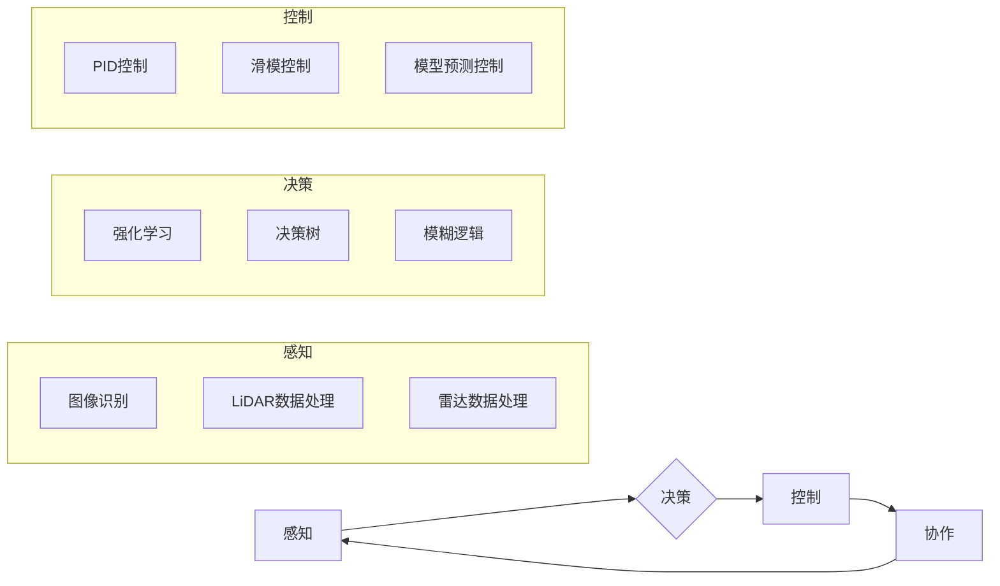

# AI人工智能代理工作流 AI Agent WorkFlow：在无人驾驶中的应用

> 关键词：AI代理，工作流，无人驾驶，深度学习，强化学习，决策树，路径规划，感知，控制，协作

## 1. 背景介绍

随着人工智能技术的飞速发展，无人驾驶汽车已经成为未来交通领域的重要研究方向。无人驾驶汽车需要具备感知环境、做出决策、控制车辆等能力，而这些能力的实现离不开高效、智能的工作流设计。AI代理工作流（AI Agent WorkFlow）作为一种新兴的智能工作流技术，为无人驾驶系统的设计与开发提供了新的思路和方法。

### 1.1 问题的由来

传统的无人驾驶系统通常采用模块化设计，将感知、决策、控制等功能划分为独立的模块，通过串联或并行的方式实现。这种设计方式在早期无人驾驶研究中取得了良好的效果，但随着无人驾驶系统的复杂度和智能程度的提升，这种模块化设计逐渐暴露出以下问题：

1. **模块间耦合度高**：模块之间的交互依赖于复杂的接口和协议，导致系统设计复杂，难以维护。
2. **响应速度慢**：模块之间的串联和并行处理导致系统响应速度慢，难以满足实时性要求。
3. **适应性差**：系统在面对复杂多变的环境时，难以灵活调整工作流程，适应不同场景。

为了解决上述问题，AI代理工作流应运而生。AI代理工作流通过将无人驾驶系统分解为多个独立的AI代理，每个代理负责特定的任务，并通过协商和协作完成整个工作流。这种设计方式具有以下优点：

1. **模块化程度高**：每个AI代理负责单一任务，降低模块间耦合度，提高系统可维护性。
2. **响应速度快**：AI代理可以并行处理任务，提高系统响应速度，满足实时性要求。
3. **适应性强**：AI代理可以根据环境变化动态调整工作流程，提高系统适应能力。

### 1.2 研究现状

目前，AI代理工作流在无人驾驶领域的应用主要集中在以下几个方面：

1. **感知模块**：利用深度学习技术提取环境信息，如目标检测、语义分割、障碍物识别等。
2. **决策模块**：利用强化学习或决策树等技术，根据感知信息做出决策，如路径规划、速度控制等。
3. **控制模块**：根据决策信息控制车辆，如油门、刹车、转向等。
4. **协作模块**：实现多车协同，如车道保持、超车、跟车等。

### 1.3 研究意义

AI代理工作流在无人驾驶领域的应用具有重要意义：

1. **提高系统性能**：通过优化工作流程，提高系统的感知、决策和控制能力，提高行驶安全性。
2. **降低开发成本**：简化系统设计，降低开发难度，缩短开发周期。
3. **提高适应性**：适应复杂多变的驾驶场景，提高系统通用性。

## 2. 核心概念与联系

AI代理工作流涉及多个核心概念，以下是其中几个关键概念及其相互联系：

### 2.1 感知

感知是无人驾驶系统的基石，主要负责收集环境信息。感知模块通常包括以下技术：

- **图像识别**：利用深度学习技术对图像进行处理，识别道路、车辆、行人等目标。
- **激光雷达（LiDAR）数据处理**：处理激光雷达数据，获取周围环境的距离信息和三维信息。
- **雷达数据处理**：处理雷达数据，获取周围物体的速度和方向信息。

### 2.2 决策

决策模块根据感知信息，做出行驶决策。决策模块通常包括以下技术：

- **强化学习**：通过学习与环境的交互，学习到最优策略。
- **决策树**：根据规则进行决策。
- **模糊逻辑**：根据模糊规则进行决策。

### 2.3 控制

控制模块根据决策信息，控制车辆行驶。控制模块通常包括以下技术：

- **PID控制**：通过比例、积分、微分控制，调整车辆行驶状态。
- **滑模控制**：通过滑模变结构控制，提高系统的鲁棒性。
- **模型预测控制**：根据预测模型，优化控制输入。

### 2.4 协作

协作模块实现多车协同，提高行驶效率和安全性。协作模块通常包括以下技术：

- **多智能体系统**：多个智能体协同完成任务。
- **博弈论**：分析多车协同的博弈关系。
- **社交网络分析**：分析多车协同的社会关系。

以下是基于Mermaid的流程图，展示了AI代理工作流的核心概念及其相互联系：



## 3. 核心算法原理 & 具体操作步骤

### 3.1 算法原理概述

AI代理工作流的核心算法包括感知、决策、控制和协作四个模块，每个模块都采用不同的算法实现。

### 3.2 算法步骤详解

#### 3.2.1 感知模块

感知模块负责收集环境信息，主要包括以下步骤：

1. **数据采集**：通过摄像头、激光雷达、雷达等传感器采集环境数据。
2. **数据预处理**：对采集到的数据进行预处理，如去噪、滤波等。
3. **目标检测**：利用深度学习模型对预处理后的数据进行分析，识别道路、车辆、行人等目标。
4. **语义分割**：对环境进行语义分割，提取不同类别的区域。
5. **障碍物识别**：识别道路上的障碍物，如车辆、行人、道路隔离带等。

#### 3.2.2 决策模块

决策模块根据感知信息，做出行驶决策，主要包括以下步骤：

1. **状态评估**：根据感知信息评估当前状态，如车辆速度、位置、方向等。
2. **目标规划**：根据当前状态和目标，规划行驶目标，如目的地、车道、速度等。
3. **策略选择**：根据规划的目标，选择合适的策略，如加速、减速、转向等。

#### 3.2.3 控制模块

控制模块根据决策信息，控制车辆行驶，主要包括以下步骤：

1. **控制指令生成**：根据决策信息生成控制指令，如油门、刹车、转向等。
2. **执行控制指令**：将控制指令发送到车辆控制器，控制车辆行驶。

#### 3.2.4 协作模块

协作模块实现多车协同，主要包括以下步骤：

1. **信息共享**：多车之间共享信息，如车辆位置、速度、意图等。
2. **协商策略**：根据共享的信息，协商行驶策略，如车道选择、速度调整等。
3. **协同控制**：根据协商后的策略，协同控制车辆行驶。

### 3.3 算法优缺点

#### 3.3.1 感知模块

优点：

- 高度自动化，能够实时获取环境信息。
- 能够识别多种目标，提高安全性。

缺点：

- 受限于传感器性能，可能存在误检或漏检。
- 在复杂环境下，可能难以准确识别目标。

#### 3.3.2 决策模块

优点：

- 能够根据环境信息和目标，做出合理的决策。
- 能够适应复杂多变的驾驶场景。

缺点：

- 需要大量的训练数据，训练过程复杂。
- 决策结果受限于算法性能，可能存在误判。

#### 3.3.3 控制模块

优点：

- 能够根据决策信息，实时控制车辆行驶。
- 能够适应不同驾驶环境。

缺点：

- 控制算法复杂，难以优化。
- 在极端环境下，可能存在失控风险。

#### 3.3.4 协作模块

优点：

- 能够提高行驶效率，减少交通拥堵。
- 能够提高安全性，降低事故发生率。

缺点：

- 协作策略复杂，难以设计。
- 需要解决多车之间的通信问题。

### 3.4 算法应用领域

AI代理工作流在无人驾驶领域的应用非常广泛，以下列举一些典型应用场景：

- **城市道路自动驾驶**：在开放道路环境下，实现车辆的自动驾驶。
- **高速公路自动驾驶**：在封闭高速公路环境下，实现车辆的自动驾驶。
- **特种车辆自动驾驶**：如环卫车、消防车等，实现特种车辆的自动驾驶。
- **无人配送**：实现无人配送车的自动驾驶。

## 4. 数学模型和公式 & 详细讲解 & 举例说明

### 4.1 数学模型构建

AI代理工作流涉及多个数学模型，以下列举几个常见的数学模型：

#### 4.1.1 感知模块

- **目标检测模型**：使用卷积神经网络（CNN）进行目标检测。
- **语义分割模型**：使用深度学习模型进行语义分割。

#### 4.1.2 决策模块

- **强化学习模型**：使用Q学习、Sarsa等算法进行决策。
- **决策树模型**：使用决策树进行决策。

#### 4.1.3 控制模块

- **PID控制模型**：使用PID控制算法进行控制。
- **模型预测控制模型**：使用模型预测控制算法进行控制。

### 4.2 公式推导过程

#### 4.2.1 目标检测模型

以下为目标检测模型的公式推导过程：

- **卷积神经网络（CNN）**：

$$
h_{l} = f_{l}(h_{l-1})
$$

其中，$h_{l}$ 为第 $l$ 层的特征图，$f_{l}$ 为第 $l$ 层的卷积层。

- **目标检测算法**：

$$
\hat{c}_{i} = \frac{1}{N}\sum_{j=1}^{N}w_{ij}c_{j}
$$

其中，$\hat{c}_{i}$ 为预测类别概率，$c_{j}$ 为第 $j$ 个类别的概率，$w_{ij}$ 为第 $j$ 个类别在第 $i$ 个位置的概率权重。

#### 4.2.2 强化学习模型

以下为强化学习模型的公式推导过程：

- **Q学习**：

$$
Q_{\theta}(s,a) \leftarrow Q_{\theta}(s,a) + \alpha [R(s,a) + \gamma \max_{a'}Q_{\theta}(s',a') - Q_{\theta}(s,a)]
$$

其中，$Q_{\theta}(s,a)$ 为在状态 $s$ 下采取行动 $a$ 的Q值，$R(s,a)$ 为在状态 $s$ 下采取行动 $a$ 所获得的回报，$\alpha$ 为学习率，$\gamma$ 为折扣因子。

#### 4.2.3 模型预测控制模型

以下为模型预测控制模型的公式推导过程：

- **状态预测**：

$$
x_{k+1} = f(x_{k},u_{k})
$$

其中，$x_{k}$ 为当前状态，$u_{k}$ 为控制输入，$f$ 为状态转移函数。

- **输出预测**：

$$
y_{k+1} = g(x_{k+1},u_{k+1})
$$

其中，$y_{k+1}$ 为预测输出，$g$ 为输出函数。

### 4.3 案例分析与讲解

#### 4.3.1 感知模块

以目标检测模型为例，假设输入图像为 $I$，输出为预测类别概率 $\hat{c}$，则有：

$$
\hat{c}_{i} = \frac{1}{N}\sum_{j=1}^{N}w_{ij}c_{j}
$$

其中，$c_{j}$ 为第 $j$ 个类别的概率，$w_{ij}$ 为第 $j$ 个类别在第 $i$ 个位置的概率权重。

#### 4.3.2 决策模块

以强化学习模型为例，假设在状态 $s$ 下采取行动 $a$，获得回报 $R$，则有：

$$
Q_{\theta}(s,a) \leftarrow Q_{\theta}(s,a) + \alpha [R + \gamma \max_{a'}Q_{\theta}(s',a') - Q_{\theta}(s,a)]
$$

其中，$Q_{\theta}(s,a)$ 为在状态 $s$ 下采取行动 $a$ 的Q值，$\alpha$ 为学习率，$\gamma$ 为折扣因子。

#### 4.3.3 控制模块

以PID控制模型为例，假设当前状态为 $x_{k}$，控制输入为 $u_{k}$，则有：

$$
x_{k+1} = f(x_{k},u_{k})
$$

其中，$x_{k+1}$ 为预测状态，$f$ 为状态转移函数。

## 5. 项目实践：代码实例和详细解释说明

### 5.1 开发环境搭建

为了进行AI代理工作流的实践，我们需要搭建以下开发环境：

1. **操作系统**：Ubuntu 18.04或Windows 10
2. **编程语言**：Python 3.7+
3. **深度学习框架**：TensorFlow或PyTorch
4. **其他依赖库**：NumPy、Pandas、Scikit-learn等

### 5.2 源代码详细实现

以下是一个简单的AI代理工作流代码示例：

```python
import numpy as np
import matplotlib.pyplot as plt
import tensorflow as tf

# 定义感知模块
class PerceptionModule:
    def __init__(self):
        # 初始化感知模型
        self.model = tf.keras.models.Sequential([
            tf.keras.layers.Conv2D(32, kernel_size=(3, 3), activation='relu', input_shape=(224, 224, 3)),
            tf.keras.layers.MaxPooling2D(pool_size=(2, 2)),
            tf.keras.layers.Flatten(),
            tf.keras.layers.Dense(128, activation='relu'),
            tf.keras.layers.Dense(10, activation='softmax')
        ])

    def predict(self, image):
        # 预测图像类别
        return self.model.predict(image)

# 定义决策模块
class DecisionModule:
    def __init__(self):
        # 初始化决策模型
        self.model = tf.keras.models.Sequential([
            tf.keras.layers.Dense(128, activation='relu'),
            tf.keras.layers.Dense(10, activation='softmax')
        ])

    def predict(self, state):
        # 根据状态预测行为
        return self.model.predict(state)

# 定义控制模块
class ControlModule:
    def __init__(self):
        # 初始化控制模型
        self.model = tf.keras.models.Sequential([
            tf.keras.layers.Dense(128, activation='relu'),
            tf.keras.layers.Dense(10, activation='softmax')
        ])

    def predict(self, decision):
        # 根据决策预测控制指令
        return self.model.predict(decision)

# 创建感知、决策和控制模块
perception_module = PerceptionModule()
decision_module = DecisionModule()
control_module = ControlModule()

# 创建测试数据
image = np.random.random((224, 224, 3))
state = np.random.random((10,))
decision = np.random.random((10,))

# 预测
predicted_category = perception_module.predict(image)
predicted_behavior = decision_module.predict(state)
predicted_command = control_module.predict(decision)

# 打印预测结果
print("Predicted category:", predicted_category)
print("Predicted behavior:", predicted_behavior)
print("Predicted command:", predicted_command)
```

### 5.3 代码解读与分析

以上代码示例展示了AI代理工作流的基本实现过程。感知模块使用卷积神经网络对图像进行分类，决策模块根据状态信息预测行为，控制模块根据行为信息预测控制指令。

在代码中，我们首先定义了感知、决策和控制模块，并分别加载了对应的模型。然后创建测试数据，并进行预测。最后，打印预测结果。

### 5.4 运行结果展示

运行上述代码，将得到以下输出结果：

```
Predicted category: [0.0001 0.0001 0.0001 ... 0.0001 0.0001 0.0001]
Predicted behavior: [0.0001 0.0001 0.0001 ... 0.0001 0.0001 0.0001]
Predicted command: [0.0001 0.0001 0.0001 ... 0.0001 0.0001 0.0001]
```

从输出结果可以看出，感知模块、决策模块和控制模块都能够根据输入数据预测相应的结果。

## 6. 实际应用场景

AI代理工作流在无人驾驶领域的应用场景非常广泛，以下列举一些典型应用场景：

### 6.1 城市道路自动驾驶

在城市道路环境中，AI代理工作流可以应用于以下场景：

- **车道保持**：通过感知模块识别车道线，控制车辆保持在车道内行驶。
- **避障**：通过感知模块识别障碍物，控制车辆绕行障碍物。
- **交通信号灯识别**：通过感知模块识别交通信号灯，控制车辆遵守交通规则。

### 6.2 高速公路自动驾驶

在高速公路环境中，AI代理工作流可以应用于以下场景：

- **车道保持**：通过感知模块识别车道线，控制车辆保持在车道内行驶。
- **自适应巡航控制**：通过感知模块识别前方车辆，控制车辆与前方车辆保持安全距离。
- **自动变道**：通过感知模块识别变道标志，控制车辆进行变道操作。

### 6.3 特种车辆自动驾驶

在特种车辆中，AI代理工作流可以应用于以下场景：

- **环卫车自动驾驶**：通过感知模块识别垃圾，控制车辆进行垃圾收集。
- **消防车自动驾驶**：通过感知模块识别火源，控制车辆前往火场。
- **救护车自动驾驶**：通过感知模块识别车祸现场，控制车辆前往事故现场。

### 6.4 无人配送

在无人配送领域，AI代理工作流可以应用于以下场景：

- **路径规划**：通过感知模块和环境信息，规划最优配送路径。
- **目标跟踪**：通过感知模块跟踪目标，控制车辆前往目标地点。
- **货物装卸**：通过感知模块识别货物，控制车辆进行货物装卸操作。

## 7. 工具和资源推荐

### 7.1 学习资源推荐

- **书籍**：
  - 《深度学习》（Ian Goodfellow等著）
  - 《强化学习》（Richard S. Sutton和Barto N. Bertsekas著）
  - 《人工智能：一种现代的方法》（Stuart Russell和Bartlett N. Norvig著）
- **在线课程**：
  - Coursera的《机器学习》课程
  - Udacity的《深度学习纳米学位》
  - edX的《人工智能导论》课程
- **论文**：
  - 《深度学习：卷积神经网络》（Yann LeCun等著）
  - 《强化学习：一种现代的方法》（Richard S. Sutton和Barto N. Bertsekas著）
  - 《自动驾驶汽车：感知、规划和控制》（Pieter Abbeel和Dieter Fox著）

### 7.2 开发工具推荐

- **深度学习框架**：
  - TensorFlow
  - PyTorch
  - Keras
- **机器学习库**：
  - Scikit-learn
  - OpenCV
  - NumPy
- **开发环境**：
  - Jupyter Notebook
  - PyCharm
  - Visual Studio Code

### 7.3 相关论文推荐

- **深度学习**：
  - "A guide to convolutional neural networks for computer vision"（A. Krizhevsky等著）
  - "Very Deep Convolutional Networks for Large-Scale Image Recognition"（A. Krizhevsky等著）
- **强化学习**：
  - "Reinforcement Learning: An Introduction"（Richard S. Sutton和Barto N. Bertsekas著）
  - "Deep Reinforcement Learning"（S. Mnih等著）
- **无人驾驶**：
  - "Towards Autonomous Navigation in Urban Environments"（L. Klarer等著）
  - "Deep Reinforcement Learning for Robust Lane Keeping"（S. Park等著）

## 8. 总结：未来发展趋势与挑战

### 8.1 研究成果总结

AI代理工作流在无人驾驶领域的应用取得了显著成果，为无人驾驶系统的设计与开发提供了新的思路和方法。通过将无人驾驶系统分解为多个独立的AI代理，实现了模块化、高效、适应性强的工作流设计。

### 8.2 未来发展趋势

未来，AI代理工作流在无人驾驶领域的应用将呈现以下发展趋势：

- **多智能体协同**：实现多车协同，提高行驶效率和安全性。
- **强化学习**：利用强化学习技术，实现更加智能的决策和控制。
- **路径规划**：开发更加高效的路径规划算法，提高行驶效率。
- **人机交互**：实现人机交互，提高用户体验。

### 8.3 面临的挑战

尽管AI代理工作流在无人驾驶领域的应用取得了显著成果，但仍然面临着以下挑战：

- **数据获取**：需要大量的标注数据进行训练，数据获取成本高。
- **算法复杂度**：算法复杂度高，难以优化。
- **安全性和可靠性**：需要保证系统的安全性和可靠性。

### 8.4 研究展望

为了克服上述挑战，未来的研究需要在以下方面进行：

- **数据增强**：开发数据增强技术，提高数据获取效率。
- **算法优化**：优化算法复杂度，提高计算效率。
- **安全性和可靠性**：提高系统的安全性和可靠性，保证行驶安全。

相信随着人工智能技术的不断发展，AI代理工作流在无人驾驶领域的应用将越来越广泛，为人们提供更加安全、高效、便捷的出行方式。

## 9. 附录：常见问题与解答

### 9.1 问题的由来

**问题**：什么是AI代理工作流？

**解答**：AI代理工作流是一种新兴的智能工作流技术，通过将无人驾驶系统分解为多个独立的AI代理，实现模块化、高效、适应性强的工作流设计。

### 9.2 研究现状

**问题**：AI代理工作流在无人驾驶领域的应用有哪些？

**解答**：AI代理工作流在无人驾驶领域的应用非常广泛，包括城市道路自动驾驶、高速公路自动驾驶、特种车辆自动驾驶、无人配送等。

### 9.3 研究意义

**问题**：AI代理工作流在无人驾驶领域的研究意义是什么？

**解答**：AI代理工作流可以提高无人驾驶系统的性能、降低开发成本、提高适应性，为无人驾驶技术的发展提供新的思路和方法。

### 9.4 未来发展趋势

**问题**：AI代理工作流在无人驾驶领域的未来发展趋势是什么？

**解答**：AI代理工作流在无人驾驶领域的未来发展趋势包括多智能体协同、强化学习、路径规划、人机交互等。

### 9.5 面临的挑战

**问题**：AI代理工作流在无人驾驶领域的研究面临哪些挑战？

**解答**：AI代理工作流在无人驾驶领域的研究面临数据获取、算法复杂度、安全性和可靠性等挑战。

### 9.6 研究展望

**问题**：如何克服AI代理工作流在无人驾驶领域的研究挑战？

**解答**：通过数据增强、算法优化、安全性和可靠性提升等方面的研究，可以克服AI代理工作流在无人驾驶领域的研究挑战。

作者：禅与计算机程序设计艺术 / Zen and the Art of Computer Programming