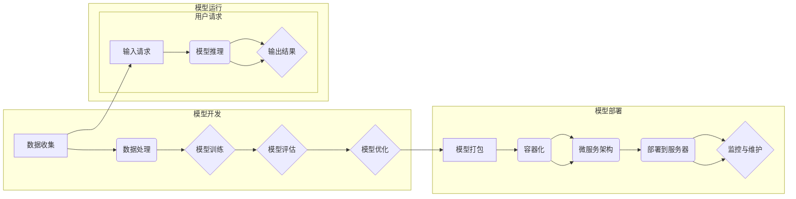

> 关键词：人工智能，核心算法，模型部署，深度学习，神经网络，TensorFlow，PyTorch，Kubernetes，容器化，微服务

# AI人工智能核心算法原理与代码实例讲解：模型部署

随着人工智能技术的快速发展，深度学习模型在各个领域都展现出了惊人的潜力。然而，将模型从开发环境部署到生产环境中，并非易事。本文将深入探讨AI核心算法的原理，并通过代码实例详细讲解模型部署的整个过程。

## 1. 背景介绍

### 1.1 问题的由来

随着深度学习技术的普及，越来越多的企业和组织开始尝试将AI模型应用于实际业务中。然而，模型开发和部署之间存在一道难以逾越的鸿沟。如何将训练好的模型高效、稳定、安全地部署到生产环境中，成为了人工智能应用落地的重要挑战。

### 1.2 研究现状

近年来，随着容器化、微服务、自动化部署等技术的兴起，模型部署的流程得到了极大的简化。然而，仍然存在许多挑战，如模型兼容性、资源管理、性能优化等。

### 1.3 研究意义

研究AI模型部署技术，对于推动人工智能应用的普及和应用价值的最大化具有重要意义。它能够帮助企业和组织：

- 降低模型部署成本
- 提高模型运行效率
- 提升模型的可维护性和可扩展性
- 增强模型的安全性

## 2. 核心概念与联系

### 2.1 核心概念原理和架构的 Mermaid 流程图



### 2.2 核心概念介绍

- **模型开发**：包括数据收集、数据处理、模型训练、模型评估和模型优化等环节。
- **模型部署**：将训练好的模型打包成可执行文件，并进行容器化、微服务架构设计，最终部署到服务器上。
- **模型运行**：接收用户请求，进行模型推理，并输出结果。

## 3. 核心算法原理 & 具体操作步骤

### 3.1 算法原理概述

模型部署的核心算法主要涉及以下几个方面：

- **模型打包**：将模型代码和依赖库打包成可执行文件。
- **容器化**：使用Docker等容器技术将模型打包成容器镜像。
- **微服务架构**：将应用拆分成多个独立的服务，每个服务负责处理特定的功能。
- **模型推理**：在服务器上运行容器，执行模型推理任务。
- **监控与维护**：监控模型运行状态，及时发现并处理异常情况。

### 3.2 算法步骤详解

1. **模型打包**：选择合适的打包工具，如Dockerfile，将模型代码、依赖库和配置文件打包成可执行文件。

2. **容器化**：使用Docker命令创建容器镜像，包括加载模型打包文件、设置环境变量、配置网络等。

3. **微服务架构**：根据业务需求，将应用拆分成多个独立的服务，每个服务负责处理特定的功能。

4. **部署到服务器**：使用Kubernetes等容器编排工具将容器镜像部署到服务器上。

5. **模型推理**：在服务器上启动容器，接收用户请求，执行模型推理任务，并返回结果。

6. **监控与维护**：使用Prometheus、Grafana等监控工具实时监控模型运行状态，并使用Kubernetes进行故障恢复和自动扩缩容。

### 3.3 算法优缺点

**优点**：

- **高效**：容器化技术可以快速启动容器，提高模型运行效率。
- **可扩展**：微服务架构可以灵活扩展服务实例，满足业务需求。
- **高可用**：自动化部署和监控工具可以保证系统的稳定运行。

**缺点**：

- **复杂性**：模型部署流程较为复杂，需要具备一定的技术背景。
- **资源消耗**：容器化技术需要额外的资源消耗，如CPU、内存等。

### 3.4 算法应用领域

模型部署技术可以应用于以下领域：

- **金融**：风险管理、欺诈检测、个性化推荐等。
- **医疗**：疾病诊断、药物研发、健康管理等。
- **零售**：客户细分、库存管理、供应链优化等。
- **自动驾驶**：车辆控制、路径规划、环境感知等。

## 4. 数学模型和公式 & 详细讲解 & 举例说明

### 4.1 数学模型构建

模型部署过程中涉及到的数学模型主要包括以下几种：

- **损失函数**：用于衡量模型预测结果与真实值之间的差异，如均方误差、交叉熵等。
- **优化算法**：用于更新模型参数，如梯度下降、Adam等。
- **评估指标**：用于衡量模型性能，如准确率、召回率、F1值等。

### 4.2 公式推导过程

以均方误差损失函数为例，其公式如下：

$$
L(y, \hat{y}) = \frac{1}{2}(y - \hat{y})^2
$$

其中，$y$ 为真实值，$\hat{y}$ 为模型预测值。

### 4.3 案例分析与讲解

以下是一个简单的模型部署案例，使用TensorFlow和Kubernetes进行模型部署。

### 5. 项目实践：代码实例和详细解释说明

### 5.1 开发环境搭建

1. 安装Python、pip、Docker、Kubernetes等软件。
2. 安装TensorFlow、Kubernetes客户端等依赖库。

### 5.2 源代码详细实现

```python
# 使用TensorFlow构建模型
import tensorflow as tf

def build_model():
    model = tf.keras.Sequential([
        tf.keras.layers.Dense(128, activation='relu', input_shape=(10,)),
        tf.keras.layers.Dense(64, activation='relu'),
        tf.keras.layers.Dense(1)
    ])
    return model

# 模型训练
def train_model(model, x_train, y_train):
    model.compile(optimizer='adam', loss='mse')
    model.fit(x_train, y_train, epochs=10)

# 模型部署
def deploy_model(model):
    # 保存模型
    model.save('model.h5')

    # 创建Dockerfile
    with open('Dockerfile', 'w') as f:
        f.write('FROM tensorflow/tensorflow:2.3.0-py3
')
        f.write('COPY model.h5 /model.h5
')
        f.write('CMD ["python", "/model/predict.py"]
')

    # 构建Docker镜像
    !docker build -t my_model .

    # 创建Kubernetes部署文件
    with open('k8s-deployment.yaml', 'w') as f:
        f.write('apiVersion: apps/v1
')
        f.write('kind: Deployment
')
        f.write('metadata:
')
        f.write('  name: my_model
')
        f.write('spec:
')
        f.write('  replicas: 1
')
        f.write('  selector:
')
        f.write('    matchLabels:
')
        f.write('      app: my_model
')
        f.write('  template:
')
        f.write('    metadata:
')
        f.write('      labels:
')
        f.write('        app: my_model
')
        f.write('    spec:
')
        f.write('      containers:
')
        f.write('      - name: my_model
')
        f.write('        image: my_model:latest
')
        f.write('        ports:
')
        f.write('        - containerPort: 5000
')

    # 部署到Kubernetes集群
    !kubectl apply -f k8s-deployment.yaml
```

### 5.3 代码解读与分析

以上代码展示了使用TensorFlow和Kubernetes进行模型部署的完整流程。首先，使用TensorFlow构建模型并进行训练。然后，保存模型并创建Dockerfile，构建Docker镜像。接着，创建Kubernetes部署文件，并将模型部署到Kubernetes集群中。

### 5.4 运行结果展示

运行以上代码，可以在Kubernetes集群中成功部署模型，并可以通过访问模型的REST API进行模型推理。

## 6. 实际应用场景

### 6.1 金融风控

在金融领域，模型部署可以帮助金融机构进行风险评估、反欺诈检测等任务。通过将训练好的模型部署到生产环境中，可以实时评估客户的信用风险，提高信贷审批的准确性。

### 6.2 智能医疗

在医疗领域，模型部署可以帮助医生进行疾病诊断、药物推荐等任务。通过将训练好的模型部署到生产环境中，可以提高诊断的效率和准确性，为患者提供更好的医疗服务。

### 6.3 智能交通

在智能交通领域，模型部署可以帮助进行车辆检测、交通流量预测等任务。通过将训练好的模型部署到生产环境中，可以提高交通管理的效率和安全性。

### 6.4 未来应用展望

随着人工智能技术的不断发展，模型部署的应用领域将越来越广泛。未来，模型部署技术将朝着以下方向发展：

- **模型压缩与加速**：通过模型压缩和加速技术，降低模型的计算复杂度和存储空间，提高模型的运行效率。
- **模型联邦学习**：通过联邦学习技术，实现模型的分布式训练和部署，保护用户隐私。
- **模型可解释性**：提高模型的可解释性，增强用户对模型的信任度。

## 7. 工具和资源推荐

### 7.1 学习资源推荐

- 《深度学习》[Goodfellow et al., 2016]
- 《动手学深度学习》[Zhang et al., 2017]
- TensorFlow官方文档
- PyTorch官方文档
- Kubernetes官方文档

### 7.2 开发工具推荐

- Docker
- Kubernetes
- TensorBoard
- Prometheus
- Grafana

### 7.3 相关论文推荐

- "Distributed Representations of Words and Phrases and their Compositionality" [Mikolov et al., 2013]
- "Sequence to Sequence Learning with Neural Networks" [Sutskever et al., 2014]
- "Attention Is All You Need" [Vaswani et al., 2017]
- "BERT: Pre-training of Deep Bidirectional Transformers for Language Understanding" [Devlin et al., 2018]
- "The Lottery Ticket Hypothesis: Finding Sparse, Trainable Neural Networks" [Huang et al., 2019]

## 8. 总结：未来发展趋势与挑战

### 8.1 研究成果总结

本文系统地介绍了AI核心算法原理、模型部署流程以及相关技术。通过代码实例，详细讲解了如何使用TensorFlow和Kubernetes进行模型部署。

### 8.2 未来发展趋势

模型部署技术将朝着以下方向发展：

- **自动化和智能化**：通过自动化和智能化工具，简化模型部署流程。
- **高效和可扩展**：提高模型的运行效率，实现模型的水平扩展。
- **安全性和可靠性**：提高模型的安全性，确保模型的稳定运行。

### 8.3 面临的挑战

模型部署技术面临以下挑战：

- **兼容性**：确保模型在不同平台和设备上都能正常运行。
- **资源管理**：优化模型资源的利用效率。
- **性能优化**：提高模型的运行速度和准确性。

### 8.4 研究展望

未来，模型部署技术的研究将主要集中在以下几个方面：

- **跨平台兼容性**：研究跨平台兼容的模型部署技术，实现模型在多种平台和设备上的运行。
- **高效资源管理**：研究高效资源管理技术，提高模型资源的利用效率。
- **模型可解释性**：研究模型可解释性技术，提高用户对模型的信任度。

## 9. 附录：常见问题与解答

**Q1：模型部署需要哪些技术栈？**

A1：模型部署需要以下技术栈：

- 编程语言：Python、Java、Go等
- 框架：TensorFlow、PyTorch、Keras等
- 容器化：Docker
- 容器编排：Kubernetes
- 监控与日志：Prometheus、Grafana、ELK等

**Q2：如何保证模型的稳定性和可靠性？**

A2：为了保证模型的稳定性和可靠性，可以采取以下措施：

- 使用成熟的深度学习框架和工具
- 对模型进行充分的测试
- 使用监控和日志工具实时监控模型运行状态
- 定期更新和修复模型

**Q3：如何提高模型的运行速度？**

A3：提高模型运行速度可以从以下几个方面入手：

- 模型压缩：使用模型压缩技术，如剪枝、量化、蒸馏等
- 模型加速：使用模型加速技术，如GPU加速、TPU加速等
- 并行计算：使用并行计算技术，如多线程、多进程等

**Q4：如何保证模型的安全性？**

A4：为了保证模型的安全性，可以采取以下措施：

- 使用安全的通信协议，如HTTPS
- 对用户数据进行加密存储和传输
- 防止模型被恶意攻击，如对抗攻击、数据污染等

作者：禅与计算机程序设计艺术 / Zen and the Art of Computer Programming