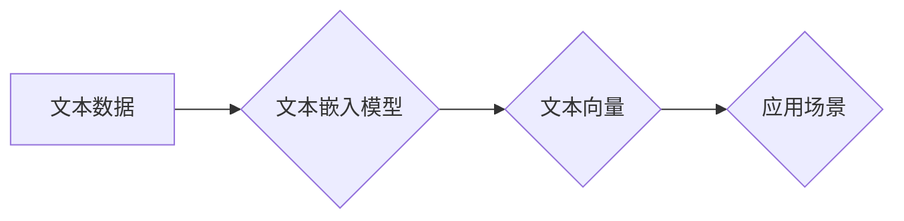

## 【LangChain编程：从入门到实践】文本嵌入

> 关键词：文本嵌入、LangChain、向量化、相似度计算、自然语言处理、机器学习、深度学习

### 1. 背景介绍

在当今数据爆炸的时代，文本数据已成为信息的主要来源。如何有效地处理和理解这些文本数据对于人工智能的发展至关重要。文本嵌入技术应运而生，它将文本映射到低维向量空间中，使得文本可以被机器理解和操作。

文本嵌入技术在自然语言处理 (NLP) 领域有着广泛的应用，例如：

* **文本相似度计算:** 衡量两个文本之间的语义相似度，例如搜索引擎中的相关性排名、推荐系统中的物品相似度计算等。
* **文本分类:** 将文本归类到预定义的类别中，例如垃圾邮件过滤、情感分析等。
* **文本聚类:** 将文本按照语义相似度进行分组，例如文档聚类、主题提取等。
* **问答系统:** 基于文本嵌入，构建能够理解用户问题并给出准确答案的问答系统。

LangChain 是一个强大的开源框架，旨在简化大型语言模型 (LLM) 的开发和应用。它提供了丰富的工具和组件，可以帮助开发者构建各种基于 LLM 的应用程序，包括文本嵌入相关的应用。

### 2. 核心概念与联系

文本嵌入的核心概念是将文本映射到一个低维向量空间中，使得文本之间的语义关系能够在向量空间中体现出来。

**文本嵌入的原理:**

* **词向量:** 将每个单词映射到一个向量，向量中的每个维度代表单词的某个特征。
* **句子向量:** 将一个句子中的所有词向量进行聚合，得到一个代表整个句子的向量。

**LangChain 与文本嵌入的联系:**

LangChain 提供了多种文本嵌入模型，例如 OpenAI 的 Embeddings API、HuggingFace 的 SentenceTransformers 等。开发者可以根据自己的需求选择合适的模型，并将其集成到 LangChain 中。

**Mermaid 流程图:**



### 3. 核心算法原理 & 具体操作步骤

#### 3.1  算法原理概述

常见的文本嵌入算法包括 Word2Vec、GloVe 和 FastText 等。这些算法都基于神经网络，通过训练大量的文本数据，学习到每个单词的语义表示。

* **Word2Vec:** 是一种基于神经网络的词向量模型，它通过预测上下文词来学习单词的语义表示。Word2Vec 有两种主要的架构：CBOW (Continuous Bag-of-Words) 和 Skip-gram。
* **GloVe (Global Vectors for Word Representation):** 是一种基于全局词共现矩阵的词向量模型，它通过最大化词共现概率来学习单词的语义表示。
* **FastText:** 是一种基于字符级词向量的模型，它可以处理罕见词和不同语言的文本。

#### 3.2  算法步骤详解

以 Word2Vec 为例，其训练过程可以概括为以下步骤：

1. **数据预处理:** 将文本数据进行分词、去停用词等预处理操作。
2. **构建词向量模型:** 根据 Word2Vec 的架构 (CBOW 或 Skip-gram) 构建神经网络模型。
3. **训练模型:** 使用训练数据训练模型，通过反向传播算法更新模型参数。
4. **获取词向量:** 训练完成后，模型会输出每个单词的词向量表示。

#### 3.3  算法优缺点

**Word2Vec:**

* **优点:** 训练速度快，效果好。
* **缺点:** 无法处理长距离依赖关系。

**GloVe:**

* **优点:** 可以捕捉到全局的语义关系。
* **缺点:** 训练时间较长。

**FastText:**

* **优点:** 可以处理罕见词和不同语言的文本。
* **缺点:** 词向量维度较高，计算量较大。

#### 3.4  算法应用领域

文本嵌入算法广泛应用于以下领域:

* **搜索引擎:** 提高搜索结果的准确性和相关性。
* **推荐系统:** 推荐用户可能感兴趣的物品。
* **机器翻译:** 提高机器翻译的准确性和流畅度。
* **问答系统:** 构建能够理解用户问题并给出准确答案的问答系统。

### 4. 数学模型和公式 & 详细讲解 & 举例说明

#### 4.1  数学模型构建

Word2Vec 的核心数学模型是神经网络，其结构可以分为输入层、隐藏层和输出层。

* **输入层:** 接收单词的 one-hot 编码。
* **隐藏层:** 使用非线性激活函数对输入进行处理，学习单词的语义表示。
* **输出层:** 输出预测的上下文词的概率分布。

#### 4.2  公式推导过程

Word2Vec 的目标是最大化上下文词的预测概率。可以使用交叉熵损失函数来衡量模型的预测误差。

$$
Loss = -\sum_{w \in context(w_t)} \log p(w \mid w_t)
$$

其中：

* $w_t$ 是目标词。
* $context(w_t)$ 是目标词的上下文词。
* $p(w \mid w_t)$ 是模型预测上下文词 $w$ 的概率。

#### 4.3  案例分析与讲解

假设我们有一个句子 "The cat sat on the mat"，目标词是 "cat"。

* **CBOW 架构:** 输入层接收 "The"、"sat" 和 "on" 的 one-hot 编码，隐藏层学习 "cat" 的语义表示，输出层预测 "cat" 的概率。
* **Skip-gram 架构:** 输入层接收 "cat" 的 one-hot 编码，隐藏层学习 "cat" 的语义表示，输出层预测 "The"、"sat" 和 "on" 的概率。

### 5. 项目实践：代码实例和详细解释说明

#### 5.1  开发环境搭建

* Python 3.7+
* LangChain 0.0.20+
* OpenAI API key

#### 5.2  源代码详细实现

```python
from langchain.embeddings import OpenAIEmbeddings
from langchain.text_splitter import CharacterTextSplitter

# 初始化 OpenAI Embeddings 模型
embeddings = OpenAIEmbeddings()

# 初始化文本分割器
text_splitter = CharacterTextSplitter(chunk_size=1000, chunk_overlap=0)

# 文本数据
text = "The quick brown fox jumps over the lazy dog."

# 分割文本
chunks = text_splitter.split_text(text)

# 获取文本嵌入
embeddings_list = [embeddings.embed_documents([chunk]) for chunk in chunks]

# 打印嵌入向量
for embedding in embeddings_list:
    print(embedding)
```

#### 5.3  代码解读与分析

* 首先，我们导入必要的库，包括 `OpenAIEmbeddings` 和 `CharacterTextSplitter`。
* 然后，我们初始化 OpenAI Embeddings 模型和文本分割器。
* 接下来，我们定义文本数据，并使用文本分割器将其分割成多个小块。
* 然后，我们使用 `embeddings.embed_documents()` 方法获取每个文本块的嵌入向量。
* 最后，我们打印嵌入向量。

#### 5.4  运行结果展示

运行代码后，会输出每个文本块的嵌入向量。这些向量是低维的，可以用于计算文本之间的相似度。

### 6. 实际应用场景

#### 6.1  搜索引擎

文本嵌入可以用于提高搜索引擎的准确性和相关性。例如，可以使用文本嵌入来计算用户查询和文档之间的相似度，从而返回更相关的搜索结果。

#### 6.2  推荐系统

文本嵌入可以用于推荐用户可能感兴趣的物品。例如，可以使用文本嵌入来计算用户历史行为和物品描述之间的相似度，从而推荐用户可能喜欢的物品。

#### 6.3  问答系统

文本嵌入可以用于构建能够理解用户问题并给出准确答案的问答系统。例如，可以使用文本嵌入来计算用户问题和知识库中的文本之间的相似度，从而找到最相关的答案。

#### 6.4  未来应用展望

文本嵌入技术在未来将有更广泛的应用，例如：

* **个性化教育:** 根据学生的学习风格和进度，提供个性化的学习内容和建议。
* **医疗诊断:** 分析患者的病历和症状，辅助医生进行诊断。
* **法律分析:** 分析法律文件和案例，辅助律师进行法律研究和诉讼。

### 7. 工具和资源推荐

#### 7.1  学习资源推荐

* **HuggingFace:** https://huggingface.co/
* **OpenAI:** https://openai.com/
* **Stanford NLP Group:** https://nlp.stanford.edu/

#### 7.2  开发工具推荐

* **LangChain:** https://python.langchain.com/
* **Transformers:** https://huggingface.co/docs/transformers/index

#### 7.3  相关论文推荐

* **Word2Vec:** https://arxiv.org/abs/1301.3781
* **GloVe:** https://nlp.stanford.edu/pubs/glove.pdf
* **FastText:** https://arxiv.org/abs/1607.04606

### 8. 总结：未来发展趋势与挑战

#### 8.1  研究成果总结

文本嵌入技术取得了显著的进展，能够有效地捕捉文本的语义信息。

#### 8.2  未来发展趋势

* **多模态文本嵌入:** 将文本与其他模态数据 (例如图像、音频) 融合，构建更丰富的文本表示。
* **动态文本嵌入:** 能够根据上下文动态更新文本嵌入，更好地捕捉文本的语义变化。
* **可解释性文本嵌入:** 能够解释文本嵌入的生成过程，提高模型的可解释性。

#### 8.3  面临的挑战

* **数据稀疏性:** 许多领域的数据稀疏，难以训练高质量的文本嵌入模型。
* **计算成本:** 训练大型文本嵌入模型需要大量的计算资源。
* **公平性与偏见:** 文本嵌入模型可能存在公平性与偏见问题，需要进行更深入的研究和解决。

#### 8.4  研究展望

未来，文本嵌入技术将继续发展，并在更多领域得到应用。研究者将继续探索新的算法和模型，提高文本嵌入的质量和效率，并解决文本嵌入技术面临的挑战。

### 9. 附录：常见问题与解答

#### 9.1  常见问题

* **什么是文本嵌入？**

文本嵌入是一种将文本映射到低维向量空间的技术，使得文本可以被机器理解和操作。

* **文本嵌入有什么应用场景？**

文本嵌入广泛应用于搜索引擎、推荐系统、问答系统等领域。

* **如何选择合适的文本嵌入模型？**

选择合适的文本嵌入模型需要根据具体的应用场景和数据特点进行考虑。

* **如何评估文本嵌入模型的性能？**

可以使用文本相似度计算、文本分类等任务来评估文本嵌入模型的性能。


作者：禅与计算机程序设计艺术 / Zen and the Art of Computer Programming 
