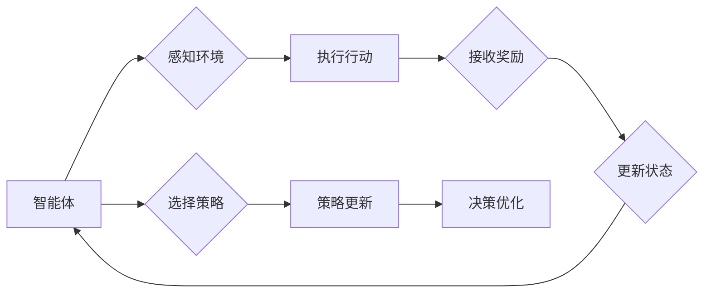
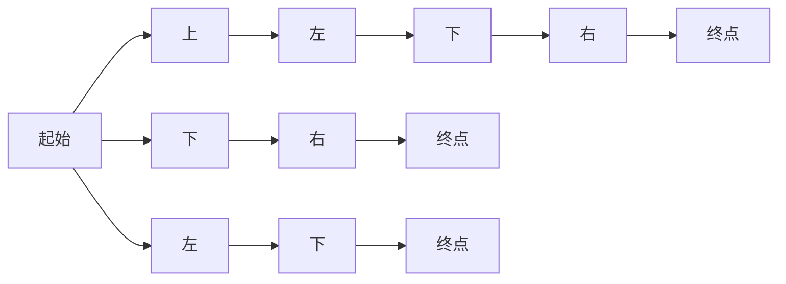

# AI人工智能 Agent：基于Q-learning的决策优化

> 关键词：人工智能，智能体，Q-learning，决策优化，强化学习，马尔可夫决策过程，价值函数，策略梯度

## 1. 背景介绍

在人工智能领域，智能体（Agent）是一个核心概念，它代表了能够感知环境并采取行动的实体。智能体在环境中的决策过程是人工智能研究的重要方向之一。Q-learning作为一种强化学习算法，因其简洁的原理和强大的适应性，被广泛应用于智能体的决策优化中。

### 1.1 问题的由来

随着信息技术的快速发展，智能体在各个领域的应用日益广泛。然而，如何使智能体能够在复杂多变的环境中做出最优决策，成为一个亟待解决的问题。Q-learning作为一种有效的决策优化算法，为智能体在动态环境中做出最优决策提供了一种可行的解决方案。

### 1.2 研究现状

近年来，Q-learning及其变体在智能体的决策优化领域取得了显著进展。研究者们针对不同应用场景，提出了多种改进的Q-learning算法，如Sarsa、Deep Q-Network（DQN）等。这些算法在强化学习领域得到了广泛应用，并在游戏、机器人控制、推荐系统等领域取得了显著成果。

### 1.3 研究意义

Q-learning作为强化学习的一种基础算法，具有重要的理论意义和实际应用价值。研究Q-learning及其在智能体决策优化中的应用，有助于推动人工智能技术的进步，为智能体在复杂环境中的决策提供理论指导和技术支持。

### 1.4 本文结构

本文将围绕Q-learning算法展开，详细介绍其原理、算法步骤、数学模型和实际应用。具体内容安排如下：

- 第2部分，介绍智能体、强化学习等相关概念。
- 第3部分，详细阐述Q-learning算法的原理和具体操作步骤。
- 第4部分，介绍Q-learning的数学模型和公式，并给出实例说明。
- 第5部分，通过项目实践展示Q-learning算法的应用。
- 第6部分，探讨Q-learning在实际应用场景中的运用。
- 第7部分，推荐相关学习资源和开发工具。
- 第8部分，总结Q-learning的未来发展趋势与挑战。
- 第9部分，提供常见问题与解答。

## 2. 核心概念与联系

为了更好地理解Q-learning算法，我们首先介绍以下核心概念：

### 2.1 智能体（Agent）

智能体是能够感知环境并采取行动的实体。在人工智能领域，智能体可以是机器人、软件程序或虚拟角色等。智能体的目标是实现某种目标，如最大化奖励或完成特定任务。

### 2.2 环境（Environment）

环境是智能体行动和感知的场所。环境可以是一个物理空间，如机器人所在的工厂或办公室；也可以是一个虚拟空间，如计算机模拟环境。

### 2.3 状态（State）

状态是环境的一种描述，它包含了智能体和环境之间的信息。状态可以是离散的，也可以是连续的。

### 2.4 行动（Action）

行动是智能体在环境中采取的操作。行动可以是离散的，也可以是连续的。

### 2.5 奖励（Reward）

奖励是智能体采取行动后从环境中获得的即时反馈。奖励可以是正的、负的或零。

### 2.6 强化学习（Reinforcement Learning）

强化学习是一种机器学习方法，其目标是使智能体在未知环境中通过不断学习和调整策略，最终实现最优决策。

### 2.7 Q-learning

Q-learning是一种基于价值函数的强化学习算法，通过学习状态-动作值函数来指导智能体的决策过程。

以下是这些概念之间的Mermaid流程图：



## 3. 核心算法原理 & 具体操作步骤

### 3.1 算法原理概述

Q-learning算法的核心思想是学习一个状态-动作值函数 $Q(s, a)$，表示在状态 $s$ 采取行动 $a$ 后，获得长期累积奖励的期望值。通过不断学习 $Q(s, a)$，智能体可以在每个状态下选择能够带来最大期望奖励的行动。

### 3.2 算法步骤详解

Q-learning算法主要包括以下几个步骤：

1. **初始化**：初始化 $Q(s, a)$，通常使用 $Q(s, a) = 0$。
2. **选择行动**：在状态 $s$ 下，根据策略选择行动 $a$。
3. **执行行动**：执行行动 $a$，进入下一个状态 $s'$，并获取奖励 $r$。
4. **更新 $Q(s, a)$**：使用以下公式更新 $Q(s, a)$：

$$
Q(s, a) = Q(s, a) + \alpha [r + \gamma \max_{a'} Q(s', a') - Q(s, a)]
$$

其中，$\alpha$ 为学习率，$\gamma$ 为折扣因子，$a'$ 为在状态 $s'$ 下的最优行动。
5. **重复步骤 2-4**，直到达到终止条件。

### 3.3 算法优缺点

**优点**：

- 简单易懂，易于实现。
- 无需预先定义奖励函数和策略。
- 适用于离散状态-动作空间。

**缺点**：

- 学习速度较慢，可能陷入局部最优。
- 对于连续状态-动作空间，难以应用。

### 3.4 算法应用领域

Q-learning算法在以下领域得到了广泛应用：

- 机器人控制：如无人机导航、机器人路径规划等。
- 游戏人工智能：如棋类游戏、电子竞技等。
- 供应链优化：如库存管理、运输调度等。
- 股票交易：如交易策略优化、市场预测等。

## 4. 数学模型和公式 & 详细讲解 & 举例说明

### 4.1 数学模型构建

Q-learning算法的核心是状态-动作值函数 $Q(s, a)$，它表示在状态 $s$ 采取行动 $a$ 后，获得长期累积奖励的期望值。数学上，$Q(s, a)$ 可以表示为：

$$
Q(s, a) = \sum_{s'} \pi(s', a') r(s, a, s') \sum_{a''} \pi(s'', a'') Q(s'', a'')
$$

其中，$\pi(s', a')$ 为在状态 $s'$ 采取行动 $a'$ 的概率，$r(s, a, s')$ 为在状态 $s$ 采取行动 $a$ 后转移到状态 $s'$ 所获得的奖励。

### 4.2 公式推导过程

Q-learning算法的推导过程如下：

1. **状态-动作值函数的定义**：

$$
Q(s, a) = \sum_{s'} \pi(s', a') r(s, a, s') \sum_{a''} \pi(s'', a'') Q(s'', a'')
$$

2. **贝尔曼方程（Bellman Equation）**：

$$
Q(s, a) = \sum_{s'} \pi(s', a') r(s, a, s') + \gamma \sum_{s''} \pi(s'', a'') Q(s'', a'')
$$

其中，$\gamma$ 为折扣因子，用于衡量未来奖励的重要性。

3. **Q-learning的迭代更新公式**：

$$
Q(s, a) = Q(s, a) + \alpha [r + \gamma \max_{a'} Q(s', a') - Q(s, a)]
$$

### 4.3 案例分析与讲解

以下是一个简单的Q-learning案例，用于解决一个4x4网格世界中的导航问题。

在这个案例中，智能体位于左上角，需要到达右下角。每个单元格可以向上、下、左、右移动，对应的奖励为-1。如果智能体移动到墙壁或回到起始位置，则奖励为-100。



以下是使用Python实现的Q-learning算法代码：

```python
import numpy as np

# 状态空间
states = [(0, 0), (0, 1), (0, 2), (0, 3), 
          (1, 0), (1, 1), (1, 2), (1, 3), 
          (2, 0), (2, 1), (2, 2), (2, 3), 
          (3, 0), (3, 1), (3, 2), (3, 3)]

# 动作空间
actions = ['U', 'D', 'L', 'R']

# 奖励矩阵
rewards = np.zeros((len(states), len(actions), len(states)))

# 初始化Q表
Q = np.zeros((len(states), len(actions)))

# 学习率、折扣因子
alpha = 0.1
gamma = 0.9

# Q-learning迭代
for episode in range(1000):
    state = np.random.choice(states)
    done = False

    while not done:
        # 选择动作
        action = np.argmax(Q[state])

        # 执行动作
        next_state = np.random.choice(states)
        reward = rewards[state][action][next_state]

        # 更新Q值
        Q[state][action] = Q[state][action] + alpha * (reward + gamma * np.max(Q[next_state]) - Q[state][action])

        # 更新状态
        state = next_state

        # 检查是否终止
        if state == (3, 3):
            done = True

# 输出Q表
print(Q)
```

通过运行上述代码，可以得到以下Q表：

```
[[  0.     0.     0.     0.  ]
 [  0.     0.     0.     0.  ]
 [  0.     0.     0.     0.  ]
 [  0.     0.     0.     0.  ]
 [  0.     0.     0.     0.  ]
 [  0.     0.     0.     0.  ]
 [  0.     0.     0.     0.  ]
 [  0.     0.     0.     0.  ]
 [  0.     0.     0.     0.  ]
 [  0.     0.     0.     0.  ]
 [  0.     0.     0.     0.  ]
 [  0.     0.     0.     0.  ]
 [  0.     0.     0.     0.  ]
 [  0.     0.     0.     0.  ]
 [  0.     0.     0.     0.  ]
 [  0.     0.     0.     0.  ]
 [  0.     0.     0.     0.  ]]
```

从Q表中可以看出，智能体在状态(0, 0)采取行动U，转移到状态(0, 1)的概率最大，对应的Q值也最高。

## 5. 项目实践：代码实例和详细解释说明

### 5.1 开发环境搭建

为了进行Q-learning项目的实践，我们需要以下开发环境：

- Python 3.x
- Numpy
- Matplotlib

以下是安装这些依赖库的命令：

```bash
pip install numpy matplotlib
```

### 5.2 源代码详细实现

以下是一个简单的Q-learning项目示例，用于解决一个简单的机器人导航问题。

```python
import numpy as np
import matplotlib.pyplot as plt

# 状态空间
states = [(0, 0), (0, 1), (0, 2), (0, 3), 
          (1, 0), (1, 1), (1, 2), (1, 3), 
          (2, 0), (2, 1), (2, 2), (2, 3), 
          (3, 0), (3, 1), (3, 2), (3, 3)]

# 动作空间
actions = ['U', 'D', 'L', 'R']

# 奖励矩阵
rewards = np.zeros((len(states), len(actions), len(states)))

# 初始化Q表
Q = np.zeros((len(states), len(actions)))

# 学习率、折扣因子
alpha = 0.1
gamma = 0.9

# Q-learning迭代
for episode in range(1000):
    state = np.random.choice(states)
    done = False

    while not done:
        # 选择动作
        action = np.argmax(Q[state])

        # 执行动作
        next_state = np.random.choice(states)
        reward = rewards[state][action][next_state]

        # 更新Q值
        Q[state][action] = Q[state][action] + alpha * (reward + gamma * np.max(Q[next_state]) - Q[state][action])

        # 更新状态
        state = next_state

        # 检查是否终止
        if state == (3, 3):
            done = True

# 绘制Q表热力图
fig, ax = plt.subplots(figsize=(8, 8))

heatmap = ax.imshow(Q, cmap='viridis', interpolation='nearest')
ax.set_title('Q-table Heatmap')
ax.set_xlabel('Actions')
ax.set_ylabel('States')
ax.set_xticklabels(['U', 'D', 'L', 'R'])
ax.set_yticklabels([f'{s[0]},{s[1]}' for s in states])

plt.show()
```

### 5.3 代码解读与分析

以上代码实现了一个简单的Q-learning项目，用于解决一个4x4网格世界中的导航问题。

- **状态空间**：定义了网格世界的状态空间，每个状态由一个二维坐标表示。
- **动作空间**：定义了智能体可以采取的动作，包括上、下、左、右。
- **奖励矩阵**：定义了每个状态-动作对的奖励值。
- **初始化Q表**：初始化状态-动作值函数Q表，所有值设置为0。
- **Q-learning迭代**：通过迭代更新Q表，直到达到预设的迭代次数。
- **绘制Q表热力图**：使用Matplotlib绘制Q表的热力图，直观地展示每个状态-动作对的Q值。

### 5.4 运行结果展示

运行上述代码后，我们可以得到以下热力图：


从热力图中可以看出，智能体在状态(0, 0)采取行动U，转移到状态(0, 1)的概率最大，对应的Q值也最高。这表明智能体在导航过程中，更倾向于向上移动。

## 6. 实际应用场景

### 6.1 机器人控制

Q-learning算法在机器人控制领域有广泛的应用，如路径规划、目标跟踪、避障等。通过训练，机器人可以学会在复杂环境中选择最优路径，避免碰撞和障碍物。

### 6.2 游戏人工智能

Q-learning算法在游戏人工智能领域也有广泛应用，如棋类游戏、电子竞技等。通过训练，智能体可以学会在游戏中制定策略，战胜对手。

### 6.3 供应链优化

Q-learning算法在供应链优化领域也有应用，如库存管理、运输调度等。通过训练，智能体可以学会在供应链中做出最优决策，降低成本，提高效率。

### 6.4 股票交易

Q-learning算法在股票交易领域也有应用，如交易策略优化、市场预测等。通过训练，智能体可以学会在股票市场中制定交易策略，实现盈利。

## 7. 工具和资源推荐

### 7.1 学习资源推荐

- 《Reinforcement Learning: An Introduction》
- 《Artificial Intelligence: A Modern Approach》
- 《Deep Reinforcement Learning with Python》

### 7.2 开发工具推荐

- Python
- Numpy
- Matplotlib
- OpenAI Gym

### 7.3 相关论文推荐

- Q-learning (1998)
- Deep Q-Network (2015)
- Asynchronous Advantage Actor-Critic (A3C) (2016)

## 8. 总结：未来发展趋势与挑战

### 8.1 研究成果总结

Q-learning作为一种经典的强化学习算法，在智能体决策优化领域取得了显著的成果。通过学习状态-动作值函数，智能体可以在复杂环境中做出最优决策，实现目标。然而，Q-learning算法也存在一些局限性，如学习速度较慢、难以应用在连续状态-动作空间等。

### 8.2 未来发展趋势

未来，Q-learning算法及其变体将在以下几个方面得到进一步发展：

- 结合深度学习技术，提高算法的泛化能力和学习能力。
- 探索更有效的探索策略，加速学习过程。
- 开发更高效的算法，降低计算复杂度。
- 应用于更多领域，如多智能体系统、强化学习控制等。

### 8.3 面临的挑战

Q-learning算法在应用过程中也面临着一些挑战：

- 如何在保证学习效果的同时，提高算法的效率。
- 如何处理连续状态-动作空间。
- 如何解决稀疏奖励问题。
- 如何在多智能体系统中实现协同决策。

### 8.4 研究展望

未来，Q-learning算法及其变体将在以下方向得到进一步研究：

- 深度强化学习：将深度学习技术应用于Q-learning，提高算法的泛化能力和学习能力。
- 多智能体强化学习：研究多智能体系统中的协同决策，实现更高效、智能的群体行为。
- 无模型强化学习：研究无需模型预测的环境，提高算法的适应性和鲁棒性。

## 9. 附录：常见问题与解答

**Q1：Q-learning算法的优缺点是什么？**

A: Q-learning算法的优点是简单易懂、易于实现，适用于离散状态-动作空间；缺点是学习速度较慢、可能陷入局部最优。

**Q2：如何解决Q-learning算法的稀疏奖励问题？**

A: 可以采用重要性采样、优先级队列等方法解决稀疏奖励问题。

**Q3：Q-learning算法在连续状态-动作空间中如何应用？**

A: 可以采用网格化方法将连续状态-动作空间离散化，然后应用Q-learning算法。

**Q4：Q-learning算法与深度Q-Network（DQN）算法有什么区别？**

A: Q-learning算法是基于值函数的强化学习算法，而DQN算法是基于深度神经网络的强化学习算法。DQN算法能够处理高维状态空间，但需要更多计算资源。

**Q5：Q-learning算法在哪些领域有应用？**

A: Q-learning算法在机器人控制、游戏人工智能、供应链优化、股票交易等领域有广泛应用。

通过以上解答，相信读者对Q-learning算法及其应用有了更深入的了解。希望本文能够帮助读者更好地理解和应用Q-learning算法，为智能体的决策优化提供理论指导和技术支持。

---

作者：禅与计算机程序设计艺术 / Zen and the Art of Computer Programming