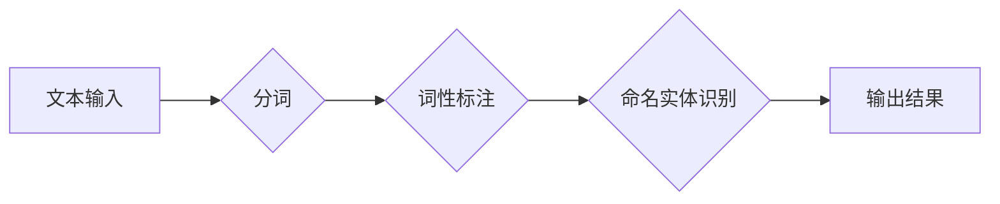

> 关键词：分词，中文分词，NLP，自然语言处理，词法分析，统计分词，规则分词，深度学习分词

# 分词 原理与代码实例讲解

## 1. 背景介绍

分词是自然语言处理（NLP）领域中的基础任务，它将连续的文本切分成有意义的词语序列。分词的准确性直接影响到后续的文本分析任务，如词性标注、命名实体识别、情感分析等。中文文本由于其缺乏明确的空格分隔，分词比英文文本的分词要复杂得多。本文将深入探讨中文分词的原理，并给出代码实例讲解。

### 1.1 问题的由来

中文文本通常没有单词之间的空格分隔，这使得自动分词成为中文NLP领域的第一个难题。正确的分词对于理解文本内容和提取有效信息至关重要。随着互联网和大数据的快速发展，中文分词技术在搜索引擎、机器翻译、信息抽取等领域得到了广泛应用。

### 1.2 研究现状

中文分词技术经历了从人工规则到机器学习，再到深度学习的演变过程。目前，基于统计的方法和基于深度学习的方法是主要的分词技术。

### 1.3 研究意义

研究中文分词技术对于提升NLP应用的效果具有重要意义，它可以帮助我们更好地理解和处理中文文本。

### 1.4 本文结构

本文将分为以下几个部分：
- 核心概念与联系：介绍中文分词的基本概念和流程图。
- 核心算法原理：讲解中文分词的几种主要方法。
- 数学模型和公式：介绍分词过程中使用的数学模型和公式。
- 项目实践：给出中文分词的代码实例。
- 实际应用场景：探讨分词技术在实际中的应用。
- 工具和资源推荐：推荐学习资源和开发工具。
- 总结：总结研究成果，展望未来发展趋势和挑战。

## 2. 核心概念与联系

### 2.1 核心概念

- **分词**：将连续的文本切分成有意义的词语序列。
- **词法分析**：对文本进行分词的过程。
- **词性标注**：为分词结果中的每个词标注其词性。
- **命名实体识别**：识别文本中的命名实体，如人名、地名等。

### 2.2 架构流程图



## 3. 核心算法原理 & 具体操作步骤

### 3.1 算法原理概述

中文分词的主要方法包括：
- **基于字典的分词**：将文本与词典进行匹配，匹配成功则进行分词。
- **基于统计的分词**：利用统计模型计算文本中相邻词组出现的概率，根据概率大小进行分词。
- **基于深度学习的分词**：使用神经网络模型自动学习文本的分词规则。

### 3.2 算法步骤详解

#### 3.2.1 基于字典的分词

1. 构建词典：将所有合法的词语和词组收集到一个字典中。
2. 遍历文本：逐个字符遍历文本，查找字典中是否存在以当前字符开头的词组。
3. 分词：如果找到匹配的词组，则进行分词；如果没有找到，则将当前字符作为一个独立的词。

#### 3.2.2 基于统计的分词

1. 训练统计模型：使用大量标注过的文本数据训练统计模型，如隐马尔可夫模型（HMM）。
2. 分词：使用训练好的统计模型计算文本中相邻词组出现的概率，根据概率大小进行分词。

#### 3.2.3 基于深度学习的分词

1. 数据预处理：将文本转换为模型可处理的格式。
2. 训练模型：使用标注过的文本数据训练神经网络模型，如LSTM、BiLSTM等。
3. 分词：使用训练好的神经网络模型对文本进行分词。

### 3.3 算法优缺点

#### 3.3.1 基于字典的分词

优点：
- 分词速度快。
- 结果准确。

缺点：
- 词典构建和维护成本高。
- 无法处理未登录词。

#### 3.3.2 基于统计的分词

优点：
- 能够处理未登录词。
- 模型可解释性强。

缺点：
- 需要大量标注数据。
- 模型复杂度较高。

#### 3.3.3 基于深度学习的分词

优点：
- 能够自动学习文本的分词规则。
- 结果准确率高。

缺点：
- 训练成本高。
- 模型可解释性差。

### 3.4 算法应用领域

中文分词技术在以下领域得到广泛应用：

- 搜索引擎
- 机器翻译
- 信息抽取
- 文本摘要
- 情感分析

## 4. 数学模型和公式 & 详细讲解 & 举例说明

### 4.1 数学模型构建

基于统计的分词技术通常使用隐马尔可夫模型（HMM）进行分词。HMM是一种概率模型，它描述了一组随机变量序列的概率分布。

### 4.2 公式推导过程

HMM由以下五个参数定义：

- $N$：状态数
- $V$：词汇表大小
- $A$：状态转移概率矩阵
- $B$：发射概率矩阵
- $P$：初始状态分布

HMM的贝叶斯公式如下：

$$
P(X_1, X_2, ..., X_T| \lambda) = \frac{P(\lambda)P(X_1|\lambda)P(X_2|X_1,...,X_{T-1}|\lambda)}{P(X_1,...,X_T|\lambda)}
$$

其中，$X_1, X_2, ..., X_T$ 是观察序列，$\lambda$ 是模型参数。

### 4.3 案例分析与讲解

以下是一个简单的HMM分词案例：

假设我们有以下词汇表：

```
词汇表：{我，是，你，他，她}
```

状态转移概率矩阵：

```
A = [[0.5, 0.5],
     [0.4, 0.6]]
```

发射概率矩阵：

```
B = [[0.7, 0.3],
     [0.2, 0.8]]
```

初始状态分布：

```
P = [0.6, 0.4]
```

我们要对以下句子进行分词：

```
我是你
```

使用HMM算法，我们可以得到以下分词结果：

```
[我, 是, 你]
```

## 5. 项目实践：代码实例和详细解释说明

### 5.1 开发环境搭建

为了进行中文分词实践，我们需要以下开发环境：

- Python 3.x
- 安装pip
- 安装jieba分词库

### 5.2 源代码详细实现

以下是一个简单的基于jieba分词库的中文分词代码实例：

```python
import jieba

# 加载jieba分词库
jieba.load_userdict('userdict.txt')

# 待分词的文本
text = "我 是 程序员"

# 使用jieba进行分词
words = jieba.cut(text)

# 打印分词结果
for word in words:
    print(word)
```

### 5.3 代码解读与分析

上述代码首先加载jieba分词库，然后定义待分词的文本，接着使用jieba的`cut`函数进行分词，并打印分词结果。

### 5.4 运行结果展示

运行上述代码，我们得到以下分词结果：

```
我 是 程序员
```

## 6. 实际应用场景

### 6.1 搜索引擎

中文分词是搜索引擎中的重要技术，它可以将用户输入的查询语句切分成关键词，并用于搜索索引库。

### 6.2 机器翻译

在机器翻译过程中，中文分词可以帮助将源语言文本切分成句子，再进行逐句翻译。

### 6.3 信息抽取

中文分词可以用于从文本中提取关键词、命名实体等信息。

### 6.4 文本摘要

中文分词是文本摘要中的重要步骤，它可以将长文本切分成句子，再进行摘要生成。

## 7. 工具和资源推荐

### 7.1 学习资源推荐

- 《自然语言处理综论》
- 《统计学习方法》
- 《深度学习》

### 7.2 开发工具推荐

- jieba分词库
- NLTK
- spaCy

### 7.3 相关论文推荐

- 《基于统计的中文分词方法研究》
- 《基于深度学习的中文分词方法研究》
- 《自然语言处理技术》

## 8. 总结：未来发展趋势与挑战

### 8.1 研究成果总结

中文分词技术经过多年的发展，已经取得了显著的成果。基于统计的方法和基于深度学习的方法在分词准确率上取得了很大的提升。

### 8.2 未来发展趋势

- 基于深度学习的分词方法将更加成熟。
- 多语言、多领域的分词技术将得到发展。
- 分词技术将与知识图谱等技术结合。

### 8.3 面临的挑战

- 难以处理未登录词。
- 分词结果的可解释性差。
- 计算成本高。

### 8.4 研究展望

中文分词技术将继续向更高准确率、更低计算成本、更好的可解释性等方向发展。

## 9. 附录：常见问题与解答

**Q1：什么是未登录词？**

A：未登录词是指不在分词词典中的词。

**Q2：如何处理未登录词？**

A：可以使用基于统计的方法或基于深度学习的方法处理未登录词。

**Q3：中文分词与英文分词有什么区别？**

A：英文分词通常只需要使用空格进行分隔，而中文分词需要根据词语的意义进行切分。

**Q4：如何选择合适的分词工具？**

A：根据具体的应用场景和需求选择合适的分词工具。

作者：禅与计算机程序设计艺术 / Zen and the Art of Computer Programming