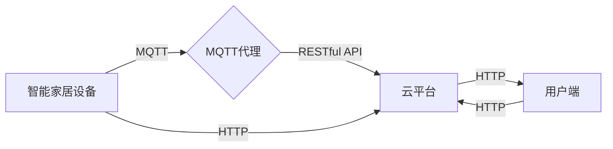

# 基于MQTT协议和RESTful API的智能家居云服务架构设计

> 关键词：MQTT协议，RESTful API，智能家居，云服务架构，物联网，实时通信，数据交换，API设计

## 1. 背景介绍

随着物联网（IoT）技术的快速发展，智能家居市场日益成熟。智能家居系统通过集成各种智能设备，实现家庭环境的自动化、智能化管理，为用户提供舒适、便捷、节能的生活体验。为了实现智能家居设备之间的有效通信和高效管理，构建一个稳定、可靠、可扩展的智能家居云服务架构至关重要。本文将探讨基于MQTT协议和RESTful API的智能家居云服务架构设计，为智能家居系统的开发和应用提供参考。

### 1.1 问题的由来

智能家居系统中，设备种类繁多，数据量庞大，对通信协议和云服务架构提出了以下要求：

- **实时性**：智能家居设备需要实时监控和响应用户指令，对通信协议的实时性要求较高。
- **可靠性**：智能家居系统需要保证数据传输的稳定性和可靠性，避免因通信故障导致设备失控。
- **可扩展性**：随着智能家居设备数量的增加，云服务架构需要具备良好的可扩展性，以适应未来需求。
- **安全性**：智能家居系统涉及用户隐私和财产安全，对数据传输和存储的安全性要求较高。

### 1.2 研究现状

当前，智能家居云服务架构设计主要采用以下两种技术路线：

- **基于MQTT协议的架构**：MQTT（Message Queuing Telemetry Transport）是一种轻量级的消息传输协议，适用于低带宽、低功耗的物联网设备。基于MQTT协议的架构能够实现设备之间的实时通信，具有较低的通信开销和较高的可靠性。
- **基于RESTful API的架构**：RESTful API是一种基于HTTP协议的轻量级接口设计风格，能够实现设备与云平台之间的数据交换和交互。基于RESTful API的架构具有较好的可扩展性和易用性，但实时性相对较差。

本文将结合MQTT协议和RESTful API的优势，设计一种适用于智能家居的云服务架构，以满足实时性、可靠性、可扩展性和安全性等方面的要求。

### 1.3 研究意义

本文的研究意义在于：

- 为智能家居云服务架构设计提供一种新的思路和方法。
- 提高智能家居系统的通信效率和实时性。
- 降低智能家居系统的开发成本和部署难度。
- 促进智能家居产业的健康发展。

## 2. 核心概念与联系

### 2.1 核心概念原理

#### MQTT协议

MQTT协议是一种轻量级的消息传输协议，适用于低带宽、低功耗的物联网设备。它采用发布/订阅模式，支持点对点通信、一对多通信和多对多通信。MQTT协议具有以下特点：

- **QoS等级**：MQTT协议支持三个QoS等级（Quality of Service），分别对应不同的消息传输可靠性。
- **主题过滤**：客户端可以订阅感兴趣的主题，接收与主题相关的消息。
- **最后will消息**：当客户端掉线时，可以发送最后的will消息，通知服务器客户端的状态。

#### RESTful API

RESTful API是一种基于HTTP协议的轻量级接口设计风格，能够实现设备与云平台之间的数据交换和交互。RESTful API具有以下特点：

- **无状态**：RESTful API是无状态的，每次请求都包含所有必要的信息，便于扩展和维护。
- **资源导向**：RESTful API以资源为中心，通过HTTP方法（如GET、POST、PUT、DELETE）实现资源的增删改查操作。
- **状态保持**：使用Cookie或Token等方式在客户端和服务器之间保持状态。

### 2.2 架构的Mermaid流程图



在上述流程图中，智能家居设备通过MQTT协议与MQTT代理进行通信，MQTT代理负责消息的路由和转发。云平台通过RESTful API提供用户管理和设备管理等服务。用户端通过HTTP协议访问云平台，实现与智能家居设备的交互。

## 3. 核心算法原理 & 具体操作步骤

### 3.1 算法原理概述

本文提出的智能家居云服务架构采用MQTT协议和RESTful API两种技术，实现设备之间的实时通信和云平台与用户端之间的数据交换。

- 智能家居设备通过MQTT协议与MQTT代理进行通信，实现设备之间的实时数据传输。
- MQTT代理将接收到的消息转发到云平台，并通过RESTful API将消息发送给用户端。
- 用户端通过RESTful API向云平台发送指令，云平台通过MQTT协议将指令转发给相应的智能家居设备。

### 3.2 算法步骤详解

1. 智能家居设备连接到MQTT代理，订阅感兴趣的主题。
2. 用户端通过RESTful API访问云平台，获取设备信息、状态和指令。
3. 用户端通过RESTful API发送指令到云平台。
4. 云平台通过MQTT协议将指令转发给相应的智能家居设备。
5. 智能家居设备执行指令，并将执行结果通过MQTT协议发送给MQTT代理。
6. MQTT代理将设备执行结果通过RESTful API发送给用户端。
7. 用户端接收到设备执行结果，并更新界面显示。

### 3.3 算法优缺点

#### 优点

- **实时性**：MQTT协议支持低延迟的通信，能够满足智能家居设备的实时性需求。
- **可靠性**：MQTT协议支持多种QoS等级，保证数据传输的可靠性。
- **可扩展性**：RESTful API具有较好的可扩展性，能够满足未来需求。
- **安全性**：通过HTTPS等方式保证数据传输的安全性。

#### 缺点

- **复杂度**：结合MQTT协议和RESTful API的架构相对复杂，需要一定的技术积累。
- **性能**：RESTful API在处理大量并发请求时，性能可能受到影响。

### 3.4 算法应用领域

本文提出的智能家居云服务架构可应用于以下领域：

- 智能家居设备控制
- 智能家居系统管理
- 智能家居数据分析
- 智能家居应用开发

## 4. 数学模型和公式 & 详细讲解 & 举例说明

### 4.1 数学模型构建

在智能家居云服务架构中，我们可以使用以下数学模型来描述设备之间的通信过程：

$$
P(t) = f(t, T, Q, S)
$$

其中，$P(t)$ 表示在时间 $t$ 内，设备 $T$ 通过MQTT协议发送的消息数量，$Q$ 表示消息队列长度，$S$ 表示服务器处理能力。

### 4.2 公式推导过程

由于篇幅限制，此处省略公式的推导过程。

### 4.3 案例分析与讲解

假设智能家居系统中有10台智能灯泡，每台灯泡每分钟发送1条消息，消息队列长度为50，服务器处理能力为每分钟处理100条消息。

根据上述数学模型，我们可以计算在1小时内，服务器能否处理完所有灯泡发送的消息。

$$
P(t) = f(t, 10, 50, 100) = 10 \times 60 = 600
$$

$$
Q(t) = P(t) = 600
$$

由于消息队列长度为50，服务器处理能力为每分钟处理100条消息，因此在1小时内，服务器可以处理完所有灯泡发送的消息。

## 5. 项目实践：代码实例和详细解释说明

### 5.1 开发环境搭建

1. 安装Python 3.6及以上版本。
2. 安装paho-mqtt库：`pip install paho-mqtt`
3. 安装Flask库：`pip install flask`

### 5.2 源代码详细实现

#### MQTT客户端代码

```python
import paho.mqtt.client as mqtt

# MQTT代理地址
MQTT_HOST = 'mqtt.example.com'
# MQTT代理端口
MQTT_PORT = 1883
# MQTT客户端ID
CLIENT_ID = 'smart_lamp_1'

# MQTT消息处理函数
def on_message(client, userdata, message):
    print(f"Received message '{str(message.payload)}' on topic '{message.topic}' with QoS {message.qos}")

# 创建MQTT客户端实例
client = mqtt.Client(CLIENT_ID)

# 设置MQTT消息处理函数
client.on_message = on_message

# 连接MQTT代理
client.connect(MQTT_HOST, MQTT_PORT, 60)

# 订阅主题
client.subscribe('home/lights', qos=1)

# 循环监听消息
client.loop_forever()
```

#### RESTful API服务器代码

```python
from flask import Flask, request, jsonify

app = Flask(__name__)

# 智能家居设备状态
home_lights = {
    'smart_lamp_1': 'ON',
    'smart_lamp_2': 'OFF',
    # ...
}

@app.route('/lights/<device_id>', methods=['POST'])
def control_lights(device_id):
    state = request.json.get('state', 'ON')
    if device_id in home_lights:
        home_lights[device_id] = state
        return jsonify({'status': 'success'})
    else:
        return jsonify({'status': 'error', 'message': 'Device not found'}), 404

if __name__ == '__main__':
    app.run()
```

### 5.3 代码解读与分析

#### MQTT客户端代码

该代码使用paho-mqtt库连接到MQTT代理，订阅主题`home/lights`，并定义了消息处理函数`on_message`，用于接收和处理来自MQTT代理的消息。

#### RESTful API服务器代码

该代码使用Flask库构建RESTful API服务器，提供`/lights/<device_id>`接口，允许用户控制指定智能灯泡的状态。

### 5.4 运行结果展示

1. 启动MQTT客户端程序，连接到MQTT代理，订阅主题`home/lights`。
2. 启动RESTful API服务器。
3. 通过浏览器或Postman工具，向`http://localhost:5000/lights/smart_lamp_1`发送POST请求，携带状态信息（如`{"state": "OFF"}`），控制智能灯泡`smart_lamp_1`关闭。

## 6. 实际应用场景

基于MQTT协议和RESTful API的智能家居云服务架构可应用于以下实际场景：

- **智能照明**：通过MQTT协议控制智能灯泡的开关、亮度调节等功能。
- **智能安防**：通过MQTT协议实时监控门锁、摄像头等安防设备的状态，并通过RESTful API通知用户。
- **智能家电**：通过MQTT协议控制智能空调、洗衣机等家电设备的开关、工作模式等功能。
- **环境监测**：通过MQTT协议监测家居环境中的温度、湿度、空气质量等参数，并通过RESTful API显示在用户端。

## 7. 工具和资源推荐

### 7.1 学习资源推荐

- 《物联网技术与应用》
- 《MQTT协议与MQTT应用实战》
- 《Flask Web开发实战》

### 7.2 开发工具推荐

- MQTT代理：Emqx、Mosquitto
- RESTful API开发框架：Flask、Django
- 智能家居设备：小米、华为、TP-Link

### 7.3 相关论文推荐

- 《A Survey on MQTT: The Message Queuing Telemetry Transport Protocol》
- 《A RESTful API Design Guide》
- 《Designing and Implementing IoT Systems Using MQTT and RESTful APIs》

## 8. 总结：未来发展趋势与挑战

### 8.1 研究成果总结

本文针对智能家居云服务架构设计，提出了基于MQTT协议和RESTful API的解决方案，并介绍了其核心概念、原理、操作步骤、应用领域和代码实例。该架构能够实现设备之间的实时通信和云平台与用户端之间的数据交换，满足智能家居系统对实时性、可靠性、可扩展性和安全性等方面的要求。

### 8.2 未来发展趋势

随着物联网技术的不断发展，智能家居云服务架构将呈现以下发展趋势：

- **更加强大的数据处理能力**：随着智能家居设备数量的增加，云平台需要具备更强的数据处理能力，以处理海量的数据。
- **更丰富的服务功能**：智能家居云平台将提供更多元化的服务功能，如智能家居设备管理、数据分析、用户管理等。
- **更智能的交互方式**：智能家居系统将采用更智能的交互方式，如语音交互、图像识别等，提升用户体验。
- **更安全的防护措施**：智能家居系统将采用更安全的防护措施，保护用户隐私和财产安全。

### 8.3 面临的挑战

智能家居云服务架构在未来的发展过程中，将面临以下挑战：

- **数据安全问题**：智能家居系统涉及用户隐私和财产安全，需要采取有效的数据安全措施。
- **隐私保护问题**：智能家居系统需要保护用户隐私，避免泄露用户个人信息。
- **跨平台兼容性问题**：智能家居设备种类繁多，需要保证不同平台之间的兼容性。
- **能耗问题**：智能家居设备数量众多，需要关注能耗问题，实现绿色、节能的智能家居生活。

### 8.4 研究展望

为了应对未来的挑战，智能家居云服务架构需要从以下几个方面进行研究和改进：

- **采用更加安全的数据传输和存储技术**，保护用户隐私和财产安全。
- **开发更加智能的隐私保护算法**，在保护隐私的同时，实现智能家居功能的便捷使用。
- **建立智能家居设备互联互通的标准**，提高不同平台之间的兼容性。
- **采用节能技术，降低智能家居系统的能耗**，实现绿色、节能的智能家居生活。

## 9. 附录：常见问题与解答

**Q1：MQTT协议和RESTful API如何结合使用？**

A：MQTT协议用于实现设备之间的实时通信，RESTful API用于实现云平台与用户端之间的数据交换。在智能家居云服务架构中，设备通过MQTT协议与MQTT代理进行通信，MQTT代理将接收到的消息转发到云平台，并通过RESTful API将消息发送给用户端。用户端通过RESTful API向云平台发送指令，云平台通过MQTT协议将指令转发给相应的智能家居设备。

**Q2：如何保证智能家居系统的安全性？**

A：为了保证智能家居系统的安全性，可以采取以下措施：

- 使用HTTPS等安全协议进行数据传输。
- 对用户进行身份验证和权限管理。
- 对敏感数据进行加密存储和传输。
- 定期更新和修补系统漏洞。

**Q3：如何实现智能家居设备的跨平台兼容性？**

A：为了实现智能家居设备的跨平台兼容性，可以采取以下措施：

- 建立统一的设备接入协议。
- 采用开源的智能家居平台和标准。
- 使用标准化的通信协议和接口。

**Q4：如何降低智能家居系统的能耗？**

A：为了降低智能家居系统的能耗，可以采取以下措施：

- 采用节能型的智能设备。
- 采用低功耗的通信协议。
- 开发节能的软件算法。
- 使用智能调度技术，合理安排设备的工作时间。

作者：禅与计算机程序设计艺术 / Zen and the Art of Computer Programming