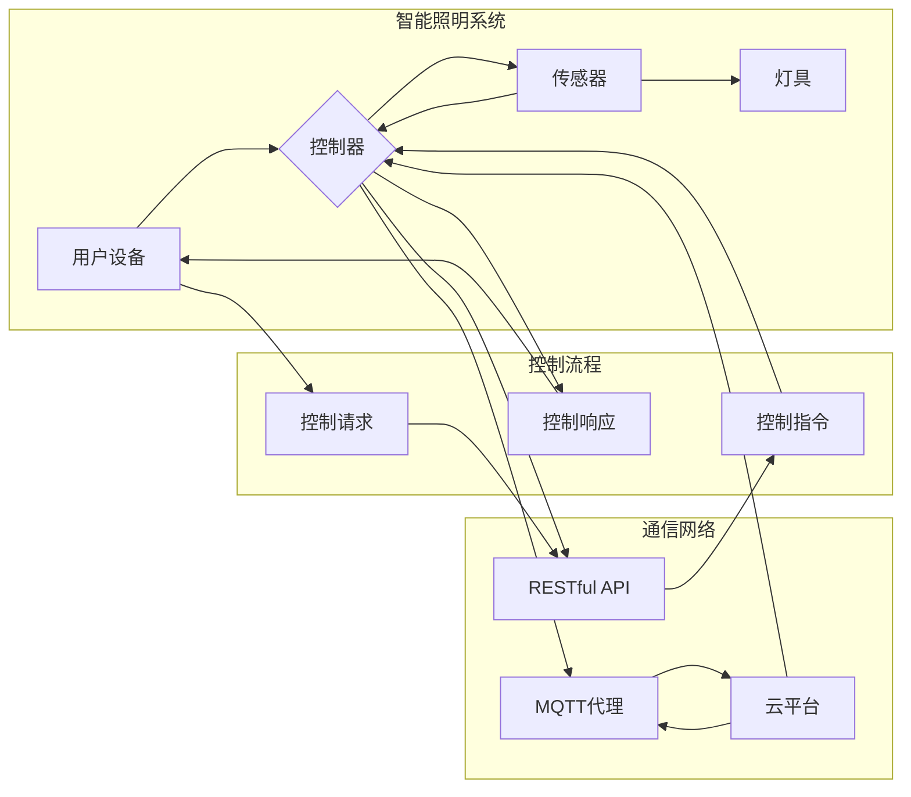

# 基于MQTT协议和RESTful API的智能照明控制系统设计

> 关键词：MQTT协议，RESTful API，智能照明，物联网，嵌入式系统，软件开发，自动化控制

## 1. 背景介绍

随着物联网技术的飞速发展，智能家居系统逐渐走进我们的生活。智能照明系统作为智能家居的重要组成部分，不仅能够提供舒适的光环境，还能实现节能环保、智能控制等功能。本文将探讨基于MQTT协议和RESTful API的智能照明控制系统的设计，旨在实现高效、可靠的智能照明解决方案。

### 1.1 问题的由来

传统照明系统通常采用有线布线方式，安装维护不便，且无法实现远程控制和自动化调节。随着智能设备的普及，用户对照明系统的要求越来越高，希望能够通过手机、平板等移动设备随时随地进行照明控制，同时实现灯光场景的个性化设置和节能管理。

### 1.2 研究现状

目前，智能照明控制系统主要采用以下两种通信协议：

- **MQTT协议**：轻量级、低功耗、适用于物联网设备的通信协议，具有发布/订阅消息模式，广泛应用于智能家居、智能城市等领域。
- **RESTful API**：基于HTTP协议的接口风格，简单易用，支持多种编程语言和平台，是目前互联网应用开发的主流接口风格。

本文将结合MQTT协议和RESTful API设计智能照明控制系统，实现设备之间的通信和远程控制。

### 1.3 研究意义

研究基于MQTT协议和RESTful API的智能照明控制系统，具有以下意义：

- **提高照明系统的智能化水平**：实现灯光场景的个性化设置、自动化控制，提升用户体验。
- **降低系统功耗**：通过智能控制，实现灯光的合理使用，降低能耗。
- **提高系统可靠性**：采用MQTT协议的发布/订阅模式，确保消息的可靠传输。
- **方便系统扩展**：基于RESTful API的开发方式，便于与其他智能设备进行集成。

## 2. 核心概念与联系

### 2.1 核心概念

**MQTT协议**：MQTT（Message Queuing Telemetry Transport）是一种轻量级的消息传输协议，适用于低功耗、低带宽的物联网设备。它采用发布/订阅模式，支持消息的持久化存储和可靠传输。

**RESTful API**：RESTful API是基于HTTP协议的接口风格，采用统一的资源表示和操作方式，便于系统之间的交互和数据交换。

**智能照明控制系统**：通过集成传感器、控制器、灯具等设备，实现对照明环境的智能控制，包括灯光的开关、亮度调节、场景切换等功能。

### 2.2 架构流程图

以下是基于MQTT协议和RESTful API的智能照明控制系统的架构流程图：



图中，用户设备通过MQTT协议与控制器通信，发送控制请求；控制器根据RESTful API接口将指令发送给灯具和传感器；灯具和传感器将实时数据反馈给控制器，控制器再将数据发送给云平台；云平台负责数据的存储和分析，并提供远程控制功能。

## 3. 核心算法原理 & 具体操作步骤

### 3.1 算法原理概述

智能照明控制系统的核心算法主要包括以下几个方面：

- **MQTT协议通信**：使用MQTT协议实现设备之间的消息传递，包括订阅主题、发布消息、消息确认等。
- **RESTful API接口**：设计RESTful API接口，实现设备控制、数据查询等功能。
- **场景控制算法**：根据用户需求，实现灯光场景的个性化设置和自动化调节。
- **能耗管理算法**：根据光照强度、时间等因素，实现灯光的智能调节，降低能耗。

### 3.2 算法步骤详解

**3.2.1 MQTT协议通信**

1. 用户设备连接到MQTT代理。
2. 用户设备订阅感兴趣的主题。
3. 用户设备发布控制指令到指定主题。
4. MQTT代理将消息转发给订阅了该主题的控制器。
5. 控制器接收到消息后，执行相应的控制操作。

**3.2.2 RESTful API接口**

1. 设计RESTful API接口，包括设备控制接口、数据查询接口等。
2. 用户设备通过HTTP请求调用API接口，发送控制指令或查询数据。
3. 控制器解析请求，执行相应的操作或返回数据。

**3.2.3 场景控制算法**

1. 用户通过界面设置灯光场景。
2. 控制器根据场景设置，自动调节灯具状态。

**3.2.4 能耗管理算法**

1. 传感器实时监测光照强度、时间等信息。
2. 控制器根据监测数据，自动调节灯具亮度，实现节能环保。

### 3.3 算法优缺点

**优点**：

- **高效性**：MQTT协议和RESTful API接口设计简单，易于实现，且通信效率高。
- **可靠性**：MQTT协议支持消息确认和持久化存储，确保消息的可靠传输。
- **灵活性**：系统架构灵活，易于扩展，可支持多种设备和场景。

**缺点**：

- **复杂度**：系统涉及多个组件，需要协同工作，开发难度较大。
- **安全性**：MQTT协议和RESTful API接口需要采取安全措施，防止未授权访问和数据泄露。

### 3.4 算法应用领域

基于MQTT协议和RESTful API的智能照明控制系统适用于以下领域：

- **智能家居**：实现家庭照明系统的智能化控制，提升居住舒适度。
- **办公楼**：实现办公照明系统的节能管理，降低能耗。
- **商业场所**：实现商业照明系统的自动化控制，提升运营效率。
- **公共场所**：实现公共场所照明系统的节能环保和安全管理。

## 4. 数学模型和公式 & 详细讲解 & 举例说明

### 4.1 数学模型构建

智能照明控制系统的数学模型主要包括以下几个方面：

- **光照强度模型**：根据传感器采集的光照强度数据，建立光照强度与亮度之间的关系模型。
- **能耗模型**：根据灯具的功率、工作时间等因素，建立能耗与时间之间的关系模型。

### 4.2 公式推导过程

**4.2.1 光照强度模型**

假设传感器采集的光照强度为 $I(t)$，灯具的亮度为 $L(t)$，则光照强度模型可表示为：

$$
I(t) = aL(t) + b
$$

其中，$a$ 和 $b$ 为模型参数，可通过最小二乘法等方法进行估计。

**4.2.2 能耗模型**

假设灯具的功率为 $P$，工作时间为 $T$，则能耗模型可表示为：

$$
E = PT
$$

其中，$E$ 为能耗，$P$ 为功率，$T$ 为工作时间。

### 4.3 案例分析与讲解

假设某家庭照明系统包括5盏LED灯，每盏灯功率为10W，用户希望根据光照强度自动调节灯光亮度，实现节能环保。

1. 首先，通过传感器采集光照强度数据，建立光照强度与亮度之间的关系模型。
2. 然后，根据预设的节能目标，确定最佳亮度值。
3. 最后，通过MQTT协议将最佳亮度值发送给控制器，控制器根据指令调节灯光亮度。

通过以上步骤，可以实现家庭照明系统的智能化控制，降低能耗，提高用户体验。

## 5. 项目实践：代码实例和详细解释说明

### 5.1 开发环境搭建

1. 安装Python环境，版本要求：3.6及以上。
2. 安装必要的库，如paho-mqtt、requests等。
3. 准备硬件设备，如控制器、传感器、灯具等。

### 5.2 源代码详细实现

以下是基于Python语言的智能照明控制系统示例代码：

```python
import paho.mqtt.client as mqtt
import requests

# MQTT代理地址和端口
MQTT_HOST = 'localhost'
MQTT_PORT = 1883

# RESTful API接口地址
API_URL = 'http://localhost:5000/api/lighting'

# MQTT客户端
client = mqtt.Client()

# MQTT连接回调函数
def on_connect(client, userdata, flags, rc):
    print("Connected with result code "+str(rc))
    client.subscribe("lighting/+/set_brightness", 0)

# MQTT消息处理回调函数
def on_message(client, userdata, msg):
    print(msg.topic+" "+str(msg.payload))
    data = json.loads(msg.payload)
    brightness = data['brightness']
    # 调用RESTful API接口，发送控制指令
    response = requests.post(API_URL, json={'brightness': brightness})
    print(response.json())

# 设置MQTT连接回调函数
client.on_connect = on_connect
# 设置MQTT消息处理回调函数
client.on_message = on_message

# 连接到MQTT代理
client.connect(MQTT_HOST, MQTT_PORT, 60)

# 进入循环，保持连接
client.loop_forever()
```

### 5.3 代码解读与分析

1. 导入必要的库。
2. 设置MQTT代理地址和端口、RESTful API接口地址。
3. 创建MQTT客户端。
4. 定义MQTT连接和消息处理回调函数。
5. 连接到MQTT代理。
6. 进入循环，保持连接。

### 5.4 运行结果展示

当用户通过MQTT代理发布亮度设置消息时，MQTT客户端会接收消息，调用RESTful API接口发送控制指令，实现灯光亮度的调节。

## 6. 实际应用场景

### 6.1 家庭照明系统

基于MQTT协议和RESTful API的智能照明控制系统可以应用于家庭照明系统，实现以下功能：

- 远程控制：用户可以通过手机、平板等移动设备随时随地控制家里的灯光。
- 场景控制：用户可以设置不同的灯光场景，如阅读、观影、会客等。
- 节能环保：系统可以根据光照强度自动调节灯光亮度，降低能耗。

### 6.2 办公照明系统

基于MQTT协议和RESTful API的智能照明控制系统可以应用于办公照明系统，实现以下功能：

- 自动控制：系统可以根据办公室的使用情况自动调节灯光亮度，提高办公效率。
- 节能环保：系统可以根据时间、光照强度等因素自动调节灯光，降低能耗。
- 安全管理：系统可以实时监控照明设备的运行状态，确保照明系统安全可靠。

### 6.3 商业照明系统

基于MQTT协议和RESTful API的智能照明控制系统可以应用于商业照明系统，实现以下功能：

- 自动控制：系统可以根据商场的人流、活动等因素自动调节灯光亮度，提升购物体验。
- 节能环保：系统可以根据时间段、光照强度等因素自动调节灯光，降低能耗。
- 安全管理：系统可以实时监控照明设备的运行状态，确保照明系统安全可靠。

## 7. 工具和资源推荐

### 7.1 学习资源推荐

- 《Python编程：从入门到实践》
- 《MQTT协议详解》
- 《RESTful API设计指南》
- 《嵌入式系统设计》

### 7.2 开发工具推荐

- Python开发环境
- MQTT代理服务器
- RESTful API开发框架（如Flask、Django等）
- 硬件开发工具（如Arduino、Raspberry Pi等）

### 7.3 相关论文推荐

- 《基于MQTT协议的智能家居照明系统设计》
- 《RESTful API在智能照明控制系统中的应用》
- 《基于物联网的智能照明系统研究》

## 8. 总结：未来发展趋势与挑战

### 8.1 研究成果总结

本文介绍了基于MQTT协议和RESTful API的智能照明控制系统的设计方法，分析了其核心算法原理、具体操作步骤、数学模型和公式，并给出了项目实践示例。通过研究，我们发现该系统具有以下优点：

- **高效性**：采用MQTT协议和RESTful API，通信效率高，易于实现。
- **可靠性**：MQTT协议支持消息确认和持久化存储，确保消息的可靠传输。
- **灵活性**：系统架构灵活，易于扩展，可支持多种设备和场景。

### 8.2 未来发展趋势

未来，基于MQTT协议和RESTful API的智能照明控制系统将呈现以下发展趋势：

- **智能化**：系统将更加智能化，能够根据用户需求、环境变化等因素自动调节灯光亮度、场景等。
- **节能环保**：系统将更加注重节能环保，通过智能控制降低能耗。
- **安全可靠**：系统将更加注重安全性，采用更加严格的安全措施，防止数据泄露和恶意攻击。

### 8.3 面临的挑战

基于MQTT协议和RESTful API的智能照明控制系统在发展过程中也面临着以下挑战：

- **安全性**：如何确保系统安全可靠，防止数据泄露和恶意攻击。
- **互操作性**：如何确保不同品牌、型号的设备和系统之间具有良好的互操作性。
- **标准化**：如何制定统一的智能照明系统标准，促进产业发展。

### 8.4 研究展望

未来，我们将继续深入研究以下方向：

- **安全性研究**：采用更加严格的安全措施，确保系统安全可靠。
- **标准化研究**：积极参与智能照明系统标准的制定，促进产业发展。
- **新技术应用**：探索新的技术，如边缘计算、人工智能等，提升智能照明系统的智能化水平。

## 9. 附录：常见问题与解答

**Q1：MQTT协议和RESTful API相比，有哪些优缺点？**

A：MQTT协议和RESTful API各有优缺点，具体如下：

- **MQTT协议**：
  - 优点：轻量级、低功耗、支持发布/订阅模式、适用于物联网设备。
  - 缺点：不支持状态保持、安全性相对较低。

- **RESTful API**：
  - 优点：基于HTTP协议、简单易用、支持多种编程语言和平台。
  - 缺点：不适合低功耗设备、通信效率较低。

**Q2：如何确保智能照明控制系统的安全性？**

A：为确保智能照明控制系统的安全性，可以采取以下措施：

- **加密通信**：采用TLS/SSL等加密协议，确保数据传输安全。
- **访问控制**：实施严格的访问控制策略，防止未授权访问。
- **数据脱敏**：对敏感数据进行脱敏处理，防止数据泄露。

**Q3：如何实现智能照明控制系统的节能环保？**

A：为实现智能照明控制系统的节能环保，可以采取以下措施：

- **智能控制**：根据光照强度、时间等因素，自动调节灯光亮度。
- **场景控制**：设置不同的灯光场景，合理使用灯光。
- **节能灯具**：采用高效节能的灯具，降低能耗。

**Q4：如何实现智能照明控制系统的扩展性？**

A：为实现智能照明控制系统的扩展性，可以采取以下措施：

- **模块化设计**：将系统划分为多个模块，方便扩展和升级。
- **标准化接口**：采用统一的接口标准，方便与其他系统进行集成。
- **可扩展协议**：使用可扩展的通信协议，方便接入新的设备。