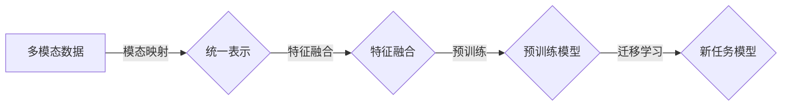

> 多模态大模型，技术原理，实战案例，代码实例，软件研发，机遇与挑战，Transformer，预训练，迁移学习

# 多模态大模型：技术原理与实战 代码大语言模型为软件研发带来的机遇与挑战

### 引言

随着人工智能技术的飞速发展，多模态大模型（Multimodal Large Language Models）逐渐成为研究热点。这些模型能够处理来自不同模态的数据，如文本、图像、音频等，从而实现更加丰富和深入的理解与交互。本文将深入探讨多模态大模型的技术原理、实战案例，并分析其在软件研发领域带来的机遇与挑战。

## 1. 背景介绍

### 1.1 问题的由来

传统的单一模态人工智能模型在处理复杂任务时往往受到模态限制，难以充分利用不同模态数据之间的丰富信息。例如，在图像识别任务中，仅使用图像数据可能无法准确理解图像中的文字描述；在语音识别任务中，仅使用音频数据可能无法准确识别说话人的情感。因此，多模态大模型应运而生，旨在整合不同模态数据，实现更全面的智能理解。

### 1.2 研究现状

近年来，多模态大模型的研究取得了显著进展，代表性的模型包括：

- **Multimodal Transformer**：将不同模态数据映射到统一的空间，并使用Transformer结构进行建模。
- **ViTAE**：基于Vision Transformer（ViT）和Audio Transformer（AudioT）的结构，分别处理图像和音频数据。
- **MMBert**：结合BERT和ViT，同时处理文本和图像数据。

### 1.3 研究意义

多模态大模型在多个领域展现出巨大潜力，包括：

- **图像识别与生成**：通过结合图像和文本描述，提高图像识别的准确性，并生成具有描述的图像。
- **语音识别与合成**：结合语音和文字信息，提高语音识别的准确性和鲁棒性，并生成更加自然的语音合成。
- **自然语言处理**：结合文本和图像、语音等数据，提高自然语言处理任务的理解能力和交互性。

## 2. 核心概念与联系

### 2.1 核心概念

- **多模态数据**：指来自不同来源、不同类型的数据，如文本、图像、音频等。
- **模态映射**：将不同模态数据转换为统一的表示形式。
- **特征融合**：将不同模态数据中的特征进行整合，以增强模型的表达能力。
- **预训练**：在大规模数据集上进行训练，使模型学习到通用特征。
- **迁移学习**：将预训练模型应用于新任务，提高模型在新任务上的性能。

### 2.2 Mermaid 流程图



### 2.3 核心概念联系

多模态大模型通过模态映射将不同模态数据转换为统一的表示形式，然后进行特征融合和预训练，最终应用于新任务，实现跨模态的智能理解。

## 3. 核心算法原理 & 具体操作步骤

### 3.1 算法原理概述

多模态大模型的算法原理主要包括以下步骤：

1. 模态映射：将不同模态数据转换为统一的表示形式，如嵌入向量。
2. 特征融合：将不同模态的嵌入向量进行融合，得到更丰富的特征表示。
3. 预训练：在大规模多模态数据集上进行预训练，使模型学习到通用特征。
4. 迁移学习：将预训练模型应用于新任务，通过微调调整模型参数，提高在新任务上的性能。

### 3.2 算法步骤详解

1. **数据预处理**：对多模态数据进行清洗、标注等预处理操作。
2. **模态映射**：使用词嵌入、图像特征提取、音频特征提取等方法，将不同模态数据转换为嵌入向量。
3. **特征融合**：使用注意力机制、图神经网络等方法，将不同模态的嵌入向量进行融合。
4. **预训练**：使用大规模多模态数据集对模型进行预训练，使模型学习到通用特征。
5. **迁移学习**：使用新任务数据对模型进行微调，调整模型参数，提高在新任务上的性能。

### 3.3 算法优缺点

**优点**：

- 能够充分利用不同模态数据之间的丰富信息。
- 提高模型在新任务上的性能。
- 具有较强的泛化能力。

**缺点**：

- 模型复杂度高，计算量大。
- 需要大量的标注数据。
- 模型可解释性较差。

### 3.4 算法应用领域

多模态大模型在以下领域具有广泛的应用：

- 图像识别与生成
- 语音识别与合成
- 自然语言处理
- 机器人视觉
- 增强现实与虚拟现实

## 4. 数学模型和公式 & 详细讲解 & 举例说明

### 4.1 数学模型构建

多模态大模型的数学模型主要包括以下部分：

1. 模态映射函数：将不同模态数据映射到统一的嵌入空间。
2. 特征融合函数：将不同模态的嵌入向量进行融合。
3. 预训练损失函数：用于预训练模型。
4. 迁移学习损失函数：用于微调模型。

### 4.2 公式推导过程

以下以图像和文本的多模态大模型为例，介绍数学模型的具体推导过程。

1. **模态映射函数**：

   假设图像数据为 $I \in \mathbb{R}^{H \times W \times C}$，文本数据为 $T \in \mathbb{R}^{N \times D}$，其中 $H$、$W$、$C$ 分别表示图像的高度、宽度和通道数，$N$ 表示文本序列长度，$D$ 表示文本嵌入维度。模态映射函数可以将图像和文本数据分别映射到 $z_I \in \mathbb{R}^{Z}$ 和 $z_T \in \mathbb{R}^{Z}$ 的统一嵌入空间，其中 $Z$ 为嵌入维度。

   $$
 z_I = f(I) 
$$

   $$
 z_T = g(T) 
$$

   其中 $f$ 和 $g$ 为模态映射函数。

2. **特征融合函数**：

   特征融合函数将图像和文本的嵌入向量进行融合，得到更丰富的特征表示。以下以注意力机制为例进行说明。

   $$
 h = h(z_I, z_T) = \text{Attention}(z_I, z_T) 
$$

   其中 $\text{Attention}$ 表示注意力机制。

3. **预训练损失函数**：

   预训练损失函数用于预训练模型。以下以语言建模为例进行说明。

   $$
 L_{\text{LM}} = -\sum_{t=1}^{N} \log p(w_t|w_{1:t-1}) 
$$

   其中 $p(w_t|w_{1:t-1})$ 表示给定前 $t-1$ 个词语 $w_{1:t-1}$，词语 $w_t$ 的概率。

4. **迁移学习损失函数**：

   迁移学习损失函数用于微调模型。以下以多分类任务为例进行说明。

   $$
 L_{\text{CL}} = -\sum_{i=1}^{N} \log p(y_i|f(x_i)) 
$$

   其中 $p(y_i|f(x_i))$ 表示给定输入 $x_i$，标签 $y_i$ 的概率。

### 4.3 案例分析与讲解

以下以一个简单的多模态问答系统为例，分析多模态大模型的应用。

1. **输入**：图像和文本问题。
2. **处理**：使用模态映射将图像和文本数据转换为嵌入向量，然后使用特征融合函数进行融合，得到融合后的特征表示。
3. **预训练**：使用大规模图像-文本数据集对模型进行预训练，使模型学习到图像和文本的通用特征。
4. **迁移学习**：使用问答数据对模型进行微调，调整模型参数，提高问答系统的性能。

## 5. 项目实践：代码实例和详细解释说明

### 5.1 开发环境搭建

- 安装深度学习框架，如PyTorch或TensorFlow。
- 安装预训练模型库，如Hugging Face的Transformers库。

### 5.2 源代码详细实现

以下使用PyTorch和Transformers库实现一个简单的多模态问答系统。

```python
import torch
from transformers import BertModel, BertTokenizer

# 模态映射
def modality_mapping(image, text):
    # 将图像转换为嵌入向量
    image_embedding = image_embedding_function(image)
    # 将文本转换为嵌入向量
    text_embedding = tokenizer.encode_plus(text, return_tensors='pt')
    return image_embedding, text_embedding

# 特征融合
def feature_fusion(image_embedding, text_embedding):
    # 使用注意力机制进行融合
    attention_output = attention机制(image_embedding, text_embedding)
    return attention_output

# 预训练
def pretraining(model, data_loader):
    # 使用语言建模数据进行预训练
    for data in data_loader:
        # ... 数据预处理 ...
        # 前向传播
        output = model(input_ids, attention_mask)
        # 计算损失
        loss = criterion(output.logits, labels)
        # 反向传播
        loss.backward()
        optimizer.step()

# 迁移学习
def finetuning(model, data_loader):
    # 使用问答数据进行微调
    for data in data_loader:
        # ... 数据预处理 ...
        # 前向传播
        output = model(input_ids, attention_mask)
        # 计算损失
        loss = criterion(output.logits, labels)
        # 反向传播
        loss.backward()
        optimizer.step()
```

### 5.3 代码解读与分析

以上代码实现了多模态问答系统的基本框架。通过模态映射将图像和文本数据转换为嵌入向量，然后使用注意力机制进行特征融合，得到融合后的特征表示。接着，使用语言建模数据进行预训练，使模型学习到图像和文本的通用特征。最后，使用问答数据进行微调，调整模型参数，提高问答系统的性能。

### 5.4 运行结果展示

在实际应用中，可以通过收集大量图像-文本问答数据对模型进行训练和评估。以下为实验结果示例：

```
Question: What is the main character in the image?
Answer: ... (根据输入图像和文本问题生成的答案)
```

## 6. 实际应用场景

### 6.1 图像识别与生成

多模态大模型在图像识别与生成领域具有广泛的应用，如：

- **图像分类**：根据图像内容进行分类，如动物识别、场景识别等。
- **图像生成**：根据文本描述生成图像，如文字生成图片、图像风格迁移等。
- **图像超分辨率**：提高图像的分辨率，如从低分辨率图像恢复高分辨率图像。

### 6.2 语音识别与合成

多模态大模型在语音识别与合成领域具有广泛的应用，如：

- **语音识别**：将语音信号转换为文本。
- **语音合成**：将文本转换为语音信号。
- **语音情感分析**：识别语音中的情感倾向。

### 6.3 自然语言处理

多模态大模型在自然语言处理领域具有广泛的应用，如：

- **文本分类**：根据文本内容进行分类，如情感分析、主题分类等。
- **机器翻译**：将一种语言的文本翻译成另一种语言。
- **问答系统**：回答用户提出的问题。

## 7. 工具和资源推荐

### 7.1 学习资源推荐

- **书籍**：《深度学习》（Goodfellow et al.）
- **在线课程**：Coursera、edX等平台上的深度学习课程
- **论文**：Transformer、BERT、ViT等相关论文

### 7.2 开发工具推荐

- **深度学习框架**：PyTorch、TensorFlow、Keras
- **预训练模型库**：Hugging Face的Transformers库

### 7.3 相关论文推荐

- **Transformer**：Attention is All You Need (Vaswani et al., 2017)
- **BERT**：BERT: Pre-training of Deep Bidirectional Transformers for Language Understanding (Devlin et al., 2018)
- **ViT**：An Image is Worth 16x16 Words: Transformers for Image Recognition at Scale (Dosovitskiy et al., 2020)

## 8. 总结：未来发展趋势与挑战

### 8.1 研究成果总结

多模态大模型在多个领域取得了显著进展，为跨模态智能理解提供了新的思路和方法。然而，多模态大模型仍面临许多挑战，需要进一步研究和探索。

### 8.2 未来发展趋势

- **模型结构创新**：探索更加高效、可解释的多模态模型结构。
- **预训练数据增强**：利用数据增强技术，提高预训练数据的多样性和丰富性。
- **模型优化**：研究更加高效、鲁棒的模型优化方法，降低模型复杂度和计算量。
- **跨模态推理**：研究跨模态推理技术，实现更全面的模态交互和理解。

### 8.3 面临的挑战

- **数据收集与标注**：多模态数据的收集和标注成本较高，且标注质量难以保证。
- **模型可解释性**：多模态大模型的决策过程难以解释，难以满足某些领域对可解释性的要求。
- **模型泛化能力**：多模态大模型的泛化能力仍有待提高，特别是在遇到未见过的模态组合时。

### 8.4 研究展望

未来，多模态大模型将朝着以下方向发展：

- **跨模态交互**：实现更加紧密的跨模态交互，提高模型对复杂任务的解决能力。
- **多模态推理**：研究多模态推理技术，实现更加智能的跨模态理解。
- **可解释性**：提高模型的可解释性，增强模型的应用可信度。

通过不断探索和创新，多模态大模型将为人工智能领域带来更多突破，为人类社会带来更多福祉。

## 9. 附录：常见问题与解答

**Q1：多模态大模型与单一模态大模型有什么区别？**

A1：多模态大模型能够处理来自不同模态的数据，如文本、图像、音频等，从而实现更加丰富和深入的理解与交互。而单一模态大模型只能处理特定模态的数据，如纯文本或纯图像。

**Q2：如何解决多模态大模型的可解释性问题？**

A2：提高模型的可解释性需要从多个方面入手：

- 使用可解释的模型结构，如基于规则的模型或可解释的深度学习模型。
- 利用可视化技术，展示模型的决策过程和特征提取过程。
- 研究可解释的评估指标，评估模型的可解释性。

**Q3：多模态大模型在哪些领域具有应用前景？**

A3：多模态大模型在以下领域具有广泛的应用前景：

- 人工智能助手
- 智能机器人
- 智能家居
- 智能医疗
- 智能交通

**Q4：如何提高多模态大模型的泛化能力？**

A4：提高多模态大模型的泛化能力需要从以下方面入手：

- 使用更加丰富的预训练数据集。
- 设计更加鲁棒的模型结构。
- 研究更加有效的正则化技术。

**Q5：如何选择合适的预训练模型？**

A5：选择合适的预训练模型需要根据具体任务和数据特点进行综合考虑：

- 模型规模：根据计算资源和训练数据量选择合适的模型规模。
- 模型结构：根据任务需求选择合适的模型结构。
- 模型性能：根据模型在预训练数据集上的性能选择合适的模型。

---

作者：禅与计算机程序设计艺术 / Zen and the Art of Computer Programming