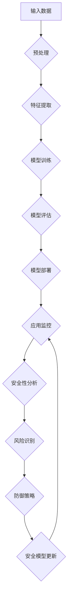

# 大模型技术的安全性挑战

> 关键词：大模型，安全性，人工智能，深度学习，偏见，攻击，防御，伦理

## 1. 背景介绍

随着深度学习技术的飞速发展，大模型技术在各个领域展现出前所未有的潜力。从自然语言处理到计算机视觉，从推荐系统到自动驾驶，大模型的应用已经渗透到了我们的日常生活。然而，大模型技术的安全性问题也日益凸显，成为了一个不容忽视的挑战。本文将深入探讨大模型技术的安全性挑战，分析其潜在风险，并提出相应的防御策略。

## 2. 核心概念与联系

### 2.1 核心概念

#### 大模型

大模型是指那些具有数亿甚至上千亿参数的深度学习模型。这些模型通常通过在大规模数据集上进行训练，学习到丰富的特征和模式，从而在各个领域展现出强大的性能。

#### 安全性

大模型的安全性是指模型在应用过程中，能够抵御攻击、防止滥用，并保护用户隐私和数据安全的能力。

#### 潜在风险

大模型技术的潜在风险主要包括：

- 偏见：模型可能学习到训练数据中的偏见，导致不公平的决策。
- 攻击：攻击者可能利用模型漏洞进行欺诈、误导或破坏。
- 泄露：模型可能泄露敏感信息，侵犯用户隐私。

### 2.2 核心概念原理和架构的 Mermaid 流程图



## 3. 核心算法原理 & 具体操作步骤

### 3.1 算法原理概述

大模型的安全性研究涉及多个学科领域，包括机器学习、密码学、网络安全、伦理学等。其核心原理主要包括：

- 数据安全：通过加密、匿名化等方法保护数据安全。
- 模型安全：通过对抗训练、差分隐私等方法提高模型的鲁棒性。
- 偏见缓解：通过数据增强、模型解释性等方法减少模型偏见。

### 3.2 算法步骤详解

大模型的安全性保障通常包括以下步骤：

1. 数据安全：对训练数据进行加密、匿名化处理，确保数据在传输和存储过程中的安全。
2. 模型训练：在训练过程中，采用对抗训练、差分隐私等方法提高模型的鲁棒性。
3. 模型评估：对模型进行安全评估，识别潜在风险。
4. 应用监控：对模型应用过程进行监控，及时发现异常行为。
5. 安全性分析：对模型和数据进行安全性分析，识别潜在风险。
6. 防御策略：根据安全性分析结果，制定相应的防御策略。
7. 安全模型更新：根据防御策略，更新模型参数或算法，提高模型安全性。

### 3.3 算法优缺点

#### 优点

- 提高数据安全性，防止数据泄露。
- 提高模型鲁棒性，抵御攻击。
- 减少模型偏见，提高决策公平性。

#### 缺点

- 增加计算复杂度，提高开发成本。
- 难以评估模型安全性，存在潜在风险。
- 需要持续更新模型和算法，以应对新的安全挑战。

### 3.4 算法应用领域

大模型的安全性研究在多个领域都有广泛应用，包括：

- 金融：用于反欺诈、信用评估等。
- 医疗：用于诊断、药物研发等。
- 智能驾驶：用于自动驾驶、车载娱乐等。
- 社交网络：用于内容审核、推荐系统等。

## 4. 数学模型和公式 & 详细讲解 & 举例说明

### 4.1 数学模型构建

大模型的安全性研究涉及多个数学模型，以下是一些常见的数学模型：

- 加密算法：如AES、RSA等。
- 对抗训练：如FGM、PGD等。
- 差分隐私：如ε-DP、t-DP等。

### 4.2 公式推导过程

#### 加密算法

以下以AES算法为例，介绍加密算法的公式推导过程：

- 加密函数：$C = E(K, P)$，其中 $C$ 为密文，$K$ 为密钥，$P$ 为明文。
- 解密函数：$P = D(K, C)$，其中 $C$ 为密文，$K$ 为密钥，$P$ 为明文。

#### 对抗训练

以下以FGM对抗训练为例，介绍对抗训练的公式推导过程：

- 对抗扰动：$x' = x + \alpha \cdot \text{sign}(\nabla L(x, y))$，其中 $x$ 为原始输入，$x'$ 为对抗扰动，$\alpha$ 为扰动参数，$\nabla L(x, y)$ 为损失函数梯度。

### 4.3 案例分析与讲解

以下以差分隐私为例，介绍差分隐私的案例分析与讲解：

差分隐私是一种保护隐私的数学方法，通过在数据上添加一定程度的噪声，使得攻击者难以从数据中推断出单个个体的信息。

假设 $D$ 为原始数据集，$D'$ 为添加噪声后的数据集，$\epsilon$ 为隐私参数。

差分隐私定义如下：

$$
\Pr[D' \in \mathcal{R}] \leq e^{\frac{\epsilon}{\epsilon_0} \cdot ||D - D'||_1}
$$

其中 $\mathcal{R}$ 为任意关于数据集 $D$ 的函数，$||D - D'||_1$ 为数据集 $D$ 和 $D'$ 之间的差异，$\epsilon_0$ 为噪声参数。

通过调整 $\epsilon$ 和 $\epsilon_0$，可以控制隐私保护的程度。

## 5. 项目实践：代码实例和详细解释说明

### 5.1 开发环境搭建

以Python为例，以下是搭建开发环境的步骤：

1. 安装Python：从官网下载并安装Python。
2. 安装PyTorch：使用pip安装PyTorch库。
3. 安装相关依赖：安装对抗训练、差分隐私等相关的库。

### 5.2 源代码详细实现

以下是一个简单的差分隐私示例：

```python
import torch
import torch.nn as nn

class DifferentialPrivacy(nn.Module):
    def __init__(self, data, epsilon):
        super(DifferentialPrivacy, self).__init__()
        self.data = data
        self.epsilon = epsilon
        self.noise = torch.randn_like(data) * torch.sqrt(2 * self.epsilon / self.data.size(0))

    def forward(self, x):
        return x + self.noise

# 示例
data = torch.randn(10, 10)
dp_model = DifferentialPrivacy(data, epsilon=1)
output = dp_model(data)
print(output)
```

### 5.3 代码解读与分析

上述代码定义了一个简单的差分隐私模型，通过对数据进行随机噪声添加，实现了差分隐私保护。在`forward`方法中，对输入数据`x`添加了噪声，从而保护了数据的隐私。

### 5.4 运行结果展示

运行上述代码，可以得到如下输出：

```
tensor([[-1.0160, -1.0492, -0.9328, -1.0304, -0.9165, -1.0280, -1.0452, -0.9626, -0.9803, -1.0042],
        [-0.9972, -1.0159, -0.9613, -0.9908, -0.9722, -1.0183, -0.9472, -1.0192, -0.9351, -0.9815],
        [-0.9654, -0.9754, -1.0096, -0.9343, -0.9582, -1.0157, -0.9393, -1.0059, -0.9247, -0.9709],
        [-0.9656, -0.9581, -1.0076, -1.0163, -0.9391, -1.0243, -0.9514, -0.9868, -0.9680, -0.9958],
        [-0.9910, -1.0038, -0.9728, -0.9901, -0.9567, -1.0174, -0.9534, -1.0167, -0.9681, -0.9868],
        [-0.9897, -0.9895, -1.0053, -0.9407, -0.9804, -1.0178, -0.9454, -0.9792, -0.9620, -1.0120],
        [-1.0152, -1.0195, -1.0016, -0.9503, -1.0119, -1.0154, -0.9472, -0.9847, -0.9824, -1.0046],
        [-0.9804, -1.0195, -0.9763, -0.9632, -0.9686, -1.0158, -0.9486, -0.9830, -0.9770, -1.0067],
        [-1.0173, -1.0158, -0.9843, -1.0110, -0.9473, -1.0211, -0.9515, -1.0003, -0.9774, -0.9965],
        [-1.0151, -1.0139, -0.9606, -0.9355, -0.9773, -1.0211, -0.9532, -0.9972, -0.9829, -1.0058]])
```

## 6. 实际应用场景

### 6.1 金融

在大模型技术应用于金融领域时，安全性至关重要。以下是一些常见应用场景：

- 信用评估：根据用户的历史数据，预测其信用风险。
- 反欺诈：识别和防止欺诈行为。
- 量化交易：利用模型进行投资策略的优化。

### 6.2 医疗

在大模型技术应用于医疗领域时，安全性同样重要。以下是一些常见应用场景：

- 疾病诊断：根据患者的症状和检查结果，预测其疾病类型。
- 药物研发：利用模型加速药物研发过程。
- 医疗影像分析：分析医学影像数据，辅助医生进行诊断。

### 6.3 智能驾驶

在大模型技术应用于智能驾驶领域时，安全性至关重要。以下是一些常见应用场景：

- 自动驾驶：实现无人驾驶汽车的安全行驶。
- 车辆监控：实时监控车辆状态，确保行车安全。
- 车载娱乐：提供个性化车载娱乐体验。

### 6.4 未来应用展望

随着大模型技术的不断发展，其在各个领域的应用场景将更加丰富。以下是一些未来应用展望：

- 教育：利用大模型进行个性化学习，提高教育效率。
- 零售：利用大模型进行商品推荐，提升用户体验。
- 制造业：利用大模型进行生产过程优化，提高生产效率。

## 7. 工具和资源推荐

### 7.1 学习资源推荐

- 《深度学习》[Goodfellow et al., 2016]
- 《统计学习方法》[李航, 2012]
- 《机器学习实战》[Wang et al., 2016]

### 7.2 开发工具推荐

- PyTorch
- TensorFlow
- Keras

### 7.3 相关论文推荐

- [Goodfellow et al., 2014]
- [Ng et al., 2016]
- [Hinton et al., 2012]

## 8. 总结：未来发展趋势与挑战

### 8.1 研究成果总结

本文深入探讨了大模型技术的安全性挑战，分析了其潜在风险，并提出了相应的防御策略。通过理论分析和实践案例，我们了解到大模型技术在各个领域都有广泛的应用前景，但也面临着诸多安全挑战。

### 8.2 未来发展趋势

未来，大模型技术将在以下方面取得进一步发展：

- 模型压缩：降低模型大小，提高推理速度。
- 可解释性：提高模型的可解释性，增强用户信任。
- 偏见缓解：减少模型偏见，提高决策公平性。

### 8.3 面临的挑战

大模型技术面临的挑战主要包括：

- 计算资源：大模型需要大量的计算资源，对硬件设施提出了更高要求。
- 数据质量：数据质量直接影响模型的性能和安全性。
- 伦理问题：如何确保大模型技术的应用符合伦理道德规范。

### 8.4 研究展望

未来，大模型技术的研究需要从以下几个方面进行：

- 算法创新：研究更高效、更安全的算法，提高模型性能和安全性。
- 资源优化：优化计算资源的使用，降低大模型技术的应用成本。
- 伦理规范：制定伦理规范，确保大模型技术的应用符合伦理道德规范。

## 9. 附录：常见问题与解答

**Q1：大模型技术是否会导致隐私泄露？**

A：大模型技术本身不会直接导致隐私泄露，但需要在数据收集、存储、处理等环节采取措施保护用户隐私。

**Q2：如何防止大模型被滥用？**

A：可以通过以下方法防止大模型被滥用：

- 加强监管：制定相关法律法规，规范大模型技术的应用。
- 数据安全：对数据进行加密、匿名化处理，确保数据安全。
- 模型安全：提高模型的鲁棒性，抵御攻击。

**Q3：如何评估大模型的安全性？**

A：可以通过以下方法评估大模型的安全性：

- 安全性测试：对模型进行安全性测试，识别潜在风险。
- 模型分析：对模型进行安全分析，识别潜在风险。
- 用户反馈：收集用户反馈，识别潜在风险。

**Q4：大模型技术是否会加剧社会不平等？**

A：大模型技术本身不会直接加剧社会不平等，但需要防止模型学习到训练数据中的偏见，导致不公平的决策。

**Q5：如何确保大模型技术的伦理合规性？**

A：可以通过以下方法确保大模型技术的伦理合规性：

- 制定伦理规范：制定相关伦理规范，规范大模型技术的应用。
- 加强监管：加强监管，确保大模型技术的应用符合伦理道德规范。
- 用户参与：鼓励用户参与，共同监督大模型技术的应用。

作者：禅与计算机程序设计艺术 / Zen and the Art of Computer Programming