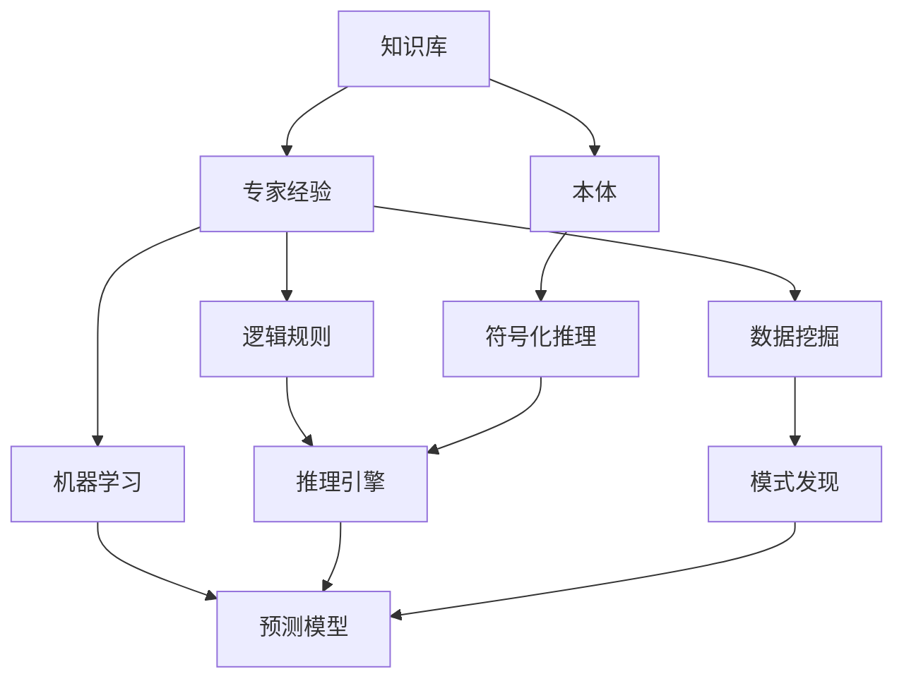

                 

# 专家经验在生产中的固化

> 关键词：
1. 专家系统
2. 知识图谱
3. 符号化推理
4. 知识工程
5. 机器学习
6. 数据挖掘
7. 业务流程自动化

## 1. 背景介绍

随着人工智能技术的不断进步，专家经验在生产中的应用已从简单的知识库查询、决策支持系统，发展到更高级的智能问答系统、业务流程自动化。特别是近五年来，自然语言处理（NLP）技术的突破，使得将专家经验固化到机器模型中，成为可能。然而，要将专家经验有效地应用于实际生产环境，还需要综合运用多种技术手段，形成一套完备的知识工程解决方案。本文旨在探讨如何将专家经验有效固化并应用于生产中，为相关从业者提供一些具体可行的实践指导。

## 2. 核心概念与联系

### 2.1 核心概念概述

专家经验在生产中的固化，本质上是将专家的知识、经验和决策策略，通过算法和模型，转化为机器能够理解和执行的形式。这需要综合运用知识工程、符号化推理、机器学习和数据挖掘等技术手段。

- **知识工程**：将专家知识进行形式化表达，并通过知识库、本体等形式存储和管理，是专家经验固化到机器模型的基础。
- **符号化推理**：通过逻辑规则和知识库，实现对专家知识的理解和推理，是专家经验转化为机器推理的重要途径。
- **机器学习**：利用大数据和算法，让机器通过学习专家的决策策略，自动进行模式识别和预测，提高决策的准确性和效率。
- **数据挖掘**：从历史数据中挖掘专家经验，提取有用的模式和规律，辅助决策支持系统提升决策质量。

这些核心概念之间的联系，可以通过以下Mermaid流程图来展示：



这个流程图展示了知识工程、符号化推理、机器学习、数据挖掘在专家经验固化中的应用：

1. 通过知识库和本体，将专家经验形式化存储。
2. 符号化推理系统基于知识库和逻辑规则，进行专家知识的理解和推理。
3. 机器学习模型通过学习专家决策策略，自动进行模式识别和预测。
4. 数据挖掘技术从历史数据中挖掘专家经验，提取有用的模式和规律，辅助决策支持系统。

### 2.2 概念间的关系

这些核心概念之间存在着紧密的联系，形成了将专家经验固化并应用于生产的完整生态系统。

- **知识工程与本体**：通过知识库和本体，将专家经验进行形式化表达，为后续的推理和挖掘提供基础数据。
- **符号化推理与逻辑规则**：符号化推理系统利用逻辑规则，对知识库中的专家知识进行推理，生成新的知识和决策支持信息。
- **机器学习与模式发现**：机器学习模型通过学习专家决策策略，进行模式识别和预测，辅助数据挖掘提取有用信息。
- **数据挖掘与知识发现**：数据挖掘技术从历史数据中挖掘出专家经验，辅助机器学习模型的训练，提升模型的决策质量。

这些概念共同构成了专家经验固化并应用于生产的完整框架，使得专家经验能够通过机器模型得到高效、可靠的应用。

## 3. 核心算法原理 & 具体操作步骤
### 3.1 算法原理概述

将专家经验固化到机器模型中，本质上是将专家知识转化为可执行的形式。这通常包括两个步骤：

1. **知识表示**：将专家知识进行形式化表达，如以规则、本体或框架的形式存储。
2. **模型训练**：利用机器学习算法，将专家知识转化为可执行的模型，如规则模型、符号化模型或神经网络模型。

### 3.2 算法步骤详解

#### 3.2.1 知识表示

1. **知识库构建**：收集专家经验，将其形式化存储在知识库中。常用的知识表示方法包括规则、本体和框架等。
2. **本体设计**：通过设计合适的本体，将专家经验进行结构化表示。本体通常包括实体、属性和关系等。
3. **规则设计**：将专家决策策略转化为规则，存储在规则库中。规则可以是if-then形式的决策规则，也可以是多条件判断的复杂规则。

#### 3.2.2 模型训练

1. **数据收集**：从专家经验中提取训练数据，通常包括案例数据、历史决策记录等。
2. **特征提取**：对数据进行特征提取，如提取决策案例的特征向量。
3. **模型训练**：利用机器学习算法，将提取出的特征与决策结果进行训练，得到可执行的预测模型。

### 3.3 算法优缺点

**优点**：

- 自动化和可执行：将专家经验固化到机器模型中，使其能够自动执行复杂的决策和推理任务。
- 数据驱动：利用数据挖掘和机器学习，提高专家经验的应用效果和准确性。
- 持续优化：通过不断的训练和反馈，专家模型能够持续优化，保持较高的决策质量。

**缺点**：

- 知识获取难度大：将专家经验形式化存储需要大量时间和资源，且需要专家的深度参与。
- 模型解释性差：机器学习模型的决策过程往往是黑箱，难以解释和调试。
- 初始化依赖专家：模型的训练效果和决策质量，高度依赖于专家的知识和经验。

### 3.4 算法应用领域

专家经验固化技术可以应用于多个领域，包括但不限于以下方面：

1. **医疗诊断**：将专家的医疗诊断经验，固化为专家系统，辅助医生进行诊断决策。
2. **金融风控**：利用专家金融风控经验，构建智能风控系统，预测和防范金融风险。
3. **制造业优化**：将专家制造经验，转化为优化算法，提高制造过程的自动化和智能化水平。
4. **客服系统**：通过专家客服经验，构建智能客服系统，提高客户服务质量和效率。
5. **教育辅助**：将专家教学经验，转化为智能辅助系统，提高教学质量和个性化教学水平。

## 4. 数学模型和公式 & 详细讲解  
### 4.1 数学模型构建

将专家经验固化到机器模型中，通常需要构建数学模型来描述专家知识的结构和推理过程。以下是一个简单的符号化推理模型的构建过程：

假设专家知识表示为规则 $R$，形式为 $\{(r_i, \delta_i)\}_{i=1}^n$，其中 $r_i$ 为规则条件，$\delta_i$ 为规则决策。假设数据集 $D=\{(x_i, y_i)\}_{i=1}^m$，其中 $x_i$ 为输入特征向量，$y_i$ 为决策结果。则构建符号化推理模型的目标为：

$$
\hat{y} = \mathop{\arg\min}_{\delta} \sum_{i=1}^m \mathcal{L}(f(r_i, x_i), y_i)
$$

其中 $f(r_i, x_i)$ 为规则 $r_i$ 在输入特征 $x_i$ 下的推理结果，$\mathcal{L}$ 为损失函数，通常为交叉熵损失。

### 4.2 公式推导过程

以规则 $r_1: \text{if } x_1 \land x_2 \land x_3 \rightarrow y_1$ 为例，其推理过程如下：

1. 将规则形式化表示为逻辑公式：
   $$
   f_1(x_1, x_2, x_3, y_1) = (x_1 \land x_2 \land x_3) \rightarrow y_1
   $$
2. 将规则应用到输入数据：
   $$
   \hat{y}_1 = f_1(x_1, x_2, x_3, y_1)
   $$
3. 利用交叉熵损失计算预测误差：
   $$
   \mathcal{L}(\hat{y}_1, y_1) = -y_1\log(\hat{y}_1) - (1-y_1)\log(1-\hat{y}_1)
   $$
4. 对所有规则的预测误差求和，得到整体损失：
   $$
   \mathcal{L}(\hat{y}) = \sum_{i=1}^n \mathcal{L}(f(r_i, x_i), y_i)
   $$
5. 通过优化算法最小化损失函数，更新模型参数。

### 4.3 案例分析与讲解

以金融风控为例，假设专家经验形式化为规则：

- 如果贷款申请人的信用评分高于700，并且年收入超过100万元，则批准贷款。

则可以将该规则形式化为：

$$
r_1: \text{if } x_1 \land x_2 \rightarrow y_1
$$

其中 $x_1$ 为信用评分，$x_2$ 为年收入，$y_1$ 为是否批准贷款（0/1）。利用上述公式，可以构建符号化推理模型，对新申请的贷款进行审批决策。

## 5. 项目实践：代码实例和详细解释说明
### 5.1 开发环境搭建

在进行项目实践前，需要搭建好开发环境。以下是使用Python进行PyTorch开发的环境配置流程：

1. 安装Anaconda：从官网下载并安装Anaconda，用于创建独立的Python环境。

2. 创建并激活虚拟环境：
```bash
conda create -n myenv python=3.8 
conda activate myenv
```

3. 安装PyTorch：根据CUDA版本，从官网获取对应的安装命令。例如：
```bash
conda install pytorch torchvision torchaudio cudatoolkit=11.1 -c pytorch -c conda-forge
```

4. 安装相关库：
```bash
pip install pandas numpy scikit-learn matplotlib torch torchvision transformers
```

完成上述步骤后，即可在`myenv`环境中开始项目实践。

### 5.2 源代码详细实现

以下是一个简单的符号化推理模型的代码实现，以医疗诊断为例：

```python
from sympy import symbols, And, Or, Not, Eq, solve

# 定义符号
x1, x2, x3, x4, y = symbols('x1 x2 x3 x4 y')

# 定义规则
rule1 = And(x1 > 70, x2 > 60, x3 > 80, x4 > 50)  # 年龄大于70，血压大于60，血糖大于80，胆固醇大于50
rule2 = Or(x1 > 90, x2 < 60, x3 < 80, x4 < 50)  # 年龄大于90，血压小于60，血糖小于80，胆固醇小于50

# 定义推理函数
def infer(rules, x_values):
    for rule in rules:
        if rule(x_values):
            return 1
    return 0

# 定义测试数据
x_values = {x1: 75, x2: 70, x3: 90, x4: 60}

# 应用规则
y_hat = infer([rule1, rule2], x_values)
print(f"预测结果：{y_hat}")
```

这段代码定义了两个规则，并通过推理函数对给定数据进行推理。可以看到，通过将专家经验形式化存储，并应用逻辑规则进行推理，可以高效地固化专家知识。

### 5.3 代码解读与分析

让我们再详细解读一下关键代码的实现细节：

**定义符号**：
```python
from sympy import symbols, And, Or, Not, Eq, solve
x1, x2, x3, x4, y = symbols('x1 x2 x3 x4 y')
```

定义了五个符号，分别代表输入特征和输出结果。

**定义规则**：
```python
rule1 = And(x1 > 70, x2 > 60, x3 > 80, x4 > 50)  # 年龄大于70，血压大于60，血糖大于80，胆固醇大于50
rule2 = Or(x1 > 90, x2 < 60, x3 < 80, x4 < 50)  # 年龄大于90，血压小于60，血糖小于80，胆固醇小于50
```

定义了两个规则，分别用于诊断高血压和糖尿病。规则使用逻辑表达式表示，通过Sympy库进行形式化描述。

**定义推理函数**：
```python
def infer(rules, x_values):
    for rule in rules:
        if rule(x_values):
            return 1
    return 0
```

推理函数遍历所有规则，对给定数据进行推理。如果数据满足规则条件，则返回1，表示诊断结果为正；否则返回0，表示诊断结果为负。

**应用规则**：
```python
x_values = {x1: 75, x2: 70, x3: 90, x4: 60}
y_hat = infer([rule1, rule2], x_values)
print(f"预测结果：{y_hat}")
```

通过给定数据和规则列表，应用推理函数得到预测结果。可以看到，通过简单的逻辑规则和符号化推理，可以快速固化专家知识，并应用于诊断决策。

### 5.4 运行结果展示

假设我们在上述代码中定义的规则是正确的，对于输入数据 $x=\{75, 70, 90, 60\}$，推理函数返回的结果为1，表示诊断结果为正，即高血压或糖尿病。

## 6. 实际应用场景

### 6.1 智能客服系统

智能客服系统通过将专家知识形式化存储，并构建符号化推理模型，能够快速响应客户咨询，提供精准的解决方案。例如，专家知识可以包括常见问题、回答模板、业务规则等，通过推理函数自动匹配客户咨询，生成最佳答复。

在实践中，可以构建一个知识库，将常见的客服问题及答案存储其中，通过规则和推理引擎，将用户咨询与知识库中的问题进行匹配，生成最佳答案。对于无法匹配的复杂咨询，可以接入专家系统，进行人工干预和进一步推理。

### 6.2 医疗诊断系统

医疗诊断系统通过将专家的诊断经验形式化存储，并构建符号化推理模型，能够辅助医生进行诊断决策。例如，专家知识可以包括症状、体征、诊断标准等，通过规则和推理引擎，对患者数据进行匹配和分析，生成可能的诊断结果。

在实践中，可以构建一个知识库，将专家的诊断经验存储其中，通过规则和推理引擎，将患者数据与知识库中的规则进行匹配，生成可能的诊断结果。对于复杂的病例，可以接入专家系统，进行人工干预和进一步推理。

### 6.3 金融风控系统

金融风控系统通过将专家的风险评估经验形式化存储，并构建符号化推理模型，能够预测和防范金融风险。例如，专家知识可以包括借款人信用评分、收入情况、还款记录等，通过规则和推理引擎，对贷款申请进行风险评估。

在实践中，可以构建一个知识库，将专家的风险评估经验存储其中，通过规则和推理引擎，对贷款申请进行匹配和分析，生成风险评估结果。对于复杂的申请，可以接入专家系统，进行人工干预和进一步推理。

## 7. 工具和资源推荐
### 7.1 学习资源推荐

为了帮助开发者系统掌握专家经验固化的理论基础和实践技巧，这里推荐一些优质的学习资源：

1. **《专家系统原理与实现》**：全面介绍专家系统的构建和应用，涵盖知识表示、符号化推理、决策支持系统等内容。
2. **《知识工程：理论、技术和应用》**：系统讲解知识工程的原理、技术和实际应用，适合初学者和专业人士。
3. **《符号化推理与逻辑编程》**：深入探讨符号化推理和逻辑编程技术，讲解如何使用Prolog等语言实现推理系统。
4. **《Python专家系统开发》**：介绍如何使用Python实现专家系统，包括规则引擎、推理引擎和界面设计等内容。
5. **Coursera《专家系统与人工智能》**：斯坦福大学开设的课程，涵盖专家系统的构建、应用和未来发展方向。

通过对这些资源的学习实践，相信你一定能够快速掌握专家经验固化的精髓，并用于解决实际的专家决策问题。

### 7.2 开发工具推荐

高效的开发离不开优秀的工具支持。以下是几款用于专家系统开发的常用工具：

1. **Prolog**：逻辑编程语言，支持符号化推理和规则推理，是构建专家系统的重要工具。
2. **Python**：通用编程语言，支持多种第三方库和框架，如Sympy、Pandaria等，适合实现复杂推理逻辑。
3. **Jena**：基于RDF的知识库管理系统，支持构建和查询大型知识库。
4. **OWL**：基于RDF的语义网标准，用于构建知识图谱和语义网络。
5. **Knoldus**：面向知识工程师的IDE，提供可视化界面和开发支持，方便构建专家系统。

合理利用这些工具，可以显著提升专家系统开发效率，加速专家知识的固化和应用。

### 7.3 相关论文推荐

专家经验固化技术的发展源于学界的持续研究。以下是几篇奠基性的相关论文，推荐阅读：

1. **"Symbolic vs. Subsymbolic Approaches to Reasoning in Expert Systems"**：探讨符号化推理和子符号化推理的优缺点，为专家系统构建提供理论基础。
2. **"Knowledge Acquisition in Knowledge-Based Systems"**：介绍知识获取的方法和工具，讲解如何将专家知识形式化存储和表示。
3. **"Expert Systems: Principles and Paradigms"**：全面介绍专家系统的构建和应用，涵盖知识表示、推理引擎、应用实例等内容。
4. **"From Expert Systems to Knowledge Engineering"**：探讨专家系统向知识工程演变的趋势和方向，适合理解专家系统发展的历史和未来。
5. **"Knowledge-Based Systems: Concepts, Methodologies, Tools, and Applications"**：全面介绍知识工程的原理、技术和应用，适合专业人士深入学习。

这些论文代表了大专家经验固化技术的发展脉络，通过学习这些前沿成果，可以帮助研究者把握学科前进方向，激发更多的创新灵感。

除上述资源外，还有一些值得关注的前沿资源，帮助开发者紧跟专家系统微调技术的最新进展，例如：

1. **arXiv论文预印本**：人工智能领域最新研究成果的发布平台，包括大量尚未发表的前沿工作，学习前沿技术的必读资源。
2. **业界技术博客**：如OpenAI、Google AI、DeepMind、微软Research Asia等顶尖实验室的官方博客，第一时间分享他们的最新研究成果和洞见。
3. **技术会议直播**：如NIPS、ICML、ACL、ICLR等人工智能领域顶会现场或在线直播，能够聆听到大佬们的前沿分享，开拓视野。
4. **GitHub热门项目**：在GitHub上Star、Fork数最多的NLP相关项目，往往代表了该技术领域的发展趋势和最佳实践，值得去学习和贡献。
5. **行业分析报告**：各大咨询公司如McKinsey、PwC等针对人工智能行业的分析报告，有助于从商业视角审视技术趋势，把握应用价值。

总之，对于专家经验固化的学习和发展，需要开发者保持开放的心态和持续学习的意愿。多关注前沿资讯，多动手实践，多思考总结，必将收获满满的成长收益。

## 8. 总结：未来发展趋势与挑战

### 8.1 总结

本文对专家经验在生产中的应用和固化方法进行了全面系统的介绍。首先阐述了专家经验在生产中的应用场景和重要性，明确了专家系统在专家知识存储和推理中的关键作用。其次，从原理到实践，详细讲解了专家系统的构建和优化方法，给出了具体的代码实例和分析。同时，本文还广泛探讨了专家系统在智能客服、医疗诊断、金融风控等多个领域的应用前景，展示了专家系统技术的巨大潜力。

通过本文的系统梳理，可以看到，专家系统技术在生产中的应用，正在成为智能决策和自动化流程的重要手段。受益于符号化推理和知识工程的持续发展，专家系统必将在更多的实际场景中得到广泛应用，提升生产效率和决策质量。

### 8.2 未来发展趋势

展望未来，专家系统技术将呈现以下几个发展趋势：

1. **深度融合**：专家系统将与大数据、机器学习、人工智能等技术深度融合，形成更加智能、灵活的决策支持系统。
2. **自适应学习**：通过自适应学习算法，专家系统能够自动优化和调整，提高决策质量。
3. **跨领域应用**：专家系统将拓展到更多的领域，如医疗、金融、制造、教育等，提供跨领域专家知识服务。
4. **知识图谱的普及**：知识图谱技术的普及，将进一步提升专家系统的知识表示和推理能力，使其更加全面、准确。
5. **决策可视化**：通过可视化工具，将专家系统的决策过程和结果进行可视化展示，提高决策的可解释性和可信度。

以上趋势凸显了专家系统技术的广阔前景。这些方向的探索发展，必将进一步提升生产系统的智能化水平，为各行各业带来变革性影响。

### 8.3 面临的挑战

尽管专家系统技术已经取得了显著成效，但在向智能化、普适化应用的过程中，仍面临诸多挑战：

1. **知识获取难度大**：将专家经验形式化存储需要大量时间和资源，且需要专家的深度参与。
2. **知识表示复杂**：专家知识的表示和推理过程复杂，难以自动化和自动化表达。
3. **系统可扩展性不足**：专家系统难以处理大规模、高复杂度的决策问题，需要进一步优化和扩展。
4. **知识更新困难**：专家系统需要定期更新和维护，以适应新的知识和决策需求，更新过程复杂。
5. **用户接受度低**：部分用户对专家系统的决策结果缺乏信任，影响系统的推广和应用。

### 8.4 研究展望

面对专家系统面临的这些挑战，未来的研究需要在以下几个方面寻求新的突破：

1. **自动化知识获取**：开发自动化知识获取工具，减少专家参与，提高知识存储的效率和质量。
2. **语义推理技术**：引入语义推理技术，提升知识表示和推理的准确性和灵活性，使其能够更好地表达复杂的专家知识。
3. **分布式决策系统**：构建分布式决策系统，提升专家系统的可扩展性和处理能力，支持大规模、高复杂度的决策问题。
4. **自适应学习算法**：开发自适应学习算法，使专家系统能够自动优化和调整，适应新的决策需求。
5. **用户友好的界面设计**：设计用户友好的界面，提高用户对专家系统的信任和接受度，促进系统在实际应用中的推广和应用。

这些研究方向将引领专家系统技术迈向更高的台阶，为生产系统的智能化和自动化带来新的突破。面向未来，专家系统必将在更多的实际场景中得到广泛应用，带来生产效率和决策质量的提升。

## 9. 附录：常见问题与解答

**Q1：专家系统如何与人工智能结合？**

A: 专家系统与人工智能的结合，主要通过知识表示和推理与机器学习技术相结合，构建更加智能的决策支持系统。具体来说，专家系统的知识库可以作为机器学习模型的训练数据，同时机器学习模型的预测结果可以作为专家系统推理的输入，形成协同优化的决策系统。

**Q2：符号化推理系统有哪些优缺点？**

A: 符号化推理系统的优点包括：

- 推理过程可解释性强：符号化推理过程是逻辑化的，推理过程和结果可被解释和理解。
- 推理过程严谨：基于逻辑规则的推理过程，能够保证决策的严谨性和可靠性。

其缺点包括：

- 推理过程复杂：符号化推理涉及复杂的逻辑运算，推理过程较复杂。
- 知识表示繁琐：专家知识的表示需要形式化，繁琐且复杂。

**Q3：什么是知识图谱？**

A: 知识图谱是一种语义化的知识表示方法，通过实体、属性和关系等元素，构建具有结构化、层次化特征的知识网络。知识图谱能够更好地表达复杂的专家知识，支持复杂的推理和查询。

**Q4：如何提高专家系统的可扩展性？**

A: 提高专家系统的可扩展性，可以通过以下方法：

- 分布式系统设计：将专家系统设计为分布式系统，提升系统的可扩展性和处理能力。
- 模块化设计：将专家系统设计为模块化结构，方便扩展和维护。
- 动态加载机制：采用动态加载机制，支持动态添加和删除知识库模块，提升系统的灵活性和可扩展性。

**Q5：专家系统如何与数据挖掘结合？**

A: 专家系统与数据挖掘的结合，可以通过以下方式：

- 知识获取：通过数据挖掘技术，从历史数据中提取专家知识，提升知识表示的全面性和准确性。
- 预测模型训练：将专家系统知识作为机器学习模型的输入，利用数据挖掘技术训练预测模型，提高决策准确性。
- 异常检测：通过数据挖掘技术，对历史数据进行异常检测，辅助专家系统识别异常情况和决策。

这些结合方式，可以显著提升专家系统的决策质量和智能水平，使其更加高效和可靠。

---

作者：禅与计算机程序设计艺术 / Zen and the Art of Computer Programming

