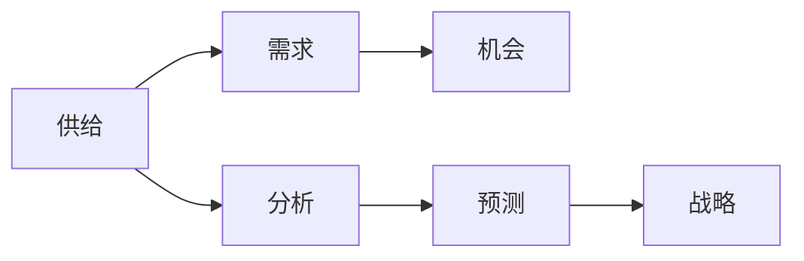

                 

## 1. 背景介绍

### 1.1 问题由来
在当今数字化转型的大潮下，企业越来越多地依赖于数据驱动的决策过程。业务战略方向需要综合考虑内外部环境变化，预测未来趋势，做出科学、合理的业务决策。供给机会分析作为企业战略管理的重要一环，旨在通过数据驱动的方式，评估企业可能的业务机会，为战略决策提供科学依据。

传统的供给机会分析主要依赖于业务专家通过经验进行判断，存在主观性强、客观性不足的问题。随着大数据技术、人工智能的飞速发展，基于数据驱动的供给机会分析成为了可能。本文将从业务战略方向下的供给机会分析出发，详细探讨如何利用数据科学、机器学习等技术，提高供给机会分析的客观性和准确性。

### 1.2 问题核心关键点
供给机会分析的核心在于：

1. **数据获取**：获取企业内外部相关数据，包括市场趋势、竞争对手信息、客户需求等。
2. **数据预处理**：清洗、整理数据，保证数据质量和一致性。
3. **模型构建**：选择适合的机器学习模型，进行需求预测、趋势分析等。
4. **结果解读**：基于模型输出，进行业务机会评估，制定战略方向。

本文将重点探讨如何在数据驱动的基础上，构建机器学习模型，进行供给机会分析，辅助企业做出明智的战略决策。

### 1.3 问题研究意义
供给机会分析对企业战略管理具有重要意义：

1. **优化资源配置**：通过数据驱动的供给机会分析，企业可以更科学地配置资源，避免资源浪费。
2. **提升竞争优势**：精准的供给机会分析可以揭示市场空缺和竞争优势，帮助企业抢占市场先机。
3. **增强决策依据**：数据驱动的供给机会分析可以为企业的战略决策提供更为客观、可靠的依据。
4. **驱动业务创新**：通过对市场需求的深入分析，企业可以发现新的业务机会，驱动业务创新。
5. **应对不确定性**：在不断变化的市场环境中，供给机会分析有助于企业更好地应对不确定性，降低风险。

## 2. 核心概念与联系

### 2.1 核心概念概述

供给机会分析主要涉及以下核心概念：

- **供给**：企业提供的产品或服务。
- **需求**：市场对企业产品或服务的需求。
- **机会**：市场中未被充分满足的需求或潜在需求。
- **分析**：通过数据和模型，识别和评估供给机会。
- **预测**：基于历史数据，预测未来需求。
- **战略**：根据分析结果，制定业务战略。

这些概念之间的联系可以用以下Mermaid流程图表示：



### 2.2 概念间的关系

通过上述Mermaid流程图，我们可以清晰地看到供给机会分析的主要流程：

1. **供给与需求的关联**：供给机会分析首先基于企业提供的供给和市场需求进行匹配。
2. **机会识别**：通过数据分析，识别市场中的未满足需求或潜在需求。
3. **需求预测**：利用历史数据和模型，预测未来需求。
4. **战略制定**：根据需求预测和机会识别结果，制定业务战略。

这些概念共同构成了供给机会分析的整体框架，帮助企业更好地把握市场趋势，制定科学合理的战略方向。

## 3. 核心算法原理 & 具体操作步骤
### 3.1 算法原理概述

供给机会分析的算法原理主要基于数据驱动的需求预测模型。其核心思想是通过历史数据，训练模型预测未来需求，识别市场机会。

具体步骤如下：

1. **数据获取**：收集企业内外部相关数据，如市场趋势、竞争对手信息、客户需求等。
2. **数据预处理**：清洗、整理数据，确保数据质量和一致性。
3. **模型选择**：选择适合的机器学习模型，进行需求预测。
4. **模型训练**：基于历史数据，训练需求预测模型。
5. **结果评估**：评估模型预测性能，选择最优模型。
6. **机会识别**：根据模型输出，识别市场机会。
7. **战略制定**：基于机会识别结果，制定业务战略。

### 3.2 算法步骤详解

#### 3.2.1 数据获取与预处理

数据获取是供给机会分析的第一步。一般而言，需要收集以下几类数据：

- **市场数据**：市场规模、增长趋势、消费者行为等。
- **竞争数据**：竞争对手的业务情况、市场份额、产品线等。
- **客户数据**：客户需求、反馈、满意度等。
- **内部数据**：企业自身的业务情况、资源配置、战略目标等。

数据获取后，需要进行预处理，包括：

- **数据清洗**：去除异常值、缺失值、重复值等。
- **数据归一化**：将不同量级的变量转换为相同量级。
- **特征工程**：提取和构造影响需求预测的关键特征。

#### 3.2.2 模型选择与训练

在数据预处理的基础上，选择合适的机器学习模型进行训练。常见的需求预测模型包括：

- **回归模型**：如线性回归、多项式回归等，适用于连续型需求预测。
- **时间序列模型**：如ARIMA、LSTM等，适用于时间序列数据的预测。
- **集成模型**：如随机森林、XGBoost等，通过集成多个模型提升预测准确性。

模型训练步骤如下：

1. **模型选择**：根据数据特性和预测目标，选择适合的模型。
2. **数据划分**：将数据划分为训练集和测试集。
3. **模型训练**：在训练集上训练模型。
4. **模型评估**：在测试集上评估模型性能，选择最优模型。

#### 3.2.3 结果评估与机会识别

模型评估的关键在于选择合适的评估指标，如均方误差(MSE)、平均绝对误差(MAE)、R²等。

基于模型评估结果，进行机会识别。具体步骤如下：

1. **确定阈值**：根据实际业务需求，确定需求预测的阈值。
2. **识别机会**：将预测结果与阈值进行比较，识别出需求缺口或增长机会。
3. **机会评估**：评估机会的大小和影响，选择最有价值的供给机会。

#### 3.2.4 战略制定

根据机会识别结果，制定业务战略。具体步骤如下：

1. **资源配置**：根据机会的重要性和可行性，配置资源。
2. **业务规划**：制定详细的业务规划，包括产品开发、市场推广、销售渠道等。
3. **风险管理**：评估机会带来的风险，制定相应的风险管理策略。

### 3.3 算法优缺点

供给机会分析的算法优点包括：

- **数据驱动**：基于历史数据进行预测，客观性强。
- **模型灵活**：可以根据实际情况选择不同模型，适应性强。
- **快速迭代**：模型训练和调整相对容易，可以快速响应市场变化。

其缺点主要包括：

- **数据依赖**：依赖于高质量的数据，数据质量差会影响预测结果。
- **模型复杂**：模型选择和调整需要专业知识，实施成本较高。
- **结果解释**：预测结果需要结合业务经验进行解读，存在一定主观性。

### 3.4 算法应用领域

供给机会分析可以应用于以下多个领域：

- **市场拓展**：识别市场需求缺口，进行市场拓展。
- **产品开发**：识别新产品的市场需求，指导产品开发。
- **渠道优化**：识别渠道机会，优化销售渠道。
- **客户管理**：识别客户需求变化，提升客户满意度。
- **竞争对手分析**：分析竞争对手的战略动向，制定竞争策略。

## 4. 数学模型和公式 & 详细讲解

### 4.1 数学模型构建

供给机会分析的数学模型主要基于时间序列模型，如ARIMA。ARIMA模型由自回归(Autoregressive)、差分(Integrated)和移动平均(Moving Average)三个部分组成。

### 4.2 公式推导过程

ARIMA模型的基本形式为：

$$
\phi(L)X_t = \theta(L)Z_t + \gamma(L) \epsilon_t
$$

其中，$X_t$为需求预测值，$Z_t$为自回归项，$\epsilon_t$为随机误差项，$L$为滞后算子。

推导过程包括：

1. **平稳性检验**：使用ADF检验等方法检验数据是否平稳。
2. **模型参数估计**：通过最大似然估计法，估计模型参数。
3. **模型选择**：根据信息准则(AIC、BIC)等，选择最优模型。
4. **预测与评估**：使用预测结果，评估模型性能，进行机会识别和战略制定。

### 4.3 案例分析与讲解

假设某企业希望预测下个季度的产品需求。收集了过去12个月的产品销售数据，进行预处理和特征工程后，使用ARIMA模型进行预测。

具体步骤如下：

1. **数据获取**：收集过去12个月的产品销售数据，包括月度销售量和促销活动信息。
2. **数据预处理**：去除异常值，对数据进行归一化处理，提取季节性、趋势等特征。
3. **模型选择**：根据平稳性检验结果，选择ARIMA模型。
4. **模型训练**：使用过去11个月的数据，训练ARIMA模型。
5. **模型评估**：使用过去1个月的数据进行模型评估，选择最优模型。
6. **机会识别**：根据模型预测结果，识别出需求缺口或增长机会。
7. **战略制定**：根据机会识别结果，制定产品开发、市场推广等战略。

## 5. 项目实践：代码实例和详细解释说明

### 5.1 开发环境搭建

项目实践需要搭建数据科学开发环境，包括Python、R、Jupyter Notebook等工具。具体步骤如下：

1. **安装Python**：从官网下载并安装Python。
2. **安装R**：从官网下载并安装R。
3. **安装Jupyter Notebook**：从官网下载并安装Jupyter Notebook。
4. **配置开发环境**：配置Python、R、Jupyter Notebook等工具，确保开发环境稳定。

### 5.2 源代码详细实现

以下是一个使用Python进行供给机会分析的代码实现：

```python
import pandas as pd
from statsmodels.tsa.arima_model import ARIMA

# 读取数据
data = pd.read_csv('sales_data.csv')

# 数据预处理
data = data.dropna()
data = data.drop_duplicates()

# 特征工程
data['season'] = pd.cut(data['month'], bins=4, labels=['Q1', 'Q2', 'Q3', 'Q4'])
data['trend'] = data['year'] / 100

# 模型训练
model = ARIMA(data['sales'], order=(1, 1, 1))
model_fit = model.fit()

# 模型评估
y_pred = model_fit.predict(start=len(data), end=len(data)+1)

# 机会识别
threshold = 5
if y_pred[0] < threshold:
    opportunity = 'Low Demand'
else:
    opportunity = 'High Demand'

# 战略制定
strategy = 'Increase Marketing'
```

### 5.3 代码解读与分析

代码中主要包含以下步骤：

1. **数据获取与预处理**：使用Pandas库读取数据，并进行缺失值和重复值处理。
2. **特征工程**：提取季节性、趋势等特征，使用Pandas库进行分组。
3. **模型训练**：使用statsmodels库中的ARIMA模型进行训练。
4. **模型评估**：使用预测值进行机会识别。
5. **战略制定**：根据机会识别结果，制定相应的业务战略。

### 5.4 运行结果展示

假设模型预测下个季度的产品需求为50，根据设定阈值5，识别出需求缺口。

```
Opportunity: Low Demand
Strategy: Increase Marketing
```

## 6. 实际应用场景

### 6.1 市场拓展

某电子商务企业希望进入新的市场，通过供给机会分析，识别市场需求缺口，制定市场拓展策略。具体步骤如下：

1. **数据获取**：收集目标市场的消费者行为数据、竞争对手信息等。
2. **数据预处理**：清洗、整理数据，确保数据质量和一致性。
3. **模型选择**：选择适合的机器学习模型，进行需求预测。
4. **模型训练**：基于历史数据，训练需求预测模型。
5. **结果评估**：评估模型预测性能，选择最优模型。
6. **机会识别**：根据模型输出，识别市场需求缺口。
7. **战略制定**：根据机会识别结果，制定市场推广、渠道建设等战略。

### 6.2 产品开发

某制造企业希望推出新产品，通过供给机会分析，识别市场需求，指导产品开发。具体步骤如下：

1. **数据获取**：收集市场趋势、竞争对手信息、客户需求等数据。
2. **数据预处理**：清洗、整理数据，确保数据质量和一致性。
3. **模型选择**：选择适合的机器学习模型，进行需求预测。
4. **模型训练**：基于历史数据，训练需求预测模型。
5. **模型评估**：评估模型预测性能，选择最优模型。
6. **机会识别**：根据模型输出，识别新产品需求。
7. **战略制定**：根据机会识别结果，制定产品开发、市场推广等战略。

### 6.3 渠道优化

某零售企业希望优化销售渠道，通过供给机会分析，识别渠道机会，制定渠道优化策略。具体步骤如下：

1. **数据获取**：收集渠道销售数据、客户反馈等。
2. **数据预处理**：清洗、整理数据，确保数据质量和一致性。
3. **模型选择**：选择适合的机器学习模型，进行需求预测。
4. **模型训练**：基于历史数据，训练需求预测模型。
5. **模型评估**：评估模型预测性能，选择最优模型。
6. **机会识别**：根据模型输出，识别渠道机会。
7. **战略制定**：根据机会识别结果，制定渠道优化、销售策略等。

### 6.4 客户管理

某金融企业希望提升客户满意度，通过供给机会分析，识别客户需求变化，制定客户管理策略。具体步骤如下：

1. **数据获取**：收集客户投诉、反馈、满意度调查等数据。
2. **数据预处理**：清洗、整理数据，确保数据质量和一致性。
3. **模型选择**：选择适合的机器学习模型，进行需求预测。
4. **模型训练**：基于历史数据，训练需求预测模型。
5. **模型评估**：评估模型预测性能，选择最优模型。
6. **机会识别**：根据模型输出，识别客户需求变化。
7. **战略制定**：根据机会识别结果，制定客户服务、产品改进等战略。

## 7. 工具和资源推荐

### 7.1 学习资源推荐

为了帮助开发者系统掌握供给机会分析的理论基础和实践技巧，这里推荐一些优质的学习资源：

1. **《Python数据科学手册》**：全面介绍了Python在数据科学中的应用，包括数据预处理、特征工程、模型选择等。
2. **《机器学习实战》**：通过实际案例，深入浅出地介绍了机器学习的基本概念和应用，适合初学者入门。
3. **Coursera《数据科学专项课程》**：由知名大学教授授课，涵盖数据预处理、模型训练、结果评估等关键环节。
4. **Kaggle数据科学竞赛**：参加实际的数据科学竞赛，锻炼实战能力，提升数据分析、模型优化等技能。

通过对这些资源的学习实践，相信你一定能够快速掌握供给机会分析的精髓，并用于解决实际的业务问题。

### 7.2 开发工具推荐

高效的开发离不开优秀的工具支持。以下是几款用于供给机会分析开发的常用工具：

1. **Python**：灵活的动态语言，支持丰富的第三方库，广泛应用于数据科学和机器学习领域。
2. **R**：统计分析与可视化能力强大，适用于数据预处理和模型评估。
3. **Jupyter Notebook**：交互式开发环境，支持Python、R等多种语言，方便调试和展示代码。
4. **Tableau**：数据可视化工具，支持多种数据源，方便数据探索和结果展示。
5. **TensorFlow**：灵活的深度学习框架，支持各种机器学习模型，适用于复杂的预测任务。

合理利用这些工具，可以显著提升供给机会分析的开发效率，加快创新迭代的步伐。

### 7.3 相关论文推荐

供给机会分析的研究涉及多个领域，以下是几篇奠基性的相关论文，推荐阅读：

1. **《Grokking ARIMA》**：详细介绍了ARIMA模型的应用，包括数据预处理、模型选择、结果解读等。
2. **《Time Series Forecasting with Machine Learning》**：综述了多种时间序列预测方法，介绍了ARIMA、LSTM等模型的优缺点。
3. **《Machine Learning for Business Insights》**：介绍了机器学习在业务洞察中的应用，包括数据驱动的决策分析、预测模型等。
4. **《Big Data Analytics for Decision Making》**：探讨了大数据在决策分析中的应用，包括数据获取、预处理、模型训练等。

这些论文代表了大数据和机器学习在业务决策分析领域的最新进展，能够帮助研究者掌握前沿技术，推动业务创新。

## 8. 总结：未来发展趋势与挑战

### 8.1 研究成果总结

本文介绍了基于数据驱动的供给机会分析方法，探讨了如何利用机器学习技术，提高供给机会分析的客观性和准确性。具体包括数据获取、预处理、模型选择、结果评估等关键步骤，并通过实际案例，展示了供给机会分析在市场拓展、产品开发、渠道优化等场景中的应用。

### 8.2 未来发展趋势

展望未来，供给机会分析将呈现以下几个发展趋势：

1. **自动化**：利用自动化工具和算法，减少人工干预，提升效率。
2. **实时性**：引入实时数据流处理技术，进行实时预测和分析。
3. **智能化**：结合人工智能技术，提升预测模型的智能性和准确性。
4. **跨领域**：拓展到更多领域，如医疗、教育等，提升应用范围和价值。
5. **大数据**：利用大数据技术，进行更全面、深入的分析。

### 8.3 面临的挑战

尽管供给机会分析在业务决策中已展现出巨大价值，但仍面临以下挑战：

1. **数据质量**：高质量的数据是预测模型的基础，数据质量差会影响预测结果。
2. **模型选择**：选择适合的模型需要专业知识，模型选择不当会影响预测精度。
3. **结果解释**：预测结果需要结合业务经验进行解读，存在一定主观性。
4. **技术门槛**：需要具备一定的技术背景，实施成本较高。
5. **应用复杂性**：实际应用中，需要结合业务场景进行模型优化和结果解读。

### 8.4 研究展望

为了应对上述挑战，未来的研究需要在以下几个方面寻求新的突破：

1. **数据质量提升**：利用数据清洗、特征工程等技术，提升数据质量。
2. **模型选择优化**：开发更加智能、自动化的模型选择方法。
3. **结果解释增强**：利用可解释AI技术，增强预测结果的解释性。
4. **技术普及**：推广数据驱动的供给机会分析方法，降低技术门槛。
5. **跨领域应用**：拓展应用到更多领域，提升应用价值。

总之，供给机会分析作为业务战略管理的重要工具，其应用前景广阔，需要不断进行技术创新和实践探索，才能更好地服务于企业的业务决策。

## 9. 附录：常见问题与解答

**Q1: 供给机会分析的数据质量对预测结果有哪些影响？**

A: 数据质量对供给机会分析的预测结果有直接影响。

1. **异常值**：数据中的异常值会干扰模型学习，导致预测结果失真。
2. **缺失值**：数据缺失会导致模型无法完整学习，影响预测准确性。
3. **重复值**：数据中的重复值会导致模型过拟合，预测结果不稳定。
4. **不一致性**：数据格式或单位不一致会导致模型混淆，影响预测结果。

因此，在数据获取和预处理过程中，需要特别注意数据的质量问题，保证数据的一致性和完整性。

**Q2: 如何使用自动化工具提升供给机会分析的效率？**

A: 利用自动化工具可以有效提升供给机会分析的效率，具体步骤如下：

1. **数据清洗**：使用自动化工具（如OpenRefine）进行数据清洗，去除异常值、重复值、缺失值等。
2. **特征提取**：利用自动化特征工程工具（如Featuretools）自动提取关键特征，提升特征选择效率。
3. **模型训练**：使用自动化机器学习平台（如AutoML）自动选择和训练模型，优化预测效果。
4. **结果分析**：利用自动化报告工具（如Tableau）自动生成分析报告，提升结果解读效率。

自动化工具的应用可以大幅减少人工干预，提升供给机会分析的效率和准确性。

**Q3: 供给机会分析的预测结果如何结合业务经验进行解读？**

A: 供给机会分析的预测结果需要结合业务经验进行解读，具体步骤如下：

1. **模型评估**：评估预测模型的准确性和鲁棒性，选择最优模型。
2. **结果验证**：利用业务数据对预测结果进行验证，确保预测结果符合业务逻辑。
3. **场景分析**：结合业务场景，分析预测结果的合理性和可行性。
4. **专家咨询**：咨询业务专家，结合专业经验进行综合解读。
5. **多维度评估**：综合考虑市场趋势、竞争对手情况、客户需求等因素，进行多维度评估。

结合业务经验进行结果解读，可以提升供给机会分析的实用性和可操作性。

**Q4: 供给机会分析在实际应用中如何平衡效率和准确性？**

A: 在实际应用中，供给机会分析需要平衡效率和准确性，具体方法包括：

1. **模型选择**：根据数据特点和需求，选择适合模型，平衡准确性和效率。
2. **模型优化**：通过超参数调整、模型集成等技术，提升模型准确性。
3. **数据采样**：利用采样技术（如时间序列采样），减少数据量，提高处理效率。
4. **算法优化**：利用算法优化技术（如梯度下降优化），提升模型训练效率。
5. **资源配置**：合理配置计算资源，平衡计算效率和预测精度。

通过以上方法，可以在保证预测准确性的同时，提升供给机会分析的效率。

**Q5: 供给机会分析在业务战略决策中的应用有哪些？**

A: 供给机会分析在业务战略决策中的应用包括：

1. **市场拓展**：识别市场机会，制定市场进入策略。
2. **产品开发**：识别新产品需求，指导产品设计。
3. **渠道优化**：识别渠道机会，优化销售渠道。
4. **客户管理**：识别客户需求变化，提升客户满意度。
5. **竞争对手分析**：分析竞争对手的战略动向，制定竞争策略。
6. **资源配置**：优化资源配置，提升资源利用效率。

通过供给机会分析，企业可以更科学地做出业务决策，提升业务竞争力和市场份额。

---

作者：禅与计算机程序设计艺术 / Zen and the Art of Computer Programming

