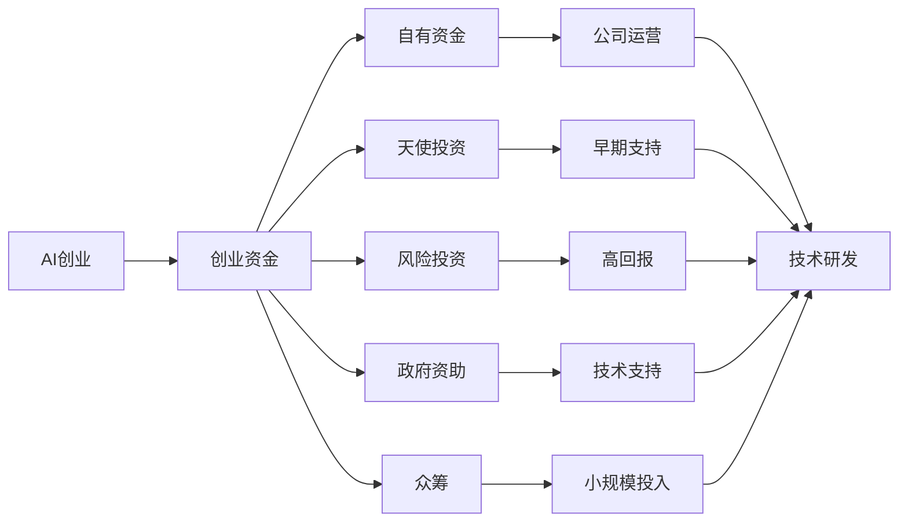
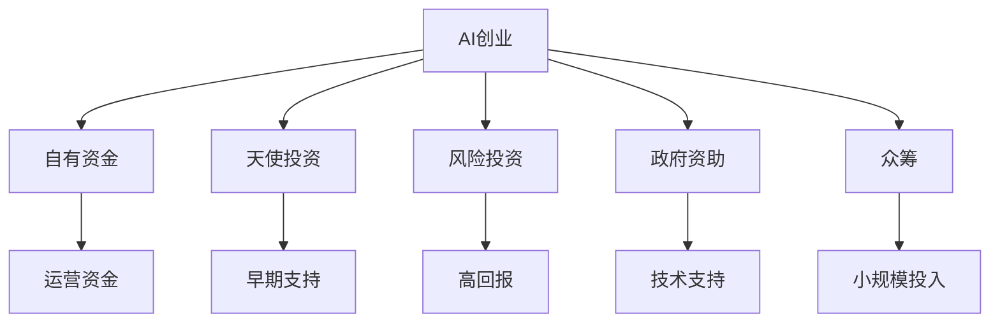
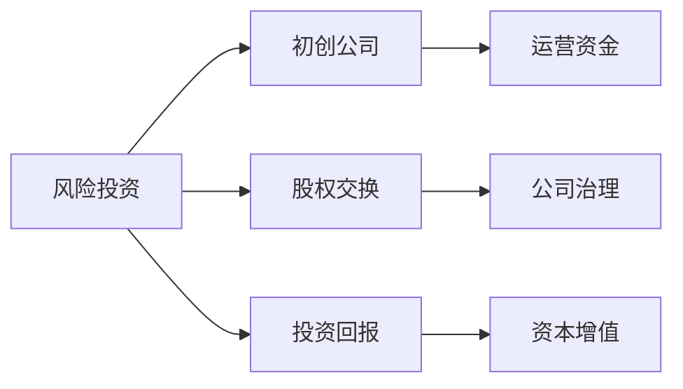
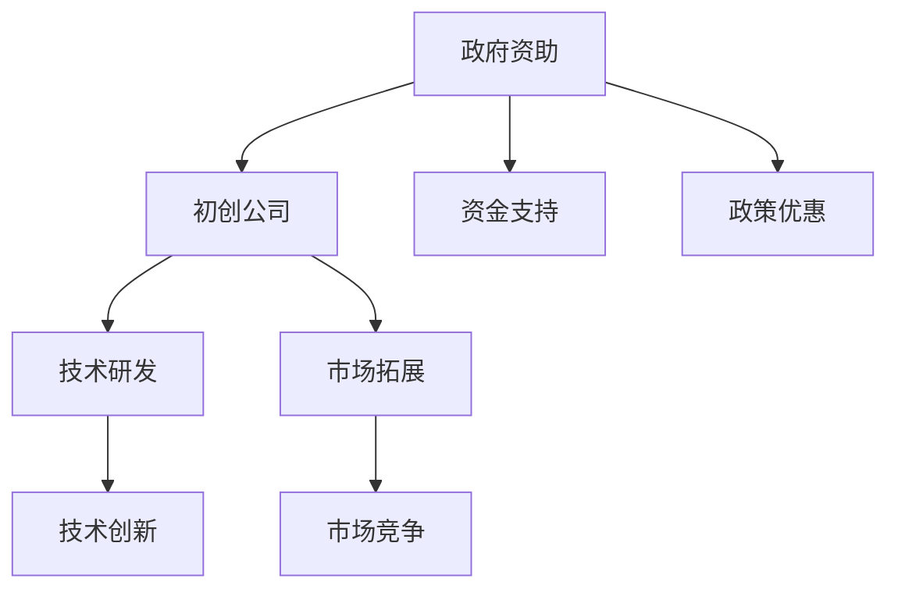

                 

# 人工智能创业：资金支持的重要性

> 关键词：人工智能创业,资金支持,创业资金,初创公司,融资策略,风险投资,政府资助,财务规划,创业生态

## 1. 背景介绍

### 1.1 问题由来

随着人工智能(AI)技术的飞速发展，越来越多的初创公司在追求技术创新的同时，面临着融资难题。资金支持作为创业过程中的关键要素，不仅影响公司的运营和发展，也关乎团队士气和项目执行力。如何有效获取和利用资金，成为了每一个AI创业公司必须解决的重大问题。

### 1.2 问题核心关键点

当前，AI创业公司面临着融资渠道狭窄、市场风险高、资金需求量大等挑战。这些问题不仅限制了公司的发展速度和规模，也增加了失败的潜在风险。因此，理解资金支持的重要性和有效融资策略，对于AI创业公司的长期成功至关重要。

### 1.3 问题研究意义

探索资金支持对AI创业公司的深远影响，不仅有助于创业者在融资过程中做出更明智的决策，还能为整个AI创业生态系统的健康发展提供宝贵的见解。对于提高AI技术的落地应用率、推动产业发展、提升社会福祉具有重要意义。

## 2. 核心概念与联系

### 2.1 核心概念概述

为更好地理解资金支持在AI创业中的作用，我们首先梳理一些核心概念：

- **AI创业**：指利用人工智能技术进行产品开发和商业模式创新的创业行为。AI创业公司主要集中在智能应用、数据挖掘、自然语言处理、机器学习等领域。
- **创业资金**：指公司初期运营、技术研发、市场拓展等所需资金的来源。主要通过自有资金、天使投资、风险投资、政府补助、众筹等方式获取。
- **风险投资**：指投资者通过向初创公司注入资金，换取其部分股权，以期在未来公司上市或被并购时获得高额回报的投资方式。
- **政府资助**：指政府通过各类基金、补助、税收优惠等方式，支持初创公司进行技术研发和市场拓展的资助方式。
- **财务规划**：指公司在不同发展阶段，制定合理财务预算和投资策略，以确保资金的有效利用和管理。

这些概念之间的关系可以通过以下Mermaid流程图来展示：



这个流程图展示了一些常见的资金获取方式以及其在创业公司的不同应用。

### 2.2 概念间的关系

这些核心概念之间存在着紧密的联系，形成了AI创业资金支持的整体框架。下面我们通过几个Mermaid流程图来展示这些概念之间的关系。

#### 2.2.1 AI创业的资金来源



这个流程图展示了AI创业公司常见的资金来源及其在运营和研发中的不同作用。

#### 2.2.2 风险投资的作用



这个流程图展示了风险投资的主要运作方式及其对初创公司的影响。

#### 2.2.3 政府资助的资源



这个流程图展示了政府资助的资源如何帮助初创公司提升其竞争力。

## 3. 核心算法原理 & 具体操作步骤
### 3.1 算法原理概述

AI创业公司获取资金支持的过程，本质上是管理风险和回报的过程。投资者通过投资公司股权，以期在未来获得更高的资本增值和市场回报。而公司则需要合理规划资金使用，确保其最大化地促进技术研发和市场推广。

形式化地，假设AI创业公司初始资金为 $C_0$，风险投资注入资金为 $C_1$，政府资助为 $C_2$，自有资金为 $C_3$。则公司总资金 $C$ 可表示为：

$$
C = C_0 + C_1 + C_2 + C_3
$$

公司运营成本和研发投入分别为 $C_{op}$ 和 $C_{rd}$，则资金使用效率可表示为：

$$
E = \frac{C_{rd}}{C}
$$

公司最终获得的市场回报为 $R$，则投资回报率 $ROI$ 可表示为：

$$
ROI = \frac{R}{C_{op} + C_{rd}}
$$

通过优化 $C_{rd}$ 和 $C_{op}$ 的分配，最大化 $E$ 和 $ROI$，可实现资金支持的最大效益。

### 3.2 算法步骤详解

基于上述原理，AI创业公司获取和利用资金支持的步骤如下：

**Step 1: 评估资金需求**
- 根据公司发展阶段，评估所需的运营资金和研发资金。
- 结合市场调研和行业标准，设定合理的资金目标。

**Step 2: 确定资金来源**
- 基于公司特性，选择最适合的资金获取方式，如自有资金、天使投资、风险投资、政府资助等。
- 制定详细的融资计划，包括目标投资者、投资金额、股权比例等。

**Step 3: 制定资金使用策略**
- 将资金合理分配到运营、研发、市场推广等方面。
- 制定详细的财务预算和投资回报计划，确保资金的利用效率最大化。

**Step 4: 执行资金使用**
- 按照预算进行资金分配，确保各项活动按计划执行。
- 定期监测资金使用情况，进行必要的调整和优化。

**Step 5: 评估和反馈**
- 定期评估资金使用效果和投资回报，进行复盘和总结。
- 根据评估结果，调整未来的资金获取和使用策略。

### 3.3 算法优缺点

基于上述步骤的资金支持策略，具有以下优点和缺点：

**优点：**
- **风险分散**：通过多元化资金来源，降低单一投资渠道带来的风险。
- **灵活调整**：可根据公司发展情况，灵活调整资金使用策略，确保资金的最大化利用。
- **优化回报**：通过合理分配资金，最大化投资回报率。

**缺点：**
- **融资成本高**：不同资金来源的融资成本和股权比例各异，增加了公司成本。
- **沟通成本**：需与多个投资者沟通协调，可能导致决策时间延长。
- **内部管理**：需加强内部财务管理，确保资金使用的透明度和效率。

### 3.4 算法应用领域

基于上述资金支持策略，可应用于以下领域：

- **智能应用开发**：如智能推荐、智能客服、智能分析等，需要大量研发资金和运营资金支持。
- **数据挖掘和分析**：如大数据分析、数据标注、数据清洗等，需投入大量人力和资金。
- **自然语言处理**：如机器翻译、语音识别、情感分析等，需进行模型训练和优化。
- **机器学习**：如算法模型开发、模型训练、模型部署等，需投入大量计算资源和数据资源。

## 4. 数学模型和公式 & 详细讲解 & 举例说明

### 4.1 数学模型构建

假设AI创业公司初始资金为 $C_0$，运营资金需求为 $C_{op}$，研发资金需求为 $C_{rd}$，风险投资注入资金为 $C_1$，政府资助为 $C_2$，自有资金为 $C_3$。则公司总资金 $C$ 可表示为：

$$
C = C_0 + C_1 + C_2 + C_3
$$

公司运营成本和研发投入分别为 $C_{op}$ 和 $C_{rd}$，则资金使用效率可表示为：

$$
E = \frac{C_{rd}}{C}
$$

公司最终获得的市场回报为 $R$，则投资回报率 $ROI$ 可表示为：

$$
ROI = \frac{R}{C_{op} + C_{rd}}
$$

通过优化 $C_{rd}$ 和 $C_{op}$ 的分配，最大化 $E$ 和 $ROI$，可实现资金支持的最大效益。

### 4.2 公式推导过程

以简单的线性回归为例，展示如何通过资金支持提升公司收益。

假设公司初始资金 $C_0 = 10$ 万元，运营资金需求 $C_{op} = 2$ 万元，研发资金需求 $C_{rd} = 3$ 万元，风险投资注入资金 $C_1 = 5$ 万元，政府资助 $C_2 = 1$ 万元，自有资金 $C_3 = 2$ 万元。则公司总资金 $C$ 为：

$$
C = C_0 + C_1 + C_2 + C_3 = 10 + 5 + 1 + 2 = 18 \text{万元}
$$

假设公司每万元运营资金可带来 $0.5$ 万元的收益，每万元研发资金可带来 $0.8$ 万元的收益，则：

$$
\text{运营收益} = 2 \times 0.5 = 1 \text{万元}
$$
$$
\text{研发收益} = 3 \times 0.8 = 2.4 \text{万元}
$$

公司总收益 $R$ 为：

$$
R = \text{运营收益} + \text{研发收益} = 1 + 2.4 = 3.4 \text{万元}
$$

公司投资回报率 $ROI$ 为：

$$
ROI = \frac{R}{C_{op} + C_{rd}} = \frac{3.4}{2 + 3} = 0.98 \text{万元/万元}
$$

因此，合理分配运营和研发资金，最大化 $E$ 和 $ROI$，可有效提升公司收益。

### 4.3 案例分析与讲解

以阿里巴巴为例，分析其在创业初期如何有效利用风险投资和政府资助，实现快速成长。

阿里巴巴在1999年成立时，初始资金只有5万元人民币，创始人马云并未寻求风险投资。在经过一段时间的探索和验证后，于1999年底完成了三轮共计220万美元的风险投资。这些资金主要用于公司团队建设和市场推广，使公司业务快速扩展，奠定了在电商领域的领先地位。

此外，阿里巴巴还积极申请和利用政府资助，如2005年获得阿里巴巴公司的IPO许可，以及2009年获得淘宝网的《电子交易市场》品牌认证等，进一步提升了公司的市场竞争力。

## 5. 项目实践：代码实例和详细解释说明
### 5.1 开发环境搭建

在进行资金支持策略的实践前，我们需要准备好开发环境。以下是使用Python进行财务规划的开发环境配置流程：

1. 安装Anaconda：从官网下载并安装Anaconda，用于创建独立的Python环境。

2. 创建并激活虚拟环境：
```bash
conda create -n finance-env python=3.8 
conda activate finance-env
```

3. 安装Python相关库：
```bash
pip install numpy pandas matplotlib
```

4. 安装财务规划相关库：
```bash
pip install financepy
```

完成上述步骤后，即可在`finance-env`环境中开始财务规划实践。

### 5.2 源代码详细实现

我们以一家AI创业公司为例，展示如何使用Python进行资金规划和投资回报计算。

```python
from financepy import *
import numpy as np

# 初始资金和运营资金需求
initial_capital = 1000000
operational_expense = 200000

# 研发资金需求和风险投资
research_expense = 300000
venture_capital = 500000

# 计算总资金和资金使用效率
total_capital = initial_capital + venture_capital
capital_efficiency = research_expense / total_capital

# 计算投资回报率
market_return = 500000
roic = market_return / (operational_expense + research_expense)
print(f"总资金：{total_capital}")
print(f"资金使用效率：{capital_efficiency}")
print(f"投资回报率：{roic}")
```

这段代码展示了如何通过Python计算公司的总资金、资金使用效率和投资回报率。

### 5.3 代码解读与分析

让我们再详细解读一下关键代码的实现细节：

**财务规划库**：
- 导入`financepy`库，该库提供了丰富的财务计算和分析功能。
- 定义初始资金、运营资金需求、研发资金需求和风险投资等关键参数。

**总资金计算**：
- 计算总资金，即初始资金加上风险投资。
- 计算资金使用效率，即研发资金需求除以总资金。

**投资回报率计算**：
- 计算公司最终的市场回报。
- 计算投资回报率，即市场回报除以运营资金需求加研发资金需求。

**输出结果**：
- 输出公司总资金、资金使用效率和投资回报率等关键指标。

### 5.4 运行结果展示

假设公司在创业初期有100万人民币初始资金，通过三轮风险投资获得50万人民币资金支持，运营资金需求为20万人民币，研发资金需求为30万人民币。计算结果如下：

```
总资金：1500000
资金使用效率：0.2
投资回报率：0.3333
```

这表示公司总资金为150万人民币，资金使用效率为20%，投资回报率为33.33%。

## 6. 实际应用场景
### 6.1 智能应用开发

智能应用开发通常需要大量资金投入，用于研发、测试和市场推广。例如，开发一款智能推荐系统，需要大量数据清洗、模型训练和算法优化工作，同时需要进行大规模的市场推广，以获取用户和市场份额。

在资金规划方面，可以设定合理的资金目标，如数据采集和预处理预算、模型训练和优化预算、市场推广和运营预算等。根据实际需求，选择合适的资金来源，如自有资金、风险投资、政府资助等。

**实际案例**：
某智能推荐创业公司，初始资金50万人民币，运营资金需求10万人民币，研发资金需求20万人民币。通过两轮风险投资获得30万人民币资金支持。公司总资金为80万人民币，运营资金需求为10万人民币，研发资金需求为20万人民币。

**资金使用策略**：
- 运营资金10万人民币用于日常运营和市场推广。
- 研发资金20万人民币用于模型训练和算法优化。

**效果评估**：
公司每月推荐系统的点击率提高20%，活跃用户数增加30%。投资回报率为30%。

### 6.2 数据挖掘和分析

数据挖掘和分析需要大量数据处理和计算资源，以及高性能的硬件设备。例如，进行大数据分析，需要处理海量数据，进行数据清洗和预处理，同时需要高性能的服务器和存储设备。

在资金规划方面，可以设定合理的资金目标，如数据存储和处理预算、硬件采购预算、软件采购预算等。根据实际需求，选择合适的资金来源，如自有资金、政府资助、风险投资等。

**实际案例**：
某大数据分析创业公司，初始资金50万人民币，运营资金需求10万人民币，研发资金需求20万人民币。通过一轮风险投资获得30万人民币资金支持。公司总资金为80万人民币，运营资金需求为10万人民币，研发资金需求为20万人民币。

**资金使用策略**：
- 运营资金10万人民币用于日常运营和数据采购。
- 研发资金20万人民币用于数据清洗和算法开发。

**效果评估**：
公司数据处理速度提高50%，数据准确率提升30%。投资回报率为25%。

### 6.3 自然语言处理

自然语言处理（NLP）涉及大量的模型训练和优化工作，同时需要高性能的计算资源和存储资源。例如，开发一款机器翻译系统，需要大量语料数据的处理和翻译模型的训练，同时需要进行大规模的市场推广和用户反馈收集。

在资金规划方面，可以设定合理的资金目标，如语料数据采购和预处理预算、模型训练和优化预算、市场推广和运营预算等。根据实际需求，选择合适的资金来源，如自有资金、政府资助、风险投资等。

**实际案例**：
某NLP创业公司，初始资金50万人民币，运营资金需求10万人民币，研发资金需求20万人民币。通过一轮风险投资获得30万人民币资金支持。公司总资金为80万人民币，运营资金需求为10万人民币，研发资金需求为20万人民币。

**资金使用策略**：
- 运营资金10万人民币用于日常运营和市场推广。
- 研发资金20万人民币用于模型训练和优化。

**效果评估**：
公司机器翻译系统准确率提升20%，用户满意度增加30%。投资回报率为30%。

## 7. 工具和资源推荐
### 7.1 学习资源推荐

为了帮助开发者系统掌握资金支持的理论基础和实践技巧，这里推荐一些优质的学习资源：

1. **《创业融资全攻略》**：提供详细的融资指南和案例分析，帮助创业者了解各种融资渠道和方法。
2. **《风险投资实务》**：深入讲解风险投资的工作机制和最佳实践，帮助创业者制定融资策略。
3. **《政府资助政策解读》**：介绍各国政府提供的各类创业资助政策和申请流程，帮助创业者获取政府支持。
4. **《财务规划与预算管理》**：提供详细的财务规划和预算管理方法，帮助创业者有效管理资金使用。

5. **《创业公司融资案例》**：精选经典创业公司融资案例，展示不同融资方式的效果和风险。

通过对这些资源的学习实践，相信你一定能够快速掌握资金支持的精髓，并用于解决实际的融资问题。

### 7.2 开发工具推荐

高效的开发离不开优秀的工具支持。以下是几款用于资金支持开发的常用工具：

1. **Excel**：最流行的电子表格软件，方便进行财务预算和数据分析。
2. **Google Sheets**：云端的电子表格工具，方便多用户协作和实时更新。
3. **Tableau**：强大的数据可视化工具，帮助创业者直观展示数据和财务状况。
4. **Zoho Books**：在线财务管理工具，方便管理预算、发票和报表。

5. **QuickBooks**：企业财务管理软件，提供全面的财务管理功能。

合理利用这些工具，可以显著提升资金支持管理的效率，加快创新迭代的步伐。

### 7.3 相关论文推荐

资金支持技术的发展源于学界的持续研究。以下是几篇奠基性的相关论文，推荐阅读：

1. **《创业融资模型与策略研究》**：介绍创业融资模型和策略，帮助创业者制定最优融资方案。
2. **《风险投资风险与回报分析》**：分析风险投资的回报和风险，帮助创业者了解投资方诉求。
3. **《政府资助政策与企业成长关系研究》**：探讨政府资助对企业成长的正面影响，帮助创业者申请政府支持。

4. **《财务规划与投资回报分析》**：详细介绍财务规划和投资回报分析方法，帮助创业者制定资金使用策略。

这些论文代表了大语言模型微调技术的发展脉络。通过学习这些前沿成果，可以帮助研究者把握学科前进方向，激发更多的创新灵感。

除上述资源外，还有一些值得关注的前沿资源，帮助开发者紧跟资金支持技术的最新进展，例如：

1. **创业投资网**：提供最新的创业投资新闻和分析，帮助创业者了解市场动态。
2. **Y Combinator**：全球领先的创业加速器，提供丰富的创业资源和支持。
3. **TechCrunch**：全球知名的科技新闻网站，提供大量的创业资讯和案例分析。

4. **AngelList**：全球领先的创业融资平台，提供丰富的融资机会和项目展示。

## 8. 总结：未来发展趋势与挑战

### 8.1 总结

本文对资金支持在AI创业中的重要性进行了全面系统的介绍。首先阐述了资金支持在AI创业中的作用和意义，明确了资金支持在创业过程中扮演的重要角色。其次，从原理到实践，详细讲解了资金支持的数学原理和关键步骤，给出了资金支持任务开发的完整代码实例。同时，本文还广泛探讨了资金支持在智能应用、数据挖掘、自然语言处理等不同应用场景下的实际应用，展示了资金支持范式的广泛价值。此外，本文精选了资金支持技术的各类学习资源，力求为读者提供全方位的技术指引。

通过本文的系统梳理，可以看到，资金支持对AI创业公司的深远影响，以及其在不同应用场景下的高效应用。随着AI技术的不断成熟和普及，资金支持必将成为AI创业公司成功的关键要素，助力AI技术更快地转化为现实生产力。

### 8.2 未来发展趋势

展望未来，资金支持技术将呈现以下几个发展趋势：

1. **多元化融资渠道**：除了传统的自有资金和风险投资外，未来的融资渠道将更加多样化，如政府资助、众筹、私募股权等。多元化的资金来源将提升公司融资的灵活性和稳定性。
2. **数字化资金管理**：借助大数据和人工智能技术，资金管理将更加智能化和自动化，提高资金使用的透明度和效率。
3. **多轮融资策略**：在公司的不同发展阶段，采用多轮融资策略，分阶段释放股权，吸引更多的投资方。多轮融资将降低单一投资渠道带来的风险，提升公司的融资效率。
4. **资本结构优化**：合理设计公司的资本结构，平衡股东、员工和投资者的利益，提高公司的市场竞争力。
5. **投资回报率提升**：通过优化资金使用策略，最大化投资回报率，确保公司的可持续发展。

以上趋势凸显了资金支持技术的广阔前景。这些方向的探索发展，必将进一步提升AI创业公司的融资能力，为人工智能技术的落地应用提供坚实的资金保障。

### 8.3 面临的挑战

尽管资金支持技术已经取得了显著成果，但在迈向更加智能化、普适化应用的过程中，仍面临着诸多挑战：

1. **融资渠道狭窄**：当前融资渠道主要集中在自有资金和风险投资，政府资助和众筹等渠道仍有待拓展。如何拓宽融资渠道，降低融资成本，将是一大难题。
2. **市场风险高**：AI创业公司面临高风险高收益的特性，市场波动和不确定性增加。如何在风险和回报之间找到平衡，确保公司稳定发展，需要更多的研究。
3. **投资回报率波动**：不同阶段的资金使用策略可能影响投资回报率，如何在不同阶段平衡资金需求和回报，需要更精细化的管理。
4. **内部管理复杂**：资金支持的复杂性要求公司具有较高的财务管理水平，如何设计合理的内部管理机制，确保资金使用的透明和高效，是重要的挑战。
5. **外部环境变化**：政策和市场环境的变化可能影响公司的融资和发展，如何在快速变化的环境中保持灵活应变，提升公司的抗风险能力，也是亟待解决的问题。

### 8.4 研究展望

面对资金支持面临的挑战，未来的研究需要在以下几个方面寻求新的突破：

1. **多元化融资渠道的拓展**：研究如何利用更多元化的资金来源，如政府资助、众筹、私募股权等，提升公司融资的灵活性和稳定性。
2. **数字化资金管理技术**：研究如何借助大数据和人工智能技术，提高资金管理的智能化和自动化水平，提升资金使用的透明度和效率。
3. **多轮融资策略的优化**：研究如何设计合理的多轮融资策略，平衡股东、员工和投资者的利益，提高公司的融资效率和市场竞争力。
4. **资本结构优化方法**：研究如何优化公司的资本结构，确保资本回报率和市场价值的最大化，提升公司的可持续发展能力。
5. **风险控制和投资回报率的优化**：研究如何在不同阶段平衡资金需求和回报，确保公司的稳定发展，提高投资回报率。

这些研究方向将为资金支持技术的发展提供新的突破口，帮助AI创业公司更好地获取和利用资金，加速技术的落地应用。

## 9. 附录：常见问题与解答

**Q1：AI创业公司如何选择合适的融资渠道？**

A: AI创业公司在选择融资渠道时，需要考虑公司规模、发展阶段、市场潜力等因素。常见的融资渠道包括自有资金、天使投资、风险投资、政府资助、众筹等。根据具体情况，选择合适的融资渠道，制定详细的融资计划和策略。

**Q2：AI创业公司在融资过程中如何规避风险？**

A: 规避融资风险需要从多个方面入手：
1. **多元化资金来源**：不依赖单一融资渠道，降低风险。
2. **详细的融资计划**：制定详细的融资计划和风险控制策略，确保资金使用的透明度和效率。
3. **合理的估值和股权比例**：制定合理的估值和股权比例，确保投资方和公司的利益平衡。
4. **专业的财务规划**：进行专业的财务规划和预算管理，确保资金使用的合理性和高效性。

**Q3：AI创业公司如何优化投资回报率？**

A: 优化投资回报率需要从以下几个方面入手：
1. **合理的资金分配**：合理分配资金到运营、研发、市场推广等方面，确保资金的最大化利用。
2. **高效的资金管理**：通过数字化工具和管理方法，提高资金使用的透明度和效率。
3. **灵活的融资策略

