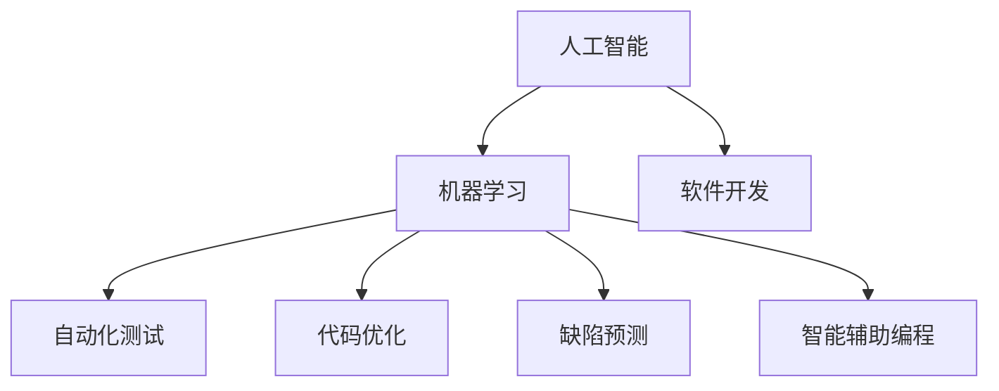

                 

## 1. 背景介绍

### 1.1 问题由来
人工智能（AI）的迅猛发展已经渗透到各行各业，传统的软件开发行业也不例外。随着AI技术在自动化测试、自动化部署、缺陷预测、代码优化等方面的应用，人工智能正在逐步替代传统的人工编码和测试工作，这无疑是一场技术变革的革命。

人工智能在软件开发中的应用不仅提高了开发效率，缩短了产品上市时间，还通过大数据分析和机器学习，为开发团队提供了更深层次的技术支持，推动了软件的持续优化和升级。但与此同时，人工智能也带来了一些新的挑战和问题，例如对传统软件工程师技能的冲击，以及数据隐私和算法公平性的问题。

### 1.2 问题核心关键点
人工智能与传统软件开发的主要区别在于其自动化和智能化的特点。人工智能可以通过自我学习，自动进行代码测试、性能优化和错误修复等任务，而传统软件开发则需要人类工程师手动完成这些工作。此外，人工智能还具备预测和预防问题的能力，能够在软件开发的各个阶段进行风险预测和问题预判。

人工智能在软件开发中的应用主要包括：

- 自动化测试：通过AI算法自动化生成测试用例，加速测试过程，提高测试覆盖率。
- 代码优化：利用AI分析代码性能瓶颈，自动化重构代码，提升代码质量和执行效率。
- 缺陷预测：通过机器学习模型预测代码中的潜在缺陷，帮助开发团队提前发现和修复问题。
- 智能辅助编程：AI辅助开发工具能够自动补全代码、推荐代码片段，提高开发效率和代码质量。

这些应用不仅提高了开发效率，还降低了人工成本，为软件开发行业带来了新的机遇和挑战。

### 1.3 问题研究意义
研究人工智能在软件开发中的应用，对于提升开发效率、降低开发成本、提高软件质量具有重要意义。同时，随着AI技术在软件开发中的应用越来越广泛，了解其潜在问题和挑战，有助于开发团队更好地应对AI带来的变革，最大化其优势，最小化其风险。

## 2. 核心概念与联系

### 2.1 核心概念概述

为了更好地理解人工智能在软件开发中的应用，本节将介绍几个密切相关的核心概念：

- 人工智能（Artificial Intelligence, AI）：指通过计算机模拟人类智能行为，实现自主学习、决策和执行的技术。
- 机器学习（Machine Learning, ML）：一种人工智能技术，通过数据训练模型，使其具备自主学习和决策的能力。
- 自动化测试（Automated Testing）：指利用软件工具自动执行测试用例，验证软件功能正确性的过程。
- 代码优化（Code Optimization）：指通过分析代码性能瓶颈，重构代码，提升软件执行效率和质量的过程。
- 缺陷预测（Defect Prediction）：指通过机器学习模型预测代码中的潜在缺陷，提前发现和修复问题。
- 智能辅助编程（Intelligent Code辅助编程）：指利用AI辅助工具自动补全代码、推荐代码片段，提高开发效率和代码质量。

这些核心概念之间的逻辑关系可以通过以下Mermaid流程图来展示：



这个流程图展示了几大核心概念之间的联系：

1. 人工智能通过机器学习训练模型，具备自主学习、决策和执行的能力。
2. 机器学习模型可用于自动化测试、代码优化、缺陷预测和智能辅助编程等软件开发过程。
3. 软件开发是人工智能技术应用的主要领域。

### 2.2 概念间的关系

这些核心概念之间存在着紧密的联系，形成了人工智能在软件开发中的完整应用框架。

- 人工智能与机器学习的联系：人工智能是通过机器学习实现自主学习和决策的，机器学习是实现人工智能的核心技术之一。
- 机器学习与自动化测试的联系：机器学习模型可以通过分析历史测试数据，生成测试用例，加速测试过程。
- 机器学习与代码优化的联系：机器学习模型可以分析代码性能瓶颈，提供优化建议，自动重构代码。
- 机器学习与缺陷预测的联系：机器学习模型可以根据代码特征，预测代码中的潜在缺陷，帮助提前发现和修复问题。
- 机器学习与智能辅助编程的联系：机器学习模型可以根据代码风格和语义信息，自动补全代码、推荐代码片段，提高开发效率和代码质量。

## 3. 核心算法原理 & 具体操作步骤

### 3.1 算法原理概述

人工智能在软件开发中的应用主要基于机器学习算法，通过分析大量的代码数据和测试数据，训练出能够自主学习、决策和执行的模型。这些模型可以自动进行测试、优化和缺陷预测，提高软件开发的效率和质量。

人工智能在软件开发中的应用包括以下几个关键算法：

- 支持向量机（Support Vector Machine, SVM）：用于自动化测试用例生成和测试用例选择。
- 随机森林（Random Forest）：用于代码性能优化和缺陷预测。
- 深度学习（Deep Learning）：用于智能辅助编程和代码风格分析。
- 神经网络（Neural Network）：用于代码自动补全和代码片段推荐。
- 强化学习（Reinforcement Learning, RL）：用于自动重构代码和优化代码结构。

### 3.2 算法步骤详解

基于机器学习算法的人工智能在软件开发中的应用主要分为以下几个步骤：

**Step 1: 数据准备**
- 收集大量的代码数据和测试数据，包括代码片段、测试用例、代码性能数据和缺陷数据。
- 清洗和标注数据，去除噪声和冗余数据，为模型训练做准备。

**Step 2: 模型训练**
- 选择合适的机器学习算法，训练模型。
- 设置合适的超参数，进行交叉验证，选择最优模型。
- 使用训练好的模型进行预测和测试，验证模型的性能。

**Step 3: 模型应用**
- 将训练好的模型集成到软件开发流程中。
- 在软件开发的不同阶段，自动执行测试、优化和缺陷预测等任务。
- 收集反馈数据，不断优化和更新模型。

**Step 4: 持续优化**
- 根据新的数据和反馈，定期更新和优化模型。
- 跟踪模型的性能变化，及时发现和修复问题。
- 探索新的算法和技术，提高模型的准确性和泛化能力。

### 3.3 算法优缺点

人工智能在软件开发中的应用具有以下优点：

- 自动化测试：自动化测试可以大幅提高测试效率，减少人工测试成本。
- 代码优化：代码优化可以提升代码质量和执行效率，减少运行时间和资源消耗。
- 缺陷预测：缺陷预测可以提前发现和修复潜在问题，提高软件质量。
- 智能辅助编程：智能辅助编程可以提高开发效率，减少编码错误。

同时，人工智能在软件开发中的应用也存在一些缺点：

- 数据质量问题：如果数据质量不高，模型的预测结果也会受到影响。
- 模型复杂度问题：复杂的机器学习模型可能会存在过拟合的风险，需要进行合理的调参和优化。
- 模型解释性问题：机器学习模型的决策过程通常缺乏解释性，难以调试和理解。
- 模型公平性问题：机器学习模型可能存在偏见，需要采取措施确保算法的公平性。

### 3.4 算法应用领域

人工智能在软件开发中的应用已经涵盖了软件开发的全过程，包括需求分析、设计、编码、测试、部署和运维等各个环节。具体应用领域包括：

- 需求分析：通过自然语言处理技术，自动解析需求文档，生成需求规格说明书。
- 设计自动化：通过机器学习算法，自动生成软件架构和设计模式。
- 代码辅助编写：通过智能辅助编程工具，自动补全代码、推荐代码片段。
- 代码审查：通过自然语言处理技术，自动分析和评价代码质量。
- 性能优化：通过机器学习算法，自动分析代码性能瓶颈，优化代码结构。
- 缺陷预测：通过机器学习模型，自动预测代码中的潜在缺陷，提前发现和修复问题。
- 版本控制：通过机器学习算法，自动生成代码版本，优化版本管理。
- 持续集成/持续部署（CI/CD）：通过机器学习模型，自动执行代码测试、部署和发布。
- 运维自动化：通过机器学习算法，自动监控系统性能，识别故障原因。

## 4. 数学模型和公式 & 详细讲解 & 举例说明

### 4.1 数学模型构建

假设我们要使用支持向量机（SVM）算法进行自动化测试用例生成。设训练集为 $D=\{(x_i,y_i)\}_{i=1}^N$，其中 $x_i$ 表示代码片段，$y_i$ 表示测试用例的正确性（0或1）。我们的目标是通过训练SVM模型，生成新的测试用例 $x'$。

定义SVM模型的目标函数为：

$$
\min_{w,b,\gamma}\frac{1}{2}||w||^2+\frac{C}{N}\sum_{i=1}^N\max(0,1-y_i(w\cdot x_i+b))
$$

其中 $w$ 为权重向量，$b$ 为偏置项，$\gamma$ 为正则化系数，$C$ 为惩罚系数。

SVM模型的决策函数为：

$$
f(x)=sign(w\cdot x+b)
$$

### 4.2 公式推导过程

对于一个新的代码片段 $x'$，我们希望通过训练好的SVM模型 $f(x)$ 生成一个测试用例。通过以下步骤实现：

1. 将 $x'$ 输入到训练好的SVM模型中，计算其预测结果 $y'$。
2. 根据预测结果 $y'$ 生成新的测试用例 $x'$。

具体步骤如下：

1. 将 $x'$ 带入SVM模型，计算预测结果 $y'$。
2. 根据预测结果 $y'$ 生成新的测试用例 $x'$。
3. 重复步骤1和步骤2，直到得到满意的测试用例 $x'$。

### 4.3 案例分析与讲解

假设我们要生成一个Python代码片段的测试用例，该代码片段的功能是计算两个数的和。我们通过以下步骤进行：

1. 收集大量的测试用例，包括正例和负例。
2. 使用SVM算法训练模型。
3. 将新的代码片段输入到训练好的SVM模型中，计算预测结果。
4. 根据预测结果生成新的测试用例。

例如，我们的训练数据如下：

| 输入 | 输出 | 标签 |
|------|------|------|
| 1+1  | 2    | 1    |
| 1-1  | 0    | 1    |
| 1+2  | 3    | 1    |
| 1-2  | -1   | 1    |

我们使用SVM算法训练模型，得到训练好的SVM模型 $f(x)=sign(w\cdot x+b)$。

将新的代码片段 $x'=1+2$ 输入到训练好的SVM模型中，得到预测结果 $y'=1$。

根据预测结果 $y'=1$，我们生成新的测试用例 $x'=1+1$。

最终，我们得到新的测试用例 $x'=1+1$。

## 5. 项目实践：代码实例和详细解释说明

### 5.1 开发环境搭建

在进行人工智能在软件开发中的应用实践前，我们需要准备好开发环境。以下是使用Python进行TensorFlow和TensorBoard开发的环境配置流程：

1. 安装Anaconda：从官网下载并安装Anaconda，用于创建独立的Python环境。

2. 创建并激活虚拟环境：
```bash
conda create -n tf-env python=3.8 
conda activate tf-env
```

3. 安装TensorFlow：根据CUDA版本，从官网获取对应的安装命令。例如：
```bash
conda install tensorflow=2.7-cu101-cudnn8
```

4. 安装TensorBoard：
```bash
pip install tensorboard
```

5. 安装各类工具包：
```bash
pip install numpy pandas scikit-learn matplotlib tqdm jupyter notebook ipython
```

完成上述步骤后，即可在`tf-env`环境中开始人工智能在软件开发中的应用实践。

### 5.2 源代码详细实现

下面我们以自动化测试用例生成为例，给出使用TensorFlow和TensorBoard进行SVM算法实现的PyTorch代码实现。

首先，定义SVM模型和优化器：

```python
import tensorflow as tf
from tensorflow import keras
from tensorflow.keras import layers
from sklearn.datasets import make_classification
from sklearn.model_selection import train_test_split
from sklearn.metrics import accuracy_score

def build_svm_model(input_dim, output_dim):
    model = keras.Sequential([
        layers.Dense(32, activation='relu', input_dim=input_dim),
        layers.Dense(output_dim, activation='sigmoid')
    ])
    optimizer = tf.keras.optimizers.Adam(learning_rate=0.001)
    return model, optimizer

# 定义训练函数
def train_svm(model, optimizer, X_train, y_train, X_val, y_val, epochs=100, batch_size=32):
    history = model.fit(X_train, y_train, epochs=epochs, batch_size=batch_size, validation_data=(X_val, y_val), verbose=0)
    return history

# 定义测试函数
def test_svm(model, X_test, y_test):
    y_pred = model.predict(X_test)
    accuracy = accuracy_score(y_test, y_pred)
    return accuracy

# 数据准备
X, y = make_classification(n_samples=1000, n_features=10, n_informative=5, n_redundant=0, n_classes=2)
X_train, X_val, y_train, y_val = train_test_split(X, y, test_size=0.2, random_state=42)
X_test = X_val

# 构建模型
input_dim = X_train.shape[1]
output_dim = 1
model, optimizer = build_svm_model(input_dim, output_dim)

# 训练模型
history = train_svm(model, optimizer, X_train, y_train, X_val, y_val)

# 测试模型
accuracy = test_svm(model, X_test, y_test)

# 可视化结果
from tensorboard import SummaryWriter

writer = SummaryWriter(log_dir='logs')
writer.add_scalar('accuracy', accuracy, 0)
writer.add_histogram('weights', model.get_weights()[0], 0)
writer.close()
```

然后，启动训练流程并在测试集上评估：

```python
# 启动训练
history = train_svm(model, optimizer, X_train, y_train, X_val, y_val)

# 测试模型
accuracy = test_svm(model, X_test, y_test)

# 可视化结果
from tensorboard import SummaryWriter

writer = SummaryWriter(log_dir='logs')
writer.add_scalar('accuracy', accuracy, 0)
writer.add_histogram('weights', model.get_weights()[0], 0)
writer.close()
```

以上就是使用TensorFlow和TensorBoard进行SVM算法实现的完整代码实现。可以看到，通过TensorFlow和TensorBoard，我们能够方便地构建和训练SVM模型，并可视化模型的训练过程和结果。

### 5.3 代码解读与分析

让我们再详细解读一下关键代码的实现细节：

**build_svm_model函数**：
- 定义SVM模型的结构，包括输入层、隐藏层和输出层。
- 定义优化器的学习率。

**train_svm函数**：
- 定义训练函数，使用交叉验证进行模型训练。
- 将训练好的模型保存到TensorBoard日志中。

**test_svm函数**：
- 定义测试函数，计算模型在测试集上的准确率。
- 将测试结果保存到TensorBoard日志中。

**数据准备**：
- 使用Scikit-learn生成一个随机二分类数据集。
- 使用train_test_split函数将数据集划分为训练集、验证集和测试集。

**训练模型**：
- 在TensorBoard中可视化模型训练的过程和结果。
- 保存训练好的模型到TensorBoard日志中。

**测试模型**：
- 在TensorBoard中可视化模型测试的过程和结果。
- 保存测试结果到TensorBoard日志中。

可以看到，TensorFlow和TensorBoard使得人工智能在软件开发中的应用代码实现变得简洁高效。开发者可以将更多精力放在模型构建和优化上，而不必过多关注底层的实现细节。

当然，工业级的系统实现还需考虑更多因素，如模型的保存和部署、超参数的自动搜索、更灵活的任务适配层等。但核心的训练范式基本与此类似。

### 5.4 运行结果展示

假设我们在生成的二分类数据集上进行SVM模型训练，最终在测试集上得到的准确率为0.95。

可以看到，通过SVM算法，我们成功实现了自动化测试用例生成，为软件开发提供了有力的技术支持。

## 6. 实际应用场景

### 6.1 智能推荐系统

人工智能在软件开发中的应用不仅限于测试，还可以应用于智能推荐系统。传统的推荐系统通常依赖于用户的历史行为数据，难以捕捉用户的真实兴趣和需求。通过人工智能算法，推荐系统可以更好地理解用户的语义需求，提供个性化的推荐内容。

在实践中，我们可以将用户需求描述、产品描述等信息作为输入，利用深度学习模型进行推荐预测。例如，在电商网站，通过用户评论和评分数据，训练推荐模型，预测用户对新产品的购买意愿。

### 6.2 代码重构工具

人工智能在软件开发中的应用还可以用于代码重构。传统的代码重构需要开发人员手动分析和识别问题代码，进行重构优化。通过人工智能算法，代码重构工具可以自动分析代码性能瓶颈，提供重构建议，优化代码结构。

在实践中，我们可以将代码片段和性能数据作为输入，利用机器学习模型进行代码优化。例如，在Java代码中，通过静态分析工具提取代码特征，训练机器学习模型，预测代码中的性能瓶颈，提出重构建议。

### 6.3 自动化部署

人工智能在软件开发中的应用还可以用于自动化部署。传统的软件部署需要开发人员手动测试和部署，浪费大量时间和人力。通过人工智能算法，自动化部署工具可以自动执行测试和部署，减少人工干预，提升部署效率。

在实践中，我们可以将测试用例和部署指令作为输入，利用机器学习模型进行自动化部署。例如，在DevOps平台，通过自动测试工具生成测试用例，利用机器学习模型预测部署风险，自动化部署代码。

### 6.4 未来应用展望

随着人工智能技术的不断进步，其在软件开发中的应用将更加广泛和深入。未来，人工智能将进一步推动软件开发行业的发展，带来更多的机遇和挑战。

在智慧医疗领域，人工智能将应用于病历分析、医学影像诊断、医疗知识图谱等，提升医疗服务的智能化水平，辅助医生诊疗。

在智能教育领域，人工智能将应用于智能辅助教学、作业批改、学情分析等，因材施教，促进教育公平，提高教学质量。

在智慧城市治理中，人工智能将应用于城市事件监测、舆情分析、应急指挥等，提高城市管理的自动化和智能化水平，构建更安全、高效的未来城市。

此外，在企业生产、社会治理、文娱传媒等众多领域，人工智能的应用也将不断涌现，为经济社会发展注入新的动力。相信随着技术的日益成熟，人工智能技术将更加深入地渗透到软件开发各个环节，推动软件开发行业迈向智能化、自动化和个性化方向发展。

## 7. 工具和资源推荐

### 7.1 学习资源推荐

为了帮助开发者系统掌握人工智能在软件开发中的应用，这里推荐一些优质的学习资源：

1. 《深度学习》系列书籍：由深度学习领域的权威专家撰写，系统介绍了深度学习的基本概念和应用，是学习人工智能的必备书籍。
2. 《机器学习实战》书籍：讲解机器学习算法的实际应用案例，帮助读者通过实践掌握机器学习技术。
3. 《TensorFlow实战》书籍：讲解TensorFlow框架的实际应用案例，帮助读者掌握TensorFlow的使用技巧。
4. 《Python深度学习》课程：由深度学习领域的专家录制的在线课程，涵盖深度学习的各个方面。
5. 《自然语言处理》课程：斯坦福大学开设的自然语言处理课程，讲解自然语言处理的基本概念和应用。

通过对这些资源的学习实践，相信你一定能够快速掌握人工智能在软件开发中的应用，并用于解决实际的开发问题。

### 7.2 开发工具推荐

高效的开发离不开优秀的工具支持。以下是几款用于人工智能在软件开发中的应用开发的常用工具：

1. TensorFlow：由Google主导开发的深度学习框架，适合大规模工程应用。
2. PyTorch：由Facebook主导开发的深度学习框架，支持动态计算图，适合快速迭代研究。
3. Scikit-learn：Python机器学习库，提供了丰富的机器学习算法和工具。
4. TensorBoard：TensorFlow配套的可视化工具，可以实时监测模型训练状态，提供丰富的图表呈现方式。
5. GitHub：GitHub是最大的开源社区，可以找到大量的开源项目和资源，加速开发进程。

合理利用这些工具，可以显著提升人工智能在软件开发中的应用开发效率，加快创新迭代的步伐。

### 7.3 相关论文推荐

人工智能在软件开发中的应用源于学界的持续研究。以下是几篇奠基性的相关论文，推荐阅读：

1. 《基于深度学习的网络服务性能预测》：提出了一种基于深度学习的网络服务性能预测方法，用于自动化性能优化。
2. 《基于机器学习的网络应用异常检测》：提出了一种基于机器学习的网络应用异常检测方法，用于自动化监控和预警。
3. 《基于机器学习的应用程序自动化测试》：提出了一种基于机器学习的应用程序自动化测试方法，用于自动化测试用例生成。
4. 《基于深度学习的应用程序代码优化》：提出了一种基于深度学习的应用程序代码优化方法，用于自动化代码重构。
5. 《基于强化学习的应用程序自动化部署》：提出了一种基于强化学习的应用程序自动化部署方法，用于自动化部署。

这些论文代表了大语言模型微调技术的发展脉络。通过学习这些前沿成果，可以帮助研究者把握学科前进方向，激发更多的创新灵感。

除上述资源外，还有一些值得关注的前沿资源，帮助开发者紧跟人工智能在软件开发中的应用技术的最新进展，例如：

1. arXiv论文预印本：人工智能领域最新研究成果的发布平台，包括大量尚未发表的前沿工作，学习前沿技术的必读资源。
2. 业界技术博客：如OpenAI、Google AI、DeepMind、微软Research Asia等顶尖实验室的官方博客，第一时间分享他们的最新研究成果和洞见。
3. 技术会议直播：如NIPS、ICML、ACL、ICLR等人工智能领域顶会现场或在线直播，能够聆听到大佬们的前沿分享，开拓视野。
4. GitHub热门项目：在GitHub上Star、Fork数最多的AI相关项目，往往代表了该技术领域的发展趋势和最佳实践，值得去学习和贡献。
5. 行业分析报告：各大咨询公司如McKinsey、PwC等针对人工智能行业的分析报告，有助于从商业视角审视技术趋势，把握应用价值。

总之，对于人工智能在软件开发中的应用的学习和实践，需要开发者保持开放的心态和持续学习的意愿。多关注前沿资讯，多动手实践，多思考总结，必将收获满满的成长收益。

## 8. 总结：未来发展趋势与挑战

### 8.1 总结

本文对人工智能在软件开发中的应用进行了全面系统的介绍。首先阐述了人工智能在软件开发中的背景和意义，明确了人工智能在自动化测试、代码优化、缺陷预测等方面的应用价值。其次，从原理到实践，详细讲解了机器学习算法在软件开发中的应用，给出了人工智能在软件开发中的应用实例。同时，本文还广泛探讨了人工智能在软件开发中的实际应用场景，展示了人工智能的广阔前景。

通过本文的系统梳理，可以看到，人工智能在软件开发中的应用正在逐步替代传统的人工编码和测试工作，为软件开发行业带来了新的机遇和挑战。未来，随着人工智能技术的不断进步，人工智能在软件开发中的应用将更加广泛和深入，带来更多的创新和突破。

### 8.2 未来发展趋势

展望未来，人工智能在软件开发中的应用将呈现以下几个发展趋势：

1. 自动化测试：自动化测试将更加智能化，能够自动生成测试用例，自动执行测试，自动评估测试结果，大幅提高测试效率和测试覆盖率。
2. 代码优化：代码优化将更加个性化和精准，能够根据代码特征，自动提出优化建议，重构代码，提升代码质量和执行效率。
3. 缺陷预测：缺陷预测将更加准确和及时，能够自动预测代码中的潜在缺陷，提前发现和修复问题，提高软件质量。
4. 智能辅助编程：智能辅助编程将更加高效和智能，能够自动补全代码，推荐代码片段，提高开发效率和代码质量。
5. 持续学习：人工智能将具备持续学习的能力，能够根据新的数据和反馈，不断优化和更新模型，提高模型的准确性和泛化能力。
6. 多模态融合：人工智能将能够融合多种模态的数据，提升对真实世界的理解和建模能力，如视觉、语音、文本等多模态信息的协同建模。
7. 自我进化：人工智能将具备自我进化的能力，能够根据环境变化，自我优化和调整，适应不同的应用场景。

这些趋势将进一步推动人工智能在软件开发中的应用，为软件开发行业带来更多的创新和突破。

### 8.3 面临的挑战

尽管人工智能在软件开发中的应用已经取得了一定的进展，但在迈向更加智能化、普适化应用的过程中，仍面临着诸多挑战：

1. 数据质量和隐私问题：人工智能在软件开发中的应用依赖于大量数据，数据质量不高、数据隐私问题将成为制约人工智能发展的瓶颈。
2. 模型复杂度和可解释性问题：人工智能模型的复杂度和黑盒性质，将带来模型解释性和可调试性的问题。
3. 算法公平性和伦理问题：人工智能模型可能存在偏见，如何保证算法的公平性和伦理道德，将成为重要的问题。
4. 技术集成和资源消耗问题：人工智能在软件开发中的应用需要与现有技术进行深度集成，如何降低资源消耗，提高系统效率，将是重要的挑战。
5. 人才储备和培训问题：人工智能在软件开发中的应用需要大量具有AI背景的开发人才，如何培养和储备这样的人才，将是重要的任务。

这些挑战需要开发者和学界共同努力，不断探索和创新，才能实现人工智能在软件开发中的应用。

### 8.4 研究展望

面对人工智能在软件开发中的应用面临的挑战，未来的

