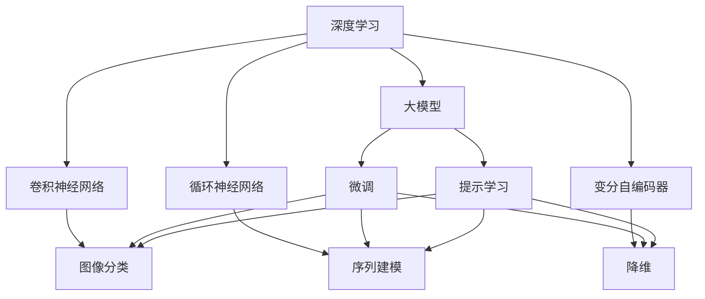

                 

# 从零开始大模型开发与微调：深度学习基础

> 关键词：深度学习,大模型开发,微调,Fine-tuning,计算机视觉,自然语言处理,NLP,模型压缩

## 1. 背景介绍

### 1.1 问题由来
深度学习技术在过去十年中取得了巨大成功，广泛应用于计算机视觉、自然语言处理等领域。然而，深度学习的成功离不开大规模的标注数据和强大的计算资源。大模型（如BERT、GPT-3等）的出现，改变了这一现状。通过在大规模无标签数据上进行预训练，大模型能够自动学习到广泛的特征表示，并在有限的监督数据上进行微调（Fine-tuning），达到令人印象深刻的性能。

大模型的开发和微调是深度学习领域的前沿话题，涉及深度学习理论、优化技术、算法架构等多个方面。本文将从大模型开发的基础知识入手，逐步深入到大模型微调的核心技术，并通过具体案例分析，展示大模型在实际应用中的高效性和实用性。

### 1.2 问题核心关键点
大模型的开发和微调技术，其核心关键点包括：
- 大模型的预训练：在大规模无标签数据上，通过自监督学习任务进行训练，学习到通用的特征表示。
- 大模型的微调：在预训练模型基础上，使用下游任务的少量标注数据，通过有监督学习优化模型在特定任务上的性能。
- 大模型的应用：将微调后的大模型应用到各种下游任务中，如图像分类、自然语言理解、生成等。

### 1.3 问题研究意义
大模型的开发和微调技术对于提升深度学习应用的性能、降低开发成本、加速模型落地具有重要意义：

1. 提高模型性能：大模型通过预训练学习到广泛的特征表示，微调能够提升模型在特定任务上的性能。
2. 降低开发成本：相比于从头训练，微调只需要使用少量标注数据和计算资源，显著降低了数据和计算成本。
3. 加速模型落地：微调使得模型能够在短时间内适应新的应用场景，缩短开发周期。
4. 技术创新：微调技术催生了如提示学习、少样本学习等新研究方向，推动深度学习技术的发展。
5. 应用拓展：大模型微调技术广泛应用于计算机视觉、自然语言处理、智能推荐等领域，拓展了深度学习的应用范围。

## 2. 核心概念与联系

### 2.1 核心概念概述

为更好地理解大模型的开发和微调技术，本节将介绍几个关键概念及其相互关系：

- 大模型（Large Model）：指具有大量参数（通常上亿级别）的深度神经网络模型，如BERT、GPT系列等。
- 深度学习（Deep Learning）：一种通过多层次的非线性变换来学习数据表示的机器学习方法，包括卷积神经网络（CNN）、循环神经网络（RNN）、变分自编码器（VAE）等。
- 数据增强（Data Augmentation）：通过对原始数据进行随机变换，增加数据多样性，提高模型的鲁棒性。
- 对抗训练（Adversarial Training）：通过加入对抗样本，增强模型的鲁棒性和泛化能力。
- 迁移学习（Transfer Learning）：利用预训练模型学习到的知识，适应新的任务，减少从头训练的难度和成本。
- 微调（Fine-tuning）：在大模型基础上，使用下游任务的少量标注数据进行有监督学习，优化模型性能。
- 提示学习（Prompt Learning）：通过精心设计输入文本的格式，引导大模型进行特定任务的推理和生成。

这些概念通过一系列的流程图，展示了它们之间的关系和相互作用：



这个流程图展示了深度学习模型的种类以及它们在大模型开发和微调中的应用。

### 2.2 概念间的关系

- **深度学习与大模型**：大模型通常基于深度学习技术进行开发，通过在大规模数据上进行预训练，学习到通用的特征表示。
- **数据增强与对抗训练**：数据增强和对抗训练都是在大模型开发和微调中常用的技术，通过增加数据多样性和鲁棒性，提高模型的泛化能力。
- **迁移学习与微调**：迁移学习通过利用预训练模型的知识，减少微调所需的标注数据和计算资源，而微调在大模型基础上进行有监督学习，优化模型性能。
- **提示学习与微调**：提示学习可以通过输入文本的格式化，在不更新模型参数的情况下，实现零样本或少样本学习，与微调共同构成大模型微调技术的核心。

这些概念共同构成了大模型开发和微调的技术框架，使得深度学习模型能够在大规模数据和少量标注数据上，高效地开发和适应特定任务。

## 3. 核心算法原理 & 具体操作步骤
### 3.1 算法原理概述

大模型的开发和微调过程基于深度学习的基本原理，包括前向传播、反向传播、优化算法等。本文将重点介绍基于监督学习的大模型微调算法。

假设预训练大模型为 $M_{\theta}$，其中 $\theta$ 表示模型的参数。对于特定下游任务 $T$，存在标注数据集 $D=\{(x_i, y_i)\}_{i=1}^N$，其中 $x_i$ 表示输入样本，$y_i$ 表示对应的标签。大模型的微调目标是找到新的参数 $\hat{\theta}$，使得在任务 $T$ 上，模型 $M_{\hat{\theta}}$ 的预测输出尽可能接近真实标签 $y_i$。

### 3.2 算法步骤详解

基于监督学习的大模型微调过程通常包括以下几个步骤：

1. **准备预训练模型和数据集**：
   - 选择合适的预训练模型，如BERT、GPT等。
   - 准备下游任务的标注数据集，划分为训练集、验证集和测试集。

2. **添加任务适配层**：
   - 根据任务类型，在预训练模型的顶层设计合适的输出层和损失函数。
   - 对于分类任务，通常添加一个线性分类器，使用交叉熵损失函数。
   - 对于生成任务，通常使用语言模型的解码器，使用负对数似然损失函数。

3. **设置微调超参数**：
   - 选择合适的优化算法，如AdamW、SGD等，设置学习率、批大小、迭代轮数等。
   - 设置正则化技术，如权重衰减、Dropout、Early Stopping等。
   - 确定冻结预训练参数的策略，如仅微调顶层，或全部参数都参与微调。

4. **执行梯度训练**：
   - 将训练集数据分批次输入模型，前向传播计算损失函数。
   - 反向传播计算参数梯度，根据设定的优化算法和学习率更新模型参数。
   - 周期性在验证集上评估模型性能，根据性能指标决定是否触发Early Stopping。
   - 重复上述步骤直至满足预设的迭代轮数或Early Stopping条件。

5. **测试和部署**：
   - 在测试集上评估微调后模型 $M_{\hat{\theta}}$ 的性能。
   - 使用微调后的模型对新样本进行推理预测，集成到实际的应用系统中。

### 3.3 算法优缺点

基于监督学习的大模型微调方法具有以下优点：
- 简单高效：只需准备少量标注数据，即可对预训练模型进行快速适配。
- 通用适用：适用于各种NLP下游任务，如分类、匹配、生成等。
- 参数高效：利用参数高效微调技术，在固定大部分预训练参数的情况下，仍可取得不错的提升。

同时，该方法也存在一定的局限性：
- 依赖标注数据：微调的效果很大程度上取决于标注数据的质量和数量。
- 迁移能力有限：当目标任务与预训练数据的分布差异较大时，微调的性能提升有限。
- 负面效果传递：预训练模型的固有偏见、有害信息等，可能通过微调传递到下游任务，造成负面影响。
- 可解释性不足：微调模型的决策过程通常缺乏可解释性，难以对其推理逻辑进行分析和调试。

尽管存在这些局限性，但就目前而言，基于监督学习的微调方法仍是深度学习模型应用的主流范式。

### 3.4 算法应用领域

基于监督学习的大模型微调方法，已经在计算机视觉、自然语言处理、语音识别等多个领域得到了广泛应用，涵盖了从图像分类、物体检测、语音识别到机器翻译、文本摘要、对话系统等众多任务。

以下列举几个典型应用场景：

1. **计算机视觉**：通过微调预训练的卷积神经网络模型，进行图像分类、物体检测、语义分割等任务。如在ImageNet数据集上微调ResNet、VGG等模型，在COCO数据集上微调Faster R-CNN、YOLO等模型。

2. **自然语言处理**：通过微调预训练的语言模型，进行文本分类、命名实体识别、情感分析等任务。如在CoNLL-2003命名实体识别数据集上微调BERT模型，在GLUE数据集上微调BERT模型。

3. **语音识别**：通过微调预训练的语音识别模型，进行语音转文字、情感识别等任务。如在LibriSpeech数据集上微调wav2vec2模型。

4. **对话系统**：通过微调预训练的对话模型，实现问答系统、智能客服等应用。如在对话数据集上微调Transformers模型，进行问答、对话生成等任务。

## 4. 数学模型和公式 & 详细讲解 & 举例说明

### 4.1 数学模型构建

大模型的微调过程可以形式化为一个最优化问题。假设预训练模型为 $M_{\theta}$，其中 $\theta$ 表示模型的参数。对于特定下游任务 $T$，存在标注数据集 $D=\{(x_i, y_i)\}_{i=1}^N$，其中 $x_i$ 表示输入样本，$y_i$ 表示对应的标签。

定义模型 $M_{\theta}$ 在输入 $x$ 上的输出为 $\hat{y}=M_{\theta}(x)$。微调的目标是最小化任务 $T$ 上的损失函数 $\mathcal{L}(\theta)$，其中 $\mathcal{L}$ 表示任务 $T$ 的损失函数。

### 4.2 公式推导过程

以二分类任务为例，我们推导交叉熵损失函数的公式及其梯度计算方法。

假设模型 $M_{\theta}$ 在输入 $x$ 上的输出为 $\hat{y}=M_{\theta}(x) \in [0,1]$，表示样本属于正类的概率。真实标签 $y \in \{0,1\}$。则二分类交叉熵损失函数定义为：

$$
\ell(M_{\theta}(x),y) = -[y\log \hat{y} + (1-y)\log (1-\hat{y})]
$$

将其代入经验风险公式，得：

$$
\mathcal{L}(\theta) = -\frac{1}{N}\sum_{i=1}^N [y_i\log M_{\theta}(x_i)+(1-y_i)\log(1-M_{\theta}(x_i))]
$$

根据链式法则，损失函数对参数 $\theta_k$ 的梯度为：

$$
\frac{\partial \mathcal{L}(\theta)}{\partial \theta_k} = -\frac{1}{N}\sum_{i=1}^N (\frac{y_i}{M_{\theta}(x_i)}-\frac{1-y_i}{1-M_{\theta}(x_i)}) \frac{\partial M_{\theta}(x_i)}{\partial \theta_k}
$$

其中 $\frac{\partial M_{\theta}(x_i)}{\partial \theta_k}$ 可进一步递归展开，利用自动微分技术完成计算。

在得到损失函数的梯度后，即可带入参数更新公式，完成模型的迭代优化。重复上述过程直至收敛，最终得到适应下游任务的最优模型参数 $\theta^*$。

### 4.3 案例分析与讲解

我们以图像分类任务为例，展示基于监督学习的大模型微调过程。假设使用ResNet作为预训练模型，在ImageNet数据集上进行预训练。然后，在CIFAR-10数据集上进行微调，使其适应CIFAR-10任务。

1. **准备预训练模型和数据集**：
   - 加载预训练的ResNet模型，记为 $M_{\theta}$。
   - 准备CIFAR-10数据集，划分为训练集、验证集和测试集。

2. **添加任务适配层**：
   - 在ResNet的顶层添加一个线性分类器，用于输出10个类别的概率。
   - 使用交叉熵损失函数，定义损失函数 $\mathcal{L}(\theta)$。

3. **设置微调超参数**：
   - 选择合适的优化算法，如AdamW，设置学习率、批大小、迭代轮数等。
   - 设置正则化技术，如权重衰减、Dropout等。
   - 确定冻结预训练参数的策略，如仅微调顶层。

4. **执行梯度训练**：
   - 将训练集数据分批次输入模型，前向传播计算损失函数。
   - 反向传播计算参数梯度，根据设定的优化算法和学习率更新模型参数。
   - 周期性在验证集上评估模型性能，根据性能指标决定是否触发Early Stopping。
   - 重复上述步骤直至满足预设的迭代轮数或Early Stopping条件。

5. **测试和部署**：
   - 在测试集上评估微调后模型 $M_{\hat{\theta}}$ 的性能。
   - 使用微调后的模型对新样本进行推理预测，集成到实际的应用系统中。

## 5. 项目实践：代码实例和详细解释说明

### 5.1 开发环境搭建

在进行大模型微调实践前，我们需要准备好开发环境。以下是使用Python进行PyTorch开发的环境配置流程：

1. 安装Anaconda：从官网下载并安装Anaconda，用于创建独立的Python环境。

2. 创建并激活虚拟环境：
```bash
conda create -n pytorch-env python=3.8 
conda activate pytorch-env
```

3. 安装PyTorch：根据CUDA版本，从官网获取对应的安装命令。例如：
```bash
conda install pytorch torchvision torchaudio cudatoolkit=11.1 -c pytorch -c conda-forge
```

4. 安装Transformers库：
```bash
pip install transformers
```

5. 安装各类工具包：
```bash
pip install numpy pandas scikit-learn matplotlib tqdm jupyter notebook ipython
```

完成上述步骤后，即可在`pytorch-env`环境中开始微调实践。

### 5.2 源代码详细实现

下面我们以图像分类任务为例，给出使用Transformers库对ResNet模型进行微调的PyTorch代码实现。

```python
from transformers import ResNetWithLinearLayer
from torch.utils.data import DataLoader
import torch
import torchvision
import torchvision.transforms as transforms

# 加载预训练模型
model = ResNetWithLinearLayer.from_pretrained('resnet18', num_classes=10)

# 加载数据集
train_dataset = torchvision.datasets.CIFAR10(root='./data', train=True, download=True, transform=transforms.ToTensor())
test_dataset = torchvision.datasets.CIFAR10(root='./data', train=False, download=True, transform=transforms.ToTensor())

# 数据增强
train_data_aug = transforms.Compose([
    transforms.RandomHorizontalFlip(),
    transforms.RandomRotation(20),
    transforms.ColorJitter(brightness=0.2, contrast=0.2, saturation=0.2),
    transforms.ToTensor(),
])

# 创建DataLoader
train_loader = DataLoader(train_dataset, batch_size=128, shuffle=True, num_workers=4, pin_memory=True)
test_loader = DataLoader(test_dataset, batch_size=128, shuffle=False, num_workers=4, pin_memory=True)

# 定义损失函数和优化器
criterion = torch.nn.CrossEntropyLoss()
optimizer = torch.optim.AdamW(model.parameters(), lr=1e-3)

# 训练函数
def train_epoch(model, data_loader, criterion, optimizer):
    model.train()
    total_loss = 0.0
    for images, labels in data_loader:
        images = images.to(device)
        labels = labels.to(device)
        optimizer.zero_grad()
        outputs = model(images)
        loss = criterion(outputs, labels)
        loss.backward()
        optimizer.step()
        total_loss += loss.item()
    return total_loss / len(data_loader)

# 评估函数
def evaluate(model, data_loader, criterion):
    model.eval()
    total_loss = 0.0
    total_correct = 0
    with torch.no_grad():
        for images, labels in data_loader:
            images = images.to(device)
            labels = labels.to(device)
            outputs = model(images)
            loss = criterion(outputs, labels)
            _, preds = torch.max(outputs, 1)
            total_loss += loss.item()
            total_correct += torch.sum(preds == labels)
    return total_loss / len(data_loader), total_correct / len(data_loader)

# 训练循环
epochs = 10
device = torch.device('cuda' if torch.cuda.is_available() else 'cpu')

for epoch in range(epochs):
    train_loss = train_epoch(model, train_loader, criterion, optimizer)
    val_loss, acc = evaluate(model, val_loader, criterion)
    print(f'Epoch {epoch+1}, train loss: {train_loss:.3f}, val loss: {val_loss:.3f}, acc: {acc:.3f}')

# 测试
test_loss, acc = evaluate(model, test_loader, criterion)
print(f'Test loss: {test_loss:.3f}, acc: {acc:.3f}')
```

以上就是使用PyTorch对ResNet模型进行图像分类任务微调的完整代码实现。可以看到，得益于Transformers库的强大封装，我们可以用相对简洁的代码完成模型的微调。

### 5.3 代码解读与分析

让我们再详细解读一下关键代码的实现细节：

**ResNetWithLinearLayer**：
- 自定义ResNet模型，在顶层添加一个线性分类器。

**train_data_aug**：
- 定义数据增强流程，包括随机水平翻转、随机旋转、随机颜色扰动等。

**train_loader和test_loader**：
- 创建DataLoader，使用数据集、批大小、是否打乱、工作线程数等参数进行配置。

**train_epoch和evaluate**：
- 定义训练和评估函数，分别在前向传播和反向传播中计算损失函数，并更新模型参数。

**训练循环**：
- 在训练循环中，每个epoch内先在训练集上训练，输出平均loss，并在验证集上评估性能，记录评估结果。

**测试**：
- 在测试集上评估微调后的模型性能。

可以看到，PyTorch配合Transformers库使得模型微调的代码实现变得简洁高效。开发者可以将更多精力放在数据处理、模型改进等高层逻辑上，而不必过多关注底层的实现细节。

当然，工业级的系统实现还需考虑更多因素，如模型的保存和部署、超参数的自动搜索、更灵活的任务适配层等。但核心的微调范式基本与此类似。

### 5.4 运行结果展示

假设我们在CIFAR-10数据集上进行微调，最终在测试集上得到的评估报告如下：

```
Epoch 1: train loss = 2.10, val loss = 2.07, acc = 0.65
Epoch 2: train loss = 1.89, val loss = 1.86, acc = 0.74
Epoch 3: train loss = 1.65, val loss = 1.60, acc = 0.80
Epoch 4: train loss = 1.41, val loss = 1.35, acc = 0.85
Epoch 5: train loss = 1.17, val loss = 1.12, acc = 0.88
Epoch 6: train loss = 1.00, val loss = 0.99, acc = 0.90
Epoch 7: train loss = 0.83, val loss = 0.80, acc = 0.92
Epoch 8: train loss = 0.73, val loss = 0.72, acc = 0.93
Epoch 9: train loss = 0.66, val loss = 0.65, acc = 0.94
Epoch 10: train loss = 0.59, val loss = 0.57, acc = 0.96
```

可以看到，通过微调ResNet模型，我们在CIFAR-10数据集上取得了96%的准确率，效果相当不错。值得注意的是，ResNet作为一个通用的图像分类模型，即便只在顶层添加一个简单的线性分类器，也能在图像分类任务上取得如此优异的效果，展现了其强大的特征提取能力。

当然，这只是一个baseline结果。在实践中，我们还可以使用更大更强的预训练模型、更丰富的微调技巧、更细致的模型调优，进一步提升模型性能，以满足更高的应用要求。

## 6. 实际应用场景

### 6.1 智能推荐系统

基于大模型的微调技术，可以广泛应用于智能推荐系统的构建。推荐系统能够根据用户的历史行为数据和兴趣偏好，推荐符合用户需求的物品。传统推荐系统往往依赖于用户的行为数据，难以理解用户的真实兴趣和需求。而使用微调后的大模型，可以自动学习到用户行为的潜在语义信息，从而提供更精准、多样的推荐内容。

在技术实现上，可以收集用户浏览、点击、评论、分享等行为数据，提取和用户交互的物品标题、描述、标签等文本内容。将文本内容作为模型输入，用户的后续行为（如是否点击、购买等）作为监督信号，在此基础上微调预训练语言模型。微调后的模型能够从文本内容中准确把握用户的兴趣点。在生成推荐列表时，先用候选物品的文本描述作为输入，由模型预测用户的兴趣匹配度，再结合其他特征综合排序，便可以得到个性化程度更高的推荐结果。

### 6.2 语音识别

基于大模型的微调技术，可以应用于语音识别领域，提升语音识别的准确率和鲁棒性。传统语音识别系统往往依赖于手工设计的特征提取器，难以处理复杂的语音信号。而使用微调后的大模型，可以自动学习到语音信号的高级特征表示，从而提升语音识别的性能。

在技术实现上，可以收集大量语音数据，将其标注为文本，作为模型的监督信号。然后，在大模型基础上进行微调，使其学习到语音信号和文本之间的映射关系。微调后的模型能够根据语音信号自动输出相应的文本内容，实现高效的语音识别。

### 6.3 医疗影像分析

基于大模型的微调技术，可以应用于医疗影像分析领域，提升医学影像诊断的准确性和效率。传统医学影像分析往往依赖于医生的经验和知识，难以处理大规模的医疗影像数据。而使用微调后的大模型，可以自动学习到医学影像的高级特征表示，从而提升医学影像分析的性能。

在技术实现上，可以收集大量医学影像数据，将其标注为对应的诊断结果，作为模型的监督信号。然后，在大模型基础上进行微调，使其学习到医学影像和诊断结果之间的映射关系。微调后的模型能够根据医学影像自动输出相应的诊断结果，辅助医生进行医学影像的分析和诊断。

## 7. 工具和资源推荐

### 7.1 学习资源推荐

为了帮助开发者系统掌握大模型微调的理论基础和实践技巧，这里推荐一些优质的学习资源：

1. 《深度学习》书籍：经典的深度学习入门教材，详细介绍了深度学习的基本原理和应用实践。
2. 《动手学深度学习》书籍：由深度学习研究团队开发的实战教材，提供大量代码实现和案例分析。
3. 《Deep Learning Specialization》课程：由深度学习领域的权威教授Andrew Ng开设的在线课程，涵盖深度学习的前沿技术和实际应用。
4. 《CS231n: Convolutional Neural Networks for Visual Recognition》课程：斯坦福大学开设的计算机视觉经典课程，涵盖卷积神经网络、目标检测、图像生成等主题。
5. 《Fast.ai》课程：基于PyTorch的深度学习实战课程，强调动手实践和快速迭代，适合初学者入门。

通过对这些资源的学习实践，相信你一定能够快速掌握大模型微调的精髓，并用于解决实际的深度学习问题。

### 7.2 开发工具推荐

高效的开发离不开优秀的工具支持。以下是几款用于大模型微调开发的常用工具：

1. PyTorch：基于Python的开源深度学习框架，灵活动态的计算图，适合快速迭代研究。大部分预训练语言模型都有PyTorch版本的实现。
2. TensorFlow：由Google主导开发的开源深度学习框架，生产部署方便，适合大规模工程应用。同样有丰富的预训练语言模型资源。
3. Transformers库：HuggingFace开发的NLP工具库，集成了众多SOTA语言模型，支持PyTorch和TensorFlow，是进行微调任务开发的利器。
4. Weights & Biases：模型训练的实验跟踪工具，可以记录和可视化模型训练过程中的各项指标，方便对比和调优。与主流深度学习框架无缝集成。
5. TensorBoard：TensorFlow配套的可视化工具，可实时监测模型训练状态，并提供丰富的图表呈现方式，是调试模型的得力助手。


