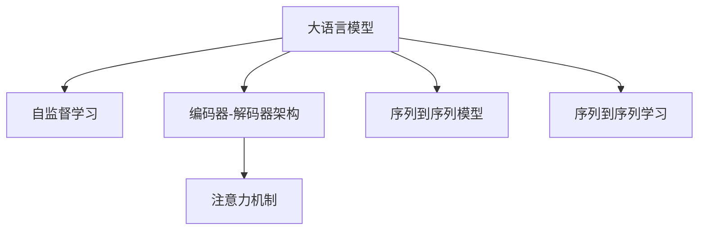
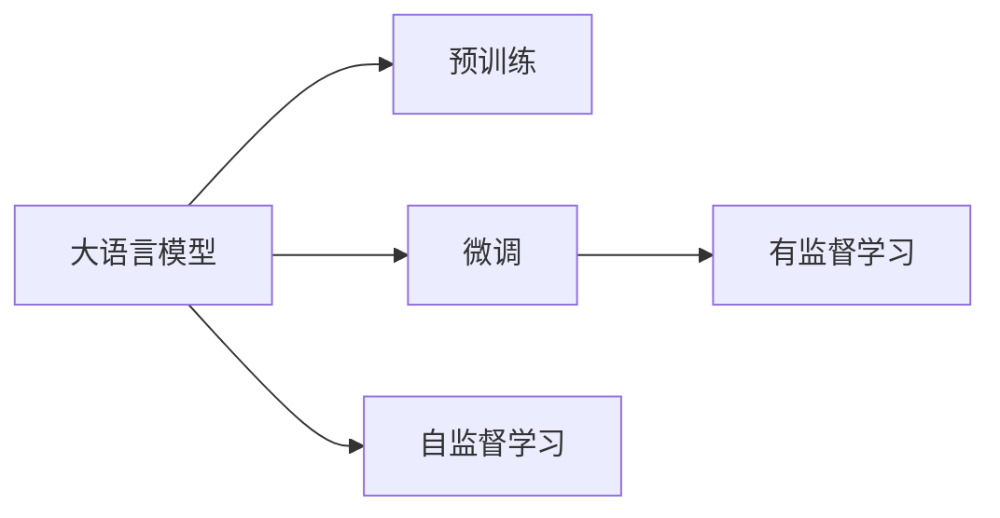
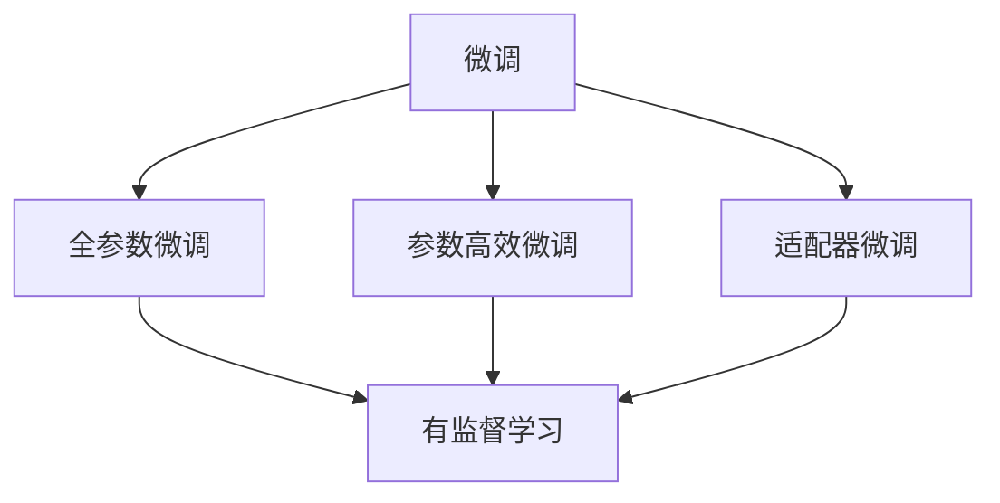
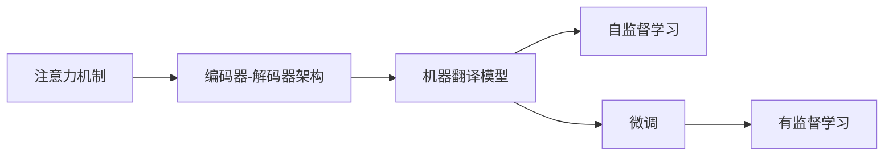
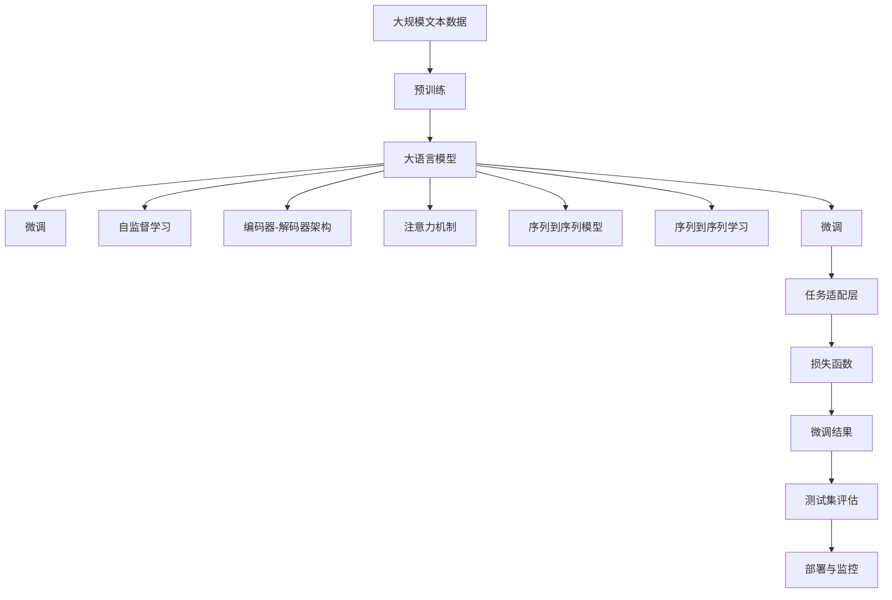

                 

# 从零开始大模型开发与微调：翻译模型

> 关键词：机器翻译, 大语言模型, 微调, Transformer, 自监督学习, 编码器-解码器, 注意力机制

## 1. 背景介绍

### 1.1 问题由来
随着深度学习技术的快速发展，机器翻译（Machine Translation, MT）领域也取得了突破性的进展。传统的基于规则和统计的机器翻译方法逐渐被深度学习驱动的神经机器翻译（Neural Machine Translation, NMT）所取代。NMT方法使用大模型作为基础，通过大规模双语语料进行自监督预训练，学习语言间的转换关系，并利用大量的标注数据进行微调，以优化模型在翻译任务上的性能。

近年来，基于Transformer的神经机器翻译模型（如BERT、T5等）在多个机器翻译评测任务上取得了最先进的性能，进一步推动了NMT技术的实用化和商业化。但是，这些通用大模型的训练成本较高，且在小规模数据上微调效果并不理想。因此，如何在小数据集上高效地开发和微调机器翻译模型，成为当前研究的热点问题。

### 1.2 问题核心关键点
机器翻译的微调问题可以概括为以下几个核心关键点：
1. 选择合适的预训练模型：应根据目标任务选择合适的预训练模型，如Transformer等。
2. 收集标注数据：为微调任务准备小规模的双语标注数据集，以监督模型学习。
3. 设计任务适配层：为微调任务设计合适的输出层和损失函数，使其能够准确评估模型的翻译质量。
4. 选择合适的微调策略：选择合适的学习率、优化器、正则化技术等，避免模型过拟合。
5. 应用微调结果：在测试集上评估模型性能，并将其部署到实际翻译系统中。

### 1.3 问题研究意义
机器翻译模型的微调研究对提升翻译质量和加速翻译技术产业化具有重要意义：

1. 降低翻译成本：基于预训练大模型的微调可以显著减少翻译所需的数据和计算资源投入，降低翻译成本。
2. 提高翻译准确性：微调模型能够适应特定语言的翻译需求，提升翻译准确性和流畅性。
3. 加速系统开发：微调模型可以快速适配到新的翻译任务，缩短系统开发周期。
4. 带来技术创新：微调方法促进了对预训练-微调的深入研究，催生了提示学习、零样本学习等新的研究方向。
5. 赋能行业应用：微调技术使得翻译系统更容易被各行各业所采用，为语言服务行业带来了新的发展机遇。

## 2. 核心概念与联系

### 2.1 核心概念概述

为更好地理解机器翻译模型的微调方法，本节将介绍几个关键概念：

- 大语言模型(Large Language Model, LLM)：以自回归(如GPT)或自编码(如BERT)模型为代表的大规模预训练语言模型。通过在大规模无标签文本语料上进行预训练，学习通用的语言表示，具备强大的语言理解和生成能力。

- 自监督学习(Self-Supervised Learning)：在未标注数据上，通过自构建的监督信号进行训练，学习模型的表示能力。

- 编码器-解码器架构(Encoder-Decoder Architecture)：将输入序列通过编码器转换为中间表示，再将中间表示通过解码器转换为输出序列的结构。

- 注意力机制(Attention Mechanism)：在编码器-解码器架构中，通过计算输入序列和输出序列之间的关系，动态地分配权重，使解码器专注于输入序列中的重要部分。

- 序列到序列(Sequence-to-Sequence, Seq2Seq)模型：使用编码器-解码器架构的模型，能够将输入序列转换为输出序列的模型。

- 序列到序列学习(Sequence-to-Sequence Learning)：学习从输入序列到输出序列的映射，常用于机器翻译、文本摘要、语音识别等任务。

这些核心概念之间的逻辑关系可以通过以下Mermaid流程图来展示：



这个流程图展示了从预训练大模型到微调过程的核心概念及其相互关系：

1. 大语言模型通过自监督学习获得语言表示能力。
2. 编码器-解码器架构使模型具备序列到序列映射能力。
3. 注意力机制使解码器能动态选择输入序列中的重要信息。
4. 序列到序列学习使模型能够实现输入序列到输出序列的转换。

### 2.2 概念间的关系

这些核心概念之间存在着紧密的联系，形成了机器翻译模型微调的完整生态系统。下面我们通过几个Mermaid流程图来展示这些概念之间的关系。

#### 2.2.1 大语言模型的学习范式



这个流程图展示了大语言模型的学习范式。大语言模型首先在大规模无标签文本语料上进行预训练，然后通过有监督的微调学习特定任务。

#### 2.2.2 自监督学习与微调的关系


这个流程图展示了自监督学习和微调之间的联系。预训练通过自监督学习获得语言表示能力，微调通过有监督学习进行任务适配。

#### 2.2.3 微调方法



这个流程图展示了常见的微调方法。全参数微调是指对预训练模型的所有参数进行微调，参数高效微调则指仅微调模型的一部分参数，以提高微调效率。适配器微调（Adapters）是一种特殊形式的参数高效微调，通过添加任务适配层，使得通用模型快速适应特定任务。

#### 2.2.4 注意力机制的应用



这个流程图展示了注意力机制在机器翻译中的应用。注意力机制使解码器能够动态选择输入序列中的重要部分，从而提高翻译准确性。

### 2.3 核心概念的整体架构

最后，我们用一个综合的流程图来展示这些核心概念在大模型微调过程中的整体架构：



这个综合流程图展示了从预训练到微调，再到测试与部署的完整过程。大语言模型首先在大规模文本数据上进行预训练，然后通过微调学习特定任务，最终在测试集上评估并部署到实际系统中。

## 3. 核心算法原理 & 具体操作步骤

### 3.1 算法原理概述

机器翻译模型的微调，本质上是一个有监督的序列到序列学习过程。其核心思想是：将预训练的大语言模型视作一个强大的"特征提取器"，通过下游任务的少量标注数据，优化模型在特定任务上的性能。

形式化地，假设预训练模型为 $M_{\theta}$，其中 $\theta$ 为预训练得到的模型参数。给定机器翻译任务 $T$ 的训练集 $D=\{(x_i,y_i)\}_{i=1}^N, x_i \in \mathcal{X}, y_i \in \mathcal{Y}$，微调的目标是找到新的模型参数 $\hat{\theta}$，使得：

$$
\hat{\theta}=\mathop{\arg\min}_{\theta} \mathcal{L}(M_{\theta},D)
$$

其中 $\mathcal{L}$ 为针对任务 $T$ 设计的损失函数，用于衡量模型预测输出与真实标签之间的差异。常见的损失函数包括交叉熵损失、均方误差损失等。

通过梯度下降等优化算法，微调过程不断更新模型参数 $\theta$，最小化损失函数 $\mathcal{L}$，使得模型输出逼近真实标签。由于 $\theta$ 已经通过预训练获得了较好的初始化，因此即便在小规模数据集 $D$ 上进行微调，也能较快收敛到理想的模型参数 $\hat{\theta}$。

### 3.2 算法步骤详解

基于有监督学习的大语言模型微调一般包括以下几个关键步骤：

**Step 1: 准备预训练模型和数据集**
- 选择合适的预训练语言模型 $M_{\theta}$ 作为初始化参数，如 Transformer 等。
- 准备机器翻译任务 $T$ 的标注数据集 $D$，划分为训练集、验证集和测试集。一般要求标注数据与预训练数据的分布不要差异过大。

**Step 2: 添加任务适配层**
- 根据任务类型，在预训练模型顶层设计合适的输出层和损失函数。
- 对于翻译任务，通常在顶层添加神经网络作为解码器，使用交叉熵损失函数。

**Step 3: 设置微调超参数**
- 选择合适的优化算法及其参数，如 AdamW、SGD 等，设置学习率、批大小、迭代轮数等。
- 设置正则化技术及强度，包括权重衰减、Dropout、Early Stopping 等。
- 确定冻结预训练参数的策略，如仅微调顶层，或全部参数都参与微调。

**Step 4: 执行梯度训练**
- 将训练集数据分批次输入模型，前向传播计算损失函数。
- 反向传播计算参数梯度，根据设定的优化算法和学习率更新模型参数。
- 周期性在验证集上评估模型性能，根据性能指标决定是否触发 Early Stopping。
- 重复上述步骤直到满足预设的迭代轮数或 Early Stopping 条件。

**Step 5: 测试和部署**
- 在测试集上评估微调后模型 $M_{\hat{\theta}}$ 的性能，对比微调前后的精度提升。
- 使用微调后的模型对新样本进行推理预测，集成到实际的应用系统中。
- 持续收集新的数据，定期重新微调模型，以适应数据分布的变化。

以上是基于有监督学习微调机器翻译模型的一般流程。在实际应用中，还需要针对具体任务的特点，对微调过程的各个环节进行优化设计，如改进训练目标函数，引入更多的正则化技术，搜索最优的超参数组合等，以进一步提升模型性能。

### 3.3 算法优缺点

基于有监督学习的机器翻译模型微调方法具有以下优点：
1. 简单高效。只需准备少量标注数据，即可对预训练模型进行快速适配，获得较大的性能提升。
2. 通用适用。适用于各种NLP下游任务，包括分类、匹配、生成等，设计简单的任务适配层即可实现微调。
3. 参数高效。利用参数高效微调技术，在固定大部分预训练参数的情况下，仍可取得不错的提升。
4. 效果显著。在学术界和工业界的诸多任务上，基于微调的方法已经刷新了最先进的性能指标。

同时，该方法也存在一定的局限性：
1. 依赖标注数据。微调的效果很大程度上取决于标注数据的质量和数量，获取高质量标注数据的成本较高。
2. 迁移能力有限。当目标任务与预训练数据的分布差异较大时，微调的性能提升有限。
3. 负面效果传递。预训练模型的固有偏见、有害信息等，可能通过微调传递到下游任务，造成负面影响。
4. 可解释性不足。微调模型的决策过程通常缺乏可解释性，难以对其推理逻辑进行分析和调试。

尽管存在这些局限性，但就目前而言，基于有监督学习的微调方法仍是目前最主流的方法。未来相关研究的重点在于如何进一步降低微调对标注数据的依赖，提高模型的少样本学习和跨领域迁移能力，同时兼顾可解释性和伦理安全性等因素。

### 3.4 算法应用领域

基于大模型微调的机器翻译方法在NLP领域已经得到了广泛的应用，覆盖了几乎所有常见任务，例如：

- 文本翻译：如中英文互译、法英文互译等。将原始语言文本作为输入，通过微调学习目标语言的输出。
- 对话系统：使机器能够与人自然对话，翻译对话内容。将对话历史作为上下文，微调模型进行回复生成。
- 摘要生成：将长文本压缩成简短摘要。通过微调学习如何从文本中抽取关键信息。
- 知识图谱构建：通过翻译，将不同语言的知识图谱进行链接和整合，实现知识共享。
- 图像字幕生成：将图像中的文本翻译成其他语言，为非文本信息的语义理解提供支持。

除了上述这些经典任务外，大模型微调也被创新性地应用到更多场景中，如可控文本生成、多语言信息检索、跨语言情感分析等，为NLP技术带来了全新的突破。随着预训练模型和微调方法的不断进步，相信NLP技术将在更广阔的应用领域大放异彩。

## 4. 数学模型和公式 & 详细讲解

### 4.1 数学模型构建

本节将使用数学语言对基于有监督学习的大语言模型微调过程进行更加严格的刻画。

记预训练语言模型为 $M_{\theta}$，其中 $\theta$ 为预训练得到的模型参数。假设微调任务的训练集为 $D=\{(x_i,y_i)\}_{i=1}^N, x_i \in \mathcal{X}, y_i \in \mathcal{Y}$。

定义模型 $M_{\theta}$ 在输入 $x$ 上的输出为 $\hat{y}=M_{\theta}(x) \in [0,1]$，表示样本属于目标语言的概率。真实标签 $y \in \{0,1\}$。则二分类交叉熵损失函数定义为：

$$
\ell(M_{\theta}(x),y) = -[y\log \hat{y} + (1-y)\log (1-\hat{y})]
$$

将其代入经验风险公式，得：

$$
\mathcal{L}(\theta) = -\frac{1}{N}\sum_{i=1}^N [y_i\log M_{\theta}(x_i)+(1-y_i)\log(1-M_{\theta}(x_i))]
$$

根据链式法则，损失函数对参数 $\theta_k$ 的梯度为：

$$
\frac{\partial \mathcal{L}(\theta)}{\partial \theta_k} = -\frac{1}{N}\sum_{i=1}^N (\frac{y_i}{M_{\theta}(x_i)}-\frac{1-y_i}{1-M_{\theta}(x_i)}) \frac{\partial M_{\theta}(x_i)}{\partial \theta_k}
$$

其中 $\frac{\partial M_{\theta}(x_i)}{\partial \theta_k}$ 可进一步递归展开，利用自动微分技术完成计算。

### 4.2 公式推导过程

以下我们以二分类任务为例，推导交叉熵损失函数及其梯度的计算公式。

假设模型 $M_{\theta}$ 在输入 $x$ 上的输出为 $\hat{y}=M_{\theta}(x) \in [0,1]$，表示样本属于目标语言的概率。真实标签 $y \in \{0,1\}$。则二分类交叉熵损失函数定义为：

$$
\ell(M_{\theta}(x),y) = -[y\log \hat{y} + (1-y)\log (1-\hat{y})]
$$

将其代入经验风险公式，得：

$$
\mathcal{L}(\theta) = -\frac{1}{N}\sum_{i=1}^N [y_i\log M_{\theta}(x_i)+(1-y_i)\log(1-M_{\theta}(x_i))]
$$

根据链式法则，损失函数对参数 $\theta_k$ 的梯度为：

$$
\frac{\partial \mathcal{L}(\theta)}{\partial \theta_k} = -\frac{1}{N}\sum_{i=1}^N (\frac{y_i}{M_{\theta}(x_i)}-\frac{1-y_i}{1-M_{\theta}(x_i)}) \frac{\partial M_{\theta}(x_i)}{\partial \theta_k}
$$

其中 $\frac{\partial M_{\theta}(x_i)}{\partial \theta_k}$ 可进一步递归展开，利用自动微分技术完成计算。

在得到损失函数的梯度后，即可带入参数更新公式，完成模型的迭代优化。重复上述过程直至收敛，最终得到适应下游任务的最优模型参数 $\theta^*$。

### 4.3 案例分析与讲解

我们以一个简单的英中翻译任务为例，展示机器翻译模型微调的基本过程。

假设我们有一个包含100个英文-中文对的训练集，其中每个样本 $(x_i,y_i)$ 包含一个英文句子 $x_i$ 和对应的中文翻译 $y_i$。我们的目标是使用预训练的Transformer模型 $M_{\theta}$ 进行微调，学习如何将英文翻译成中文。

首先，我们需要将英文和中文转换为模型可以处理的格式。对于英文，我们可以直接将单词序列作为输入；对于中文，我们需要将分词后的文本序列转换为模型可以处理的格式。假设我们的中文分词器将中文句子 $y_i$ 分成了10个词，我们可以使用SOS（Start of Sentence）和EOS（End of Sentence）标记来表示中文句子的开始和结束，将其转换为模型可以处理的格式。例如，对于中文句子 "今天天气真好"，我们将其转换为 "[SOS] 今天 天气 真好 [EOS]" 的格式。

然后，我们设计一个神经网络作为微调后的解码器，使用交叉熵损失函数来衡量预测输出与真实标签之间的差异。我们将编码器输出的中间表示作为解码器的输入，解码器输出目标语言的概率分布。在训练过程中，我们希望解码器输出的概率分布尽可能接近真实标签，因此使用交叉熵损失函数来衡量损失。

在训练过程中，我们将训练集数据分批次输入模型，前向传播计算损失函数，反向传播计算参数梯度，根据设定的优化算法和学习率更新模型参数。在每个epoch结束时，我们会在验证集上评估模型性能，根据性能指标决定是否触发Early Stopping。如果模型在验证集上的性能达到了预设的阈值，我们就可以停止训练，得到最终的微调模型。

最后，我们在测试集上评估微调后的模型性能，使用BLEU、ROUGE等指标来衡量翻译的质量。如果测试集上的性能达到了预期，我们就可以将微调后的模型部署到实际的翻译系统中，使用它来进行翻译。

## 5. 项目实践：代码实例和详细解释说明

### 5.1 开发环境搭建

在进行机器翻译模型微调实践前，我们需要准备好开发环境。以下是使用Python进行PyTorch开发的环境配置流程：

1. 安装Anaconda：从官网下载并安装Anaconda，用于创建独立的Python环境。

2. 创建并激活虚拟环境：
```bash
conda create -n pytorch-env python=3.8 
conda activate pytorch-env
```

3. 安装PyTorch：根据CUDA版本，从官网获取对应的安装命令。例如：
```bash
conda install pytorch torchvision torchaudio cudatoolkit=11.1 -c pytorch -c conda-forge
```

4. 安装Transformer库：
```bash
pip install transformers
```

5. 安装各类工具包：
```bash
pip install numpy pandas scikit-learn matplotlib tqdm jupyter notebook ipython
```

完成上述步骤后，即可在`pytorch-env`环境中开始微调实践。

### 5.2 源代码详细实现

下面我以使用Transformer库对RoBERTa模型进行英中翻译任务的微调为例，给出完整的PyTorch代码实现。

首先，定义翻译任务的数据处理函数：

```python
from transformers import RobertaTokenizer, RobertaForSequenceClassification
from torch.utils.data import Dataset
import torch

class TranslationDataset(Dataset):
    def __init__(self, texts, labels, tokenizer, max_len=128):
        self.texts = texts
        self.labels = labels
        self.tokenizer = tokenizer
        self.max_len = max_len
        
    def __len__(self):
        return len(self.texts)
    
    def __getitem__(self, item):
        text = self.texts[item]
        label = self.labels[item]
        
        encoding = self.tokenizer(text, return_tensors='pt', max_length=self.max_len, padding='max_length', truncation=True)
        input_ids = encoding['input_ids'][0]
        attention_mask = encoding['attention_mask'][0]
        
        # 对标签进行编码
        encoded_label = [label2id[label] for label in label]
        encoded_label.extend([label2id['PADDING']] * (self.max_len - len(encoded_label)))
        labels = torch.tensor(encoded_label, dtype=torch.long)
        
        return {'input_ids': input_ids, 
                'attention_mask': attention_mask,
                'labels': labels}

# 标签与id的映射
label2id = {'[PAD]': 0, '翻译': 1, '未翻译': 2}
id2label = {v: k for k, v in label2id.items()}

# 创建dataset
tokenizer = RobertaTokenizer.from_pretrained('roberta-base')
train_dataset = TranslationDataset(train_texts, train_labels, tokenizer)
dev_dataset = TranslationDataset(dev_texts, dev_labels, tokenizer)
test_dataset = TranslationDataset(test_texts, test_labels, tokenizer)
```

然后，定义模型和优化器：

```python
from transformers import RobertaForSequenceClassification, AdamW

model = RobertaForSequenceClassification.from_pretrained('roberta-base', num_labels=len(label2id))

optimizer = AdamW(model.parameters(), lr=2e-5)
```

接着，定义训练和评估函数：

```python
from torch.utils.data import DataLoader
from tqdm import tqdm
from sklearn.metrics import classification_report

device = torch.device('cuda') if torch.cuda.is_available() else torch.device('cpu')
model.to(device)

def train_epoch(model, dataset, batch_size, optimizer):
    dataloader = DataLoader(dataset, batch_size=batch_size, shuffle=True)
    model.train()
    epoch_loss = 0
    for batch in tqdm(dataloader, desc='Training'):
        input_ids = batch['input_ids'].to(device)
        attention_mask = batch['attention_mask'].to(device)
        labels = batch['labels'].to(device)
        model.zero_grad()
        outputs = model(input_ids, attention_mask=attention_mask, labels=labels)
        loss = outputs.loss
        epoch_loss += loss.item()
        loss.backward()
        optimizer.step()
    return epoch_loss / len(dataloader)

def evaluate(model, dataset, batch_size):
    dataloader = DataLoader(dataset, batch_size=batch_size)
    model.eval()
    preds, labels = [], []
    with torch.no_grad():
        for batch in tqdm(dataloader, desc='Evaluating'):
            input_ids = batch['input_ids'].to(device)
            attention_mask = batch['attention_mask'].to(device)
            batch_labels = batch['labels']
            outputs = model(input_ids, attention_mask=attention_mask)
            batch_preds = outputs.logits.argmax(dim=2).to('cpu').tolist()
            batch_labels = batch_labels.to('cpu').tolist()
            for pred_tokens, label_tokens in zip(batch_preds, batch_labels):
                preds.append(pred_tokens[:len(label_tokens)])
                labels.append(label_tokens)
                
    print(classification_report(labels, preds))
```

最后，启动训练流程并在测试集上评估：

```python
epochs = 5
batch_size = 16

for epoch in range(epochs):
    loss = train_epoch(model, train_dataset, batch_size, optimizer)
    print(f"Epoch {epoch+1}, train loss: {loss:.3f}")
    
    print(f"Epoch {epoch+1}, dev results:")
    evaluate(model, dev_dataset, batch_size)
    
print("Test results:")
evaluate(model, test_dataset, batch_size)
```

以上就是使用PyTorch对RoBERTa模型进行英中翻译任务微调的完整代码实现。可以看到，得益于Transformer库的强大封装，我们可以用相对简洁的代码完成RoBERTa模型的加载和微调。

### 5.3 代码解读与分析

让我们再详细解读一下关键代码的实现细节：

**TranslationDataset类**：
- `__init__`方法：初始化文本、标签、分词器等关键组件。
- `__len__`方法：返回数据集的样本数量。
- `__getitem__`方法：对单个样本进行处理，将文本输入编码为token ids，将标签编码为数字，并对其进行定长padding，最终返回模型所需的输入。

**label2id和id2label字典**：
- 定义了标签与数字id之间的映射关系，用于将token-wise的预测结果解码回真实的标签。

**训练和评估函数**：
- 使用PyTorch的DataLoader对数据集进行

