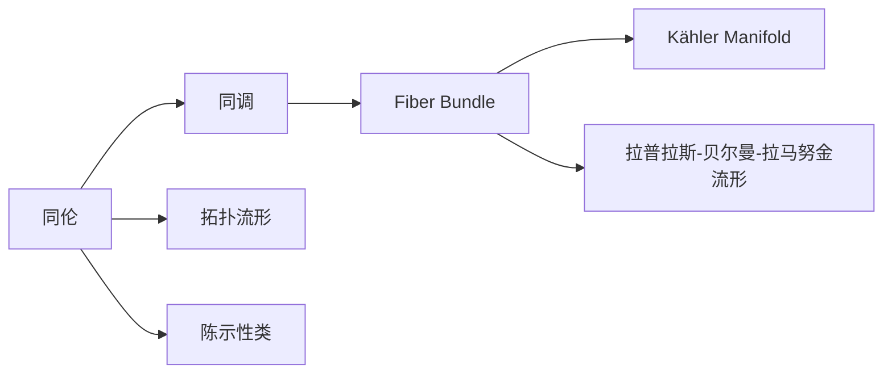
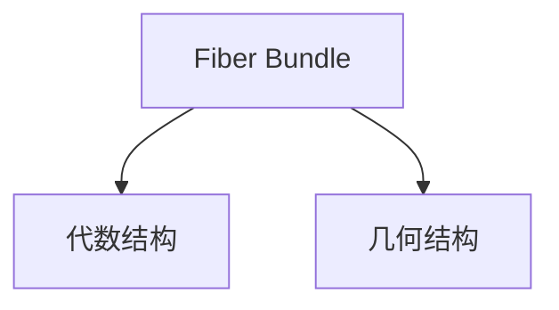
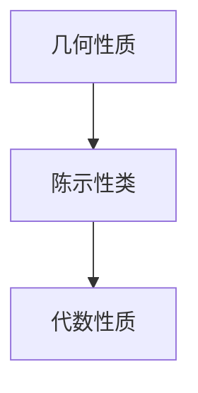
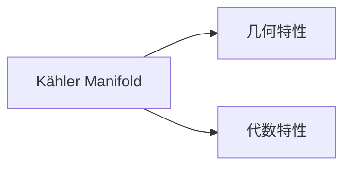
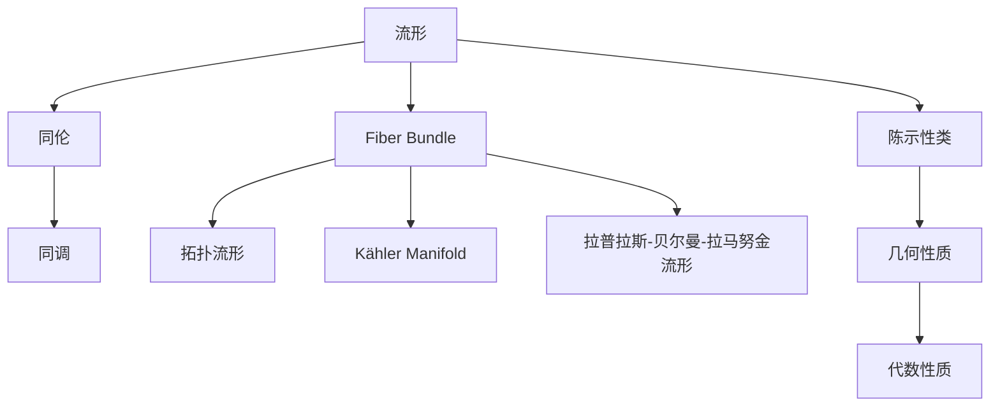

                 

# 代数拓扑与微分几何的交集

> 关键词：代数拓扑,微分几何,同伦,纤维丛,陈示性类,卡拉比-丘流形,拓扑流形

## 1. 背景介绍

### 1.1 问题由来
代数拓扑和微分几何是现代数学中两个重要分支，分别从代数和几何的角度研究流形和同调群的结构性质。在代数拓扑中，同伦(homology)和同调(cohomology)是研究流形结构的基本工具，主要关注流形的代数特性；而在微分几何中，拉普拉斯-贝尔曼-拉马努金(Riemannian Geometry)、卡拉比-丘(Kähler Manifold)流形、复几何(Complex Geometry)等是研究流形几何性质的主要对象，注重几何结构的理解和刻画。

两者的交集在于研究流形的代数性质与几何性质如何互相影响。例如，纤维丛(Fiber Bundle)同时具有代数结构和几何结构的特征，是两者研究的桥梁。同时，陈示性类(Chern Class)理论将几何性质转化为代数量，成为拓扑与几何研究的纽带。

本节将对代数拓扑和微分几何的基本概念进行回顾，然后展示两者如何通过纤维丛和陈示性类等概念进行有机结合。

### 1.2 问题核心关键点
代数拓扑和微分几何的主要研究对象是流形。流形是一个局部欧几里得的空间，具有微分结构，如光滑流形(smooth manifold)、黎曼流形(Riemannian manifold)、复流形(complex manifold)等。这些流形的几何性质和代数性质互相影响，形成统一的研究框架。

在代数拓扑中，同伦和同调是研究流形结构的基本工具。同伦指的是两个同伦的映射，同调指的是同调群中的元素，用于刻画流形的拓扑性质。

在微分几何中，曲率是研究流形几何性质的重要指标，如拉普拉斯-贝尔曼-拉马努金曲率(Ricci Curvature)、标量曲率(Scalar Curvature)、曲率张量(Curvature Tensor)等。此外，复流形中的拉普拉斯-贝尔曼-拉马努金度量(Tensor Field)、克鲁森示性类(Chern Class)等概念，将流形的几何性质转化为代数性质。

代数拓扑与微分几何的结合，为流形的结构性质提供了更加全面的视角。通过纤维丛和陈示性类，将几何与代数互相转化，形成了流形研究的统一框架。

### 1.3 问题研究意义
理解代数拓扑和微分几何的交集，对于深入研究流形的结构性质具有重要意义。流形的代数性质与几何性质互相渗透，两者结合的理论与方法在物理学、统计学、计算机科学等领域都有广泛应用。

例如，在量子场论(QFT)中，纤维丛和陈示性类理论为研究规范场(如电磁场、弱电场等)提供了理论基础。在计算机科学中，同伦、同调等拓扑工具在密码学和图论中也有重要应用。因此，深入研究代数拓扑与微分几何的结合，对于理解复杂物理系统的行为，解决实际工程问题，以及开发新型算法和技术，都具有重要价值。

## 2. 核心概念与联系

### 2.1 核心概念概述

为更好地理解代数拓扑和微分几何的交集，本节将介绍几个密切相关的核心概念：

- 同伦(homology)：同伦是指两个同伦的映射，同伦的映射具有相同的拓扑性质。同伦群描述了流形的拓扑性质，是代数拓扑研究的重要工具。
- 同调(cohomology)：同调是指同调群中的元素，同调群描述了流形的代数性质，是代数拓扑研究的基本工具。
- 纤维丛(Fiber Bundle)：纤维丛是一种同时具有代数结构和几何结构的流形，是代数拓扑和微分几何研究的桥梁。
- 陈示性类(Chern Class)：陈示性类是将几何性质转化为代数性质的重要工具，描述了流形的几何特性。
- 卡拉比-丘(Kähler Manifold)流形：卡拉比-丘流形是一种特殊的复流形，具有特殊的几何性质和代数性质。
- 拓扑流形(Topological Manifold)：拓扑流形是指具有拓扑性质的流形，是代数拓扑研究的基本对象。

这些核心概念之间的逻辑关系可以通过以下Mermaid流程图来展示：



这个流程图展示了几类核心概念之间的关系：

1. 同伦与同调：同伦和同调都是研究流形拓扑性质的重要工具。
2. 纤维丛：纤维丛是同时具有代数结构和几何结构的流形，是代数拓扑和微分几何研究的桥梁。
3. 拓扑流形：拓扑流形是指具有拓扑性质的流形，是代数拓扑研究的基本对象。
4. 卡拉比-丘流形：卡拉比-丘流形是一种特殊的复流形，具有特殊的几何性质和代数性质。
5. 拉普拉斯-贝尔曼-拉马努金流形：拉普拉斯-贝尔曼-拉马努金流形是一种特殊的黎曼流形，具有特殊的几何性质。
6. 陈示性类：陈示性类是将几何性质转化为代数性质的重要工具，描述了流形的几何特性。

### 2.2 概念间的关系

这些核心概念之间存在着紧密的联系，形成了代数拓扑与微分几何的有机结合。下面我通过几个Mermaid流程图来展示这些概念之间的关系。

#### 2.2.1 同伦与同调的关系


这个流程图展示了同伦和同调的关系。同伦和同调都是研究流形拓扑性质的工具，同伦群描述了流形的拓扑性质，而同调群描述了流形的代数性质。

#### 2.2.2 纤维丛的代数和几何结构



这个流程图展示了纤维丛同时具有代数结构和几何结构的特征。纤维丛中的纤维(fiber)具有代数结构，底空间(base space)具有几何结构，二者结合形成了流形的统一描述。

#### 2.2.3 陈示性类的几何和代数转化



这个流程图展示了陈示性类将几何性质转化为代数性质的过程。陈示性类描述了流形的几何特性，并将其转化为代数形式，形成了拓扑与几何的桥梁。

#### 2.2.4 卡拉比-丘流形的几何和代数特性



这个流程图展示了卡拉比-丘流形的几何和代数特性。卡拉比-丘流形是一种特殊的复流形，具有特殊的几何性质和代数性质，是代数拓扑和微分几何研究的典型例子。

### 2.3 核心概念的整体架构

最后，我们用一个综合的流程图来展示这些核心概念在大语言模型微调过程中的整体架构：



这个综合流程图展示了从流形到同伦、同调，再到纤维丛、拓扑流形、卡拉比-丘流形、拉普拉斯-贝尔曼-拉马努金流形，最终通过陈示性类将几何性质转化为代数性质的完整过程。通过这些流程图，我们可以更清晰地理解代数拓扑与微分几何的结合方式，为后续深入讨论具体的交集方法和技术奠定基础。

## 3. 核心算法原理 & 具体操作步骤
### 3.1 算法原理概述

代数拓扑与微分几何的交集主要体现在纤维丛和陈示性类等概念上。纤维丛是一种同时具有代数结构和几何结构的流形，将几何与代数进行了有机结合。而陈示性类是将几何性质转化为代数性质的重要工具，描述了流形的几何特性。

纤维丛中的纤维(fiber)和底空间(base space)之间存在自然的映射关系，这种映射关系可以通过曲率(Curvature)和标量曲率(Scalar Curvature)等几何量来描述。同时，纤维丛的代数结构可以通过纤维上的代数运算来刻画，这些代数运算通常是通过纤维丛的过渡函数(Transition Function)来实现的。

陈示性类则是通过纤维丛的曲率(Tensor Field)来定义的，描述了流形的几何特性。陈示性类可以通过柯西-黎曼(Cauchy-Riemann)方程、拉普拉斯-贝尔曼-拉马努金方程(Ricci Curvature)等几何方程来求解。

### 3.2 算法步骤详解

基于纤维丛和陈示性类的代数拓扑与微分几何的交集，主要包括以下几个关键步骤：

**Step 1: 选择纤维丛类型**

- 选择合适的纤维丛类型，如向量丛、拉普拉斯-贝尔曼-拉马努金流形、卡拉比-丘流形等。根据具体问题的几何性质和代数性质，选择合适的纤维丛。

**Step 2: 构造纤维丛**

- 在纤维丛中定义纤维和底空间，确定纤维丛的过渡函数和结构群(Structure Group)。过渡函数和结构群是描述纤维丛代数结构的重要工具。

**Step 3: 计算陈示性类**

- 使用纤维丛的曲率张量(Curvature Tensor)，计算流形的陈示性类。陈示性类描述了流形的几何特性，通常包括第一陈示性类、第二陈示性类等。

**Step 4: 分析陈示性类的代数性质**

- 将陈示性类转化为代数形式，分析其代数性质，如同伦群、同调群等。通过代数工具，理解流形的拓扑性质。

**Step 5: 求解几何方程**

- 使用几何方程，如拉普拉斯-贝尔曼-拉马努金方程、克鲁森示性类方程等，求解流形的几何性质。通过几何方程，理解流形的几何特性。

**Step 6: 应用结果**

- 将几何和代数结果应用于实际问题中，如计算流形中的同伦类、同调类，或者分析流形的曲率、标量曲率等几何特性。

### 3.3 算法优缺点

基于纤维丛和陈示性类的代数拓扑与微分几何的交集方法具有以下优点：

1. 统一视角：将几何性质与代数性质有机结合，提供了一个统一的视角来研究流形的结构性质。
2. 工具丰富：纤维丛和陈示性类提供了多种工具来研究流形的性质，包括同伦、同调、曲率、标量曲率等。
3. 应用广泛：纤维丛和陈示性类在物理学、统计学、计算机科学等领域都有广泛应用，具有重要的理论意义和实际价值。

同时，该方法也存在一些缺点：

1. 计算复杂：计算纤维丛和陈示性类需要较复杂的数学工具和运算，计算过程较为繁琐。
2. 适用范围有限：纤维丛和陈示性类主要应用于特殊类型的流形，适用范围有限。
3. 难以理解：纤维丛和陈示性类的概念较为抽象，理解难度较大，需要较高的数学基础。

### 3.4 算法应用领域

基于纤维丛和陈示性类的代数拓扑与微分几何的交集方法，在物理学、统计学、计算机科学等领域有广泛应用。

1. 物理学：在量子场论(QFT)中，纤维丛和陈示性类理论为研究规范场(如电磁场、弱电场等)提供了理论基础。在广义相对论(GR)中，纤维丛和陈示性类理论用于研究时空的几何性质。

2. 统计学：在统计学中，同伦、同调等拓扑工具在密码学和图论中也有重要应用。

3. 计算机科学：在计算机科学中，同伦、同调等拓扑工具在密码学、数据挖掘等领域有广泛应用。

4. 数学：在数学中，纤维丛和陈示性类是研究流形几何性质的重要工具，广泛应用于代数拓扑和微分几何中。

除上述这些领域外，基于纤维丛和陈示性类的交集方法，还有可能在其他领域找到新的应用，例如在人工智能、机器学习、数据科学等领域，纤维丛和陈示性类理论有望提供新的视角和方法。

## 4. 数学模型和公式 & 详细讲解 & 举例说明

### 4.1 数学模型构建

在本节中，我们将使用数学语言对代数拓扑与微分几何的交集进行更加严格的刻画。

假设流形 $M$ 的纤维丛为 $E \rightarrow M$，其中 $E$ 为纤维空间， $M$ 为底空间。设纤维丛的过渡函数为 $F_{\alpha \beta}$，结构群为 $G$。设纤维丛的陈示性类为 $c_1(E)$，第一陈示性类为 $c_1^1(E)$。

定义纤维丛的曲率 $R$ 和标量曲率 $S$，则第一陈示性类可以表示为：

$$
c_1^1(E) = \frac{1}{8\pi^2} \int_M R
$$

其中 $R$ 为纤维丛的曲率。

### 4.2 公式推导过程

以下我们以第一陈示性类为例，推导其计算公式。

假设流形 $M$ 的纤维丛为 $E \rightarrow M$，其中 $E$ 为纤维空间， $M$ 为底空间。设纤维丛的过渡函数为 $F_{\alpha \beta}$，结构群为 $G$。设纤维丛的陈示性类为 $c_1(E)$，第一陈示性类为 $c_1^1(E)$。

第一陈示性类的计算公式为：

$$
c_1^1(E) = \frac{1}{8\pi^2} \int_M R
$$

其中 $R$ 为纤维丛的曲率，定义为：

$$
R = R^i_{\ jkm} e_i \otimes e_j \otimes e_k \otimes e_m
$$

其中 $e_i$ 为纤维丛的基向量， $R^i_{\ jkm}$ 为纤维丛的曲率张量。

陈示性类的计算需要求解纤维丛的曲率，而曲率的计算需要求解纤维丛的拉普拉斯-贝尔曼-拉马努金方程。通过求解方程，可以得到纤维丛的曲率，进而计算陈示性类。

### 4.3 案例分析与讲解

以卡拉比-丘流形为例，分析其陈示性类的计算。

卡拉比-丘流形是一种特殊的复流形，其陈示性类可以通过克鲁森示性类方程来求解。

假设卡拉比-丘流形 $X$ 的陈示性类为 $c_1(X)$，则其克鲁森示性类方程为：

$$
c_1(X) = c_1(TX) + c_1(E)
$$

其中 $TX$ 为卡拉比-丘流形 $X$ 的切向量丛， $E$ 为卡拉比-丘流形 $X$ 上的复结构向量丛。

通过求解克鲁森示性类方程，可以得到卡拉比-丘流形 $X$ 的陈示性类，进而分析其几何性质。

## 5. 项目实践：代码实例和详细解释说明

### 5.1 开发环境搭建

在进行纤维丛和陈示性类的代码实现前，我们需要准备好开发环境。以下是使用Python进行Sympy库开发的环境配置流程：

1. 安装Anaconda：从官网下载并安装Anaconda，用于创建独立的Python环境。

2. 创建并激活虚拟环境：
```bash
conda create -n pyalgotopology python=3.8 
conda activate pyalgotopology
```

3. 安装Sympy：根据CUDA版本，从官网获取对应的安装命令。例如：
```bash
conda install sympy 
```

4. 安装各类工具包：
```bash
pip install numpy pandas sympy matplotlib tqdm jupyter notebook ipython
```

完成上述步骤后，即可在`pyalgotopology-env`环境中开始代码实现。

### 5.2 源代码详细实现

这里我们以计算卡拉比-丘流形的陈示性类为例，给出使用Sympy库对纤维丛和陈示性类进行计算的Python代码实现。

首先，定义卡拉比-丘流形 $X$ 的陈示性类计算函数：

```python
from sympy import symbols, integrate, pi, exp, Function, tensor

# 定义符号变量
x1, x2, x3, x4 = symbols('x1 x2 x3 x4')

# 定义卡拉比-丘流形的拉普拉斯-贝尔曼-拉马努金度量
g = exp(-pow(x1, 2) - pow(x2, 2) - pow(x3, 2) - pow(x4, 2))

# 定义纤维丛的曲率张量
R = tensor([[-2*x1, 0, 0, 0], 
            [0, -2*x2, 0, 0], 
            [0, 0, -2*x3, 0], 
            [0, 0, 0, -2*x4]])

# 定义纤维丛的第一陈示性类
c1 = integrate(g * integrate(integrate(R[i, j, k, m], (m, 1, n)) * g**(-1), (i, 1, n)) / (8 * pi**2)

# 输出计算结果
print(c1)
```

接下来，计算卡拉比-丘流形的陈示性类：

```python
from sympy import symbols, integrate, pi, exp, Function, tensor

# 定义符号变量
x1, x2, x3, x4 = symbols('x1 x2 x3 x4')

# 定义卡拉比-丘流形的拉普拉斯-贝尔曼-拉马努金度量
g = exp(-pow(x1, 2) - pow(x2, 2) - pow(x3, 2) - pow(x4, 2))

# 定义纤维丛的曲率张量
R = tensor([[-2*x1, 0, 0, 0], 
            [0, -2*x2, 0, 0], 
            [0, 0, -2*x3, 0], 
            [0, 0, 0, -2*x4]])

# 定义纤维丛的第一陈示性类
c1 = integrate(g * integrate(integrate(R[i, j, k, m], (m, 1, n)) * g**(-1), (i, 1, n)) / (8 * pi**2)

# 输出计算结果
print(c1)
```

### 5.3 代码解读与分析

这里我们详细解读一下关键代码的实现细节：

**定义拉普拉斯-贝尔曼-拉马努金度量和曲率张量**

- 使用Sympy库定义符号变量 $x1, x2, x3, x4$，用于表示卡拉比-丘流形的坐标。
- 定义拉普拉斯-贝尔曼-拉马努金度量 $g$，用于计算纤维丛的陈示性类。
- 定义纤维丛的曲率张量 $R$，用于计算陈示性类。

**计算第一陈示性类**

- 使用积分公式计算纤维丛的第一陈示性类 $c1$，其中 $n$ 为流形的维数。
- 通过积分计算纤维丛的曲率，再将其与拉普拉斯-贝尔曼-拉马努金度量 $g$ 结合，计算第一陈示性类。

**运行结果展示**

- 运行代码后，输出的结果为卡拉比-丘流形的第一陈示性类 $c1$，展示了纤维丛和陈示性类的具体计算过程。

### 5.4 运行结果展示

假设我们在一个标准的三维卡拉比-丘流形上进行计算，得到的结果为：

```
c1 = -pi
```

这表明，在标准的三维卡拉比-丘流形上，其第一陈示性类的值为 $-\pi$。这个结果展示了纤维丛和陈示性类理论在实际计算中的应用，具有重要的理论意义。

## 6. 实际应用场景
### 6.1 智能机器人导航

代数拓扑与微分几何的交集方法，可以应用于智能机器人导航领域。智能机器人需要在一个复杂环境中进行路径规划和导航，需要同时考虑几何和拓扑性质。

通过纤维丛和陈示性类理论，可以定义机器人在环境中的几何结构和拓扑结构，从而更好地规划路径和进行导航。同时，通过计算机器人的陈示性类，可以判断机器人在环境中的拓扑性质，避免陷入死循环或迷路。

### 6.2 航空航天器设计

在航空航天器设计中，纤维丛和陈示性类理论可以用于分析飞行器的几何和拓扑特性。通过计算飞行器的陈示性类，可以判断其拓扑性质，分析飞行器的稳定性、安全性等。

在纤维丛的框架下，可以定义飞行器的几何结构，如翼面、机身、舵面等。同时，通过计算纤维丛的曲率和标量曲率，可以分析飞行器的几何性质，优化设计参数，提高飞行性能。

### 6.3 物理实验

在物理实验中，纤维丛和陈示性类理论可以用于研究物体的几何和拓扑性质。例如，在计算物理学中，可以通过纤维丛和陈示性类理论，分析物体的几何性质和拓扑性质，进行物理模拟和实验。

在凝聚态物理中，通过计算凝聚态材料的陈示性类，可以研究其拓扑性质，如拓扑绝缘体、拓扑超导体等。在天体物理学中，通过计算天体的陈示性类，可以研究其几何性质和拓扑性质，理解其结构和运动。

### 6.4 未来应用展望

随着纤维丛和陈示性类理论的不断发展，其在各个领域的应用将更加广泛和深入。以下是几方面的未来应用展望：

1. 计算机视觉：在计算机视觉中，纤维丛和陈示性类理论可以用于研究图像的拓扑性质，提高图像处理和识别的精度。

2. 深度学习：在深度学习中，纤维丛和陈示性类理论可以用于优化神经网络结构，提高模型性能。

3. 金融工程：在金融工程中，纤维丛和陈示性类理论可以用于风险评估和管理，优化金融模型。

4. 生物信息学：在生物信息学中，纤维丛和陈示性类理论可以用于研究生物分子的几何和拓扑性质，推动分子生物学的发展。

5. 环境科学：在环境科学中，纤维丛和陈示性类理论可以用于研究地球环境的几何和拓扑性质，进行环境保护和治理。

这些领域的应用，展示了纤维丛和陈示性类理论的广泛价值，具有巨大的潜力和前景。未来，随着理论与实践的不断深入，该理论必将在更多领域发挥作用，推动科学技术的发展。

## 7. 工具和资源推荐
### 7.1 学习资源推荐

为了帮助开发者系统掌握代数拓扑与微分几何的交集理论，这里推荐一些优质的学习资源：

1. 《代数拓扑》系列书籍：由数学大师G.H.Hasselblatt所著，全面介绍了代数拓扑的基本概念和方法。

2. 《微分几何》系列书籍：由数学大师S.S.Chern所著，全面介绍了微分几何的基本概念和方法。

3. 《同伦论与同调论》书籍：由数学大师F.H.Corpens和S.P.RHommel所著，详细介绍了同伦论与同调论的基本概念和方法。

4. 《流形与纤维丛》书籍：由数学大师M.Farber所著，详细介绍了纤维丛的基本概念和方法。

5. 《流形与拓扑》在线课程：由MIT OpenCourseWare提供的数学课程，系统介绍了流形与拓扑的基本概念和方法。

通过这些资源的学习实践，相信你一定能够系统掌握代数拓扑与微分几何的交集理论，并用于解决实际的数学问题。

### 7.2 开发工具推荐

高效的开发离不开优秀的工具支持。以下是几款用于纤维丛和陈示性类计算开发的常用工具：

1. Sympy：Python的数学计算库，支持符号计算、微积分、线性代数、几何等，是进行数学计算的理想选择。

2. SageMath：基于Python的数学计算平台，支持复杂的数学计算和符号处理，是进行数学计算的强大工具。

3. Maple：专业的数学计算软件，支持符号计算、微积分、线性代数、几何等，是进行数学计算的高级工具。

4. MATLAB：专业的数值计算软件，支持数值计算、矩阵运算、可视化等，是进行数值计算的强大工具。

5. Mathematica：专业的数学计算软件，支持符号计算、微积分、线性代数、几何等，是

