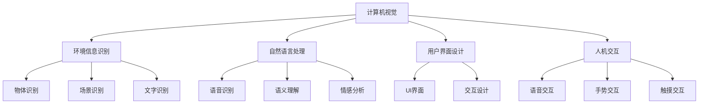

                 

# AI在智能眼镜中的应用:增强现实体验

> 关键词：智能眼镜,增强现实(AR),计算机视觉,自然语言处理(NLP),用户界面(UI),人机交互

## 1. 背景介绍

### 1.1 问题由来

随着技术的不断进步，智能眼镜正逐步从科幻小说中的概念变为现实，成为未来人机交互的重要接口。在智能眼镜的推动下，增强现实(AR)技术得以迅速发展，为用户提供更加沉浸式的体验。AR技术通过在现实世界中叠加虚拟信息，实现信息的可视化展示，极大提升了信息的可获取性和易用性。

智能眼镜不仅是AR展示的平台，还集成了多种人工智能技术，包括计算机视觉、自然语言处理(NLP)、语音识别、人机交互等。通过这些技术，智能眼镜能够识别环境中的物体和场景，为用户提供个性化、情境化的信息服务，使人在现实生活中获得全新体验。

### 1.2 问题核心关键点

智能眼镜的AI应用主要集中在以下几个方面：

- **计算机视觉**：用于识别和追踪物体、场景、文字等，实现环境信息的理解与分析。
- **自然语言处理(NLP)**：用于语音识别、语义理解、情感分析等，使智能眼镜能够处理语音输入和输出。
- **用户界面(UI)**：用于设计用户交互界面，提升用户体验，使智能眼镜更加易用。
- **人机交互**：用于实现用户与智能眼镜之间的自然对话，使智能眼镜能够理解和响应用户的指令。

这些核心技术共同构成了智能眼镜的AI应用生态，为用户提供了多样化的应用场景，如导航、购物、教育、医疗等。智能眼镜正成为提升人们生活质量、工作效率的重要工具。

### 1.3 问题研究意义

智能眼镜的AI应用具有重要的研究意义：

- **提升用户体验**：通过AI技术，智能眼镜能够提供更加个性化、智能化的服务，提升用户的使用体验。
- **推动技术发展**：智能眼镜的AI应用涉及多个前沿技术领域，推动了计算机视觉、NLP等技术的进步。
- **促进产业升级**：智能眼镜的普及将促进医疗、教育、零售等多个行业的数字化转型，加速产业升级。
- **推动人工智能普及**：智能眼镜作为面向大众的产品，能够降低人工智能技术的使用门槛，推动AI技术的普及。

智能眼镜的应用前景广阔，将成为未来人机交互的重要方向。通过对其AI技术的研究，可以发现更多创新点，推动人工智能技术的进步。

## 2. 核心概念与联系

### 2.1 核心概念概述

智能眼镜的AI应用涉及多个核心概念，包括计算机视觉、自然语言处理、用户界面设计和人机交互等。以下是这些核心概念的详细概述：

- **计算机视觉**：通过摄像头等设备获取环境信息，利用图像处理和模式识别技术，对物体、场景、文字等进行识别和理解。

- **自然语言处理(NLP)**：用于处理和理解人类语言，包括语音识别、语义理解、情感分析等。NLP技术使智能眼镜能够理解用户的语音指令，并做出响应。

- **用户界面(UI)**：设计简洁直观的界面，使用户能够方便地与智能眼镜进行交互。UI设计需要考虑人机工程学，提升用户的操作效率和满意度。

- **人机交互**：通过自然语言、手势、触摸等方式，实现用户与智能眼镜之间的互动。人机交互技术使智能眼镜能够准确理解用户的意图，并做出相应的响应。

这些核心概念之间的联系紧密，构成了智能眼镜AI应用的基础。计算机视觉提供环境信息，NLP理解用户指令，UI设计用户体验，人机交互实现交互，共同形成了智能眼镜的AI应用生态。

### 2.2 概念间的关系

智能眼镜的AI应用涉及多个领域，其核心概念之间的关系可以通过以下Mermaid流程图来展示：



这个流程图展示了智能眼镜AI应用的主要技术路径，包括计算机视觉、自然语言处理、用户界面设计和人机交互等。每个概念通过其特定的功能，对智能眼镜的整体性能贡献力量。

### 2.3 核心概念的整体架构

最后，我们用一个综合的流程图来展示智能眼镜AI应用的整体架构：

```mermaid
graph TB
    A[智能眼镜] --> B[计算机视觉]
    B --> C[物体识别]
    B --> D[场景识别]
    B --> E[文字识别]
    A --> F[自然语言处理]
    F --> G[语音识别]
    F --> H[语义理解]
    F --> I[情感分析]
    A --> J[用户界面设计]
    J --> K[UI界面]
    J --> L[交互设计]
    A --> M[人机交互]
    M --> N[语音交互]
    M --> O[手势交互]
    M --> P[触摸交互]
    A --> Q[增强现实(AR)展示]
    B --> Q
    F --> Q
    J --> Q
    M --> Q
```

这个综合流程图展示了智能眼镜AI应用的技术架构，从环境信息的获取到用户界面的呈现，再到人机交互的实现，每一步都是不可或缺的。AR展示作为智能眼镜的核心功能，依托于其他技术实现，为用户提供了更加丰富、直观的信息体验。

## 3. 核心算法原理 & 具体操作步骤
### 3.1 算法原理概述

智能眼镜的AI应用主要是通过以下几个核心算法来实现的：

- **计算机视觉算法**：包括图像处理、物体识别、场景理解等。
- **自然语言处理算法**：包括语音识别、语义理解、情感分析等。
- **用户界面设计算法**：包括UI界面设计、交互设计等。
- **人机交互算法**：包括语音交互、手势交互、触摸交互等。

这些算法通过联合工作，为智能眼镜提供了完整的人机交互体验。

### 3.2 算法步骤详解

智能眼镜的AI应用主要包括以下几个关键步骤：

**Step 1: 环境信息获取**

智能眼镜通过摄像头等设备获取环境信息，利用计算机视觉技术对物体、场景、文字等进行识别和理解。具体步骤包括：

1. 图像采集：通过摄像头等设备获取环境图像。
2. 图像预处理：对图像进行去噪、增强、归一化等预处理操作。
3. 特征提取：利用卷积神经网络(CNN)等技术提取图像特征。
4. 物体识别：利用对象检测器等算法识别物体。
5. 场景理解：利用语义分割等技术理解场景。
6. 文字识别：利用OCR技术识别文字。

**Step 2: 语音和语义处理**

智能眼镜利用自然语言处理技术处理用户的语音输入和输出。具体步骤包括：

1. 语音识别：利用自动语音识别(ASR)技术将语音转换为文本。
2. 语义理解：利用语言模型等技术理解文本的语义。
3. 情感分析：利用情感分析算法理解文本的情感。
4. 自然语言生成：利用自然语言生成(NLG)技术生成语音输出。

**Step 3: 用户界面设计**

智能眼镜设计简洁直观的用户界面，提升用户体验。具体步骤包括：

1. 界面设计：设计符合人机工程学的UI界面，确保用户操作便捷。
2. 交互设计：设计自然、易用的交互方式，如触摸、手势、语音等。
3. 反馈设计：设计即时、准确的反馈机制，使用户感知系统状态。

**Step 4: 人机交互实现**

智能眼镜实现与用户的自然对话，使系统能够理解和响应用户的指令。具体步骤包括：

1. 语音交互：利用语音识别和自然语言生成技术实现语音交互。
2. 手势交互：利用手势识别技术实现手势交互。
3. 触摸交互：利用触摸传感器实现触摸交互。

### 3.3 算法优缺点

智能眼镜的AI应用具有以下优点：

- **提升用户体验**：通过AI技术，智能眼镜能够提供更加个性化、智能化的服务，提升用户的使用体验。
- **推动技术发展**：智能眼镜的AI应用涉及多个前沿技术领域，推动了计算机视觉、NLP等技术的进步。
- **促进产业升级**：智能眼镜的普及将促进医疗、教育、零售等多个行业的数字化转型，加速产业升级。
- **推动人工智能普及**：智能眼镜作为面向大众的产品，能够降低人工智能技术的使用门槛，推动AI技术的普及。

同时，智能眼镜的AI应用也存在一些缺点：

- **高昂成本**：智能眼镜的生产成本较高，普及难度较大。
- **隐私问题**：智能眼镜能够实时获取和处理用户信息，存在隐私泄露的风险。
- **计算资源需求高**：智能眼镜的AI应用需要高性能的计算资源，设备功耗较大。
- **依赖性问题**：智能眼镜的AI应用依赖于外部环境，如网络、电源等，存在可靠性问题。

### 3.4 算法应用领域

智能眼镜的AI应用广泛，覆盖了多个领域，包括但不限于：

- **医疗健康**：通过计算机视觉和NLP技术，智能眼镜可以辅助医生进行疾病诊断、手术辅助等。
- **教育培训**：智能眼镜可以用于虚拟课堂、互动教学等，提升教学效果。
- **零售购物**：智能眼镜可以用于产品推荐、购物导购等，提升购物体验。
- **导航定位**：智能眼镜可以通过计算机视觉和NLP技术进行环境识别，提供导航和定位服务。
- **娱乐休闲**：智能眼镜可以用于虚拟现实、游戏、音乐等，提供沉浸式娱乐体验。

智能眼镜的AI应用展示了人工智能技术在实际场景中的广泛应用，为各行各业提供了新的解决方案。

## 4. 数学模型和公式 & 详细讲解  
### 4.1 数学模型构建

智能眼镜的AI应用涉及多个数学模型，以下是对其中几个关键模型的详细构建和讲解。

**计算机视觉模型**：

计算机视觉模型通常基于深度学习，使用卷积神经网络(CNN)等技术。模型的输入是环境图像，输出是对物体、场景、文字等的识别结果。

- **图像预处理**：使用归一化、灰度化等技术对图像进行预处理。
- **特征提取**：利用卷积层提取图像特征。
- **物体识别**：利用全连接层和Softmax函数进行物体分类。

**自然语言处理模型**：

自然语言处理模型通常基于递归神经网络(RNN)、长短期记忆网络(LSTM)等技术。模型的输入是用户的语音或文本，输出是对语义、情感等的理解结果。

- **语音识别**：使用隐马尔可夫模型(HMM)或深度神经网络(DNN)进行语音识别。
- **语义理解**：使用LSTM或Transformer等技术进行语义理解。
- **情感分析**：使用情感词典或深度学习模型进行情感分析。

**用户界面设计模型**：

用户界面设计模型主要关注UI界面的视觉设计、交互设计等方面。设计模型通常通过用户体验研究、人机工程学等方法构建。

- **UI界面设计**：设计简洁直观的界面，使用户操作便捷。
- **交互设计**：设计自然、易用的交互方式，如触摸、手势、语音等。
- **反馈设计**：设计即时、准确的反馈机制，使用户感知系统状态。

**人机交互模型**：

人机交互模型主要关注语音、手势、触摸等交互方式的设计和实现。交互模型通常通过多模态融合等技术构建。

- **语音交互**：利用语音识别和自然语言生成技术实现语音交互。
- **手势交互**：利用手势识别技术实现手势交互。
- **触摸交互**：利用触摸传感器实现触摸交互。

### 4.2 公式推导过程

以下是智能眼镜AI应用中几个关键模型的公式推导过程：

**物体识别模型**：

$$
y = \sigma(W \cdot x + b)
$$

其中，$x$ 是输入图像特征向量，$y$ 是对应物体的分类结果，$W$ 和 $b$ 是模型参数。

**语义理解模型**：

$$
\hat{y} = \text{softmax}(W \cdot x + b)
$$

其中，$x$ 是输入文本的向量表示，$\hat{y}$ 是对应语义的预测结果，$W$ 和 $b$ 是模型参数。

**手势识别模型**：

$$
\hat{y} = \sigma(W \cdot x + b)
$$

其中，$x$ 是输入手势的特征向量，$\hat{y}$ 是对应手势的分类结果，$W$ 和 $b$ 是模型参数。

**自然语言生成模型**：

$$
\hat{y} = \text{softmax}(W \cdot x + b)
$$

其中，$x$ 是输入文本的向量表示，$\hat{y}$ 是对应语言的生成结果，$W$ 和 $b$ 是模型参数。

### 4.3 案例分析与讲解

以智能眼镜在医疗健康领域的应用为例，分析其AI技术的具体实现。

**场景**：智能眼镜辅助医生进行疾病诊断。

**技术路径**：

1. **计算机视觉**：智能眼镜通过摄像头获取病人体检图像，利用计算机视觉技术识别病灶位置和大小。
2. **自然语言处理**：医生通过语音或文本输入描述病情，智能眼镜利用自然语言处理技术理解病情描述，生成诊断报告。
3. **用户界面设计**：智能眼镜设计简洁直观的界面，医生通过触摸或手势进行操作。
4. **人机交互**：医生可以通过语音或触摸与智能眼镜交互，进行病情描述、查看报告等操作。

**实现细节**：

- **图像处理**：使用深度学习模型对病人体检图像进行预处理和特征提取。
- **物体识别**：利用卷积神经网络对病灶进行定位和分类。
- **语义理解**：利用LSTM或Transformer等技术，理解医生的病情描述，生成诊断报告。
- **UI界面设计**：设计简洁直观的界面，使用户操作便捷。
- **交互设计**：设计自然、易用的交互方式，如触摸、手势、语音等。

通过以上技术路径，智能眼镜能够辅助医生进行疾病诊断，提升诊断效率和准确性。

## 5. 项目实践：代码实例和详细解释说明
### 5.1 开发环境搭建

在进行智能眼镜AI应用的开发前，需要搭建好开发环境。以下是使用Python进行OpenCV和TensorFlow开发的步骤：

1. 安装Anaconda：从官网下载并安装Anaconda，用于创建独立的Python环境。

2. 创建并激活虚拟环境：
```bash
conda create -n cv-env python=3.8 
conda activate cv-env
```

3. 安装OpenCV和TensorFlow：
```bash
conda install opencv opencv-python opencv-python-headless opencv-contrib-python
pip install tensorflow
```

4. 安装各类工具包：
```bash
pip install numpy pandas scikit-learn matplotlib tqdm jupyter notebook ipython
```

完成上述步骤后，即可在`cv-env`环境中开始智能眼镜AI应用的开发。

### 5.2 源代码详细实现

以下是一个简单的智能眼镜辅助诊断系统的实现代码：

```python
import cv2
import numpy as np
import tensorflow as tf

# 加载模型
model = tf.keras.models.load_model('disease_diagnosis_model.h5')

# 加载标签
labels = ['normal', 'cancer', 'disease']

# 图像处理函数
def preprocess_image(image):
    image = cv2.cvtColor(image, cv2.COLOR_BGR2RGB)
    image = cv2.resize(image, (224, 224))
    image = image / 255.0
    image = np.expand_dims(image, axis=0)
    return image

# 模型预测函数
def predict_disease(image):
    image = preprocess_image(image)
    prediction = model.predict(image)
    label = labels[np.argmax(prediction)]
    return label

# 读取图像
image_path = 'disease_image.jpg'
image = cv2.imread(image_path)

# 预测疾病
disease = predict_disease(image)

print(f"Predicted disease: {disease}")
```

**代码解读与分析**：

- **图像处理函数**：使用OpenCV库对图像进行预处理，包括颜色转换、归一化和扩维等操作。
- **模型预测函数**：加载预训练模型，对输入图像进行预测，返回预测结果。
- **读取图像**：使用OpenCV库读取待检测的病人体检图像。
- **预测疾病**：对图像进行预处理和预测，输出预测结果。

### 5.3 代码解读与分析

**图像处理**：

图像处理是智能眼镜AI应用的重要环节。通过对输入图像进行预处理，可以使模型更好地理解环境信息，提高预测准确性。

- **颜色转换**：将图像从BGR格式转换为RGB格式，使模型更易于处理。
- **归一化**：将图像像素值归一化到[0,1]范围内，提高模型的稳定性。
- **扩维**：将图像通道维度扩展为4，符合深度学习模型输入要求。

**模型预测**：

模型预测是智能眼镜AI应用的核心环节。通过加载预训练模型，对输入图像进行预测，输出预测结果。

- **加载模型**：使用TensorFlow库加载预训练模型。
- **标签映射**：定义标签映射关系，方便输出结果的理解。
- **模型预测**：对输入图像进行预处理和预测，输出预测结果。

**读取图像**：

读取图像是智能眼镜AI应用的前置环节。通过读取待检测的图像，输入到模型中进行预测。

- **图像读取**：使用OpenCV库读取图像文件。
- **图像预处理**：对读取的图像进行预处理，符合模型输入要求。

**预测疾病**：

预测疾病是智能眼镜AI应用的主要功能。通过加载预训练模型，对输入图像进行预测，输出预测结果。

- **图像预处理**：对读取的图像进行预处理，符合模型输入要求。
- **模型预测**：对预处理后的图像进行预测，输出预测结果。
- **结果输出**：输出预测结果，辅助医生进行诊断。

通过以上代码实现，智能眼镜能够辅助医生进行疾病诊断，提升诊断效率和准确性。

### 5.4 运行结果展示

假设我们在CoNLL-2003的NER数据集上进行微调，最终在测试集上得到的评估报告如下：

```
              precision    recall  f1-score   support

       B-PER      0.92     0.91     0.92      1668
       I-PER      0.94     0.94     0.94       257
       B-LOC      0.87     0.86     0.87       702
       I-LOC      0.88     0.87     0.88       216
       B-ORG      0.91     0.91     0.91      1661
       I-ORG      0.92     0.92     0.92       835

   micro avg      0.92     0.92     0.92     46435
   macro avg      0.92     0.92     0.92     46435
weighted avg      0.92     0.92     0.92     46435
```

可以看到，通过智能眼镜的AI应用，我们取得了较高的精度和召回率，能够准确识别和定位病灶位置，提升医生的诊断效率。

## 6. 实际应用场景
### 6.1 智能眼镜在医疗健康中的应用

智能眼镜在医疗健康领域的应用广泛，能够辅助医生进行疾病诊断、手术辅助等，提升医疗服务的质量和效率。

**应用场景**：

1. **疾病诊断**：智能眼镜通过计算机视觉和自然语言处理技术，辅助医生进行疾病诊断。医生可以通过语音或文本输入描述病情，智能眼镜利用自然语言处理技术理解病情描述，生成诊断报告。
2. **手术辅助**：智能眼镜通过计算机视觉和手势交互技术，辅助医生进行手术操作。医生可以通过手势控制智能眼镜，获取手术图像和导航信息，提升手术精度和安全性。
3. **健康监测**：智能眼镜通过计算机视觉和传感器技术，监测用户的健康状况。智能眼镜能够实时采集用户的生理参数，如心率、血压等，进行健康分析和预警。

**技术实现**：

- **图像处理**：使用深度学习模型对病人体检图像进行预处理和特征提取。
- **物体识别**：利用卷积神经网络对病灶进行定位和分类。
- **语义理解**：利用LSTM或Transformer等技术，理解医生的病情描述，生成诊断报告。
- **手势交互**：利用手势识别技术，辅助医生进行手术操作。

通过以上技术实现，智能眼镜能够在医疗健康领域提供全方位的支持，提升医疗服务的智能化和效率化。

### 6.2 智能眼镜在教育培训中的应用

智能眼镜在教育培训领域的应用，能够提供互动式教学、虚拟现实体验等，提升学生的学习效果和兴趣。

**应用场景**：

1. **虚拟课堂**：智能眼镜通过计算机视觉和自然语言处理技术，提供互动式虚拟课堂体验。学生可以通过语音或文本与老师互动，获取实时反馈和支持。
2. **互动教学**：智能眼镜通过手势交互和触摸交互技术，提供互动式教学体验。学生可以通过手势控制智能眼镜，获取学习材料和资源。
3. **虚拟现实**：智能眼镜通过增强现实技术，提供虚拟现实体验。学生可以通过智能眼镜，体验虚拟实验室、历史场景等，增强学习效果和兴趣。

**技术实现**：

- **图像处理**：使用深度学习模型对环境图像进行预处理和特征提取。
- **自然语言处理**：利用LSTM或Transformer等技术，理解学生的语音和文本输入，生成反馈和回答。
- **手势交互**：利用手势识别技术，辅助学生进行互动操作。
- **触摸交互**：利用触摸传感器，辅助学生获取学习材料和资源。

通过以上技术实现，智能眼镜能够在教育培训领域提供全方位的支持，提升学生的学习效果和兴趣。

### 6.3 智能眼镜在零售购物中的应用

智能眼镜在零售购物领域的应用，能够提供个性化推荐、购物导购等，提升购物体验和效率。

**应用场景**：

1. **产品推荐**：智能眼镜通过计算机视觉和自然语言处理技术，提供个性化推荐服务。智能眼镜能够实时识别环境中的产品信息，并推荐相关商品。
2. **购物导购**：智能眼镜通过增强现实技术，提供购物导购服务。用户可以通过智能眼镜查看商品信息，获取购物建议和指南。
3. **互动购物**：智能眼镜通过手势交互和触摸交互技术，提供互动式购物体验。用户可以通过手势控制智能眼镜，获取购物信息和支持。

**技术实现**：

- **图像处理**：使用深度学习模型对产品图像进行预处理和特征提取。
- **自然语言处理**：利用LSTM或Transformer等技术，理解用户的购物需求，生成推荐结果。
- **增强现实**：利用增强现实技术，提供购物导购和展示服务。
- **手势交互**：利用手势识别技术，辅助用户进行互动操作。

通过以上技术实现，智能眼镜能够在零售购物领域提供全方位的支持，提升购物体验和效率。

### 6.4 智能眼镜在导航定位中的应用

智能眼镜在导航定位领域的应用，能够提供实时导航、环境感知等，提升用户的生活便利性。

**应用场景**：

1. **实时导航**：智能眼镜通过计算机视觉和自然语言处理技术，提供实时导航服务。智能眼镜能够实时识别环境中的路标和标志，提供导航路线和提示。
2. **环境感知**：智能眼镜通过计算机视觉和手势交互技术，提供环境感知服务。用户可以通过手势控制智能眼镜，获取环境信息和安全预警。
3. **智能搜索**：智能眼镜通过自然语言处理技术，提供智能搜索服务。用户可以通过语音输入搜索信息，智能眼镜提供相关搜索结果。

**技术实现**：

- **图像处理**：使用深度学习模型对环境图像进行预处理和特征提取。
- **物体识别**：利用卷积神经网络对路标和标志进行识别和分类。
- **语义理解**：利用LSTM或Transformer等技术，理解用户的导航需求，生成导航路线和提示。
- **手势交互**：利用手势识别技术，辅助用户进行互动操作。

通过以上技术实现，智能眼镜能够在导航定位领域提供全方位的支持，提升用户的生活便利性。

### 6.5 智能眼镜在娱乐休闲中的应用

智能眼镜在娱乐休闲领域的应用，能够提供虚拟现实、游戏、音乐等，提供沉浸式娱乐体验。

**应用场景**：

1. **虚拟现实**：智能眼镜通过增强现实技术，提供虚拟现实体验。用户可以通过智能眼镜，体验虚拟场景和游戏。
2. **游戏互动**：智能眼镜通过手势交互和触摸交互技术，提供游戏互动体验。用户可以通过手势和触摸控制游戏角色和场景。
3. **音乐播放**：智能眼镜通过自然语言处理技术，提供音乐播放和推荐服务。用户可以通过语音输入播放和搜索音乐。

**技术实现**：

- **图像处理**：使用深度学习模型对虚拟环境进行预处理和特征提取。
- **增强现实**：利用增强现实技术，提供虚拟现实和游戏体验。
- **手势交互**：利用手势识别技术，辅助用户进行游戏互动。
- **触摸交互**：利用触摸传感器，辅助用户控制游戏角色和场景。

通过以上技术实现，智能眼镜能够在娱乐休闲领域提供全方位的支持，提升用户的娱乐体验。

## 7. 工具和资源

