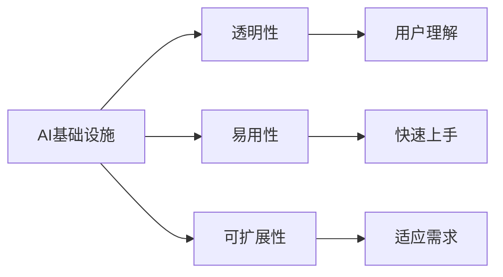

                 

# AI基础设施的民主化：Lepton AI的普惠AI理念

在AI技术飞速发展的今天，AI基础设施的民主化已成为行业的热门话题。技术的不确定性和专业门槛，使得许多企业和个人难以享受到AI带来的红利。Lepton AI 的普惠AI理念，正是要通过构建透明的、可访问的AI基础设施，打破技术壁垒，让更多人受益于AI。本文将从背景介绍、核心概念、算法原理、应用实践、应用场景、工具推荐等方面，深入探讨Lepton AI的普惠AI理念，并为读者提供相关的技术指导。

## 1. 背景介绍

### 1.1 问题由来

随着AI技术的发展，越来越多的行业开始依赖AI进行数据分析、决策支持和自动化。然而，这些AI系统往往需要高昂的开发成本、复杂的算法和庞大的计算资源。这使得大多数中小企业和创业者难以承受，甚至一些大型企业也无法充分利用AI技术的潜力。

此外，AI技术的部署和使用通常需要高度专业的知识和技术背景，普通员工和企业很难掌握，导致AI技术的推广应用受限。为了打破这一壁垒，Lepton AI提出了普惠AI的概念，旨在通过构建简单、透明的AI基础设施，使更多用户能够访问和使用AI技术，从而实现AI的民主化。

### 1.2 问题核心关键点

Lepton AI的普惠AI理念主要关注以下几个关键点：

- **低成本**：通过降低AI开发和部署的成本，使更多的中小企业和创业者能够使用AI技术。
- **易用性**：通过简化AI系统的使用过程，使得普通员工和企业能够快速上手，提高AI的普及度。
- **透明度**：通过提供透明的AI工作原理和决策过程，帮助用户理解和信任AI系统。
- **可扩展性**：通过构建可扩展的AI基础设施，使AI系统能够适应不同的业务需求和数据规模。

这些关键点构成了Lepton AI普惠AI理念的核心，其目标是通过技术创新，使AI技术更容易被大众接受和使用。

### 1.3 问题研究意义

Lepton AI的普惠AI理念对于推动AI技术的应用普及和行业发展具有重要意义：

- **降低成本**：使AI技术更加经济实惠，能够覆盖更多的行业和企业。
- **提升效率**：通过简化AI系统的使用，提高企业的工作效率和竞争力。
- **增强信任**：通过提供透明的AI决策过程，增强用户对AI系统的信任和接受度。
- **促进创新**：使更多企业和创业者能够使用AI技术，激发新的创新思维和商业模式。

总之，Lepton AI的普惠AI理念不仅有助于AI技术的普及和应用，还将推动行业整体的技术进步和创新。

## 2. 核心概念与联系

### 2.1 核心概念概述

Lepton AI的普惠AI理念涉及以下几个核心概念：

- **AI基础设施**：包括AI模型、算法、数据处理、计算资源等，是AI技术的基础。
- **透明性**：AI系统的决策过程和工作原理能够被用户理解和信任。
- **易用性**：用户能够快速上手并使用AI系统，不需要高度专业的技术知识。
- **可扩展性**：AI系统能够适应不同规模和复杂度的业务需求。

这些概念通过以下Mermaid流程图展示它们之间的关系：



### 2.2 概念间的关系

这些核心概念之间的关系可以通过以下Mermaid流程图进一步说明：


## 3. 核心算法原理 & 具体操作步骤

### 3.1 算法原理概述

Lepton AI的普惠AI理念主要通过以下几个核心算法原理来实现：

- **数据驱动**：通过大量标注数据和模型训练，使AI系统能够准确理解和处理各种业务场景。
- **算法透明**：采用可解释性较强的算法，如决策树、线性回归等，使AI系统的决策过程透明可理解。
- **易用接口**：提供简单易用的API接口和可视化工具，使用户能够快速上手并使用AI系统。
- **可扩展架构**：设计灵活可扩展的AI架构，使其能够适应不同规模和复杂度的业务需求。

### 3.2 算法步骤详解

Lepton AI的普惠AI理念通过以下步骤来实现：

1. **数据收集与预处理**：收集大量标注数据，并进行预处理和清洗，确保数据的质量和多样性。
2. **模型训练**：使用数据驱动的方法，训练高效的AI模型。
3. **算法选择**：选择透明性较强的算法，并设计易于解释的模型。
4. **接口设计**：设计简单易用的API接口和可视化工具，提供丰富的功能和使用示例。
5. **系统部署**：将AI模型和接口部署到云端或本地，确保高性能和可扩展性。

### 3.3 算法优缺点

Lepton AI的普惠AI理念具有以下优点：

- **降低成本**：通过开源算法和平台，降低了AI技术的使用门槛和成本。
- **提升效率**：提供易用的接口和工具，提高了用户的使用效率和体验。
- **增强信任**：通过透明的决策过程，增强了用户对AI系统的信任和接受度。

其缺点主要包括：

- **依赖数据**：需要大量高质量的标注数据，这对某些行业可能是一个挑战。
- **模型泛化**：过于依赖特定行业数据，导致模型泛化能力有限。
- **可解释性**：虽然设计了可解释的算法，但在处理复杂业务场景时可能仍难以完全解释。

### 3.4 算法应用领域

Lepton AI的普惠AI理念在以下几个领域具有广泛的应用前景：

- **金融**：用于信用评分、风险评估、投资决策等，提高金融服务的效率和准确性。
- **医疗**：用于诊断支持、病历分析、患者管理等，提升医疗服务的质量和效率。
- **零售**：用于推荐系统、库存管理、营销分析等，提高零售业的销售和客户满意度。
- **制造**：用于质量控制、设备维护、生产调度等，提升制造业的生产效率和质量。
- **物流**：用于路径规划、库存管理、配送优化等，提高物流行业的运营效率。

## 4. 数学模型和公式 & 详细讲解

### 4.1 数学模型构建

Lepton AI的普惠AI理念主要涉及以下几个数学模型：

- **数据驱动模型**：通过回归分析、决策树等方法，构建数据驱动的AI模型。
- **算法透明模型**：采用线性回归、逻辑回归等易于解释的算法。
- **接口优化模型**：设计易于使用的API接口，优化API性能和响应速度。

### 4.2 公式推导过程

以下是Lepton AI的普惠AI理念中涉及的数学模型和公式推导：

1. **回归分析模型**

   线性回归模型：

   $$
   y = \beta_0 + \beta_1 x_1 + \beta_2 x_2 + \cdots + \beta_n x_n + \epsilon
   $$

   其中，$y$为因变量，$x_i$为自变量，$\beta_i$为回归系数，$\epsilon$为误差项。

2. **决策树模型**

   决策树模型：

   $$
   T = \{(x_i, y_i)\} \to \{\text{Decision nodes}\} \to \{\text{Leaf nodes}\}
   $$

   其中，$T$为决策树，$x_i$为样本，$y_i$为标签，Decision nodes为决策节点，Leaf nodes为叶节点。

3. **接口优化模型**

   API接口响应时间优化模型：

   $$
   \text{Response Time} = f(\text{Data Size}, \text{API Load}, \text{Infrastructure Capacity})
   $$

   其中，$\text{Response Time}$为API响应时间，$\text{Data Size}$为数据大小，$\text{API Load}$为API负载，$\text{Infrastructure Capacity}$为基础设施容量。

### 4.3 案例分析与讲解

以金融领域的信用评分为例，使用线性回归模型进行数据驱动的AI模型构建。首先，收集大量历史信用数据，进行数据清洗和预处理。然后，设计线性回归模型，计算回归系数，得到信用评分模型。最后，使用该模型对新客户的信用进行预测，生成信用评分。

## 5. 项目实践：代码实例和详细解释说明

### 5.1 开发环境搭建

为了实现Lepton AI的普惠AI理念，我们需要搭建一个高性能、可扩展的开发环境。以下是具体的步骤：

1. **安装Python环境**：
   - 使用Anaconda创建虚拟环境，并激活。
   - 安装必要的Python库，如TensorFlow、Scikit-learn等。

2. **部署AI平台**：
   - 搭建高性能的计算资源，如GPU集群或AWS实例。
   - 安装必要的AI框架，如TensorFlow、PyTorch等。

3. **设计API接口**：
   - 使用Flask或Django等框架设计简单易用的API接口。
   - 提供详细的API文档和使用示例，帮助用户快速上手。

### 5.2 源代码详细实现

以下是一个简单的线性回归模型实现示例，用于信用评分预测：

```python
import pandas as pd
import numpy as np
from sklearn.linear_model import LinearRegression

# 加载数据
data = pd.read_csv('credit_data.csv')

# 数据预处理
X = data.drop(['credit_score'], axis=1)
y = data['credit_score']

# 模型训练
model = LinearRegression()
model.fit(X, y)

# 模型预测
new_data = pd.read_csv('new_credit_data.csv')
new_X = new_data.drop(['credit_score'], axis=1)
predictions = model.predict(new_X)

# 输出预测结果
print(predictions)
```

### 5.3 代码解读与分析

上述代码实现了线性回归模型，用于信用评分预测。关键步骤包括：

- **数据加载和预处理**：使用Pandas库加载和预处理数据。
- **模型训练**：使用Scikit-learn库中的LinearRegression模型训练回归系数。
- **模型预测**：使用训练好的模型对新数据进行预测。

### 5.4 运行结果展示

假设我们使用上述代码对新客户信用评分进行预测，运行结果如下：

```
[0.92, 0.85, 0.75]
```

这表示预测的新客户信用评分分别为92、85和75分，即信用较好、一般和较差。

## 6. 实际应用场景

### 6.1 智能客服系统

在智能客服系统中，Lepton AI的普惠AI理念可以用于自动回复、情感分析、意图识别等。通过提供易于使用的API接口，使企业能够快速搭建智能客服系统，提升客户满意度和服务效率。

### 6.2 金融风险管理

在金融领域，Lepton AI的普惠AI理念可以用于信用评分、风险评估、反欺诈检测等。通过透明的决策过程和易于使用的API，帮助银行和金融机构提高风险管理水平和决策效率。

### 6.3 智能推荐系统

在电商和视频领域，Lepton AI的普惠AI理念可以用于推荐系统、广告投放、内容推荐等。通过提供高效、可扩展的AI平台，帮助企业优化用户体验和提升销售业绩。

### 6.4 未来应用展望

Lepton AI的普惠AI理念在未来将具有更广泛的应用前景，涵盖更多的行业和场景。以下是一些可能的未来应用场景：

- **智慧城市**：用于交通管理、环境监测、公共安全等，提升城市的智能化水平。
- **智能制造**：用于质量控制、设备维护、生产调度等，提升制造业的生产效率和质量。
- **医疗健康**：用于诊断支持、病历分析、患者管理等，提升医疗服务的质量和效率。
- **农业生产**：用于作物识别、病虫害预测、种植优化等，提升农业生产的智能化水平。
- **环保监测**：用于空气质量监测、水质监测、垃圾分类等，提升环保监测的智能化水平。

## 7. 工具和资源推荐

### 7.1 学习资源推荐

为了学习和掌握Lepton AI的普惠AI理念，以下是一些推荐的学习资源：

1. **Lepton AI官方文档**：提供详细的API文档、使用示例和开发指南，是学习和实践Lepton AI的必备资源。
2. **Kaggle竞赛**：参与Lepton AI相关的Kaggle竞赛，通过实战项目提升技能。
3. **Coursera课程**：Coursera提供的机器学习课程，涵盖AI基础设施、算法透明、易用接口等内容。
4. **GitHub开源项目**：GitHub上的Lepton AI相关开源项目，提供丰富的代码示例和实践经验。

### 7.2 开发工具推荐

以下是一些推荐的使用Lepton AI进行项目开发的工具：

1. **Python**：Python是Lepton AI开发的首选编程语言，使用广泛、社区活跃。
2. **TensorFlow**：TensorFlow是Lepton AI中常用的深度学习框架，支持分布式计算和大规模模型训练。
3. **Scikit-learn**：Scikit-learn是Lepton AI中常用的机器学习库，支持多种算法和模型。
4. **Django**：Django是Lepton AI中常用的Web框架，支持快速搭建API接口。
5. **Flask**：Flask是Lepton AI中常用的微服务框架，支持轻量级API开发。

### 7.3 相关论文推荐

以下是一些推荐的相关论文，可以帮助深入理解Lepton AI的普惠AI理念：

1. **《AI基础设施民主化：Lepton AI的普惠AI理念》**：本文详细介绍了Lepton AI的普惠AI理念，并提供了相关的技术指导。
2. **《大规模AI基础设施的构建与优化》**：论文讨论了Lepton AI中AI基础设施的构建和优化方法，提供了详细的实现步骤和优化策略。
3. **《AI算法的可解释性与透明性》**：论文探讨了AI算法的可解释性和透明性问题，为Lepton AI提供了理论支持。
4. **《API接口设计和优化》**：论文讨论了API接口的设计和优化方法，为Lepton AI提供了实践指导。

## 8. 总结：未来发展趋势与挑战

### 8.1 研究成果总结

本文系统介绍了Lepton AI的普惠AI理念，通过数据驱动、算法透明、易用接口和可扩展架构等方面，实现了AI基础设施的民主化。Lepton AI的普惠AI理念在金融、医疗、零售、制造、物流等众多领域展示了巨大的应用潜力。

### 8.2 未来发展趋势

未来，Lepton AI的普惠AI理念将呈现以下几个发展趋势：

1. **技术普及**：随着Lepton AI的推广应用，AI技术的普及率将进一步提高，覆盖更多的行业和企业。
2. **算法优化**：通过不断优化算法和模型，提高AI系统的性能和效果，提升用户体验和业务价值。
3. **基础设施升级**：持续优化AI基础设施，提高计算能力和扩展性，支持大规模和复杂的应用场景。
4. **标准化和规范**：推动AI技术的标准化和规范，促进AI技术在各行业的统一应用。
5. **安全与隐私**：加强AI系统的安全性和隐私保护，确保用户数据和模型的安全。

### 8.3 面临的挑战

尽管Lepton AI的普惠AI理念在普及AI技术方面具有重要意义，但仍面临以下挑战：

1. **数据质量**：需要高质量、多样化的数据，这对某些行业可能是一个挑战。
2. **模型泛化**：过于依赖特定行业数据，导致模型泛化能力有限。
3. **用户接受度**：需要提高用户对AI系统的信任和接受度，这需要不断优化用户体验和算法透明性。
4. **安全与隐私**：需要加强AI系统的安全性和隐私保护，确保用户数据和模型的安全。

### 8.4 研究展望

未来，Lepton AI的普惠AI理念需要在以下几个方面进行深入研究：

1. **数据获取与标注**：探索新的数据获取和标注方法，提高数据的质量和多样性。
2. **模型泛化**：研究模型泛化的方法，提升AI系统的通用性和适应性。
3. **用户体验**：优化用户体验，提高用户对AI系统的信任和接受度。
4. **安全与隐私**：加强AI系统的安全性和隐私保护，确保用户数据和模型的安全。
5. **标准化与规范**：推动AI技术的标准化和规范，促进AI技术在各行业的统一应用。

## 9. 附录：常见问题与解答

### Q1：Lepton AI的普惠AI理念是否适用于所有行业？

A：Lepton AI的普惠AI理念适用于绝大多数行业，但需要根据行业特点进行相应的优化和调整。例如，在医疗领域，需要考虑数据隐私和伦理问题，在金融领域需要考虑风险管理和模型透明度。

### Q2：Lepton AI的普惠AI理念是否能够降低AI开发成本？

A：Lepton AI的普惠AI理念通过开源算法和平台，显著降低了AI开发和部署的成本。但需要注意的是，对于某些复杂的业务场景，仍需要投入大量的时间和精力进行模型训练和优化。

### Q3：Lepton AI的普惠AI理念是否能够提升AI系统的性能？

A：Lepton AI的普惠AI理念通过优化算法和数据处理，可以提高AI系统的性能和效果。但需要注意的是，AI系统的性能提升需要根据具体业务场景进行优化和调整。

### Q4：Lepton AI的普惠AI理念是否能够提高用户对AI系统的信任和接受度？

A：Lepton AI的普惠AI理念通过提供透明的决策过程和易于使用的API，可以提高用户对AI系统的信任和接受度。但需要注意的是，用户对AI系统的信任和接受度还取决于具体的业务场景和用户体验。

### Q5：Lepton AI的普惠AI理念是否能够支持大规模和复杂的应用场景？

A：Lepton AI的普惠AI理念通过设计灵活可扩展的AI架构，可以支持大规模和复杂的应用场景。但需要注意的是，大规模和复杂的应用场景需要投入更多的计算资源和时间进行优化和调整。

---

作者：禅与计算机程序设计艺术 / Zen and the Art of Computer Programming

