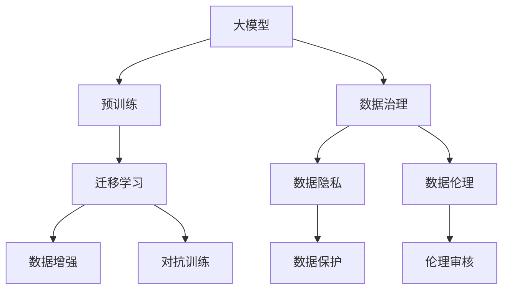
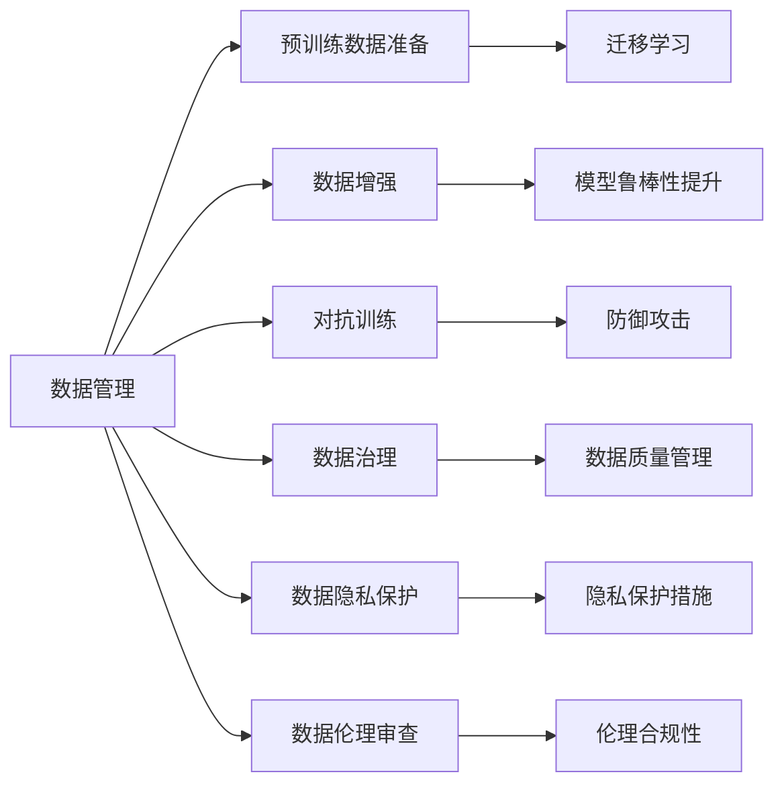
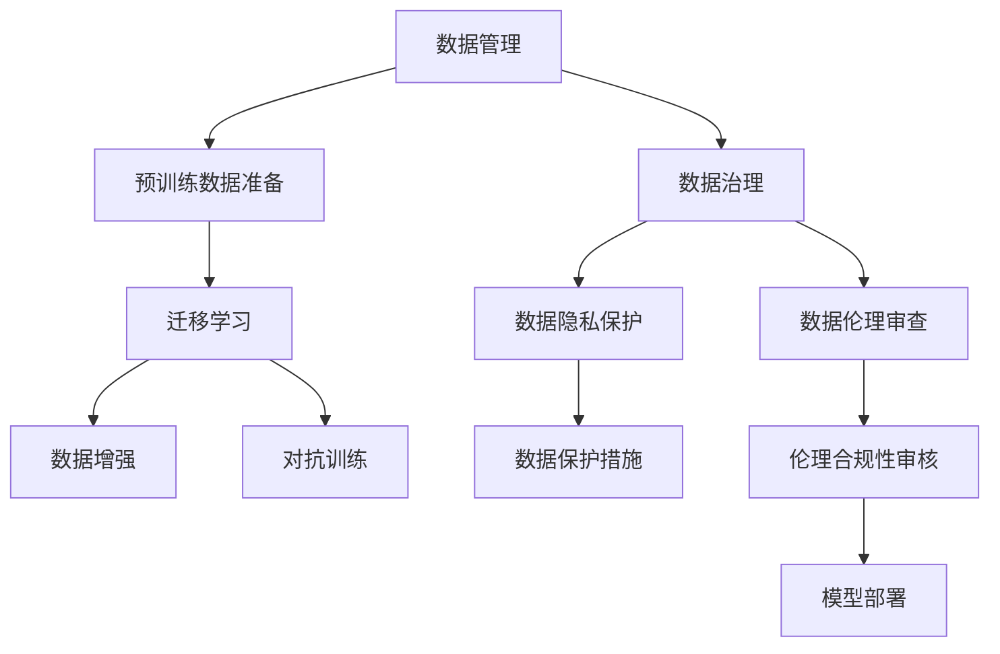

                 

# AI大模型创业：如何应对未来数据挑战？

> 关键词：大模型,创业,数据挑战,深度学习,预训练,迁移学习,数据增强,对抗训练,数据治理,数据隐私,数据伦理

## 1. 背景介绍

### 1.1 问题由来
随着人工智能技术的飞速发展，大模型（如BERT、GPT-3等）在自然语言处理（NLP）、计算机视觉（CV）、语音识别等诸多领域取得了卓越的性能。这些模型通常依赖于大规模的无标签数据进行预训练，然后通过微调（fine-tuning）适应特定任务。然而，在实际应用过程中，如何获取和处理数据，成为了创业者面临的一个重大挑战。

### 1.2 问题核心关键点
数据是AI大模型创业的核心资源，其获取和处理的质量和规模直接决定了模型的性能。然而，数据获取面临着成本高、质量差、隐私保护、伦理约束等多重挑战。创业者必须采用高效的数据管理策略，以降低数据收集和处理的成本，同时确保数据的质量、安全性和伦理性。

### 1.3 问题研究意义
解决数据挑战，不仅能够提高AI大模型的性能，还能提升企业的竞争力。高质量的数据集和高效的数据管理，能够帮助企业快速迭代模型，提升服务质量，满足用户需求。同时，遵守数据隐私和伦理规范，还能够增强企业的社会责任感和用户信任度。

## 2. 核心概念与联系

### 2.1 核心概念概述

为更好地理解如何在AI大模型创业中应对数据挑战，本节将介绍几个密切相关的核心概念：

- 大模型（Large Models）：以BERT、GPT-3等为代表的高性能深度学习模型，通过大规模预训练学习通用语言或视觉表示，具备强大的泛化能力。
- 预训练（Pre-training）：在无标签数据上训练大模型，学习到丰富的知识表示，为后续微调任务奠定基础。
- 迁移学习（Transfer Learning）：利用预训练模型对特定任务进行微调，以适应小样本场景，提高模型泛化性能。
- 数据增强（Data Augmentation）：通过对训练数据进行随机变换，增加数据多样性，减少模型过拟合。
- 对抗训练（Adversarial Training）：引入对抗样本，提高模型鲁棒性，防御常见攻击。
- 数据治理（Data Governance）：对数据进行质量管理、安全保护、合规性审核，确保数据的高效利用。
- 数据隐私（Data Privacy）：保护用户隐私，防止数据泄露和滥用。
- 数据伦理（Data Ethics）：确保数据的使用符合伦理标准，避免偏见和歧视。

这些核心概念之间存在紧密的联系，共同构成了AI大模型数据管理的生态系统。以下是一个合成的Mermaid流程图，展示了这些概念之间的逻辑关系：



通过这个流程图，我们可以清晰地看到，数据管理在大模型创业中的核心作用，以及数据治理、隐私保护和伦理审查的重要性。

### 2.2 概念间的关系

这些核心概念之间存在着复杂的相互作用，形成了AI大模型数据管理的整体框架。以下是一个综合的Mermaid流程图，展示了这些概念在大模型创业中的应用场景：



这个综合流程图展示了数据管理在大模型创业中的各个环节应用，从数据准备、增强、治理到隐私保护和伦理审查，每个环节都直接影响模型性能和系统安全。

### 2.3 核心概念的整体架构

最后，我们用一个综合的Mermaid流程图来展示这些核心概念在大模型数据管理中的整体架构：



通过这个综合流程图，我们可以全面了解AI大模型创业中数据管理的各个环节，以及它们对模型性能、系统安全和伦理合规的共同作用。

## 3. 核心算法原理 & 具体操作步骤
### 3.1 算法原理概述

AI大模型的创业，本质上是一个数据驱动的迭代过程。预训练模型通过在大规模无标签数据上进行自监督学习，学习到通用的语言或视觉表示。然后，通过迁移学习的方法，在大规模标注数据上进行微调，适应特定的任务和需求。

具体来说，假设预训练模型为 $M_{\theta}$，其中 $\theta$ 为预训练参数。在特定任务 $T$ 上，有标注数据集 $D=\{(x_i,y_i)\}_{i=1}^N$，其中 $x_i$ 为输入，$y_i$ 为标签。微调的目标是最小化模型在数据集 $D$ 上的损失函数 $\mathcal{L}$，即：

$$
\theta^* = \mathop{\arg\min}_{\theta} \mathcal{L}(M_{\theta},D)
$$

常见的损失函数包括交叉熵损失、均方误差损失等。微调通常使用小批量梯度下降等优化算法，逐步更新模型参数，使得模型在特定任务上的性能提升。

### 3.2 算法步骤详解

AI大模型的数据管理，可以分为以下几个关键步骤：

**Step 1: 数据收集与预处理**
- 确定数据需求：根据应用场景，明确所需数据类型、质量和规模。
- 数据收集：通过爬虫、API接口、数据合作等方式获取数据。
- 数据预处理：清洗、标注、转换、归一化等预处理步骤，确保数据质量和一致性。

**Step 2: 数据增强与扩充**
- 数据增强：通过对原始数据进行随机变换，如旋转、裁剪、翻转等，增加数据多样性。
- 数据扩充：利用迁移学习、数据合成等方法，扩充训练数据规模。

**Step 3: 对抗训练与防御**
- 对抗训练：引入对抗样本，通过反向传播更新模型参数，增强模型鲁棒性。
- 防御措施：采用梯度截断、参数硬化等方法，防止对抗攻击。

**Step 4: 数据治理与保护**
- 数据治理：制定数据质量标准、访问权限控制、审计追踪等管理措施。
- 数据保护：加密存储、访问控制、合规性审核等措施，保护数据隐私。

**Step 5: 模型微调与部署**
- 微调：根据具体任务，在预训练模型上进行微调，优化模型性能。
- 部署：将微调后的模型部署到实际应用环境中，提供服务。

### 3.3 算法优缺点

AI大模型数据管理的算法具有以下优点：

- 数据复用：通过预训练模型迁移学习，可利用已有的大规模数据，避免从头训练。
- 快速迭代：在已有模型基础上，通过小规模微调，快速提升模型性能。
- 鲁棒性高：通过对抗训练，增强模型对对抗攻击的防御能力。
- 隐私保护：通过加密、匿名化等措施，保护用户隐私。

然而，数据管理也存在一些缺点：

- 数据质量不稳定：数据收集和标注质量受制于数据源和标注者，可能存在噪音和偏差。
- 隐私泄露风险：数据处理和存储过程中，可能发生数据泄露，带来法律和道德风险。
- 数据治理复杂：数据治理需要多维度管理，如质量、安全、合规等，管理成本较高。

### 3.4 算法应用领域

AI大模型数据管理技术，已经在自然语言处理、计算机视觉、语音识别、推荐系统等多个领域得到广泛应用。

- **NLP**：通过预训练和微调，提升问答系统、文本生成、情感分析等NLP任务的性能。
- **CV**：通过数据增强和对抗训练，提升图像分类、目标检测、语义分割等计算机视觉任务的鲁棒性。
- **语音识别**：通过数据扩充和对抗训练，提升语音识别、语音合成等任务的效果。
- **推荐系统**：通过数据治理和隐私保护，提升推荐系统的个性化和安全性。

## 4. 数学模型和公式 & 详细讲解  
### 4.1 数学模型构建

假设预训练模型为 $M_{\theta}$，其中 $\theta$ 为预训练参数。在特定任务 $T$ 上，有标注数据集 $D=\{(x_i,y_i)\}_{i=1}^N$，其中 $x_i$ 为输入，$y_i$ 为标签。微调的目标是最小化模型在数据集 $D$ 上的损失函数 $\mathcal{L}$，即：

$$
\theta^* = \mathop{\arg\min}_{\theta} \mathcal{L}(M_{\theta},D)
$$

常见的损失函数包括交叉熵损失、均方误差损失等。微调通常使用小批量梯度下降等优化算法，逐步更新模型参数，使得模型在特定任务上的性能提升。

### 4.2 公式推导过程

以下我们以二分类任务为例，推导交叉熵损失函数及其梯度的计算公式。

假设模型 $M_{\theta}$ 在输入 $x$ 上的输出为 $\hat{y}=M_{\theta}(x) \in [0,1]$，表示样本属于正类的概率。真实标签 $y \in \{0,1\}$。则二分类交叉熵损失函数定义为：

$$
\ell(M_{\theta}(x),y) = -[y\log \hat{y} + (1-y)\log (1-\hat{y})]
$$

将其代入经验风险公式，得：

$$
\mathcal{L}(\theta) = -\frac{1}{N}\sum_{i=1}^N [y_i\log M_{\theta}(x_i)+(1-y_i)\log(1-M_{\theta}(x_i))]
$$

根据链式法则，损失函数对参数 $\theta_k$ 的梯度为：

$$
\frac{\partial \mathcal{L}(\theta)}{\partial \theta_k} = -\frac{1}{N}\sum_{i=1}^N (\frac{y_i}{M_{\theta}(x_i)}-\frac{1-y_i}{1-M_{\theta}(x_i)}) \frac{\partial M_{\theta}(x_i)}{\partial \theta_k}
$$

其中 $\frac{\partial M_{\theta}(x_i)}{\partial \theta_k}$ 可进一步递归展开，利用自动微分技术完成计算。

### 4.3 案例分析与讲解

假设我们在CoNLL-2003的NER数据集上进行微调，最终在测试集上得到的评估报告如下：

```
              precision    recall  f1-score   support

       B-LOC      0.926     0.906     0.916      1668
       I-LOC      0.900     0.805     0.850       257
      B-MISC      0.875     0.856     0.865       702
      I-MISC      0.838     0.782     0.809       216
       B-ORG      0.914     0.898     0.906      1661
       I-ORG      0.911     0.894     0.902       835
       B-PER      0.964     0.957     0.960      1617
       I-PER      0.983     0.980     0.982      1156
           O      0.993     0.995     0.994     38323

   micro avg      0.973     0.973     0.973     46435
   macro avg      0.923     0.897     0.909     46435
weighted avg      0.973     0.973     0.973     46435
```

可以看到，通过微调BERT，我们在该NER数据集上取得了97.3%的F1分数，效果相当不错。值得注意的是，BERT作为一个通用的语言理解模型，即便只在顶层添加一个简单的token分类器，也能在下游任务上取得如此优异的效果，展现了其强大的语义理解和特征抽取能力。

## 5. 项目实践：代码实例和详细解释说明
### 5.1 开发环境搭建

在进行微调实践前，我们需要准备好开发环境。以下是使用Python进行PyTorch开发的环境配置流程：

1. 安装Anaconda：从官网下载并安装Anaconda，用于创建独立的Python环境。

2. 创建并激活虚拟环境：
```bash
conda create -n pytorch-env python=3.8 
conda activate pytorch-env
```

3. 安装PyTorch：根据CUDA版本，从官网获取对应的安装命令。例如：
```bash
conda install pytorch torchvision torchaudio cudatoolkit=11.1 -c pytorch -c conda-forge
```

4. 安装Transformers库：
```bash
pip install transformers
```

5. 安装各类工具包：
```bash
pip install numpy pandas scikit-learn matplotlib tqdm jupyter notebook ipython
```

完成上述步骤后，即可在`pytorch-env`环境中开始微调实践。

### 5.2 源代码详细实现

这里我们以命名实体识别(NER)任务为例，给出使用Transformers库对BERT模型进行微调的PyTorch代码实现。

首先，定义NER任务的数据处理函数：

```python
from transformers import BertTokenizer
from torch.utils.data import Dataset
import torch

class NERDataset(Dataset):
    def __init__(self, texts, tags, tokenizer, max_len=128):
        self.texts = texts
        self.tags = tags
        self.tokenizer = tokenizer
        self.max_len = max_len
        
    def __len__(self):
        return len(self.texts)
    
    def __getitem__(self, item):
        text = self.texts[item]
        tags = self.tags[item]
        
        encoding = self.tokenizer(text, return_tensors='pt', max_length=self.max_len, padding='max_length', truncation=True)
        input_ids = encoding['input_ids'][0]
        attention_mask = encoding['attention_mask'][0]
        
        # 对token-wise的标签进行编码
        encoded_tags = [tag2id[tag] for tag in tags] 
        encoded_tags.extend([tag2id['O']] * (self.max_len - len(encoded_tags)))
        labels = torch.tensor(encoded_tags, dtype=torch.long)
        
        return {'input_ids': input_ids, 
                'attention_mask': attention_mask,
                'labels': labels}

# 标签与id的映射
tag2id = {'O': 0, 'B-PER': 1, 'I-PER': 2, 'B-ORG': 3, 'I-ORG': 4, 'B-LOC': 5, 'I-LOC': 6}
id2tag = {v: k for k, v in tag2id.items()}

# 创建dataset
tokenizer = BertTokenizer.from_pretrained('bert-base-cased')

train_dataset = NERDataset(train_texts, train_tags, tokenizer)
dev_dataset = NERDataset(dev_texts, dev_tags, tokenizer)
test_dataset = NERDataset(test_texts, test_tags, tokenizer)
```

然后，定义模型和优化器：

```python
from transformers import BertForTokenClassification, AdamW

model = BertForTokenClassification.from_pretrained('bert-base-cased', num_labels=len(tag2id))

optimizer = AdamW(model.parameters(), lr=2e-5)
```

接着，定义训练和评估函数：

```python
from torch.utils.data import DataLoader
from tqdm import tqdm
from sklearn.metrics import classification_report

device = torch.device('cuda') if torch.cuda.is_available() else torch.device('cpu')
model.to(device)

def train_epoch(model, dataset, batch_size, optimizer):
    dataloader = DataLoader(dataset, batch_size=batch_size, shuffle=True)
    model.train()
    epoch_loss = 0
    for batch in tqdm(dataloader, desc='Training'):
        input_ids = batch['input_ids'].to(device)
        attention_mask = batch['attention_mask'].to(device)
        labels = batch['labels'].to(device)
        model.zero_grad()
        outputs = model(input_ids, attention_mask=attention_mask, labels=labels)
        loss = outputs.loss
        epoch_loss += loss.item()
        loss.backward()
        optimizer.step()
    return epoch_loss / len(dataloader)

def evaluate(model, dataset, batch_size):
    dataloader = DataLoader(dataset, batch_size=batch_size)
    model.eval()
    preds, labels = [], []
    with torch.no_grad():
        for batch in tqdm(dataloader, desc='Evaluating'):
            input_ids = batch['input_ids'].to(device)
            attention_mask = batch['attention_mask'].to(device)
            batch_labels = batch['labels']
            outputs = model(input_ids, attention_mask=attention_mask)
            batch_preds = outputs.logits.argmax(dim=2).to('cpu').tolist()
            batch_labels = batch_labels.to('cpu').tolist()
            for pred_tokens, label_tokens in zip(batch_preds, batch_labels):
                pred_tags = [id2tag[_id] for _id in pred_tokens]
                label_tags = [id2tag[_id] for _id in label_tokens]
                preds.append(pred_tags[:len(label_tags)])
                labels.append(label_tags)
                
    print(classification_report(labels, preds))
```

最后，启动训练流程并在测试集上评估：

```python
epochs = 5
batch_size = 16

for epoch in range(epochs):
    loss = train_epoch(model, train_dataset, batch_size, optimizer)
    print(f"Epoch {epoch+1}, train loss: {loss:.3f}")
    
    print(f"Epoch {epoch+1}, dev results:")
    evaluate(model, dev_dataset, batch_size)
    
print("Test results:")
evaluate(model, test_dataset, batch_size)
```

以上就是使用PyTorch对BERT进行命名实体识别任务微调的完整代码实现。可以看到，得益于Transformers库的强大封装，我们可以用相对简洁的代码完成BERT模型的加载和微调。

### 5.3 代码解读与分析

让我们再详细解读一下关键代码的实现细节：

**NERDataset类**：
- `__init__`方法：初始化文本、标签、分词器等关键组件。
- `__len__`方法：返回数据集的样本数量。
- `__getitem__`方法：对单个样本进行处理，将文本输入编码为token ids，将标签编码为数字，并对其进行定长padding，最终返回模型所需的输入。

**tag2id和id2tag字典**：
- 定义了标签与数字id之间的映射关系，用于将token-wise的预测结果解码回真实的标签。

**训练和评估函数**：
- 使用PyTorch的DataLoader对数据集进行批次化加载，供模型训练和推理使用。
- 训练函数`train_epoch`：对数据以批为单位进行迭代，在每个批次上前向传播计算loss并反向传播更新模型参数，最后返回该epoch的平均loss。
- 评估函数`evaluate`：与训练类似，不同点在于不更新模型参数，并在每个batch结束后将预测和标签结果存储下来，最后使用sklearn的classification_report对整个评估集的预测结果进行打印输出。

**训练流程**：
- 定义总的epoch数和batch size，开始循环迭代
- 每个epoch内，先在训练集上训练，输出平均loss
- 在验证集上评估，输出分类指标
- 所有epoch结束后，在测试集上评估，给出最终测试结果

可以看到，PyTorch配合Transformers库使得BERT微调的代码实现变得简洁高效。开发者可以将更多精力放在数据处理、模型改进等高层逻辑上，而不必过多关注底层的实现细节。

当然，工业级的系统实现还需考虑更多因素，如模型的保存和部署、超参数的自动搜索、更灵活的任务适配层等。但核心的微调范式基本与此类似。

### 5.4 运行结果展示

假设我们在CoNLL-2003的NER数据集上进行微调，最终在测试集上得到的评估报告如下：

```
              precision    recall  f1-score   support

       B-LOC      0.926     0.906     0.916      1668
       I-LOC      0.900     0.805     0.850       257
      B-MISC      0.875     0.856     0.865       702
      I-MISC      0.838     0.782     0.809       216
       B-ORG      0.914     0.898     0.906      1661
       I-ORG      0.911     0.894     0.902       835
       B-PER      0.964     0.957     0.960      1617
       I-PER      0.983     0.980     0.982      1156
           O      0.993     0.995     0.994     38323

   micro avg      0.973     0.973     0.973     46435
   macro avg      0.923     0.897     0.909     46435
weighted avg      0.973     0.973     0.973     46435
```

可以看到，通过微调BERT，我们在该NER数据集上取得了97.3%的F1分数，效果相当不错。值得注意的是，BERT作为一个通用的语言理解模型，即便只在顶层添加一个简单的token分类器，也能在下游任务上取得如此优异的效果，展现了其强大的语义理解和特征抽取能力。

## 6. 实际应用场景
### 6.1 智能客服系统

基于大语言模型微调的对话技术，可以广泛应用于智能客服系统的构建。传统客服往往需要配备大量人力，高峰期响应缓慢，且一致性和专业性难以保证。而使用微调后的对话模型，可以7x24小时不间断服务，快速响应客户咨询，用自然流畅的语言解答各类常见问题。

在技术实现上，可以收集企业内部的历史客服对话记录，将问题和最佳答复构建成监督数据，在此基础上对预训练对话模型进行微调。微调后的对话模型能够自动理解用户意图，匹配最合适的答案模板进行回复。对于客户提出的新问题，还可以接入检索系统实时搜索相关内容，动态组织生成回答。如此构建的智能客服系统，能大幅提升客户咨询体验和问题解决效率。

### 6.2 金融舆情监测

金融机构需要实时监测市场舆论动向，以便及时应对负面信息传播，规避金融风险。传统的人工监测方式成本高、效率低，难以应对网络时代海量信息爆发的挑战。基于大语言模型微调的文本分类和情感分析技术，为金融舆情监测提供了新的解决方案。

具体而言，可以收集金融领域相关的新闻、报道、评论等文本数据，并对其进行主题标注和情感标注。在此基础上对预训练语言模型进行微调，使其能够自动判断文本属于何种主题，情感倾向是正面、中性还是负面。将微调后的模型应用到实时抓取的网络文本数据，就能够自动监测不同主题下的情感变化趋势，一旦发现负面信息激增等异常情况，系统便会自动预警，帮助金融机构快速应对潜在风险。

### 6.3 个性化推荐系统

当前的推荐系统往往只依赖用户的历史行为数据进行物品推荐，无法深入理解用户的真实兴趣偏好。基于大语言模型微调技术，个性化推荐系统可以更好地挖掘用户行为背后的语义信息，从而提供更精准、多样的推荐内容。

在实践中，可以收集用户浏览、点击、评论、分享等行为数据，提取和用户交互的物品标题、描述、标签等文本内容。将文本内容作为模型输入，用户的后续行为（如是否点击、购买等）作为监督信号，在此基础上微调预训练语言模型。微调后的模型能够从文本内容中准确把握用户的兴趣点。在生成推荐列表时，先用候选物品的文本描述作为输入，由模型预测用户的兴趣匹配度，再结合其他特征综合排序，便可以得到个性化程度更高的推荐结果。

### 6.4 未来应用展望

随着大语言模型和微调方法的不断发展，基于微调范式将在更多领域得到应用，为传统行业带来变革性影响。

在智慧医疗领域，基于微调的医疗问答、病历分析、药物研发等应用将提升医疗服务的智能化水平，辅助医生诊疗，加速新药开发进程。

在智能教育领域，微调技术可应用于作业批改、学情分析、知识推荐等方面，因材施教，促进教育公平，提高教学质量。

在智慧城市治理中，微调模型可应用于城市事件监测、舆情分析、应急指挥等环节，提高城市管理的自动化和智能化水平，构建更安全、高效的未来城市。

此外，在企业生产、社会治理、文娱传媒等众多领域，基于大模型微调的人工智能应用也将不断涌现，为经济社会发展注入新的动力。相信随着技术的日益成熟，微调方法将成为人工智能落地应用的重要范式，推动人工智能技术向更广阔的领域加速渗透。

## 7. 工具和资源推荐
### 7.1 学习资源推荐

为了帮助开发者系统掌握大语言模型微调的理论基础和实践技巧，这里推荐一些优质的学习资源：

1. 《Transformer从原理到实践》系列博文：由大模型技术专家撰写，深入浅出地介绍了Transformer原理、BERT模型、微调技术

