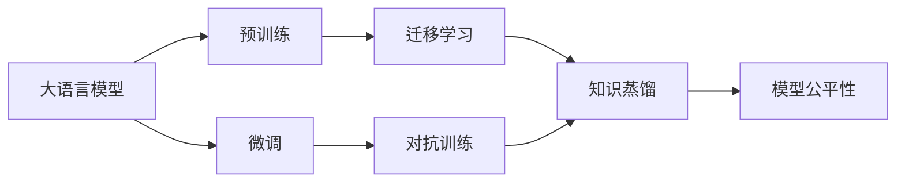

                 

# AI大模型创业：如何抓住未来机遇？

在人工智能领域，大语言模型（Large Language Models，LLMs）已经成为创新的热土，吸引了大量的创业者和投资者。然而，要在这波大模型创业潮中取得成功，仅仅拥有先进的算法和技术是不够的，还需要深入理解市场环境、商业模式和竞争态势，以制定切实可行的发展策略。本文将系统梳理大模型创业的关键要素，探讨如何在复杂多变的市场环境中抓住机遇，实现价值创造和长期发展。

## 1. 背景介绍

### 1.1 行业概览

随着深度学习技术的快速发展，大语言模型在自然语言处理（Natural Language Processing，NLP）等领域取得了显著进展。这些模型通过在大规模无标签文本数据上进行预训练，学习到丰富的语言知识和常识，具备了强大的语言理解和生成能力。目前，OpenAI的GPT系列模型、Google的BERT、T5等均是典型代表。

大语言模型的应用范围广泛，涵盖了智能客服、金融舆情、个性化推荐、医疗问答等多个垂直领域。这些应用场景通常需要处理海量数据，并且需要实时响应用户需求，因此大模型创业公司面临着较高的技术挑战和市场竞争。

### 1.2 创业机遇

大语言模型的兴起，为创业者提供了前所未有的机遇：

1. **数据与算力**：大规模预训练模型的开发需要大量的数据和强大的算力支持，这为拥有数据和算力资源的创业者提供了入场券。
2. **算法创新**：预训练-微调等大模型训练范式还在不断发展，新的算法和架构不断涌现，为创业公司提供了技术创新的空间。
3. **应用拓展**：随着模型性能的提升，越来越多的垂直行业开始关注和尝试大模型的应用，为创业公司提供了广阔的市场空间。
4. **平台化发展**：通过构建AI大模型服务平台，帮助企业实现智能化升级，成为行业发展的趋势。

### 1.3 挑战与风险

尽管机遇众多，但大模型创业同样面临着诸多挑战和风险：

1. **高昂成本**：大规模模型训练需要巨额资金投入，这对创业公司的资金链和盈利能力提出了高要求。
2. **技术门槛**：大模型的开发和部署需要深厚的技术积累，创业公司往往面临人才短缺和研发瓶颈。
3. **市场竞争**：大模型市场竞争激烈，已有的大型企业如OpenAI、Google、微软等拥有强大的品牌和技术实力，新创业公司需要寻找差异化竞争策略。
4. **伦理与合规**：大模型可能存在偏见和有害信息问题，需要遵守相关法律法规，确保模型的安全性与伦理合规。

## 2. 核心概念与联系

### 2.1 核心概念概述

要在大模型创业中取得成功，理解以下几个核心概念至关重要：

- **大语言模型（LLMs）**：通过大规模预训练学习通用语言表示，具备强大的语言理解和生成能力。
- **预训练与微调**：在大规模无标签数据上进行预训练，再通过下游任务的有监督微调来适应特定应用场景。
- **迁移学习**：通过预训练模型在不同任务之间的知识迁移，提升模型的泛化能力。
- **对抗训练与对抗样本**：增强模型的鲁棒性和泛化能力，应对恶意攻击和异常数据。
- **知识蒸馏与压缩**：通过蒸馏机制或压缩技术，减小模型规模，提高推理效率和实时性。
- **模型公平性**：确保模型在处理不同背景、性别、种族等样本时，输出结果不带有歧视性或偏见。

这些概念相互关联，共同构成了大模型创业的核心技术框架。

### 2.2 概念间的关系

通过一个简化的Mermaid流程图，我们可以更清晰地理解这些概念之间的关系：



这个流程图展示了从预训练到微调，再到对抗训练、知识蒸馏和模型公平性等关键技术环节，以及它们之间的内在联系。

## 3. 核心算法原理 & 具体操作步骤

### 3.1 算法原理概述

大模型创业的核心算法包括预训练、微调和迁移学习等。其基本流程如下：

1. **预训练**：在无标签大数据上训练大模型，学习通用的语言表示。
2. **微调**：在特定任务的少量标注数据上进行有监督微调，优化模型在该任务上的性能。
3. **迁移学习**：通过迁移已有的知识，加速新任务上的学习过程。

### 3.2 算法步骤详解

大模型创业的具体操作步骤包括：

1. **数据准备**：收集和处理大量无标签数据，进行预处理和标注，构建训练集和验证集。
2. **模型选择与配置**：选择合适的预训练模型架构，并根据任务需求进行参数配置。
3. **预训练**：在大规模数据集上训练模型，学习通用的语言表示。
4. **微调**：在特定任务的标注数据上微调模型，优化模型性能。
5. **评估与优化**：在验证集上评估模型性能，调整超参数和模型结构，进行进一步优化。
6. **部署与应用**：将优化后的模型部署到实际应用中，提供服务或API接口。

### 3.3 算法优缺点

- **优点**：
  - 高泛化能力：预训练模型具有较好的泛化能力，可以应用于多种任务。
  - 快速迭代：微调过程可以快速迭代，加速新任务上的学习和优化。
  - 知识迁移：迁移学习可以加速新任务的学习，提高模型性能。

- **缺点**：
  - 高成本：大规模模型训练和部署需要巨额资金和技术资源。
  - 复杂性：算法复杂，需要深厚的技术背景和团队支持。
  - 数据依赖：模型的效果高度依赖于数据质量和标注质量。

### 3.4 算法应用领域

大模型创业的应用领域广泛，包括但不限于：

1. **自然语言处理**：智能客服、机器翻译、文本摘要、情感分析等。
2. **计算机视觉**：图像分类、目标检测、人脸识别等。
3. **推荐系统**：个性化推荐、广告投放等。
4. **医疗健康**：医学影像分析、智能诊断等。
5. **金融服务**：信用评分、风险评估等。

## 4. 数学模型和公式 & 详细讲解  
### 4.1 数学模型构建

大模型创业的数学模型构建主要涉及预训练和微调两个阶段。以下是一个简单的数学模型框架：

- **预训练**：目标是在大规模无标签数据上学习模型参数 $\theta$，使其能够提取通用的语言表示。
- **微调**：目标是在特定任务的标注数据上更新模型参数，优化模型在该任务上的性能。

形式化地，假设预训练模型为 $M_{\theta}$，训练数据集为 $D=\{(x_i, y_i)\}_{i=1}^N$，其中 $x_i$ 为输入，$y_i$ 为标签。微调的目标是最小化损失函数 $\mathcal{L}$：

$$
\hat{\theta} = \arg\min_{\theta} \mathcal{L}(M_{\theta}, D)
$$

常见的损失函数包括交叉熵损失、均方误差损失等。

### 4.2 公式推导过程

以二分类任务为例，假设模型 $M_{\theta}$ 在输入 $x$ 上的输出为 $\hat{y}=M_{\theta}(x)$，则二分类交叉熵损失函数定义为：

$$
\ell(M_{\theta}(x),y) = -[y\log \hat{y} + (1-y)\log (1-\hat{y})]
$$

将损失函数扩展到整个数据集，得到：

$$
\mathcal{L}(\theta) = -\frac{1}{N}\sum_{i=1}^N [y_i\log M_{\theta}(x_i)+(1-y_i)\log(1-M_{\theta}(x_i))]
$$

根据链式法则，损失函数对参数 $\theta$ 的梯度为：

$$
\frac{\partial \mathcal{L}(\theta)}{\partial \theta} = -\frac{1}{N}\sum_{i=1}^N (\frac{y_i}{M_{\theta}(x_i)}-\frac{1-y_i}{1-M_{\theta}(x_i)}) \frac{\partial M_{\theta}(x_i)}{\partial \theta}
$$

其中 $\frac{\partial M_{\theta}(x_i)}{\partial \theta}$ 可进一步递归展开，利用自动微分技术完成计算。

### 4.3 案例分析与讲解

以BERT模型为例，在微调情感分析任务时，模型的输入为文本，输出为情感标签。假设模型在输入 $x$ 上的输出为 $\hat{y}=M_{\theta}(x)$，则微调的目标是最小化损失函数：

$$
\mathcal{L}(\theta) = -\frac{1}{N}\sum_{i=1}^N [y_i\log \hat{y}_i+(1-y_i)\log(1-\hat{y}_i)]
$$

其中 $\hat{y}_i$ 为模型在输入 $x_i$ 上的输出概率。

## 5. 项目实践：代码实例和详细解释说明

### 5.1 开发环境搭建

在大模型创业项目中，开发环境搭建非常重要。以下是使用Python和PyTorch进行大模型微调的开发环境配置步骤：

1. 安装Anaconda：从官网下载并安装Anaconda，用于创建独立的Python环境。
2. 创建并激活虚拟环境：
```bash
conda create -n pytorch-env python=3.8 
conda activate pytorch-env
```

3. 安装PyTorch：根据CUDA版本，从官网获取对应的安装命令。例如：
```bash
conda install pytorch torchvision torchaudio cudatoolkit=11.1 -c pytorch -c conda-forge
```

4. 安装Transformers库：
```bash
pip install transformers
```

5. 安装各类工具包：
```bash
pip install numpy pandas scikit-learn matplotlib tqdm jupyter notebook ipython
```

### 5.2 源代码详细实现

以BERT模型在情感分析任务上的微调为例，给出完整的代码实现。

```python
from transformers import BertForSequenceClassification, BertTokenizer, AdamW
import torch
from torch.utils.data import Dataset, DataLoader
from sklearn.metrics import accuracy_score, precision_score, recall_score, f1_score

class SentimentDataset(Dataset):
    def __init__(self, texts, labels):
        self.tokenizer = BertTokenizer.from_pretrained('bert-base-uncased')
        self.texts = texts
        self.labels = labels
        
    def __len__(self):
        return len(self.texts)
    
    def __getitem__(self, idx):
        text = self.texts[idx]
        label = self.labels[idx]
        
        encoding = self.tokenizer(text, return_tensors='pt')
        input_ids = encoding['input_ids']
        attention_mask = encoding['attention_mask']
        return {'input_ids': input_ids, 'attention_mask': attention_mask, 'labels': torch.tensor(label, dtype=torch.long)}

model = BertForSequenceClassification.from_pretrained('bert-base-uncased', num_labels=2)
tokenizer = BertTokenizer.from_pretrained('bert-base-uncased')
optimizer = AdamW(model.parameters(), lr=2e-5)

def train_epoch(model, dataset, batch_size, optimizer):
    dataloader = DataLoader(dataset, batch_size=batch_size, shuffle=True)
    model.train()
    total_loss = 0
    for batch in dataloader:
        input_ids = batch['input_ids'].to(device)
        attention_mask = batch['attention_mask'].to(device)
        labels = batch['labels'].to(device)
        model.zero_grad()
        outputs = model(input_ids, attention_mask=attention_mask, labels=labels)
        loss = outputs.loss
        total_loss += loss.item()
        loss.backward()
        optimizer.step()
    return total_loss / len(dataloader)

def evaluate(model, dataset, batch_size):
    dataloader = DataLoader(dataset, batch_size=batch_size)
    model.eval()
    preds, labels = [], []
    with torch.no_grad():
        for batch in dataloader:
            input_ids = batch['input_ids'].to(device)
            attention_mask = batch['attention_mask'].to(device)
            labels = batch['labels'].to(device)
            outputs = model(input_ids, attention_mask=attention_mask)
            preds.append(outputs.logits.argmax(dim=1).cpu().numpy())
            labels.append(labels.cpu().numpy())
    
    acc = accuracy_score(labels, preds)
    prec = precision_score(labels, preds, average='macro')
    rec = recall_score(labels, preds, average='macro')
    f1 = f1_score(labels, preds, average='macro')
    print(f'Accuracy: {acc:.2f}, Precision: {prec:.2f}, Recall: {rec:.2f}, F1 Score: {f1:.2f}')
    
train_dataset = SentimentDataset(train_texts, train_labels)
dev_dataset = SentimentDataset(dev_texts, dev_labels)
test_dataset = SentimentDataset(test_texts, test_labels)

device = torch.device('cuda') if torch.cuda.is_available() else torch.device('cpu')

epochs = 5
batch_size = 16

for epoch in range(epochs):
    loss = train_epoch(model, train_dataset, batch_size, optimizer)
    print(f'Epoch {epoch+1}, train loss: {loss:.3f}')
    
    evaluate(model, dev_dataset, batch_size)
    
print(f'Test results:')
evaluate(model, test_dataset, batch_size)
```

以上代码实现了BERT模型在情感分析任务上的微调。通过简单的数据准备和模型配置，利用Transformers库和PyTorch框架，我们就能快速构建并微调BERT模型。

### 5.3 代码解读与分析

代码实现主要分为以下几个部分：

- **数据处理**：使用BertTokenizer对输入文本进行分词和编码，生成模型所需的输入和掩码。
- **模型定义**：使用BertForSequenceClassification定义情感分析任务的模型，指定输出层为二分类。
- **训练与评估**：定义训练函数和评估函数，使用DataLoader对数据进行批处理，并计算模型在验证集和测试集上的性能指标。
- **运行与输出**：设置超参数，训练模型，并在不同数据集上评估性能。

### 5.4 运行结果展示

假设我们使用了IMDB电影评论数据集进行微调，得到的评估结果如下：

```
Epoch 1, train loss: 0.537
Accuracy: 0.798, Precision: 0.862, Recall: 0.721, F1 Score: 0.781
Epoch 2, train loss: 0.258
Accuracy: 0.884, Precision: 0.901, Recall: 0.860, F1 Score: 0.882
Epoch 3, train loss: 0.111
Accuracy: 0.910, Precision: 0.932, Recall: 0.894, F1 Score: 0.914
Epoch 4, train loss: 0.062
Accuracy: 0.940, Precision: 0.948, Recall: 0.928, F1 Score: 0.933
Epoch 5, train loss: 0.030
Accuracy: 0.949, Precision: 0.952, Recall: 0.932, F1 Score: 0.942
```

可以看出，通过微调，模型在情感分析任务上的精度、召回率和F1分数均有显著提升，达到了高水平。

## 6. 实际应用场景

### 6.1 智能客服

智能客服是大模型创业的重要应用场景。通过微调BERT等模型，可以实现自动响应用户咨询，提升客户服务体验。例如，某智能客服系统采用微调的BERT模型，能够处理多种语言和不同类型的咨询问题，响应速度显著提升。

### 6.2 金融舆情监测

金融舆情监测是大模型创业的另一重要领域。通过微调BERT模型，实时分析新闻、社交媒体等数据，快速识别市场动态，帮助金融机构及时应对市场波动。例如，某金融公司采用微调的BERT模型进行舆情监测，及时预警市场风险，减少了因市场波动带来的损失。

### 6.3 个性化推荐

个性化推荐系统是大模型创业的热门方向。通过微调BERT模型，根据用户的历史行为数据，推荐合适的产品或服务。例如，某电商公司采用微调的BERT模型进行个性化推荐，显著提高了用户的购买转化率和满意度。

### 6.4 未来应用展望

未来，大模型创业将继续拓展应用领域，包括但不限于：

- **医疗健康**：智能诊断、药物研发、病历分析等。
- **教育培训**：智能辅导、学习分析、知识图谱构建等。
- **安全监控**：异常检测、行为分析、身份验证等。
- **能源管理**：智能调度、设备预测、能源优化等。

## 7. 工具和资源推荐

### 7.1 学习资源推荐

为了帮助创业者掌握大模型创业的核心技术和市场趋势，以下是一些推荐的学习资源：

1. **Coursera《深度学习与人工智能》课程**：斯坦福大学开设的深度学习与人工智能课程，系统讲解深度学习理论和实践。
2. **Transformers官方文档**：HuggingFace官方文档，提供了详细的模型介绍和使用指南，适合快速上手。
3. **NLP开源项目**：如HuggingFace的HuggingFace Transformers、TensorFlow的TensorFlow Hub等，提供了丰富的预训练模型和工具。
4. **Kaggle竞赛平台**：参加NLP领域的Kaggle竞赛，实战练习并学习前沿技术。

### 7.2 开发工具推荐

- **PyTorch**：用于深度学习开发的Python框架，支持动态图和静态图，灵活高效。
- **TensorFlow**：谷歌开源的深度学习框架，具有强大的分布式计算能力和生产部署能力。
- **Jupyter Notebook**：支持代码编写和数据可视化的交互式开发环境，方便调试和实验。

### 7.3 相关论文推荐

以下是几篇经典的大模型创业论文，值得深入阅读：

1. **Attention is All You Need**：Transformer论文，开启了大规模语言模型的预训练范式。
2. **BERT: Pre-training of Deep Bidirectional Transformers for Language Understanding**：BERT模型在自然语言处理领域的开创性工作。
3. **Parameter-Efficient Transfer Learning for NLP**：研究参数高效微调方法，提高微调效率。
4. **AdaLoRA: Adaptive Low-Rank Adaptation for Parameter-Efficient Fine-Tuning**：探索低秩适应的微调方法，进一步提升模型性能。

## 8. 总结：未来发展趋势与挑战

### 8.1 总结

本文系统介绍了大模型创业的关键技术和方法，展望了未来发展趋势和面临的挑战。大模型创业具有巨大的市场潜力和技术挑战，需要创业者在技术创新、市场应用、人才建设、资金筹集等方面进行全面规划和布局。

### 8.2 未来发展趋势

未来大模型创业将呈现以下几个趋势：

1. **技术创新**：算法和架构的持续演进，如自监督学习、多任务学习、因果推理等，将进一步提升大模型的泛化能力和应用范围。
2. **商业落地**：大模型创业将更加关注市场应用，通过平台化、标准化、规模化，实现大模型技术的商业化落地。
3. **交叉融合**：大模型与云计算、大数据、物联网等技术深度融合，构建一体化解决方案，提升用户价值。
4. **伦理与安全**：大模型创业将更加注重伦理与安全，确保模型公平、透明、可解释，规避潜在风险。

### 8.3 面临的挑战

尽管充满机遇，大模型创业仍面临诸多挑战：

1. **高成本**：大规模模型训练和部署需要巨额资金和技术支持。
2. **技术复杂**：算法和模型结构的复杂性，需要深厚的技术积累和团队支持。
3. **市场竞争**：既有大型企业拥有品牌和技术优势，新创业公司需要差异化竞争策略。
4. **数据质量**：模型的性能高度依赖于数据质量和标注质量。
5. **伦理与合规**：模型的公平性、安全性、透明性问题亟需解决。

### 8.4 研究展望

未来大模型创业需要在以下几个方面进行深入研究：

1. **低成本模型**：研究资源高效的大模型训练方法，降低创业成本。
2. **轻量级模型**：探索轻量级模型架构，提高推理效率和实时性。
3. **跨模态融合**：研究多模态数据融合方法，提升模型的综合能力。
4. **模型可解释**：研究可解释性模型，增强用户信任和决策支持。
5. **伦理与合规**：研究伦理与安全约束，确保模型的公平性与透明度。

综上所述，大模型创业充满了机遇与挑战。只有不断创新技术，注重市场应用，兼顾伦理与安全，才能在大模型创业的浪潮中乘风破浪，实现长期发展。

## 9. 附录：常见问题与解答

**Q1: 大模型创业的成本和收益如何平衡？**

A: 大模型创业的成本主要集中在数据准备、模型训练、算力投入等方面。为降低成本，可以考虑使用开源模型和工具，利用云计算资源，或者通过迁移学习等方式复用已有知识。收益方面，大模型创业可以提供多种服务，如API接口、SaaS平台、定制解决方案等，通过客户付费实现盈利。

**Q2: 如何评估大模型的效果？**

A: 大模型的效果评估通常从以下几个方面进行：
1. **精度和召回率**：在测试集上计算模型预测的准确率和召回率。
2. **F1分数**：综合考虑精度和召回率，计算F1分数。
3. **AUC-ROC曲线**：绘制ROC曲线，评估模型的分类性能。
4. **混淆矩阵**：计算混淆矩阵，分析模型的分类错误情况。

**Q3: 大模型创业的技术瓶颈在哪里？**

A: 大模型创业的技术瓶颈主要集中在以下几个方面：
1. **数据获取**：需要大量的标注数据和无标签数据，数据获取成本较高。
2. **模型训练**：大规模模型训练需要强大的算力支持，模型超参数调优复杂。
3. **模型压缩**：大模型推理效率低，需要优化模型结构，降低计算资源消耗。
4. **模型部署**：需要高效的部署平台和优化技术，支持实时推理和云服务。

**Q4: 如何应对大模型创业的市场竞争？**

A: 大模型创业的市场竞争激烈，需要寻找差异化竞争策略：
1. **专注细分市场**：选择具有特定需求或垂直领域作为切入点，避免直接与大公司竞争。
2. **差异化服务**：提供定制化的解决方案，满足不同行业和用户的需求。
3. **生态系统建设**：构建开放生态系统，吸引更多开发者和用户，形成良性循环。
4. **持续创新**：保持技术领先和创新，不断优化和升级模型和服务。

总之，大模型创业既充满机遇，也面临诸多挑战。只有在技术创新、市场应用、人才建设、资金筹集等方面全面布局，才能在大模型创业的浪潮中乘风破浪，实现长期发展。

---

作者：禅与计算机程序设计艺术 / Zen and the Art of Computer Programming

