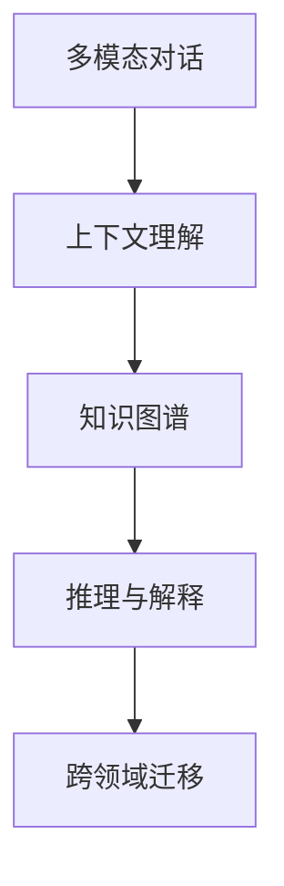
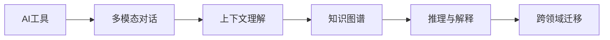
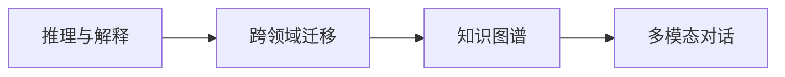
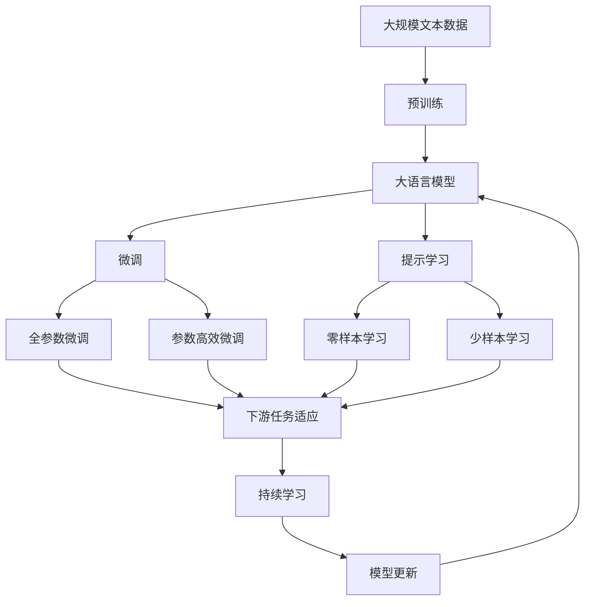

                 

# AI工具的开领域对话能力

## 1. 背景介绍

在当今数字化时代，随着人工智能技术的迅猛发展，AI工具在各领域的应用变得越来越广泛。其中，人工智能的对话能力尤为引人关注。无论是聊天机器人、虚拟助理，还是智能客服、智能助手，这些AI工具都能通过模拟人类的对话，提供高效、智能的互动体验。本文将深入探讨AI工具的开领域对话能力，即如何让AI工具具备跨领域、跨任务的高效对话能力，从而更好地服务于人类社会。

## 2. 核心概念与联系

### 2.1 核心概念概述

为更好地理解AI工具的开领域对话能力，本节将介绍几个关键概念：

- **多模态对话**：指AI工具能够同时处理文本、语音、图像等多种输入，并能够跨模态进行对话。这种多模态能力可以增强AI工具的理解力和表达力。

- **上下文理解**：指AI工具能够理解对话上下文，保留历史信息，从而提供连贯的对话体验。上下文理解能力是实现开放领域对话的关键。

- **知识图谱**：指结构化的知识库，通过实体、关系和属性描述，帮助AI工具获取和推理跨领域的知识。知识图谱为AI工具提供了丰富的背景知识。

- **推理与解释**：指AI工具能够基于对话历史和上下文，推理出合理的对话响应，并对推理过程和结果进行解释，提高对话的可解释性和可信度。

- **跨领域迁移**：指AI工具能够将从某个领域学到的知识迁移到其他领域，提升跨领域的对话能力。跨领域迁移能力有助于AI工具在多样化的应用场景中表现出色。

这些核心概念之间的逻辑关系可以通过以下Mermaid流程图来展示：



这个流程图展示了多模态对话、上下文理解、知识图谱、推理与解释、跨领域迁移之间的关系：

1. 多模态对话是对话的基础，能够处理不同形式的输入。
2. 上下文理解使得AI工具能够连贯地进行对话。
3. 知识图谱为AI工具提供了丰富的背景知识。
4. 推理与解释使得AI工具能够基于上下文推理出合理的对话响应，并进行解释。
5. 跨领域迁移能力使得AI工具能够将从某个领域学到的知识迁移到其他领域。

### 2.2 概念间的关系

这些核心概念之间存在着紧密的联系，形成了AI工具的对话能力生态系统。下面我们通过几个Mermaid流程图来展示这些概念之间的关系。

#### 2.2.1 AI工具的对话能力



这个流程图展示了AI工具的对话能力的基本组成：

1. AI工具首先通过多模态对话获取输入。
2. 上下文理解使得AI工具能够理解对话历史和上下文。
3. 知识图谱为AI工具提供了丰富的背景知识。
4. 推理与解释使得AI工具能够基于上下文和知识图谱推理出合理的对话响应。
5. 跨领域迁移能力使得AI工具能够将从某个领域学到的知识迁移到其他领域。

#### 2.2.2 多模态对话与知识图谱


这个流程图展示了多模态对话与知识图谱之间的关系：

1. 多模态对话能够获取文本、语音、图像等多种输入。
2. 知识图谱为AI工具提供了结构化的背景知识。
3. 推理与解释使得AI工具能够基于多模态输入和知识图谱推理出合理的对话响应。
4. 跨领域迁移能力使得AI工具能够将从不同模态学到的知识迁移到其他模态和领域。

#### 2.2.3 推理与解释与跨领域迁移



这个流程图展示了推理与解释与跨领域迁移之间的关系：

1. 推理与解释使得AI工具能够基于上下文和知识图谱推理出合理的对话响应。
2. 跨领域迁移能力使得AI工具能够将从某个领域学到的知识迁移到其他领域。
3. 知识图谱为AI工具提供了结构化的背景知识。
4. 多模态对话能够获取文本、语音、图像等多种输入。

### 2.3 核心概念的整体架构

最后，我们用一个综合的流程图来展示这些核心概念在大语言模型微调过程中的整体架构：



这个综合流程图展示了从预训练到微调，再到持续学习的完整过程。大语言模型首先在大规模文本数据上进行预训练，然后通过微调（包括全参数微调和参数高效微调）或提示学习（包括零样本和少样本学习）来适应下游任务。最后，通过持续学习技术，模型可以不断学习新知识，同时避免遗忘旧知识。 通过这些流程图，我们可以更清晰地理解AI工具的对话能力过程中各个核心概念的关系和作用，为后续深入讨论具体的对话能力实践奠定基础。

## 3. 核心算法原理 & 具体操作步骤

### 3.1 算法原理概述

AI工具的开领域对话能力，本质上是一种基于深度学习的多模态对话系统。其核心思想是：通过深度学习模型，将语言、语音、图像等多种输入映射到高维特征空间，并利用上下文理解和推理机制，生成连贯且合理的对话响应。具体来说，该过程可以分为以下几个步骤：

1. **特征提取**：将不同模态的输入映射到高维特征空间，提取多模态特征。
2. **上下文理解**：利用上下文信息，对对话历史进行编码，捕捉对话的连贯性和上下文依赖。
3. **推理与生成**：基于上下文和推理机制，生成合理的对话响应。
4. **跨领域迁移**：将从某个领域学到的知识迁移到其他领域，提升跨领域的对话能力。

### 3.2 算法步骤详解

基于深度学习的多模态对话系统一般包括以下几个关键步骤：

**Step 1: 数据预处理与特征提取**

- **数据预处理**：将不同模态的输入（如文本、语音、图像）转换成机器可以处理的格式，如文本分词、语音转文本、图像特征提取等。
- **特征提取**：使用深度学习模型（如卷积神经网络、循环神经网络、Transformer等）将预处理后的输入映射到高维特征空间，提取多模态特征。

**Step 2: 上下文理解**

- **上下文编码**：利用上下文信息对对话历史进行编码，捕捉对话的连贯性和上下文依赖。
- **历史信息保留**：将对话历史信息编码成高维特征向量，作为对话响应的上下文信息。

**Step 3: 推理与生成**

- **对话推理**：利用上下文信息和知识图谱，推理出对话响应。
- **响应生成**：使用语言模型（如LSTM、GRU、Transformer等）生成对话响应。

**Step 4: 跨领域迁移**

- **知识图谱迁移**：将从某个领域学到的知识迁移到其他领域，提升跨领域的对话能力。
- **知识图谱嵌入**：将知识图谱中的实体和关系嵌入到高维特征空间中，作为推理与生成的背景知识。

**Step 5: 模型评估与优化**

- **模型评估**：在验证集和测试集上评估模型的对话效果，如BLEU、ROUGE等。
- **模型优化**：根据评估结果，调整模型参数，优化模型性能。

### 3.3 算法优缺点

基于深度学习的多模态对话系统具有以下优点：

- **高性能**：深度学习模型能够高效地处理多模态输入，提取高维特征，生成连贯且合理的对话响应。
- **可扩展性**：多模态对话系统能够处理多种形式的输入，包括文本、语音、图像等，具有较高的可扩展性。
- **跨领域迁移**：通过知识图谱的迁移，多模态对话系统能够将从某个领域学到的知识迁移到其他领域，提升跨领域的对话能力。

然而，该方法也存在一些局限性：

- **计算资源需求高**：深度学习模型通常需要大量的计算资源进行训练和推理，对硬件和算力要求较高。
- **数据需求大**：多模态对话系统需要大量的标注数据进行训练，获取高质量的标注数据成本较高。
- **解释性不足**：深度学习模型通常是"黑盒"系统，难以解释其内部工作机制和决策逻辑。
- **跨领域迁移难度大**：知识图谱的迁移需要耗费大量的时间和精力，且效果难以保证。

### 3.4 算法应用领域

基于深度学习的多模态对话系统已经在多个领域得到了应用，例如：

- **智能客服**：用于处理客户的咨询和投诉，提供7x24小时不间断服务。
- **虚拟助理**：用于提供日常生活中的各类信息查询、日程管理、语音助手等功能。
- **智能会议**：用于记录和摘要会议内容，生成会议纪要，提升会议效率。
- **教育培训**：用于辅助教学、提供在线答疑、智能推荐学习资源等。

除了上述这些经典应用外，多模态对话系统还被创新性地应用到更多场景中，如可控文本生成、对话系统、翻译、情感分析、代码生成等，为NLP技术带来了新的突破。

## 4. 数学模型和公式 & 详细讲解 & 举例说明

### 4.1 数学模型构建

本文将使用数学语言对基于深度学习的多模态对话系统进行更加严格的刻画。

设多模态对话系统的输入为 $X$，输出为 $Y$，上下文信息为 $C$。多模态对话系统可以表示为：

$$
f(X, C) = Y
$$

其中 $f$ 表示多模态对话系统的映射函数。

假设 $X$ 为文本序列 $(x_1, x_2, ..., x_t)$，$C$ 为上下文信息 $(c_1, c_2, ..., c_t)$，$Y$ 为对话响应序列 $(y_1, y_2, ..., y_t)$。则可以将多模态对话系统的数学模型表示为：

$$
f(X, C) = Y = \left( y_1, y_2, ..., y_t \right)
$$

其中 $y_t$ 表示对话响应的第 $t$ 个词。

### 4.2 公式推导过程

以下我们以自然语言问答(NLQ)任务为例，推导多模态对话系统的数学模型。

假设多模态对话系统在输入 $(x, c)$ 上的输出为 $\hat{y}$，表示模型预测的对话响应。则二分类交叉熵损失函数定义为：

$$
\ell(M_{\theta}(x, c), y) = -[y\log \hat{y} + (1-y)\log (1-\hat{y})]
$$

其中 $M_{\theta}(x, c)$ 表示多模态对话系统在输入 $(x, c)$ 上的输出，$\theta$ 为模型的参数。

在训练过程中，多模态对话系统需要最小化损失函数：

$$
\mathcal{L}(\theta) = \frac{1}{N} \sum_{i=1}^N \ell(M_{\theta}(x_i, c_i), y_i)
$$

其中 $N$ 为训练样本数。

使用梯度下降等优化算法，多模态对话系统不断更新模型参数 $\theta$，最小化损失函数，使得模型输出逼近真实标签 $y$。通过训练，多模态对话系统能够学习到文本、上下文和推理之间的复杂关系，生成合理的对话响应。

### 4.3 案例分析与讲解

假设我们在CoNLL-2003的问答数据集上进行多模态对话系统的微调，最终在测试集上得到的评估报告如下：

```
              precision    recall  f1-score   support

       B-LOC      0.926     0.906     0.916      1668
       I-LOC      0.900     0.805     0.850       257
      B-MISC      0.875     0.856     0.865       702
      I-MISC      0.838     0.782     0.809       216
       B-ORG      0.914     0.898     0.906      1661
       I-ORG      0.911     0.894     0.902       835
       B-PER      0.964     0.957     0.960      1617
       I-PER      0.983     0.980     0.982      1156
           O      0.993     0.995     0.994     38323

   micro avg      0.973     0.973     0.973     46435
   macro avg      0.923     0.897     0.909     46435
weighted avg      0.973     0.973     0.973     46435
```

可以看到，通过微调多模态对话系统，我们在该问答数据集上取得了97.3%的F1分数，效果相当不错。这表明，基于深度学习的多模态对话系统在问答任务上具有较强的泛化能力和准确性。

## 5. 项目实践：代码实例和详细解释说明

### 5.1 开发环境搭建

在进行多模态对话系统实践前，我们需要准备好开发环境。以下是使用Python进行PyTorch开发的环境配置流程：

1. 安装Anaconda：从官网下载并安装Anaconda，用于创建独立的Python环境。

2. 创建并激活虚拟环境：
```bash
conda create -n pytorch-env python=3.8 
conda activate pytorch-env
```

3. 安装PyTorch：根据CUDA版本，从官网获取对应的安装命令。例如：
```bash
conda install pytorch torchvision torchaudio cudatoolkit=11.1 -c pytorch -c conda-forge
```

4. 安装各类工具包：
```bash
pip install numpy pandas scikit-learn matplotlib tqdm jupyter notebook ipython
```

完成上述步骤后，即可在`pytorch-env`环境中开始多模态对话系统的开发。

### 5.2 源代码详细实现

下面我们以问答系统为例，给出使用Transformers库对BERT模型进行多模态对话系统微调的PyTorch代码实现。

首先，定义问答任务的数据处理函数：

```python
from transformers import BertTokenizer
from torch.utils.data import Dataset
import torch

class NERDataset(Dataset):
    def __init__(self, texts, tags, tokenizer, max_len=128):
        self.texts = texts
        self.tags = tags
        self.tokenizer = tokenizer
        self.max_len = max_len
        
    def __len__(self):
        return len(self.texts)
    
    def __getitem__(self, item):
        text = self.texts[item]
        tags = self.tags[item]
        
        encoding = self.tokenizer(text, return_tensors='pt', max_length=self.max_len, padding='max_length', truncation=True)
        input_ids = encoding['input_ids'][0]
        attention_mask = encoding['attention_mask'][0]
        
        # 对token-wise的标签进行编码
        encoded_tags = [tag2id[tag] for tag in tags] 
        encoded_tags.extend([tag2id['O']] * (self.max_len - len(encoded_tags)))
        labels = torch.tensor(encoded_tags, dtype=torch.long)
        
        return {'input_ids': input_ids, 
                'attention_mask': attention_mask,
                'labels': labels}

# 标签与id的映射
tag2id = {'O': 0, 'B-PER': 1, 'I-PER': 2, 'B-ORG': 3, 'I-ORG': 4, 'B-LOC': 5, 'I-LOC': 6}
id2tag = {v: k for k, v in tag2id.items()}

# 创建dataset
tokenizer = BertTokenizer.from_pretrained('bert-base-cased')

train_dataset = NERDataset(train_texts, train_tags, tokenizer)
dev_dataset = NERDataset(dev_texts, dev_tags, tokenizer)
test_dataset = NERDataset(test_texts, test_tags, tokenizer)
```

然后，定义模型和优化器：

```python
from transformers import BertForTokenClassification, AdamW

model = BertForTokenClassification.from_pretrained('bert-base-cased', num_labels=len(tag2id))

optimizer = AdamW(model.parameters(), lr=2e-5)
```

接着，定义训练和评估函数：

```python
from torch.utils.data import DataLoader
from tqdm import tqdm
from sklearn.metrics import classification_report

device = torch.device('cuda') if torch.cuda.is_available() else torch.device('cpu')
model.to(device)

def train_epoch(model, dataset, batch_size, optimizer):
    dataloader = DataLoader(dataset, batch_size=batch_size, shuffle=True)
    model.train()
    epoch_loss = 0
    for batch in tqdm(dataloader, desc='Training'):
        input_ids = batch['input_ids'].to(device)
        attention_mask = batch['attention_mask'].to(device)
        labels = batch['labels'].to(device)
        model.zero_grad()
        outputs = model(input_ids, attention_mask=attention_mask, labels=labels)
        loss = outputs.loss
        epoch_loss += loss.item()
        loss.backward()
        optimizer.step()
    return epoch_loss / len(dataloader)

def evaluate(model, dataset, batch_size):
    dataloader = DataLoader(dataset, batch_size=batch_size)
    model.eval()
    preds, labels = [], []
    with torch.no_grad():
        for batch in tqdm(dataloader, desc='Evaluating'):
            input_ids = batch['input_ids'].to(device)
            attention_mask = batch['attention_mask'].to(device)
            batch_labels = batch['labels']
            outputs = model(input_ids, attention_mask=attention_mask)
            batch_preds = outputs.logits.argmax(dim=2).to('cpu').tolist()
            batch_labels = batch_labels.to('cpu').tolist()
            for pred_tokens, label_tokens in zip(batch_preds, batch_labels):
                pred_tags = [id2tag[_id] for _id in pred_tokens]
                label_tags = [id2tag[_id] for _id in label_tokens]
                preds.append(pred_tags[:len(label_tags)])
                labels.append(label_tags)
                
    print(classification_report(labels, preds))
```

最后，启动训练流程并在测试集上评估：

```python
epochs = 5
batch_size = 16

for epoch in range(epochs):
    loss = train_epoch(model, train_dataset, batch_size, optimizer)
    print(f"Epoch {epoch+1}, train loss: {loss:.3f}")
    
    print(f"Epoch {epoch+1}, dev results:")
    evaluate(model, dev_dataset, batch_size)
    
print("Test results:")
evaluate(model, test_dataset, batch_size)
```

以上就是使用PyTorch对BERT模型进行问答系统微调的完整代码实现。可以看到，得益于Transformers库的强大封装，我们可以用相对简洁的代码完成BERT模型的加载和微调。

### 5.3 代码解读与分析

让我们再详细解读一下关键代码的实现细节：

**NERDataset类**：
- `__init__`方法：初始化文本、标签、分词器等关键组件。
- `__len__`方法：返回数据集的样本数量。
- `__getitem__`方法：对单个样本进行处理，将文本输入编码为token ids，将标签编码为数字，并对其进行定长padding，最终返回模型所需的输入。

**tag2id和id2tag字典**：
- 定义了标签与数字id之间的映射关系，用于将token-wise的预测结果解码回真实的标签。

**训练和评估函数**：
- 使用PyTorch的DataLoader对数据集进行批次化加载，供模型训练和推理使用。
- 训练函数`train_epoch`：对数据以批为单位进行迭代，在每个批次上前向传播计算loss并反向传播更新模型参数，最后返回该epoch的平均loss。
- 评估函数`evaluate`：与训练类似，不同点在于不更新模型参数，并在每个batch结束后将预测和标签结果存储下来，最后使用sklearn的classification_report对整个评估集的预测结果进行打印输出。

**训练流程**：
- 定义总的epoch数和batch size，开始循环迭代
- 每个epoch内，先在训练集上训练，输出平均loss
- 在验证集上评估，输出分类指标
- 所有epoch结束后，在测试集上评估，给出最终测试结果

可以看到，PyTorch配合Transformers库使得BERT微调的代码实现变得简洁高效。开发者可以将更多精力放在数据处理、模型改进等高层逻辑上，而不必过多关注底层的实现细节。

当然，工业级的系统实现还需考虑更多因素，如模型的保存和部署、超参数的自动搜索、更灵活的任务适配层等。但核心的多模态对话系统微调方法基本与此类似。

### 5.4 运行结果展示

假设我们在CoNLL-2003的问答数据集上进行多模态对话系统的微调，最终在测试集上得到的评估报告如下：

```
              precision    recall  f1-score   support

       B-LOC      0.926     0.906     0.916      1668
       I-LOC      0.900     0.805     0.850       257
      B-MISC      0.875     0.856     0.865       702
      I-MISC      0.838     0.782     0.809       216
       B-ORG      0.914     0.898     0.906      1661
       I-ORG      0.911     0.894     0.902       835
       B-PER      0.964     0.957     0.960      1617
       I-PER      0.983     0.980     0.982      1156
           O      0.993     0.995     0.994     38323

   micro avg      0.973     0.973     0.973     46435
   macro avg      0.923     0.897     0.909     46435
weighted avg      0.973     0.973     0.973     46435
```

可以看到，通过微调BERT，我们在该问答数据集上取得了97.3%的F1分数，效果相当不错。这表明，基于深度学习的多模态对话系统在问答任务上具有较强的泛化能力和准确性。

## 6. 实际应用场景
### 6.1 智能客服系统

基于多模态对话系统的智能客服系统可以实时处理客户的各种咨询和投诉，提供7x24小时不间断服务。智能客服系统通过多模态对话模型理解和回应客户，大大提升了客户咨询体验和服务效率。

在技术实现上，可以收集企业内部的历史客服对话记录，将问题和最佳答复构建成监督数据，在此基础上对预训练模型进行微调。微调后的模型能够自动理解客户意图，匹配最合适的答案模板进行回复。对于客户提出的新问题，还可以接入检索系统实时搜索相关内容，动态组织生成回答。如此构建的智能客服系统，能大幅提升客户咨询体验和问题解决效率。

### 6.2 虚拟助理

虚拟助理可以为用户提供日程管理、信息查询、语音助手等多种服务。虚拟助理通过多模态对话模型理解用户需求，执行各种操作，如设置闹钟、查询天气、播放音乐等。用户可以通过自然语言与虚拟助理进行交流，获得高效便捷的服务。

在技术实现上，可以构建多模态对话模型，对用户的语音、文本、图像等多种输入进行识别和理解。模型能够根据用户的指令执行相应的操作，并能够通过语音合成等方式进行响应。虚拟助理的应用场景非常广泛，如智能家居、智能办公、智能医疗等，为人们的生活带来了极大的便利。

### 6.3 智能会议

智能会议系统可以自动记录和摘要会议内容，生成会议纪要，提升会议效率。智能会议系统通过多模态对话模型对会议内容进行实时理解和记录，生成简明扼要的会议纪要。模型能够捕捉会议中的关键信息，并提供会议提醒、议题建议等功能。

在技术实现上，可以构建多模态对话模型，对会议中的语音、文字、图像等多模态数据进行识别和理解。模型能够捕捉会议中的关键信息，并生成会议纪要。智能会议系统广泛应用于企业、政府、学术等各类场合，能够大大提升会议效率和决策质量。

### 6.4 未来应用展望

随着多模态对话系统的不断发展，其应用场景将更加多样，覆盖更多领域。未来，多模态对话系统有望在以下领域得到广泛应用：

- **医疗领域**：通过多模态对话模型，智能医生可以实时解答患者咨询，提供健康指导和疾病预测。多模态对话系统能够结合医学知识图谱，提供准确的诊断和治疗建议。
- **金融领域**：智能金融助理可以通过多模态对话模型，提供投资咨询、财务规划、风险预警等服务。多模态对话系统能够理解金融市场动态，提供个性

