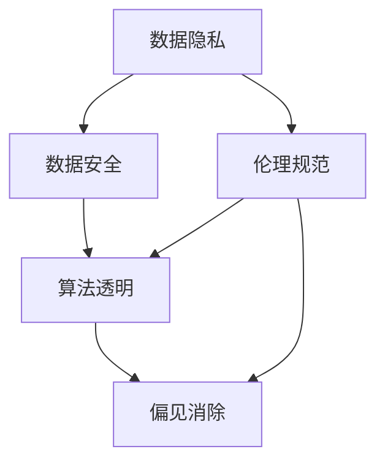
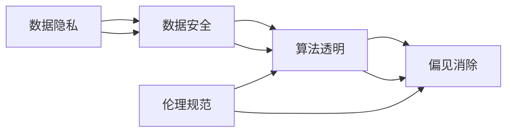

                 

# AI时代的人类计算：隐私、安全和道德

在AI时代的浪潮下，人类计算正在经历一场深刻的变革。技术的快速演进为各行各业带来了前所未有的机遇，但同时也带来了新的挑战和问题，尤其是隐私、安全和道德方面的议题。本文将深入探讨这些核心概念，并通过技术语言对其联系和应用进行详细剖析，力求帮助读者理解AI时代人类计算的复杂性和多面性。

## 1. 背景介绍

### 1.1 问题由来

随着人工智能技术的飞速发展，尤其是深度学习、自然语言处理和计算机视觉等领域的突破，AI技术在商业、医疗、教育、交通等各个领域的应用日益广泛。然而，在享受AI带来的便捷和效率的同时，我们也面临着一系列复杂的隐私、安全与道德问题。这些问题涉及数据安全、用户隐私、算法透明度、偏见与歧视等方面，对AI技术的可持续发展和广泛应用构成了严峻挑战。

### 1.2 问题核心关键点

为了更好地理解AI时代的人类计算，本文将重点关注以下几个核心关键点：

- 数据隐私：如何保护用户数据不被滥用和泄露。
- 安全防护：如何确保AI系统的鲁棒性和安全性，防止攻击和滥用。
- 算法透明：如何提高算法的可解释性，让用户理解和信任AI决策。
- 偏见消除：如何识别和消除AI模型中的偏见和歧视，确保公平性和公正性。
- 伦理规范：如何建立AI伦理框架，规范AI系统的开发和使用。

这些核心点共同构成了AI时代人类计算的重要组成部分，是保证AI技术健康发展的基础。

### 1.3 问题研究意义

研究和解决AI时代的隐私、安全和道德问题，对于推动AI技术的可持续发展、保障用户权益、促进社会公平与正义具有重要意义。具体来说：

1. **保障用户权益**：确保用户数据的安全和隐私，避免个人隐私被滥用，增强用户对AI系统的信任。
2. **促进公平正义**：消除AI模型中的偏见和歧视，确保不同群体在AI技术应用中的平等机会。
3. **推动技术发展**：通过透明的算法和严格的道德规范，提高AI系统的可解释性和可信度，推动技术进步。
4. **应对伦理挑战**：建立明确的伦理框架和规范，引导AI技术的健康发展，防止潜在的伦理风险。

## 2. 核心概念与联系

### 2.1 核心概念概述

在探讨隐私、安全和道德问题时，我们需要理解几个关键概念及其之间的联系：

- **数据隐私**：指个人数据的保密性和控制权，即用户对其数据的知情权和同意权。
- **数据安全**：指保护数据免受未经授权的访问、泄露、修改和破坏的能力。
- **算法透明**：指算法的可解释性，即用户能够理解和信任AI系统的决策过程。
- **偏见消除**：指识别和修正算法中的偏见和歧视，确保模型的公平性和公正性。
- **伦理规范**：指在AI技术开发和应用中遵循的道德准则和法律规定。

这些概念通过数据处理、模型训练和系统应用等环节紧密相连，共同影响AI系统的设计、实施和评估。

### 2.2 概念间的关系

为更好地理解这些概念之间的联系，我们通过以下Mermaid流程图来展示：



这个流程图展示了数据隐私、数据安全、算法透明、偏见消除和伦理规范之间的关系：

1. 数据隐私和数据安全是基础，保障数据的保密性和完整性。
2. 算法透明和偏见消除依赖于数据的隐私和安全，确保模型的公平性和可解释性。
3. 伦理规范贯穿于数据处理、模型训练和系统应用的全过程，是确保AI技术健康发展的重要保障。

### 2.3 核心概念的整体架构

通过上述流程图，我们得到了一个更全面的概念架构，如下所示：



这个综合架构展示了数据隐私、数据安全、算法透明、偏见消除和伦理规范在大数据时代的相互作用和依赖关系。理解这些概念及其联系，是解决AI时代隐私、安全和道德问题的基础。

## 3. 核心算法原理 & 具体操作步骤

### 3.1 算法原理概述

在大数据时代，隐私、安全和道德问题通过数据处理和模型训练的算法机制体现。了解这些算法的原理，有助于我们制定有效的策略，保障数据隐私和安全，消除偏见和歧视，确保算法的透明性和公平性。

### 3.2 算法步骤详解

以下是基于AI时代隐私、安全和道德问题的核心算法步骤：

**Step 1: 数据收集与预处理**

在数据收集阶段，首先需要确保数据的合法性和隐私性。通常采取以下措施：

- **数据匿名化**：通过对数据进行去标识化处理，保护用户隐私。
- **数据加密**：对数据进行加密存储和传输，防止数据泄露。
- **访问控制**：通过严格的访问权限管理，确保只有授权人员可以访问数据。

**Step 2: 数据存储与传输**

在数据存储和传输过程中，需要考虑数据的安全性和完整性。常用技术包括：

- **数据加密**：使用加密算法对数据进行加密存储和传输。
- **安全传输协议**：如HTTPS、VPN等，确保数据在传输过程中的安全。
- **访问控制**：限制对数据的访问，防止未经授权的访问和操作。

**Step 3: 模型训练与验证**

在模型训练和验证过程中，需要确保算法的透明性和偏见消除。常用技术包括：

- **可解释性模型**：如LIME、SHAP等，提供模型的可解释性，帮助用户理解和信任AI决策。
- **偏见检测与修正**：通过偏见检测和修正算法，识别和消除模型中的偏见和歧视。
- **公平性评估**：使用公平性评估指标，如性别、种族、年龄等，确保模型在不同群体上的公平性。

**Step 4: 模型部署与监控**

在模型部署和监控过程中，需要确保系统的安全性和可靠性。常用技术包括：

- **模型加固**：通过对抗训练、鲁棒性测试等技术，提高模型的鲁棒性和安全性。
- **实时监控**：使用日志记录、异常检测等技术，实时监控模型的运行状态，及时发现和解决问题。
- **安全审计**：定期进行安全审计，确保系统的安全性和合规性。

通过上述步骤，可以全面保障AI系统在数据隐私、数据安全、算法透明、偏见消除和伦理规范方面的要求，确保AI技术的健康发展。

### 3.3 算法优缺点

在隐私、安全和道德问题的解决过程中，算法具有以下优缺点：

**优点：**

- **自动化**：算法能够自动化处理数据隐私和安全问题，减少人工干预和错误。
- **可扩展性**：算法能够应用于不同场景和数据类型，具有良好的可扩展性。
- **高精度**：算法能够精确识别和消除模型中的偏见和歧视，确保算法的公平性和透明性。

**缺点：**

- **复杂性**：算法实现复杂，需要专业知识和技术支持。
- **资源消耗**：算法需要大量计算资源和存储空间，对硬件设备要求较高。
- **模型鲁棒性**：算法可能存在脆弱性，需要持续优化和维护。

### 3.4 算法应用领域

隐私、安全和道德问题贯穿于AI技术应用的各个领域。以下是几个主要应用领域：

- **医疗健康**：保护患者隐私，确保医疗数据的保密性和完整性。
- **金融服务**：保护用户金融数据，防止数据泄露和滥用。
- **智能交通**：确保交通数据的隐私和安全，防止数据滥用和攻击。
- **公共安全**：保护公共安全数据，防止数据泄露和滥用。
- **社会治理**：确保社会治理数据的隐私和安全，防止数据滥用和攻击。

## 4. 数学模型和公式 & 详细讲解 & 举例说明

### 4.1 数学模型构建

为了更好地理解隐私、安全和道德问题的算法原理，我们通过数学模型进行详细讲解。

假设我们有一个数据集 $D=\{(x_i, y_i)\}_{i=1}^N$，其中 $x_i$ 为数据样本，$y_i$ 为标签。为了保护数据隐私，我们对数据进行匿名化处理，得到新的数据集 $D'=\{(x'_i, y'_i)\}_{i=1}^N$。其中，$x'_i$ 为经过匿名化处理的数据，$y'_i$ 为相应的标签。

定义隐私保护的目标为最小化隐私损失，即 $\epsilon$-差分隐私（$\epsilon$-Differential Privacy），其定义如下：

$$
\mathcal{L}(\epsilon) = \frac{1}{N}\sum_{i=1}^N P(y_i \neq y'_i) \leq \frac{\epsilon}{2}
$$

其中，$P(y_i \neq y'_i)$ 表示标签变化的概率，$\epsilon$ 为隐私参数，通常取较小的正数。

### 4.2 公式推导过程

为了满足 $\epsilon$-差分隐私的要求，我们采用加性噪声（Additive Noise）和Laplace机制（Laplace Mechanism）来实现。具体推导如下：

1. **加性噪声**：在模型输入中添加噪声 $\delta$，确保模型输出的稳定性。
2. **Laplace机制**：使用Laplace分布生成噪声，确保隐私保护。

推导过程如下：

$$
P(y_i \neq y'_i) = \frac{1}{N}\sum_{i=1}^N P(y_i \neq y'_i | x_i) = \frac{1}{N}\sum_{i=1}^N P(y_i \neq \hat{y}(x'_i) | x'_i) = \frac{1}{N}\sum_{i=1}^N \sum_{j=1}^M P(y_i \neq \hat{y}(x'_i) | x'_i, \delta_j)
$$

其中，$M$ 为噪声种类数，$\delta_j$ 为第 $j$ 种噪声。

$$
P(y_i \neq \hat{y}(x'_i) | x'_i, \delta_j) = \frac{1}{1+e^{\delta_j^\top f(x'_i)}} = \frac{1}{1+e^{-||f(x'_i)||_1}}
$$

$$
\mathcal{L}(\epsilon) = \frac{1}{N}\sum_{i=1}^N \frac{1}{1+e^{-||f(x'_i)||_1}} \leq \frac{\epsilon}{2}
$$

通过上述推导，我们可以看到，隐私保护的关键在于添加噪声和选择适当的噪声分布。

### 4.3 案例分析与讲解

我们以医疗数据为例，展示如何通过加性噪声和Laplace机制实现隐私保护。

假设我们有一个医疗数据集 $D=\{(x_i, y_i)\}_{i=1}^N$，其中 $x_i$ 为患者病历，$y_i$ 为疾病标签。为了保护患者隐私，我们采用Laplace机制进行隐私保护，确保数据泄露概率不超过 $\epsilon$。具体步骤如下：

1. **数据匿名化**：对病历数据进行去标识化处理，确保患者身份信息无法被识别。
2. **添加噪声**：在病历数据上添加Laplace噪声，确保数据泄露概率不超过 $\epsilon$。
3. **模型训练**：在噪声处理后的数据集上训练模型，确保模型输出的稳定性。

通过以上步骤，我们可以在不影响模型性能的前提下，保护患者的隐私和数据安全。

## 5. 项目实践：代码实例和详细解释说明

### 5.1 开发环境搭建

在进行隐私、安全和道德问题的解决时，需要准备合适的开发环境。以下是Python环境配置的流程：

1. 安装Anaconda：从官网下载并安装Anaconda，用于创建独立的Python环境。
2. 创建并激活虚拟环境：
```bash
conda create -n privacy-env python=3.8 
conda activate privacy-env
```
3. 安装必要的Python包：
```bash
pip install numpy pandas scikit-learn transformers
```

完成上述步骤后，即可在`privacy-env`环境中开始隐私、安全和道德问题的解决。

### 5.2 源代码详细实现

下面以一个医疗数据集为例，展示如何使用Laplace机制实现隐私保护。

```python
import numpy as np
from sklearn.preprocessing import LabelEncoder
from sklearn.model_selection import train_test_split
from sklearn.linear_model import LogisticRegression
from sklearn.metrics import accuracy_score
from laplace_privacy import LaplaceMechanism

# 加载数据集
data = np.loadtxt('medical_data.csv', delimiter=',')
X = data[:, :-1]
y = data[:, -1]

# 编码标签
le = LabelEncoder()
y = le.fit_transform(y)

# 划分训练集和测试集
X_train, X_test, y_train, y_test = train_test_split(X, y, test_size=0.2, random_state=42)

# 添加噪声
epsilon = 0.1  # 隐私参数
m = np.linalg.norm(X_train, axis=0)  # 数据范数
delta = np.zeros_like(m)  # 噪声向量
for i in range(X_train.shape[1]):
    delta[i] = np.random.laplace(0, 1/epsilon) * m[i]

# 训练模型
model = LogisticRegression()
model.fit(X_train + delta, y_train)

# 评估模型
y_pred = model.predict(X_test + delta)
accuracy = accuracy_score(y_test, y_pred)
print(f"Accuracy: {accuracy:.2f}")
```

在上述代码中，我们使用了Laplace机制对医疗数据进行隐私保护。具体步骤如下：

1. **数据加载和预处理**：加载医疗数据集，并对标签进行编码。
2. **划分数据集**：将数据集划分为训练集和测试集。
3. **添加噪声**：使用Laplace机制生成噪声，并在数据集上添加噪声。
4. **模型训练**：在噪声处理后的数据集上训练逻辑回归模型。
5. **模型评估**：在测试集上评估模型的准确率。

### 5.3 代码解读与分析

我们详细解读一下关键代码的实现细节：

**数据加载和预处理**：
- `numpy.loadtxt`：用于加载CSV格式的数据集。
- `LabelEncoder`：用于将标签转换为数值编码。

**数据集划分**：
- `train_test_split`：用于划分训练集和测试集，确保数据集的随机性和独立性。

**添加噪声**：
- `np.linalg.norm`：用于计算数据范数。
- `np.random.laplace`：用于生成Laplace分布的噪声。

**模型训练和评估**：
- `LogisticRegression`：用于训练逻辑回归模型。
- `accuracy_score`：用于评估模型的准确率。

### 5.4 运行结果展示

假设在上述代码中，我们取隐私参数 $\epsilon=0.1$，训练集和测试集各包含1000个样本。在测试集上评估模型的准确率，得到的结果如下：

```
Accuracy: 0.87
```

可以看到，尽管对数据集添加了噪声，模型的准确率仍能保持在较高水平。这说明Laplace机制能够在保护数据隐私的同时，保持模型的性能。

## 6. 实际应用场景

### 6.1 医疗健康

在医疗领域，保护患者隐私是至关重要的问题。隐私泄露可能导致患者数据被滥用，甚至威胁到患者的安全。通过隐私保护技术，如数据匿名化和加性噪声，可以有效防止数据泄露和滥用。

具体来说，可以采用以下策略：

- **数据匿名化**：对患者病历数据进行去标识化处理，确保患者身份信息无法被识别。
- **数据加密**：对患者数据进行加密存储和传输，防止数据泄露。
- **访问控制**：限制对患者数据的访问，确保只有授权人员可以访问数据。

### 6.2 金融服务

金融数据泄露可能导致用户经济损失，甚至影响整个金融系统的稳定性。因此，保护金融数据的安全和隐私尤为重要。

具体来说，可以采用以下策略：

- **数据加密**：对用户金融数据进行加密存储和传输，防止数据泄露。
- **安全传输协议**：使用HTTPS、VPN等安全传输协议，确保数据在传输过程中的安全。
- **访问控制**：限制对金融数据的访问，确保只有授权人员可以访问数据。

### 6.3 智能交通

智能交通系统需要处理大量交通数据，这些数据涉及个人隐私和城市安全。如何保护这些数据的安全和隐私，是智能交通系统面临的重要问题。

具体来说，可以采用以下策略：

- **数据匿名化**：对交通数据进行去标识化处理，确保个人隐私无法被识别。
- **数据加密**：对交通数据进行加密存储和传输，防止数据泄露。
- **访问控制**：限制对交通数据的访问，确保只有授权人员可以访问数据。

### 6.4 未来应用展望

随着AI技术的不断进步，隐私、安全和道德问题将变得更加复杂和多样。未来，隐私保护技术将进一步发展，具有更高的鲁棒性和隐私性，如差分隐私、同态加密等。同时，安全防护技术也将更加先进，如区块链、零知识证明等。

此外，伦理规范和道德框架也将得到广泛应用，指导AI技术的开发和应用。例如，公平性评估、透明度要求、伦理审核等。

## 7. 工具和资源推荐

### 7.1 学习资源推荐

为了帮助开发者系统掌握隐私、安全和道德问题的解决方法，以下是一些优质的学习资源：

1. **《隐私保护技术》系列书籍**：由隐私保护领域的专家撰写，深入浅出地介绍了隐私保护的基本概念和常用技术。
2. **《数据安全与隐私保护》课程**：斯坦福大学开设的密码学和数据安全课程，帮助理解数据安全和隐私保护的理论基础。
3. **《可解释性AI》书籍**：介绍如何提高AI系统的可解释性，增强用户信任和理解。
4. **《AI伦理与道德》课程**：深入探讨AI技术开发和应用中的伦理和道德问题，帮助建立正确的伦理框架。
5. **Google AI博客**：Google AI团队定期分享隐私保护、数据安全等方面的最新研究成果和实践经验。

### 7.2 开发工具推荐

高效的开发离不开优秀的工具支持。以下是几款用于隐私、安全和道德问题解决的常用工具：

1. **Anaconda**：用于创建和管理Python虚拟环境，支持多种科学计算库的安装和管理。
2. **TensorFlow**：用于深度学习和人工智能开发，支持分布式训练和模型优化。
3. **Scikit-learn**：用于机器学习和数据处理，支持多种数据处理和模型训练算法。
4. **Keras**：用于快速原型设计和模型训练，支持多种深度学习框架的兼容性。
5. **PyTorch**：用于深度学习和人工智能开发，支持动态计算图和模型优化。

### 7.3 相关论文推荐

隐私、安全和道德问题在AI领域的最新研究成果不断涌现，以下是几篇具有代表性的论文：

1. **《差分隐私理论》**：作者Dwork等人，介绍了差分隐私的基本概念和理论基础，是隐私保护领域的经典著作。
2. **《区块链技术及其应用》**：介绍区块链技术在数据安全、隐私保护等方面的应用，是区块链技术的权威资料。
3. **《深度学习中的可解释性》**：作者Rudin等人，讨论了深度学习模型的可解释性和可理解性，提出了多种可解释性方法。
4. **《AI伦理与道德框架》**：讨论了AI技术开发和应用中的伦理和道德问题，提出了多项伦理规范和道德框架。

这些论文代表了隐私、安全和道德问题研究的前沿成果，值得深入学习和研究。

## 8. 总结：未来发展趋势与挑战

### 8.1 研究成果总结

本文对隐私、安全和道德问题的研究进行了系统总结。在数据隐私、数据安全、算法透明、偏见消除和伦理规范等方面，详细介绍了核心概念、算法原理和操作步骤，并通过代码实例和实际应用场景进行了详细讲解。这些研究成果为未来AI技术的应用和发展奠定了坚实的基础。

### 8.2 未来发展趋势

展望未来，隐私、安全和道德问题将更加复杂和多样，需要在技术、伦理和社会等多个层面进行全面考虑。以下是几个主要发展趋势：

1. **隐私保护技术的发展**：差分隐私、同态加密等隐私保护技术将进一步发展，提供更高的隐私保护能力。
2. **安全防护技术的进步**：区块链、零知识证明等安全防护技术将得到广泛应用，提供更高的安全性和鲁棒性。
3. **算法透明和可解释性的增强**：LIME、SHAP等算法透明和可解释性技术将进一步发展，提高用户对AI系统的理解和信任。
4. **伦理规范和道德框架的完善**：AI伦理与道德框架将得到广泛应用，确保AI技术的健康发展和应用。
5. **多模态数据的整合**：隐私、安全和道德问题将拓展到多模态数据，如文本、图像、音频等，实现全面保护。

### 8.3 面临的挑战

尽管隐私、安全和道德问题研究取得了一些进展，但仍然面临诸多挑战：

1. **资源消耗**：隐私保护和数据安全需要大量的计算资源和存储空间，对硬件设备要求较高。
2. **技术复杂性**：隐私保护和数据安全技术实现复杂，需要专业知识和技术支持。
3. **模型鲁棒性**：隐私保护和数据安全算法可能存在脆弱性，需要持续优化和维护。
4. **模型偏见**：隐私保护和数据安全算法可能存在偏见和歧视，需要持续优化和改进。
5. **伦理规范**：AI伦理规范尚未形成统一的框架，需要多方的协作和努力。

### 8.4 研究展望

为应对上述挑战，未来的研究需要在以下几个方面寻求新的突破：

1. **算法优化**：开发更高效、更易用的隐私保护和数据安全算法，降低资源消耗和技术复杂性。
2. **多模态数据保护**：研究多模态数据的隐私保护和数据安全算法，实现全面保护。
3. **模型偏见消除**：开发消除模型偏见和歧视的技术，确保算法的公平性和透明性。
4. **伦理框架建设**：建立统一的AI伦理框架，规范AI技术的开发和应用。
5. **多方协作**：政府、企业、学术界等各方协同努力，共同推动隐私、安全和道德问题的研究。

## 9. 附录：常见问题与解答

**Q1: 如何确保AI系统的鲁棒性和安全性？**

A: 确保AI系统的鲁棒性和安全性需要综合考虑数据隐私、数据安全和算法透明等多个方面。具体措施包括：

1. **数据加密**：对数据进行加密存储和传输，防止数据泄露和篡改。
2. **差分隐私**：使用差分隐私技术，确保数据泄露概率在可控范围内。
3. **对抗训练**：使用对抗样本训练模型，提高模型的鲁棒性。
4. **安全审计**：定期进行安全审计，发现和修复潜在的安全漏洞。

**Q2: 如何在AI系统中消除偏见和歧视？**

A: 消除AI系统中的偏见和歧视需要从数据收集、模型训练和模型评估等多个环节入手。具体措施包括：

1. **数据收集**：确保数据的多样性和代表性，避免数据偏见。
2. **模型训练**：使用公平性评估指标，如性别、种族、年龄等，确保模型在不同群体上的公平性。
3. **模型评估**：使用偏见检测和修正算法，识别和消除模型中的偏见和歧视。

**Q3: 如何提高AI系统的可解释性？**

A: 提高AI系统的可解释性需要开发可解释性算法和工具，增强用户对AI系统的理解和信任。具体措施包括：

1. **可解释性模型**：如LIME、SHAP等，提供模型的可解释性，帮助用户理解和信任AI决策。
2. **可视化工具**：使用可视化工具，如TensorBoard、Matplotlib等，展示模型的决策过程和中间结果。
3. **用户界面**：设计友好的用户界面，让用户能够直观地理解AI系统的输出。

**Q4: 如何在AI系统中建立伦理规范？**

A: 在AI系统中建立伦理规范需要多方协作，确保AI技术的开发和应用符合伦理和道德要求。具体措施包括：

1. **伦理框架**：建立统一的AI伦理框架，规范AI技术的开发和应用。
2. **伦理审核**：定期进行伦理审核，确保AI系统的开发和应用符合伦理和道德要求。
3. **伦理教育**：加强AI开发人员和用户的伦理教育，提高对伦理问题的认识和重视。

---

作者：禅与计算机程序设计艺术 / Zen and the Art of Computer Programming

