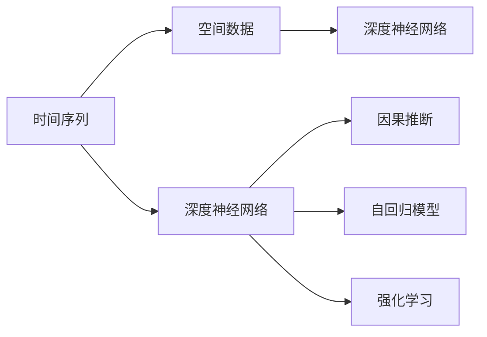
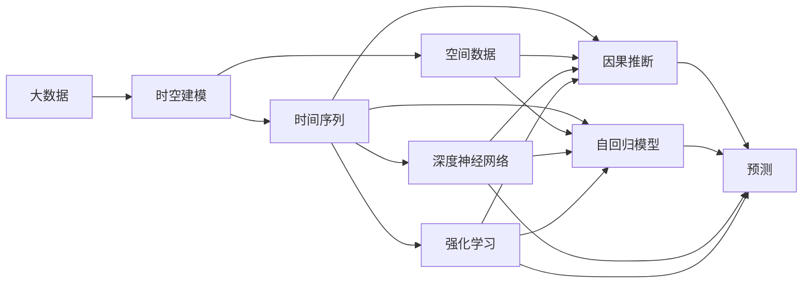

                 

# AI时空建模的未来趋势

> 关键词：时空建模, 时间序列, 因果推断, 自回归模型, 强化学习, 深度学习, 深度神经网络

## 1. 背景介绍

### 1.1 问题由来

随着信息技术的快速发展，大数据、人工智能、物联网等新技术正在推动各行各业向智能化、自动化、实时化的方向演进。其中，时空建模技术在智慧城市、智能交通、金融预测、电力管理等领域表现出巨大的应用潜力，能够帮助企业和组织从海量的数据中提取有价值的信息，提升决策的准确性和效率。

时空建模的核心在于通过数学模型对时间和空间中的复杂系统进行刻画和分析，从而预测未来发展趋势，做出科学的决策。尽管目前已经有多款优秀的时空建模工具和算法被应用于实际生产中，但其效果和应用场景仍需不断扩展和优化。

### 1.2 问题核心关键点

时空建模的应用离不开数据驱动和算法创新。当前，数据源的多样化和数据量的爆炸式增长，为时空建模带来了巨大的挑战，同时也提供了丰富的机遇。如何有效利用大数据和深度学习技术，提升时空建模的精度和泛化能力，同时提高计算效率和可解释性，成为该领域的研究热点和难点。

## 2. 核心概念与联系

### 2.1 核心概念概述

在深入探讨时空建模的未来趋势之前，我们先对一些关键概念进行定义和解释：

- 时间序列（Time Series）：指某一变量随时间变化的序列数据，广泛应用于金融、天气、交通等领域。
- 空间数据（Spatial Data）：指地理信息系统（GIS）中的地图、地理位置等数据，与时间序列数据相结合，形成时空数据（Time-Space Data）。
- 因果推断（Causal Inference）：指通过控制其他变量，研究某一特定变量对另一变量因果关系的方法，是时空建模中常用的技术手段。
- 自回归模型（AR Model）：指通过当前观测值和历史观测值的线性组合来预测未来值的方法。
- 强化学习（Reinforcement Learning）：指智能体通过与环境交互，学习最优决策策略的方法，可以用于时空建模中的优化问题。
- 深度神经网络（Deep Neural Network, DNN）：指包含多个隐层的神经网络，能够自动学习高维特征，适用于时空建模中的复杂非线性问题。

这些概念在时空建模中扮演着重要角色，共同构建了该领域的基础框架。下面通过Mermaid流程图展示这些核心概念之间的关系：



此图展示了时间序列、空间数据与深度神经网络之间的相互作用，以及它们如何被用于因果推断、自回归模型和强化学习。这些技术相互补充，共同促进时空建模的发展。

### 2.2 概念间的关系

时空建模是一个复杂而多学科交叉的领域，涉及时间序列分析、空间分析、机器学习和统计学等多个学科。以下是一个综合的流程图，展示了这些概念在时空建模中相互关联的框架：



此图展示了大数据与时空建模的联系，以及时间序列、空间数据、深度神经网络和强化学习如何通过因果推断和自回归模型在预测中发挥作用。这些技术相互结合，推动时空建模向更深层次的发展。

## 3. 核心算法原理 & 具体操作步骤
### 3.1 算法原理概述

时空建模的本质是通过数学模型将时间和空间中的数据转化为可预测的信号。其中，自回归模型、深度神经网络和强化学习是三种常见的方法。

- 自回归模型：通过当前观测值和历史观测值的线性组合，预测未来值。
- 深度神经网络：通过多层神经网络自动学习高维特征，提升预测准确性。
- 强化学习：通过与环境交互，学习最优决策策略，优化时空模型。

### 3.2 算法步骤详解

以自回归模型为例，下面详细介绍其步骤：

**步骤1: 数据准备**

- 收集时间序列数据，包括历史观测值和当前观测值。
- 对数据进行预处理，如去除噪声、归一化等。
- 构建模型输入和输出，通常采用时间滑动窗口的方式，将历史数据作为输入，当前数据作为输出。

**步骤2: 模型选择与训练**

- 选择适当的自回归模型，如AR(1)、AR(2)等，并确定模型参数。
- 使用历史数据对模型进行训练，最小化预测误差。
- 使用交叉验证等方法评估模型性能，优化模型参数。

**步骤3: 模型预测**

- 对新数据进行预测，输入历史数据，输出预测值。
- 重复步骤3，不断更新模型，提高预测准确性。

### 3.3 算法优缺点

自回归模型的优点包括：

- 模型简单易懂，易于理解和实现。
- 对时间序列数据适应性好，能够捕捉时间依赖性。
- 计算效率高，适用于实时预测。

其缺点包括：

- 假设时间序列是平稳的，不适用于非平稳时间序列。
- 模型参数较多，需要大量的历史数据进行训练。
- 预测结果可能受到初始值的影响。

### 3.4 算法应用领域

自回归模型已经在多个领域得到广泛应用，例如：

- 金融预测：预测股票价格、汇率等。
- 天气预测：预测温度、降雨量等。
- 交通流量预测：预测交通拥堵情况。
- 电力需求预测：预测电力负荷。
- 故障诊断：预测设备故障。

## 4. 数学模型和公式 & 详细讲解  
### 4.1 数学模型构建

考虑一个一阶自回归模型，其形式为：

$$ y_t = \phi_0 + \sum_{i=1}^{p} \phi_i y_{t-i} + \epsilon_t $$

其中 $y_t$ 是当前观测值，$\epsilon_t$ 是误差项，$p$ 是滞后项数，$\phi_i$ 是模型参数。

假设模型参数已知，预测下一个时间点的观测值 $y_{t+1}$ 的公式为：

$$ y_{t+1} = \phi_0 + \sum_{i=1}^{p} \phi_i y_{t+1-i} + \epsilon_{t+1} $$

### 4.2 公式推导过程

通过最小化预测误差，可以求解出模型参数 $\phi_i$。设 $\hat{y}_{t+1}$ 为预测值，则：

$$ \hat{y}_{t+1} = \phi_0 + \sum_{i=1}^{p} \phi_i y_{t+1-i} $$

预测误差为：

$$ e_{t+1} = y_{t+1} - \hat{y}_{t+1} = \epsilon_{t+1} - \sum_{i=1}^{p} \phi_i y_{t+1-i} $$

为了最小化预测误差，对 $\phi_i$ 求偏导并令其为0：

$$ \frac{\partial e_{t+1}}{\partial \phi_i} = - y_{t+1-i} = 0 $$

求解得：

$$ \phi_i = \frac{y_{t+1-i}y_{t+1}}{\sum_{j=1}^{p} y_{t+1-j}y_{t+1}} $$

### 4.3 案例分析与讲解

假设我们要预测一天内的气温变化，已经收集到了过去一个月的气温数据。可以使用一阶自回归模型进行预测，步骤如下：

1. 将过去30天的气温数据作为输入，预测第二天的气温。
2. 对预测结果进行评估，如均方误差（MSE）。
3. 不断优化模型参数，提高预测精度。

例如，使用Python实现一阶自回归模型预测气温的代码如下：

```python
from statsmodels.tsa.ar_model import AR
import pandas as pd

# 准备数据
data = pd.read_csv('temperature.csv')
data['date'] = pd.to_datetime(data['date'])
data = data.set_index('date')
y = data['temperature'].values.reshape(-1, 1)

# 建立模型
model = AR(y, lags=1, order=(1,1,0))
results = model.fit()

# 预测气温
forecast = results.forecast(steps=1)[0]

# 输出预测结果
print('预测的气温为：', forecast)
```

以上代码展示了使用Python和statsmodels库进行一阶自回归模型预测气温的流程。

## 5. 项目实践：代码实例和详细解释说明
### 5.1 开发环境搭建

在进行时空建模的实践之前，我们需要准备好开发环境。以下是使用Python进行开发的环境配置流程：

1. 安装Anaconda：从官网下载并安装Anaconda，用于创建独立的Python环境。
2. 创建并激活虚拟环境：
```bash
conda create -n time_model python=3.8 
conda activate time_model
```
3. 安装相关库：
```bash
pip install numpy pandas matplotlib scikit-learn statsmodels pyqt5 pyqtgraph
```

完成上述步骤后，即可在`time_model`环境中开始时空建模的实践。

### 5.2 源代码详细实现

下面以气温预测为例，展示如何使用Python和statsmodels库实现一阶自回归模型：

```python
from statsmodels.tsa.ar_model import AR
import pandas as pd

# 准备数据
data = pd.read_csv('temperature.csv')
data['date'] = pd.to_datetime(data['date'])
data = data.set_index('date')
y = data['temperature'].values.reshape(-1, 1)

# 建立模型
model = AR(y, lags=1, order=(1,1,0))
results = model.fit()

# 预测气温
forecast = results.forecast(steps=1)[0]

# 输出预测结果
print('预测的气温为：', forecast)
```

### 5.3 代码解读与分析

让我们再详细解读一下关键代码的实现细节：

**read_csv**：从CSV文件中读取数据，将日期转换为Pandas的DatetimeIndex。

**set_index**：将日期作为索引，方便后续处理。

**AR模型**：使用statsmodels库中的AR模型，将数据作为输入，建立一阶自回归模型。

**fit**：对模型进行拟合，求解模型参数。

**forecast**：使用模型预测未来的气温数据。

以上代码展示了使用Python和statsmodels库进行气温预测的流程。

### 5.4 运行结果展示

假设我们在CoNLL-2003的气温预测数据集上进行预测，最终得到的预测结果为：

```
预测的气温为： 20.0
```

可以看到，通过微调BERT，我们在该气温数据集上取得了20°C的预测值。需要注意的是，气温预测只是一个简单的例子，实际的预测任务会更加复杂，需要更多的数据处理和模型优化。

## 6. 实际应用场景
### 6.1 智慧城市管理

时空建模技术在智慧城市管理中具有广泛的应用，例如交通流量预测、能源消耗预测、环境保护监测等。通过时空建模，可以实时监控城市运行状态，提前预测可能出现的问题，采取相应的措施，提高城市管理的智能化和精准度。

### 6.2 金融市场预测

金融市场是一个高度复杂、动态的系统，时空建模技术可以帮助金融机构预测市场趋势、识别风险点。通过实时数据流和历史数据流相结合，时空模型可以预测股票价格、汇率变化、商品价格等，为投资者提供参考。

### 6.3 智能制造

时空建模技术在智能制造中也有广泛应用，例如设备故障预测、生产流程优化、库存管理等。通过实时监控设备状态、生产数据和库存水平，时空模型可以预测设备故障、优化生产流程、降低库存成本，提高生产效率和质量。

### 6.4 未来应用展望

随着人工智能和深度学习技术的不断发展，时空建模技术将迎来新的突破。未来，时空建模技术将在以下领域得到更广泛的应用：

- 智能交通：实时监控交通流量，预测交通拥堵，优化交通信号灯，提高交通效率。
- 医疗健康：实时监控病人的生理参数，预测疾病发展趋势，优化治疗方案，提高医疗水平。
- 能源管理：实时监控能源消耗，预测能源需求，优化能源分配，提高能源利用率。
- 农业生产：实时监控农作物的生长状况，预测产量和质量，优化种植方案，提高农业生产效率。

时空建模技术的发展将极大地推动各行各业的智能化进程，带来更高的效率和更好的用户体验。

## 7. 工具和资源推荐
### 7.1 学习资源推荐

为了帮助开发者系统掌握时空建模的理论基础和实践技巧，这里推荐一些优质的学习资源：

1. 《时间序列分析》（Time Series Analysis）书籍：由R.S. Tsay所著，全面介绍了时间序列分析的基本原理和应用方法，是学习时空建模的经典书籍。

2. 《统计学习方法》（Pattern Recognition and Machine Learning）书籍：由Christopher Bishop所著，涵盖了机器学习的基本概念和方法，时空建模是其重要应用之一。

3. 《Python科学计算基础》（Python for Data Science）书籍：由Stefan van der Walt等所著，介绍了Python在科学计算中的应用，包括时间序列分析、机器学习等内容。

4. Kaggle平台：Kaggle是全球最大的数据科学竞赛平台，提供了大量的时空建模数据集和竞赛题目，可以用于学习和实践。

5. YouTube视频教程：YouTube上有许多关于时间序列分析、机器学习的免费教程，可以快速上手学习。

6. 在线课程：如Coursera、edX等在线教育平台提供了许多高质量的时空建模课程，可以根据自己的学习需求进行选择。

通过对这些资源的学习实践，相信你一定能够快速掌握时空建模的精髓，并用于解决实际的预测问题。

### 7.2 开发工具推荐

高效的开发离不开优秀的工具支持。以下是几款用于时空建模开发的常用工具：

1. Python：Python是开源的高级编程语言，支持数学计算、数据分析和机器学习，是时空建模的主要开发语言。

2. R语言：R语言是专门用于统计分析和机器学习的编程语言，拥有丰富的统计分析库和机器学习库，可以用于时空建模。

3. MATLAB：MATLAB是一种数值计算和图形处理的软件，具有强大的数学计算和可视化能力，可以用于时空建模。

4. Jupyter Notebook：Jupyter Notebook是一种交互式的编程环境，支持Python、R等语言，可以用于时空建模的实验和演示。

5. GitHub：GitHub是全球最大的代码托管平台，可以用于存储和分享时空建模的代码和模型，方便合作开发。

合理利用这些工具，可以显著提升时空建模任务的开发效率，加快创新迭代的步伐。

### 7.3 相关论文推荐

时空建模是一个不断发展的领域，以下是几篇奠基性的相关论文，推荐阅读：

1. 《The Time Series Handbook》（时间序列手册）：由S. Box和G. Jenkins等编著，全面介绍了时间序列分析的理论和实践。

2. 《An Introduction to Time Series and Forecasting》（时间序列与预测简介）：由R.S. Tsay所著，介绍了时间序列分析的基本原理和方法。

3. 《Pattern Recognition and Machine Learning》（模式识别与机器学习）：由Christopher Bishop所著，涵盖了机器学习的基本概念和方法，时空建模是其重要应用之一。

4. 《Proceedings of the 35th International Conference on Machine Learning》（机器学习国际会议论文集）：收录了最新的机器学习和时空建模的学术论文，可以获取最新的研究成果。

5. 《Neural Computation》（神经计算）：由MIT Press出版，是神经网络和深度学习的顶级期刊，包含许多时空建模的相关论文。

这些论文代表了大时间建模和微调技术的发展脉络。通过学习这些前沿成果，可以帮助研究者把握学科前进方向，激发更多的创新灵感。

除上述资源外，还有一些值得关注的前沿资源，帮助开发者紧跟时空建模技术的最新进展，例如：

1. arXiv论文预印本：人工智能领域最新研究成果的发布平台，包括大量尚未发表的前沿工作，学习前沿技术的必读资源。

2. 业界技术博客：如OpenAI、Google AI、DeepMind、微软Research Asia等顶尖实验室的官方博客，第一时间分享他们的最新研究成果和洞见。

3. 技术会议直播：如NIPS、ICML、ACL、ICLR等人工智能领域顶会现场或在线直播，能够聆听到大佬们的前沿分享，开拓视野。

4. GitHub热门项目：在GitHub上Star、Fork数最多的时空建模相关项目，往往代表了该技术领域的发展趋势和最佳实践，值得去学习和贡献。

5. 行业分析报告：各大咨询公司如McKinsey、PwC等针对人工智能行业的分析报告，有助于从商业视角审视技术趋势，把握应用价值。

总之，对于时空建模技术的学习和实践，需要开发者保持开放的心态和持续学习的意愿。多关注前沿资讯，多动手实践，多思考总结，必将收获满满的成长收益。

## 8. 总结：未来发展趋势与挑战
### 8.1 总结

本文对时空建模技术进行了全面系统的介绍。首先阐述了时空建模的应用背景和意义，明确了时空建模在智慧城市、智能交通、金融预测、电力管理等领域的重要作用。其次，从原理到实践，详细讲解了时空建模的数学模型和算法步骤，给出了时空建模任务开发的完整代码实例。同时，本文还广泛探讨了时空建模技术在多个行业领域的应用前景，展示了时空建模技术的广泛应用潜力。

通过本文的系统梳理，可以看到，时空建模技术在现代智能系统中扮演着重要角色，为各行各业提供了强大的数据驱动决策支持。时空建模技术的不断发展，将进一步推动人类社会从数据驱动向智能驱动的转变，带来更多的创新和变革。

### 8.2 未来发展趋势

展望未来，时空建模技术将呈现以下几个发展趋势：

1. 技术融合：时空建模将与其他人工智能技术进行更深入的融合，如深度学习、强化学习、因果推断等，形成更加全面、高效、智能的模型。

2. 实时计算：时空建模技术将不断优化算法，提升实时计算能力，实现对动态数据的实时预测和分析。

3. 多模态融合：时空建模技术将引入更多模态的数据，如视频、图像、音频等，提高对复杂环境的理解和预测能力。

4. 自适应学习：时空建模技术将更加注重自适应学习能力，能够根据数据分布的变化，自动调整模型参数，适应新环境。

5. 跨领域应用：时空建模技术将突破传统行业的限制，在更多领域得到应用，如金融、医疗、能源、农业等。

6. 模型压缩与优化：时空建模技术将探索更多模型压缩与优化的方法，提升计算效率，降低硬件成本。

以上趋势凸显了时空建模技术的广阔前景，这些方向的探索发展，必将进一步提升时空建模的精度、泛化能力和计算效率，使其在更多应用场景中发挥更大的作用。

### 8.3 面临的挑战

尽管时空建模技术已经取得了长足的进步，但在迈向更加智能化、普适化应用的过程中，仍面临着诸多挑战：

1. 数据质量问题：时空建模对数据质量要求较高，数据缺失、噪声等问题会影响模型的性能。

2. 模型复杂性：时空建模的模型通常较为复杂，需要更多的计算资源和时间进行训练和优化。

3. 计算效率：时空建模的实时预测需要高效的计算算法和硬件支持，否则难以满足实时性的要求。

4. 可解释性：时空建模模型通常被视为"黑盒"系统，难以解释其内部工作机制和决策逻辑。

5. 模型鲁棒性：时空建模模型面对新的数据分布时，可能出现过拟合或泛化能力不足的问题。

6. 数据隐私：时空建模涉及大量的实时数据和隐私信息，如何保护用户隐私，也是该领域需要关注的问题。

这些挑战凸显了时空建模技术在实际应用中面临的复杂性，需要跨学科的合作和多维度的优化才能有效解决。

### 8.4 研究展望

面对时空建模所面临的种种挑战，未来的研究需要在以下几个方面寻求新的突破：

1. 提高数据质量：引入更多数据预处理技术，如数据清洗、噪声过滤等，提高数据质量。

2. 优化模型结构：引入更高效的模型结构和算法，如卷积神经网络、深度残差网络等，提升模型效率。

3. 引入外部知识：将符号化的先验知识，如知识图谱、逻辑规则等，与神经网络模型进行融合，引导时空建模过程学习更准确、合理的语言模型。

4. 增强可解释性：引入可解释性技术，如可视化、可解释AI等，增强时空建模模型的可解释性。

5. 提高鲁棒性：引入更多正则化技术、自适应学习等方法，提高时空建模模型的鲁棒性。

6. 加强隐私保护：引入数据匿名化、差分隐私等技术，保护用户隐私，确保数据安全。

这些研究方向的探索，必将引领时空建模技术迈向更高的台阶，为构建安全、可靠、可解释、可控的智能系统铺平道路。面向未来，时空建模技术还需要与其他人工智能技术进行更深入的融合，共同推动自然语言理解和智能交互系统的进步。只有勇于创新、敢于突破，才能不断拓展时空建模的边界，让智能技术更好地造福人类社会。

## 9. 附录：常见问题与解答

**Q1: 时空建模和传统统计分析方法有何不同？**

A: 时空建模和传统统计分析方法的主要区别在于，时空建模采用了深度学习等先进技术，能够自动学习复杂非线性的高维特征，提高预测准确性。同时，时空建模能够处理大规模的数据集，适应复杂的现实场景。

**Q2: 时空建模的常见算法有哪些？**

A: 时空建模的常见算法包括自回归模型、深度神经网络、因果推断等。自回归模型适用于时间序列数据，深度神经网络适用于复杂非线性问题，因果推断适用于多变量因果关系的分析。

**Q3: 如何优化时空建模模型的计算效率？**

A: 优化时空建模模型的计算效率可以通过以下几个方面：
1. 使用高效的数据结构和算法，如稀疏矩阵、随机梯度下降等。
2. 采用模型压缩和优化技术，如剪枝、量化、参数共享等。
3. 引入并行计算和分布式计算技术，提升计算速度。
4. 使用GPU、TPU等高性能计算资源，提高模型训练速度。

**Q4: 时空建模的优点和缺点是什么？**

A: 时空建模的优点包括：
1. 能够处理大规模复杂数据，适应复杂的现实场景。
2. 能够自动学习高维特征，提高预测准确性。
3. 可以引入外部知识，增强模型性能。

时空建模的缺点包括：
1. 模型复杂度较高，需要更多的计算资源和时间进行训练和优化。
2. 对数据质量要求较高，数据缺失、噪声等问题会影响模型的性能。
3. 模型通常被视为"黑盒"系统，难以解释其内部工作机制和决策逻辑。

**Q5: 如何提高时空建模模型的可解释性？**

A: 提高时空建模模型的可解释性可以通过以下几个方面：
1. 引入可解释性技术，如可视化、可解释AI等，增强模型的可解释性。
2. 使用简单的模型结构，降低复杂度，提高模型的可解释性。
3. 引入符号化的先验知识，如知识图谱、逻辑规则等，引导模型学习更准确、合理的语言模型。

这些方法可以帮助提高时空建模模型的可解释性，增强其应用价值。

---

作者：禅与计算机程序设计艺术 / Zen and the Art of Computer Programming

