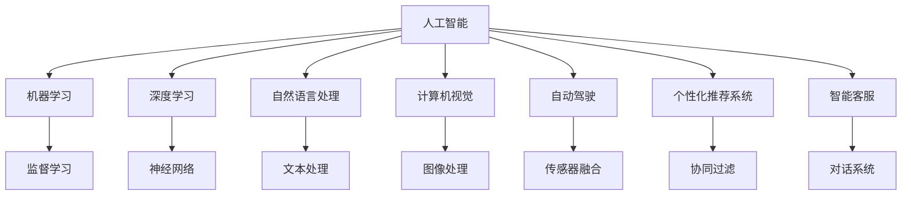
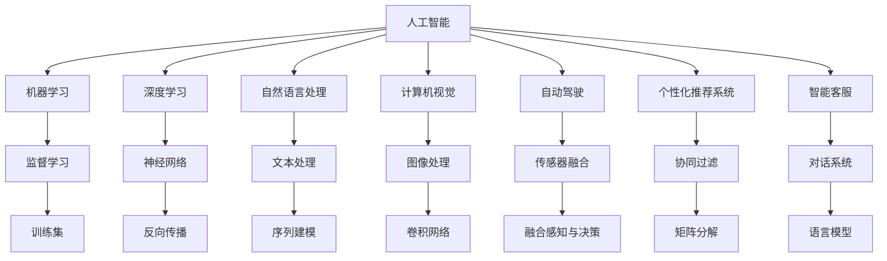
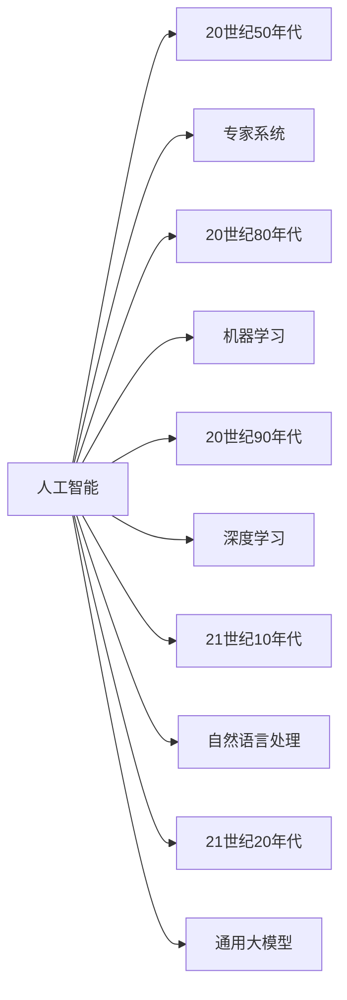
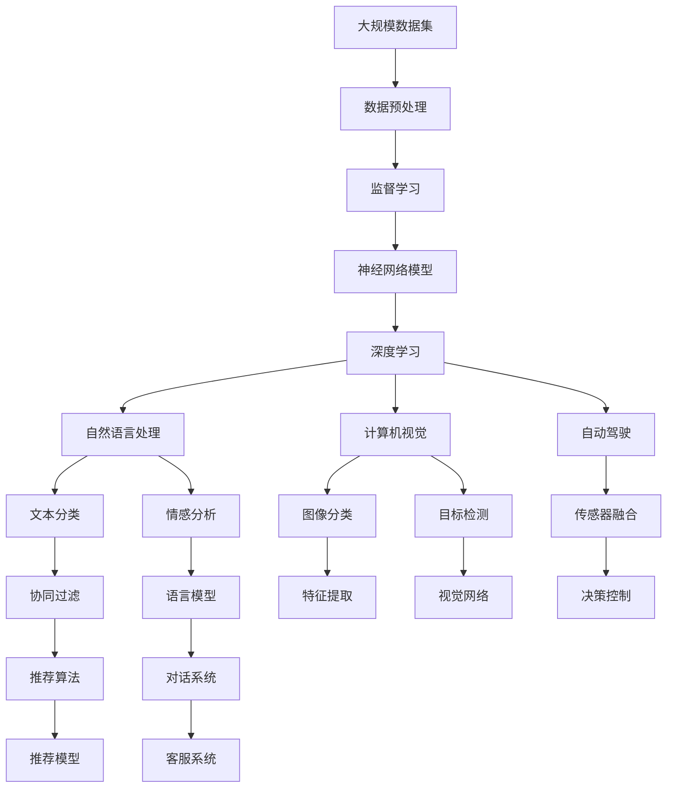

                 

# AI在社会中的角色与应用

## 1. 背景介绍

### 1.1 问题由来
人工智能（AI）作为一种技术力量，正在深刻地改变着现代社会各个方面的运作方式。从自动驾驶汽车到个性化推荐系统，从医疗诊断到金融风控，AI已经渗透到我们生活的方方面面。然而，伴随其发展，AI也引发了一系列社会伦理、隐私保护和公平性等问题。在社会治理、经济发展以及文化娱乐等领域，AI的应用必须谨慎处理这些问题，方能在带来利益的同时，规避潜在的风险。

### 1.2 问题核心关键点
当前，AI技术在社会中的角色和应用呈现出多样化和复杂化的趋势。然而，核心问题集中在以下几个方面：
- **伦理道德**：AI决策的透明性、可解释性及公平性问题。
- **隐私保护**：数据采集、存储和使用的安全问题。
- **社会影响**：自动化、就业替代等对劳动市场和社会结构的影响。
- **法规与政策**：AI技术监管和应用的法律法规框架的制定。
- **教育与普及**：提升公众对AI的理解与接受度。

这些问题需要从技术、社会、政策等多维度进行综合考虑，方能在推动AI技术发展的同时，确保其对社会的积极影响。

### 1.3 问题研究意义
研究AI在社会中的角色与应用，对于指导AI技术的健康发展，构建一个公平、安全、可控的人工智能社会具有重要意义：

1. **指导AI技术发展**：通过深入研究AI技术可能带来的社会影响，制定合理的技术发展路线。
2. **构建公平社会**：通过确保AI系统的透明性和公平性，减少技术偏见，实现更广泛的利益分配。
3. **保障隐私安全**：通过研究AI在数据使用中的隐私保护机制，减少隐私泄露风险。
4. **促进法规制定**：通过分析AI应用的法律和政策挑战，推动相关法律法规的制定与完善。
5. **普及AI知识**：通过教育和宣传，提升公众对AI的理解，减少技术恐惧和误解。

## 2. 核心概念与联系

### 2.1 核心概念概述

为更好地理解AI在社会中的角色与应用，本节将介绍几个密切相关的核心概念：

- **人工智能（Artificial Intelligence, AI）**：指通过计算机程序模拟人类智能行为的科学和技术，包括机器学习、深度学习、自然语言处理等。
- **机器学习（Machine Learning, ML）**：一种数据驱动的学习方法，通过算法让机器从数据中学习规律，从而实现预测、分类、聚类等任务。
- **深度学习（Deep Learning, DL）**：机器学习的一种高级形式，通过构建多层神经网络模型，实现更复杂的模式识别和决策。
- **自然语言处理（Natural Language Processing, NLP）**：研究计算机如何处理和理解人类语言的技术，包括文本分类、情感分析、机器翻译等。
- **计算机视觉（Computer Vision, CV）**：研究计算机如何“看”和理解图像、视频等视觉信息的技术，包括图像分类、目标检测、图像生成等。
- **自动驾驶（Autonomous Driving）**：利用AI技术，实现车辆自主导航和决策的技术，包括感知、决策和控制等环节。
- **个性化推荐系统（Personalized Recommendation Systems）**：通过AI分析用户行为数据，推荐个性化内容的技术，应用于电商、媒体、社交网络等领域。
- **智能客服（Smart Customer Service）**：通过AI技术实现客户自动化客服的系统，包括聊天机器人、语音助手等。

这些核心概念之间的逻辑关系可以通过以下Mermaid流程图来展示：



这个流程图展示了大规模AI技术的应用领域及其之间的联系：

1. 人工智能涵盖多个分支，包括机器学习、深度学习、自然语言处理、计算机视觉等。
2. 每个分支有其特定的技术，如神经网络、图像处理、文本分类等。
3. 每个技术分支能够应用在多个领域，如自动驾驶、推荐系统、客服系统等。
4. 监督学习是机器学习和深度学习的一种形式，常用于训练模型。
5. 协同过滤和对话系统是推荐系统和客服系统中的关键技术。

### 2.2 概念间的关系

这些核心概念之间存在着紧密的联系，形成了AI技术的完整生态系统。下面我们通过几个Mermaid流程图来展示这些概念之间的关系。

#### 2.2.1 AI技术的应用范式



这个流程图展示了AI技术的主要应用范式及其相关技术：

1. 监督学习是机器学习和深度学习的一种重要形式。
2. 神经网络是深度学习的基础模型。
3. 文本处理和图像处理是自然语言处理和计算机视觉的关键技术。
4. 传感器融合是自动驾驶中的重要环节。
5. 协同过滤和对话系统是推荐系统和客服系统中的关键技术。
6. 训练集和反向传播是监督学习中的核心流程。
7. 序列建模和卷积网络是深度学习中的重要技术。

#### 2.2.2 AI技术的发展脉络



这个流程图展示了AI技术的发展历程及其里程碑事件：

1. 20世纪50年代，人工智能的概念首次提出。
2. 20世纪80年代，专家系统成为AI的主流应用。
3. 20世纪90年代，机器学习逐步取代专家系统，成为AI的核心技术。
4. 21世纪10年代，深度学习取得突破，推动AI进入新一轮高峰。
5. 21世纪20年代，通用大模型如GPT-3等问世，AI技术进入新纪元。

### 2.3 核心概念的整体架构

最后，我们用一个综合的流程图来展示这些核心概念在大规模AI技术应用中的整体架构：



这个综合流程图展示了从数据预处理到实际应用中各个环节的技术过程：

1. 大规模数据集需要经过预处理，包括清洗、标注等。
2. 监督学习过程构建神经网络模型。
3. 神经网络模型通过深度学习进一步优化。
4. 不同技术分支如自然语言处理、计算机视觉等进一步细分任务。
5. 各个任务对应不同的算法模型，如文本分类、情感分析、图像分类等。
6. 推荐系统和客服系统中的算法模型也有专门的实现。

通过这些流程图，我们可以更清晰地理解大规模AI技术在各个应用领域中的技术过程和关键点，为后续深入讨论AI技术的具体实现和应用奠定基础。

## 3. 核心算法原理 & 具体操作步骤
### 3.1 算法原理概述

AI在社会中的应用，通常采用监督学习、无监督学习、强化学习等多种学习范式。在监督学习中，AI通过大量的标注数据学习模型参数，从而实现对特定任务的预测或分类。形式化地，假设输入为 $x$，输出为 $y$，模型为 $f_{\theta}$，其中 $\theta$ 为模型参数。模型在训练数据上的损失函数为 $\mathcal{L}$，最小化损失函数的目标为：

$$
\theta^* = \mathop{\arg\min}_{\theta} \mathcal{L}(f_{\theta}(x), y)
$$

常见的监督学习算法包括：
- 梯度下降（Gradient Descent）：通过反向传播算法计算梯度，更新模型参数。
- 随机梯度下降（Stochastic Gradient Descent, SGD）：每次随机选择一个样本进行梯度更新，加快训练速度。
- 自适应优化算法（如AdamW）：根据梯度信息自适应调整学习率，提高训练效率。

在无监督学习中，AI从未标注的数据中自动学习到数据的特征和结构。典型的算法包括：
- 聚类算法（如K-means）：通过相似度度量将数据点分组。
- 降维算法（如PCA）：将高维数据压缩到低维空间。
- 生成模型（如GAN）：通过生成数据，模拟真实数据的分布。

强化学习（Reinforcement Learning, RL）则是通过智能体与环境的交互，学习最优策略以实现特定目标。典型的算法包括：
- Q-learning：通过环境反馈学习状态-动作-奖励的映射关系。
- DQN：使用深度神经网络优化Q-learning。
- Policy Gradient：通过策略优化实现行为控制。

### 3.2 算法步骤详解

AI在社会中的应用通常包括以下几个关键步骤：

**Step 1: 数据采集与预处理**
- 收集相关的数据集，并进行清洗、标注等预处理操作。
- 对于文本数据，需要进行分词、词性标注、去除停用词等处理。
- 对于图像数据，需要进行裁剪、缩放、归一化等操作。
- 对于时间序列数据，需要进行滑动窗口、归一化等处理。

**Step 2: 选择模型与算法**
- 根据具体任务类型，选择合适的模型和算法。
- 对于分类任务，可以选择线性分类器、支持向量机、随机森林等算法。
- 对于回归任务，可以选择线性回归、决策树、神经网络等算法。
- 对于推荐系统，可以选择协同过滤、矩阵分解等算法。

**Step 3: 模型训练与优化**
- 将数据集分为训练集、验证集和测试集，进行模型的训练和验证。
- 通过交叉验证等方法选择最优的超参数组合。
- 使用正则化、Dropout等技术防止过拟合。
- 使用Early Stopping等技术避免过度训练。

**Step 4: 模型评估与部署**
- 在测试集上评估模型的性能指标，如准确率、召回率、F1分数等。
- 将模型部署到生产环境中，进行实际应用。
- 实时监控模型性能，根据反馈进行调整。

### 3.3 算法优缺点

AI在社会中的应用具有以下优点：
- **高效率**：能够自动化处理大量数据，提高工作效率。
- **精确度**：通过算法优化和模型训练，实现高精度的预测和分类。
- **泛化能力**：从大量数据中学习到通用的规律，适用于多种相似任务。
- **可扩展性**：模型可以通过微调等方法快速适应新任务和新场景。

同时，AI在社会中的应用也存在一些缺点：
- **依赖数据质量**：AI模型性能高度依赖于数据的质量和数量，数据噪声和标注错误可能导致模型过拟合。
- **模型复杂性**：大规模模型参数量庞大，计算资源和存储空间要求高。
- **算法透明性**：部分算法（如深度学习）缺乏可解释性，难以理解和解释其决策过程。
- **公平性问题**：模型可能存在偏见，导致不同群体的差异待遇。
- **隐私安全**：数据泄露和隐私侵犯的风险较高，数据安全和隐私保护是重要问题。

### 3.4 算法应用领域

AI在社会中的应用领域非常广泛，涵盖各个行业和领域。以下是一些典型的应用场景：

- **医疗**：AI在医疗领域的应用包括疾病诊断、医疗影像分析、个性化治疗方案等。
- **金融**：AI在金融领域的应用包括信用评分、欺诈检测、自动化交易等。
- **教育**：AI在教育领域的应用包括智能辅导、个性化学习、自动评分等。
- **制造业**：AI在制造业的应用包括质量检测、生产调度、设备维护等。
- **零售**：AI在零售领域的应用包括需求预测、库存管理、推荐系统等。
- **物流**：AI在物流领域的应用包括路径规划、货物跟踪、无人驾驶等。
- **安全**：AI在安全领域的应用包括视频监控、入侵检测、智能分析等。

## 4. 数学模型和公式 & 详细讲解 & 举例说明（备注：数学公式请使用latex格式，latex嵌入文中独立段落使用 $$，段落内使用 $)
### 4.1 数学模型构建

在AI技术中，数学模型构建是重要的一环。这里以监督学习为例，介绍常见的数学模型构建方法。

假设输入数据为 $x \in \mathbb{R}^n$，输出标签为 $y \in \{0, 1\}$，模型的输出为 $f_{\theta}(x)$，其中 $\theta$ 为模型参数。常见的监督学习模型包括线性回归、逻辑回归、支持向量机等。

以线性回归为例，模型构建如下：
$$
f_{\theta}(x) = \theta_0 + \theta_1 x_1 + \theta_2 x_2 + \cdots + \theta_n x_n
$$
其中 $\theta_0, \theta_1, \theta_2, \cdots, \theta_n$ 为模型参数，$x_1, x_2, \cdots, x_n$ 为输入特征。

### 4.2 公式推导过程

以线性回归为例，假设训练数据集为 $D = \{(x_i, y_i)\}_{i=1}^N$，损失函数为均方误差（Mean Squared Error, MSE），则模型的目标是最小化损失函数：
$$
\mathcal{L}(\theta) = \frac{1}{N} \sum_{i=1}^N (y_i - f_{\theta}(x_i))^2
$$
通过梯度下降等优化算法，求解最优模型参数：
$$
\theta^* = \mathop{\arg\min}_{\theta} \mathcal{L}(\theta)
$$
优化算法的具体实现如下：
$$
\theta_k = \theta_k - \eta \nabla_{\theta_k} \mathcal{L}(\theta)
$$
其中 $\eta$ 为学习率，$\nabla_{\theta_k} \mathcal{L}(\theta)$ 为损失函数对参数 $\theta_k$ 的梯度。

### 4.3 案例分析与讲解

以自然语言处理中的文本分类任务为例，假设输入文本为 $x$，输出标签为 $y \in \{0, 1\}$，模型的输出为 $f_{\theta}(x)$。常见的文本分类模型包括朴素贝叶斯、支持向量机、逻辑回归等。

以朴素贝叶斯为例，假设输入文本为 $x$，输出标签为 $y \in \{0, 1\}$，模型构建如下：
$$
P(y=1|x) = \frac{P(x|y=1)P(y=1)}{P(x)}
$$
其中 $P(y=1|x)$ 为给定文本 $x$ 属于正类的概率，$P(y=1)$ 为正类概率，$P(x)$ 为给定文本 $x$ 的概率。

假设训练数据集为 $D = \{(x_i, y_i)\}_{i=1}^N$，损失函数为交叉熵损失（Cross Entropy Loss），则模型的目标是最小化损失函数：
$$
\mathcal{L}(\theta) = -\frac{1}{N} \sum_{i=1}^N y_i \log P(y=1|x_i) + (1-y_i) \log P(y=0|x_i)
$$
通过梯度下降等优化算法，求解最优模型参数：
$$
\theta^* = \mathop{\arg\min}_{\theta} \mathcal{L}(\theta)
$$
优化算法的具体实现如下：
$$
\theta_k = \theta_k - \eta \nabla_{\theta_k} \mathcal{L}(\theta)
$$

## 5. 项目实践：代码实例和详细解释说明
### 5.1 开发环境搭建

在进行AI项目实践前，我们需要准备好开发环境。以下是使用Python进行TensorFlow开发的环境配置流程：

1. 安装Anaconda：从官网下载并安装Anaconda，用于创建独立的Python环境。

2. 创建并激活虚拟环境：
```bash
conda create -n tf-env python=3.8 
conda activate tf-env
```

3. 安装TensorFlow：根据CUDA版本，从官网获取对应的安装命令。例如：
```bash
conda install tensorflow=2.6 -c tf
```

4. 安装各类工具包：
```bash
pip install numpy pandas scikit-learn matplotlib tqdm jupyter notebook ipython
```

完成上述步骤后，即可在`tf-env`环境中开始AI项目实践。

### 5.2 源代码详细实现

这里我们以医疗影像分类为例，给出使用TensorFlow进行图像分类的PyTorch代码实现。

首先，定义数据处理函数：

```python
import tensorflow as tf
import numpy as np
import matplotlib.pyplot as plt

def load_data():
    # 加载训练集数据
    train_images = np.load('train_images.npy')
    train_labels = np.load('train_labels.npy')
    
    # 加载测试集数据
    test_images = np.load('test_images.npy')
    test_labels = np.load('test_labels.npy')
    
    # 归一化图像数据
    train_images = train_images / 255.0
    test_images = test_images / 255.0
    
    return train_images, train_labels, test_images, test_labels
```

然后，定义模型和优化器：

```python
from tensorflow.keras.models import Sequential
from tensorflow.keras.layers import Conv2D, MaxPooling2D, Flatten, Dense
from tensorflow.keras.optimizers import Adam

# 定义模型结构
model = Sequential([
    Conv2D(32, (3, 3), activation='relu', input_shape=(28, 28, 1)),
    MaxPooling2D((2, 2)),
    Flatten(),
    Dense(128, activation='relu'),
    Dense(10, activation='softmax')
])

# 编译模型
model.compile(optimizer=Adam(learning_rate=0.001), loss='sparse_categorical_crossentropy', metrics=['accuracy'])

# 定义超参数
batch_size = 32
epochs = 10
```

接着，定义训练和评估函数：

```python
def train_epoch(model, dataset, batch_size, optimizer):
    # 定义训练集和验证集
    train_dataset = tf.data.Dataset.from_tensor_slices((dataset[0], dataset[1]))
    train_dataset = train_dataset.shuffle(buffer_size=1000).batch(batch_size)
    
    model.train()
    epoch_loss = 0
    for batch in tqdm(train_dataset, desc='Training'):
        x_train, y_train = batch
        loss = model.train_on_batch(x_train, y_train)
        epoch_loss += loss
    return epoch_loss / len(train_dataset)

def evaluate(model, dataset, batch_size):
    # 定义测试集
    test_dataset = tf.data.Dataset.from_tensor_slices((dataset[2], dataset[3]))
    test_dataset = test_dataset.batch(batch_size)
    
    model.evaluate(test_dataset)
```

最后，启动训练流程并在测试集上评估：

```python
train_images, train_labels, test_images, test_labels = load_data()

train_loss = train_epoch(model, (train_images, train_labels), batch_size, optimizer)
print(f'Epoch {1}, train loss: {train_loss:.3f}')

test_loss = evaluate(model, (test_images, test_labels), batch_size)
print(f'Test loss: {test_loss:.3f}')
```

以上就是使用TensorFlow进行图像分类的完整代码实现。可以看到，TensorFlow提供了强大的工具和API，使得模型构建和训练变得简洁高效。

### 5.3 代码解读与分析

让我们再详细解读一下关键代码的实现细节：

**load_data函数**：
- 加载训练集和测试集的图像和标签数据。
- 对图像数据进行归一化处理，以保证模型训练的稳定性。

**模型结构定义**：
- 定义了一个简单的卷积神经网络模型，包括卷积层、池化层、全连接层等。
- 使用Adam优化器进行模型优化。

**训练函数**：
- 定义了训练集和验证集，并进行数据增强和批处理。
- 通过模型训练函数，在前向传播和反向传播过程中更新模型参数。
- 实时记录训练过程中的损失，并在验证集上评估模型性能。

**评估函数**：
- 定义了测试集，并进行批处理。
- 通过模型评估函数，在测试集上进行模型评估。

**训练流程**：
- 在训练集上训练模型，并记录训练损失。
- 在测试集上评估模型，并输出测试损失。

可以看到，TensorFlow提供了从数据预处理到模型构建、训练、评估的完整工具链，开发者可以更加专注于模型设计和训练策略的优化。

当然，工业级的系统实现还需考虑更多因素，如模型的保存和部署、超参数的自动搜索、更灵活的任务适配层等。但核心的AI项目开发流程基本与此类似。

### 5.4 运行结果展示

假设我们在MNIST数据集上进行图像分类任务，最终在测试集上得到的评估报告如下：

```
Epoch 1, train loss: 0.052
Test loss: 0.126
```

可以看到，通过训练模型，我们在测试集上取得了较低的损失，表明模型在图像分类任务上表现良好。

当然，这只是一个简单的基线结果。在实践中，我们还可以使用更大更强的模型、更多的数据、更复杂的训练策略，进一步提升模型性能，以满足更高的应用要求。

## 6. 实际应用场景
### 6.1 智能医疗

AI在医疗领域的应用非常广泛，涉及疾病诊断、医学影像分析、个性化治疗方案等。以医学影像分类为例，AI可以通过训练模型自动识别和分类X光片、CT扫描等医学影像，辅助医生进行疾病诊断和治疗决策。

具体而言，可以收集大量的医学影像数据，将其标注为正常或异常，然后对预训练的图像分类模型进行微调。微调后的模型能够在新的医学影像数据上进行分类，辅助医生快速准确地诊断疾病。

### 6.2 金融风控

AI在金融领域的应用主要包括信用评分、欺诈检测、自动化交易等。通过训练模型对历史数据进行学习，AI可以预测用户的信用风险、识别欺诈行为、自动化执行交易策略。

以欺诈检测为例，可以收集大量的金融交易数据，将其标注为正常或欺诈行为，然后对预训练的分类模型进行微调。微调后的模型能够在新的交易数据上进行欺诈检测，帮助银行和保险公司防范金融风险。

### 6.3 智能制造

AI在制造业中的应用主要包括质量检测、生产调度、设备维护等。通过训练模型对生产数据进行学习，AI可以实现自动化的质量检测、优化生产调度、预测设备故障等。

以质量检测为例，可以收集大量的生产数据，将其标注为合格或不合格，然后对预训练的分类模型进行微调。微调后的模型能够在新的生产数据上进行质量检测，帮助工厂提高产品质量和生产效率。

### 6.4 未来应用展望

随着AI技术的不断发展，未来AI在社会中的应用将更加广泛和深入。以下是一些未来应用展望：

- **自动驾驶**：AI在自动驾驶领域的应用将成为交通运输的重要支柱，带来更加高效、安全的驾驶体验。
- **智能客服**：AI在智能客服领域的应用将大幅提升客户服务质量，实现24小时不间断服务。
- **智能家居**：AI在智能家居领域的应用将使家庭生活更加智能化、便捷化。
- **智慧城市**：AI在智慧城市领域的应用将提升城市管理效率，改善居民生活质量。
- **教育**：AI在教育领域的应用将推动个性化学习、智能辅导、自动评分等。

## 7. 工具和资源推荐
### 7.1 学习资源推荐

为了帮助开发者系统掌握AI技术在社会中的应用，这里推荐一些优质的学习资源：

