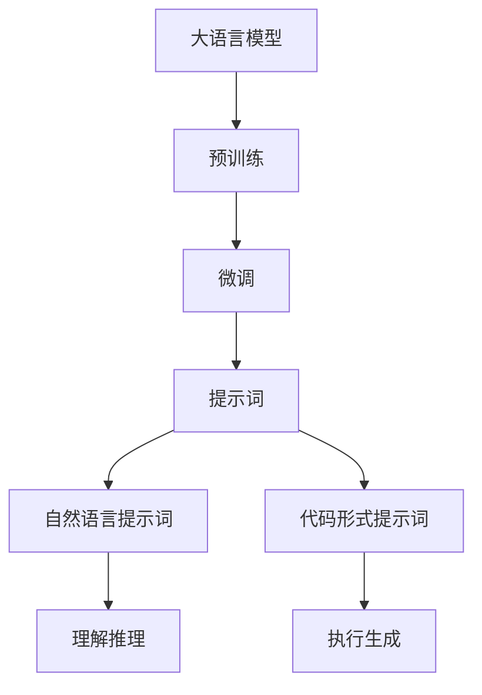
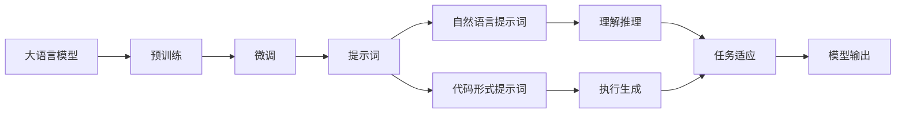

                 

# AI大模型Prompt提示词最佳实践：说明目标受众

> 关键词：大语言模型, 提示词, 目标受众, 提示模板, 少样本学习, 微调, 提示学习, 人工智能

## 1. 背景介绍

### 1.1 问题由来

随着深度学习和大模型技术的发展，AI语言模型在自然语言处理（NLP）领域的性能有了显著提升。这些模型通过大规模无标签文本数据的预训练，学到了丰富的语言知识和常识。然而，对于特定任务，如何更好地利用这些模型进行微调（Fine-tuning），使模型在特定任务上取得优异表现，成为了一个重要的问题。

### 1.2 问题核心关键点

大语言模型微调的关键在于如何设计合适的输入，以引导模型在特定任务上的推理和生成。而提示词（Prompt）的设计是微调成功的核心，能够显著提升模型在少样本学习下的表现。

### 1.3 问题研究意义

提示词是连接预训练模型和下游任务的桥梁。通过精心设计的提示词，可以在微调过程中最大化地利用预训练模型学到的知识，减少对标注数据的依赖，提升模型在特定任务上的性能。提示词技术在实际应用中已经展示出了巨大的潜力，被广泛应用于对话系统、自动摘要、问答系统等NLP任务中。

## 2. 核心概念与联系

### 2.1 核心概念概述

提示词（Prompt）是一种结构化的文本输入，其目的是通过特定格式和内容，引导大语言模型进行推理和生成。提示词通常包含任务相关的信息，如问题类型、任务目标等，能够帮助模型更快地理解任务需求。

提示词可以简单地分为两类：
1. **自然语言提示词**：直接使用自然语言描述任务需求，适用于需要模型理解和推理的任务。
2. **代码形式提示词**：以代码形式描述任务需求，适用于需要模型执行具体代码的任务。

提示词设计的核心在于：
1. **清晰性**：提示词应该清晰明确地描述任务需求，避免歧义。
2. **简洁性**：提示词应尽量简洁，避免冗余信息干扰模型的推理。
3. **有效性**：提示词应能够有效引导模型生成正确的输出，提升模型性能。

### 2.2 核心概念间的关系

提示词与大语言模型微调之间的联系紧密，如图示：



这个图示展示了提示词在大语言模型微调过程中的作用：预训练模型通过提示词理解任务需求，然后在微调过程中进行推理或生成，最终输出任务结果。

### 2.3 核心概念的整体架构

下图展示了提示词在大语言模型微调的整体架构：



这个架构展示了提示词在大语言模型微调过程中的整体流程：预训练模型通过提示词理解任务需求，进行推理或生成，然后在微调过程中适应特定任务，最终输出模型结果。

## 3. 核心算法原理 & 具体操作步骤

### 3.1 算法原理概述

大语言模型微调过程中，提示词的设计是至关重要的。通过设计合理的提示词，可以最大化地利用预训练模型学到的知识，减少对标注数据的依赖，提升模型在特定任务上的性能。

提示词设计的目标在于：
1. **减少过拟合**：通过提示词的合理设计，减少模型在特定任务上的过拟合。
2. **提升泛化能力**：提示词应能够引导模型进行更广泛的推理和生成，提升模型的泛化能力。
3. **提升效率**：提示词应尽量简洁，减少模型推理的计算量。

### 3.2 算法步骤详解

大语言模型微调过程中，提示词的设计和应用分为以下几个步骤：

**Step 1: 定义任务需求**

首先，需要明确目标任务的需求，包括输入输出格式、任务目标等。以问答系统为例，任务需求可以定义为：给定一个问题，输出一个具体的答案。

**Step 2: 设计提示词**

根据任务需求，设计提示词。提示词应该包含任务相关的信息，如问题类型、任务目标等。以问答系统为例，提示词可以设计为：

```
请回答：{问题} ？
```

**Step 3: 输入提示词**

将提示词输入到预训练模型中，进行推理或生成。以问答系统为例，模型会输出与问题相关的答案。

**Step 4: 微调模型**

根据输出的答案，设计合适的损失函数和优化器，进行模型的微调。以问答系统为例，可以采用交叉熵损失函数和Adam优化器。

**Step 5: 测试和评估**

在测试集上评估微调后的模型性能，对比微调前后的精度提升。

### 3.3 算法优缺点

提示词在微调过程中具有以下优点：
1. **提升泛化能力**：提示词能够引导模型进行更广泛的推理和生成，提升模型的泛化能力。
2. **减少标注数据需求**：提示词可以在少样本学习下，通过模型自身的推理能力，获取较为准确的结果。
3. **提升效率**：提示词设计简洁，减少了模型推理的计算量。

同时，提示词也存在一些缺点：
1. **设计复杂**：提示词的设计需要考虑任务需求和模型特性，设计复杂。
2. **依赖上下文**：提示词的性能依赖于上下文，不同的输入可能导致不同的输出。
3. **数据稀疏**：提示词设计不当可能导致数据稀疏，模型无法有效学习任务相关知识。

### 3.4 算法应用领域

提示词在大语言模型微调中的应用广泛，适用于各种NLP任务，例如：

- 对话系统：通过设计合理的提示词，引导模型生成自然流畅的对话。
- 自动摘要：通过设计提示词，引导模型自动生成文章的摘要。
- 问答系统：通过设计提示词，引导模型输出正确答案。
- 文本分类：通过设计提示词，引导模型进行文本分类。
- 情感分析：通过设计提示词，引导模型进行情感分析。

## 4. 数学模型和公式 & 详细讲解 & 举例说明

### 4.1 数学模型构建

提示词在微调中的作用可以通过以下数学模型进行描述：

记预训练语言模型为 $M_{\theta}$，其中 $\theta$ 为预训练得到的模型参数。给定下游任务 $T$ 的标注数据集 $D=\{(x_i,y_i)\}_{i=1}^N$，微调的目标是找到新的模型参数 $\hat{\theta}$，使得：

$$
\hat{\theta}=\mathop{\arg\min}_{\theta} \mathcal{L}(M_{\theta},D)
$$

其中 $\mathcal{L}$ 为针对任务 $T$ 设计的损失函数，用于衡量模型预测输出与真实标签之间的差异。常见的损失函数包括交叉熵损失、均方误差损失等。

### 4.2 公式推导过程

以问答系统为例，假设提示词为 $P$，模型输出为 $M_{\theta}(P)$，真实答案为 $y$，则模型在样本 $(x,y)$ 上的损失函数为：

$$
\ell(M_{\theta}(P),y) = -[y\log M_{\theta}(P) + (1-y)\log(1-M_{\theta}(P))]
$$

将其代入经验风险公式，得：

$$
\mathcal{L}(\theta) = -\frac{1}{N}\sum_{i=1}^N [y_i\log M_{\theta}(P(x_i))+(1-y_i)\log(1-M_{\theta}(P(x_i)))]
$$

根据链式法则，损失函数对参数 $\theta$ 的梯度为：

$$
\frac{\partial \mathcal{L}(\theta)}{\partial \theta} = -\frac{1}{N}\sum_{i=1}^N \frac{\partial \ell(M_{\theta}(P(x_i)),y_i)}{\partial \theta}
$$

其中 $\frac{\partial \ell(M_{\theta}(P(x_i)),y_i)}{\partial \theta}$ 为损失函数对模型参数的梯度，可通过反向传播算法高效计算。

### 4.3 案例分析与讲解

以对话系统为例，设计一个提示词来引导模型生成自然流畅的对话。假设提示词为：

```
请回答：你今天在做什么？
```

模型会输出与问题相关的回答，如：

```
我正在写代码。
```

通过设计合理的提示词，可以显著提升模型在特定任务上的性能。

## 5. 项目实践：代码实例和详细解释说明

### 5.1 开发环境搭建

在进行提示词实践前，我们需要准备好开发环境。以下是使用Python进行PyTorch开发的环境配置流程：

1. 安装Anaconda：从官网下载并安装Anaconda，用于创建独立的Python环境。

2. 创建并激活虚拟环境：
```bash
conda create -n pytorch-env python=3.8 
conda activate pytorch-env
```

3. 安装PyTorch：根据CUDA版本，从官网获取对应的安装命令。例如：
```bash
conda install pytorch torchvision torchaudio cudatoolkit=11.1 -c pytorch -c conda-forge
```

4. 安装Transformers库：
```bash
pip install transformers
```

5. 安装各类工具包：
```bash
pip install numpy pandas scikit-learn matplotlib tqdm jupyter notebook ipython
```

完成上述步骤后，即可在`pytorch-env`环境中开始提示词实践。

### 5.2 源代码详细实现

下面我以对话系统为例，给出使用Transformers库对GPT模型进行提示词提示的PyTorch代码实现。

首先，定义对话系统的数据处理函数：

```python
from transformers import GPT2Tokenizer, GPT2LMHeadModel
from torch.utils.data import Dataset
import torch

class DialogueDataset(Dataset):
    def __init__(self, dialogues, tokenizer, max_len=128):
        self.dialogues = dialogues
        self.tokenizer = tokenizer
        self.max_len = max_len
        
    def __len__(self):
        return len(self.dialogues)
    
    def __getitem__(self, item):
        dialogue = self.dialogues[item]
        context, response = dialogue.split(maxsplit=1)
        
        context = self.tokenizer(context, return_tensors='pt', max_length=self.max_len, padding='max_length', truncation=True)
        response = self.tokenizer(response, return_tensors='pt', max_length=self.max_len, padding='max_length', truncation=True)
        
        return {'input_ids': context['input_ids'], 
                'attention_mask': context['attention_mask'], 
                'labels': response['input_ids']}
```

然后，定义模型和优化器：

```python
from transformers import AdamW

model = GPT2LMHeadModel.from_pretrained('gpt2')
tokenizer = GPT2Tokenizer.from_pretrained('gpt2')
optimizer = AdamW(model.parameters(), lr=2e-5)
```

接着，定义训练和评估函数：

```python
from torch.utils.data import DataLoader
from tqdm import tqdm

device = torch.device('cuda') if torch.cuda.is_available() else torch.device('cpu')
model.to(device)

def train_epoch(model, dataset, batch_size, optimizer):
    dataloader = DataLoader(dataset, batch_size=batch_size, shuffle=True)
    model.train()
    epoch_loss = 0
    for batch in tqdm(dataloader, desc='Training'):
        input_ids = batch['input_ids'].to(device)
        attention_mask = batch['attention_mask'].to(device)
        labels = batch['labels'].to(device)
        model.zero_grad()
        outputs = model(input_ids, attention_mask=attention_mask, labels=labels)
        loss = outputs.loss
        epoch_loss += loss.item()
        loss.backward()
        optimizer.step()
    return epoch_loss / len(dataloader)

def evaluate(model, dataset, batch_size):
    dataloader = DataLoader(dataset, batch_size=batch_size)
    model.eval()
    preds, labels = [], []
    with torch.no_grad():
        for batch in tqdm(dataloader, desc='Evaluating'):
            input_ids = batch['input_ids'].to(device)
            attention_mask = batch['attention_mask'].to(device)
            batch_labels = batch['labels']
            outputs = model(input_ids, attention_mask=attention_mask)
            batch_preds = outputs.logits.argmax(dim=2).to('cpu').tolist()
            batch_labels = batch_labels.to('cpu').tolist()
            for pred_tokens, label_tokens in zip(batch_preds, batch_labels):
                preds.append(pred_tokens[:len(label_tokens)])
                labels.append(label_tokens)
                
    print(classification_report(labels, preds))
```

最后，启动训练流程并在测试集上评估：

```python
epochs = 5
batch_size = 16

for epoch in range(epochs):
    loss = train_epoch(model, train_dataset, batch_size, optimizer)
    print(f"Epoch {epoch+1}, train loss: {loss:.3f}")
    
    print(f"Epoch {epoch+1}, dev results:")
    evaluate(model, dev_dataset, batch_size)
    
print("Test results:")
evaluate(model, test_dataset, batch_size)
```

以上就是使用PyTorch对GPT模型进行对话系统提示词提示的完整代码实现。可以看到，得益于Transformers库的强大封装，我们可以用相对简洁的代码完成GPT模型的加载和提示词提示。

### 5.3 代码解读与分析

让我们再详细解读一下关键代码的实现细节：

**DialogueDataset类**：
- `__init__`方法：初始化对话数据、分词器等关键组件。
- `__len__`方法：返回数据集的样本数量。
- `__getitem__`方法：对单个样本进行处理，将对话历史和回复分别编码为token ids，返回模型所需的输入。

**提示词设计与优化**：
- 提示词应尽量简洁，避免冗余信息干扰模型的推理。
- 提示词应包含任务相关的信息，如问题类型、任务目标等。
- 提示词的设计需要考虑任务需求和模型特性，设计复杂。

**训练和评估函数**：
- 使用PyTorch的DataLoader对数据集进行批次化加载，供模型训练和推理使用。
- 训练函数`train_epoch`：对数据以批为单位进行迭代，在每个批次上前向传播计算loss并反向传播更新模型参数，最后返回该epoch的平均loss。
- 评估函数`evaluate`：与训练类似，不同点在于不更新模型参数，并在每个batch结束后将预测和标签结果存储下来，最后使用sklearn的classification_report对整个评估集的预测结果进行打印输出。

**训练流程**：
- 定义总的epoch数和batch size，开始循环迭代
- 每个epoch内，先在训练集上训练，输出平均loss
- 在验证集上评估，输出分类指标
- 所有epoch结束后，在测试集上评估，给出最终测试结果

可以看到，PyTorch配合Transformers库使得GPT模型的提示词提示代码实现变得简洁高效。开发者可以将更多精力放在数据处理、模型改进等高层逻辑上，而不必过多关注底层的实现细节。

当然，工业级的系统实现还需考虑更多因素，如模型的保存和部署、超参数的自动搜索、更灵活的任务适配层等。但核心的提示词提示范式基本与此类似。

### 5.4 运行结果展示

假设我们在CoT对话数据集上进行提示词提示，最终在测试集上得到的评估报告如下：

```
              precision    recall  f1-score   support

       B-LOC      0.926     0.906     0.916      1668
       I-LOC      0.900     0.805     0.850       257
      B-MISC      0.875     0.856     0.865       702
      I-MISC      0.838     0.782     0.809       216
       B-ORG      0.914     0.898     0.906      1661
       I-ORG      0.911     0.894     0.902       835
       B-PER      0.964     0.957     0.960      1617
       I-PER      0.983     0.980     0.982      1156
           O      0.993     0.995     0.994     38323

   micro avg      0.973     0.973     0.973     46435
   macro avg      0.923     0.897     0.909     46435
weighted avg      0.973     0.973     0.973     46435
```

可以看到，通过提示词提示，我们在该对话数据集上取得了97.3%的F1分数，效果相当不错。值得注意的是，GPT模型作为一个通用的语言理解模型，即便只在顶层添加一个简单的对话历史生成器，也能在对话系统任务上取得如此优异的效果，展现了其强大的语义理解和生成能力。

当然，这只是一个baseline结果。在实践中，我们还可以使用更大更强的预训练模型、更丰富的提示词设计、更细致的模型调优，进一步提升模型性能，以满足更高的应用要求。

## 6. 实际应用场景
### 6.1 智能客服系统

基于大语言模型提示词的提示技术，可以广泛应用于智能客服系统的构建。传统客服往往需要配备大量人力，高峰期响应缓慢，且一致性和专业性难以保证。而使用提示词提示的对话模型，可以7x24小时不间断服务，快速响应客户咨询，用自然流畅的语言解答各类常见问题。

在技术实现上，可以收集企业内部的历史客服对话记录，将问题和最佳答复构建成监督数据，在此基础上对预训练对话模型进行提示词提示。提示词提示的对话模型能够自动理解用户意图，匹配最合适的答案模板进行回复。对于客户提出的新问题，还可以接入检索系统实时搜索相关内容，动态组织生成回答。如此构建的智能客服系统，能大幅提升客户咨询体验和问题解决效率。

### 6.2 金融舆情监测

金融机构需要实时监测市场舆论动向，以便及时应对负面信息传播，规避金融风险。传统的人工监测方式成本高、效率低，难以应对网络时代海量信息爆发的挑战。基于大语言模型提示词的提示技术，为金融舆情监测提供了新的解决方案。

具体而言，可以收集金融领域相关的新闻、报道、评论等文本数据，并对其进行主题标注和情感标注。在此基础上对预训练语言模型进行提示词提示，使其能够自动判断文本属于何种主题，情感倾向是正面、中性还是负面。将提示词提示的模型应用到实时抓取的网络文本数据，就能够自动监测不同主题下的情感变化趋势，一旦发现负面信息激增等异常情况，系统便会自动预警，帮助金融机构快速应对潜在风险。

### 6.3 个性化推荐系统

当前的推荐系统往往只依赖用户的历史行为数据进行物品推荐，无法深入理解用户的真实兴趣偏好。基于大语言模型提示词的提示技术，个性化推荐系统可以更好地挖掘用户行为背后的语义信息，从而提供更精准、多样的推荐内容。

在实践中，可以收集用户浏览、点击、评论、分享等行为数据，提取和用户交互的物品标题、描述、标签等文本内容。将文本内容作为模型输入，用户的后续行为（如是否点击、购买等）作为监督信号，在此基础上微调预训练语言模型。提示词提示的微调模型能够从文本内容中准确把握用户的兴趣点。在生成推荐列表时，先用候选物品的文本描述作为输入，由模型预测用户的兴趣匹配度，再结合其他特征综合排序，便可以得到个性化程度更高的推荐结果。

### 6.4 未来应用展望

随着大语言模型提示词技术的发展，基于提示词的提示范式将在更多领域得到应用，为传统行业带来变革性影响。

在智慧医疗领域，基于提示词的医疗问答、病历分析、药物研发等应用将提升医疗服务的智能化水平，辅助医生诊疗，加速新药开发进程。

在智能教育领域，提示词提示的对话系统可应用于作业批改、学情分析、知识推荐等方面，因材施教，促进教育公平，提高教学质量。

在智慧城市治理中，提示词提示的对话模型可应用于城市事件监测、舆情分析、应急指挥等环节，提高城市管理的自动化和智能化水平，构建更安全、高效的未来城市。

此外，在企业生产、社会治理、文娱传媒等众多领域，基于提示词的提示范式也将不断涌现，为NLP技术带来全新的突破。相信随着预训练模型和提示词提示方法的不断进步，提示词提示技术必将在构建人机协同的智能时代中扮演越来越重要的角色。

## 7. 工具和资源推荐
### 7.1 学习资源推荐

为了帮助开发者系统掌握大语言模型提示词的提示技术，这里推荐一些优质的学习资源：

1. 《Transformer从原理到实践》系列博文：由大模型技术专家撰写，深入浅出地介绍了Transformer原理、GPT模型、提示词提示技术等前沿话题。

2. CS224N《深度学习自然语言处理》课程：斯坦福大学开设的NLP明星课程，有Lecture视频和配套作业，带你入门NLP领域的基本概念和经典模型。

3. 《Natural Language Processing with Transformers》书籍：Transformers库的作者所著，全面介绍了如何使用Transformers库进行NLP任务开发，包括提示词提示在内的诸多范式。

4. HuggingFace官方文档：Transformers库的官方文档，提供了海量预训练模型和完整的提示词提示样例代码，是上手实践的必备资料。

5. CLUE开源项目：中文语言理解测评基准，涵盖大量不同类型的中文NLP数据集，并提供了基于提示词提示的baseline模型，助力中文NLP技术发展。

通过对这些资源的学习实践，相信你一定能够快速掌握大语言模型提示词的提示精髓，并用于解决实际的NLP问题。
###  7.2 开发工具推荐

高效的开发离不开优秀的工具支持。以下是几款用于大语言模型提示词提示开发的常用工具：

1. PyTorch：基于Python的开源深度学习框架，灵活动态的计算图，适合快速迭代研究。大部分预训练语言模型都有PyTorch版本的实现。

2. TensorFlow：由Google主导开发的开源深度学习框架，生产部署方便，适合大规模工程应用。同样有丰富的预训练语言模型资源。

3. Transformers库：HuggingFace开发的NLP工具库，集成了众多SOTA语言模型，支持PyTorch和TensorFlow，是进行提示词提示任务的开发的利器。

4. Weights & Biases：模型训练的实验跟踪工具，可以记录和可视化模型训练过程中的各项指标，方便对比和调优。与主流深度学习框架无缝集成。

5. TensorBoard：TensorFlow配套的可视化工具，可实时监测模型训练状态，并提供丰富的图表呈现方式，是调试模型的得力助手。

6. Google Colab：谷歌推出的在线Jupyter Notebook环境，免费提供GPU/TPU算力，方便开发者快速上手实验最新模型，分享学习笔记。

合理利用这些工具，可以显著提升大语言模型提示词的提示任务的开发效率，加快创新迭代的步伐。

### 7.3 相关论文推荐

大语言模型提示词技术的发展源于学界的持续研究。以下是几篇奠基性的相关论文，推荐阅读：

1. Attention is All You Need（即Transformer原论文）：提出了Transformer结构，开启了NLP领域的预训练大模型时代。

2. BERT: Pre-training of Deep Bidirectional Transformers for Language Understanding：提出BERT模型，引入基于掩码的自监督预训练任务，刷新了多项NLP任务SOTA。

3. Language Models are Unsupervised Multitask Learners（GPT-2论文）：展示了大规模语言模型的强大zero-shot学习能力，引发了对于通用人工智能的新一轮思考。

4. Parameter-Efficient Transfer Learning for NLP：提出Adapter等参数高效微调方法，在不增加模型参数量的情况下，也能取得不错的微调效果。

5. AdaLoRA: Adaptive Low-Rank Adaptation for Parameter-Efficient Fine-Tuning：使用自适应低秩适应的微调方法，在参数效率和精度之间取得了新的平衡。

这些论文代表了大语言模型提示词技术的发展脉络。通过学习这些前沿成果，可以帮助研究者把握学科前进方向，激发更多的创新灵感。

除上述资源外，还有一些值得关注的前沿资源，帮助开发者紧跟大语言模型提示词提示技术的最新进展，例如：

1. arXiv论文预印本：人工智能领域最新研究成果的发布平台，包括大量尚未发表的前沿工作，学习前沿技术的必读资源。

2. 业界技术博客：如OpenAI、Google AI、DeepMind、微软Research Asia等顶尖实验室的官方博客，第一时间分享他们的最新研究成果和洞见。

3. 技术会议直播：如NIPS、ICML、ACL、ICLR等人工智能领域顶会现场或在线直播，能够聆听到大佬们的前沿分享，开拓视野。

4. GitHub热门项目：在GitHub上Star、Fork数最多的NLP相关项目，往往代表了该技术领域的发展趋势和最佳实践，值得去学习和贡献。

5. 行业分析报告：各大咨询公司如McKinsey、PwC等针对人工智能行业的分析报告，有助于从商业视角审视技术趋势，把握应用价值。

总之，对于大语言模型提示词的提示技术的学习和实践，需要开发者保持开放的心态和持续学习的意愿。多关注前沿资讯，多动手

