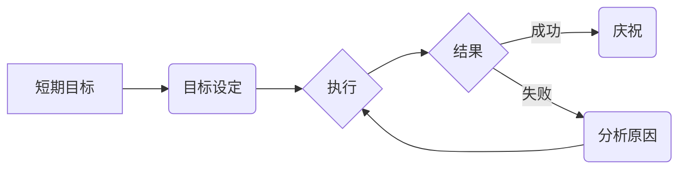

# 短期目标管理的意识策略

> 关键词：短期目标管理，目标设定，意识策略，SMART原则，执行力，时间管理，绩效提升，团队协作

## 1. 背景介绍

在快节奏的现代社会，高效的管理意识和策略对于个人和组织的成功至关重要。短期目标管理作为管理工作中不可或缺的一环，它不仅能够帮助个人和组织明确方向，还能提升执行力和绩效。本文将探讨短期目标管理的意识策略，旨在为读者提供一套实用且有效的方法，以实现个人和组织的短期目标。

### 1.1 问题的由来

在当今这个信息爆炸、竞争激烈的时代，许多人面临着目标设定不明确、执行力不足、时间管理混乱等问题。这些问题往往导致工作效率低下，甚至无法完成既定目标。因此，研究和实践短期目标管理的意识策略显得尤为重要。

### 1.2 研究现状

近年来，关于目标管理的理论和实践研究日益丰富。SMART原则、OKR（Objectives and Key Results）等目标设定方法被广泛应用。然而，如何将这些方法转化为有效的意识策略，并应用于实际工作中，仍然是许多个人和组织面临的挑战。

### 1.3 研究意义

本文旨在通过分析短期目标管理的意识策略，帮助读者：

- 理解短期目标管理的重要性。
- 掌握SMART原则等目标设定方法。
- 提高时间管理和执行力的能力。
- 增强团队协作和绩效提升。

### 1.4 本文结构

本文将分为以下几个部分：

- 第2部分，介绍短期目标管理的核心概念与联系。
- 第3部分，阐述短期目标管理的核心算法原理和具体操作步骤。
- 第4部分，讲解短期目标管理的数学模型和公式。
- 第5部分，通过项目实践展示代码实例和详细解释。
- 第6部分，探讨短期目标管理的实际应用场景。
- 第7部分，展望未来发展趋势和挑战。
- 第8部分，总结研究成果，并提出研究展望。
- 第9部分，提供常见问题与解答。

## 2. 核心概念与联系

### 2.1 核心概念

#### 2.1.1 短期目标

短期目标是指在短期内（通常为1至12个月）可以完成的、具体的、可衡量的目标。

#### 2.1.2 目标设定

目标设定是指通过分析组织或个人的需求和资源，明确目标的过程。

#### 2.1.3 执行力

执行力是指将目标转化为行动并实现目标的能力。

#### 2.1.4 时间管理

时间管理是指合理规划和分配时间，以提高工作效率的过程。

#### 2.1.5 团队协作

团队协作是指团队成员之间相互配合，共同完成任务的过程。

### 2.2 Mermaid 流程图

### 2.3 核心概念联系

短期目标管理是一个系统工程，涉及目标设定、执行、结果评估等多个环节。目标设定是短期目标管理的基础，执行力是关键，时间管理和团队协作则是实现目标的重要保障。

## 3. 核心算法原理 & 具体操作步骤

### 3.1 算法原理概述

短期目标管理的核心算法原理是基于SMART原则进行目标设定，并辅以时间管理和团队协作策略，以提高执行力和绩效。

### 3.2 算法步骤详解

#### 3.2.1 目标设定

1. **明确目标**：确定短期目标的具体内容，确保目标清晰、明确。
2. **具体可行**：确保目标可以量化，并具有可行性。
3. **可衡量**：设置明确的衡量标准，以便评估目标完成情况。
4. **相关性强**：确保目标与个人或组织的战略方向相关。
5. **时限性**：设定明确的完成时间。

#### 3.2.2 时间管理

1. **制定计划**：根据目标制定详细的时间计划，包括关键里程碑和截止日期。
2. **优先级排序**：根据目标的重要性和紧急程度对任务进行排序。
3. **时间分配**：合理分配时间资源，确保关键任务得到充分关注。
4. **监控进度**：定期检查进度，及时调整计划。

#### 3.2.3 团队协作

1. **明确角色**：明确团队成员的角色和职责。
2. **沟通协作**：建立有效的沟通机制，促进团队协作。
3. **资源共享**：共享资源，提高团队效率。
4. **激励鼓励**：激励团队成员，增强团队凝聚力。

### 3.3 算法优缺点

#### 3.3.1 优点

- 提高目标明确性。
- 提升执行力和绩效。
- 促进团队协作。
- 增强时间管理能力。

#### 3.3.2 缺点

- 目标设定可能过于理想化。
- 执行过程中可能遇到意外情况。
- 团队协作可能存在障碍。

### 3.4 算法应用领域

短期目标管理适用于个人、团队和组织等多个层面，例如：

- 个人职业发展。
- 项目管理。
- 企业运营。
- 教育培训。

## 4. 数学模型和公式 & 详细讲解 & 举例说明

### 4.1 数学模型构建

短期目标管理的数学模型可以简化为一个优化问题，即：

$$
\text{maximize} \quad f(x)
$$

其中，$f(x)$ 表示目标完成程度的函数，$x$ 表示影响目标完成程度的因素，如时间、资源、团队协作等。

### 4.2 公式推导过程

由于模型较为简化，此处不进行详细的公式推导。

### 4.3 案例分析与讲解

假设某公司希望在下一个季度实现销售额增长20%。为此，公司可以设定以下目标：

- **目标**：实现季度销售额增长20%。
- **关键结果**：增加新客户数量10%，提高现有客户满意度至90%。
- **时间**：下一个季度。
- **资源**：市场营销预算增加5%。

为了实现这个目标，公司可以采取以下策略：

- 制定市场营销计划，包括线上推广和线下活动。
- 提升客户服务，收集客户反馈，及时改进产品和服务。
- 监控销售数据，确保关键结果达成。

通过SMART原则和数学模型，公司可以明确目标、量化关键结果，并制定相应的策略，从而提高实现目标的可能性。

## 5. 项目实践：代码实例和详细解释说明

### 5.1 开发环境搭建

由于短期目标管理主要涉及管理理念和方法，因此不需要特定的开发环境。

### 5.2 源代码详细实现

由于短期目标管理不需要编程实现，此处不提供代码实例。

### 5.3 代码解读与分析

由于短期目标管理不涉及代码，因此不进行代码解读。

### 5.4 运行结果展示

由于短期目标管理不涉及代码，因此不进行运行结果展示。

## 6. 实际应用场景

### 6.1 个人职业发展

个人可以通过短期目标管理提升自己的职业能力，例如：

- 学习新技能。
- 提升工作效率。
- 拓展人际关系。

### 6.2 项目管理

项目经理可以通过短期目标管理确保项目按时、按质完成，例如：

- 制定项目计划。
- 管理项目进度。
- 协调团队成员。

### 6.3 企业运营

企业可以通过短期目标管理提高运营效率，例如：

- 制定销售目标。
- 提升产品质量。
- 降低生产成本。

### 6.4 未来应用展望

随着人工智能和大数据技术的发展，短期目标管理将更加智能化、个性化。例如：

- 利用机器学习算法预测目标达成概率。
- 根据个人或组织特点推荐合适的短期目标。
- 自动跟踪目标完成情况。

## 7. 工具和资源推荐

### 7.1 学习资源推荐

- 《高效能人士的七个习惯》
- 《如何高效学习》
- 《项目管理知识体系指南》（PMBOK）
- 《敏捷开发实践指南》

### 7.2 开发工具推荐

- Trello
- Asana
- Jira

### 7.3 相关论文推荐

- "Goal Setting as Self-Regulation: Clarifying the Components and Processes" by Locke and Latham
- "The Science of Goal-Setting" by Seijts and Latham

## 8. 总结：未来发展趋势与挑战

### 8.1 研究成果总结

本文通过对短期目标管理的意识策略进行探讨，为读者提供了一套实用且有效的方法。通过SMART原则、时间管理和团队协作，个人和组织可以更好地实现短期目标。

### 8.2 未来发展趋势

- 短期目标管理将更加智能化、个性化。
- 人工智能和大数据技术将被广泛应用于目标管理。
- 短期目标管理将与其他管理理论和方法相结合。

### 8.3 面临的挑战

- 如何在动态变化的环境中设定和调整目标。
- 如何提高团队协作效率。
- 如何应对突发事件对目标达成的影响。

### 8.4 研究展望

未来，短期目标管理的研究将更加注重以下方面：

- 目标设定的科学性和有效性。
- 执行力和绩效提升的策略。
- 团队协作和沟通的优化。

## 9. 附录：常见问题与解答

**Q1：短期目标管理与长期目标管理有何区别？**

A：短期目标管理关注的是短期内可以完成的目标，通常为1至12个月。长期目标管理关注的是长远目标，可能需要数年甚至更长时间才能实现。

**Q2：如何确保短期目标达成？**

A：确保短期目标达成需要以下因素：

- 明确的目标设定。
- 合理的时间管理。
- 高效的团队协作。
- 有效的执行力。

**Q3：短期目标管理在哪些领域应用广泛？**

A：短期目标管理在个人职业发展、项目管理、企业运营等多个领域应用广泛。

**Q4：如何应对突发事件对短期目标达成的影响？**

A：应对突发事件对短期目标达成的影响需要以下策略：

- 及时调整目标。
- 优化资源分配。
- 加强团队沟通。

**Q5：如何评估短期目标的达成情况？**

A：评估短期目标的达成情况可以通过以下方法：

- 数据分析。
- 用户反馈。
- 团队评估。

---

作者：禅与计算机程序设计艺术 / Zen and the Art of Computer Programming