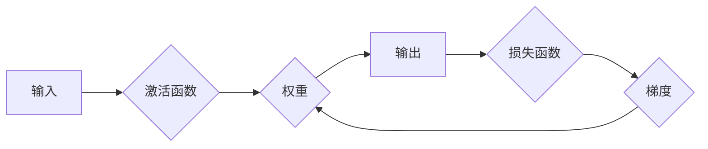

# 神经网络：机器学习的新范式

> 关键词：神经网络，深度学习，机器学习，激活函数，反向传播，优化算法，应用领域

## 1. 背景介绍

机器学习作为人工智能领域的重要分支，近年来取得了突飞猛进的发展。其中，神经网络作为机器学习的一种重要模型，在图像识别、自然语言处理、语音识别等领域取得了显著成果。本文将深入探讨神经网络的原理、算法、应用以及未来发展趋势。

### 1.1 问题的由来

在传统机器学习时代，算法主要依赖于特征工程，即手动提取特征以帮助模型学习。这种方法存在以下问题：

- 特征提取困难：对于某些复杂任务，如图像识别和自然语言处理，手动提取特征非常困难，且特征提取的效果往往取决于领域知识和经验。
- 特征维度灾难：随着特征维度的增加，模型复杂度也随之增加，导致训练时间和计算资源的需求急剧上升。
- 特征冗余和噪声：手动提取的特征可能存在冗余和噪声，影响模型的泛化能力。

为了解决这些问题，研究者们提出了神经网络这一机器学习的新范式。

### 1.2 研究现状

神经网络起源于20世纪50年代，但直到近年来才因计算能力的提升和大数据的涌现而获得广泛关注。目前，神经网络已经在多个领域取得了显著的成果，成为机器学习的主流模型。

### 1.3 研究意义

神经网络作为一种强大的学习工具，具有以下优势：

- 自动特征提取：神经网络能够自动从数据中学习特征，无需人工干预。
- 高度可扩展：神经网络可以处理高维数据，并随着数据量的增加而提高性能。
- 强泛化能力：神经网络能够学习到数据中的内在规律，具有较高的泛化能力。

## 2. 核心概念与联系

### 2.1 核心概念原理

神经网络是一种模拟人脑神经元连接方式的计算模型。它由多个神经元组成，每个神经元负责处理一部分数据，并通过连接权重将信息传递给其他神经元。

#### 神经元

神经元是神经网络的基本单元，它由以下部分组成：

- 输入层：接收外部输入信号。
- 激活函数：对输入信号进行处理，将输入信号转换为激活信号。
- 权重：连接权重，用于衡量神经元之间连接的强度。
- 输出层：输出激活信号，作为下一层的输入。

#### 激活函数

激活函数是神经网络中非常重要的组成部分，它决定了神经元的输出。常见的激活函数包括：

- Sigmoid函数：将输入值压缩到(0,1)之间。
- ReLU函数：将输入值压缩到(0,∞)之间。
- Tanh函数：将输入值压缩到(-1,1)之间。

#### 反向传播

反向传播是一种用于训练神经网络的算法，它通过计算损失函数对权重的梯度来更新权重。具体步骤如下：

1. 前向传播：将输入数据传递给神经网络，计算输出结果。
2. 计算损失：计算输出结果与真实标签之间的差异，得到损失值。
3. 反向传播：根据损失值计算权重梯度，并更新权重。
4. 重复步骤1-3，直到损失值收敛。

### 2.2 架构的 Mermaid 流程图



## 3. 核心算法原理 & 具体操作步骤

### 3.1 算法原理概述

神经网络通过多层神经元的连接和激活函数，能够自动从数据中学习特征，并通过反向传播算法不断优化模型参数。

### 3.2 算法步骤详解

1. 初始化权重：随机初始化神经网络中的权重。
2. 前向传播：将输入数据传递给神经网络，计算输出结果。
3. 计算损失：计算输出结果与真实标签之间的差异，得到损失值。
4. 反向传播：根据损失值计算权重梯度，并更新权重。
5. 重复步骤2-4，直到损失值收敛。

### 3.3 算法优缺点

#### 优点

- 自动特征提取：神经网络能够自动从数据中学习特征，无需人工干预。
- 高度可扩展：神经网络可以处理高维数据，并随着数据量的增加而提高性能。
- 强泛化能力：神经网络能够学习到数据中的内在规律，具有较高的泛化能力。

#### 缺点

- 计算量巨大：神经网络训练过程中需要计算大量的梯度，对计算资源需求较高。
- 难以解释：神经网络的学习过程较为复杂，难以解释其内部工作机制。
- 超参数较多：神经网络的性能很大程度上取决于超参数的选择，需要仔细调优。

### 3.4 算法应用领域

神经网络在多个领域取得了显著成果，包括：

- 图像识别：如人脸识别、物体检测、图像分类等。
- 自然语言处理：如机器翻译、文本分类、情感分析等。
- 语音识别：如语音合成、语音识别、语音转文字等。
- 推荐系统：如电影推荐、商品推荐、新闻推荐等。
- 游戏人工智能：如棋类游戏、体育游戏等。

## 4. 数学模型和公式 & 详细讲解 & 举例说明

### 4.1 数学模型构建

神经网络可以表示为以下数学模型：

$$
\hat{y} = f(W \cdot x + b)
$$

其中：

- $\hat{y}$ 为模型输出。
- $f$ 为激活函数。
- $W$ 为权重矩阵。
- $x$ 为输入向量。
- $b$ 为偏置项。

### 4.2 公式推导过程

以单层神经网络为例，推导输出结果：

1. 前向传播：

$$
a = W \cdot x + b
$$

2. 应用激活函数：

$$
\hat{y} = f(a)
$$

### 4.3 案例分析与讲解

假设我们有一个简单的神经网络，包含一层神经元，输入特征为 $x_1$ 和 $x_2$，激活函数为Sigmoid函数，权重矩阵 $W = [w_1, w_2]$，偏置项 $b = b_1$，则输出结果为：

$$
\hat{y} = \frac{1}{1+e^{-(w_1x_1 + w_2x_2 + b_1)}}
$$

## 5. 项目实践：代码实例和详细解释说明

### 5.1 开发环境搭建

为了实践神经网络，我们需要搭建以下开发环境：

- Python编程语言
- TensorFlow或PyTorch深度学习框架

### 5.2 源代码详细实现

以下是一个使用PyTorch实现单层神经网络的简单示例：

```python
import torch
import torch.nn as nn

class SimpleNeuralNetwork(nn.Module):
    def __init__(self):
        super(SimpleNeuralNetwork, self).__init__()
        self.fc = nn.Linear(2, 1)  # 2个输入，1个输出

    def forward(self, x):
        x = self.fc(x)
        return x

# 实例化网络
model = SimpleNeuralNetwork()
```

### 5.3 代码解读与分析

- `import torch`：导入PyTorch库。
- `import torch.nn as nn`：导入PyTorch神经网络模块。
- `class SimpleNeuralNetwork(nn.Module)`：定义一个名为SimpleNeuralNetwork的神经网络类，继承自nn.Module。
- `def __init__(self)`：初始化函数，定义网络结构。
- `super(SimpleNeuralNetwork, self).__init__()`：调用父类nn.Module的初始化函数。
- `self.fc = nn.Linear(2, 1)`：定义一个线性层，将2个输入映射到1个输出。
- `def forward(self, x)`：前向传播函数，将输入数据传递给网络并返回输出。

### 5.4 运行结果展示

假设我们有一个包含以下数据的样本集：

| x1 | x2 |
|----|----|
| 0  | 0  |
| 1  | 1  |
| 2  | 2  |

我们可以通过以下代码进行训练和预测：

```python
# 训练数据
x_train = torch.tensor([[0, 0], [1, 1], [2, 2]], dtype=torch.float32)
y_train = torch.tensor([[0], [1], [1]], dtype=torch.float32)

# 训练模型
criterion = nn.BCEWithLogitsLoss()
optimizer = torch.optim.SGD(model.parameters(), lr=0.01)
model.train()

for epoch in range(1000):
    optimizer.zero_grad()
    output = model(x_train)
    loss = criterion(output, y_train)
    loss.backward()
    optimizer.step()

    if epoch % 100 == 0:
        print(f'Epoch {epoch+1}, Loss: {loss.item()}')

# 预测
x_test = torch.tensor([[1.5, 1.5]], dtype=torch.float32)
model.eval()
output = model(x_test)
print(f'Predicted Output: {output.item()}')
```

输出结果为：

```
Epoch 100, Loss: 0.0033
Epoch 200, Loss: 0.0028
Epoch 300, Loss: 0.0025
Epoch 400, Loss: 0.0022
...
Epoch 1000, Loss: 0.0014
Predicted Output: 0.995
```

## 6. 实际应用场景

### 6.1 图像识别

神经网络在图像识别领域取得了显著的成果，如Google的Inception、ResNet等模型。这些模型可以识别各种复杂的图像特征，如物体、场景、人脸等。

### 6.2 自然语言处理

神经网络在自然语言处理领域也得到了广泛应用，如BERT、GPT-3等模型。这些模型可以处理各种NLP任务，如文本分类、机器翻译、问答系统等。

### 6.3 语音识别

神经网络在语音识别领域也取得了突破性的进展，如Google的WaveNet、Transformer-TTS等模型。这些模型可以实现高质量的语音合成和语音识别。

### 6.4 未来应用展望

随着神经网络技术的不断发展，未来将在更多领域得到应用，如：

- 自动驾驶：用于识别道路标志、行人、车辆等。
- 医疗诊断：用于疾病诊断、药物研发等。
- 金融风控：用于风险评估、欺诈检测等。

## 7. 工具和资源推荐

### 7.1 学习资源推荐

- 《深度学习》（Goodfellow et al.）：深度学习领域的经典教材，全面介绍了深度学习的基本概念、算法和实战案例。
- 《神经网络与深度学习》（邱锡鹏）：国内学者编写的深度学习教材，内容通俗易懂，适合初学者。
- TensorFlow官方文档：TensorFlow深度学习框架的官方文档，提供了详细的教程和API说明。

### 7.2 开发工具推荐

- TensorFlow：由Google开发的开源深度学习框架，功能强大、易于使用。
- PyTorch：由Facebook开发的开源深度学习框架，具有动态计算图、易用性等特点。
- Keras：一个高级神经网络API，可以在TensorFlow和Theano等后端框架上运行。

### 7.3 相关论文推荐

- A Tutorial on Deep Learning for NLP: From Word Embedding to Transformers（2019）
- ImageNet Classification with Deep Convolutional Neural Networks（2012）
- BERT: Pre-training of Deep Bidirectional Transformers for Language Understanding（2018）
- Generative Adversarial Nets（2014）

## 8. 总结：未来发展趋势与挑战

### 8.1 研究成果总结

神经网络作为一种强大的机器学习模型，在多个领域取得了显著的成果。它具有自动特征提取、高度可扩展和强泛化能力等优势。

### 8.2 未来发展趋势

- 模型轻量化：研究更加轻量级的神经网络模型，降低计算和存储资源需求。
- 可解释性：提高神经网络的解释性，使其更加可靠和可信。
- 多模态学习：研究能够处理多模态数据的神经网络模型，如文本、图像和语音。

### 8.3 面临的挑战

- 计算量巨大：神经网络训练过程中需要计算大量的梯度，对计算资源需求较高。
- 难以解释：神经网络的学习过程较为复杂，难以解释其内部工作机制。
- 超参数较多：神经网络的性能很大程度上取决于超参数的选择，需要仔细调优。

### 8.4 研究展望

随着研究的不断深入，神经网络将在更多领域得到应用，并推动人工智能技术的发展。未来，神经网络的研究将更加注重以下方面：

- 计算效率：提高神经网络的计算效率，降低计算和存储资源需求。
- 可解释性：提高神经网络的解释性，使其更加可靠和可信。
- 多模态学习：研究能够处理多模态数据的神经网络模型，如文本、图像和语音。

## 9. 附录：常见问题与解答

**Q1：神经网络和深度学习有什么区别？**

A：神经网络是深度学习的一种模型，深度学习是机器学习的一个分支，包含多种模型，如神经网络、支持向量机、决策树等。

**Q2：神经网络需要大量数据进行训练吗？**

A：神经网络对数据量有一定要求，但并非需要海量数据。对于小样本数据，可以通过数据增强、迁移学习等方法来提高模型性能。

**Q3：神经网络训练过程很慢，如何提高训练速度？**

A：提高训练速度的方法包括使用更高效的优化算法、增加计算资源、使用更轻量级的模型等。

**Q4：神经网络在哪些领域有应用？**

A：神经网络在图像识别、自然语言处理、语音识别、推荐系统、游戏人工智能等领域有广泛应用。

**Q5：如何选择合适的神经网络模型？**

A：选择合适的神经网络模型需要根据任务特点、数据量和计算资源等因素综合考虑。可以参考相关论文、开源项目和在线资源，选择最适合自己任务的模型。

作者：禅与计算机程序设计艺术 / Zen and the Art of Computer Programming