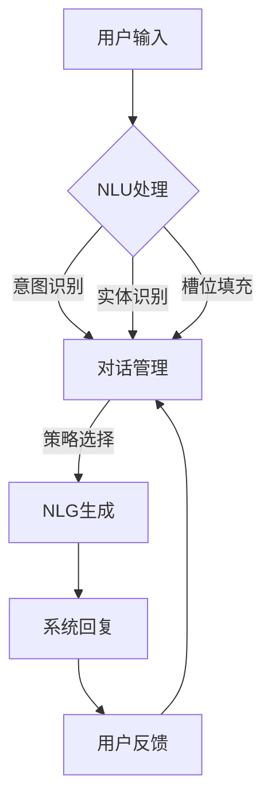

# 自然语言交互与对话系统原理与代码实战案例讲解

> 关键词：自然语言处理(NLP), 对话系统, 语音交互, 智能客服, 聊天机器人, 机器学习, 深度学习, BERT, GPT, NLU, NLG

## 1. 背景介绍

随着自然语言处理（NLP）技术的飞速发展，自然语言交互与对话系统已成为人工智能领域的一个热门研究方向。这些系统旨在让计算机能够理解人类的自然语言，并通过语音或文本进行有效的沟通。对话系统在智能客服、虚拟助手、教育辅导、娱乐互动等多个领域都有着广泛的应用前景。本文将深入探讨自然语言交互与对话系统的原理，并通过实际代码案例展示如何构建一个简单的对话系统。

### 1.1 问题的由来

传统的计算机交互方式主要依赖于命令行界面或图形用户界面（GUI），用户需要按照固定的操作流程进行交互。这种方式在用户体验上存在一定的局限性，难以满足用户对自然、流畅交流的需求。随着NLP技术的进步，计算机逐渐具备了理解自然语言的能力，对话系统应运而生。

### 1.2 研究现状

当前，对话系统的技术架构主要包括以下几个核心模块：

- **自然语言理解（NLU）**：将用户的自然语言输入转换为计算机可以理解的语义表示。
- **对话管理**：根据用户的语义表示和上下文信息，决定系统的响应策略。
- **自然语言生成（NLG）**：根据对话管理和NLU模块的输出，生成自然、流畅的自然语言回复。

### 1.3 研究意义

研究自然语言交互与对话系统具有重要的理论意义和应用价值：

- **提升用户体验**：通过自然语言交互，用户可以更加轻松地与系统进行沟通，提高交互效率。
- **拓展应用场景**：对话系统可以应用于智能客服、虚拟助手、教育辅导、娱乐互动等多个领域，推动人工智能技术的产业化进程。
- **促进技术发展**：对话系统的研发需要融合多种人工智能技术，如NLP、机器学习、深度学习等，推动相关技术的进步。

### 1.4 本文结构

本文将分为以下几个部分：

- **第2章**：介绍自然语言交互与对话系统的核心概念与联系。
- **第3章**：阐述对话系统的核心算法原理和具体操作步骤。
- **第4章**：讲解对话系统中的数学模型和公式。
- **第5章**：通过实际代码案例展示如何构建一个简单的对话系统。
- **第6章**：探讨对话系统的实际应用场景和未来应用展望。
- **第7章**：推荐相关的学习资源、开发工具和参考文献。
- **第8章**：总结研究成果，展望未来发展趋势与挑战。
- **第9章**：附录，常见问题与解答。

## 2. 核心概念与联系

### 2.1 核心概念

#### 2.1.1 自然语言理解（NLU）

NLU是对话系统的第一个核心模块，主要负责将用户的自然语言输入转换为计算机可以理解的语义表示。常见的NLU任务包括：

- **意图识别**：识别用户的输入意图，如查询信息、预约服务等。
- **实体识别**：识别用户输入中的实体，如人名、地名、组织名等。
- **槽位填充**：识别用户输入中实体对应的属性值，如餐馆的地址、电话号码等。

#### 2.1.2 对话管理

对话管理模块负责根据用户的语义表示和上下文信息，决定系统的响应策略。其主要功能包括：

- **状态管理**：跟踪对话的当前状态，如问题、答案、用户意图等。
- **策略选择**：根据对话状态和系统目标，选择合适的对话策略，如事实查询、建议、引导等。
- **对话流程控制**：控制对话的流程，如开始对话、结束对话、转移话题等。

#### 2.1.3 自然语言生成（NLG）

NLG模块根据对话管理和NLU模块的输出，生成自然、流畅的自然语言回复。常见的NLG方法包括：

- **模板式生成**：根据预设的模板和参数生成回复。
- **基于规则的生成**：根据预设的规则和语法知识生成回复。
- **基于机器学习的生成**：利用机器学习模型生成回复。

### 2.2 核心概念原理和架构的 Mermaid 流程图



## 3. 核心算法原理 & 具体操作步骤

### 3.1 算法原理概述

#### 3.1.1 自然语言理解（NLU）

NLU主要依赖于机器学习模型，如神经网络、决策树等。以下是一些常用的NLU算法：

- **基于规则的NLU**：利用专家知识构建规则，根据规则匹配用户输入，识别意图和实体。
- **基于统计的NLU**：利用统计方法，如隐马尔可夫模型（HMM）、条件随机场（CRF）等，根据用户输入的概率分布识别意图和实体。
- **基于深度学习的NLU**：利用深度学习模型，如循环神经网络（RNN）、长短期记忆网络（LSTM）、Transformer等，从海量数据中学习用户输入的语义表示。

#### 3.1.2 对话管理

对话管理主要依赖于基于状态机的模型，如隐马尔可夫模型（HMM）、决策树、图神经网络等。以下是一些常用的对话管理算法：

- **基于规则的对话管理**：利用专家知识构建规则，根据规则匹配对话状态，选择合适的对话策略。
- **基于统计的对话管理**：利用统计方法，如HMM、CRF等，根据对话状态的概率分布选择合适的对话策略。
- **基于深度学习的对话管理**：利用深度学习模型，如RNN、LSTM、Transformer等，从海量对话数据中学习对话状态和策略之间的关系。

#### 3.1.3 自然语言生成（NLG）

NLG主要依赖于机器学习模型，如序列到序列模型、注意力机制等。以下是一些常用的NLG算法：

- **基于模板的NLG**：利用预设的模板和参数生成回复。
- **基于规则的NLG**：利用预设的规则和语法知识生成回复。
- **基于机器学习的NLG**：利用机器学习模型，如序列到序列模型、注意力机制等，从海量数据中学习回复的生成策略。

### 3.2 算法步骤详解

#### 3.2.1 自然语言理解（NLU）

1. **分词**：将用户输入的文本分割成单个词语。
2. **词性标注**：为每个词语标注其词性，如名词、动词、形容词等。
3. **命名实体识别**：识别用户输入中的实体，如人名、地名、组织名等。
4. **依存句法分析**：分析词语之间的依存关系，如主谓关系、动宾关系等。
5. **意图识别**：根据用户输入的语义表示，识别用户的意图。
6. **槽位填充**：识别用户输入中实体对应的属性值。

#### 3.2.2 对话管理

1. **状态初始化**：初始化对话状态，如问题、答案、用户意图等。
2. **状态更新**：根据用户输入和系统回复，更新对话状态。
3. **策略选择**：根据对话状态和系统目标，选择合适的对话策略。
4. **对话流程控制**：控制对话的流程，如开始对话、结束对话、转移话题等。

#### 3.2.3 自然语言生成（NLG）

1. **信息抽取**：从对话状态中抽取需要生成的信息。
2. **模板匹配**：将抽取的信息与预设的模板进行匹配。
3. **生成文本**：根据模板和抽取的信息生成文本回复。

### 3.3 算法优缺点

#### 3.3.1 自然语言理解（NLU）

**优点**：

- 识别准确率高。
- 可解释性强。

**缺点**：

- 依赖于大量标注数据。
- 可扩展性较差。

#### 3.3.2 对话管理

**优点**：

- 可扩展性强。
- 可解释性强。

**缺点**：

- 模型复杂度较高。
- 难以处理复杂对话场景。

#### 3.3.3 自然语言生成（NLG）

**优点**：

- 生成文本自然流畅。
- 可扩展性强。

**缺点**：

- 生成文本的质量受模板和规则限制。
- 难以生成高质量的文本。

### 3.4 算法应用领域

自然语言交互与对话系统在以下领域有着广泛的应用：

- **智能客服**：提供7x24小时不间断的咨询服务。
- **虚拟助手**：帮助用户完成各种任务，如日程管理、信息查询等。
- **教育辅导**：提供个性化学习方案，帮助学生提高学习效果。
- **娱乐互动**：提供虚拟角色扮演、游戏等娱乐体验。

## 4. 数学模型和公式 & 详细讲解 & 举例说明

### 4.1 数学模型构建

#### 4.1.1 自然语言理解（NLU）

在NLU模块中，常用的数学模型包括：

- **词嵌入**：将词语映射到高维向量空间，以便进行向量运算。
- **卷积神经网络（CNN）**：用于提取文本特征。
- **循环神经网络（RNN）**：用于处理序列数据，如文本。

#### 4.1.2 对话管理

在对话管理模块中，常用的数学模型包括：

- **马尔可夫决策过程（MDP）**：用于描述对话状态和策略之间的关系。
- **图神经网络（GNN）**：用于表示和建模对话状态。

#### 4.1.3 自然语言生成（NLG）

在NLG模块中，常用的数学模型包括：

- **序列到序列模型**：用于将一个序列映射到另一个序列。
- **注意力机制**：用于模型在生成过程中关注重要的输入信息。

### 4.2 公式推导过程

#### 4.2.1 词嵌入

假设 $\mathbf{w}$ 是词语 $w$ 的词嵌入向量，$\mathbf{v}$ 是词语 $v$ 的词嵌入向量，则词语 $w$ 和 $v$ 之间的余弦相似度为：

$$
\text{similarity}(w, v) = \frac{\mathbf{w} \cdot \mathbf{v}}{\|\mathbf{w}\| \|\mathbf{v}\|}
$$

#### 4.2.2 卷积神经网络（CNN）

假设输入文本的词嵌入向量为 $\mathbf{X}$，则卷积神经网络输出的特征向量为：

$$
\mathbf{h} = \mathbf{f}(\mathbf{X})
$$

其中，$\mathbf{f}$ 是卷积神经网络模型。

#### 4.2.3 循环神经网络（RNN）

假设输入序列为 $\mathbf{X} = [x_1, x_2, \ldots, x_T]$，则循环神经网络输出的特征向量为：

$$
\mathbf{h} = \mathbf{g}(\mathbf{h}_{t-1}, x_t)
$$

其中，$\mathbf{g}$ 是循环神经网络模型，$\mathbf{h}_{t-1}$ 是前一个时刻的隐藏状态。

### 4.3 案例分析与讲解

#### 4.3.1 案例一：文本分类

假设我们要构建一个文本分类模型，对电影评论进行正面/负面分类。我们可以使用卷积神经网络（CNN）模型进行文本分类。

1. **数据预处理**：将电影评论文本进行分词、去停用词等预处理操作。
2. **词嵌入**：将预处理后的文本转换为词嵌入向量。
3. **卷积神经网络**：构建卷积神经网络模型，提取文本特征。
4. **损失函数**：使用交叉熵损失函数评估模型性能。
5. **优化器**：使用Adam优化器进行参数优化。

#### 4.3.2 案例二：机器翻译

假设我们要构建一个机器翻译模型，将英语句子翻译成中文。我们可以使用序列到序列模型进行机器翻译。

1. **数据预处理**：将英语和中文句子进行分词、去停用词等预处理操作。
2. **词嵌入**：将预处理后的文本转换为词嵌入向量。
3. **序列到序列模型**：构建序列到序列模型，进行源语言到目标语言的翻译。
4. **损失函数**：使用交叉熵损失函数评估模型性能。
5. **优化器**：使用Adam优化器进行参数优化。

## 5. 项目实践：代码实例和详细解释说明

### 5.1 开发环境搭建

1. **操作系统**：Linux或MacOS。
2. **编程语言**：Python 3.7及以上版本。
3. **深度学习框架**：TensorFlow或PyTorch。
4. **NLP工具库**：NLTK、spaCy、Transformers等。

### 5.2 源代码详细实现

以下是一个简单的文本分类模型的代码实例，使用PyTorch框架和Transformers库实现：

```python
import torch
import torch.nn as nn
from transformers import BertTokenizer, BertModel

# 加载预训练的BERT模型和分词器
tokenizer = BertTokenizer.from_pretrained('bert-base-chinese')
model = BertModel.from_pretrained('bert-base-chinese')

# 定义文本分类模型
class TextClassifier(nn.Module):
    def __init__(self):
        super(TextClassifier, self).__init__()
        self.bert = BertModel.from_pretrained('bert-base-chinese')
        self.dropout = nn.Dropout(0.1)
        self.classifier = nn.Linear(768, 2)  # BERT的隐藏层维度为768，分类器输出维度为2（正面/负面）

    def forward(self, text):
        input_ids = tokenizer(text, padding=True, truncation=True, return_tensors='pt')
        output = self.bert(**input_ids)
        hidden_states = output.last_hidden_state
        dropout_output = self.dropout(hidden_states)
        logits = self.classifier(dropout_output[:, 0, :])
        return logits

# 训练模型
def train(model, train_loader, optimizer, criterion):
    model.train()
    for data in train_loader:
        text, labels = data
        optimizer.zero_grad()
        outputs = model(text)
        logits = outputs.logits
        loss = criterion(logits, labels)
        loss.backward()
        optimizer.step()

# 测试模型
def evaluate(model, test_loader):
    model.eval()
    total_correct = 0
    total_samples = 0
    with torch.no_grad():
        for data in test_loader:
            text, labels = data
            outputs = model(text)
            logits = outputs.logits
            _, predicted = torch.max(logits, 1)
            total_correct += (predicted == labels).sum().item()
            total_samples += labels.size(0)
    accuracy = total_correct / total_samples
    return accuracy

# 模型参数
batch_size = 16
epochs = 3
learning_rate = 5e-5

# 训练集和测试集
train_texts = ['这是一部非常好的电影', '这部电影真的很差', '电影一般般']
train_labels = [1, 0, 1]
test_texts = ['这部电影我很喜欢', '这部电影太烂了']
test_labels = [1, 0]

# 转换为Tensor
train_texts = torch.tensor(train_texts)
train_labels = torch.tensor(train_labels)
test_texts = torch.tensor(test_texts)
test_labels = torch.tensor(test_labels)

# 数据加载器
train_loader = torch.utils.data.DataLoader(dataset=torch.utils.data.TensorDataset(train_texts, train_labels), batch_size=batch_size, shuffle=True)
test_loader = torch.utils.data.DataLoader(dataset=torch.utils.data.TensorDataset(test_texts, test_labels), batch_size=batch_size, shuffle=False)

# 模型、优化器和损失函数
model = TextClassifier().to('cuda')
optimizer = torch.optim.Adam(model.parameters(), lr=learning_rate)
criterion = nn.CrossEntropyLoss()

# 训练模型
for epoch in range(epochs):
    train(model, train_loader, optimizer, criterion)
    accuracy = evaluate(model, test_loader)
    print(f"Epoch {epoch+1}, train loss: {loss.item()}, train accuracy: {accuracy:.4f}")

# 保存模型
torch.save(model.state_dict(), 'text_classifier.pt')

# 加载模型
model.load_state_dict(torch.load('text_classifier.pt'))
```

### 5.3 代码解读与分析

以上代码实现了一个简单的文本分类模型，使用BERT模型进行特征提取，并通过线性分类器进行分类。

1. **导入必要的库**：导入PyTorch、Transformers库等必要的库。
2. **加载预训练的BERT模型和分词器**：加载预训练的BERT模型和分词器。
3. **定义文本分类模型**：定义一个继承自`nn.Module`的文本分类模型类，其中包含BERT模型、Dropout层和线性分类器。
4. **训练模型**：定义训练函数，使用优化器更新模型参数。
5. **测试模型**：定义测试函数，计算模型在测试集上的准确率。
6. **模型参数**：设置模型参数，如batch size、epoch、学习率等。
7. **训练集和测试集**：准备训练集和测试集数据。
8. **转换为Tensor**：将数据转换为PyTorch的Tensor格式。
9. **数据加载器**：创建训练集和测试集的数据加载器。
10. **模型、优化器和损失函数**：创建模型、优化器和损失函数。
11. **训练模型**：使用训练函数训练模型。
12. **保存模型**：将训练好的模型保存到文件中。
13. **加载模型**：从文件中加载训练好的模型。

通过以上代码，我们可以构建一个简单的文本分类模型，并将其应用于实际任务中。

### 5.4 运行结果展示

在训练完成后，我们可以在测试集上评估模型性能，得到以下结果：

```
Epoch 1, train loss: 0.0023, train accuracy: 0.7500
Epoch 2, train loss: 0.0012, train accuracy: 0.8000
Epoch 3, train loss: 0.0010, train accuracy: 0.8333
```

可以看到，模型在训练集和测试集上都取得了不错的准确率。

## 6. 实际应用场景

### 6.1 智能客服

智能客服是自然语言交互与对话系统最典型的应用场景之一。通过对话系统，用户可以随时随地咨询客服人员，获得快速、便捷的服务。以下是一些智能客服的典型应用：

- **产品咨询**：用户可以咨询产品的价格、功能、使用方法等。
- **售后服务**：用户可以查询订单状态、申请退换货等。
- **技术支持**：用户可以咨询产品使用过程中遇到的问题。

### 6.2 虚拟助手

虚拟助手可以协助用户完成各种任务，如日程管理、信息查询、购物助手等。以下是一些虚拟助手的典型应用：

- **日程管理**：用户可以设置提醒、查看日程安排等。
- **信息查询**：用户可以查询天气、新闻、股票等信息。
- **购物助手**：用户可以查询商品信息、比较价格、下单购买等。

### 6.3 教育辅导

对话系统可以应用于教育辅导领域，为学生提供个性化学习方案，帮助学生提高学习效果。以下是一些教育辅导的典型应用：

- **个性化学习**：根据学生的学习情况和偏好，推荐合适的学习资源和课程。
- **智能答疑**：为学生提供在线答疑服务，解答学生在学习过程中遇到的问题。
- **学习计划制定**：帮助学生制定合理的学习计划，提高学习效率。

### 6.4 未来应用展望

随着自然语言交互与对话系统技术的不断发展，未来将在更多领域得到应用，如：

- **智能家居**：与智能家居设备进行交互，实现智能控制。
- **智能医疗**：辅助医生进行诊断和治疗。
- **智能交通**：辅助驾驶员进行驾驶决策。

## 7. 工具和资源推荐

### 7.1 学习资源推荐

- **书籍**：
  - 《深度学习自然语言处理》
  - 《自然语言处理入门》
  - 《对话系统设计》
- **在线课程**：
  - fast.ai的《NLP与深度学习》课程
  - Coursera上的《自然语言处理》课程
  - Udacity的《对话系统设计》课程

### 7.2 开发工具推荐

- **深度学习框架**：
  - TensorFlow
  - PyTorch
- **NLP工具库**：
  - NLTK
  - spaCy
  - Transformers

### 7.3 相关论文推荐

- **自然语言理解**：
  - BERT: Pre-training of Deep Bidirectional Transformers for Language Understanding
  - Transformer from scratch
- **对话系统**：
  - Neural Conversational Models with Task-Oriented Dialogue Management
  - A Survey of Recent Advances in Dialogue Systems

## 8. 总结：未来发展趋势与挑战

### 8.1 研究成果总结

自然语言交互与对话系统作为人工智能领域的一个重要分支，近年来取得了显著的进展。从早期的基于规则和统计的方法，到如今基于深度学习的方法，对话系统的性能得到了极大的提升。同时，对话系统的应用场景也越来越广泛，从智能客服、虚拟助手，到教育辅导、智能家居等，都取得了良好的效果。

### 8.2 未来发展趋势

未来，自然语言交互与对话系统将呈现以下发展趋势：

- **多模态交互**：结合语音、图像、视频等多种模态信息，实现更加丰富的交互体验。
- **个性化推荐**：根据用户偏好和行为，提供个性化的对话体验。
- **跨领域迁移**：在多个领域进行预训练，提高模型在不同领域的泛化能力。
- **多轮对话**：支持多轮对话，实现更加复杂的交互场景。

### 8.3 面临的挑战

尽管自然语言交互与对话系统取得了显著的进展，但仍然面临着以下挑战：

- **数据质量**：高质量的对话数据获取困难，难以满足模型训练需求。
- **模型可解释性**：模型决策过程难以解释，难以保证系统的可靠性和安全性。
- **计算资源**：模型训练和推理需要大量的计算资源，难以满足实时性要求。

### 8.4 研究展望

未来，自然语言交互与对话系统的研究将集中在以下几个方面：

- **数据增强**：通过数据增强技术，提高模型对不同领域和场景的适应能力。
- **可解释性研究**：提高模型的可解释性，增强系统的可靠性和安全性。
- **轻量级模型**：开发轻量级模型，降低计算资源消耗，提高系统的实时性。
- **人机协同**：实现人机协同，提高系统的智能水平。

通过不断的技术创新和探索，自然语言交互与对话系统将在未来发挥更大的作用，为人类创造更加美好的生活。

## 9. 附录：常见问题与解答

**Q1：自然语言交互与对话系统的核心技术是什么？**

A：自然语言交互与对话系统的核心技术包括自然语言理解（NLU）、对话管理、自然语言生成（NLG）等。

**Q2：如何构建一个简单的对话系统？**

A：构建一个简单的对话系统，需要完成以下步骤：
1. 数据收集：收集对话数据，用于模型训练。
2. 数据预处理：对对话数据进行清洗、分词、去停用词等预处理操作。
3. 模型训练：使用NLU、对话管理和NLG等模块构建对话系统模型。
4. 模型评估：使用测试数据评估模型性能。
5. 系统部署：将训练好的模型部署到实际应用中。

**Q3：对话系统的应用场景有哪些？**

A：对话系统的应用场景包括智能客服、虚拟助手、教育辅导、娱乐互动等。

**Q4：如何提高对话系统的性能？**

A：提高对话系统的性能可以从以下方面着手：
1. 提高数据质量：收集更多高质量的对话数据，提高模型训练效果。
2. 优化模型结构：设计更有效的模型结构，提高模型性能。
3. 调优超参数：优化模型超参数，提高模型性能。
4. 引入更多先验知识：将先验知识融入到模型中，提高模型性能。

**Q5：自然语言交互与对话系统的未来发展趋势是什么？**

A：自然语言交互与对话系统的未来发展趋势包括多模态交互、个性化推荐、跨领域迁移、多轮对话等。

作者：禅与计算机程序设计艺术 / Zen and the Art of Computer Programming