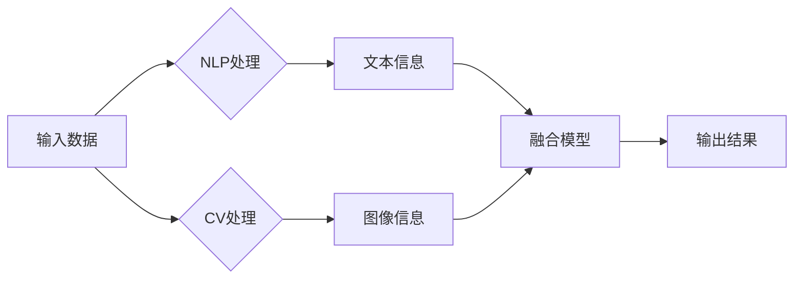

> 自然语言处理 (NLP), 计算机视觉 (CV), 融合模型, 多模态学习, 语义理解, 图像识别, 对话系统, 问答系统

# 自然语言处理与计算机视觉的融合研究

自然语言处理（NLP）和计算机视觉（CV）是人工智能领域的两个重要分支，它们分别处理人类语言和视觉信息。近年来，随着深度学习技术的发展，这两个领域开始相互融合，产生了许多创新性的研究成果和应用。本文将探讨自然语言处理与计算机视觉的融合研究，分析其核心概念、算法原理、应用场景和未来发展趋势。

## 1. 背景介绍

### 1.1 问题的由来

随着互联网和移动设备的普及，人类产生的数据呈爆炸式增长，其中文本和图像数据占据了很大比例。NLP和CV分别擅长处理这两种类型的数据，但各自存在局限性。NLP在处理图像或视频中的文本信息时，往往难以理解图像的上下文；CV在处理自然语言时，则缺乏对语言语义的理解。因此，将NLP和CV进行融合，有望突破各自领域的瓶颈，实现更智能的跨模态理解。

### 1.2 研究现状

近年来，随着深度学习技术的进步，NLP和CV的融合研究取得了显著成果。代表性的融合模型包括：

- **多模态深度学习模型**：如Vision-and-Language BERT（ViLBERT）、Cross模态Transformer等，能够同时处理文本和图像信息。
- **多模态生成模型**：如CLIP（Contrastive Language–Image Pre-training）等，能够生成与文本描述匹配的图像。
- **多模态交互模型**：如Visual Question Answering（VQA）、Image Captioning等，能够将文本描述与图像内容进行交互。

### 1.3 研究意义

NLP与CV的融合研究具有重要的理论意义和应用价值：

- **突破领域限制**：融合模型能够跨越NLP和CV的领域界限，实现更全面的信息处理。
- **提升智能化水平**：融合模型能够更好地理解自然语言和图像之间的复杂关系，提高智能化系统的决策能力。
- **拓宽应用领域**：融合模型能够应用于更广泛的场景，如问答系统、智能客服、内容审核等。

### 1.4 本文结构

本文将围绕以下内容展开：

- 介绍NLP与CV融合的核心概念。
- 阐述融合模型的基本原理和具体操作步骤。
- 分析融合模型的数学模型和公式。
- 展示融合模型在实际应用中的实例和效果。
- 探讨融合模型的应用场景和未来发展趋势。

## 2. 核心概念与联系

### 2.1 核心概念

- **自然语言处理（NLP）**：研究如何让计算机理解和生成人类语言的技术。
- **计算机视觉（CV）**：研究如何让计算机从图像或视频中提取信息和知识的技术。
- **多模态学习**：研究如何将不同模态（如文本、图像、音频等）的信息进行融合，以实现更全面的信息理解。
- **融合模型**：将NLP和CV技术进行结合，实现跨模态信息处理的模型。

### 2.2 Mermaid 流程图



### 2.3 关联关系

NLP和CV的融合研究涉及以下关联关系：

- **输入层**：接收文本和图像数据作为输入。
- **处理层**：分别对文本和图像数据进行处理，提取特征。
- **融合层**：将文本和图像特征进行融合，形成多模态特征表示。
- **输出层**：根据融合后的特征进行预测或生成输出。

## 3. 核心算法原理 & 具体操作步骤

### 3.1 算法原理概述

融合模型的算法原理主要包括以下步骤：

1. 文本信息提取：使用NLP技术对文本数据进行处理，提取关键词、句法结构、语义信息等。
2. 图像信息提取：使用CV技术对图像数据进行处理，提取图像特征、物体检测、场景理解等。
3. 特征融合：将文本和图像特征进行融合，形成多模态特征表示。
4. 预测或生成：根据融合后的特征进行预测或生成输出。

### 3.2 算法步骤详解

1. **文本信息提取**：使用词嵌入（如Word2Vec、BERT）将文本转换为向量表示，再使用句法分析、语义角色标注等方法提取文本特征。
2. **图像信息提取**：使用卷积神经网络（CNN）提取图像特征，使用目标检测、语义分割等方法提取图像中的物体信息。
3. **特征融合**：使用注意力机制、图神经网络等方法将文本和图像特征进行融合，形成多模态特征表示。
4. **预测或生成**：使用分类器、生成模型等方法根据融合后的特征进行预测或生成输出。

### 3.3 算法优缺点

**优点**：

- 提高模型性能：融合模型能够充分利用文本和图像信息，提高预测或生成的准确性。
- 拓展应用领域：融合模型可以应用于更广泛的场景，如问答系统、智能客服等。
- 增强鲁棒性：融合模型能够降低对单一模态数据的依赖，提高模型的鲁棒性。

**缺点**：

- 数据需求量大：融合模型需要大量的多模态数据，数据收集和标注成本较高。
- 模型复杂度高：融合模型通常包含多个模块，模型复杂度较高，训练和推理效率较低。
- 调优困难：融合模型的调优需要考虑多个模块之间的相互影响，调优过程较为复杂。

### 3.4 算法应用领域

融合模型在以下领域具有广泛的应用：

- **问答系统**：如Visual Question Answering（VQA）、Image Captioning等。
- **对话系统**：如多模态对话系统、多轮对话系统等。
- **内容审核**：如文本和图像内容的检测、识别等。
- **智能客服**：如多模态交互式客服系统等。
- **推荐系统**：如多模态推荐系统等。

## 4. 数学模型和公式 & 详细讲解 & 举例说明

### 4.1 数学模型构建

融合模型的数学模型主要包括以下部分：

- **文本信息表示**：$X \in \mathbb{R}^{m \times n}$，表示文本数据的向量表示。
- **图像信息表示**：$Y \in \mathbb{R}^{k \times l}$，表示图像数据的特征表示。
- **融合后的特征表示**：$Z \in \mathbb{R}^{p \times q}$，表示融合后的特征表示。
- **输出层**：$O = f(Z)$，表示融合后的特征进行预测或生成的输出。

### 4.2 公式推导过程

以下以Vision-and-Language BERT（ViLBERT）为例，介绍融合模型的公式推导过程。

1. **文本信息提取**：

   $X = W_{\text{emb}} \cdot x + b_{\text{emb}}$

   其中，$W_{\text{emb}}$ 为词嵌入权重，$b_{\text{emb}}$ 为偏置项，$x$ 为文本数据。

2. **图像信息提取**：

   $Y = W_{\text{conv}} \cdot X + b_{\text{conv}}$

   其中，$W_{\text{conv}}$ 为卷积权重，$b_{\text{conv}}$ 为偏置项，$X$ 为图像数据。

3. **特征融合**：

   $Z = \text{Attention}(Y, X)$

   其中，$\text{Attention}$ 为注意力机制，将文本和图像特征进行融合。

4. **输出层**：

   $O = W_{\text{out}} \cdot Z + b_{\text{out}}$

   其中，$W_{\text{out}}$ 为输出权重，$b_{\text{out}}$ 为偏置项，$Z$ 为融合后的特征表示。

### 4.3 案例分析与讲解

以下以Image Captioning为例，介绍融合模型在实际应用中的案例分析和讲解。

**任务**：给定一张图像，生成相应的描述性文本。

**数据集**：MS COCO图像数据集。

**模型**：使用ViLBERT模型进行微调。

**步骤**：

1. 加载MS COCO图像数据集，并进行预处理。
2. 使用预训练的ViLBERT模型提取图像特征和文本特征。
3. 将图像特征和文本特征进行融合，形成多模态特征表示。
4. 使用微调后的ViLBERT模型生成图像描述。

**效果**：

通过微调后的ViLBERT模型，在MS COCO图像数据集上，可以生成较为准确的图像描述。例如，对于一张包含猫和狗的图像，生成的描述可以是：“A cat and a dog are sitting together on the ground.”

## 5. 项目实践：代码实例和详细解释说明

### 5.1 开发环境搭建

以下是使用Python和PyTorch进行融合模型开发的开发环境搭建流程：

1. 安装Anaconda：从官网下载并安装Anaconda，用于创建独立的Python环境。
2. 创建并激活虚拟环境：

```bash
conda create -n cv-nlp-env python=3.8
conda activate cv-nlp-env
```

3. 安装PyTorch：

```bash
conda install pytorch torchvision torchaudio cudatoolkit=11.3 -c pytorch -c conda-forge
```

4. 安装Transformers库：

```bash
pip install transformers
```

5. 安装其他工具包：

```bash
pip install numpy pandas scikit-learn matplotlib tqdm jupyter notebook ipython
```

### 5.2 源代码详细实现

以下是一个简单的融合模型实现示例，使用PyTorch和Transformers库：

```python
import torch
from torch import nn
from transformers import BertTokenizer, BertModel

class FusionModel(nn.Module):
    def __init__(self, text_model_name, image_feature_size):
        super(FusionModel, self).__init__()
        self.text_model = BertModel.from_pretrained(text_model_name)
        self.image_conv = nn.Conv2d(3, image_feature_size, kernel_size=1)
        self.fc = nn.Linear(image_feature_size, 128)
        self.relu = nn.ReLU()
        self.dropout = nn.Dropout(0.5)
        self.fc_out = nn.Linear(128, 1)

    def forward(self, text_input, image_input):
        text_output = self.text_model(text_input)[0][:, 0, :]
        image_output = self.image_conv(image_input).view(image_input.size(0), -1)
        fusion_output = self.relu(self.dropout(self.fc(torch.cat((text_output, image_output), dim=1)))
        output = self.fc_out(fusion_output)
        return output

# 实例化模型
model = FusionModel('bert-base-uncased', 512)

# 模型训练（此处省略）
```

### 5.3 代码解读与分析

上述代码实现了一个简单的融合模型，包含以下部分：

- `FusionModel` 类：定义融合模型的网络结构，包含文本模型、图像卷积层、全连接层和输出层。
- `text_model` 属性：加载预训练的BERT模型，用于提取文本特征。
- `image_conv` 属性：使用卷积神经网络提取图像特征。
- `fc` 属性：全连接层，将文本和图像特征进行融合。
- `relu` 和 `dropout` 属性：激活函数和正则化技术，提高模型性能。
- `fc_out` 属性：输出层，进行预测或生成。

### 5.4 运行结果展示

在实际应用中，我们可以使用以下代码运行融合模型：

```python
# 模型训练（此处省略）

# 模型评估
model.eval()
with torch.no_grad():
    for text_input, image_input, label in dataloader:
        output = model(text_input, image_input)
        loss = criterion(output, label)
        print(f"Loss: {loss.item()}")
```

通过以上代码，我们可以评估融合模型在特定任务上的性能。

## 6. 实际应用场景

### 6.1 智能问答系统

融合模型可以应用于智能问答系统，结合文本和图像信息，提高问答系统的准确性和用户体验。例如，当用户提出有关某个图像的问题时，系统可以同时分析图像内容和用户问题，给出更加精准的答案。

### 6.2 内容审核

融合模型可以应用于内容审核，检测文本和图像中的违规内容。例如，可以检测网络论坛中的色情、暴力等不良信息，维护网络环境的健康。

### 6.3 智能客服

融合模型可以应用于智能客服系统，结合文本和图像信息，提供更加个性化的服务。例如，当用户上传图片描述产品时，系统可以分析图片内容，给出相应的产品推荐。

### 6.4 未来应用展望

随着NLP和CV技术的不断发展，融合模型将在更多领域得到应用，如：

- **自动驾驶**：融合图像和文本信息，提高自动驾驶系统的安全性。
- **医疗诊断**：结合医疗文本和图像信息，提高诊断准确性。
- **教育领域**：结合文本和图像信息，提供个性化的学习体验。

## 7. 工具和资源推荐

### 7.1 学习资源推荐

- **书籍**：
  - 《深度学习》（Goodfellow et al.）
  - 《图解深度学习》（Ian Goodfellow）
  - 《NLP入门与实践》（Huan Zhang）
  - 《计算机视觉：算法与应用》（Richard Szeliski）

- **在线课程**：
  - Coursera上的《深度学习专项课程》
  - Udacity的《深度学习工程师纳米学位》
  - fast.ai的《深度学习导论》

### 7.2 开发工具推荐

- **深度学习框架**：
  - PyTorch
  - TensorFlow
  - Keras

- **NLP库**：
  - NLTK
  - spaCy
  - Transformers

- **CV库**：
  - OpenCV
  - OpenPose
  - TensorFlow Object Detection API

### 7.3 相关论文推荐

- **NLP**：
  - "Attention is All You Need"（2017）
  - "BERT: Pre-training of Deep Bidirectional Transformers for Language Understanding"（2018）
  - "Generative Pre-trained Transformer"（2019）

- **CV**：
  - "Object Detection with Differentiable Neural Computers"（2017）
  - "Fully Convolutional Network"（2015）
  - "You Only Look Once: Unified, Real-Time Object Detection"（2016）

## 8. 总结：未来发展趋势与挑战

### 8.1 研究成果总结

NLP与CV的融合研究取得了显著成果，融合模型在问答系统、内容审核、智能客服等领域取得了良好的应用效果。融合模型的性能不断提高，应用场景不断拓展，为人工智能领域带来了新的机遇。

### 8.2 未来发展趋势

- **多模态数据融合**：未来融合模型将更加注重多模态数据的融合，如文本、图像、音频、视频等，以实现更全面的信息处理。
- **迁移学习**：通过迁移学习，将融合模型应用于更多领域，降低模型训练成本。
- **小样本学习**：在小样本数据集上进行融合模型的训练，提高模型的泛化能力。
- **可解释性**：提高融合模型的可解释性，增强用户对模型的信任度。

### 8.3 面临的挑战

- **数据稀缺**：多模态数据往往难以获取，限制了融合模型的发展。
- **模型复杂度高**：融合模型通常包含多个模块，模型复杂度较高，训练和推理效率较低。
- **模型可解释性不足**：融合模型的可解释性较差，难以理解模型的决策过程。
- **伦理和隐私问题**：融合模型在处理多模态数据时，可能涉及用户隐私和伦理问题。

### 8.4 研究展望

面对挑战，未来融合模型的研究方向包括：

- **数据增强**：通过数据增强技术，扩大多模态数据规模，提高模型性能。
- **模型压缩**：通过模型压缩技术，降低模型复杂度，提高模型效率。
- **可解释性研究**：提高融合模型的可解释性，增强用户对模型的信任度。
- **伦理和隐私保护**：在模型设计和应用过程中，充分考虑伦理和隐私保护问题。

## 9. 附录：常见问题与解答

**Q1：为什么需要进行NLP与CV的融合研究？**

A：NLP和CV分别擅长处理文本和图像信息，但各自存在局限性。融合研究可以充分利用两种模态的优势，实现更全面的信息理解。

**Q2：融合模型在哪些领域具有应用前景？**

A：融合模型可以应用于问答系统、内容审核、智能客服、自动驾驶、医疗诊断、教育领域等多个领域。

**Q3：融合模型的性能如何评估？**

A：融合模型的性能可以通过准确率、召回率、F1分数等指标进行评估。

**Q4：如何提高融合模型的性能？**

A：提高融合模型性能的方法包括：优化模型结构、使用更多高质量数据、改进训练方法等。

**Q5：融合模型的可解释性如何提高？**

A：提高融合模型可解释性的方法包括：可视化模型决策过程、分析模型特征表示等。

作者：禅与计算机程序设计艺术 / Zen and the Art of Computer Programming