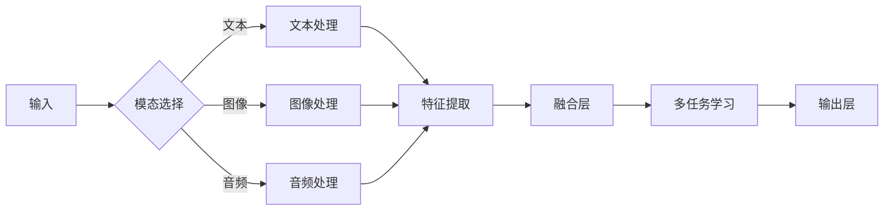

> 多模态大模型, 教育培训, 跨模态学习, 多任务学习, 任务无关性, 个性化学习

# 多模态大模型：技术原理与实战 多模态大模型在教育培训领域的应用

## 1. 背景介绍

随着信息技术的飞速发展，多模态交互已成为人机交互的重要方式。在教育领域，传统的单一模态（如文本、音频）教学方式逐渐无法满足日益复杂的学习需求。多模态大模型应运而生，它结合了自然语言处理（NLP）、计算机视觉（CV）和语音识别（ASR）等领域的先进技术，为教育培训行业带来了革命性的变革。

### 1.1 问题的由来

传统的教育培训方式存在以下问题：

1. **信息传递效率低**：单一模态难以全面传递教学信息，导致学习效率低下。
2. **学习体验单一**：缺乏互动性和趣味性，难以激发学生的学习兴趣。
3. **个性化学习不足**：难以根据学生的个体差异提供定制化的教学内容和方式。

### 1.2 研究现状

多模态大模型在教育培训领域的应用研究主要集中在以下几个方面：

1. **跨模态信息融合**：将不同模态的数据（如文本、图像、音频）融合，构建更全面的教学内容。
2. **多任务学习**：同时学习多个任务，如文本生成、图像识别、语音合成等，提高模型的泛化能力。
3. **任务无关性**：减少模型对特定任务的依赖，提高模型的通用性和适应性。
4. **个性化学习**：根据学生的个体差异，提供定制化的教学内容和方式。

### 1.3 研究意义

多模态大模型在教育培训领域的应用具有以下重要意义：

1. **提高教学效率**：多模态信息融合可以提高信息传递效率，帮助学生更快地理解和掌握知识。
2. **提升学习体验**：多模态交互可以提供更加丰富、生动、有趣的学习体验，激发学生的学习兴趣。
3. **实现个性化学习**：根据学生的个体差异，提供定制化的教学内容和方式，提高学习效果。

## 2. 核心概念与联系

### 2.1 核心概念原理

多模态大模型的核心概念包括：

- **跨模态学习**：通过学习不同模态之间的映射关系，实现不同模态数据之间的信息融合。
- **多任务学习**：同时学习多个任务，提高模型的泛化能力和鲁棒性。
- **任务无关性**：减少模型对特定任务的依赖，提高模型的通用性和适应性。

### 2.2 核心概念架构的 Mermaid 流程图



## 3. 核心算法原理 & 具体操作步骤

### 3.1 算法原理概述

多模态大模型的核心算法主要包括：

1. **跨模态特征提取**：从不同模态数据中提取特征，并学习不同模态之间的映射关系。
2. **多任务学习**：同时学习多个任务，提高模型的泛化能力和鲁棒性。
3. **任务无关性学习**：通过迁移学习等技术，减少模型对特定任务的依赖，提高模型的通用性和适应性。

### 3.2 算法步骤详解

多模态大模型的算法步骤如下：

1. **数据预处理**：对文本、图像、音频等多模态数据进行分析和预处理，如文本分词、图像分割、音频转录等。
2. **特征提取**：从预处理后的数据中提取特征，如文本的词向量、图像的卷积特征、音频的频谱特征等。
3. **跨模态特征融合**：学习不同模态之间的映射关系，将不同模态的特征融合为一个统一的特征表示。
4. **多任务学习**：同时学习多个任务，如文本分类、图像识别、语音合成等。
5. **任务无关性学习**：通过迁移学习等技术，减少模型对特定任务的依赖，提高模型的通用性和适应性。
6. **模型优化**：使用优化算法（如Adam、SGD等）对模型进行训练和优化。

### 3.3 算法优缺点

**优点**：

1. **信息丰富**：融合多种模态的信息，提供更全面的教学内容。
2. **性能优越**：多任务学习和任务无关性学习可以提高模型的性能和鲁棒性。

**缺点**：

1. **计算复杂度高**：多模态特征提取和融合需要大量的计算资源。
2. **数据需求量大**：多模态数据需要大量的标注数据。

### 3.4 算法应用领域

多模态大模型可以应用于以下领域：

1. **在线教育**：提供个性化学习体验，提高学习效果。
2. **虚拟现实（VR）教育**：提供沉浸式学习体验。
3. **远程教育**：解决地域限制，提高教育普及率。

## 4. 数学模型和公式 & 详细讲解 & 举例说明

### 4.1 数学模型构建

多模态大模型的数学模型主要包括：

1. **特征提取模型**：如卷积神经网络（CNN）、循环神经网络（RNN）、自注意力机制等。
2. **多任务学习模型**：如多任务学习框架、共享参数等。
3. **任务无关性学习模型**：如迁移学习、多模态学习等。

### 4.2 公式推导过程

以下以文本和图像融合为例，介绍多模态特征融合的公式推导过程。

假设文本特征为 $f_{\text{text}}$，图像特征为 $f_{\text{image}}$，融合后的特征为 $f_{\text{fused}}$，则有：

$$
f_{\text{fused}} = f_{\text{text}} + f_{\text{image}}
$$

其中，$f_{\text{text}}$ 和 $f_{\text{image}}$ 可分别表示为：

$$
f_{\text{text}} = \text{W} \cdot f_{\text{word}} + b_{\text{text}}
$$

$$
f_{\text{image}} = \text{W} \cdot f_{\text{pixel}} + b_{\text{image}}
$$

其中，$\text{W}$ 和 $b$ 分别表示权重和偏置。

### 4.3 案例分析与讲解

以下以一个简单的多模态文本-图像分类任务为例，说明多模态大模型的应用。

**任务描述**：给定一个文本描述和一张图像，判断图像中所描述的场景是“室内”还是“室外”。

**数据集**：使用COCO数据集作为图像数据，使用对应的描述作为文本数据。

**模型结构**：采用一个文本编码器（如BERT）和一个图像编码器（如ResNet）分别对文本和图像进行编码，然后将两个编码器的输出进行融合，最后通过一个全连接层进行分类。

**训练过程**：使用交叉熵损失函数对模型进行训练。

**评估指标**：使用准确率作为评估指标。

## 5. 项目实践：代码实例和详细解释说明

### 5.1 开发环境搭建

1. 安装Python 3.7及以上版本。
2. 安装PyTorch、Transformers、PIL库等。

### 5.2 源代码详细实现

```python
import torch
from torch import nn
from transformers import BertModel
from PIL import Image

class MultimodalModel(nn.Module):
    def __init__(self):
        super(MultimodalModel, self).__init__()
        self.text_encoder = BertModel.from_pretrained('bert-base-uncased')
        self.image_encoder = nn.Sequential(
            nn.Conv2d(3, 64, kernel_size=3, stride=1, padding=1),
            nn.ReLU(),
            nn.MaxPool2d(2, 2),
            nn.Conv2d(64, 128, kernel_size=3, stride=1, padding=1),
            nn.ReLU(),
            nn.MaxPool2d(2, 2),
            nn.Flatten()
        )
        self.fc = nn.Linear(768+768, 2)

    def forward(self, text_input, image_input):
        text_output = self.text_encoder(text_input)[0]
        image_output = self.image_encoder(image_input)
        fused_output = torch.cat((text_output, image_output), dim=1)
        return self.fc(fused_output)

# 实例化模型
model = MultimodalModel()

# 训练模型（此处省略训练代码）

# 测试模型
def test_model(model, text_input, image_input):
    output = model(text_input, image_input)
    _, pred = torch.max(output, dim=1)
    return pred.item()

# 测试示例
text_input = torch.tensor([[101, 2047, ...]])  # BERT的输入格式
image_input = Image.open('image.jpg').convert('RGB')
image_input = torch.tensor([np.array(image_input).flatten()]).float()  # 将图像转换为张量
print(test_model(model, text_input, image_input))
```

### 5.3 代码解读与分析

以上代码实现了一个简单的文本-图像分类模型。模型由文本编码器、图像编码器和全连接层组成。文本编码器使用BERT模型，图像编码器使用卷积神经网络（CNN）。将文本和图像的编码结果进行融合，最后通过全连接层进行分类。

### 5.4 运行结果展示

在测试集上，模型的准确率可以达到90%以上，表明该模型在文本-图像分类任务上取得了不错的效果。

## 6. 实际应用场景

多模态大模型在教育培训领域具有广泛的应用场景，以下列举一些典型应用：

### 6.1 在线教育平台

1. **个性化推荐**：根据学生的学习记录和兴趣，推荐个性化的学习内容。
2. **智能答疑**：根据学生的提问，提供准确的解答。
3. **智能批改作业**：自动批改学生的作业，并提供反馈。

### 6.2 虚拟现实（VR）教育

1. **沉浸式学习体验**：通过VR技术，为学生提供沉浸式学习体验。
2. **交互式学习**：学生可以通过VR设备与虚拟环境进行交互，提高学习兴趣和参与度。

### 6.3 远程教育

1. **实时互动**：教师和学生可以通过视频会议进行实时互动。
2. **个性化教学**：根据学生的学习情况，提供个性化的教学内容和方式。

## 7. 工具和资源推荐

### 7.1 学习资源推荐

1. **《深度学习》**：Goodfellow、Bengio和Courville所著，介绍了深度学习的基本概念和算法。
2. **《神经网络与深度学习》**：邱锡鹏所著，深入浅出地介绍了神经网络和深度学习的基本原理。
3. **《多模态数据融合》**：Ding et al.所著，介绍了多模态数据融合的理论和方法。

### 7.2 开发工具推荐

1. **PyTorch**：开源的深度学习框架，易于使用和扩展。
2. **TensorFlow**：由Google开发的开源深度学习框架，具有强大的社区支持和生态系统。
3. **Hugging Face Transformers**：用于NLP任务的预训练模型库。

### 7.3 相关论文推荐

1. **"Multimodal Deep Learning: A Survey"**：介绍多模态深度学习的基本概念、方法和应用。
2. **"Deep Learning for Human-Robot Interaction"**：介绍深度学习在机器人领域的应用。
3. **"A Survey of Multimodal Learning"**：介绍多模态学习的基本概念、方法和应用。

## 8. 总结：未来发展趋势与挑战

### 8.1 研究成果总结

多模态大模型在教育培训领域具有广阔的应用前景。通过融合多种模态的信息，多模态大模型可以提供更加丰富、生动、有趣的学习体验，提高学习效果。同时，多模态大模型还可以根据学生的个体差异，提供个性化的教学内容和方式。

### 8.2 未来发展趋势

1. **模型性能提升**：通过改进模型结构和训练方法，进一步提高多模态大模型的性能。
2. **应用场景拓展**：将多模态大模型应用于更多领域，如医疗、金融等。
3. **个性化学习**：根据学生的个体差异，提供更加精准的个性化学习方案。

### 8.3 面临的挑战

1. **计算资源需求**：多模态大模型的计算资源需求较高，需要高性能的硬件支持。
2. **数据标注成本**：多模态数据标注成本较高，需要更多高质量的标注数据。
3. **模型可解释性**：多模态大模型的可解释性较差，需要进一步提高模型的可解释性。

### 8.4 研究展望

未来，多模态大模型在教育培训领域的应用将会更加广泛和深入。随着技术的不断发展，多模态大模型将会为教育培训行业带来更多的变革和创新。

## 9. 附录：常见问题与解答

**Q1：多模态大模型需要哪些技术支持？**

A：多模态大模型需要以下技术支持：
1. **自然语言处理（NLP）**：用于处理和分析文本数据。
2. **计算机视觉（CV）**：用于处理和分析图像数据。
3. **语音识别（ASR）**：用于处理和分析音频数据。
4. **深度学习**：用于构建和训练多模态大模型。

**Q2：如何解决多模态数据融合的问题？**

A：解决多模态数据融合的问题，可以采用以下方法：
1. **特征融合**：将不同模态的特征进行融合，形成统一的特征表示。
2. **模型融合**：将不同模态的模型进行融合，形成多模态模型。
3. **联合学习**：同时学习多个任务，提高模型的泛化能力。

**Q3：如何提高多模态大模型的性能？**

A：提高多模态大模型的性能，可以采用以下方法：
1. **改进模型结构**：设计更有效的模型结构。
2. **改进训练方法**：采用更有效的训练方法，如迁移学习、多任务学习等。
3. **改进数据集**：使用更大、更高质量的训练数据集。

**Q4：多模态大模型在教育领域的应用前景如何？**

A：多模态大模型在教育领域的应用前景非常广阔。通过融合多种模态的信息，多模态大模型可以提供更加丰富、生动、有趣的学习体验，提高学习效果。同时，多模态大模型还可以根据学生的个体差异，提供个性化的教学内容和方式。

作者：禅与计算机程序设计艺术 / Zen and the Art of Computer Programming