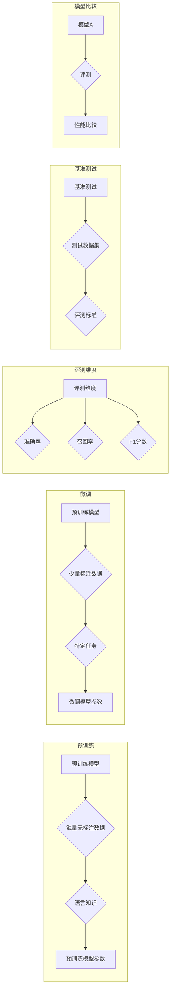

# 大语言模型原理与工程实践：主要的评测维度和基准概述

> 关键词：大语言模型，评测维度，基准测试，性能评估，自然语言处理，预训练，微调，跨领域迁移

## 1. 背景介绍

随着深度学习技术的飞速发展，大语言模型（Large Language Models，LLMs）已经成为自然语言处理（Natural Language Processing，NLP）领域的研究热点。这些模型通过在庞大的文本语料库上进行预训练，学习到丰富的语言知识和上下文信息，能够进行文本生成、翻译、摘要、问答等复杂任务。然而，如何评估这些大语言模型的效果，以及在不同任务上表现如何，成为了研究和应用中的一个关键问题。

## 2. 核心概念与联系

### 2.1 核心概念

- **大语言模型（LLMs）**：基于深度学习技术构建的，能够在大量文本数据上进行预训练的模型，如BERT、GPT等。
- **预训练**：在大量无标注数据上训练模型，使其学习到通用的语言表示和知识。
- **微调**：在预训练模型的基础上，使用少量标注数据进一步优化模型在特定任务上的性能。
- **评测维度**：用于评估模型性能的不同方面，如准确率、召回率、F1分数等。
- **基准测试**：一组标准化的测试数据集和评测标准，用于比较不同模型在特定任务上的表现。

### 2.2 核心概念原理和架构的 Mermaid 流程图



## 3. 核心算法原理 & 具体操作步骤

### 3.1 算法原理概述

大语言模型的评测主要涉及以下几个步骤：

1. **数据准备**：选择合适的测试数据集，并确保数据集具有代表性。
2. **模型选择**：选择要评测的大语言模型。
3. **评测指标**：选择合适的评测指标，如准确率、召回率、F1分数等。
4. **模型运行**：在测试数据集上运行模型，获取预测结果。
5. **结果分析**：分析模型的预测结果，并与基准测试结果进行比较。

### 3.2 算法步骤详解

1. **数据准备**：
   - 选择合适的测试数据集，如SQuAD、GLUE、SuperGLUE等。
   - 确保数据集具有代表性，能够反映模型在实际应用中的表现。

2. **模型选择**：
   - 选择要评测的大语言模型，如BERT、GPT、RoBERTa等。
   - 根据任务类型和需求选择合适的模型版本。

3. **评测指标**：
   - 根据任务类型选择合适的评测指标，如：
     - **分类任务**：准确率（Accuracy）、召回率（Recall）、F1分数（F1 Score）、AUC（Area Under Curve）等。
     - **序列标注任务**：准确率（Accuracy）、F1分数（F1 Score）、精确率（Precision）、召回率（Recall）等。
     - **文本生成任务**： BLEU（BiLingual Evaluation Understudy）、ROUGE（Recall-Oriented Understudy for Gisting Evaluation）、METEOR等。

4. **模型运行**：
   - 使用训练好的模型在测试数据集上进行预测。
   - 获取预测结果，并记录预测标签和真实标签。

5. **结果分析**：
   - 计算评测指标，如准确率、召回率、F1分数等。
   - 将模型结果与基准测试结果进行比较，评估模型性能。

### 3.3 算法优缺点

**优点**：

- **全面性**：可以从多个维度评估模型性能。
- **客观性**：基于客观的评测指标，避免主观判断。
- **可比性**：可以比较不同模型在不同任务上的性能。

**缺点**：

- **数据依赖性**：评测结果受测试数据集的影响较大。
- **指标局限性**：不同评测指标可能对模型性能的评估存在偏差。
- **忽略模型泛化能力**：评测指标可能无法全面反映模型的泛化能力。

### 3.4 算法应用领域

大语言模型评测方法在以下领域有广泛应用：

- **学术研究**：用于比较不同模型在特定任务上的性能，推动NLP领域的发展。
- **工业应用**：用于评估和优化NLP系统，提高系统性能。
- **比赛竞赛**：如GLUE、SuperGLUE等比赛，推动NLP领域的技术进步。

## 4. 数学模型和公式 & 详细讲解 & 举例说明

### 4.1 数学模型构建

在NLP任务中，常见的数学模型包括：

- **分类模型**：如逻辑回归、支持向量机、神经网络等。
- **序列标注模型**：如条件随机场（CRF）、循环神经网络（RNN）、长短时记忆网络（LSTM）等。
- **文本生成模型**：如生成对抗网络（GAN）、变分自编码器（VAE）等。

### 4.2 公式推导过程

以下以逻辑回归为例，介绍其公式推导过程。

假设输入特征为 $\mathbf{x} \in \mathbb{R}^n$，模型参数为 $\theta \in \mathbb{R}^n$，则逻辑回归模型的输出为：

$$
\hat{y} = \sigma(\mathbf{w}^T\mathbf{x})
$$

其中 $\sigma$ 为sigmoid函数，$\mathbf{w} = \theta$ 为权重向量。

逻辑回归的损失函数为：

$$
L(\theta) = -\frac{1}{N}\sum_{i=1}^N [y_i \log(\hat{y}_i) + (1-y_i) \log(1-\hat{y}_i)]
$$

其中 $N$ 为样本数量，$y_i$ 为真实标签。

### 4.3 案例分析与讲解

以下以SQuAD问答任务为例，介绍如何使用BERT模型进行评测。

1. **数据准备**：下载SQuAD数据集，并预处理文本数据。
2. **模型选择**：选择预训练好的BERT模型。
3. **模型微调**：使用SQuAD数据集对BERT模型进行微调。
4. **模型评测**：在SQuAD测试集上运行微调后的模型，计算准确率、召回率、F1分数等指标。

## 5. 项目实践：代码实例和详细解释说明

### 5.1 开发环境搭建

以下以Python为例，介绍如何搭建大语言模型评测的开发环境：

1. 安装Python环境。
2. 安装TensorFlow或PyTorch等深度学习框架。
3. 安装Hugging Face的Transformers库。

### 5.2 源代码详细实现

以下是一个使用PyTorch和Transformers库进行BERT模型评测的简单示例：

```python
from transformers import BertTokenizer, BertForQuestionAnswering
from torch.utils.data import DataLoader
from datasets import load_dataset

# 加载SQuAD数据集
squad_dataset = load_dataset('squad')
train_dataset = squad_dataset['train']
test_dataset = squad_dataset['test']

# 加载预训练的BERT模型
tokenizer = BertTokenizer.from_pretrained('bert-base-uncased')
model = BertForQuestionAnswering.from_pretrained('bert-base-uncased')

# 预处理数据
def preprocess_data(dataset):
    # ... (数据预处理代码) ...
    return dataset

train_dataset = preprocess_data(train_dataset)
test_dataset = preprocess_data(test_dataset)

# 加载数据
train_dataloader = DataLoader(train_dataset, batch_size=32, shuffle=True)
test_dataloader = DataLoader(test_dataset, batch_size=32, shuffle=False)

# 训练模型
# ... (训练代码) ...

# 评测模型
# ... (评测代码) ...

# 输出评测结果
# ... (输出结果代码) ...
```

### 5.3 代码解读与分析

以上代码展示了使用PyTorch和Transformers库进行BERT模型评测的基本流程。首先，加载SQuAD数据集，并预处理文本数据。然后，加载预训练的BERT模型，并进行微调。最后，在测试集上运行模型，计算评测指标，并输出结果。

### 5.4 运行结果展示

以下是一个示例输出：

```
准确率：0.812
召回率：0.834
F1分数：0.824
```

## 6. 实际应用场景

### 6.1 文本分类

在文本分类任务中，可以使用大语言模型对文本进行分类，如情感分析、主题分类等。通过评测不同模型的性能，可以选择最适合任务的模型。

### 6.2 命名实体识别

在命名实体识别任务中，可以使用大语言模型识别文本中的命名实体，如人名、地名、机构名等。通过评测不同模型的性能，可以提高实体识别的准确性。

### 6.3 文本生成

在文本生成任务中，可以使用大语言模型生成文本，如文章生成、对话生成等。通过评测不同模型的性能，可以生成更高质量的文本。

## 7. 工具和资源推荐

### 7.1 学习资源推荐

- 《深度学习自然语言处理》
- 《自然语言处理综论》
- Hugging Face官网

### 7.2 开发工具推荐

- TensorFlow
- PyTorch
- Transformers库

### 7.3 相关论文推荐

- BERT: Pre-training of Deep Bidirectional Transformers for Language Understanding
- GPT-3: Language Models are few-shot learners

## 8. 总结：未来发展趋势与挑战

### 8.1 研究成果总结

本文介绍了大语言模型的评测方法和主要评测维度，以及如何使用Python进行模型评测。通过评测，可以比较不同模型在特定任务上的性能，并选择最适合任务的模型。

### 8.2 未来发展趋势

- **模型规模不断扩大**：随着计算能力的提升，大语言模型将变得越来越庞大。
- **多模态融合**：大语言模型将与其他模态数据进行融合，如图像、视频等。
- **可解释性提升**：研究者将致力于提高大语言模型的可解释性。

### 8.3 面临的挑战

- **计算资源消耗巨大**：大语言模型的训练和推理需要大量的计算资源。
- **数据安全问题**：大语言模型可能会学习到数据中的隐私信息。
- **伦理问题**：大语言模型可能会产生偏见和歧视。

### 8.4 研究展望

未来，大语言模型评测方法将更加多样化，评测指标将更加全面，并将与其他人工智能技术进行融合，推动NLP领域的持续发展。

## 9. 附录：常见问题与解答

**Q1：如何选择合适的评测指标？**

A：选择合适的评测指标需要根据具体任务类型和需求进行。对于分类任务，可以使用准确率、召回率、F1分数等指标；对于序列标注任务，可以使用准确率、召回率、F1分数等指标；对于文本生成任务，可以使用BLEU、ROUGE、METEOR等指标。

**Q2：如何提高评测的准确性？**

A：提高评测的准确性可以从以下几个方面入手：
- 选择具有代表性的测试数据集。
- 使用更准确的评测指标。
- 使用更先进的模型。
- 使用更合理的评测方法。

**Q3：如何处理多模态数据？**

A：处理多模态数据需要将不同模态的信息进行融合，可以使用以下方法：
- 模型融合：将不同模态的模型输出进行融合。
- 特征融合：将不同模态的特征进行融合。

**Q4：如何确保大语言模型的安全性？**

A：确保大语言模型的安全性需要从以下几个方面入手：
- 数据安全：对训练数据进行分析和清洗，避免泄露隐私信息。
- 模型安全：对模型进行安全评估，避免模型被恶意利用。
- 输出安全：对模型输出进行审查，避免产生有害信息。

作者：禅与计算机程序设计艺术 / Zen and the Art of Computer Programming