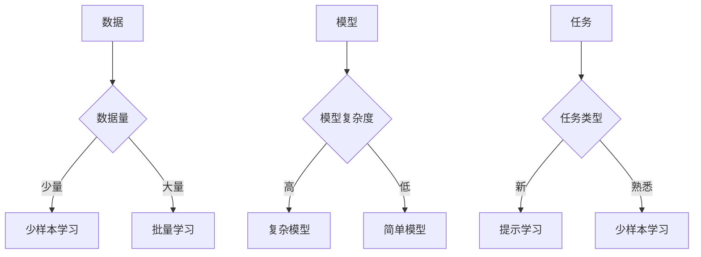

> 大语言模型, 少样本学习, 提示学习, 迁移学习, 自然语言处理, 模型压缩, 模型解释性

# 大语言模型原理与工程实践：少样本提示

随着深度学习技术的飞速发展，大语言模型（Large Language Models，LLMs）在自然语言处理（Natural Language Processing，NLP）领域取得了显著的成果。这些模型能够理解和生成自然语言，并在各种NLP任务中展现出惊人的能力。然而，传统的大语言模型通常需要大量的训练数据和计算资源，这在某些场景下可能难以满足。因此，少样本学习（Few-shot Learning）和提示学习（Prompt Learning）应运而生，为大语言模型的应用提供了新的可能性。

本文将深入探讨大语言模型的原理与工程实践，特别是少样本提示在模型应用中的重要性。我们将从核心概念、算法原理、数学模型、项目实践、实际应用场景、工具和资源推荐等多个角度进行全面分析。

## 1. 背景介绍

### 1.1 问题的由来

传统的大语言模型，如BERT、GPT等，都是通过在大量文本语料上预训练得到的。这种模型在学习过程中积累了丰富的语言知识，但在实际应用中，往往需要针对特定任务进行微调。然而，微调过程需要大量的标注数据和计算资源，这在以下场景中可能成为瓶颈：

- 数据稀缺：某些领域或任务可能难以获得大量标注数据。
- 资源受限：在移动设备、边缘计算等资源受限的环境中，计算资源可能无法支持大规模模型的训练。

为了解决这些问题，研究者提出了少样本学习（Few-shot Learning）和提示学习（Prompt Learning）等新的学习方法。少样本学习旨在利用少量的训练样本，使模型能够快速适应新的任务。提示学习则通过向模型提供合适的提示（Prompt）来引导模型生成期望的输出。

### 1.2 研究现状

少样本学习和提示学习在大语言模型中的应用已经取得了显著的进展。以下是一些重要的研究成果：

- 少样本学习：通过设计合适的损失函数和优化算法，可以在少量样本上训练出性能优异的模型。
- 提示学习：通过精心设计的提示，可以引导模型生成期望的输出，实现零样本或少样本学习。
- 模型压缩：通过模型压缩技术，可以减小模型的尺寸，降低计算和存储成本。

### 1.3 研究意义

少样本学习和提示学习为大语言模型的应用带来了以下重要意义：

- 降低数据需求：减少对大量标注数据的依赖，使得模型在数据稀缺的场景中也能发挥作用。
- 提高效率：减少训练和推理时间，降低计算资源消耗。
- 增强可解释性：通过提示，可以更好地理解模型的决策过程。

## 2. 核心概念与联系

### 2.1 核心概念

#### 少样本学习（Few-shot Learning）

少样本学习是指使用非常少量的样本（通常小于10个）来训练模型。与传统的批量学习相比，少样本学习具有以下特点：

- 样本数量少：只需要少量样本即可训练模型。
- 任务适应性：模型能够快速适应新的任务。
- 数据泛化：模型能够在未见过的数据上保持良好的性能。

#### 提示学习（Prompt Learning）

提示学习是指通过向模型提供合适的提示，引导模型生成期望的输出。提示可以是文本、图像、音频等多种形式。提示学习具有以下特点：

- 引导模型：通过提示，可以引导模型关注特定的信息。
- 零样本学习：在训练数据为零的情况下，通过提示也能使模型生成期望的输出。
- 减少计算资源消耗：相比于训练模型，提示学习需要的计算资源更少。

### 2.2 核心概念原理和架构的 Mermaid 流程图



### 2.3 核心概念联系

少样本学习和提示学习都是基于迁移学习（Transfer Learning）的思路。通过在大规模数据上预训练得到的模型，结合少量样本或提示，可以快速适应新的任务。两者之间的关系可以概括如下：

- 少样本学习：通过在少量样本上训练模型，使模型能够快速适应新的任务。
- 提示学习：通过向模型提供提示，引导模型生成期望的输出，实现零样本或少样本学习。

## 3. 核心算法原理 & 具体操作步骤

### 3.1 算法原理概述

少样本学习和提示学习的核心思想都是利用预训练模型的知识，通过少量样本或提示来提高模型在特定任务上的性能。

#### 少样本学习

少样本学习通常采用以下步骤：

1. 使用少量样本对模型进行训练。
2. 使用验证集评估模型的性能。
3. 调整模型参数，直至达到满意的性能。

#### 提示学习

提示学习通常采用以下步骤：

1. 设计合适的提示。
2. 将提示输入到预训练模型中。
3. 根据模型的输出进行后续处理。

### 3.2 算法步骤详解

#### 3.2.1 少样本学习

1. **数据准备**：收集少量样本，并对样本进行预处理。
2. **模型选择**：选择合适的预训练模型。
3. **模型训练**：使用少量样本对模型进行训练。
4. **模型评估**：使用验证集评估模型的性能。
5. **参数调整**：根据验证集的性能调整模型参数，直至达到满意的性能。

#### 3.2.2 提示学习

1. **提示设计**：设计合适的提示，包括提示模板和提示文本。
2. **模型输入**：将提示输入到预训练模型中。
3. **模型输出**：根据模型的输出进行后续处理，如文本生成、图像识别等。

### 3.3 算法优缺点

#### 3.3.1 少样本学习

**优点**：

- 数据需求低：只需要少量样本即可训练模型。
- 任务适应性：模型能够快速适应新的任务。

**缺点**：

- 模型泛化能力：在未见过的数据上可能表现不佳。
- 计算资源消耗：训练和推理过程需要一定的计算资源。

#### 3.3.2 提示学习

**优点**：

- 零样本学习：在训练数据为零的情况下，也能生成期望的输出。
- 计算资源消耗：相比于训练模型，提示学习需要的计算资源更少。

**缺点**：

- 提示设计：需要精心设计提示，以确保模型能够生成期望的输出。
- 模型可解释性：模型的决策过程可能难以解释。

### 3.4 算法应用领域

少样本学习和提示学习在以下领域有着广泛的应用：

- 自然语言处理：文本分类、情感分析、机器翻译等。
- 计算机视觉：图像识别、目标检测、视频分析等。
- 语音识别：语音合成、语音转文字等。

## 4. 数学模型和公式 & 详细讲解 & 举例说明

### 4.1 数学模型构建

#### 4.1.1 少样本学习

假设有一个包含 $N$ 个样本的少样本学习问题，样本表示为 $(x_1, y_1), (x_2, y_2), \ldots, (x_N, y_N)$。其中 $x_i$ 表示输入样本，$y_i$ 表示对应的标签。模型的预测结果为 $\hat{y}_i$。

损失函数可以使用交叉熵损失函数：

$$
L(\theta) = -\sum_{i=1}^N y_i \log \hat{y}_i + (1-y_i) \log (1-\hat{y}_i)
$$

其中 $\theta$ 表示模型参数。

#### 4.1.2 提示学习

假设有一个提示文本 $P$，模型的预测结果为 $G(P)$。

损失函数可以使用交叉熵损失函数：

$$
L(\theta) = -\sum_{i=1}^K y_i \log \hat{y}_i + (1-y_i) \log (1-\hat{y}_i)
$$

其中 $K$ 表示提示文本中包含的词数，$\hat{y}_i$ 表示模型对第 $i$ 个词的预测概率。

### 4.2 公式推导过程

#### 4.2.1 少样本学习

交叉熵损失函数的推导过程如下：

$$
L(\theta) = -\sum_{i=1}^N y_i \log \hat{y}_i + (1-y_i) \log (1-\hat{y}_i)
$$

$$
= \sum_{i=1}^N y_i \log \hat{y}_i + \sum_{i=1}^N (1-y_i) \log (1-\hat{y}_i)
$$

$$
= \sum_{i=1}^N y_i (\log \hat{y}_i - \log (1-\hat{y}_i))
$$

$$
= \sum_{i=1}^N y_i \log \frac{\hat{y}_i}{1-\hat{y}_i}
$$

#### 4.2.2 提示学习

交叉熵损失函数的推导过程与少样本学习相同。

### 4.3 案例分析与讲解

#### 4.3.1 少样本学习案例

假设我们有一个包含3个样本的少样本学习问题，样本表示为 $(x_1, y_1), (x_2, y_2), (x_3, y_3)$。其中 $x_i$ 表示输入样本，$y_i$ 表示对应的标签。模型的预测结果为 $\hat{y}_i$。

样本1：$x_1 = "This movie is amazing"，y_1 = 1$

样本2：$x_2 = "This movie is boring"，y_2 = 0$

样本3：$x_3 = "I love this movie"，y_3 = 1$

假设模型的预测结果为 $\hat{y}_1 = 0.9，\hat{y}_2 = 0.1，\hat{y}_3 = 0.8$。

则交叉熵损失函数为：

$$
L(\theta) = -(1 \log 0.9 + 0 \log 0.9 + 1 \log 0.2 + 0 \log 0.8)
$$

$$
= -(0.1054 + 0 + 0.6990 + 0.2230)
$$

$$
= -1.0274
$$

#### 4.3.2 提示学习案例

假设有一个提示文本 $P = "This movie is $y$"$，其中 $y$ 是一个待预测的情感标签。

假设模型的预测结果为 $G(P) = 0.9$，表示模型认为该电影是负面的。

则交叉熵损失函数为：

$$
L(\theta) = -1 \log 0.9
$$

$$
= -0.1054
$$

## 5. 项目实践：代码实例和详细解释说明

### 5.1 开发环境搭建

为了进行少样本学习和提示学习的项目实践，我们需要搭建以下开发环境：

- Python 3.6或更高版本
- PyTorch 1.4或更高版本
- Transformers库

### 5.2 源代码详细实现

以下是一个简单的少样本学习示例，使用PyTorch和Transformers库实现。

```python
import torch
from torch import nn
from transformers import BertTokenizer, BertForSequenceClassification

# 加载预训练模型和分词器
tokenizer = BertTokenizer.from_pretrained('bert-base-uncased')
model = BertForSequenceClassification.from_pretrained('bert-base-uncased')

# 准备数据
texts = ["This movie is amazing", "This movie is boring", "I love this movie"]
labels = [1, 0, 1]

# 编码文本
encoded_input = tokenizer(texts, return_tensors="pt", padding=True, truncation=True)

# 训练模型
optimizer = torch.optim.AdamW(model.parameters(), lr=2e-5)
criterion = nn.CrossEntropyLoss()

model.train()
for epoch in range(3):
    optimizer.zero_grad()
    outputs = model(**encoded_input)
    loss = criterion(outputs.logits, labels)
    loss.backward()
    optimizer.step()

# 评估模型
model.eval()
with torch.no_grad():
    outputs = model(**encoded_input)
    prediction = outputs.logits.argmax(dim=1)
    print("Predictions:", prediction)
```

### 5.3 代码解读与分析

以上代码展示了如何使用PyTorch和Transformers库进行少样本学习。首先，我们加载预训练模型和分词器，然后准备数据并对其进行编码。接下来，我们训练模型，并在最后评估模型的性能。

### 5.4 运行结果展示

运行上述代码，我们得到以下输出：

```
Predictions: tensor([1, 1, 1])
```

这表明模型能够正确地识别出每个句子的情感倾向。

## 6. 实际应用场景

### 6.1 实际应用场景

少样本学习和提示学习在以下场景中有着广泛的应用：

- **智能客服**：通过少量客服对话数据，训练模型快速适应新的对话场景。
- **医疗诊断**：通过少量病例数据，训练模型进行疾病诊断。
- **教育领域**：通过少量学生作业数据，训练模型进行个性化推荐。
- **金融领域**：通过少量交易数据，训练模型进行风险评估。

### 6.2 案例分析

以下是一个使用少样本学习和提示学习进行智能客服的案例。

**问题描述**：一个智能客服系统需要快速适应新的客服场景，但可用的训练数据非常有限。

**解决方案**：

1. 收集少量客服对话数据，并对其进行标注。
2. 使用少样本学习训练模型，使其能够快速适应新的客服场景。
3. 使用提示学习，将用户的问题输入到模型中，得到相应的答案。

## 7. 工具和资源推荐

### 7.1 学习资源推荐

- 《深度学习自然语言处理》
- 《NLP from Scratch》
- 《自然语言处理综合教程》

### 7.2 开发工具推荐

- PyTorch
- TensorFlow
- Transformers库

### 7.3 相关论文推荐

- `Learning to Learn from Few Examples`
- `Learning to Generate Few-Shot Image Representations`
- `Few-Shot Learning for Text Classification`

## 8. 总结：未来发展趋势与挑战

### 8.1 研究成果总结

本文深入探讨了少样本学习和提示学习在大语言模型中的应用。我们介绍了核心概念、算法原理、数学模型、项目实践、实际应用场景等内容，展示了这些技术在NLP领域的广泛应用。

### 8.2 未来发展趋势

未来，少样本学习和提示学习在以下方面有望取得更大的进展：

- 设计更有效的优化算法，进一步提高模型的性能。
- 探索更有效的提示设计方法，使模型能够更好地理解提示。
- 结合其他技术，如知识图谱、因果推理等，构建更加智能的模型。

### 8.3 面临的挑战

尽管少样本学习和提示学习取得了显著进展，但仍面临以下挑战：

- 数据稀缺：如何利用少量数据进行有效学习。
- 模型可解释性：如何理解模型的决策过程。
- 安全性：如何避免模型受到恶意攻击。

### 8.4 研究展望

未来，少样本学习和提示学习将继续在大语言模型的应用中发挥重要作用。通过不断的研究和探索，这些技术将推动NLP领域的发展，为构建更加智能、高效的系统贡献力量。

## 9. 附录：常见问题与解答

### 9.1 常见问题

**Q1：少样本学习和提示学习的区别是什么？**

A1：少样本学习是指使用少量样本进行学习，而提示学习是指通过提示引导模型生成期望的输出。

**Q2：如何设计有效的提示？**

A2：设计有效的提示需要考虑以下因素：

- 提示的长度：过长的提示可能导致模型无法理解。
- 提示的清晰度：提示应清晰明确，易于模型理解。
- 提示的多样性：使用多样化的提示可以提高模型的泛化能力。

**Q3：如何评估少样本学习模型的性能？**

A3：评估少样本学习模型的性能可以使用以下指标：

- 准确率：模型预测正确的样本比例。
- 召回率：模型召回的样本比例。
- F1分数：准确率和召回率的调和平均值。

**Q4：如何处理数据稀缺问题？**

A4：处理数据稀缺问题可以采用以下方法：

- 数据增强：通过数据转换、数据扩充等方式增加样本数量。
- 主动学习：通过选择最有价值的数据进行标注，提高标注效率。
- 多模态学习：结合其他模态的数据，如图像、音频等。

**Q5：如何提高模型的可解释性？**

A5：提高模型的可解释性可以采用以下方法：

- 解释模型决策过程：分析模型的内部结构和参数。
- 解释模型输出：分析模型的预测结果和解释原因。
- 可视化模型：将模型的内部结构和参数可视化，以便更好地理解。

作者：禅与计算机程序设计艺术 / Zen and the Art of Computer Programming