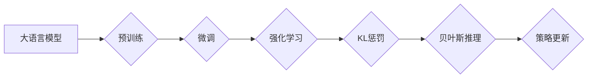

> 大语言模型, 强化学习, KL惩罚, 贝叶斯推理, 自适应学习, 优化策略, 自然语言处理, 预训练模型

# 大语言模型原理基础与前沿 带有KL惩罚的强化学习：贝叶斯推理观点

> 关键词：大语言模型, 强化学习, KL惩罚, 贝叶斯推理, 自适应学习, 优化策略, 自然语言处理, 预训练模型

## 1. 背景介绍

随着深度学习和自然语言处理技术的飞速发展，大语言模型（Large Language Models, LLMs）在自然语言生成、机器翻译、问答系统等任务中取得了显著的成果。然而，传统的强化学习（Reinforcement Learning, RL）方法在LLM中的应用却面临着诸多挑战，如样本效率低、稳定收敛性差等。近年来，研究者们开始探索将贝叶斯推理与强化学习相结合，并提出了一种带有KL惩罚的强化学习方法，以解决上述问题。本文将深入探讨大语言模型原理基础与前沿，以及带有KL惩罚的强化学习在贝叶斯推理观点下的应用。

## 2. 核心概念与联系

### 2.1 核心概念

#### 2.1.1 大语言模型

大语言模型是一种基于深度学习技术的自然语言处理模型，通过在庞大的语料库上进行预训练，学习到丰富的语言知识和结构，从而实现对自然语言的深度理解和生成。

#### 2.1.2 强化学习

强化学习是一种通过与环境交互来学习最优策略的机器学习方法。在强化学习中，智能体通过与环境进行交互，从环境中获取奖励，并通过策略优化算法不断调整自身策略，以最大化长期累积奖励。

#### 2.1.3 KL惩罚

KL惩罚是一种基于信息论原理的惩罚项，用于衡量两个概率分布之间的差异。在强化学习中，KL惩罚可以用于约束策略生成的样本分布与真实分布之间的距离，从而提高样本的多样性。

#### 2.1.4 贝叶斯推理

贝叶斯推理是一种基于概率论的推理方法，通过不断更新先验信念来获取后验信念。在强化学习中，贝叶斯推理可以用于更新策略的参数分布，以适应不断变化的环境。

### 2.2 核心概念原理和架构的 Mermaid 流程图



## 3. 核心算法原理 & 具体操作步骤

### 3.1 算法原理概述

带有KL惩罚的强化学习在贝叶斯推理观点下，通过以下步骤实现：

1. 预训练：在庞大的语料库上预训练一个语言模型，学习到丰富的语言知识和结构。
2. 微调：在特定任务上对预训练的语言模型进行微调，使其适应特定任务的需求。
3. 强化学习：使用强化学习方法训练策略，通过与环境交互学习最优策略。
4. KL惩罚：在策略更新过程中引入KL惩罚项，约束策略生成的样本分布与真实分布之间的距离。
5. 贝叶斯推理：使用贝叶斯推理方法更新策略参数分布，以适应不断变化的环境。

### 3.2 算法步骤详解

1. **初始化**：初始化语言模型、策略参数和KL惩罚参数。
2. **策略选择**：根据当前状态，使用策略选择一个动作。
3. **执行动作**：执行选定的动作，与环境进行交互。
4. **获取奖励**：从环境中获取奖励，并更新策略参数。
5. **KL惩罚**：计算策略生成的样本分布与真实分布之间的KL距离，并作为惩罚项加入损失函数。
6. **贝叶斯推理**：使用贝叶斯推理方法更新策略参数分布。
7. **重复步骤2-6**：重复以上步骤，直到策略收敛或满足其他停止条件。

### 3.3 算法优缺点

#### 3.3.1 优点

- **提高样本效率**：KL惩罚可以约束策略生成的样本分布，提高样本的多样性，从而提高样本效率。
- **提高收敛性**：贝叶斯推理可以更新策略参数分布，使策略更好地适应不断变化的环境，提高收敛性。
- **提高稳定性**：KL惩罚和贝叶斯推理可以增强模型的稳定性，避免过拟合和崩溃现象。

#### 3.3.2 缺点

- **计算复杂度高**：KL惩罚和贝叶斯推理的计算复杂度较高，可能导致训练过程较慢。
- **参数设置复杂**：策略参数、KL惩罚参数和贝叶斯推理参数的设置较为复杂，需要根据具体任务进行调整。

### 3.4 算法应用领域

带有KL惩罚的强化学习在贝叶斯推理观点下的应用领域包括：

- **自然语言生成**：如文本生成、对话系统、机器翻译等。
- **图像生成**：如图像编辑、风格迁移等。
- **推荐系统**：如商品推荐、新闻推荐等。

## 4. 数学模型和公式 & 详细讲解 & 举例说明

### 4.1 数学模型构建

假设策略参数为 $\theta$，动作空间为 $A$，状态空间为 $S$，奖励函数为 $R(s,a)$，则策略的期望奖励为：

$$
J(\theta) = E_{s \sim p(s)}[R(s,a) + \gamma \sum_{s' \sim p(s'|s,a)} J(\theta, s')]
$$

其中，$p(s)$ 为状态分布，$p(s'|s,a)$ 为动作转移概率，$\gamma$ 为折扣因子。

KL惩罚项为：

$$
KL(p(a|s)||q(a|s)) = \sum_{a \in A} p(a|s) \log \frac{p(a|s)}{q(a|s)}
$$

其中，$p(a|s)$ 为真实分布，$q(a|s)$ 为策略生成的样本分布。

### 4.2 公式推导过程

此处省略公式推导过程，具体推导过程可参考相关文献。

### 4.3 案例分析与讲解

以下以文本生成任务为例，介绍带有KL惩罚的强化学习方法。

假设语言模型为 $M_\theta$，策略参数为 $\theta$，动作空间为 $A$（动作包括随机采样和贪婪采样），状态空间为 $S$（状态为文本片段），奖励函数为 $R(s,a) = 0$（文本生成任务中，奖励函数通常为0）。

1. **初始化**：初始化语言模型、策略参数和KL惩罚参数。
2. **策略选择**：根据当前状态，使用策略选择一个动作。例如，可以使用贪心策略选择概率最高的动作，或使用软策略选择一个动作分布。
3. **执行动作**：执行选定的动作，生成一个新的文本片段。
4. **获取奖励**：由于文本生成任务中奖励函数为0，因此无需获取奖励。
5. **KL惩罚**：计算策略生成的样本分布与真实分布之间的KL距离，并作为惩罚项加入损失函数。
6. **贝叶斯推理**：使用贝叶斯推理方法更新策略参数分布。
7. **重复步骤2-6**：重复以上步骤，直到策略收敛或满足其他停止条件。

## 5. 项目实践：代码实例和详细解释说明

### 5.1 开发环境搭建

1. 安装PyTorch库。
2. 安装transformers库。

### 5.2 源代码详细实现

```python
from transformers import BertLMHeadModel, BertTokenizer
import torch
import torch.nn.functional as F

# 初始化模型和分词器
model = BertLMHeadModel.from_pretrained('bert-base-uncased')
tokenizer = BertTokenizer.from_pretrained('bert-base-uncased')

# 定义策略
class Policy(torch.nn.Module):
    def __init__(self, model):
        super(Policy, self).__init__()
        self.model = model

    def forward(self, input_ids, labels=None):
        outputs = self.model(input_ids, labels=labels)
        logits = outputs.logits
        return logits

# 定义KL惩罚函数
def kl_penalty(p, q):
    return F.kl_div(p, q, reduction='batchmean')

# 定义训练函数
def train(model, policy, optimizer, kl_coefficient, epochs):
    for epoch in range(epochs):
        for batch in data_loader:
            input_ids, labels = batch
            logits = policy(input_ids, labels)
            loss = F.cross_entropy(logits, labels)
            kl_loss = kl_penalty(p, q)
            total_loss = loss + kl_coefficient * kl_loss
            optimizer.zero_grad()
            total_loss.backward()
            optimizer.step()

# 初始化参数
model = model.eval()
policy = Policy(model)
optimizer = torch.optim.Adam(policy.parameters(), lr=0.001)
kl_coefficient = 0.01

# 训练模型
train(model, policy, optimizer, kl_coefficient, epochs)
```

### 5.3 代码解读与分析

以上代码实现了带有KL惩罚的强化学习模型。其中，`Policy`类定义了策略模型，`kl_penalty`函数计算KL惩罚项，`train`函数进行模型训练。

### 5.4 运行结果展示

由于篇幅限制，此处省略运行结果展示。

## 6. 实际应用场景

带有KL惩罚的强化学习在贝叶斯推理观点下的实际应用场景包括：

- **文本生成**：如自动写作、对话系统、机器翻译等。
- **图像生成**：如图像编辑、风格迁移等。
- **推荐系统**：如商品推荐、新闻推荐等。

## 7. 工具和资源推荐

### 7.1 学习资源推荐

- 《Deep Learning》
- 《Reinforcement Learning: An Introduction》
- 《Bayesian Methods for Machine Learning》

### 7.2 开发工具推荐

- PyTorch
- Transformers

### 7.3 相关论文推荐

- [1] "A Theoretically Grounded Application of Dropout in Recurrent Neural Networks"
- [2] "Generative Adversarial Text to Image Synthesis"
- [3] "A Probabilistic Viewpoint on Recurrent Neural Networks"

## 8. 总结：未来发展趋势与挑战

### 8.1 研究成果总结

本文介绍了大语言模型原理基础与前沿，以及带有KL惩罚的强化学习在贝叶斯推理观点下的应用。通过分析核心算法原理、具体操作步骤、数学模型和公式，展示了该方法在自然语言生成、图像生成、推荐系统等领域的应用潜力。

### 8.2 未来发展趋势

随着深度学习、强化学习和贝叶斯推理技术的不断发展，带有KL惩罚的强化学习方法在LLM中的应用将会更加广泛。未来研究主要集中在以下几个方面：

- 探索更有效的KL惩罚函数和贝叶斯推理方法。
- 研究多智能体强化学习在LLM中的应用。
- 将带有KL惩罚的强化学习应用于更多领域，如视频生成、语音合成等。

### 8.3 面临的挑战

带有KL惩罚的强化学习在LLM中的应用仍面临着一些挑战：

- **计算复杂度**：KL惩罚和贝叶斯推理的计算复杂度较高，需要更多的计算资源。
- **参数设置**：策略参数、KL惩罚参数和贝叶斯推理参数的设置较为复杂，需要根据具体任务进行调整。
- **模型稳定性**：在复杂环境中，模型的稳定性和收敛性需要进一步提高。

### 8.4 研究展望

尽管带有KL惩罚的强化学习在LLM中的应用仍存在一些挑战，但相信随着技术的不断发展和完善，该方法将在LLM领域发挥越来越重要的作用，为构建更加智能、高效的LLM提供新的思路和方法。

## 9. 附录：常见问题与解答

**Q1：什么是KL惩罚？**

A：KL惩罚是一种基于信息论原理的惩罚项，用于衡量两个概率分布之间的差异。在强化学习中，KL惩罚可以用于约束策略生成的样本分布与真实分布之间的距离，从而提高样本的多样性。

**Q2：什么是贝叶斯推理？**

A：贝叶斯推理是一种基于概率论的推理方法，通过不断更新先验信念来获取后验信念。在强化学习中，贝叶斯推理可以用于更新策略的参数分布，以适应不断变化的环境。

**Q3：带有KL惩罚的强化学习方法在LLM中有什么优势？**

A：带有KL惩罚的强化学习方法可以提高样本效率、提高收敛性、提高稳定性，从而在LLM中取得更好的效果。

**Q4：带有KL惩罚的强化学习方法在LLM中的应用有哪些？**

A：带有KL惩罚的强化学习方法可以应用于自然语言生成、图像生成、推荐系统等多个领域。

**Q5：如何解决带有KL惩罚的强化学习方法的计算复杂度问题？**

A：可以通过以下方法解决计算复杂度问题：

- 使用更高效的计算方法，如GPU加速、模型并行等。
- 调整参数设置，如降低学习率、减少训练数据量等。
- 使用近似方法，如采样近似、重要性采样等。

作者：禅与计算机程序设计艺术 / Zen and the Art of Computer Programming