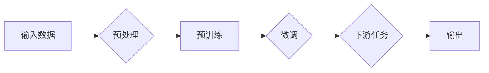

# 大语言模型应用指南：神经网络基础

> 关键词：大语言模型，神经网络，深度学习，自然语言处理，预训练，微调，Transformer，BERT，GPT

## 1. 背景介绍

随着计算能力的提升和数据量的爆炸式增长，深度学习在自然语言处理（NLP）领域取得了显著的成果。大语言模型（Large Language Models，LLMs）如BERT、GPT等，通过在庞大的文本语料库上进行预训练，学会了丰富的语言模式和知识，为NLP任务提供了强大的基础。本指南将深入探讨神经网络在大语言模型中的应用，为开发者提供从基础到实践的全面指导。

## 2. 核心概念与联系

### 2.1 核心概念

#### 2.1.1 深度学习

深度学习是一种机器学习技术，它通过构建具有多层处理单元的神经网络，学习数据的复杂特征和模式。深度学习在图像识别、语音识别、自然语言处理等领域取得了突破性的成果。

#### 2.1.2 神经网络

神经网络是由大量简单的处理单元（称为神经元）相互连接而成的计算系统。每个神经元接收来自其他神经元的输入，通过激活函数进行非线性变换，产生输出。神经网络通过学习输入数据中的模式和特征，来预测或分类输出。

#### 2.1.3 预训练

预训练是指在大规模无标注数据上进行训练，使模型学习到通用的语言特征和知识。预训练模型可以用于下游任务，通过微调来适应特定任务。

#### 2.1.4 微调

微调是指在预训练模型的基础上，使用少量标注数据进一步训练，以适应特定任务的需求。

#### 2.1.5 Transformer

Transformer是一种基于自注意力机制（Self-Attention Mechanism）的深度神经网络架构，被广泛应用于NLP任务。

#### 2.1.6 BERT

BERT（Bidirectional Encoder Representations from Transformers）是一种基于Transformer的预训练语言模型，通过双向上下文表示，提高了语言理解的准确性。

#### 2.1.7 GPT

GPT（Generative Pre-trained Transformer）是一种基于Transformer的生成式预训练语言模型，擅长生成自然语言文本。

### 2.2 Mermaid 流程图



### 2.3 核心概念联系

预训练模型是微调的基础，微调是应用于特定任务的关键步骤。Transformer和BERT、GPT等模型是预训练和微调的主要技术架构。通过神经网络的学习，模型能够从输入数据中提取特征，并在下游任务中生成输出。

## 3. 核心算法原理 & 具体操作步骤

### 3.1 算法原理概述

大语言模型的核心算法是基于神经网络的深度学习模型。这些模型通常包含多个层次，每个层次都通过非线性变换学习数据中的特征和模式。以下是几个关键步骤：

1. **输入数据预处理**：将输入数据转换为模型可接受的格式，如分词、编码等。
2. **预训练**：在大量无标注数据上进行预训练，使模型学习到通用的语言特征和知识。
3. **微调**：使用少量标注数据进一步训练模型，以适应特定任务的需求。
4. **下游任务应用**：将微调后的模型应用于下游任务，如文本分类、机器翻译、问答系统等。

### 3.2 算法步骤详解

1. **数据预处理**：
    - 分词：将文本分割成单词或子词。
    - 编码：将分词后的文本转换为数字序列。
2. **预训练**：
    - 使用Transformer或BERT、GPT等模型架构。
    - 通过自注意力机制学习文本序列中的依赖关系和长距离特征。
    - 通过预训练任务（如掩码语言模型、下一句预测等）学习通用语言特征。
3. **微调**：
    - 在下游任务的标注数据上进一步训练模型。
    - 调整预训练模型的部分参数，以适应特定任务。
4. **下游任务应用**：
    - 将微调后的模型应用于下游任务。
    - 使用模型进行文本分类、机器翻译、问答系统等任务。

### 3.3 算法优缺点

#### 3.3.1 优点

- **强大的语言理解能力**：预训练模型通过学习大量无标注数据，能够理解和处理复杂的语言现象。
- **高效的迁移学习能力**：预训练模型可以迁移到不同的下游任务，无需从头开始训练。
- **灵活的应用场景**：大语言模型可以应用于多种NLP任务，如文本分类、机器翻译、问答系统等。

#### 3.3.2 缺点

- **计算资源需求高**：训练和推理大语言模型需要大量的计算资源。
- **数据标注成本高**：预训练模型需要大量无标注数据进行预训练，而微调模型需要少量标注数据进行微调。
- **模型可解释性差**：大语言模型的内部工作机制复杂，难以解释其决策过程。

### 3.4 算法应用领域

大语言模型在以下领域有广泛的应用：

- **文本分类**：如情感分析、主题分类、垃圾邮件检测等。
- **机器翻译**：如将一种语言翻译成另一种语言。
- **问答系统**：如回答用户提出的问题。
- **对话系统**：如智能客服、聊天机器人等。
- **文本生成**：如生成文章摘要、故事、诗歌等。

## 4. 数学模型和公式 & 详细讲解 & 举例说明

### 4.1 数学模型构建

大语言模型的数学模型通常包含以下几个部分：

- **输入层**：将文本转换为数字序列。
- **隐藏层**：包含多个神经元，通过非线性变换学习数据中的特征和模式。
- **输出层**：将隐藏层的输出转换为最终的预测结果。

### 4.2 公式推导过程

以下是一个简化的神经网络模型公式推导过程：

$$
y = \sigma(W_1 \cdot x + b_1) 
$$

其中 $y$ 为输出，$x$ 为输入，$W_1$ 为权重，$b_1$ 为偏置，$\sigma$ 为非线性激活函数。

### 4.3 案例分析与讲解

以BERT模型为例，其核心组件为Transformer编码器。以下是一个简化的Transformer编码器公式：

$$
H = \text{MultiHeadAttention}(Q,K,V) 
$$

其中 $H$ 为输出，$Q$、$K$、$V$ 分别为查询、键、值，MultiHeadAttention 为多头自注意力机制。

## 5. 项目实践：代码实例和详细解释说明

### 5.1 开发环境搭建

以下是使用Python进行大语言模型开发的基本环境搭建步骤：

```bash
# 安装Anaconda
conda create -n pytorch-env python=3.8
conda activate pytorch-env

# 安装PyTorch
conda install pytorch torchvision torchaudio cudatoolkit=11.1 -c pytorch -c conda-forge

# 安装Transformers库
pip install transformers
```

### 5.2 源代码详细实现

以下是一个简单的BERT模型微调代码实例：

```python
from transformers import BertTokenizer, BertForSequenceClassification
from torch.utils.data import DataLoader, TensorDataset
from torch.optim import Adam

# 加载预训练模型和分词器
tokenizer = BertTokenizer.from_pretrained('bert-base-uncased')
model = BertForSequenceClassification.from_pretrained('bert-base-uncased')

# 创建数据集
texts = ["This is a great product", "This product is bad"]
labels = [1, 0]

# 编码文本
input_ids = tokenizer(texts, padding=True, truncation=True, return_tensors="pt").input_ids
attention_mask = tokenizer(texts, padding=True, truncation=True, return_tensors="pt").attention_mask
labels = torch.tensor(labels)

# 创建数据加载器
dataset = TensorDataset(input_ids, attention_mask, labels)
dataloader = DataLoader(dataset, batch_size=2)

# 定义优化器
optimizer = Adam(model.parameters(), lr=1e-5)

# 训练模型
model.train()
for epoch in range(2):
    for batch in dataloader:
        input_ids, attention_mask, labels = batch
        outputs = model(input_ids, attention_mask=attention_mask, labels=labels)
        loss = outputs.loss
        loss.backward()
        optimizer.step()
        optimizer.zero_grad()
```

### 5.3 代码解读与分析

- 加载预训练模型和分词器。
- 创建数据集，包括文本和标签。
- 对文本进行编码，生成输入序列和注意力掩码。
- 将标签转换为PyTorch张量。
- 创建数据加载器，用于批量加载数据。
- 定义优化器，用于更新模型参数。
- 训练模型，包括前向传播、反向传播和参数更新。

### 5.4 运行结果展示

运行上述代码，可以在验证集上评估模型性能。如果模型训练得当，其预测结果应该与真实标签相符。

## 6. 实际应用场景

大语言模型在以下实际应用场景中具有重要作用：

- **智能客服**：通过文本分类和情感分析，智能客服可以自动识别用户意图，提供个性化服务。
- **机器翻译**：将一种语言翻译成另一种语言，促进跨文化交流。
- **问答系统**：通过自然语言理解，问答系统可以回答用户提出的问题。
- **对话系统**：如聊天机器人，提供24/7的客户服务。
- **文本生成**：如自动生成文章、诗歌等。

## 7. 工具和资源推荐

### 7.1 学习资源推荐

- 《深度学习》 - Ian Goodfellow、Yoshua Bengio和Aaron Courville合著
- 《动手学深度学习》 - 尤舒华、李沐、朱松纯合著
- 《深度学习自然语言处理》 - 马丁·阿布拉菲亚、斯图尔特·罗素、普雷斯顿·麦克米伦合著

### 7.2 开发工具推荐

- PyTorch
- TensorFlow
- Transformers库

### 7.3 相关论文推荐

- "Attention is All You Need" - Vaswani et al., 2017
- "BERT: Pre-training of Deep Bidirectional Transformers for Language Understanding" - Devlin et al., 2018
- "Generative Pretrained Transformers for Language Modeling" - Brown et al., 2020

## 8. 总结：未来发展趋势与挑战

### 8.1 研究成果总结

大语言模型在NLP领域取得了显著的成果，推动了NLP技术的发展和应用。预训练和微调技术为NLP任务提供了强大的基础，Transformer等模型架构展现了强大的语言理解能力。

### 8.2 未来发展趋势

- **模型规模持续增长**：随着计算能力的提升，模型规模将持续增长，模型将学习到更丰富的语言特征。
- **多模态学习**：大语言模型将融合图像、视频、音频等多模态信息，提高对现实世界的理解能力。
- **可解释性和可控性**：研究者将致力于提高模型的可解释性和可控性，使其更可靠、更安全。

### 8.3 面临的挑战

- **计算资源需求**：大语言模型需要大量的计算资源，限制了其在某些场景中的应用。
- **数据标注成本**：预训练和微调都需要大量的标注数据，成本较高。
- **模型可解释性**：大语言模型的内部工作机制复杂，难以解释其决策过程。

### 8.4 研究展望

大语言模型将继续在NLP领域发挥重要作用，推动NLP技术的发展和应用。研究者将继续探索新的模型架构、训练方法和应用场景，为构建更智能、更可靠的NLP系统而努力。

## 9. 附录：常见问题与解答

### 9.1 常见问题

**Q1：大语言模型微调需要哪些数据？**

A1：大语言模型微调需要少量标注数据，用于调整预训练模型在特定任务上的参数。

**Q2：如何选择合适的预训练模型？**

A2：选择预训练模型时，需要考虑任务类型、数据规模、计算资源等因素。

**Q3：如何评估大语言模型的效果？**

A3：可以通过多种指标评估大语言模型的效果，如准确率、召回率、F1值等。

**Q4：大语言模型微调需要哪些计算资源？**

A4：大语言模型微调需要大量的计算资源，包括GPU、TPU等。

**Q5：如何提高大语言模型的可解释性？**

A5：研究者可以通过可视化、解释模型推理过程等方法提高大语言模型的可解释性。

作者：禅与计算机程序设计艺术 / Zen and the Art of Computer Programming