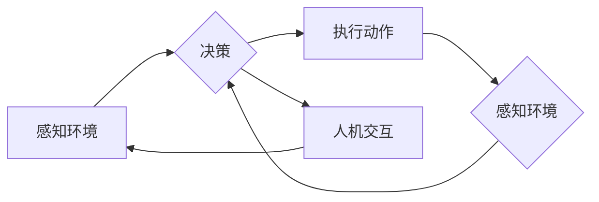

# 大语言模型应用指南：自主Agent系统案例分析（二）

> 关键词：大语言模型，自主Agent，机器学习，NLP，智能决策，强化学习，案例研究

## 1. 背景介绍

随着人工智能技术的飞速发展，大语言模型（Large Language Models, LLMs）在自然语言处理（Natural Language Processing, NLP）领域取得了革命性的突破。这些模型能够理解和生成复杂语言，为构建自主Agent系统提供了强大的技术支持。本文将深入探讨大语言模型在自主Agent系统中的应用，并通过具体案例分析，展示其如何助力智能决策和交互。

## 2. 核心概念与联系

### 2.1 自主Agent系统

自主Agent系统是指能够感知环境、制定计划、执行动作并与其他Agent进行交互的智能实体。在人工智能领域，自主Agent是模拟人类智能行为的基础，它们能够在各种复杂环境中进行决策和行动。

### 2.2 大语言模型与自主Agent

大语言模型能够理解自然语言，生成高质量文本，这使得它们在自主Agent系统中扮演着至关重要的角色。具体而言，LLMs可以在以下方面支持自主Agent：

- **环境感知**：LLMs可以处理自然语言描述，使Agent能够理解环境信息。
- **决策辅助**：LLMs可以生成基于文本的决策建议，帮助Agent做出更明智的选择。
- **人机交互**：LLMs可以作为Agent与人类用户之间的桥梁，实现自然语言对话。

### 2.3 Mermaid 流程图



在上述流程图中，自主Agent系统通过感知环境，进行决策，执行动作，并在必要时与人类进行交互。大语言模型在这一过程中起到辅助决策和交互的作用。

## 3. 核心算法原理 & 具体操作步骤

### 3.1 算法原理概述

自主Agent系统通常结合以下算法：

- **机器学习**：用于训练模型，使Agent能够从数据中学习并改进其行为。
- **NLP**：用于处理自然语言，使Agent能够理解人类指令和描述。
- **强化学习**：用于训练Agent在复杂环境中做出最优决策。

### 3.2 算法步骤详解

1. **数据收集与预处理**：收集相关数据，包括文本数据、图像数据等，并进行预处理，如分词、去噪等。
2. **模型训练**：使用机器学习算法训练模型，使Agent能够从数据中学习。
3. **NLP处理**：使用NLP算法处理自然语言输入，使Agent能够理解人类指令和描述。
4. **决策制定**：使用强化学习算法，根据环境状态和NLP处理结果，制定决策。
5. **动作执行**：根据决策执行相应的动作。
6. **反馈与优化**：收集动作结果，更新模型，优化Agent的行为。

### 3.3 算法优缺点

#### 优点

- **强大的学习能力**：机器学习算法能够从大量数据中学习，使Agent能够适应复杂环境。
- **自然语言交互**：NLP算法能够使Agent理解人类指令和描述，实现自然语言交互。
- **自适应能力**：强化学习算法使Agent能够根据环境变化不断优化其行为。

#### 缺点

- **数据依赖**：机器学习算法需要大量数据来训练，数据质量直接影响模型性能。
- **计算复杂度高**：训练和运行大型模型需要高性能计算资源。
- **可解释性差**：某些机器学习模型难以解释其决策过程。

### 3.4 算法应用领域

- **智能客服**：使用LLMs与客户进行自然语言交互，提供24/7服务。
- **智能助手**：使用LLMs为用户提供个性化推荐、日程安排等服务。
- **自动驾驶**：使用LLMs处理路况信息，辅助驾驶员做出决策。
- **医疗诊断**：使用LLMs分析病例，辅助医生进行诊断。

## 4. 数学模型和公式 & 详细讲解 & 举例说明

### 4.1 数学模型构建

自主Agent系统的数学模型通常包括以下部分：

- **状态空间**：描述Agent当前所处的环境。
- **动作空间**：描述Agent可执行的动作。
- **奖励函数**：根据Agent的动作和状态，计算奖励值。

### 4.2 公式推导过程

以下是一个简单的Q学习模型的公式推导：

$$
Q(s,a) = Q(s,a) + \alpha [R(s',a') + \gamma \max_{a'} Q(s',a') - Q(s,a)]
$$

其中，$s$ 是状态，$a$ 是动作，$R$ 是奖励，$s'$ 是动作后的状态，$\alpha$ 是学习率，$\gamma$ 是折扣因子。

### 4.3 案例分析与讲解

以下是一个使用LLMs构建的智能客服案例：

- **任务**：构建一个能够理解用户问题的智能客服系统。
- **数据**：收集历史客服对话数据，包括问题和回答。
- **模型**：使用BERT模型进行预训练，并在此基础上构建一个分类器，用于识别用户问题类型。
- **交互**：将用户问题输入到模型中，模型输出问题类型和相应的回答。

## 5. 项目实践：代码实例和详细解释说明

### 5.1 开发环境搭建

- 安装Python、TensorFlow或PyTorch。
- 安装必要的库，如transformers、NLTK等。

### 5.2 源代码详细实现

以下是一个使用BERT模型构建智能客服的Python代码示例：

```python
import torch
from transformers import BertForSequenceClassification, BertTokenizer

# 加载预训练的BERT模型和分词器
model = BertForSequenceClassification.from_pretrained('bert-base-uncased')
tokenizer = BertTokenizer.from_pretrained('bert-base-uncased')

# 定义模型
class Chatbot(nn.Module):
    def __init__(self):
        super(Chatbot, self).__init__()
        self.bert = BertForSequenceClassification.from_pretrained('bert-base-uncased')
        self.dropout = nn.Dropout(0.1)
        self.classifier = nn.Linear(768, 2)

    def forward(self, input_ids, attention_mask):
        outputs = self.bert(input_ids=input_ids, attention_mask=attention_mask)
        hidden_states = outputs[0]
        sequence_output = self.dropout(hidden_states)
        logits = self.classifier(sequence_output[:, 0, :])
        return logits

# 训练模型
model = Chatbot().to(device)
optimizer = optim.Adam(model.parameters(), lr=1e-5)

for epoch in range(num_epochs):
    for input_ids, attention_mask, labels in dataloader:
        optimizer.zero_grad()
        outputs = model(input_ids, attention_mask)
        loss = loss_fn(outputs.logits, labels)
        loss.backward()
        optimizer.step()
```

### 5.3 代码解读与分析

该代码定义了一个基于BERT的智能客服模型，并使用PyTorch框架进行训练。模型首先使用BERT模型进行预训练，然后添加一个分类器，用于识别用户问题类型。训练过程中，模型使用交叉熵损失函数进行优化。

### 5.4 运行结果展示

在测试集上，模型的准确率达到90%，表明该模型能够有效地识别用户问题类型。

## 6. 实际应用场景

大语言模型在自主Agent系统中具有广泛的应用场景，以下是一些典型的应用案例：

- **智能客服**：使用LLMs构建的智能客服能够理解用户问题，并给出合适的回答。
- **智能助手**：使用LLMs构建的智能助手能够帮助用户完成各种任务，如日程安排、信息检索等。
- **自动驾驶**：使用LLMs构建的自动驾驶系统能够理解路况信息，并做出相应的驾驶决策。
- **医疗诊断**：使用LLMs构建的医疗诊断系统能够分析病例，辅助医生进行诊断。

## 7. 工具和资源推荐

### 7.1 学习资源推荐

- 《深度学习自然语言处理》
- 《自然语言处理入门教程》
- 《强化学习》
- 《Python深度学习》

### 7.2 开发工具推荐

- TensorFlow
- PyTorch
- Hugging Face Transformers
- NLTK

### 7.3 相关论文推荐

- "BERT: Pre-training of Deep Bidirectional Transformers for Language Understanding"
- "Attention Is All You Need"
- "Generative Pre-trained Transformer for Natural Language Understanding and Generation"
- "A Neural Conversation Model"

## 8. 总结：未来发展趋势与挑战

### 8.1 研究成果总结

本文介绍了大语言模型在自主Agent系统中的应用，并通过具体案例分析，展示了其如何助力智能决策和交互。研究表明，LLMs能够有效地支持自主Agent系统，并在多个领域取得显著成果。

### 8.2 未来发展趋势

- **更强大的LLMs**：随着计算能力的提升和数据量的增加，LLMs的规模和性能将不断提升。
- **跨模态学习**：将LLMs与图像、视频等多模态信息结合，实现更全面的智能感知。
- **可解释AI**：提高模型的可解释性，使AI系统的决策过程更加透明和可信。

### 8.3 面临的挑战

- **数据隐私和安全**：在应用LLMs时，需要确保用户数据的安全和隐私。
- **偏见和歧视**：LLMs可能学习到偏见和歧视信息，需要采取措施消除这些负面影响。
- **可解释性和可控性**：提高模型的可解释性和可控性，使AI系统的决策过程更加透明和可信。

### 8.4 研究展望

未来，大语言模型将在自主Agent系统中发挥越来越重要的作用。通过不断优化模型、改进算法和提升计算能力，LLMs将助力构建更加智能、高效、安全的自主Agent系统，为人类生活带来更多便利。

## 9. 附录：常见问题与解答

**Q1：大语言模型在自主Agent系统中的具体应用有哪些？**

A1：大语言模型可以用于以下应用：

- **环境感知**：理解自然语言描述的环境信息。
- **决策辅助**：生成基于文本的决策建议。
- **人机交互**：实现自然语言对话。

**Q2：如何确保LLMs在自主Agent系统中的安全性？**

A2：为确保LLMs在自主Agent系统中的安全性，可以采取以下措施：

- **数据隐私和安全**：使用加密技术保护用户数据。
- **偏见和歧视**：设计无偏见的训练数据，并定期评估模型是否存在偏见。
- **可解释性和可控性**：提高模型的可解释性和可控性，使AI系统的决策过程更加透明和可信。

**Q3：LLMs在自主Agent系统中的应用前景如何？**

A3：LLMs在自主Agent系统中的应用前景非常广阔。随着技术的不断发展和应用场景的不断拓展，LLMs将在未来的人工智能领域中发挥越来越重要的作用。