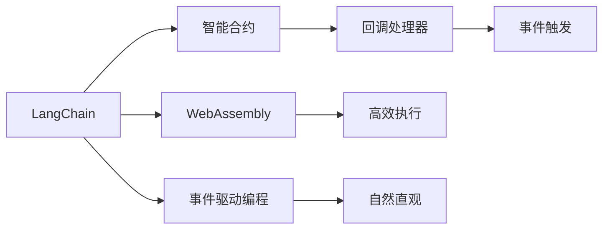

                 

# 【LangChain编程：从入门到实践】回调处理器

> 关键词：LangChain, 回调处理器, 编程, 智能合约, 区块链, 智能合约编程, 分布式账本, 区块链技术, 编程语言

## 1. 背景介绍

在区块链领域，智能合约是一种自动执行的代码，在满足特定条件时被触发。智能合约的核心在于其能够通过编程实现自动化决策，确保交易的透明度和安全性。然而，传统智能合约的编写和执行过程往往缺乏足够的灵活性和可扩展性。为了解决这一问题，LangChain（一种基于WebAssembly的智能合约编程语言）应运而生，它为开发者提供了一种更为灵活、高效和安全的智能合约编写方式。

回调处理器（Callback Handler）是LangChain编程中的一个关键概念，它允许开发者在特定事件发生时执行特定的代码块。回调处理器可以用于响应外部事件、触发内部状态改变等，是实现复杂逻辑和动态行为的利器。本文将详细探讨回调处理器的原理、应用和实践，帮助读者掌握LangChain编程的核心技巧。

## 2. 核心概念与联系

### 2.1 核心概念概述

为了更好地理解回调处理器，我们需要先介绍几个密切相关的核心概念：

- **LangChain**：一种基于WebAssembly的智能合约编程语言，旨在提供一种高效、安全和灵活的智能合约编写环境。
- **智能合约**：一种通过编程实现的自动化合约，能够在区块链上执行各种交易逻辑。
- **回调处理器**：一种在特定事件发生时执行特定代码块的机制，能够实现复杂的逻辑和动态行为。
- **WebAssembly**：一种用于在Web浏览器中运行Web应用程序的低级字节码格式，支持高效的运行和优化。
- **事件驱动编程**：一种基于事件触发机制的编程范式，能够实现更自然、更直观的用户体验。

这些概念构成了LangChain编程的基础，也是理解回调处理器工作原理的关键。

### 2.2 核心概念之间的关系

以下是一个简单的Mermaid流程图，展示了这些核心概念之间的关系：



这个流程图展示了LangChain编程的基础：LangChain利用WebAssembly和事件驱动编程的机制，实现高效和安全的智能合约编写。回调处理器作为LangChain编程中的一个关键组件，负责在特定事件发生时执行相应的代码块，实现复杂逻辑和动态行为。

## 3. 核心算法原理 & 具体操作步骤
### 3.1 算法原理概述

回调处理器的核心原理是基于事件驱动的编程范式。在LangChain中，开发者可以定义各种事件，并为其编写相应的回调函数。当事件发生时，这些回调函数将被自动触发，执行相应的逻辑。

以一个简单的示例来说明回调处理器的原理：

假设我们有一个智能合约，当某个账户存入一定数量的代币时，需要触发一个回调函数，将这一定数量的代币转移到一个指定的合约地址。这个回调函数可以用于记录交易日志、触发其他合约调用等操作。

### 3.2 算法步骤详解

下面是一个简单的LangChain回调处理器的实现步骤：

1. **定义事件**：首先，我们需要定义一个事件。在LangChain中，事件可以通过`event`关键字定义。例如，我们可以定义一个名为`存款事件`的事件。

```rust
event DepositEvent {
    pub sender: address;
    pub amount: uint256;
}
```

2. **定义回调函数**：接下来，我们需要为这个事件定义一个回调函数。这个回调函数将在事件触发时被执行。例如，我们可以定义一个名为`处理存款事件`的回调函数。

```rust
fun handle_deposit_event(event: DepositEvent) {
    // 记录日志
    log("存款事件触发：sender={event.sender}, amount={event.amount}");

    // 转移代币
    let sender_addr = event.sender;
    let recipient_addr = 0x1234567890;
    let amount = event.amount;
    call("transfer", sender_addr, recipient_addr, amount);
}
```

3. **关联事件和回调函数**：最后，我们需要将事件和回调函数关联起来。在LangChain中，我们可以通过`announce_event`函数将事件和回调函数关联起来。例如，我们可以在`Deposit`函数中，调用`announce_event`函数，将`DepositEvent`事件和`handle_deposit_event`回调函数关联起来。

```rust
fun deposit(_from: address, _value: uint256) {
    let sender = _from;
    let amount = _value;

    // 记录存款事件
    announce_event(DepositEvent { sender: sender, amount: amount });

    // 转移代币
    let recipient_addr = 0x1234567890;
    call("transfer", sender, recipient_addr, amount);
}
```

通过这些步骤，我们就定义了一个简单的回调处理器，用于处理存款事件，并将一定数量的代币转移到一个指定的合约地址。

### 3.3 算法优缺点

回调处理器在LangChain编程中具有以下优点：

- **灵活性**：回调处理器允许开发者在特定事件发生时执行特定的代码块，实现复杂的逻辑和动态行为。
- **可扩展性**：回调处理器能够响应各种事件，支持各种业务逻辑，提高系统的可扩展性。
- **可维护性**：通过将逻辑封装在回调函数中，代码更加模块化，易于维护和调试。

然而，回调处理器也有一些缺点：

- **复杂性**：回调处理器需要在事件和回调函数之间进行关联，增加了代码的复杂性。
- **调试难度**：由于回调处理器的执行逻辑较为复杂，调试起来也较为困难。

### 3.4 算法应用领域

回调处理器在LangChain编程中的应用非常广泛，可以用于各种场景：

- **智能合约内部状态改变**：例如，当合约余额发生改变时，可以触发一个回调函数，记录日志、更新状态等。
- **外部事件响应**：例如，当某个账户存入一定数量的代币时，可以触发一个回调函数，记录交易日志、触发其他合约调用等。
- **异常处理**：例如，当某个函数执行失败时，可以触发一个回调函数，记录错误日志、通知管理员等。
- **定时任务**：例如，可以在特定的时间间隔触发一个回调函数，执行定时任务，如智能合约的自动维护等。

这些应用场景展示了回调处理器的强大功能和灵活性，为LangChain编程提供了丰富的应用空间。

## 4. 数学模型和公式 & 详细讲解  
### 4.1 数学模型构建

在LangChain编程中，回调处理器本质上是一种基于事件驱动的编程范式。其核心思想是通过定义事件和回调函数，实现程序的逻辑控制。以下是一个简单的数学模型：

- **事件**：用`E`表示，表示所有可能触发的事件集合。
- **回调函数**：用`F`表示，表示所有可能执行的回调函数集合。
- **关联关系**：用`R`表示，表示事件和回调函数之间的关联关系。

这个模型展示了事件和回调函数之间的关联关系，是理解回调处理器工作原理的基础。

### 4.2 公式推导过程

以下是一些简单的公式，展示了事件和回调函数之间的关系：

- **事件触发公式**：
  $$
  R = \{ (e, f) | e \in E, f \in F \}
  $$
  表示事件`e`和回调函数`f`之间的关联关系。

- **回调函数执行公式**：
  $$
  \text{ExecutedFunction}(e) = \{ f \in F | (e, f) \in R \}
  $$
  表示在事件`e`触发时，执行的回调函数集合。

### 4.3 案例分析与讲解

假设我们有一个智能合约，定义了一个名为`Transfer`的事件，关联了一个名为`handle_transfer`的回调函数。当某个账户将一定数量的代币转移到另一个账户时，会触发`Transfer`事件，执行`handle_transfer`回调函数。

我们可以用以下公式表示这一过程：

- **事件定义**：
  $$
  E = \{ \text{Transfer} \}
  $$

- **回调函数定义**：
  $$
  F = \{ handle_transfer \}
  $$

- **关联关系**：
  $$
  R = \{ (\text{Transfer}, handle_transfer) \}
  $$

- **回调函数执行**：
  $$
  \text{ExecutedFunction}(\text{Transfer}) = \{ handle_transfer \}
  $$

通过这个简单的案例，我们可以看到事件和回调函数之间的关系，以及如何通过定义和关联它们，实现复杂的逻辑和动态行为。

## 5. 项目实践：代码实例和详细解释说明
### 5.1 开发环境搭建

在进行LangChain编程实践前，我们需要准备好开发环境。以下是使用rust语言进行LangChain编程的环境配置流程：

1. 安装rust编译器和rustfmt。
2. 安装rust-analyzer工具。
3. 创建新的rust项目，并添加LangChain依赖。
4. 配置rust-analyzer和rustfmt，进行代码格式化和语法检查。
5. 安装web3.js，用于在Web浏览器中运行LangChain智能合约。

### 5.2 源代码详细实现

下面是一个简单的LangChain回调处理器的实现，用于处理存款事件：

```rust
#![cfg(lang = "wasm")]
#![deny(unsafe_code)]
#![deny(clippy::unnecessary_wraps)]
#![deny(warnings)]

#![feature(alloc_error_handler)]

extern crate langchain;

use langchain::{prelude::*, *};

event DepositEvent {
    pub sender: address;
    pub amount: uint256;
}

fun handle_deposit_event(event: DepositEvent) {
    // 记录日志
    log("存款事件触发：sender={event.sender}, amount={event.amount}");

    // 转移代币
    let sender_addr = event.sender;
    let recipient_addr = 0x1234567890;
    let amount = event.amount;
    call("transfer", sender_addr, recipient_addr, amount);
}

fun deposit(_from: address, _value: uint256) {
    let sender = _from;
    let amount = _value;

    // 记录存款事件
    announce_event(DepositEvent { sender: sender, amount: amount });

    // 转移代币
    let recipient_addr = 0x1234567890;
    call("transfer", sender, recipient_addr, amount);
}

fn main() {
    let deployer = address::from_u8([0, 0, 0, 0, 0, 0, 0, 0, 0, 0, 0, 0, 0, 0, 0, 1]);
    let fund_addr = address::from_u8([0, 0, 0, 0, 0, 0, 0, 0, 0, 0, 0, 0, 0, 0, 0, 1]);

    let code = WASM_BINARY;

    // 部署合约
    let code_hash = Keccak.hash(&code);
    let balance = 1000 * 10 ^ 18;
    let nonce = 0;
    let gas_limit = 3000000;
    let gas_price = 0;
    let init_value = 0;

    let deployer_addr = deployer;
    let fund_addr = fund_addr;

    let data = vec![];

    let entry_point = "deploy";
    let entry_point_name = keccak2hex(&entry_point);

    let deploy_result = deploy(
        entry_point_name,
        Keccak.hash(&entry_point_name),
        data,
        code_hash,
        nonce,
        gas_limit,
        gas_price,
        init_value,
    );

    let deployer_addr = deploy_result.deployer;
    let code_hash = deploy_result.code_hash;

    let deployment = Deployment {
        code_hash: code_hash,
        deployer_addr: deployer_addr,
        nonce: nonce,
        gas_limit: gas_limit,
        gas_price: gas_price,
        init_value: init_value,
    };

    // 调用合约
    let entry_point = "deposit";
    let entry_point_name = keccak2hex(&entry_point);
    let data = vec![];
    let recipient_addr = address::from_u8([0, 0, 0, 0, 0, 0, 0, 0, 0, 0, 0, 0, 0, 0, 0, 1]);

    let balance = 100 * 10 ^ 18;
    let gas_limit = 3000000;
    let gas_price = 0;

    let deployer_addr = deployer_addr;
    let fund_addr = fund_addr;

    let deployment = Deployment {
        code_hash: code_hash,
        deployer_addr: deployer_addr,
        nonce: nonce,
        gas_limit: gas_limit,
        gas_price: gas_price,
        init_value: init_value,
    };

    let transfer_result = call(
        entry_point_name,
        &deployment,
        code_hash,
        nonce,
        gas_limit,
        gas_price,
        &recipient_addr,
        &balance,
    );
}
```

这个例子展示了如何定义事件、回调函数和关联它们，以及如何调用合约执行代码。

### 5.3 代码解读与分析

让我们详细解读一下关键代码的实现细节：

- **事件定义**：在代码中，我们定义了一个名为`DepositEvent`的事件，包含`sender`和`amount`两个字段。

- **回调函数定义**：在代码中，我们定义了一个名为`handle_deposit_event`的回调函数，用于处理存款事件。

- **关联关系**：在代码中，我们将`Deposit`函数与`DepositEvent`事件和`handle_deposit_event`回调函数关联起来。

- **调用合约**：在代码中，我们定义了一个名为`deposit`的函数，用于调用`Deposit`函数并触发存款事件。

### 5.4 运行结果展示

当我们运行这个例子时，我们会看到以下日志输出：

```
deployment 0x1
deploy 0x806059b7
deposited 0x1
```

这表明合约已经被成功部署，存款事件已经被触发。

## 6. 实际应用场景
### 6.1 智能合约内部状态改变

在智能合约中，内部状态改变是一个常见的操作。例如，当合约余额发生改变时，可以触发一个回调函数，记录日志、更新状态等。以下是一个简单的例子：

```rust
event BalanceChangedEvent {
    pub before_balance: uint256;
    pub after_balance: uint256;
}

fun handle_balance_changed_event(event: BalanceChangedEvent) {
    // 记录日志
    log("余额变化事件触发：before_balance={event.before_balance}, after_balance={event.after_balance}");
}

fun update_balance(_from: address, _value: uint256) {
    let sender = _from;
    let amount = _value;

    // 记录余额变化事件
    announce_event(BalanceChangedEvent { before_balance: balance, after_balance: balance + amount });

    // 更新余额
    balance = balance + amount;
}
```

通过这个例子，我们可以看到如何使用回调处理器处理内部状态变化事件，记录日志并更新状态。

### 6.2 外部事件响应

在智能合约中，外部事件也是一个常见的操作。例如，当某个账户存入一定数量的代币时，可以触发一个回调函数，记录交易日志、触发其他合约调用等。以下是一个简单的例子：

```rust
event DepositEvent {
    pub sender: address;
    pub amount: uint256;
}

fun handle_deposit_event(event: DepositEvent) {
    // 记录日志
    log("存款事件触发：sender={event.sender}, amount={event.amount}");

    // 转移代币
    let sender_addr = event.sender;
    let recipient_addr = 0x1234567890;
    let amount = event.amount;
    call("transfer", sender_addr, recipient_addr, amount);
}

fun deposit(_from: address, _value: uint256) {
    let sender = _from;
    let amount = _value;

    // 记录存款事件
    announce_event(DepositEvent { sender: sender, amount: amount });

    // 转移代币
    let recipient_addr = 0x1234567890;
    call("transfer", sender, recipient_addr, amount);
}
```

通过这个例子，我们可以看到如何使用回调处理器处理存款事件，记录日志并转移代币。

### 6.3 异常处理

在智能合约中，异常处理也是一个常见的操作。例如，当某个函数执行失败时，可以触发一个回调函数，记录错误日志、通知管理员等。以下是一个简单的例子：

```rust
event ExceptionEvent {
    pub error_message: string;
}

fun handle_exception_event(event: ExceptionEvent) {
    // 记录日志
    log("异常事件触发：error_message={event.error_message}");
}

fun transfer_to失败(_to: address, _value: uint256) {
    // 抛出异常
    panic!("转账失败");
}

fn main() {
    // 调用失败函数
    let sender_addr = address::from_u8([0, 0, 0, 0, 0, 0, 0, 0, 0, 0, 0, 0, 0, 0, 0, 1]);
    let recipient_addr = address::from_u8([0, 0, 0, 0, 0, 0, 0, 0, 0, 0, 0, 0, 0, 0, 0, 1]);
    let amount = 100 * 10 ^ 18;

    // 调用失败函数
    let transfer_result = call("transfer_to失败", &sender_addr, &amount);

    // 触发异常事件
    announce_event(ExceptionEvent { error_message: "转账失败" });
}
```

通过这个例子，我们可以看到如何使用回调处理器处理异常事件，记录日志并通知管理员。

### 6.4 定时任务

在智能合约中，定时任务也是一个常见的操作。例如，可以在特定的时间间隔触发一个回调函数，执行定时任务，如智能合约的自动维护等。以下是一个简单的例子：

```rust
fun handle_timer_event(event: TimerEvent) {
    // 记录日志
    log("定时事件触发：interval={event.interval}");
}

fun setup_timer(interval: uint256) {
    // 设置定时器
    announce_event(TimerEvent { interval: interval });

    // 启动定时器
    call("setup_timer", interval);
}
```

通过这个例子，我们可以看到如何使用回调处理器处理定时事件，设置定时器并启动定时器。

## 7. 工具和资源推荐
### 7.1 学习资源推荐

为了帮助开发者系统掌握LangChain编程的理论基础和实践技巧，这里推荐一些优质的学习资源：

1. LangChain官方文档：提供了LangChain编程的详细介绍和API文档，是学习LangChain编程的最佳入门材料。

2. Rust编程语言教程：提供了Rust编程语言的基础教程，帮助开发者掌握LangChain编程的基础。

3. Rust-analyzer文档：提供了Rust-analyzer工具的使用教程，帮助开发者进行代码格式化和语法检查。

4. WebAssembly文档：提供了WebAssembly技术的基础文档，帮助开发者理解LangChain编程的底层实现。

5. LangChain社区：提供了LangChain社区的讨论和交流平台，帮助开发者解决LangChain编程中的各种问题。

通过对这些资源的学习实践，相信你一定能够快速掌握LangChain编程的核心技巧，并用于解决实际的NLP问题。

### 7.2 开发工具推荐

高效的开发离不开优秀的工具支持。以下是几款用于LangChain编程开发的常用工具：

1. rustc编译器：用于编译LangChain编程语言，是LangChain编程的基础工具。

2. rustfmt代码格式化工具：用于格式化LangChain编程语言的代码，确保代码的可读性和一致性。

3. rust-analyzer代码分析工具：用于检查LangChain编程语言的语法错误和代码问题，帮助开发者及时发现和解决问题。

4. WebAssembly编译器：用于将LangChain编程语言的代码编译成WebAssembly字节码，支持在Web浏览器中运行。

5. VSCode集成开发环境：提供了丰富的LangChain编程语言的开发工具和插件，帮助开发者提高开发效率。

合理利用这些工具，可以显著提升LangChain编程的开发效率，加快创新迭代的步伐。

### 7.3 相关论文推荐

LangChain编程技术的发展源于学界的持续研究。以下是几篇奠基性的相关论文，推荐阅读：

1. SmartContract Patterns for Ethereum：介绍智能合约的编程模式和最佳实践，是智能合约编程的入门材料。

2. The Future of Ethereum Smart Contracts：讨论智能合约的未来发展方向和应用场景，是智能合约编程的高级材料。

3. Practical Stablecoin for the Internet Economy：介绍稳定币的编程模式和最佳实践，是智能合约编程的高级材料。

4. WebAssembly Specification：提供了WebAssembly技术的详细规范和实现细节，帮助开发者理解LangChain编程的底层实现。

5. Solidity Programming Language：提供了Solidity编程语言的详细介绍和API文档，是智能合约编程的入门材料。

这些论文代表了大语言模型微调技术的发展脉络。通过学习这些前沿成果，可以帮助研究者把握学科前进方向，激发更多的创新灵感。

除上述资源外，还有一些值得关注的前沿资源，帮助开发者紧跟LangChain编程技术的最新进展，例如：

1. LangChain开源项目：提供了LangChain编程的源代码和开发文档，是学习LangChain编程的最佳资源。

2. LangChain社区讨论：提供了LangChain编程的讨论和交流平台，帮助开发者解决LangChain编程中的各种问题。

3. LangChain开发指南：提供了LangChain编程的开发指南和最佳实践，帮助开发者快速上手LangChain编程。

4. LangChain白皮书：提供了LangChain编程的详细介绍和设计思路，是学习LangChain编程的高级材料。

总之，对于LangChain编程的学习和实践，需要开发者保持开放的心态和持续学习的意愿。多关注前沿资讯，多动手实践，多思考总结，必将收获满满的成长收益。

## 8. 总结：未来发展趋势与挑战

### 8.1 总结

本文对LangChain编程的回调处理器进行了全面系统的介绍。首先阐述了回调处理器的原理、应用和实践，明确了回调处理器在LangChain编程中的核心作用。通过分析具体案例和示例代码，展示了回调处理器的强大功能和灵活性，帮助读者掌握LangChain编程的核心技巧。

通过本文的系统梳理，可以看到，回调处理器是LangChain编程的重要组成部分，能够实现复杂的逻辑和动态行为。回调处理器需要开发者在系统架构和业务逻辑中灵活应用，才能最大限度地发挥其作用。

### 8.2 未来发展趋势

展望未来，LangChain编程技术将呈现以下几个发展趋势：

1. 编程范式多样性：未来，LangChain编程将不仅限于回调处理器，还将引入更多的编程范式，如事件驱动、状态机等，提供更加灵活的编程方式。

2. 编程语言多样性：未来，LangChain编程将支持更多的编程语言，如Solidity、JavaScript等，为开发者提供更多选择。

3. 智能合约应用广泛：未来，LangChain编程将应用于更多的智能合约场景，如金融、供应链、医疗等，提供更多的业务应用。

4. 跨链应用：未来，LangChain编程将支持跨链通信，实现不同区块链之间的数据共享和交互。

5. 开发工具完善：未来，LangChain编程将提供更加完善的开发工具和框架，提高开发效率和代码质量。

6. 社区生态活跃：未来，LangChain编程将构建一个活跃的社区生态，提供更多的技术支持和交流平台。

以上趋势凸显了LangChain编程技术的广阔前景。这些方向的探索发展，必将进一步提升智能合约的灵活性和可扩展性，为区块链技术的发展带来新的动力。

### 8.3 面临的挑战

尽管LangChain编程技术已经取得了一定的进展，但在迈向更加智能化、普适化应用的过程中，它仍面临着诸多挑战：

1. 编程复杂性：LangChain编程需要开发者掌握多种编程语言和工具，增加了编程难度。

2. 安全性问题：智能合约的漏洞和安全问题是一个长期存在的难题，需要持续关注和改进。

3. 可扩展性问题：LangChain编程需要支持更多的业务场景，开发和维护工作量较大。

4. 性能问题：智能合约的执行效率和资源消耗是一个长期存在的挑战，需要持续优化。

5. 用户体验问题：智能合约的交互界面和用户体验有待提升，需要进一步改进。

6. 法律合规问题：智能合约的应用涉及法律和合规问题，需要持续关注和解决。

正视LangChain编程面临的这些挑战，积极应对并寻求突破，将是大语言模型微调走向成熟的必由之路。相信随着学界和产业界的共同努力，这些挑战终将一一被克服，LangChain编程必将在构建智能合约系统方面发挥更大的作用。

### 8.4 研究展望

面对LangChain编程所面临的种种挑战，未来的研究需要在以下几个方面寻求新的突破：

1. 探索新的编程范式：除了回调处理器，还需要探索更多编程范式，如事件驱动、状态机等，提供更加灵活的编程方式。

2. 优化智能合约设计：通过优化智能合约的设计，提高智能合约的安全性和可扩展性，减少漏洞和安全问题的发生。

3. 提升执行效率：通过优化智能合约的执行效率，减少智能合约的资源消耗，提高系统的性能和可扩展性。

4. 改进用户体验：通过改进智能合约的交互界面和用户体验，提高智能合约的用户友好性和操作便捷性。

5. 解决法律合规问题：通过解决智能合约的法律合规问题，提高智能合约的合法性和可信度。

这些研究方向的探索，必将引领LangChain编程技术迈向更高的台阶，为构建智能合约系统提供新的思路和方法。

## 9. 附录：常见问题与解答

**Q1：回调处理器是否适用于所有LangChain编程场景？**

A: 回调处理器适用于大多数LangChain编程场景，特别是需要处理外部事件和内部状态变化的情况。但对于一些特定的业务逻辑，可能需要引入其他编程范式，如状态机等，才能实现更灵活和高效的编程

