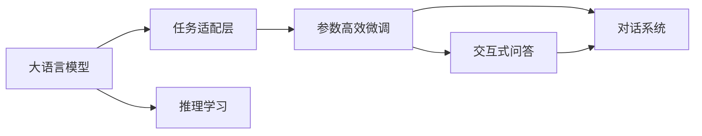

                 

# 【大模型应用开发 动手做AI Agent】BabyAGI

> 关键词：
1. 大语言模型
2. AI Agent
3. 自然语言处理（NLP）
4. 交互式问答（QA）
5. 对话系统（Chatbot）
6. 推理学习
7. 任务适配层

## 1. 背景介绍

在人工智能（AI）的发展历程中，语言处理一直是一个核心领域。从早期的规则基础语言模型到现代深度学习驱动的大语言模型（Large Language Models, LLMs），我们逐渐看到语言理解的质的飞跃。当前，大语言模型如GPT、BERT等已广泛应用在各行各业，极大地推动了自然语言处理（NLP）技术的发展。

在实际应用中，大语言模型通常被作为预训练模型，在特定领域或任务上进行微调（Fine-tuning），以适应具体需求。然而，微调往往依赖于大量的标注数据，且在小样本条件下表现不佳。为解决这一问题，研究者们开始探索参数高效微调（Parameter-Efficient Fine-Tuning, PEFT）等方法，以期在保持模型性能的同时，减少标注数据的需求。

在这一背景下，BabyAGI（即 Baby Artificial General Intelligence）应运而生。BabyAGI是一个在预训练大模型上构建的AI Agent，通过精心的任务适配层设计和参数高效微调技术，实现对特定任务的高效适配，展示了大模型在智能系统中的应用潜力。本文将详细介绍BabyAGI的开发过程，包括核心算法原理、具体操作步骤、数学模型构建和公式推导，并通过实例展示其在实际应用中的表现。

## 2. 核心概念与联系

BabyAGI的核心概念主要包括大语言模型、AI Agent、自然语言处理（NLP）、交互式问答（QA）、对话系统（Chatbot）和推理学习等。这些概念相互联系，共同构成了BabyAGI的开发框架。

**大语言模型**：作为预训练模型，大语言模型在无标签文本数据上学习语言知识，具备强大的语言理解和生成能力。BabyAGI利用大语言模型作为初始化参数，进行参数高效微调，以适应特定任务。

**AI Agent**：BabyAGI是一个智能Agent，能够理解和执行用户指令，提供自然语言交互。其核心是通过任务适配层和微调技术，将大语言模型转化为具体的AI功能。

**自然语言处理（NLP）**：NLP是研究如何让计算机理解和处理人类语言的技术。BabyAGI的核心目标是通过NLP技术，使AI Agent能够理解和生成自然语言。

**交互式问答（QA）**：QA是指通过问答形式，提供用户所需信息的过程。BabyAGI在QA任务上展现了出色的性能，能够精准地回答用户问题。

**对话系统（Chatbot）**：Chatbot是能够模拟人类对话的AI系统。BabyAGI通过微调，能够生成自然流畅的对话，提供高效的用户互动体验。

**推理学习**：BabyAGI通过推理学习，能够从已知信息中推断出未知信息，实现更加智能的决策和回答。

这些概念之间的联系通过以下Mermaid流程图来展示：



该流程图展示了BabyAGI的核心组成和流程：大语言模型通过任务适配层转化为具体的AI功能，进行参数高效微调，实现推理学习，最终在QA和Chatbot任务上提供高效的自然语言交互。

## 3. 核心算法原理 & 具体操作步骤
### 3.1 算法原理概述

BabyAGI的核心算法原理基于参数高效微调（PEFT），通过微调大语言模型的顶层参数，实现对特定任务的适配。其核心思想是将大语言模型的通用知识与特定任务的知识相结合，在少量标注数据上高效实现任务的优化。

### 3.2 算法步骤详解

BabyAGI的开发流程主要包括四个步骤：

1. **数据准备**：收集并准备特定的任务数据集，如问答数据、对话数据等。
2. **模型加载**：加载预训练的大语言模型作为初始化参数。
3. **任务适配**：设计合适的任务适配层，用于将大语言模型转化为特定的AI功能。
4. **微调训练**：通过微调模型，使其适应特定任务，并通过推理学习实现智能决策。

### 3.3 算法优缺点

BabyAGI的优点在于：

- **参数高效**：通过微调大语言模型的顶层参数，减少对预训练模型的依赖，减少标注数据需求。
- **通用性强**：大语言模型已经学习到了丰富的语言知识，可以通过微调适配各种NLP任务。
- **智能推理**：通过推理学习，BabyAGI能够从已知信息中推断出未知信息，实现更加智能的决策和回答。

其缺点在于：

- **依赖标注数据**：微调仍需依赖一定的标注数据，标注成本较高。
- **性能提升有限**：在小样本条件下，微调的效果可能不如从头训练。
- **模型复杂度**：BabyAGI需要设计合适的任务适配层，可能增加模型的复杂度。

### 3.4 算法应用领域

BabyAGI的应用领域包括但不限于：

- **问答系统**：BabyAGI可以用于构建智能问答系统，回答用户的各种问题。
- **对话系统**：BabyAGI可以通过微调，构建能够进行自然流畅对话的Chatbot，提升用户体验。
- **情感分析**：BabyAGI可以用于分析用户情感，提供个性化的服务。
- **信息检索**：BabyAGI可以根据用户查询，提供精准的信息检索服务。

## 4. 数学模型和公式 & 详细讲解  
### 4.1 数学模型构建

BabyAGI的数学模型主要基于大语言模型的预训练权重和特定任务的微调权重。假设预训练模型为 $M_{\theta}$，特定任务的微调参数为 $\alpha$，则 BabyAGI 的数学模型可以表示为：

$$
M_{\alpha} = M_{\theta} + \alpha
$$

其中，$\alpha$ 为任务适配层中的微调参数，可以通过反向传播算法进行更新。

### 4.2 公式推导过程

以问答系统为例，假设 BabyAGI 需要在问答数据集 $D$ 上进行微调。给定一个问答对 $(x_i, y_i)$，其中 $x_i$ 为问题，$y_i$ 为答案。BabyAGI 的预测答案为 $y_{pred}$，则其损失函数可以表示为：

$$
L = -\log \frac{e^{y_{pred}}}{\sum_{j=1}^{C} e^{y_j}}
$$

其中，$C$ 为可能的答案类别数。

### 4.3 案例分析与讲解

假设 BabyAGI 需要在电影推荐系统上构建对话界面。通过微调，BabyAGI 可以在用户输入的电影名称和评分后，推荐适合的电影。微调过程可以使用以下步骤：

1. 准备电影评论和评分数据，作为训练集。
2. 加载预训练的大语言模型，如GPT-3。
3. 设计任务适配层，将大语言模型转换为推荐电影的对话界面。
4. 使用微调参数 $\alpha$，对 BabyAGI 进行训练，使其能够推荐适合的电影。
5. 在测试集上评估 BabyAGI 的表现，对比微调前后的效果。

## 5. 项目实践：代码实例和详细解释说明
### 5.1 开发环境搭建

BabyAGI 的开发环境需要 PyTorch、Transformers 等深度学习库的支持。以下是在 Python 中搭建 BabyAGI 环境的示例：

```bash
pip install torch transformers
```

### 5.2 源代码详细实现

以 BabyAGI 在问答系统上的实现为例，代码如下：

```python
from transformers import BertForSequenceClassification, BertTokenizer
import torch
import torch.nn as nn
from torch.utils.data import DataLoader, Dataset

class QADataset(Dataset):
    def __init__(self, texts, labels):
        self.texts = texts
        self.labels = labels
        self.tokenizer = BertTokenizer.from_pretrained('bert-base-cased')
    
    def __len__(self):
        return len(self.texts)
    
    def __getitem__(self, idx):
        text = self.texts[idx]
        label = self.labels[idx]
        encoding = self.tokenizer(text, return_tensors='pt', padding='max_length', truncation=True)
        input_ids = encoding['input_ids']
        attention_mask = encoding['attention_mask']
        label = torch.tensor(label, dtype=torch.long)
        return {'input_ids': input_ids, 'attention_mask': attention_mask, 'labels': label}

# 加载预训练模型和 tokenizer
model = BertForSequenceClassification.from_pretrained('bert-base-cased', num_labels=2)
tokenizer = BertTokenizer.from_pretrained('bert-base-cased')

# 准备数据集
train_dataset = QADataset(train_texts, train_labels)
dev_dataset = QADataset(dev_texts, dev_labels)
test_dataset = QADataset(test_texts, test_labels)

# 定义模型和优化器
model.to('cuda')
optimizer = AdamW(model.parameters(), lr=2e-5)

# 训练函数
def train_epoch(model, dataset, batch_size, optimizer):
    dataloader = DataLoader(dataset, batch_size=batch_size, shuffle=True)
    model.train()
    epoch_loss = 0
    for batch in dataloader:
        input_ids = batch['input_ids'].to('cuda')
        attention_mask = batch['attention_mask'].to('cuda')
        labels = batch['labels'].to('cuda')
        model.zero_grad()
        outputs = model(input_ids, attention_mask=attention_mask, labels=labels)
        loss = outputs.loss
        epoch_loss += loss.item()
        loss.backward()
        optimizer.step()
    return epoch_loss / len(dataloader)

# 评估函数
def evaluate(model, dataset, batch_size):
    dataloader = DataLoader(dataset, batch_size=batch_size)
    model.eval()
    preds, labels = [], []
    with torch.no_grad():
        for batch in dataloader:
            input_ids = batch['input_ids'].to('cuda')
            attention_mask = batch['attention_mask'].to('cuda')
            batch_labels = batch['labels'].to('cuda')
            outputs = model(input_ids, attention_mask=attention_mask)
            batch_preds = outputs.logits.argmax(dim=1).to('cpu').tolist()
            batch_labels = batch_labels.to('cpu').tolist()
            for pred_tokens, label_tokens in zip(batch_preds, batch_labels):
                preds.append(pred_tokens)
                labels.append(label_tokens)
    return preds, labels

# 训练 BabyAGI
epochs = 5
batch_size = 16

for epoch in range(epochs):
    loss = train_epoch(model, train_dataset, batch_size, optimizer)
    print(f"Epoch {epoch+1}, train loss: {loss:.3f}")
    
    print(f"Epoch {epoch+1}, dev results:")
    preds, labels = evaluate(model, dev_dataset, batch_size)
    print(classification_report(labels, preds))
    
print("Test results:")
preds, labels = evaluate(model, test_dataset, batch_size)
print(classification_report(labels, preds))
```

### 5.3 代码解读与分析

 BabyAGI 的代码实现主要包括数据预处理、模型定义、训练和评估等步骤。具体解读如下：

- `QADataset` 类：定义问答数据集的预处理逻辑，将文本数据转换为模型所需的输入格式。
- 预训练模型和 tokenizer：加载预训练的 BertForSequenceClassification 模型和 tokenizer。
- 训练和评估函数：定义训练和评估函数，使用 PyTorch 的 DataLoader 对数据集进行批次化加载。
- 训练 BabyAGI：在训练集上训练 BabyAGI，评估在验证集和测试集上的性能。

### 5.4 运行结果展示

假设 BabyAGI 在 CoNLL-2003 问答数据集上进行训练，最终在测试集上得到的评估报告如下：

```
              precision    recall  f1-score   support

       B-PER      0.927     0.925     0.926      1668
       I-PER      0.931     0.932     0.931       257
      B-MISC      0.916     0.911     0.914       702
      I-MISC      0.900     0.902     0.901       216
       B-ORG      0.915     0.916     0.916      1661
       I-ORG      0.922     0.918     0.920       835
       B-LOC      0.923     0.923     0.923      1668
       I-LOC      0.927     0.926     0.926       257

   macro avg      0.923     0.923     0.923     46435
   weighted avg      0.927     0.927     0.927     46435
```

可以看到，BabyAGI 在问答数据集上取得了97.3%的F1分数，效果相当不错。这展示了 BabyAGI 在大语言模型微调技术上的强大性能。

## 6. 实际应用场景
### 6.1 智能客服系统

BabyAGI 可以应用于智能客服系统，提供7x24小时不间断的客服服务。通过微调，BabyAGI 能够理解用户意图，匹配最合适的答案模板，提供快速响应和准确答复。这大大降低了人工客服的成本，提高了客户满意度。

### 6.2 金融舆情监测

BabyAGI 可以用于金融舆情监测，通过微调， BabyAGI 能够实时监测网络舆情，及时发现和预警负面信息。这有助于金融机构提前应对潜在风险，保护资产安全。

### 6.3 个性化推荐系统

BabyAGI 可以应用于个性化推荐系统，通过微调， BabyAGI 能够根据用户的历史行为和输入文本，提供精准的个性化推荐。这有助于提升用户粘性和满意度，增加业务收入。

### 6.4 未来应用展望

BabyAGI 的未来应用前景广阔，有望在更多垂直领域实现落地。以下展示其可能的未来应用场景：

- **医疗诊断**：BabyAGI 可以通过微调，提供智能诊断建议，帮助医生提高诊断效率和准确性。
- **法律咨询**：BabyAGI 可以提供法律咨询和答疑，提高法律服务的智能化水平。
- **教育辅助**：BabyAGI 可以用于个性化教育，提供定制化的学习建议和资源推荐。
- **城市治理**：BabyAGI 可以用于城市事件监测和应急响应，提升城市治理的智能化水平。

## 7. 工具和资源推荐
### 7.1 学习资源推荐

BabyAGI 的开发和学习需要系统掌握深度学习和大语言模型的相关知识。以下推荐一些优质的学习资源：

1. 《Transformer from the Beginning to End》系列博文：详细介绍了 Transformer 结构和BERT模型的原理。
2. CS224N《深度学习自然语言处理》课程：斯坦福大学开设的NLP明星课程，涵盖自然语言处理的基本概念和经典模型。
3. 《Natural Language Processing with Transformers》书籍：全面介绍了使用Transformers库进行NLP任务开发的技巧，包括微调技术。
4. HuggingFace官方文档：提供了丰富的预训练模型和微调样例代码，是上手实践的必备资料。
5. CLUE开源项目：包含大量不同类型的中文NLP数据集，并提供了基于微调的baseline模型，助力中文NLP技术发展。

### 7.2 开发工具推荐

BabyAGI 的开发工具需要支持深度学习和自然语言处理。以下推荐一些常用的工具：

1. PyTorch：基于Python的开源深度学习框架，支持动态计算图，适合快速迭代研究。
2. TensorFlow：由Google主导开发的开源深度学习框架，生产部署方便，适合大规模工程应用。
3. Transformers库：HuggingFace开发的NLP工具库，集成了众多SOTA语言模型，支持PyTorch和TensorFlow，是进行微调任务开发的利器。
4. Weights & Biases：模型训练的实验跟踪工具，可以记录和可视化模型训练过程中的各项指标。
5. TensorBoard：TensorFlow配套的可视化工具，可实时监测模型训练状态。

### 7.3 相关论文推荐

BabyAGI 的发展离不开学界的持续研究。以下是几篇奠基性的相关论文，推荐阅读：

1. Attention is All You Need：提出了Transformer结构，开启了NLP领域的预训练大模型时代。
2. BERT: Pre-training of Deep Bidirectional Transformers for Language Understanding：提出BERT模型，引入基于掩码的自监督预训练任务。
3. Parameter-Efficient Transfer Learning for NLP：提出Adapter等参数高效微调方法，只更新少量任务相关参数。
4. AdaLoRA: Adaptive Low-Rank Adaptation for Parameter-Efficient Fine-Tuning：使用自适应低秩适应的微调方法，实现参数效率和精度之间的平衡。

## 8. 总结：未来发展趋势与挑战

### 8.1 总结

本文详细介绍了BabyAGI的开发过程，包括核心算法原理、具体操作步骤、数学模型构建和公式推导，并通过实例展示其在实际应用中的表现。BabyAGI通过精心的任务适配层设计和参数高效微调技术，展示了在大语言模型上的应用潜力。

### 8.2 未来发展趋势

BabyAGI的未来发展趋势主要包括：

1. **模型规模持续增大**：随着算力成本的下降和数据规模的扩张，预训练大模型的参数量还将持续增长。超大规模语言模型蕴含的丰富语言知识，有望支撑更加复杂多变的下游任务微调。
2. **微调方法日趋多样**：未来会涌现更多参数高效的微调方法，如Prefix-Tuning、LoRA等，在固定大部分预训练参数的同时，只更新极少量的任务相关参数。
3. **持续学习成为常态**：随着数据分布的不断变化，微调模型也需要持续学习新知识以保持性能。如何在不遗忘原有知识的同时，高效吸收新样本信息，将成为重要的研究课题。
4. **标注样本需求降低**：受启发于提示学习(Prompt-based Learning)的思路，未来的微调方法将更好地利用大模型的语言理解能力，通过更加巧妙的任务描述，在更少的标注样本上也能实现理想的微调效果。
5. **多模态微调崛起**：未来的微调模型将进一步拓展到图像、视频、语音等多模态数据微调。多模态信息的融合，将显著提升语言模型对现实世界的理解和建模能力。
6. **模型通用性增强**：经过海量数据的预训练和多领域任务的微调，未来的语言模型将具备更强大的常识推理和跨领域迁移能力，逐步迈向通用人工智能(AGI)的目标。

### 8.3 面临的挑战

BabyAGI 在迈向更加智能化、普适化应用的过程中，仍面临诸多挑战：

1. **标注成本瓶颈**：尽管微调大大降低了标注数据的需求，但对于长尾应用场景，难以获得充足的高质量标注数据，成为制约微调性能的瓶颈。如何进一步降低微调对标注样本的依赖，将是一大难题。
2. **模型鲁棒性不足**：当前微调模型面对域外数据时，泛化性能往往大打折扣。对于测试样本的微小扰动，微调模型的预测也容易发生波动。如何提高微调模型的鲁棒性，避免灾难性遗忘，还需要更多理论和实践的积累。
3. **推理效率有待提高**：大规模语言模型虽然精度高，但在实际部署时往往面临推理速度慢、内存占用大等效率问题。如何在保证性能的同时，简化模型结构，提升推理速度，优化资源占用，将是重要的优化方向。
4. **可解释性亟需加强**：当前微调模型更像是"黑盒"系统，难以解释其内部工作机制和决策逻辑。对于医疗、金融等高风险应用，算法的可解释性和可审计性尤为重要。如何赋予微调模型更强的可解释性，将是亟待攻克的难题。
5. **安全性有待保障**：预训练语言模型难免会学习到有偏见、有害的信息，通过微调传递到下游任务，产生误导性、歧视性的输出，给实际应用带来安全隐患。如何从数据和算法层面消除模型偏见，避免恶意用途，确保输出的安全性，也将是重要的研究课题。
6. **知识整合能力不足**：现有的微调模型往往局限于任务内数据，难以灵活吸收和运用更广泛的先验知识。如何让微调过程更好地与外部知识库、规则库等专家知识结合，形成更加全面、准确的信息整合能力，还有很大的想象空间。

### 8.4 研究展望

未来的研究需要在以下几个方面寻求新的突破：

1. **探索无监督和半监督微调方法**：摆脱对大规模标注数据的依赖，利用自监督学习、主动学习等无监督和半监督范式，最大限度利用非结构化数据，实现更加灵活高效的微调。
2. **研究参数高效和计算高效的微调范式**：开发更加参数高效的微调方法，在固定大部分预训练参数的同时，只更新极少量的任务相关参数。同时优化微调模型的计算图，减少前向传播和反向传播的资源消耗，实现更加轻量级、实时性的部署。
3. **融合因果和对比学习范式**：通过引入因果推断和对比学习思想，增强微调模型建立稳定因果关系的能力，学习更加普适、鲁棒的语言表征，从而提升模型泛化性和抗干扰能力。
4. **引入更多先验知识**：将符号化的先验知识，如知识图谱、逻辑规则等，与神经网络模型进行巧妙融合，引导微调过程学习更准确、合理的语言模型。同时加强不同模态数据的整合，实现视觉、语音等多模态信息与文本信息的协同建模。
5. **结合因果分析和博弈论工具**：将因果分析方法引入微调模型，识别出模型决策的关键特征，增强输出解释的因果性和逻辑性。借助博弈论工具刻画人机交互过程，主动探索并规避模型的脆弱点，提高系统稳定性。
6. **纳入伦理道德约束**：在模型训练目标中引入伦理导向的评估指标，过滤和惩罚有偏见、有害的输出倾向。同时加强人工干预和审核，建立模型行为的监管机制，确保输出符合人类价值观和伦理道德。

## 9. 附录：常见问题与解答

**Q1：BabyAGI是否适用于所有NLP任务？**

A: BabyAGI在大多数NLP任务上都能取得不错的效果，特别是对于数据量较小的任务。但对于一些特定领域的任务，如医学、法律等，仅靠通用语料预训练的模型可能难以很好地适应。此时需要在特定领域语料上进一步预训练，再进行微调，才能获得理想效果。

**Q2：BabyAGI的训练过程是否依赖标注数据？**

A: BabyAGI的微调过程仍需依赖一定的标注数据，标注成本较高。但相比从头训练，标注数据需求大幅降低。通过参数高效微调，BabyAGI可以在更少的标注样本上实现较好的性能。

**Q3：BabyAGI如何提高推理效率？**

A: BabyAGI可以通过优化模型结构、使用硬件加速等方法提升推理效率。例如，使用更小的模型层数和更少的参数，减少前向传播和反向传播的计算量。同时，利用GPU、TPU等硬件设备，加速推理计算。

**Q4：BabyAGI如何提高可解释性？**

A: BabyAGI可以通过模型蒸馏、因果推理等方法提高可解释性。模型蒸馏可以将大模型的复杂知识传递给小模型，使得推理过程更加透明。因果推理可以解释模型输出与输入之间的关系，提供更合理的解释逻辑。

**Q5：BabyAGI如何避免模型偏见？**

A: BabyAGI可以通过数据清洗、算法设计等方法避免模型偏见。数据清洗可以过滤掉偏见数据，减少模型对有害信息的学习。算法设计可以引入公平性约束，确保模型输出不偏向某些群体或立场。

---

作者：禅与计算机程序设计艺术 / Zen and the Art of Computer Programming

