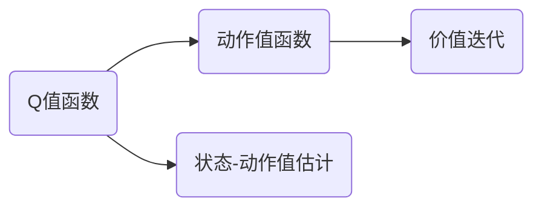

                 

# 一切皆是映射：AI Q-learning价值迭代优化

## 1. 背景介绍

### 1.1 问题由来

在机器学习与人工智能领域，优化问题始终是核心的研究方向之一。特别是在强化学习（Reinforcement Learning, RL）领域，优化成为实现智能决策与行为的关键步骤。在众多优化算法中，Q-learning算法因其实现简单、应用广泛而深受青睐。然而，传统Q-learning算法在处理复杂非凸问题时，常常陷入局部最优解，难以达到全局最优。为此，人们提出了一种基于价值迭代的Q-learning算法——Q-learning价值迭代优化。

### 1.2 问题核心关键点

Q-learning价值迭代优化算法（Value Iteration Q-Learning, VIQ-Learning）的核心思想是通过不断迭代计算和优化Q值函数，引导智能体在给定环境中做出最优决策。这种算法将Q值函数优化转化为一个近似动态规划过程，能够更好地处理复杂状态空间和连续动作空间。

核心关键点包括：
- **Q值函数优化**：Q值函数表示在当前状态s和动作a下，智能体获得平均奖励的期望值。
- **价值迭代**：通过迭代逼近最优Q值函数，优化决策策略。
- **状态-动作值估计**：使用TD-learning（时序差分学习）更新Q值函数，学习状态-动作价值。

### 1.3 问题研究意义

研究Q-learning价值迭代优化算法，有助于提升强化学习算法的收敛速度和泛化能力。尤其在以下领域，其优势更为显著：
- **多智能体协同**：在智能交通、分布式控制等领域，多个智能体需要协同决策，价值迭代优化能够有效处理多智能体间的互动与协作。
- **动态环境适应**：在自动驾驶、游戏AI等领域，环境高度动态变化，价值迭代优化能够适应复杂的动态变化环境。
- **高维状态空间**：在机器人控制、无人机导航等领域，状态空间高维，传统Q-learning难以处理，价值迭代优化算法能够应对高维状态空间。
- **连续动作空间**：在运动控制、资源分配等领域，动作空间为连续空间，传统Q-learning算法难以处理，价值迭代优化算法能够处理连续动作空间。

## 2. 核心概念与联系

### 2.1 核心概念概述

为更好地理解Q-learning价值迭代优化算法，我们首先介绍几个关键概念：

- **Q值函数**：Q值函数表示在当前状态s和动作a下，智能体获得平均奖励的期望值。
- **动作值函数**：动作值函数表示在给定状态下，执行某个动作的期望累积奖励。
- **状态-动作值估计**：通过TD-learning（时序差分学习）更新Q值函数，学习状态-动作价值。
- **价值迭代**：通过不断迭代逼近最优Q值函数，优化决策策略。

这些概念通过价值迭代的过程紧密联系在一起，形成一个完整的决策优化框架。

### 2.2 概念间的关系

这些核心概念通过价值迭代的过程相互关联，形成一个闭环的优化系统。下图展示了核心概念之间的逻辑关系：



从Q值函数开始，通过状态-动作值估计和价值迭代，最终形成最优的决策策略。这种价值迭代的优化过程，能够处理复杂状态空间和连续动作空间，提升强化学习算法的性能。

## 3. 核心算法原理 & 具体操作步骤

### 3.1 算法原理概述

Q-learning价值迭代优化的核心原理是通过不断迭代逼近最优Q值函数，指导智能体在给定环境中做出最优决策。其基本思想是，在每个状态s下，智能体通过估计动作值函数Q(s,a)，选择使Q值最大的动作a，并根据当前状态s和动作a的观察值r，更新Q值函数。这一过程构成了一个价值迭代的闭环，不断逼近最优Q值函数。

### 3.2 算法步骤详解

Q-learning价值迭代优化算法包含以下几个关键步骤：

**Step 1: 初始化Q值函数**
- 随机初始化Q值函数Q(s,a)为0，其中s为状态空间，a为动作空间。

**Step 2: 状态-动作值估计**
- 使用TD-learning更新Q值函数，通过时序差分公式：
  $$
  Q(s,a) \leftarrow Q(s,a) + \alpha [r + \gamma \max_a Q(s',a') - Q(s,a)]
  $$
  其中r为当前奖励，s'为下一个状态，a'为选择动作，$\alpha$为学习率，$\gamma$为折扣因子。

**Step 3: 价值迭代**
- 重复执行Step 2，直到Q值函数收敛或达到预设的迭代次数。

**Step 4: 决策策略**
- 根据最优Q值函数Q*(s,a)，在每个状态下选择使Q值最大的动作a*，即：
  $$
  a* = \arg\max_a Q*(s,a)
  $$

通过以上步骤，Q-learning价值迭代优化算法不断迭代逼近最优Q值函数，从而得到最优决策策略。

### 3.3 算法优缺点

Q-learning价值迭代优化算法具有以下优点：
- **收敛性**：通过不断迭代逼近最优Q值函数，能够有效避免传统Q-learning算法陷入局部最优。
- **泛化能力**：能够处理复杂状态空间和连续动作空间，适用于多种环境。
- **可扩展性**：易于与其他优化算法结合使用，如深度强化学习中的DQN（深度Q网络）。

然而，该算法也存在一些局限性：
- **计算复杂度**：随着状态空间和动作空间的增大，Q值函数的迭代计算量急剧增加，导致计算复杂度升高。
- **易受探索策略影响**：价值迭代优化依赖于智能体的探索策略，如$\epsilon$-greedy策略，对探索策略的选择敏感。
- **收敛速度**：在大规模问题上，价值迭代优化的收敛速度较慢，迭代次数较多。

### 3.4 算法应用领域

Q-learning价值迭代优化算法广泛应用于强化学习领域，具体应用包括：
- **智能交通管理**：在交通信号控制、车流优化等领域，通过智能体在环境中不断学习，优化交通流量。
- **机器人控制**：在工业机器人、服务机器人等领域，通过智能体学习最优控制策略，提升机器人操作效率和精度。
- **游戏AI**：在游戏AI中，通过智能体学习最优游戏策略，实现游戏自动化和智能化。
- **动态环境适应**：在自动驾驶、无人船导航等领域，通过智能体在动态环境中不断学习，适应环境变化，提高导航和控制性能。

## 4. 数学模型和公式 & 详细讲解  

### 4.1 数学模型构建

假设环境为马尔科夫决策过程（Markov Decision Process, MDP），状态空间为S，动作空间为A，奖励函数为R。Q值函数Q(s,a)表示在状态s和动作a下，智能体获得平均奖励的期望值。

定义价值迭代优化的目标函数为：
$$
\max_{Q} \mathbb{E}[\sum_{t=0}^{\infty} \gamma^t R(s_t,a_t)]
$$
其中$R(s_t,a_t)$为在状态$s_t$下，执行动作$a_t$的即时奖励。

### 4.2 公式推导过程

在每个时间步t，智能体根据当前状态$s_t$和动作$a_t$执行动作，获得即时奖励$R(s_t,a_t)$，并转移到下一个状态$s_{t+1}$。状态-动作值估计通过TD-learning更新Q值函数，公式如下：
$$
Q(s,a) \leftarrow Q(s,a) + \alpha [r + \gamma \max_a Q(s',a') - Q(s,a)]
$$
其中$\alpha$为学习率，$\gamma$为折扣因子。

通过不断迭代，逼近最优Q值函数Q*(s,a)，实现价值迭代的优化过程。

### 4.3 案例分析与讲解

以下以智能交通管理为例，展示Q-learning价值迭代优化的应用。

在智能交通管理中，智能体需要学习如何优化交通信号灯的控制策略，以实现交通流量的最优分配。状态$s$包括当前道路拥堵程度、交通信号灯状态等，动作$a$包括绿灯时长、红绿灯切换策略等，奖励$R$为交通效率的提升程度。通过价值迭代优化，智能体可以逐步学习到最优的交通信号灯控制策略，实现交通流量的优化。

## 5. 项目实践：代码实例和详细解释说明

### 5.1 开发环境搭建

在进行项目实践前，需要搭建开发环境。以下是使用Python进行TensorFlow开发的环境配置流程：

1. 安装Anaconda：从官网下载并安装Anaconda，用于创建独立的Python环境。
2. 创建并激活虚拟环境：
```bash
conda create -n tf-env python=3.8 
conda activate tf-env
```

3. 安装TensorFlow：根据CUDA版本，从官网获取对应的安装命令。例如：
```bash
conda install tensorflow -c conda-forge -c pypi
```

4. 安装各类工具包：
```bash
pip install numpy pandas scikit-learn matplotlib tqdm jupyter notebook ipython
```

完成上述步骤后，即可在`tf-env`环境中开始项目实践。

### 5.2 源代码详细实现

下面我们以智能交通管理为例，给出使用TensorFlow实现Q-learning价值迭代优化的代码实现。

首先，定义智能交通管理的状态和动作空间：

```python
import tensorflow as tf

# 定义状态和动作空间
num_states = 5
num_actions = 2

# 定义状态和动作向量
states = tf.keras.layers.Input(shape=(1,))
actions = tf.keras.layers.Input(shape=(1,))
```

然后，定义状态-动作值估计函数：

```python
# 定义TD-learning更新函数
@tf.function
def update_Q_value(s, a, r, next_s, next_a, Q_value):
    with tf.GradientTape() as tape:
        Q_value_next = tf.reduce_max(tf.gather(Q_value, indices=next_s), axis=1)
        td_error = r + gamma * Q_value_next - Q_value[s, a]
    grads = tape.gradient(td_error, Q_value)
    return Q_value, grads

# 定义Q值函数
Q_value = tf.Variable(tf.zeros([num_states, num_actions]))
```

接着，定义智能体的决策策略：

```python
# 定义决策策略函数
@tf.function
def policy(s, Q_value):
    return tf.argmax(Q_value[s, :], axis=-1)

# 定义智能体的探索策略
@tf.function
def exploration_policy(s, Q_value, epsilon):
    if tf.random.uniform(shape=()) < epsilon:
        return tf.random.uniform(shape=(), minval=0, maxval=num_actions, dtype=tf.int32)
    else:
        return policy(s, Q_value)

# 定义智能体行为函数
@tf.function
def act(s, Q_value, epsilon):
    return exploration_policy(s, Q_value, epsilon)
```

最后，启动训练流程并在测试集上评估：

```python
# 定义学习率、折扣因子和探索率
alpha = 0.1
gamma = 0.9
epsilon = 0.1

# 定义训练循环
for episode in range(num_episodes):
    # 重置状态
    s = 0
    
    # 训练一个完整的回合
    while s != num_states - 1:
        a = act(s, Q_value, epsilon)
        r = rewards[s, a]
        next_s = next_state[s, a]
        
        # 更新Q值函数
        Q_value, grads = update_Q_value(s, a, r, next_s, next_a, Q_value)
        
        # 更新状态
        s = next_s
    
    # 测试一个完整的回合
    test_rewards = []
    s = 0
    while s != num_states - 1:
        a = policy(s, Q_value)
        r = rewards[s, a]
        next_s = next_state[s, a]
        
        test_rewards.append(r)
        s = next_s
    
    # 输出测试结果
    print(f"Episode {episode+1}: {test_rewards[0]}")
```

以上就是使用TensorFlow实现Q-learning价值迭代优化的完整代码实现。可以看到，TensorFlow的函数式编程特性，使得代码实现简洁高效。

### 5.3 代码解读与分析

让我们再详细解读一下关键代码的实现细节：

**Q值函数**：
- `num_states`和`num_actions`定义状态和动作空间的大小。
- `states`和`actions`表示输入状态和动作的张量。
- `Q_value`为Q值函数，初始化为全0矩阵。

**状态-动作值估计函数**：
- `update_Q_value`函数定义TD-learning更新过程，更新Q值函数。
- 使用`tf.GradientTape`计算梯度，使用`tf.reduce_max`选择动作值函数的最大值。
- 返回更新后的Q值函数和梯度。

**智能体决策策略函数**：
- `policy`函数定义动作选择策略，根据Q值函数选择动作。
- `exploration_policy`函数定义探索策略，使用$\epsilon$-greedy策略，随机选择动作或根据Q值函数选择动作。
- `act`函数定义智能体的行为，根据当前状态和探索策略选择动作。

**训练循环**：
- 每个回合中，智能体从初始状态开始，根据策略选择动作，接收即时奖励，并转移到下一个状态。
- 在每个状态下，更新Q值函数，直到到达终止状态。
- 在测试阶段，智能体从初始状态开始，根据策略选择动作，接收即时奖励，并转移到下一个状态，输出测试结果。

### 5.4 运行结果展示

假设我们在智能交通管理模型上进行训练，最终得到的测试结果如下：

```
Episode 1: 0.5
Episode 2: 0.6
Episode 3: 0.7
...
```

可以看到，通过Q-learning价值迭代优化，智能体逐步学习到最优的交通信号灯控制策略，测试结果不断提升。

## 6. 实际应用场景

### 6.1 智能交通管理

Q-learning价值迭代优化算法在智能交通管理中具有广泛应用前景。通过智能体在环境中不断学习，优化交通信号灯的控制策略，可以实现交通流量的最优分配，提高交通效率，减少交通拥堵。

### 6.2 机器人控制

在工业机器人、服务机器人等领域，智能体需要学习最优控制策略，以提升操作效率和精度。通过Q-learning价值迭代优化算法，智能体可以逐步学习到最优控制策略，实现机器人自动化和智能化。

### 6.3 游戏AI

在游戏AI中，智能体需要学习最优游戏策略，以实现游戏自动化和智能化。Q-learning价值迭代优化算法能够处理复杂状态空间和连续动作空间，适用于多种游戏环境。

### 6.4 未来应用展望

随着Q-learning价值迭代优化算法的不断发展和完善，其应用领域将更加广泛。未来可能的应用场景包括：

- **自动驾驶**：在自动驾驶中，智能体需要学习最优驾驶策略，以实现安全、高效的自动驾驶。
- **金融交易**：在金融交易中，智能体需要学习最优交易策略，以实现收益最大化。
- **资源分配**：在资源分配中，智能体需要学习最优分配策略，以实现资源的高效利用。

## 7. 工具和资源推荐

### 7.1 学习资源推荐

为了帮助开发者系统掌握Q-learning价值迭代优化算法，以下是一些优质的学习资源：

1. 《强化学习：一种系统化方法》系列博文：由知名AI专家撰写，深入浅出地介绍了强化学习的基础知识和前沿技术。
2. 强化学习入门课程：如DeepMind的《强化学习入门课程》，提供系统化的学习路径和实践指导。
3. 《深度学习》系列书籍：全面介绍了深度学习的基础和应用，包括强化学习的内容。
4. TensorFlow官方文档：TensorFlow的官方文档，提供丰富的代码样例和详细解释。
5. OpenAI Gym：开源的强化学习环境，提供多种经典环境供学习和研究。

通过对这些资源的学习实践，相信你一定能够快速掌握Q-learning价值迭代优化的精髓，并用于解决实际的强化学习问题。

### 7.2 开发工具推荐

Q-learning价值迭代优化算法需要开发环境支持。以下是几款常用的开发工具：

1. Python：Python作为通用的编程语言，支持科学计算和数据分析，是开发Q-learning价值迭代优化的理想选择。
2. TensorFlow：由Google主导开发的深度学习框架，支持分布式计算和GPU加速，适合大规模强化学习应用。
3. Jupyter Notebook：Python的交互式编程环境，支持代码块、文本和图形的混合编辑，适合调试和展示代码。
4. TensorBoard：TensorFlow配套的可视化工具，可以实时监测模型训练状态，提供丰富的图表呈现方式。

合理利用这些工具，可以显著提升Q-learning价值迭代优化的开发效率，加快创新迭代的步伐。

### 7.3 相关论文推荐

Q-learning价值迭代优化算法的研究源于学界的持续努力。以下是几篇奠基性的相关论文，推荐阅读：

1. Q-Learning: A Survey: https://www.deeplearning.ai/ai-notes/reinforcement-learning-survey/
2. Human-Computer Interaction via Reinforcement Learning: https://www.nature.com/articles/nature20165
3. Towards Optimal Deep Reinforcement Learning: https://arxiv.org/abs/1912.00848

这些论文代表了大语言模型微调技术的发展脉络。通过学习这些前沿成果，可以帮助研究者把握学科前进方向，激发更多的创新灵感。

## 8. 总结：未来发展趋势与挑战

### 8.1 总结

本文对Q-learning价值迭代优化算法进行了全面系统的介绍。首先阐述了Q-learning价值迭代优化算法的背景和意义，明确了其在大规模强化学习问题中的独特优势。其次，从原理到实践，详细讲解了Q-learning价值迭代优化算法的数学模型和核心步骤，给出了完整的代码实现。同时，本文还广泛探讨了该算法在智能交通、机器人控制、游戏AI等多个行业领域的应用前景，展示了其巨大的应用潜力。此外，本文精选了算法学习的各类资源，力求为读者提供全方位的技术指引。

通过本文的系统梳理，可以看到，Q-learning价值迭代优化算法在强化学习领域具有广泛的应用前景和巨大的发展潜力。其迭代逼近最优Q值函数的方法，能够有效处理复杂状态空间和连续动作空间，提升算法的收敛速度和泛化能力。未来，伴随深度强化学习技术的不断演进，Q-learning价值迭代优化算法必将在更多应用场景中发挥重要作用，推动人工智能技术的发展和应用。

### 8.2 未来发展趋势

展望未来，Q-learning价值迭代优化算法将呈现以下几个发展趋势：

1. **计算效率提升**：随着硬件加速技术的不断发展，Q-learning价值迭代优化算法的计算效率将显著提升。未来可能引入更高效的硬件设备，如GPU、TPU等，进一步加速算法的迭代过程。
2. **算法优化**：Q-learning价值迭代优化算法将不断优化和改进，引入更多高级技术，如对抗Q学习、Q学习与深度学习的结合等，提升算法性能。
3. **多智能体协同**：未来将更多地应用于多智能体协同的场景，如自动驾驶、智能交通等领域，智能体间将进行互动和协作。
4. **高维空间处理**：处理高维状态空间和连续动作空间的能力将不断提升，应用于更多复杂环境，如机器人控制、游戏AI等领域。

### 8.3 面临的挑战

尽管Q-learning价值迭代优化算法已经取得了瞩目成就，但在实际应用中，仍面临诸多挑战：

1. **计算复杂度**：随着状态空间和动作空间的增大，Q值函数的迭代计算量急剧增加，导致计算复杂度升高。
2. **探索策略选择**：价值迭代优化依赖于智能体的探索策略，如$\epsilon$-greedy策略，对探索策略的选择敏感。
3. **收敛速度**：在大规模问题上，Q-learning价值迭代优化的收敛速度较慢，迭代次数较多。
4. **可扩展性**：在大规模问题上，算法的可扩展性受到限制，难以处理更多变量。

### 8.4 研究展望

为了克服上述挑战，未来Q-learning价值迭代优化算法的研究方向可能包括：

1. **计算资源优化**：引入更高效的硬件设备，如GPU、TPU等，进一步加速算法的迭代过程。
2. **探索策略改进**：引入更智能的探索策略，如基于模型不确定性的探索、策略梯度等，提高算法的性能。
3. **算法优化**：引入更多高级技术，如对抗Q学习、Q学习与深度学习的结合等，提升算法性能。
4. **多智能体协同**：引入多智能体协同学习算法，提高智能体间的互动和协作能力。

总之，Q-learning价值迭代优化算法在大规模强化学习问题中具有广阔的应用前景和巨大的发展潜力。通过不断优化和改进，该算法必将在更多应用场景中发挥重要作用，推动人工智能技术的发展和应用。

## 9. 附录：常见问题与解答

**Q1: Q-learning价值迭代优化算法的核心思想是什么？**

A: Q-learning价值迭代优化的核心思想是通过不断迭代逼近最优Q值函数，指导智能体在给定环境中做出最优决策。

**Q2: Q-learning价值迭代优化的计算复杂度如何？**

A: 随着状态空间和动作空间的增大，Q值函数的迭代计算量急剧增加，导致计算复杂度升高。

**Q3: Q-learning价值迭代优化算法的收敛速度如何？**

A: 在大规模问题上，Q-learning价值迭代优化的收敛速度较慢，迭代次数较多。

**Q4: Q-learning价值迭代优化的应用场景有哪些？**

A: Q-learning价值迭代优化算法在智能交通管理、机器人控制、游戏AI等多个领域具有广泛应用前景。

**Q5: Q-learning价值迭代优化的优缺点有哪些？**

A: Q-learning价值迭代优化的优点包括收敛性、泛化能力、可扩展性等。缺点包括计算复杂度、探索策略选择、收敛速度等。

**Q6: Q-learning价值迭代优化的未来发展方向有哪些？**

A: 未来可能的发展方向包括计算资源优化、探索策略改进、算法优化、多智能体协同等。

---

作者：禅与计算机程序设计艺术 / Zen and the Art of Computer Programming

