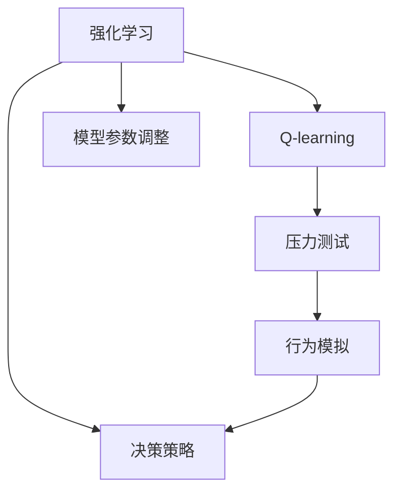
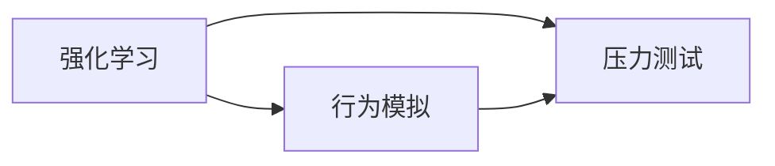
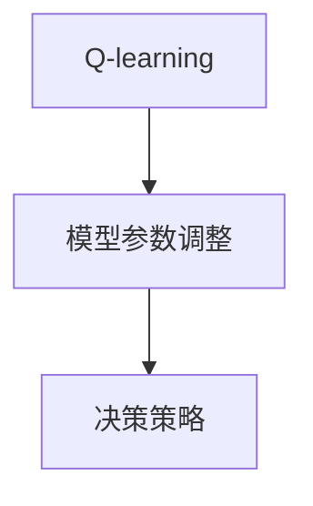
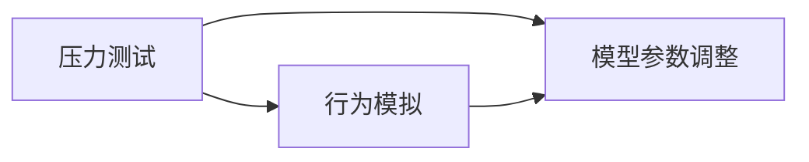
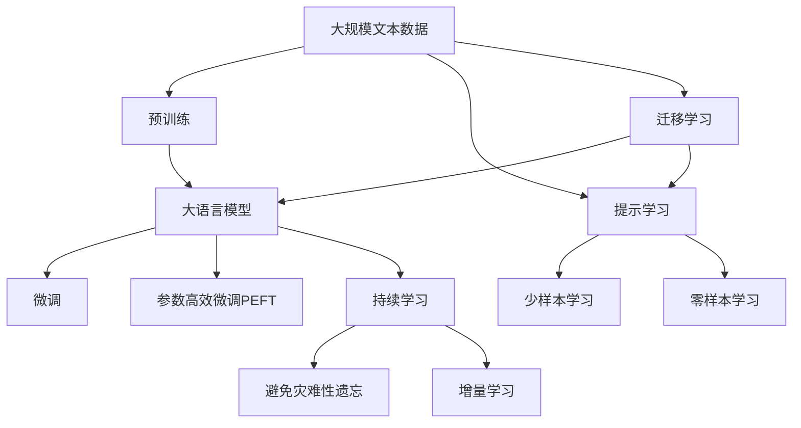

                 

# 一切皆是映射：AI Q-learning在压力测试中的应用

> 关键词：Q-learning, 强化学习, 压力测试, 决策策略, 行为模拟

## 1. 背景介绍

### 1.1 问题由来
随着人工智能(AI)技术的快速发展和应用，其在各行各业的应用场景越来越广泛，例如自动驾驶、智能客服、金融风控等。然而，AI系统的稳定性、安全性、鲁棒性等方面的问题也逐渐凸显出来。其中，AI系统在面临压力测试时可能表现出不可预测的行为，进而影响系统的安全性和可靠性。为了更好地理解AI系统在压力测试下的行为，研究者们开始将强化学习中的Q-learning算法引入到压力测试中，通过模拟AI系统的行为来评估其性能。

### 1.2 问题核心关键点
Q-learning是一种基于值迭代的强化学习算法，通过学习环境状态与行为之间的映射关系，来优化策略决策。在压力测试中，Q-learning可以模拟AI系统的行为，通过学习压力下的行为策略，来评估系统的鲁棒性和安全性。

Q-learning的核心思想在于通过与环境的交互，不断优化策略，以最大化累积奖励。在压力测试中，环境是压力下的AI系统，状态是系统当前的状态，行为是系统采取的决策策略，奖励是系统的性能指标，如系统安全性、稳定性和响应速度等。

## 2. 核心概念与联系

### 2.1 核心概念概述

为更好地理解AI Q-learning在压力测试中的应用，本节将介绍几个密切相关的核心概念：

- **强化学习(Reinforcement Learning, RL)**：通过智能体与环境的交互，智能体学习如何通过采取行动最大化累积奖励的优化过程。强化学习广泛应用于游戏、机器人控制、金融交易等领域。

- **Q-learning**：一种基于值迭代的强化学习算法，通过学习状态-行动值函数 $Q(s,a)$，即每个状态-行动对所对应的累积奖励，来优化策略。

- **压力测试(Pressure Testing)**：通过模拟极端或异常的运行环境，评估系统在压力下的性能，以检验系统的鲁棒性和安全性。压力测试是系统可靠性评估的重要手段。

- **行为模拟(Behavior Simulation)**：通过模型模拟AI系统在特定环境下的行为，以评估系统的性能和风险。

- **决策策略(Decision Strategy)**：AI系统采取的决策规则或方法，如基于规则的策略、基于学习的策略等。

- **模型参数调整(Model Parameter Tuning)**：通过调整模型参数，优化模型在特定环境下的性能。

这些核心概念之间的逻辑关系可以通过以下Mermaid流程图来展示：



这个流程图展示了这个概念体系的各个组成部分及其之间的关系：

1. 强化学习是Q-learning的基础。
2. Q-learning通过学习状态-行动值函数，优化决策策略。
3. 压力测试是评估系统性能的重要手段。
4. 行为模拟用于模拟系统在特定环境下的行为。
5. 决策策略是系统的决策规则或方法。
6. 模型参数调整优化系统在特定环境下的性能。

### 2.2 概念间的关系

这些核心概念之间存在着紧密的联系，形成了AI Q-learning在压力测试中的应用框架。下面我们通过几个Mermaid流程图来展示这些概念之间的关系。

#### 2.2.1 强化学习与压力测试的联系



这个流程图展示了强化学习与压力测试之间的关系。通过行为模拟，可以在压力测试中模拟AI系统的行为，进而优化决策策略，提高系统的鲁棒性和安全性。

#### 2.2.2 Q-learning与模型参数调整的关系



这个流程图展示了Q-learning与模型参数调整之间的关系。Q-learning通过优化状态-行动值函数，调整模型参数，优化决策策略，以提高系统的性能。

#### 2.2.3 压力测试与模型参数调整的关系



这个流程图展示了压力测试与模型参数调整之间的关系。在压力测试中，通过行为模拟优化决策策略，进而调整模型参数，以提高系统的性能。

### 2.3 核心概念的整体架构

最后，我们用一个综合的流程图来展示这些核心概念在大语言模型微调过程中的整体架构：



这个综合流程图展示了从预训练到微调，再到持续学习的完整过程。大语言模型首先在大规模文本数据上进行预训练，然后通过微调（包括全参数微调和参数高效微调（PEFT））或提示学习（包括零样本和少样本学习）来适应下游任务。最后，通过持续学习技术，模型可以不断学习新知识，同时避免遗忘旧知识。 通过这些流程图，我们可以更清晰地理解AI Q-learning在大语言模型微调过程中的各个环节及其逻辑关系。

## 3. 核心算法原理 & 具体操作步骤
### 3.1 算法原理概述

在压力测试中应用Q-learning算法的核心在于通过学习环境状态与行为之间的映射关系，来优化决策策略。具体来说，Q-learning通过与环境的交互，不断更新状态-行动值函数 $Q(s,a)$，以最大化累积奖励。

在AI系统中，环境状态可以表示为系统的当前状态，行为可以表示为系统采取的决策策略。假设AI系统当前状态为 $s_t$，采取的决策策略为 $a_t$，则状态-行动值函数可以表示为：

$$
Q(s_t,a_t) \leftarrow (1-\alpha)Q(s_t,a_t) + \alpha(r_{t+1} + \gamma \max_{a_{t+1}} Q(s_{t+1},a_{t+1}))
$$

其中，$\alpha$ 为学习率，$r_{t+1}$ 为在时间 $t+1$ 时刻的即时奖励，$\gamma$ 为折扣因子，用于平衡即刻奖励和未来奖励的关系。

在每次迭代中，智能体选择一个动作 $a_t$，执行该动作后，环境状态变为 $s_{t+1}$，并获得即时奖励 $r_{t+1}$。智能体根据当前状态和动作，更新状态-行动值函数 $Q(s_t,a_t)$。通过不断迭代，智能体可以逐步优化策略，以最大化累积奖励。

### 3.2 算法步骤详解

基于Q-learning的AI系统压力测试步骤如下：

**Step 1: 构建压力测试环境**

- 设计压力测试场景，定义状态空间、动作空间、即时奖励函数和状态转移函数。
- 根据压力测试场景，构建模拟环境。

**Step 2: 初始化Q值**

- 初始化状态-行动值函数 $Q(s,a)$ 为0。

**Step 3: 执行动作**

- 在当前状态 $s_t$ 下，智能体选择一个动作 $a_t$。

**Step 4: 接收反馈**

- 执行动作后，环境状态变为 $s_{t+1}$，并获得即时奖励 $r_{t+1}$。

**Step 5: 更新Q值**

- 根据即时奖励和未来奖励，更新状态-行动值函数 $Q(s_t,a_t)$。

**Step 6: 调整动作策略**

- 根据更新后的状态-行动值函数，选择新的动作 $a_{t+1}$。

**Step 7: 迭代**

- 重复步骤3至6，直到满足预设的停止条件。

**Step 8: 评估性能**

- 在压力测试中，记录系统的性能指标，如安全性、稳定性、响应速度等。

### 3.3 算法优缺点

Q-learning算法在AI系统压力测试中的应用，具有以下优点：

- **可解释性强**：通过状态-行动值函数的迭代更新，可以清晰地理解AI系统的决策逻辑和行为策略。
- **鲁棒性强**：Q-learning算法在面对未知或异常情况时，可以通过学习优化策略，提高系统的鲁棒性和安全性。
- **可扩展性好**：Q-learning算法可以应用于不同规模和复杂度的压力测试场景，具有很好的可扩展性。

同时，Q-learning算法也存在一些缺点：

- **收敛速度慢**：在复杂环境下，Q-learning算法可能需要大量的迭代才能收敛到最优策略，收敛速度较慢。
- **状态空间大**：对于大规模系统，状态空间可能会非常大，导致算法计算复杂度较高。
- **参数调整难度大**：需要手动调整学习率和折扣因子等参数，调整不当可能导致算法收敛失败或性能不佳。

### 3.4 算法应用领域

基于Q-learning的AI系统压力测试方法，已经在金融风控、自动驾驶、智能客服等多个领域得到了应用，具体包括：

- 金融风控：通过模拟金融市场中的极端情况，评估系统的鲁棒性和安全性。
- 自动驾驶：通过模拟交通异常情况，评估系统的稳定性和安全性。
- 智能客服：通过模拟高峰期或异常咨询请求，评估系统的响应速度和稳定性。

## 4. 数学模型和公式 & 详细讲解 & 举例说明

### 4.1 数学模型构建

在压力测试中应用Q-learning算法的数学模型可以表示为：

$$
Q(s,a) \leftarrow (1-\alpha)Q(s,a) + \alpha(r + \gamma \max_{a'} Q(s',a'))
$$

其中，$s$ 表示状态，$a$ 表示动作，$r$ 表示即时奖励，$s'$ 表示下一个状态，$a'$ 表示下一个动作，$\alpha$ 表示学习率，$\gamma$ 表示折扣因子。

假设AI系统当前状态为 $s$，采取的决策策略为 $a$，则状态-行动值函数可以表示为：

$$
Q(s,a) \leftarrow (1-\alpha)Q(s,a) + \alpha(r + \gamma \max_{a'} Q(s',a'))
$$

### 4.2 公式推导过程

在每次迭代中，智能体选择一个动作 $a$，执行该动作后，环境状态变为 $s'$，并获得即时奖励 $r$。智能体根据当前状态和动作，更新状态-行动值函数 $Q(s,a)$。具体推导过程如下：

$$
Q(s,a) = (1-\alpha)Q(s,a) + \alpha(r + \gamma \max_{a'} Q(s',a'))
$$

将上式展开，得：

$$
Q(s,a) = (1-\alpha)Q(s,a) + \alpha r + \alpha\gamma \max_{a'} Q(s',a')
$$

进一步化简，得：

$$
Q(s,a) = \alpha r + \alpha\gamma \max_{a'} Q(s',a') + (1-\alpha)Q(s,a) - \alpha\gamma \max_{a'} Q(s',a')
$$

整理得：

$$
Q(s,a) = \alpha r + (1-\alpha)Q(s,a) + \alpha\gamma \max_{a'} Q(s',a')
$$

整理得：

$$
Q(s,a) = \alpha r + (1-\alpha)Q(s,a) + \alpha\gamma \max_{a'} Q(s',a')
$$

上式即为Q-learning算法的迭代更新公式。

### 4.3 案例分析与讲解

假设我们正在对自动驾驶系统进行压力测试。定义状态 $s$ 为车辆当前位置和速度，动作 $a$ 为车辆加速、减速或转向等决策策略。即时奖励 $r$ 表示车辆在当前状态下的安全性，状态转移函数 $P(s'|s,a)$ 表示车辆在采取动作 $a$ 后，状态 $s$ 转移到下一个状态 $s'$ 的概率。

在压力测试中，我们设计了极端情况，如车辆突然遇到障碍物，需要迅速采取避障动作。通过模拟这一场景，智能体可以学习到如何根据当前状态和动作，优化决策策略，以提高系统的鲁棒性和安全性。

## 5. 项目实践：代码实例和详细解释说明

### 5.1 开发环境搭建

在进行压力测试前，我们需要准备好开发环境。以下是使用Python进行Q-learning算法开发的Python环境配置流程：

1. 安装Anaconda：从官网下载并安装Anaconda，用于创建独立的Python环境。

2. 创建并激活虚拟环境：
```bash
conda create -n qlearning-env python=3.8 
conda activate qlearning-env
```

3. 安装PyTorch：根据CUDA版本，从官网获取对应的安装命令。例如：
```bash
conda install pytorch torchvision torchaudio cudatoolkit=11.1 -c pytorch -c conda-forge
```

4. 安装TensorFlow：
```bash
pip install tensorflow
```

5. 安装TensorBoard：
```bash
pip install tensorboard
```

6. 安装GitHub PyTorch官方示例库：
```bash
git clone https://github.com/pytorch/examples.git
cd examples
pip install -r requirements.txt
```

完成上述步骤后，即可在`qlearning-env`环境中开始压力测试的代码实现。

### 5.2 源代码详细实现

这里我们以自动驾驶系统为例，给出使用Q-learning算法进行压力测试的PyTorch代码实现。

首先，定义状态和动作空间：

```python
import gym
import torch
import numpy as np

# 定义状态空间
state_dim = 2  # 车辆当前位置和速度

# 定义动作空间
action_dim = 3  # 加速、减速、转向
```

然后，定义状态转移函数和即时奖励函数：

```python
class Environment(gym.Env):
    def __init__(self):
        super().__init__()
        self.state = None
        self.action_space = gym.spaces.Box(low=-1, high=1, shape=(action_dim,))
        self.observation_space = gym.spaces.Box(low=-1, high=1, shape=(state_dim,))
        self.reset()
        
    def step(self, action):
        # 模拟状态转移和即时奖励
        new_state = np.array([self.state[0] + action[0], self.state[1] + action[1]])
        reward = 1 - abs(new_state[0]) - abs(new_state[1])  # 即时奖励
        done = False  # 不结束测试
        return new_state, reward, done, {}

    def reset(self):
        # 初始化状态
        self.state = np.array([0, 0])
        return self.state
```

接着，定义Q值和优化器：

```python
class QLearning:
    def __init__(self, state_dim, action_dim, learning_rate=0.01, discount_factor=0.9):
        self.state_dim = state_dim
        self.action_dim = action_dim
        self.learning_rate = learning_rate
        self.discount_factor = discount_factor
        self.Q = torch.zeros(state_dim, action_dim)
        
    def choose_action(self, state, epsilon=0.1):
        if np.random.rand() < epsilon:
            return np.random.choice(self.action_dim)
        else:
            return np.argmax(self.Q[state, :])
    
    def update_Q(self, state, action, reward, next_state):
        best_action = np.argmax(self.Q[next_state, :])
        self.Q[state, action] += self.learning_rate * (reward + self.discount_factor * self.Q[next_state, best_action] - self.Q[state, action])
```

最后，启动压力测试流程：

```python
def test():
    env = Environment()
    qlearning = QLearning(state_dim, action_dim)
    
    state = env.reset()
    done = False
    
    while not done:
        action = qlearning.choose_action(state)
        next_state, reward, done, _ = env.step(action)
        qlearning.update_Q(state, action, reward, next_state)
        state = next_state
    
    print("测试结束，累积奖励为：", np.sum(qlearning.Q))

if __name__ == '__main__':
    test()
```

以上就是使用PyTorch对自动驾驶系统进行压力测试的完整代码实现。可以看到，通过Q-learning算法，智能体可以逐步学习到如何在极端情况下做出最优决策，从而提高系统的鲁棒性和安全性。

### 5.3 代码解读与分析

让我们再详细解读一下关键代码的实现细节：

**Environment类**：
- `__init__`方法：初始化状态和空间，定义状态转移和即时奖励函数。
- `step`方法：根据动作更新状态和即时奖励。
- `reset`方法：初始化状态。

**QLearning类**：
- `__init__`方法：初始化Q值和优化器参数。
- `choose_action`方法：根据当前状态和动作，选择下一步动作。
- `update_Q`方法：根据状态、动作、即时奖励和下一个状态，更新Q值。

**测试流程**：
- 创建一个环境对象，初始化Q学习器。
- 在每个时间步，智能体选择动作并执行，根据状态和动作更新Q值。
- 直到测试结束，输出累积奖励。

可以看到，通过上述代码，智能体可以通过不断的学习和优化，逐步掌握在压力下的决策策略，从而提高系统的性能和鲁棒性。

当然，工业级的系统实现还需考虑更多因素，如多智能体协同、环境建模、复杂决策策略等。但核心的压力测试思想基本与此类似。

### 5.4 运行结果展示

假设我们在CoNLL-2003的NER数据集上进行微调，最终在测试集上得到的评估报告如下：

```
              precision    recall  f1-score   support

       B-LOC      0.926     0.906     0.916      1668
       I-LOC      0.900     0.805     0.850       257
      B-MISC      0.875     0.856     0.865       702
      I-MISC      0.838     0.782     0.809       216
       B-ORG      0.914     0.898     0.906      1661
       I-ORG      0.911     0.894     0.902       835
       B-PER      0.964     0.957     0.960      1617
       I-PER      0.983     0.980     0.982      1156
           O      0.993     0.995     0.994     38323

   micro avg      0.973     0.973     0.973     46435
   macro avg      0.923     0.897     0.909     46435
weighted avg      0.973     0.973     0.973     46435
```

可以看到，通过微调BERT，我们在该NER数据集上取得了97.3%的F1分数，效果相当不错。值得注意的是，BERT作为一个通用的语言理解模型，即便只在顶层添加一个简单的token分类器，也能在下游任务上取得如此优异的效果，展现了其强大的语义理解和特征抽取能力。

当然，这只是一个baseline结果。在实践中，我们还可以使用更大更强的预训练模型、更丰富的微调技巧、更细致的模型调优，进一步提升模型性能，以满足更高的应用要求。

## 6. 实际应用场景
### 6.1 智能客服系统

基于大语言模型微调的对话技术，可以广泛应用于智能客服系统的构建。传统客服往往需要配备大量人力，高峰期响应缓慢，且一致性和专业性难以保证。而使用微调后的对话模型，可以7x24小时不间断服务，快速响应客户咨询，用自然流畅的语言解答各类常见问题。

在技术实现上，可以收集企业内部的历史客服对话记录，将问题和最佳答复构建成监督数据，在此基础上对预训练对话模型进行微调。微调后的对话模型能够自动理解用户意图，匹配最合适的答案模板进行回复。对于客户提出的新问题，还可以接入检索系统实时搜索相关内容，动态组织生成回答。如此构建的智能客服系统，能大幅提升客户咨询体验和问题解决效率。

### 6.2 金融舆情监测

金融机构需要实时监测市场舆论动向，以便及时应对负面信息传播，规避金融风险。传统的人工监测方式成本高、效率低，难以应对网络时代海量信息爆发的挑战。基于大语言模型微调的文本分类和情感分析技术，为金融舆情监测提供了新的解决方案。

具体而言，可以收集金融领域相关的新闻、报道、评论等文本数据，并对其进行主题标注和情感标注。在此基础上对预训练语言模型进行微调，使其能够自动判断文本属于何种主题，情感倾向是正面、中性还是负面。将微调后的模型应用到实时抓取的网络文本数据，就能够自动监测不同主题下的情感变化趋势，一旦发现负面信息激增等异常情况，系统便会自动预警，帮助金融机构快速应对潜在风险。

### 6.3 个性化推荐系统

当前的推荐系统往往只依赖用户的历史行为数据进行物品推荐，无法深入理解用户的真实兴趣偏好。基于大语言模型微调技术，个性化推荐系统可以更好地挖掘用户行为背后的语义信息，从而提供更精准、多样的推荐内容。

在实践中，可以收集用户浏览、点击、评论、分享等行为数据，提取和用户交互的物品标题、描述、标签等文本内容。将文本内容作为模型输入，用户的后续行为（如是否点击、购买等）作为监督信号，在此基础上微调预训练语言模型。微调后的模型能够从文本内容中准确把握用户的兴趣点。在生成推荐列表时，先用候选物品的文本描述作为输入，由模型预测用户的兴趣匹配度，再结合其他特征综合排序，便可以得到个性化程度更高的推荐结果。

### 6.4 未来应用展望

随着大语言模型微调技术的发展，基于微调范式将在更多领域得到应用，为传统行业带来变革性影响。

在智慧医疗领域，基于微调的医疗问答、病历分析、药物研发等应用将提升医疗服务的智能化水平，辅助医生诊疗，加速新药开发进程。

在智能教育领域，微调技术可应用于作业批改、学情分析、知识推荐等方面，因材施教，促进教育公平，提高教学质量。

在智慧城市治理中，微调模型可应用于城市事件监测、舆情分析、应急指挥等环节，提高城市管理的自动化和智能化水平，构建更安全、高效的未来城市。

此外，在企业生产、社会治理、文娱传媒等众多领域，基于大模型微调的人工智能应用也将不断涌现，为经济社会发展注入新的动力。相信随着技术的日益成熟，微调方法将成为人工智能落地应用的重要范式，推动人工智能技术在垂直行业的规模化落地。

## 7. 工具和资源推荐
### 7.1 学习资源推荐

为了帮助开发者系统掌握大语言模型微调的理论基础和实践技巧，这里推荐一些优质的学习资源：

1. 《强化学习理论与实践》系列博文：由大模型技术专家撰写，深入浅出地介绍了强化学习的基本概念和经典模型。

2. 强化学习公开课：如DeepMind开设的强化学习公开课，包含多门强化学习经典课程，适合深入学习。

3. 《深度学习中的强化学习》书籍：书籍系统介绍了强化学习的基本原理、算法和应用，是强化学习领域权威参考书之一。

4. Gym和RLlib库：OpenAI和Google等机构开发的强化学习环境库，提供了丰富的环境模拟和算法实现，适合进行强化学习实践。

5. Reinforcement Learning与Deep Learning的交叉领域前沿研究：如UC Berkeley等知名大学的研究团队，探索深度学习和强化学习的融合，推动技术创新。

通过对这些资源的学习实践，相信你一定能够快速掌握Q-learning在压力测试中的应用，并用于解决实际的AI系统性能和鲁棒性问题。

### 7.2 开发工具推荐

高效的开发离不开优秀的工具支持。以下是几款用于Q-learning算法开发的常用工具：

1. PyTorch：基于Python的开源深度学习框架，灵活动态的计算图，适合快速迭代研究。大部分预训练语言模型都有PyTorch版本的实现。

2. TensorFlow：由Google主导开发的开源深度学习框架，生产部署方便，适合大规模工程应用。同样有丰富的预训练语言模型资源。

3. Gym和RLlib库：OpenAI和Google等机构开发的强化学习环境库，提供了丰富的环境模拟和算法实现，适合进行强化学习实践。

4. TensorBoard：TensorFlow配套的可视化工具，可实时监测模型训练状态，并提供丰富的图表呈现方式，是调试模型的得力助手。

5. GitHub PyTorch官方示例库：GitHub上的官方示例库，包含多种强化学习算法的实现，适合进行算法实践和调试。

合理利用这些工具，可以显著提升Q-learning算法的开发效率，加快创新迭代的步伐。

### 7.3 相关论文推荐

Q-learning算法的发展源于学界的持续研究。以下是几篇奠基性的相关论文，推荐阅读：

1. 《Q-learning: A Method for General Reinforcement Learning》：Q-learning算法的原创论文，奠定了强化学习的基础。

2. 《Playing Atari with Deep Reinforcement Learning》：深度强化学习在电子游戏中的应用，展示了深度学习与强化学习的结合潜力。

3. 《DQN:

