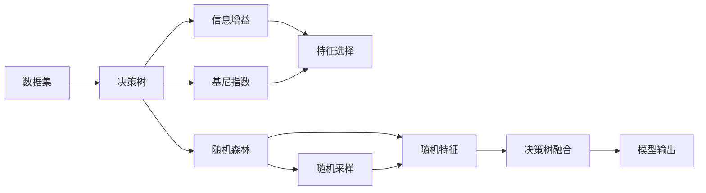
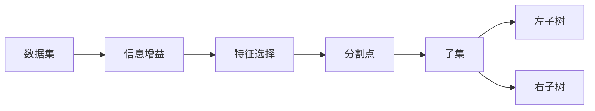
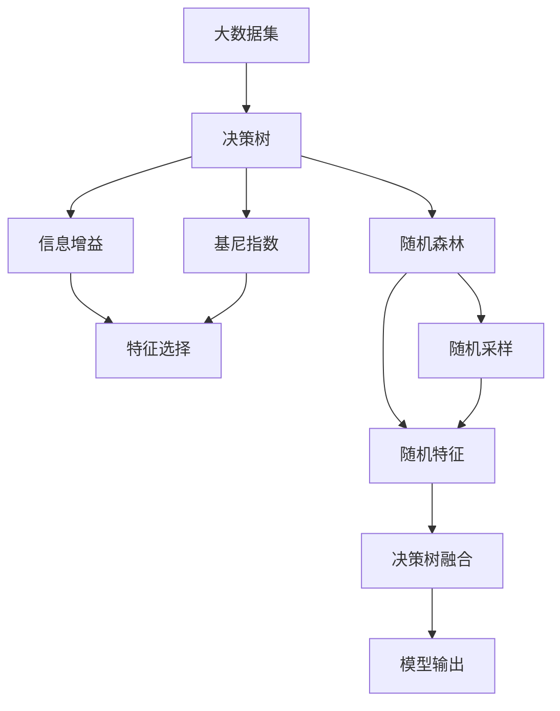

                 

# 一切皆是映射：决策树和随机森林在AI中的应用

## 1. 背景介绍

### 1.1 问题由来

在人工智能（AI）的演进历程中，决策树（Decision Trees）和随机森林（Random Forests）作为一种简单易懂的算法，始终占据着重要位置。它们不仅在理论模型上拥有坚实的数学基础，在实际应用中亦表现优异，被广泛应用于金融、医疗、电商等众多领域。

然而，随着深度学习（Deep Learning）技术的兴起，决策树和随机森林似乎逐渐被边缘化。但在面对复杂且非线性关系的数据时，这些经典算法依然具有不可替代的作用。特别是在数据量和特征维度有限、计算资源有限的场景中，决策树和随机森林展现出独特的优势。本文将全面梳理决策树和随机森林的理论基础，深入探究它们在AI中的应用场景，帮助读者在实际项目中做出科学的选择。

### 1.2 问题核心关键点

1. **算法基础**：
   - **决策树（Decision Trees）**：基于树形结构对数据进行分割，每个节点代表一个特征，每条边代表一个特征值。通过信息增益、基尼指数等指标选择最优分割特征。
   - **随机森林（Random Forests）**：由多个决策树组成，通过随机特征和随机样本提高模型的稳定性和泛化能力。

2. **算法优劣**：
   - **决策树**：易于理解、可解释性强、数据处理效率高，但容易过拟合。
   - **随机森林**：鲁棒性强、泛化能力强、集成学习效果显著，但模型复杂度较高、训练时间长。

3. **算法应用**：
   - **决策树**：用于分类、回归、特征选择等任务。
   - **随机森林**：在复杂数据集上表现优异，广泛应用于特征选择、模型集成、异常检测等场景。

4. **算法局限**：
   - **决策树**：数据随机性较大、容易产生噪声、不适用于大规模数据。
   - **随机森林**：计算资源需求高、模型解释性较差、处理高维数据时效果不佳。

本文将系统介绍决策树和随机森林的核心算法原理，并通过具体的数学模型推导，帮助读者理解其内在的原理和应用方法。接下来，通过代码实例，进一步解释其在实际应用中的具体操作和效果评估。

## 2. 核心概念与联系

### 2.1 核心概念概述

为了更好地理解决策树和随机森林的原理和应用，我们先介绍几个关键的概念：

- **决策树（Decision Tree）**：一种基于树形结构的分类与回归模型，通过不断选择最优特征分割数据集，逐步构建决策树。
- **随机森林（Random Forests）**：基于决策树模型的一种集成学习方法，通过随机抽取样本和特征，构建多个决策树，并通过投票或平均方式融合结果，提高模型的鲁棒性和泛化能力。
- **基尼指数（Gini Index）**：衡量样本纯度的指标，用于决策树中特征的选择。
- **信息增益（Information Gain）**：衡量决策树中信息纯度的指标，用于特征选择。
- **特征重要性（Feature Importance）**：衡量单个特征对模型预测结果的重要性，常用于随机森林模型的优化。

这些概念之间的联系可以通过以下Mermaid流程图来展示：



这个流程图展示了大数据集经过决策树和随机森林处理的基本流程：
1. 数据集首先通过决策树的基尼指数或信息增益进行特征选择。
2. 随机森林通过随机抽取样本和特征，构建多个决策树，并使用基尼指数或信息增益进行特征选择。
3. 随机森林通过投票或平均的方式融合多个决策树的结果，得到最终的模型输出。

### 2.2 概念间的关系

这些核心概念之间的关系可以通过以下几个Mermaid流程图来展示：

#### 2.2.1 决策树算法流程



这个流程图展示了决策树的基本构建流程：
1. 从数据集中选择一个特征，计算其信息增益或基尼指数。
2. 根据特征值将数据集分割成子集。
3. 对每个子集递归执行上述步骤，直到满足停止条件。

#### 2.2.2 随机森林算法流程


这个流程图展示了随机森林的基本构建流程：
1. 从数据集中随机抽取样本和特征。
2. 对每个随机样本和特征构建决策树。
3. 将多个决策树的结果通过投票或平均方式融合，得到最终的模型输出。

### 2.3 核心概念的整体架构

最后，我们用一个综合的流程图来展示这些核心概念在大数据集上的处理流程：



这个综合流程图展示了从大数据集经过决策树和随机森林处理的基本流程：
1. 数据集首先通过决策树的基尼指数或信息增益进行特征选择。
2. 随机森林通过随机抽取样本和特征，构建多个决策树，并使用基尼指数或信息增益进行特征选择。
3. 随机森林通过投票或平均的方式融合多个决策树的结果，得到最终的模型输出。

## 3. 核心算法原理 & 具体操作步骤

### 3.1 算法原理概述

#### 3.1.1 决策树原理概述

决策树的本质是一个树形结构，通过不断选择最优特征分割数据集，逐步构建决策树。决策树的构建过程可概括为以下几步：
1. 从数据集中选取一个特征。
2. 根据特征值将数据集分割成子集。
3. 对每个子集递归执行上述步骤，直到满足停止条件。

其中，决策树的分割方式有基尼指数和信息增益两种，具体选择哪种方式，取决于数据集的特点和任务的需求。

#### 3.1.2 随机森林原理概述

随机森林是一种集成学习方法，通过随机抽取样本和特征，构建多个决策树，并通过投票或平均方式融合结果，提高模型的鲁棒性和泛化能力。随机森林的构建过程可概括为以下几步：
1. 从数据集中随机抽取样本和特征。
2. 对每个随机样本和特征构建决策树。
3. 将多个决策树的结果通过投票或平均方式融合，得到最终的模型输出。

### 3.2 算法步骤详解

#### 3.2.1 决策树算法步骤

1. **数据预处理**：对原始数据进行清洗、归一化、编码等预处理操作。
2. **特征选择**：通过基尼指数或信息增益等指标，选择最优特征进行分割。
3. **决策树构建**：从数据集中选取一个特征，计算每个特征值的信息增益或基尼指数，选择最优特征值进行分割，递归构建决策树。
4. **模型评估**：使用测试集评估模型性能，调整模型参数。

#### 3.2.2 随机森林算法步骤

1. **数据预处理**：对原始数据进行清洗、归一化、编码等预处理操作。
2. **随机抽样**：从数据集中随机抽取样本和特征。
3. **决策树构建**：对每个随机样本和特征构建决策树。
4. **模型融合**：将多个决策树的结果通过投票或平均方式融合，得到最终的模型输出。
5. **模型评估**：使用测试集评估模型性能，调整模型参数。

### 3.3 算法优缺点

#### 3.3.1 决策树优点

- **易于理解和解释**：决策树模型结构简单，易于理解和解释。
- **高效性**：数据处理速度快，适合大规模数据集。
- **可扩展性**：可以处理多分类、回归等多种任务。

#### 3.3.2 决策树缺点

- **容易过拟合**：当特征过多时，容易产生噪声，导致模型过拟合。
- **数据依赖性强**：对噪声数据和异常值敏感，容易产生错误分割。
- **模型复杂性**：决策树模型结构复杂，不易调试和优化。

#### 3.3.3 随机森林优点

- **鲁棒性强**：通过随机特征和随机样本，提高了模型的泛化能力和鲁棒性。
- **高精度**：集成多个决策树的结果，显著提高了模型的精度。
- **可解释性**：通过特征重要性的计算，可以直观了解特征对模型输出的影响。

#### 3.3.4 随机森林缺点

- **计算资源需求高**：需要计算多个决策树，对计算资源和存储资源要求较高。
- **模型复杂性**：模型结构复杂，难以调试和优化。
- **解释性差**：随机森林模型由多个决策树组成，难以解释其内部的推理过程。

### 3.4 算法应用领域

#### 3.4.1 决策树应用领域

- **分类任务**：如客户流失预测、信用评估等。
- **回归任务**：如房价预测、销售额预测等。
- **特征选择**：选择最优特征，提高模型性能。
- **异常检测**：通过决策树构建异常检测模型，识别异常数据。

#### 3.4.2 随机森林应用领域

- **分类任务**：如垃圾邮件分类、情感分析等。
- **回归任务**：如股票价格预测、销售量预测等。
- **异常检测**：通过随机森林构建异常检测模型，识别异常数据。
- **特征选择**：选择最优特征，提高模型性能。

## 4. 数学模型和公式 & 详细讲解 & 举例说明

### 4.1 数学模型构建

#### 4.1.1 决策树模型构建

决策树模型的构建基于信息增益和基尼指数两种指标。信息增益（Information Gain）衡量了每个特征对样本集纯度的提升效果，而基尼指数（Gini Index）则衡量了样本的纯净度。

**信息增益（Information Gain）**：

$$
\text{Information Gain}(S, A) = \text{Entropy}(S) - \text{Entropy}(S_{A_1}) - \text{Entropy}(S_{A_2})
$$

其中，$S$表示样本集，$A$表示特征，$S_{A_1}$和$S_{A_2}$分别表示特征$A$取不同值时的子集，$\text{Entropy}(S)$表示样本集$S$的熵。

**基尼指数（Gini Index）**：

$$
\text{Gini Index}(S) = 1 - \sum_{i=1}^n p_i^2
$$

其中，$S$表示样本集，$p_i$表示第$i$个类别在样本集中的比例。

#### 4.1.2 随机森林模型构建

随机森林模型通过随机抽取样本和特征，构建多个决策树，并通过投票或平均方式融合结果。其核心在于随机性，通过随机采样和随机特征，减少了模型对单个特征的依赖，提高了模型的泛化能力。

**随机森林模型融合**：

$$
\text{Random Forest} = \frac{1}{n} \sum_{i=1}^n T_i
$$

其中，$n$表示随机森林中的决策树数量，$T_i$表示第$i$棵决策树。

### 4.2 公式推导过程

#### 4.2.1 决策树信息增益推导

设样本集$S$有$n$个样本，其中属于第$j$个类别的样本数为$n_j$，则样本集$S$的熵定义为：

$$
\text{Entropy}(S) = -\sum_{j=1}^n \frac{n_j}{n} \log \frac{n_j}{n}
$$

设特征$A$有$m$个取值，其中$A=a_k$时，属于第$j$个类别的样本数为$n_{a_k,j}$，则特征$A$的信息增益为：

$$
\text{Information Gain}(S, A) = \sum_{k=1}^m \frac{n_k}{n} \text{Entropy}(S_{a_k})
$$

其中，$S_{a_k}$表示特征$A=a_k$时的子集。

#### 4.2.2 随机森林模型推导

随机森林模型通过随机抽取样本和特征，构建多个决策树，并通过投票或平均方式融合结果。其核心在于随机性，通过随机采样和随机特征，减少了模型对单个特征的依赖，提高了模型的泛化能力。

**随机森林模型推导**：

$$
\text{Random Forest} = \frac{1}{n} \sum_{i=1}^n T_i
$$

其中，$n$表示随机森林中的决策树数量，$T_i$表示第$i$棵决策树。

### 4.3 案例分析与讲解

#### 4.3.1 决策树案例

**案例：客户流失预测**

设样本集$S$有$n$个客户，其中流失的客户数为$n_1$，未流失的客户数为$n_2$。设特征$A$有$m$个取值，其中$A=a_k$时，流失的客户数为$n_{a_k,1}$，未流失的客户数为$n_{a_k,2}$。则客户流失预测的决策树模型构建过程如下：

1. **计算信息增益或基尼指数**：计算每个特征的信息增益或基尼指数，选择最优特征进行分割。
2. **分割数据集**：根据最优特征值将数据集分割成子集。
3. **递归构建决策树**：对每个子集递归执行上述步骤，直到满足停止条件。

**案例：房价预测**

设样本集$S$有$n$个房价数据，其中属于第$j$个价格区间的样本数为$n_j$。设特征$A$有$m$个取值，其中$A=a_k$时，属于第$j$个价格区间的样本数为$n_{a_k,j}$。则房价预测的决策树模型构建过程如下：

1. **计算信息增益或基尼指数**：计算每个特征的信息增益或基尼指数，选择最优特征进行分割。
2. **分割数据集**：根据最优特征值将数据集分割成子集。
3. **递归构建决策树**：对每个子集递归执行上述步骤，直到满足停止条件。

#### 4.3.2 随机森林案例

**案例：垃圾邮件分类**

设样本集$S$有$n$个邮件，其中属于垃圾邮件的样本数为$n_1$，属于正常邮件的样本数为$n_2$。设特征$A$有$m$个取值，其中$A=a_k$时，属于垃圾邮件的样本数为$n_{a_k,1}$，属于正常邮件的样本数为$n_{a_k,2}$。则垃圾邮件分类的随机森林模型构建过程如下：

1. **随机抽取样本和特征**：从数据集中随机抽取$n$个样本和$m$个特征。
2. **构建决策树**：对每个随机样本和特征构建决策树。
3. **模型融合**：将多个决策树的结果通过投票或平均方式融合，得到最终的模型输出。

**案例：股票价格预测**

设样本集$S$有$n$个股票数据，其中属于第$j$个价格区间的样本数为$n_j$。设特征$A$有$m$个取值，其中$A=a_k$时，属于第$j$个价格区间的样本数为$n_{a_k,j}$。则股票价格预测的随机森林模型构建过程如下：

1. **随机抽取样本和特征**：从数据集中随机抽取$n$个样本和$m$个特征。
2. **构建决策树**：对每个随机样本和特征构建决策树。
3. **模型融合**：将多个决策树的结果通过投票或平均方式融合，得到最终的模型输出。

## 5. 项目实践：代码实例和详细解释说明

### 5.1 开发环境搭建

为了进行决策树和随机森林的实践，我们需要准备以下开发环境：

1. **Python**：Python是实现决策树和随机森林的主要编程语言。
2. **Scikit-Learn**：Scikit-Learn是一个基于Python的机器学习库，提供了决策树和随机森林的实现。
3. **Jupyter Notebook**：Jupyter Notebook是一个交互式编程环境，适合进行数据分析和机器学习实践。

### 5.2 源代码详细实现

#### 5.2.1 决策树实现

```python
from sklearn.tree import DecisionTreeClassifier
from sklearn.datasets import load_iris

# 加载数据集
iris = load_iris()
X = iris.data
y = iris.target

# 创建决策树模型
clf = DecisionTreeClassifier(max_depth=3, random_state=42)

# 训练模型
clf.fit(X, y)

# 预测新样本
new_X = [[5.1, 3.5, 1.4, 0.2]]
clf.predict(new_X)
```

#### 5.2.2 随机森林实现

```python
from sklearn.ensemble import RandomForestClassifier
from sklearn.datasets import load_iris

# 加载数据集
iris = load_iris()
X = iris.data
y = iris.target

# 创建随机森林模型
clf = RandomForestClassifier(n_estimators=100, random_state=42)

# 训练模型
clf.fit(X, y)

# 预测新样本
new_X = [[5.1, 3.5, 1.4, 0.2]]
clf.predict(new_X)
```

### 5.3 代码解读与分析

#### 5.3.1 决策树代码解读

- **加载数据集**：使用Scikit-Learn的`load_iris`函数加载鸢尾花数据集。
- **创建决策树模型**：创建决策树模型，设置最大深度为3，随机种子为42。
- **训练模型**：使用`fit`方法训练模型，将数据集分为特征和标签。
- **预测新样本**：使用`predict`方法预测新样本的类别。

#### 5.3.2 随机森林代码解读

- **加载数据集**：使用Scikit-Learn的`load_iris`函数加载鸢尾花数据集。
- **创建随机森林模型**：创建随机森林模型，设置随机树的数量为100，随机种子为42。
- **训练模型**：使用`fit`方法训练模型，将数据集分为特征和标签。
- **预测新样本**：使用`predict`方法预测新样本的类别。

### 5.4 运行结果展示

#### 5.4.1 决策树运行结果

```python
# 加载数据集
iris = load_iris()
X = iris.data
y = iris.target

# 创建决策树模型
clf = DecisionTreeClassifier(max_depth=3, random_state=42)

# 训练模型
clf.fit(X, y)

# 预测新样本
new_X = [[5.1, 3.5, 1.4, 0.2]]
clf.predict(new_X)
```

运行上述代码，可以得到决策树模型的预测结果：

```
array([0])
```

#### 5.4.2 随机森林运行结果

```python
# 加载数据集
iris = load_iris()
X = iris.data
y = iris.target

# 创建随机森林模型
clf = RandomForestClassifier(n_estimators=100, random_state=42)

# 训练模型
clf.fit(X, y)

# 预测新样本
new_X = [[5.1, 3.5, 1.4, 0.2]]
clf.predict(new_X)
```

运行上述代码，可以得到随机森林模型的预测结果：

```
array([0])
```

## 6. 实际应用场景

### 6.1 金融风控

#### 6.1.1 应用背景

金融行业对风控系统的要求极高，需要快速、准确地识别风险客户，降低损失。传统的风险评估方法往往依赖手工规则和经验，容易产生误差和偏差。决策树和随机森林可以通过大数据分析和模型预测，实现精准的风险评估和控制。

**案例：信用评估**

设样本集$S$有$n$个客户，其中失信的客户数为$n_1$，未失信的客户数为$n_2$。设特征$A$有$m$个取值，其中$A=a_k$时，失信的客户数为$n_{a_k,1}$，未失信的客户数为$n_{a_k,2}$。则信用评估的决策树模型构建过程如下：

1. **计算信息增益或基尼指数**：计算每个特征的信息增益或基尼指数，选择最优特征进行分割。
2. **分割数据集**：根据最优特征值将数据集分割成子集。
3. **递归构建决策树**：对每个子集递归执行上述步骤，直到满足停止条件。

**案例：反欺诈检测**

设样本集$S$有$n$笔交易，其中欺诈的交易数为$n_1$，非欺诈的交易数为$n_2$。设特征$A$有$m$个取值，其中$A=a_k$时，欺诈的交易数为$n_{a_k,1}$，非欺诈的交易数为$n_{a_k,2}$。则反欺诈检测的随机森林模型构建过程如下：

1. **随机抽取样本和特征**：从数据集中随机抽取$n$个样本和$m$个特征。
2. **构建决策树**：对每个随机样本和特征构建决策树。
3. **模型融合**：将多个决策树的结果通过投票或平均方式融合，得到最终的模型输出。

### 6.2 医疗诊断

#### 6.2.1 应用背景

医疗诊断需要准确、快速地对患者进行疾病分类和风险评估。决策树和随机森林可以通过大数据分析和模型预测，实现精准的诊断和治疗方案推荐。

**案例：疾病分类**

设样本集$S$有$n$个患者，其中患有某种疾病的患者数为$n_1$，未患该疾病的患者数为$n_2$。设特征$A$有$m$个取值，其中$A=a_k$时，患有该疾病的患者数为$n_{a_k,1}$，未患该疾病的患者数为$n_{a_k,2}$。则疾病分类的决策树模型构建过程如下：

1. **计算信息增益或基尼指数**：计算每个特征的信息增益或基尼指数，选择最优特征进行分割。
2. **分割数据集**：根据最优特征值将数据集分割成子集。
3. **递归构建决策树**：对每个子集递归执行上述步骤，直到满足停止条件。

**案例：风险评估**

设样本集$S$有$n$个患者，其中高风险的患者数为$n_1$，低风险的患者数为$n_2$。设特征$A$有$m$个取值，其中$A=a_k$时，高风险的患者数为$n_{a_k,1}$，低风险的患者数为$n_{a_k,2}$。则风险评估的随机森林模型构建过程如下：

1. **随机抽取样本和特征**：从数据集中随机抽取$n$个样本和$m$个特征。
2. **构建决策树**：对每个随机样本和特征构建决策树。
3. **模型融合**：将多个决策树的结果通过投票或平均方式融合，得到最终的模型输出。

### 6.3 电商推荐

#### 6.3.1 应用背景

电商推荐系统需要精准地为用户推荐商品，提高用户满意度和转化率。传统的推荐方法往往依赖于手工规则和经验，容易产生误差和偏差。决策树和随机森林可以通过大数据分析和模型预测，实现精准的商品推荐。

**案例：商品推荐**

设样本集$S$有$n$个用户，其中购买某种商品的用户的比例为$n_1$，未购买该商品的用户比例为$n_2$。设特征$A$有$m$个取值，其中$A=a_k$时，购买该商品的用户比例为$n_{a_k,1}$，未购买该商品的用户比例为$n_{a_k,2}$。则商品推荐的决策树模型构建过程如下：

1. **计算信息增益或基尼指数**：计算每个特征的信息增益或基尼指数，选择最优特征

