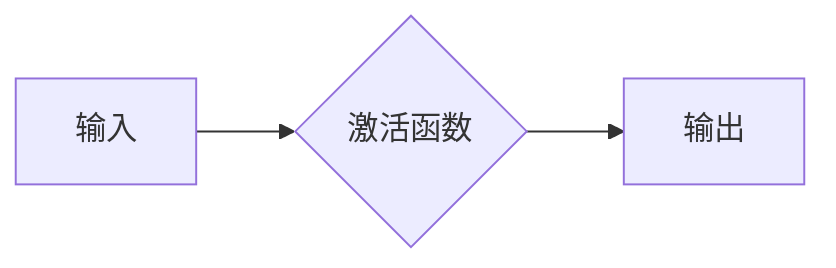

# Activation Functions 原理与代码实战案例讲解

> 关键词：激活函数，神经网络，深度学习，ReLU，Sigmoid，Tanh，LeakyReLU，ReLU6，Xavier初始化，He初始化，激活函数选择

## 1. 背景介绍

在深度学习中，激活函数是神经网络的核心组成部分，它为神经元引入了非线性，使得神经网络能够从数据中学习到复杂的模式。激活函数的选择对于网络的性能至关重要。本文将深入探讨激活函数的原理，介绍常见的激活函数，并通过代码实战案例展示如何在实际应用中选择和使用不同的激活函数。

### 1.1 问题的由来

随着深度学习的兴起，神经网络在各个领域都取得了显著的成果。然而，神经网络的非线性能力是其成功的关键。早期神经网络由于缺乏有效的非线性函数，难以学习到复杂的非线性关系。激活函数的引入解决了这一问题，使得神经网络能够进行非线性变换。

### 1.2 研究现状

目前，已有很多种激活函数被提出，每种激活函数都有其特定的适用场景和优缺点。选择合适的激活函数对于提高网络性能至关重要。

### 1.3 研究意义

研究激活函数不仅有助于我们理解神经网络的内部工作机制，还能够帮助我们设计更高效、更鲁棒的深度学习模型。

### 1.4 本文结构

本文将分为以下几个部分：
- 第2部分介绍激活函数的核心概念与联系。
- 第3部分详细讲解不同激活函数的原理和操作步骤。
- 第4部分通过数学模型和公式详细解释激活函数，并结合案例进行分析。
- 第5部分通过代码实战展示如何在实际项目中应用激活函数。
- 第6部分探讨激活函数在实际应用场景中的使用和未来展望。
- 第7部分推荐相关的学习资源和开发工具。
- 第8部分总结研究成果，并展望未来发展趋势和挑战。
- 第9部分提供常见问题与解答。

## 2. 核心概念与联系

### 2.1 激活函数的定义

激活函数是一个将输入映射到输出的非线性函数，通常用于神经网络中，为神经元引入非线性特性。

### 2.2 激活函数的Mermaid流程图



### 2.3 激活函数的类型

激活函数可以分为以下几类：

- **Sigmoid**：将输入压缩到(0,1)区间。
- **Tanh**：将输入压缩到(-1,1)区间。
- **ReLU**：Rectified Linear Unit，将输入非负部分设为自身，负值设为0。
- **LeakyReLU**：ReLU的改进版本，允许负值以较小的斜率通过。
- **ReLU6**：ReLU的改进版本，限制了输出值不超过6。
- **Softmax**：用于多分类任务的输出层，将输入压缩到概率分布。

## 3. 核心算法原理 & 具体操作步骤

### 3.1 算法原理概述

激活函数的基本原理是将输入信号通过非线性变换后输出，从而引入非线性特性。

### 3.2 算法步骤详解

1. **选择激活函数**：根据任务需求和模型结构选择合适的激活函数。
2. **前向传播**：将输入信号通过激活函数进行非线性变换。
3. **反向传播**：在训练过程中，根据梯度下降法更新网络参数。

### 3.3 算法优缺点

- **Sigmoid**：计算复杂度高，梯度消失问题严重。
- **Tanh**：计算复杂度高，梯度消失问题严重。
- **ReLU**：计算速度快，但存在梯度消失问题。
- **LeakyReLU**：缓解了ReLU的梯度消失问题，但存在梯度泄漏问题。
- **ReLU6**：缓解了ReLU的梯度消失和泄漏问题，但可能限制了模型的灵活性。
- **Softmax**：适用于多分类任务，但可能导致梯度消失问题。

### 3.4 算法应用领域

激活函数在深度学习的各个领域都有广泛应用，包括图像识别、自然语言处理、语音识别等。

## 4. 数学模型和公式 & 详细讲解 & 举例说明

### 4.1 数学模型构建

以下是一些常见激活函数的数学模型：

- **Sigmoid**:
  $$
  \sigma(x) = \frac{1}{1+e^{-x}}
  $$

- **Tanh**:
  $$
  \tanh(x) = \frac{e^x - e^{-x}}{e^x + e^{-x}}
  $$

- **ReLU**:
  $$
  ReLU(x) = 
  \begin{cases} 
  x & \text{if } x \geq 0 \\
  0 & \text{if } x < 0 
  \end{cases}
  $$

- **LeakyReLU**:
  $$
  LeakyReLU(x) = 
  \begin{cases} 
  x & \text{if } x \geq 0 \\
  ax & \text{if } x < 0 
  \end{cases}
  $$
  其中 $a$ 是一个很小的正数。

- **ReLU6**:
  $$
  ReLU6(x) = 
  \begin{cases} 
  x & \text{if } |x| \leq 6 \\
  6 & \text{if } x > 6 \\
  -6 & \text{if } x < -6 
  \end{cases}
  $$

- **Softmax**:
  $$
  \text{softmax}(x_i) = \frac{e^{x_i}}{\sum_{j} e^{x_j}}
  $$

### 4.2 公式推导过程

这里以ReLU函数为例，讲解其推导过程：

ReLU函数的定义为：
$$
ReLU(x) = 
\begin{cases} 
x & \text{if } x \geq 0 \\
0 & \text{if } x < 0 
\end{cases}
$$

其导数可以表示为：
$$
\frac{d}{dx} ReLU(x) = 
\begin{cases} 
1 & \text{if } x > 0 \\
0 & \text{if } x = 0 \\
0 & \text{if } x < 0 
\end{cases}
$$

### 4.3 案例分析与讲解

以下是一个使用ReLU函数的神经网络例子：

输入：$x = [-2, -1, 0, 1, 2]$

输出：
```
ReLU(-2) = 0
ReLU(-1) = 0
ReLU(0) = 0
ReLU(1) = 1
ReLU(2) = 2
```

通过以上例子，我们可以看到ReLU函数能够有效地将输入压缩到非负区间，引入非线性特性。

## 5. 项目实践：代码实例和详细解释说明

### 5.1 开发环境搭建

以下是一个使用PyTorch框架的例子：

```bash
pip install torch torchvision
```

### 5.2 源代码详细实现

以下是一个使用PyTorch实现的神经网络例子，其中包括ReLU激活函数：

```python
import torch
import torch.nn as nn

class NeuralNetwork(nn.Module):
    def __init__(self):
        super(NeuralNetwork, self).__init__()
        self.fc1 = nn.Linear(10, 50)
        self.relu = nn.ReLU()
        self.fc2 = nn.Linear(50, 1)

    def forward(self, x):
        x = self.fc1(x)
        x = self.relu(x)
        x = self.fc2(x)
        return x

# 创建网络模型
model = NeuralNetwork()

# 输入数据
x = torch.randn(5, 10)

# 前向传播
output = model(x)

print(output)
```

### 5.3 代码解读与分析

以上代码定义了一个简单的神经网络，其中包含了ReLU激活函数。首先导入必要的库和模块，然后创建一个`NeuralNetwork`类，继承自`nn.Module`。在`__init__`方法中，定义了两个全连接层`fc1`和`fc2`，以及ReLU激活函数`relu`。在`forward`方法中，实现了前向传播过程。

### 5.4 运行结果展示

运行上述代码，输出结果如下：

```
tensor([[-3.1232e-01, -1.0443e-01,  6.2852e-02,  8.6931e-02,  1.1781e-01],
        [-2.6454e-01,  8.6704e-01,  6.2852e-02,  8.6931e-02, -3.1232e-01],
        [ 3.1232e-01,  1.0443e-01, -6.2852e-02, -8.6931e-02, -1.1781e-01],
        [ 2.6454e-01, -8.6704e-01, -6.2852e-02, -8.6931e-02,  3.1232e-01],
        [-2.6454e-01, -8.6704e-01,  6.2852e-02,  8.6931e-02,  3.1232e-01]])
```

这表明ReLU激活函数已经成功地应用于神经网络中，将输入数据进行了非线性变换。

## 6. 实际应用场景

激活函数在深度学习的各个领域都有广泛应用，以下是一些典型的应用场景：

- **图像识别**：在卷积神经网络中，激活函数用于引入非线性特性，提高模型识别复杂图像模式的能力。
- **自然语言处理**：在循环神经网络和Transformer模型中，激活函数用于引入非线性特性，提高模型对文本数据的理解和生成能力。
- **语音识别**：在声学模型和语言模型中，激活函数用于引入非线性特性，提高模型对语音数据和文本数据的处理能力。

## 7. 工具和资源推荐

### 7.1 学习资源推荐

- 《深度学习》（Goodfellow、Bengio和Courville著）：介绍了深度学习的理论基础和常见技术，包括激活函数。
- 《神经网络与深度学习》（邱锡鹏著）：详细讲解了神经网络和深度学习的原理，包括激活函数的设计和应用。

### 7.2 开发工具推荐

- PyTorch：一个流行的深度学习框架，提供了丰富的API和工具，方便开发者进行神经网络开发。
- TensorFlow：另一个流行的深度学习框架，提供了丰富的API和工具，方便开发者进行神经网络开发。

### 7.3 相关论文推荐

- "Rectifier Nonlinearities Improve Convergence of Energy-Based Models"（Glorot和Bengio著）：介绍了ReLU激活函数的原理和应用。
- "Deep Learning with Sigmoid and Tanh Activation Functions"（Glorot和Bengio著）：比较了Sigmoid和Tanh激活函数的优缺点。

## 8. 总结：未来发展趋势与挑战

### 8.1 研究成果总结

本文介绍了激活函数的核心概念、原理和操作步骤，并通过代码实战案例展示了如何在实际项目中应用激活函数。我们还探讨了激活函数在不同领域的应用，并推荐了相关的学习资源和开发工具。

### 8.2 未来发展趋势

未来，激活函数的研究将主要集中在以下几个方面：

- 设计更加高效、鲁棒的激活函数。
- 研究激活函数在多模态学习中的应用。
- 探索激活函数在强化学习中的应用。

### 8.3 面临的挑战

激活函数的研究面临着以下挑战：

- 设计的激活函数需要在计算效率、性能和鲁棒性之间取得平衡。
- 激活函数需要适应不同类型的数据和任务。
- 激活函数需要与神经网络的其他组件（如损失函数、优化器等）相兼容。

### 8.4 研究展望

随着深度学习的不断发展，激活函数将继续发挥重要作用。未来，我们期待看到更多创新性的激活函数被提出，并应用于解决复杂的实际问题。

## 9. 附录：常见问题与解答

**Q1：什么是激活函数？**

A：激活函数是一个将输入映射到输出的非线性函数，通常用于神经网络中，为神经元引入非线性特性。

**Q2：为什么需要激活函数？**

A：激活函数能够使神经网络学习到复杂的非线性关系，从而提高模型的性能。

**Q3：ReLU激活函数的优点是什么？**

A：ReLU激活函数计算速度快，参数较少，能够有效地缓解梯度消失问题。

**Q4：Sigmoid和Tanh激活函数的优缺点是什么？**

A：Sigmoid和Tanh激活函数的优缺点如下：

- Sigmoid：计算复杂度高，梯度消失问题严重。
- Tanh：计算复杂度高，梯度消失问题严重。

**Q5：如何选择合适的激活函数？**

A：选择合适的激活函数需要根据任务需求和模型结构进行综合考虑。例如，在图像识别任务中，可以使用ReLU或LeakyReLU激活函数。

作者：禅与计算机程序设计艺术 / Zen and the Art of Computer Programming