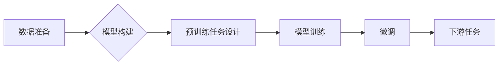

# 大语言模型的自监督学习

作者：禅与计算机程序设计艺术 / Zen and the Art of Computer Programming

## 1. 背景介绍

### 1.1 问题的由来

随着深度学习技术的快速发展，大语言模型 (Large Language Model, LLM) 在自然语言处理领域取得了巨大突破。LLM 能够学习海量的文本数据，并展现出强大的语言理解和生成能力，例如文本摘要、机器翻译、问答系统、代码生成等。然而，传统的 LLM 训练方法通常依赖于大量人工标注的训练数据，这不仅成本高昂，而且难以获取足够多的高质量数据。

为了克服上述问题，自监督学习 (Self-Supervised Learning) 应运而生。自监督学习通过从无标注数据中学习有用的信息，来训练模型。近年来，自监督学习在计算机视觉、语音识别等领域取得了显著成果，并逐渐应用于 LLM 的训练中。

### 1.2 研究现状

目前，自监督学习在 LLM 训练中的研究主要集中在以下几个方面：

* **掩码语言模型 (Masked Language Modeling, MLM)**：MLM 是自监督学习中的一种常用方法，它通过掩盖文本中的部分词语，并让模型预测被掩盖的词语，来学习语言的语义和语法信息。例如，BERT、RoBERTa 等模型都采用了 MLM 的训练方法。
* **对比学习 (Contrastive Learning)**：对比学习通过比较不同样本之间的相似性或差异性，来学习数据的表示。例如，SimCSE、MoCo 等模型都采用了对比学习的训练方法。
* **生成式预训练 (Generative Pre-training)**：生成式预训练通过训练模型生成新的文本，来学习语言的结构和语义信息。例如，GPT-3、GPT-4 等模型都采用了生成式预训练的训练方法。

### 1.3 研究意义

自监督学习为 LLM 的训练提供了新的思路，它可以有效地利用海量的无标注数据，降低模型训练成本，提高模型性能。自监督学习在 LLM 训练中的应用，将推动 LLM 技术的进一步发展，并为自然语言处理领域带来新的突破。

### 1.4 本文结构

本文将深入探讨大语言模型的自监督学习，内容涵盖以下几个方面：

* 核心概念与联系
* 核心算法原理 & 具体操作步骤
* 数学模型和公式 & 详细讲解 & 举例说明
* 项目实践：代码实例和详细解释说明
* 实际应用场景
* 工具和资源推荐
* 总结：未来发展趋势与挑战
* 附录：常见问题与解答

## 2. 核心概念与联系

### 2.1 自监督学习

自监督学习是一种机器学习方法，它不需要人工标注的训练数据，而是通过从数据本身中学习有用的信息，来训练模型。自监督学习的本质是将一个任务分解成多个子任务，并利用这些子任务之间的关系来学习数据的表示。

### 2.2 大语言模型

大语言模型 (LLM) 是一种深度学习模型，它能够学习海量的文本数据，并展现出强大的语言理解和生成能力。LLM 通常采用 Transformer 架构，并使用自注意力机制来捕获句子中不同词语之间的关系。

### 2.3 自监督学习与大语言模型的联系

自监督学习可以有效地应用于大语言模型的训练，因为它可以利用海量的无标注文本数据，降低模型训练成本，提高模型性能。自监督学习可以帮助 LLM 学习更深层的语言结构和语义信息，从而提高其语言理解和生成能力。

## 3. 核心算法原理 & 具体操作步骤

### 3.1 算法原理概述

自监督学习在 LLM 训练中的核心算法原理是：通过设计一个预训练任务，让模型从无标注数据中学习有用的信息，并将其应用于下游任务。常见的预训练任务包括：

* **掩码语言模型 (MLM)**：MLM 通过掩盖文本中的部分词语，并让模型预测被掩盖的词语，来学习语言的语义和语法信息。
* **对比学习 (Contrastive Learning)**：对比学习通过比较不同样本之间的相似性或差异性，来学习数据的表示。
* **生成式预训练 (Generative Pre-training)**：生成式预训练通过训练模型生成新的文本，来学习语言的结构和语义信息。

### 3.2 算法步骤详解

**以 MLM 为例，自监督学习在 LLM 训练中的具体步骤如下：**

1. **数据准备**: 收集大量的无标注文本数据。
2. **模型构建**: 选择一个合适的 LLM 架构，例如 BERT、RoBERTa 等。
3. **预训练任务设计**: 定义 MLM 任务，即随机掩盖文本中的部分词语，并让模型预测被掩盖的词语。
4. **模型训练**: 使用预训练任务对模型进行训练，并优化模型参数。
5. **微调**: 将预训练好的模型应用于下游任务，并使用少量标注数据对模型进行微调。

**具体流程图如下：**



### 3.3 算法优缺点

**自监督学习在 LLM 训练中的优点：**

* **降低训练成本**: 不需要人工标注数据，可以利用海量的无标注数据。
* **提高模型性能**: 可以学习更深层的语言结构和语义信息，提高模型的语言理解和生成能力。
* **通用性强**: 预训练好的模型可以应用于各种下游任务。

**自监督学习在 LLM 训练中的缺点：**

* **训练时间长**: 由于需要处理大量的无标注数据，训练时间相对较长。
* **模型复杂**: 自监督学习模型通常比较复杂，需要大量的计算资源。
* **数据质量影响**: 数据质量会影响模型的性能，需要对数据进行预处理和清洗。

### 3.4 算法应用领域

自监督学习在 LLM 训练中的应用领域非常广泛，包括：

* **文本摘要**: 生成文本的简短摘要。
* **机器翻译**: 将一种语言翻译成另一种语言。
* **问答系统**: 回答用户提出的问题。
* **代码生成**: 生成代码。
* **对话系统**: 与用户进行自然语言对话。

## 4. 数学模型和公式 & 详细讲解 & 举例说明

### 4.1 数学模型构建

**以 MLM 为例，自监督学习的数学模型可以描述为：**

假设文本序列为 $x = (x_1, x_2, ..., x_n)$，其中 $x_i$ 表示第 $i$ 个词语。

1. **掩盖操作**: 随机掩盖文本中的部分词语，得到掩盖后的文本序列 $x' = (x'_1, x'_2, ..., x'_n)$。
2. **模型预测**: 使用 LLM 模型预测被掩盖的词语，得到预测结果 $\hat{x} = (\hat{x}_1, \hat{x}_2, ..., \hat{x}_n)$。
3. **损失函数**: 使用交叉熵损失函数来计算模型预测结果与真实标签之间的差异，并优化模型参数。

**损失函数定义如下：**

$$
L = -\sum_{i=1}^{n} y_i \log \hat{y}_i
$$

其中，$y_i$ 表示第 $i$ 个词语的真实标签，$\hat{y}_i$ 表示模型预测的第 $i$ 个词语的概率分布。

### 4.2 公式推导过程

**以 BERT 模型为例，MLM 的公式推导过程如下：**

1. **输入层**: 将文本序列 $x$ 转换成词嵌入向量，并将其输入到 BERT 模型中。
2. **编码层**: BERT 模型使用 Transformer 架构，通过多层自注意力机制来编码文本序列，并生成每个词语的上下文表示。
3. **预测层**: 使用一个线性层来预测被掩盖的词语。

**BERT 模型的输出层可以表示为：**

$$
\hat{x}_i = softmax(W_o h_i)
$$

其中，$W_o$ 表示预测层的权重矩阵，$h_i$ 表示第 $i$ 个词语的上下文表示。

### 4.3 案例分析与讲解

**以 BERT 模型为例，MLM 的案例分析如下：**

假设文本序列为 "The cat sat on the mat."，随机掩盖 "cat" 和 "mat"，得到掩盖后的文本序列 "The [MASK] sat on the [MASK]."。

BERT 模型会根据上下文信息，预测 "cat" 和 "mat"，并输出预测结果。

### 4.4 常见问题解答

**常见问题：**

* **如何选择合适的预训练任务？**
* **如何评估自监督学习模型的性能？**
* **如何将自监督学习模型应用于下游任务？**

**解答：**

* **预训练任务的选择**: 需要根据具体的下游任务选择合适的预训练任务，例如，如果下游任务是文本摘要，则可以选择 MLM 或生成式预训练任务。
* **模型性能评估**: 可以使用各种指标来评估自监督学习模型的性能，例如，困惑度 (Perplexity)、准确率 (Accuracy)、召回率 (Recall) 等。
* **下游任务应用**: 可以将预训练好的模型应用于各种下游任务，并使用少量标注数据对其进行微调。

## 5. 项目实践：代码实例和详细解释说明

### 5.1 开发环境搭建

**开发环境搭建步骤如下：**

1. 安装 Python 和必要的库，例如 TensorFlow、PyTorch 等。
2. 下载预训练好的 LLM 模型，例如 BERT、RoBERTa 等。
3. 准备训练数据，例如，可以从网上下载公开的文本数据集。

### 5.2 源代码详细实现

**以下是一个使用 BERT 模型进行 MLM 预训练的代码示例：**

```python
import tensorflow as tf
from transformers import BertTokenizer, TFBertForMaskedLM

# 加载 BERT 模型和词典
tokenizer = BertTokenizer.from_pretrained('bert-base-uncased')
model = TFBertForMaskedLM.from_pretrained('bert-base-uncased')

# 定义 MLM 任务
def mask_tokens(inputs):
  # 随机掩盖文本中的部分词语
  masked_inputs = tokenizer.mask(inputs, masked_lm_prob=0.15)
  return masked_inputs

# 定义训练步骤
def train_step(inputs, labels):
  # 将文本序列转换成词嵌入向量
  input_ids = tokenizer.convert_tokens_to_ids(inputs)
  input_ids = tf.constant(input_ids, shape=(1, len(input_ids)))

  # 使用 BERT 模型进行预测
  outputs = model(input_ids)
  predictions = outputs.logits

  # 计算损失函数
  loss = tf.keras.losses.sparse_categorical_crossentropy(labels, predictions)

  # 优化模型参数
  optimizer = tf.keras.optimizers.Adam(epsilon=1e-08)
  optimizer.minimize(loss, model.trainable_variables)

  return loss

# 训练模型
for epoch in range(10):
  for batch in train_
    loss = train_step(batch, batch)
    print('Epoch:', epoch, 'Loss:', loss)
```

### 5.3 代码解读与分析

**代码解读：**

* 代码首先加载 BERT 模型和词典。
* 然后定义 MLM 任务，即随机掩盖文本中的部分词语。
* 接着定义训练步骤，包括将文本序列转换成词嵌入向量、使用 BERT 模型进行预测、计算损失函数、优化模型参数等。
* 最后，使用训练数据对模型进行训练。

**代码分析：**

* 代码使用了 TensorFlow 库来构建和训练模型。
* 代码使用了 transformers 库来加载预训练好的 BERT 模型和词典。
* 代码使用 `mask_tokens` 函数来随机掩盖文本中的部分词语。
* 代码使用 `train_step` 函数来定义训练步骤。

### 5.4 运行结果展示

**运行结果展示：**

* 代码运行结束后，可以得到训练好的 BERT 模型。
* 可以使用训练好的模型来进行各种下游任务，例如，文本摘要、机器翻译、问答系统等。

## 6. 实际应用场景

### 6.1 文本摘要

自监督学习可以用于训练文本摘要模型，例如，可以使用 MLM 任务来学习文本的语义和语法信息，从而生成更准确的文本摘要。

### 6.2 机器翻译

自监督学习可以用于训练机器翻译模型，例如，可以使用对比学习任务来学习不同语言之间的对应关系，从而提高机器翻译的准确率。

### 6.3 问答系统

自监督学习可以用于训练问答系统模型，例如，可以使用生成式预训练任务来学习问答对的结构和语义信息，从而提高问答系统的准确率。

### 6.4 未来应用展望

自监督学习在 LLM 训练中的应用前景非常广阔，未来将会在以下几个方面得到进一步发展：

* **更强大的预训练任务**: 探索更有效的预训练任务，例如，多任务学习、自适应学习等。
* **更复杂的模型架构**: 设计更复杂的模型架构，例如，多层 Transformer、图神经网络等。
* **更有效的训练方法**: 开发更有效的训练方法，例如，对抗训练、元学习等。

## 7. 工具和资源推荐

### 7.1 学习资源推荐

* **Hugging Face**: 提供了大量的预训练模型和工具，可以方便地进行 LLM 训练和应用。
* **TensorFlow**: 提供了强大的深度学习框架，可以用于构建和训练 LLM 模型。
* **PyTorch**: 提供了另一个强大的深度学习框架，可以用于构建和训练 LLM 模型。

### 7.2 开发工具推荐

* **Jupyter Notebook**: 提供了交互式的编程环境，可以方便地进行代码编写和调试。
* **VS Code**: 提供了强大的代码编辑器，可以方便地进行代码编写和调试。
* **Google Colab**: 提供了免费的云计算环境，可以方便地进行 LLM 训练和应用。

### 7.3 相关论文推荐

* **BERT: Pre-training of Deep Bidirectional Transformers for Language Understanding**: BERT 模型的论文，介绍了 MLM 的训练方法。
* **SimCSE: Simple Contrastive Learning of Sentence Embeddings**: SimCSE 模型的论文，介绍了对比学习的训练方法。
* **GPT-3: Language Models are Few-Shot Learners**: GPT-3 模型的论文，介绍了生成式预训练的训练方法。

### 7.4 其他资源推荐

* **CSDN**: 提供了大量的技术文章和博客，可以学习 LLM 相关的知识。
* **知乎**: 提供了大量的技术问答和讨论，可以与其他开发者交流学习。

## 8. 总结：未来发展趋势与挑战

### 8.1 研究成果总结

自监督学习在 LLM 训练中取得了显著成果，它可以有效地利用海量的无标注数据，降低模型训练成本，提高模型性能。自监督学习为 LLM 技术的发展提供了新的思路，并为自然语言处理领域带来了新的突破。

### 8.2 未来发展趋势

自监督学习在 LLM 训练中的未来发展趋势包括：

* **更强大的预训练任务**: 探索更有效的预训练任务，例如，多任务学习、自适应学习等。
* **更复杂的模型架构**: 设计更复杂的模型架构，例如，多层 Transformer、图神经网络等。
* **更有效的训练方法**: 开发更有效的训练方法，例如，对抗训练、元学习等。

### 8.3 面临的挑战

自监督学习在 LLM 训练中也面临着一些挑战，例如：

* **数据质量**: 数据质量会影响模型的性能，需要对数据进行预处理和清洗。
* **训练时间**: 由于需要处理大量的无标注数据，训练时间相对较长。
* **模型复杂**: 自监督学习模型通常比较复杂，需要大量的计算资源。

### 8.4 研究展望

未来，自监督学习将会在 LLM 训练中得到更广泛的应用，并推动 LLM 技术的进一步发展。相信自监督学习将会为自然语言处理领域带来更多新的突破。

## 9. 附录：常见问题与解答

**常见问题：**

* **自监督学习与无监督学习有什么区别？**
* **自监督学习与半监督学习有什么区别？**
* **如何选择合适的预训练任务？**
* **如何评估自监督学习模型的性能？**
* **如何将自监督学习模型应用于下游任务？**

**解答：**

* **自监督学习与无监督学习的区别**: 自监督学习是一种特殊的无监督学习，它通过从数据本身中学习有用的信息，来训练模型。而无监督学习则更加泛化，它可以包括自监督学习、聚类、降维等多种方法。
* **自监督学习与半监督学习的区别**: 自监督学习不需要人工标注数据，而半监督学习则需要少量的人工标注数据。
* **预训练任务的选择**: 需要根据具体的下游任务选择合适的预训练任务，例如，如果下游任务是文本摘要，则可以选择 MLM 或生成式预训练任务。
* **模型性能评估**: 可以使用各种指标来评估自监督学习模型的性能，例如，困惑度 (Perplexity)、准确率 (Accuracy)、召回率 (Recall) 等。
* **下游任务应用**: 可以将预训练好的模型应用于各种下游任务，并使用少量标注数据对其进行微调。
