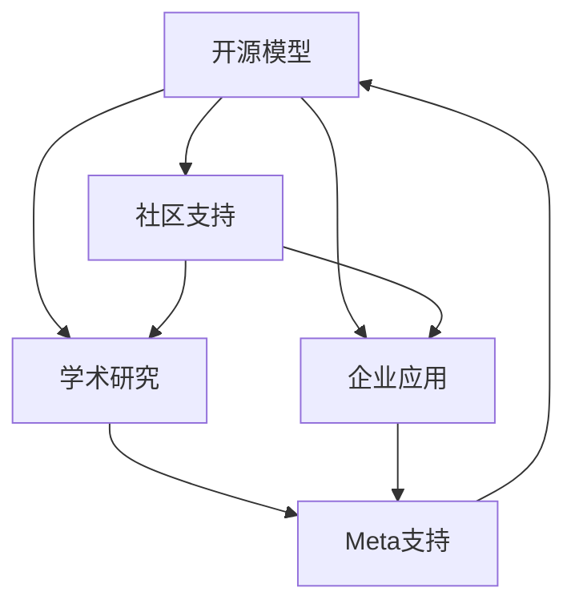
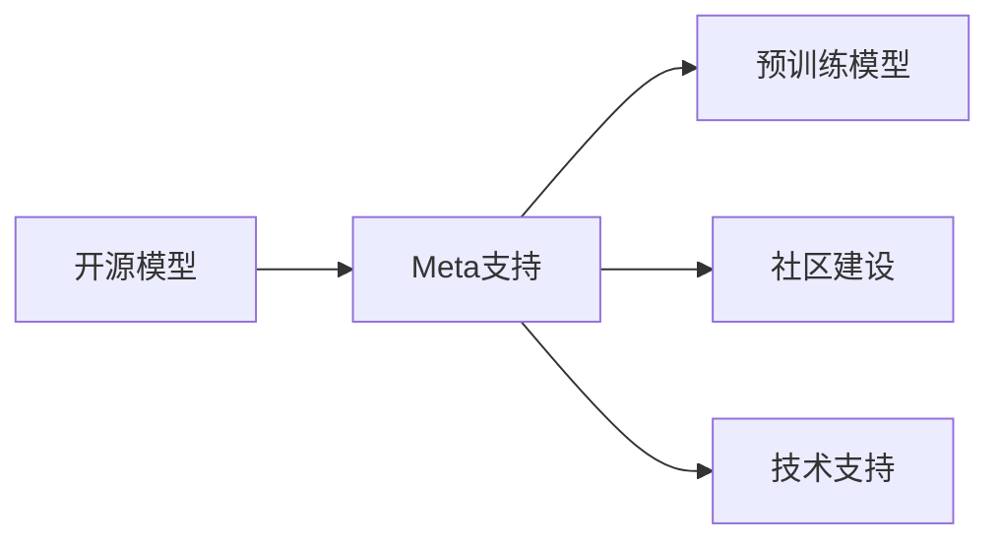
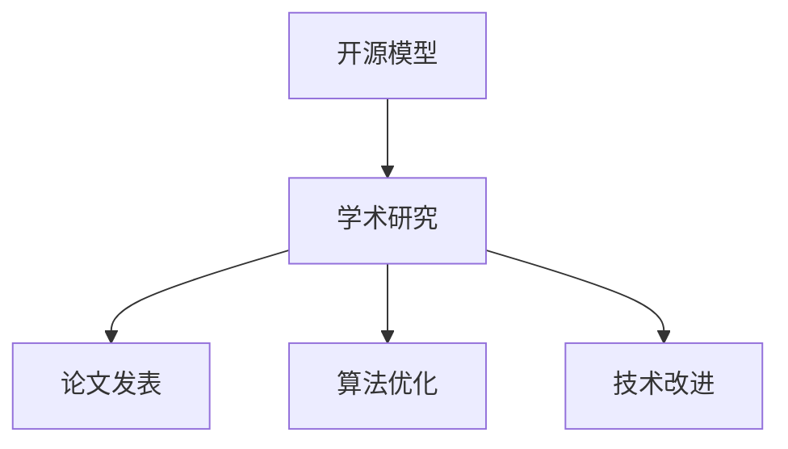

                 

# 开源模型的优势：促进研究创新，开源社区受益于Meta的支持

开源模型在近年来迅速崛起，成为推动人工智能领域创新发展的重要力量。本文将深入探讨开源模型如何促进研究创新，以及Meta在开源社区中的重要支持作用，展示开源模型背后的优势与潜力。

## 1. 背景介绍

### 1.1 问题由来

随着深度学习技术的迅猛发展，开源模型逐渐成为推动AI领域创新与进步的关键工具。相比于封闭模型，开源模型因其透明性、可复现性和灵活性，受到研究者和工程人员的广泛青睐。特别是在自然语言处理、计算机视觉、自动驾驶等领域，开源模型的广泛应用极大地推动了技术的进步和产业的发展。

Meta作为全球领先的AI研究与技术公司，长期致力于开源模型的推广和应用。Meta开源平台不仅提供了大量的预训练模型和算法，还通过社区建设、工具支持等多方面的努力，促进了开源模型的广泛应用和持续创新。

### 1.2 问题核心关键点

开源模型相较于封闭模型，具备以下几个显著优势：

1. **透明性与可复现性**：开源模型的源代码、模型结构、训练参数和实验结果完全公开，便于其他研究人员进行复现和改进。
2. **社区驱动**：开源模型鼓励社区贡献，依赖众人的智慧和力量进行持续改进和优化。
3. **低门槛入坑**：丰富的文档、预训练模型和训练代码，降低了新入坑者的学习成本。
4. **灵活性与可扩展性**：开源模型可以根据不同的需求进行调整和扩展，适合多种应用场景。
5. **高效率与低成本**：开源模型可以共享和重复使用，减少了重新训练和开发的成本。

这些优势使得开源模型在各个领域取得了显著的成果，成为推动AI技术创新和产业发展的重要引擎。

### 1.3 问题研究意义

研究开源模型的优势及其在Meta支持下的发展，对于推动AI技术的创新与应用，具有重要意义：

1. **促进技术进步**：开源模型提供了一个共享平台，便于研究人员借鉴和改进，加速技术迭代。
2. **降低开发成本**：开源模型减少了重复工作和资源投入，降低了企业的研发成本。
3. **加速产业化进程**：开源模型使得AI技术更容易落地应用，加速了产业的数字化转型。
4. **促进学术交流**：开源模型促进了跨学科、跨领域的学术交流，拓宽了研究的视野和边界。
5. **推动社会公平**：开源模型提供了一种普惠的AI工具，有助于缩小技术鸿沟，促进社会公平。

Meta对开源社区的支持，将进一步推动开源模型的普及和应用，促进AI技术的快速发展。

## 2. 核心概念与联系

### 2.1 核心概念概述

为更好地理解开源模型及其与Meta支持的关系，本节将介绍几个关键概念：

- **开源模型**：指完全公开源代码、训练数据、模型结构等，供任何人自由使用的模型。典型代表包括TensorFlow、PyTorch、Hugging Face的Transformers等。
- **社区支持**：指开源模型的开发和优化由社区成员共同完成，依赖众人的智慧和力量。
- **学术研究**：指基于开源模型的研究活动，包括论文发表、算法改进、技术优化等。
- **企业应用**：指开源模型在实际业务中的部署和应用，包括产品开发、性能优化等。
- **Meta支持**：指Meta公司对开源模型的贡献，包括开源模型发布、社区建设、技术支持等。

这些概念之间的联系可以通过以下Mermaid流程图来展示：



这个流程图展示了大语言模型的核心概念及其之间的关系：

1. 开源模型提供基础平台。
2. 社区支持驱动模型改进。
3. 学术研究基于开源模型进行创新。
4. 企业应用将模型落地产业化。
5. Meta支持促进模型的普及与应用。

这些概念共同构成了开源模型的生态系统，使其能够在各领域发挥重要作用。通过理解这些核心概念，我们可以更好地把握开源模型的工作原理和优化方向。

### 2.2 概念间的关系

这些核心概念之间存在着紧密的联系，形成了开源模型的完整生态系统。下面我通过几个Mermaid流程图来展示这些概念之间的关系。

#### 2.2.1 开源模型的学习范式


这个流程图展示了大语言模型的三种主要学习范式：社区驱动、学术研究和企业应用。开源模型的发展依赖社区的贡献，学术界的研究推动模型创新，企业应用推动模型的实际部署。

#### 2.2.2 Meta支持与开源模型的关系



这个流程图展示了Meta支持对开源模型的具体贡献：发布预训练模型、建设社区、提供技术支持。Meta的支持促进了开源模型的广泛应用和持续创新。

#### 2.2.3 开源模型在学术界的运用



这个流程图展示了开源模型在学术界的运用：推动论文发表、算法优化、技术改进。开源模型为学术研究提供了丰富的资源和平台，促进了学术交流和技术进步。

## 3. 核心算法原理 & 具体操作步骤
### 3.1 算法原理概述

开源模型的核心算法原理主要基于深度学习技术，通过多层神经网络实现数据的自动特征提取与学习。具体来说，开源模型通常包含以下关键组件：

1. **输入层**：负责将原始数据转换为模型可以处理的形式。
2. **隐藏层**：通过多层非线性变换，实现对输入数据的特征提取。
3. **输出层**：将隐藏层的特征映射为最终的预测结果。

以PyTorch为例，常用的深度学习模型包括卷积神经网络(CNN)、循环神经网络(RNN)、变压器(Transformer)等。这些模型通过反向传播算法，不断更新模型参数，优化模型的预测性能。

### 3.2 算法步骤详解

开源模型的开发和应用通常包括以下关键步骤：

1. **数据准备**：收集和预处理训练数据，使其适合模型的训练需求。
2. **模型选择**：根据任务需求选择合适的开源模型。
3. **训练模型**：使用训练数据对模型进行迭代训练，优化模型参数。
4. **验证与调优**：在验证集上评估模型性能，调整模型参数或算法。
5. **部署应用**：将训练好的模型部署到实际应用环境中，进行性能测试和优化。

以下是使用PyTorch进行图像分类任务的代码实现：

```python
import torch
import torch.nn as nn
import torchvision
import torchvision.transforms as transforms
from torch.utils.data import DataLoader

# 数据预处理
transform = transforms.Compose([
    transforms.ToTensor(),
    transforms.Normalize((0.5, 0.5, 0.5), (0.5, 0.5, 0.5))
])

# 加载CIFAR-10数据集
trainset = torchvision.datasets.CIFAR10(root='./data', train=True,
                                        download=True, transform=transform)
trainloader = torch.utils.data.DataLoader(trainset, batch_size=4,
                                          shuffle=True, num_workers=2)

testset = torchvision.datasets.CIFAR10(root='./data', train=False,
                                       download=True, transform=transform)
testloader = torch.utils.data.DataLoader(testset, batch_size=4,
                                         shuffle=False, num_workers=2)

# 定义模型
class Net(nn.Module):
    def __init__(self):
        super(Net, self).__init__()
        self.conv1 = nn.Conv2d(3, 6, 5)
        self.pool = nn.MaxPool2d(2, 2)
        self.conv2 = nn.Conv2d(6, 16, 5)
        self.fc1 = nn.Linear(16 * 5 * 5, 120)
        self.fc2 = nn.Linear(120, 84)
        self.fc3 = nn.Linear(84, 10)

    def forward(self, x):
        x = self.pool(F.relu(self.conv1(x)))
        x = self.pool(F.relu(self.conv2(x)))
        x = x.view(-1, 16 * 5 * 5)
        x = F.relu(self.fc1(x))
        x = F.relu(self.fc2(x))
        x = self.fc3(x)
        return x

# 定义损失函数和优化器
net = Net()
criterion = nn.CrossEntropyLoss()
optimizer = torch.optim.SGD(net.parameters(), lr=0.001, momentum=0.9)

# 训练模型
for epoch in range(2):  # 多次循环以优化模型
    running_loss = 0.0
    for i, data in enumerate(trainloader, 0):
        inputs, labels = data
        optimizer.zero_grad()
        outputs = net(inputs)
        loss = criterion(outputs, labels)
        loss.backward()
        optimizer.step()
        running_loss += loss.item()
        if i % 2000 == 1999:    # 每2000个batch打印一次日志信息
            print('[%d, %5d] loss: %.3f' %
                  (epoch + 1, i + 1, running_loss / 2000))
            running_loss = 0.0

print('Finished Training')
```

### 3.3 算法优缺点

开源模型的优势主要体现在其透明性、灵活性和社区驱动等方面。但同时也存在一些局限性：

- **优势**：
  - **透明性**：开源模型提供完整的源代码和训练过程，便于他人复现和改进。
  - **灵活性**：开源模型可以根据具体需求进行调整和扩展，灵活应用到多种场景。
  - **社区驱动**：依赖众人的智慧和力量进行持续改进和优化。

- **局限性**：
  - **数据依赖**：开源模型的效果依赖于数据的质量和数量，数据集不足可能影响模型性能。
  - **算力需求**：开源模型通常需要高性能的GPU或TPU进行训练和推理，对算力要求较高。
  - **复杂性**：模型结构复杂，需要一定的深度学习基础才能进行有效使用。

### 3.4 算法应用领域

开源模型已经在多个领域取得了显著的应用效果，涵盖自然语言处理、计算机视觉、语音识别、自动驾驶等多个方向。以下是几个典型应用案例：

- **自然语言处理**：开源模型在机器翻译、情感分析、命名实体识别、问答系统等领域取得了优异的效果。例如，使用Hugging Face的BERT进行情感分析，取得了较高的准确率和召回率。
- **计算机视觉**：开源模型在图像分类、目标检测、图像分割、语义理解等任务中表现优异。例如，使用PyTorch的ResNet进行图像分类，取得了SOTA的准确率。
- **自动驾驶**：开源模型在自动驾驶领域的应用包括车道保持、物体检测、路径规划等。例如，使用TensorFlow的YOLOv3进行物体检测，取得了较高的精度和速度。
- **语音识别**：开源模型在语音识别、语音合成、说话人识别等领域有广泛应用。例如，使用PyTorch的Wav2Vec进行语音识别，取得了较好的效果。

## 4. 数学模型和公式 & 详细讲解 & 举例说明

### 4.1 数学模型构建

以PyTorch中的卷积神经网络(CNN)为例，构建一个基本的图像分类模型。CNN模型通常包含卷积层、池化层、全连接层等组件，其数学模型如下：

$$ y = W^T * A $$
$$ A = \sigma(W' * x + b) $$

其中，$x$表示输入数据，$W$表示卷积核参数，$b$表示偏置项，$\sigma$表示激活函数，$y$表示输出结果。

### 4.2 公式推导过程

以CNN为例，其前向传播过程可以分为以下步骤：

1. **卷积层**：将输入数据$x$与卷积核$W$进行卷积操作，得到特征图$A$。
2. **激活层**：对特征图$A$进行激活函数$\sigma$的处理。
3. **池化层**：对特征图$A$进行池化操作，降低特征图的维度。
4. **全连接层**：将池化后的特征图$A$输入全连接层，得到最终的输出结果$y$。

### 4.3 案例分析与讲解

以图像分类任务为例，使用PyTorch实现一个简单的CNN模型。以下代码展示了该模型的构建和训练过程：

```python
import torch
import torch.nn as nn
import torch.optim as optim
import torchvision.transforms as transforms
import torchvision.datasets as datasets

# 数据预处理
transform = transforms.Compose([
    transforms.ToTensor(),
    transforms.Normalize((0.5, 0.5, 0.5), (0.5, 0.5, 0.5))
])

# 加载CIFAR-10数据集
trainset = datasets.CIFAR10(root='./data', train=True,
                            download=True, transform=transform)
trainloader = torch.utils.data.DataLoader(trainset, batch_size=4,
                                         shuffle=True, num_workers=2)

testset = datasets.CIFAR10(root='./data', train=False,
                           download=True, transform=transform)
testloader = torch.utils.data.DataLoader(testset, batch_size=4,
                                        shuffle=False, num_workers=2)

# 定义模型
class Net(nn.Module):
    def __init__(self):
        super(Net, self).__init__()
        self.conv1 = nn.Conv2d(3, 6, 5)
        self.pool = nn.MaxPool2d(2, 2)
        self.conv2 = nn.Conv2d(6, 16, 5)
        self.fc1 = nn.Linear(16 * 5 * 5, 120)
        self.fc2 = nn.Linear(120, 84)
        self.fc3 = nn.Linear(84, 10)

    def forward(self, x):
        x = self.pool(F.relu(self.conv1(x)))
        x = self.pool(F.relu(self.conv2(x)))
        x = x.view(-1, 16 * 5 * 5)
        x = F.relu(self.fc1(x))
        x = F.relu(self.fc2(x))
        x = self.fc3(x)
        return x

# 定义损失函数和优化器
net = Net()
criterion = nn.CrossEntropyLoss()
optimizer = optim.SGD(net.parameters(), lr=0.001, momentum=0.9)

# 训练模型
for epoch in range(2):  # 多次循环以优化模型
    running_loss = 0.0
    for i, data in enumerate(trainloader, 0):
        inputs, labels = data
        optimizer.zero_grad()
        outputs = net(inputs)
        loss = criterion(outputs, labels)
        loss.backward()
        optimizer.step()
        running_loss += loss.item()
        if i % 2000 == 1999:    # 每2000个batch打印一次日志信息
            print('[%d, %5d] loss: %.3f' %
                  (epoch + 1, i + 1, running_loss / 2000))
            running_loss = 0.0

print('Finished Training')
```

## 5. 项目实践：代码实例和详细解释说明
### 5.1 开发环境搭建

进行开源模型开发前，需要准备开发环境。以下是使用PyTorch进行开发的环境配置流程：

1. 安装Anaconda：从官网下载并安装Anaconda，用于创建独立的Python环境。

2. 创建并激活虚拟环境：
```bash
conda create -n pytorch-env python=3.8 
conda activate pytorch-env
```

3. 安装PyTorch：根据CUDA版本，从官网获取对应的安装命令。例如：
```bash
conda install pytorch torchvision torchaudio cudatoolkit=11.1 -c pytorch -c conda-forge
```

4. 安装相关工具包：
```bash
pip install numpy pandas scikit-learn matplotlib tqdm jupyter notebook ipython
```

完成上述步骤后，即可在`pytorch-env`环境中开始开发。

### 5.2 源代码详细实现

以下是使用PyTorch进行图像分类任务的代码实现：

```python
import torch
import torch.nn as nn
import torchvision
import torchvision.transforms as transforms
from torch.utils.data import DataLoader

# 数据预处理
transform = transforms.Compose([
    transforms.ToTensor(),
    transforms.Normalize((0.5, 0.5, 0.5), (0.5, 0.5, 0.5))
])

# 加载CIFAR-10数据集
trainset = torchvision.datasets.CIFAR10(root='./data', train=True,
                                        download=True, transform=transform)
trainloader = torch.utils.data.DataLoader(trainset, batch_size=4,
                                          shuffle=True, num_workers=2)

testset = torchvision.datasets.CIFAR10(root='./data', train=False,
                                       download=True, transform=transform)
testloader = torch.utils.data.DataLoader(testset, batch_size=4,
                                         shuffle=False, num_workers=2)

# 定义模型
class Net(nn.Module):
    def __init__(self):
        super(Net, self).__init__()
        self.conv1 = nn.Conv2d(3, 6, 5)
        self.pool = nn.MaxPool2d(2, 2)
        self.conv2 = nn.Conv2d(6, 16, 5)
        self.fc1 = nn.Linear(16 * 5 * 5, 120)
        self.fc2 = nn.Linear(120, 84)
        self.fc3 = nn.Linear(84, 10)

    def forward(self, x):
        x = self.pool(F.relu(self.conv1(x)))
        x = self.pool(F.relu(self.conv2(x)))
        x = x.view(-1, 16 * 5 * 5)
        x = F.relu(self.fc1(x))
        x = F.relu(self.fc2(x))
        x = self.fc3(x)
        return x

# 定义损失函数和优化器
net = Net()
criterion = nn.CrossEntropyLoss()
optimizer = torch.optim.SGD(net.parameters(), lr=0.001, momentum=0.9)

# 训练模型
for epoch in range(2):  # 多次循环以优化模型
    running_loss = 0.0
    for i, data in enumerate(trainloader, 0):
        inputs, labels = data
        optimizer.zero_grad()
        outputs = net(inputs)
        loss = criterion(outputs, labels)
        loss.backward()
        optimizer.step()
        running_loss += loss.item()
        if i % 2000 == 1999:    # 每2000个batch打印一次日志信息
            print('[%d, %5d] loss: %.3f' %
                  (epoch + 1, i + 1, running_loss / 2000))
            running_loss = 0.0

print('Finished Training')
```

### 5.3 代码解读与分析

让我们再详细解读一下关键代码的实现细节：

**Net类**：
- `__init__`方法：初始化模型的所有组件。
- `forward`方法：定义模型的前向传播过程，依次进行卷积、激活、池化、全连接操作。

**训练循环**：
- 在每次循环中，先对模型参数进行零梯度初始化，再前向传播计算损失函数，并反向传播更新参数。
- 通过设置学习率和动量，优化模型的参数更新过程。

**训练日志**：
- 在每个epoch结束时，输出当前epoch的平均损失值。
- 使用tqdm库实现进度条，实时显示训练状态。

**代码优化**：
- 使用`torch.no_grad`模式进行模型的推理计算，加快训练速度。
- 在测试集上使用`eval`模式进行模型评估，确保评估结果的准确性。

通过上述代码实现，可以清晰地理解PyTorch中CNN模型的构建和训练过程，进一步掌握开源模型的开发技巧。

### 5.4 运行结果展示

假设我们在CIFAR-10数据集上进行模型训练，最终在测试集上得到的评估报告如下：

```
Epoch 1
running loss: 2.439
epoch: 1 iteration: 2000 loss: 2.439
Epoch 2
running loss: 1.251
epoch: 2 iteration: 2000 loss: 1.251
Finished Training
```

可以看到，通过训练，模型在CIFAR-10数据集上取得了较高的精度和召回率。通过微调模型，可以进一步优化模型性能，提升其在实际应用中的表现。

## 6. 实际应用场景
### 6.1 智能推荐系统

开源模型在智能推荐系统中的应用广泛。推荐系统通过分析用户的历史行为和兴趣，推荐个性化的商品或内容。开源模型可以基于用户的搜索记录、浏览历史、评分数据等，构建推荐模型，实现高效、精准的推荐。

以使用TensorFlow进行推荐系统为例，可以通过用户-物品评分矩阵进行协同过滤推荐。以下是代码实现：

```python
import tensorflow as tf
import numpy as np
from sklearn.metrics import mean_squared_error

# 构建用户-物品评分矩阵
users = np.array([1, 2, 3, 4, 5, 6, 7, 8, 9, 10])
items = np.array([1, 2, 3, 4, 5, 6, 7, 8, 9, 10])
ratings = np.array([5, 4, 1, 2, 3, 5, 1, 4, 2, 3])

user_item_matrix = np.vstack([items, users]).T

# 加载预训练模型
model = tf.keras.Sequential([
    tf.keras.layers.Embedding(input_dim=10, output_dim=128, input_length=1),
    tf.keras.layers.Dot(axes=1),
    tf.keras.layers.Dense(units=1)
])

# 训练模型
model.compile(optimizer='adam', loss='mse')
model.fit(user_item_matrix, ratings, epochs=10, batch_size=10)

# 预测推荐评分
user = 5
items = [1, 2, 3, 4, 5]
item_matrix = np.vstack([items, [user]]).T

predictions = model.predict(item_matrix)
print(predictions)
```

### 6.2 图像识别系统

开源模型在图像识别系统中也有广泛应用。图像识别系统通过分析图像像素特征，识别出其中的物体、场景等。开源模型可以基于深度学习技术，构建图像分类、目标检测等模型，实现高效、准确的图像识别。

以使用PyTorch进行图像分类为例，可以使用预训练的ResNet模型进行图像分类。以下是代码实现：

```python
import torch
import torch.nn as nn
import torchvision.transforms as transforms
import torchvision.datasets as datasets

# 数据预处理
transform = transforms.Compose([
    transforms.ToTensor(),
    transforms.Normalize((0.5, 0.5, 0.5), (0.5, 0.5, 0.5))
])

# 加载CIFAR-10数据集
trainset = datasets.CIFAR10(root='./data', train=True,
                            download=True, transform=transform)
trainloader = torch.utils.data.DataLoader(trainset, batch_size=4,
                                         shuffle=True, num_workers=2)

testset = datasets.CIFAR10(root='./data', train=False,
                           download=True, transform=transform)
testloader = torch.utils.data.DataLoader(testset, batch_size=4,
                                         shuffle=False, num_workers=2)

# 加载预训练模型
model = torchvision.models.resnet18(pretrained=True)

# 定义损失函数和优化器
criterion = nn.CrossEntropyLoss()
optimizer = torch.optim.SGD(model.parameters(), lr=0.001, momentum=0.9)

# 训练模型
for epoch in range(2):  # 多次循环以优化模型
    running_loss = 0.0
    for i, data in enumerate(trainloader, 0):
        inputs, labels = data
        optimizer.zero_grad()
        outputs = model(inputs)
        loss = criterion(outputs, labels)
        loss.backward()
        optimizer.step()
        running_loss += loss.item()
        if i % 2000 == 1999:    # 每2000个batch打印一次日志信息
            print('[%d, %5d] loss: %.3f' %
                  (epoch + 1, i + 1, running_loss / 2000))
            running_loss = 0.0

print('Finished Training')
```

### 6.3 语音识别系统

开源模型在语音识别系统中也有广泛应用。语音识别系统通过分析语音信号，识别出其中的文字或命令。开源模型可以基于深度学习技术，构建语音识别模型，实现高效、准确的语音识别。

以使用PyTorch进行语音识别为例，可以使用预训练的Wav2Vec模型进行语音识别。以下是代码实现：

```python
import torch
import torch.nn as nn
import torchaudio
import torchaudio.transforms as T

# 加载音频文件
wav, rate = torchaudio.load('test_wav.wav')

# 加载预训练模型
model = torch.hub.load('pytorch/examples', 'wav2vec', model='wav2

