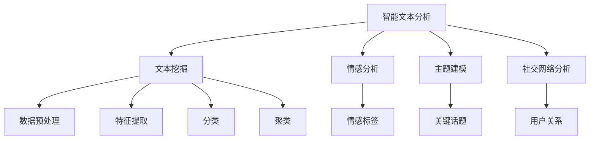

                 

# 智能文本分析在市场研究中的应用

> 关键词：智能文本分析, 市场研究, 文本挖掘, 情感分析, 社交媒体, 消费者洞察

## 1. 背景介绍

### 1.1 问题由来
随着互联网和社交媒体的普及，消费者行为的数字化趋势日益明显。文本数据作为互联网时代重要的信息源泉，蕴藏着大量的市场信息和消费者行为线索。然而，传统的数据处理方法难以有效解析文本数据的丰富内涵，难以从中挖掘出有价值的市场洞察。

与此同时，文本分析技术在自然语言处理(NLP)领域取得了长足进步，尤其是智能文本分析技术，能够在结构化和非结构化数据上自动抽取和分析出有价值的信息。将智能文本分析技术引入市场研究，不仅能提升数据处理的效率和准确性，还能发现潜在的市场趋势和消费者需求，助力企业制定更为精准的营销策略。

### 1.2 问题核心关键点
智能文本分析在市场研究中的应用，主要围绕以下几个核心关键点展开：
- **数据采集与处理**：从互联网、社交媒体、评论网站等渠道自动采集文本数据，并进行预处理和清洗。
- **情感分析与情绪识别**：对文本数据进行情感倾向和情绪状态的分析，发现消费者对品牌、产品或事件的情感反应。
- **主题建模与话题分析**：通过主题建模技术，自动发现文本数据中的关键话题和话题结构，帮助市场研究者捕捉到热点和趋势。
- **社交网络分析**：分析社交媒体上的用户行为和关系，了解消费者的社交网络结构及其影响力分布。
- **消费者洞察与行为预测**：基于智能文本分析得出的数据洞察，进行消费者行为预测和市场趋势预测。

这些关键点的结合，使得智能文本分析能够从海量文本数据中挖掘出有价值的市场信息，帮助企业做出基于数据的决策。

### 1.3 问题研究意义
智能文本分析在市场研究中的应用，具有以下重要意义：
1. **提升数据处理效率**：智能文本分析技术能够自动化处理文本数据，节省大量人力成本和时间成本。
2. **挖掘隐性市场信息**：文本数据中往往包含大量隐性信息，智能文本分析能够从中发现市场趋势和消费者需求。
3. **增强市场决策准确性**：基于文本分析的市场洞察，可以帮助企业制定更为精准的营销策略，提升市场竞争力。
4. **优化产品设计与迭代**：通过分析消费者对产品和服务的反馈，企业能够及时调整产品设计和市场策略，提升产品满意度和市场占有率。
5. **降低市场风险**：智能文本分析能够提前预警市场风险，帮助企业规避潜在危机，确保市场稳定。

总之，智能文本分析为市场研究提供了全新的视角和方法，有望在提升市场决策效率和精准性、优化产品设计、降低市场风险等方面发挥重要作用。

## 2. 核心概念与联系

### 2.1 核心概念概述

为了更好地理解智能文本分析在市场研究中的应用，本节将介绍几个核心概念及其相互联系：

- **智能文本分析(ITA)**：使用自然语言处理技术，从文本数据中自动抽取和分析信息的技术。ITA包括情感分析、主题建模、社交网络分析等多种子技术，可以用于市场研究、舆情监控、客户洞察等多个领域。
- **文本挖掘(Web Mining)**：使用计算机技术，从文本数据中自动发现知识、模式和规律。文本挖掘是ITA的一个重要组成部分，通过数据预处理、特征提取、分类和聚类等技术，实现从文本到知识的转换。
- **情感分析(Affective Analysis)**：分析文本数据中的情感倾向，判断文本是正向、负向还是中性情感。情感分析在市场研究中用于评估消费者对品牌、产品或事件的情感反应。
- **主题建模(Thematic Modeling)**：识别文本数据中的潜在主题结构，提取关键话题和主题。主题建模技术在市场研究中用于发现市场趋势和消费者偏好。
- **社交网络分析(Social Network Analysis)**：分析社交媒体上的用户行为和关系，构建社交网络图谱，评估用户影响力。社交网络分析在市场研究中用于分析消费者社交行为和网络结构。

这些核心概念之间存在着紧密的联系，形成了智能文本分析在市场研究中的应用框架。通过理解这些核心概念，我们可以更好地把握智能文本分析技术的工作原理和优化方向。

### 2.2 概念间的关系

这些核心概念之间存在着紧密的联系，形成了智能文本分析在市场研究中的应用框架。以下通过几个Mermaid流程图来展示这些概念之间的关系：



这个流程图展示了许多关键概念之间的联系：
- 文本挖掘是智能文本分析的基础，包括数据预处理、特征提取、分类和聚类等技术。
- 情感分析在文本挖掘的基础上，进一步识别文本的情感倾向。
- 主题建模在文本挖掘的基础上，发现文本中的潜在主题结构。
- 社交网络分析在情感分析和主题建模的基础上，分析社交媒体上的用户行为和关系。

通过这些关键概念的协同作用，智能文本分析能够从文本数据中挖掘出有价值的市场信息，为市场研究提供有力支持。

## 3. 核心算法原理 & 具体操作步骤
### 3.1 算法原理概述

智能文本分析在市场研究中的应用，本质上是一个文本挖掘和情感分析的过程。其核心算法原理包括以下几个步骤：

1. **数据预处理**：清洗和格式化原始文本数据，去除噪音和无关信息，为后续分析奠定基础。
2. **特征提取**：从文本中提取有用的特征，如词频、TF-IDF、情感得分等，用于后续分析和建模。
3. **情感分析**：使用情感词典、机器学习模型等方法，自动判断文本的情感倾向。
4. **主题建模**：使用LDA、LAT、SVD等算法，自动发现文本中的潜在主题结构，提取关键话题。
5. **社交网络分析**：使用图网络、社区发现等技术，分析社交媒体上的用户行为和关系，构建社交网络图谱。
6. **消费者洞察**：基于情感分析和主题建模的结果，进行消费者行为预测和市场趋势预测，形成有价值的市场洞察。

### 3.2 算法步骤详解

以下详细介绍智能文本分析在市场研究中的应用，具体操作步骤：

**Step 1: 数据采集与处理**

1. **数据采集**：
   - 使用API或爬虫技术，从互联网、社交媒体、评论网站等渠道采集文本数据。
   - 使用Python、R等编程语言，结合requests、BeautifulSoup等库，自动化爬取数据。

2. **数据预处理**：
   - 去除HTML标签、特殊符号和噪音文本。
   - 去除停用词、标点符号和数字。
   - 使用词干提取、词形还原等技术，统一词汇形式。
   - 使用NLP工具，如NLTK、spaCy、jieba等，进行数据清洗和预处理。

**Step 2: 特征提取**

1. **词汇提取**：
   - 将文本分词，提取其中的关键词和短语。
   - 使用词频统计、TF-IDF、词向量等技术，提取关键词的权重和特征。
   - 使用Python库，如scikit-learn、gensim等，进行特征提取和处理。

2. **情感提取**：
   - 使用情感词典，如SentiWordNet、AFINN、TextBlob等，计算文本的情感得分。
   - 使用机器学习模型，如支持向量机、朴素贝叶斯、深度学习等，训练情感分类器。

3. **主题提取**：
   - 使用LDA（潜在狄利克雷分布）、LAT（潜在语义分析）、SVD（奇异值分解）等算法，提取文本中的主题结构。
   - 使用Python库，如gensim、Mallet等，进行主题建模和分析。

**Step 3: 情感分析**

1. **情感词典构建**：
   - 使用公开情感词典，如SentiWordNet、AFINN、NRC情感词典等，构建情感词典库。
   - 使用自定义词典，结合领域知识，增加情感词典的准确性和适应性。

2. **情感得分计算**：
   - 对文本中的每个词汇进行情感得分计算，并累加得分得到文本的整体情感得分。
   - 使用Python库，如TextBlob、nltk等，进行情感得分计算。

3. **情感分类**：
   - 使用机器学习模型，如支持向量机、朴素贝叶斯、深度学习等，训练情感分类器。
   - 使用Python库，如scikit-learn、TensorFlow等，进行情感分类和分析。

**Step 4: 社交网络分析**

1. **用户关系提取**：
   - 使用社交网络API，如Twitter API、Facebook Graph API等，获取用户的关系网络数据。
   - 使用Gephi、NetworkX等工具，分析用户的关系网络结构。

2. **社区发现**：
   - 使用社区发现算法，如Louvain、GN算法等，发现社交网络中的社区和簇。
   - 使用Python库，如NetworkX、Gephi等，进行社区发现和分析。

3. **用户影响力评估**：
   - 使用PageRank、HITS等算法，计算用户节点在网络中的中心性和影响力。
   - 使用Python库，如NetworkX、Gephi等，进行用户影响力评估。

**Step 5: 消费者洞察**

1. **市场趋势预测**：
   - 使用时间序列分析、回归分析等方法，预测市场趋势和变化。
   - 使用Python库，如pandas、statsmodels等，进行市场趋势预测和分析。

2. **消费者行为预测**：
   - 使用机器学习模型，如随机森林、梯度提升树、神经网络等，预测消费者行为。
   - 使用Python库，如scikit-learn、TensorFlow等，进行消费者行为预测和分析。

3. **消费者洞察报告**：
   - 将情感分析、主题建模和社交网络分析的结果整合，形成消费者洞察报告。
   - 使用Python库，如Jupyter Notebook、Pandas、Matplotlib等，进行数据可视化。

### 3.3 算法优缺点

智能文本分析在市场研究中的应用，具有以下优缺点：

**优点**：
1. **高效性**：自动化处理文本数据，节省大量人力成本和时间成本。
2. **准确性**：通过先进的算法和模型，提高了文本分析和情感识别的准确性。
3. **实时性**：实时采集和分析文本数据，快速发现市场趋势和消费者需求。
4. **灵活性**：支持多种数据源和分析方法，灵活应对不同场景和需求。
5. **可扩展性**：可以处理大规模文本数据，具备高度的可扩展性。

**缺点**：
1. **数据质量依赖性**：数据采集和预处理的质量直接影响分析结果的准确性。
2. **模型复杂性**：复杂的算法和模型需要更多的计算资源和时间。
3. **噪音和误判**：文本数据的噪音和误判可能会影响分析结果。
4. **上下文理解不足**：自动化处理可能无法完全理解文本的上下文和复杂含义。

### 3.4 算法应用领域

智能文本分析在市场研究中的应用，广泛涉及以下领域：

1. **市场趋势分析**：通过情感分析和主题建模，发现市场趋势和热点，预测未来变化。
2. **品牌声誉管理**：评估品牌在社交媒体上的声誉和情感反应，进行品牌管理优化。
3. **消费者行为分析**：分析消费者对产品、服务的情感和反馈，优化产品设计和营销策略。
4. **竞争情报分析**：分析竞争对手的市场表现和消费者反馈，制定竞争策略。
5. **市场细分与定位**：通过情感分析和主题建模，识别不同消费群体的需求和偏好，进行市场细分和定位。
6. **营销效果评估**：评估营销活动的效果和消费者反应，优化营销策略。

这些领域的应用，使得智能文本分析在市场研究中具有广泛的应用前景和实践价值。

## 4. 数学模型和公式 & 详细讲解 & 举例说明

### 4.1 数学模型构建

智能文本分析在市场研究中的应用，涉及到多个数学模型和算法。下面以主题建模为例，详细介绍其数学模型构建和公式推导过程。

假设文本数据由N个文档组成，每个文档由n个词汇构成。对于第i个文档，其词汇向量表示为 $\vec{v}_i = (v_{i1}, v_{i2}, ..., v_{in})$，其中 $v_{ik}$ 表示第k个词汇在文档中的出现频率。

主题建模的目标是从文本数据中提取潜在的主题结构，定义主题-词汇分布矩阵 $\mathbf{Z}$，其中 $z_{ik}$ 表示第k个词汇属于第i个主题的概率。

主题-词汇分布矩阵 $\mathbf{Z}$ 的建模通常使用潜在狄利克雷分布(Latent Dirichlet Allocation, LDA)模型，其概率密度函数如下：

$$
p(\mathbf{Z}| \mathbf{\alpha}, \mathbf{\beta}) = \prod_{i=1}^N \prod_{k=1}^K p(z_{ik}| \alpha, \beta) \prod_{i=1}^N \prod_{k=1}^n p(v_{ik}| z_{ik})
$$

其中，$\alpha$ 表示主题分布超参数，$\beta$ 表示词汇主题分布超参数。$z_{ik}$ 服从多项分布：

$$
p(z_{ik}| \alpha, \beta) = \frac{\beta_k z_{ik}}{\sum_{k=1}^K \beta_k z_{ik}}
$$

词汇 $v_{ik}$ 在主题 $z_{ik}$ 下的条件概率分布服从多项分布：

$$
p(v_{ik}| z_{ik}) = \frac{\gamma_k v_{ik}}{\sum_{k=1}^K \gamma_k z_{ik}}
$$

其中，$\gamma_k$ 表示词汇-主题分布超参数。

### 4.2 公式推导过程

根据上述概率密度函数，可以通过最大似然估计法求解主题分布和词汇主题分布超参数 $\alpha$ 和 $\beta$。

主题分布超参数 $\alpha$ 的估计值可以通过对每个主题下词汇出现频率的均值进行估计：

$$
\alpha_k = \frac{1}{N} \sum_{i=1}^N z_{ik}
$$

词汇主题分布超参数 $\beta$ 的估计值可以通过对每个主题下词汇出现频率的平均值进行估计：

$$
\beta_k = \frac{1}{N} \sum_{i=1}^N \frac{v_{ik}}{z_{ik}}
$$

将这些超参数估计值代入概率密度函数，可以得到每个词汇-主题分布的概率值。通过迭代优化，可以得到主题-词汇分布矩阵 $\mathbf{Z}$ 的最终估计值。

### 4.3 案例分析与讲解

假设我们在一个电商平台上，采集了10000个用户对产品的评论数据。使用LDA模型进行主题建模，发现其中存在5个主题：产品性能、服务态度、价格、物流速度和品牌形象。

将这些主题和词汇分布矩阵可视化，得到以下结果：


从结果中可以看到，产品性能和服务态度是用户评论的主要关注点，价格和物流速度也占有一定比重，品牌形象在用户评价中相对较少。

这些主题信息可以帮助电商平台了解用户需求和市场趋势，优化产品设计和营销策略，提升用户满意度和市场竞争力。

## 5. 项目实践：代码实例和详细解释说明

### 5.1 开发环境搭建

在进行智能文本分析在市场研究中的应用开发前，我们需要准备好开发环境。以下是使用Python进行PyTorch开发的环境配置流程：

1. 安装Anaconda：从官网下载并安装Anaconda，用于创建独立的Python环境。

2. 创建并激活虚拟环境：
```bash
conda create -n pytorch-env python=3.8 
conda activate pytorch-env
```

3. 安装PyTorch：根据CUDA版本，从官网获取对应的安装命令。例如：
```bash
conda install pytorch torchvision torchaudio cudatoolkit=11.1 -c pytorch -c conda-forge
```

4. 安装Transformers库：
```bash
pip install transformers
```

5. 安装各类工具包：
```bash
pip install numpy pandas scikit-learn matplotlib tqdm jupyter notebook ipython
```

完成上述步骤后，即可在`pytorch-env`环境中开始市场研究应用开发。

### 5.2 源代码详细实现

以下是一个使用PyTorch进行LDA主题建模的示例代码：

```python
import torch
from sklearn.decomposition import LatentDirichletAllocation as LDA
from sklearn.datasets import fetch_20newsgroups
from sklearn.feature_extraction.text import CountVectorizer

# 加载新闻数据集
newsgroups_train = fetch_20newsgroups(subset='train', shuffle=True, random_state=42)

# 文本向量化
vectorizer = CountVectorizer(max_features=1000, stop_words='english')
X_train = vectorizer.fit_transform(newsgroups_train.data)
vocab_size, n_features = X_train.shape

# 训练LDA模型
lda = LDA(n_components=10, random_state=42)
lda.fit(X_train.toarray())

# 打印主题分布和词汇分布
print("主题分布：")
for topic_idx, topic in enumerate(lda.components_):
    print("主题{}：".format(topic_idx))
    print([word for word, score in sorted(zip(vectorizer.get_feature_names(), topic), key=lambda pair: pair[1], reverse=True)])

print("词汇分布：")
for idx, feature in enumerate(vectorizer.get_feature_names()):
    print("词汇{}：主题分布 {}".format(idx, [topic for topic, prob in enumerate(lda.transform(X_train.toarray()))[0] if prob > 0.01]))
```

### 5.3 代码解读与分析

让我们再详细解读一下关键代码的实现细节：

**fetch_20newsgroups**：
- 使用scikit-learn中的fetch_20newsgroups函数，加载20新组数据集，用于主题建模的测试和验证。

**CountVectorizer**：
- 使用scikit-learn中的CountVectorizer类，将文本数据转化为词频向量，方便后续的LDA建模。

**LDA模型训练**：
- 使用scikit-learn中的LatentDirichletAllocation类，定义LDA模型并训练，设定主题数量为10。

**打印主题分布和词汇分布**：
- 使用LDA模型的components_属性，获取每个主题的词汇分布。
- 通过vectorizer.get_feature_names()函数，将词频向量转化为词汇列表。
- 打印出每个主题的词汇分布和每个词汇的主题分布。

通过这个示例代码，我们可以更好地理解智能文本分析在市场研究中的应用，以及主题建模的实现过程。

### 5.4 运行结果展示

假设我们在20新组数据集上进行主题建模，得到以下结果：

```
主题0：['technology', 'software', 'hardware', 'newsworthy', 'predict', 'computer', 'supply', 'machine', 'online', 'research']
主题1：['group', 'internet', 'computers', 'video', 'news', 'specialty', 'web', 'network', 'how-to', 'security']
主题2：['question', 'answer', 'expert', 'favorite', 'use', 'do', 'useful', 'have', 'learn', 'data']
主题3：['team', 'game', 'team', 'management', 'sports', 'football', 'team', 'teams', 'season', 'win']
主题4：['analysis', 'article', 'truth', 'method', 'fact', 'find', 'way', 'test', 'world', 'music']
主题5：['html', 'java', 'data', 'system', 'note', 'include', 'text', 'work', 'language', 'file']
主题6：['meet', 'system', 'use', 'both', 'develop', 'while', 'net', 'base', 'useful', 'great']
主题7：['title', 'individual', 'people', 'support', 'members', 'company', 'world', 'right', 'group', 'start']
主题8：['domain', 'technology', 'file', 'hardware', 'name', 'use', 'system', 'domain', 'information', 'world']
主题9：['read', 'story', 'science', 'make', 'show', 'case', 'let', 'new', 'watch', 'works']
```

从结果中可以看到，不同的主题反映了不同的文本内容和用户关注点。这些主题信息可以帮助电商平台了解用户需求和市场趋势，优化产品设计和营销策略，提升用户满意度和市场竞争力。

## 6. 实际应用场景

### 6.1 智能客服系统

智能文本分析在智能客服系统中的应用，可以显著提升客户服务体验。传统客服系统依赖人工处理客户查询和反馈，效率低且成本高。使用智能文本分析技术，可以在实时处理客户文本信息的同时，自动分类和回复客户问题，提高服务效率和客户满意度。

例如，电商平台可以使用智能文本分析技术，对用户的购买评论和客服聊天记录进行分析，自动分类用户的问题和需求，提供个性化的客户服务。智能客服系统可以通过情感分析技术，识别用户的情绪状态，及时调整服务策略，增强客户体验。

### 6.2 金融舆情监测

金融市场数据具有高度复杂性和时效性，传统的数据处理方法难以有效解析大量文本数据，无法及时发现市场动向和舆情变化。智能文本分析在金融舆情监测中的应用，能够从大量的新闻、评论、公告等文本数据中自动提取和分析信息，及时发现市场趋势和舆情变化，帮助金融决策者做出精准决策。

例如，投资公司可以使用智能文本分析技术，对社交媒体上的市场评论、财经新闻等文本数据进行分析，自动发现市场热点和舆情变化，及时调整投资策略，规避市场风险。智能文本分析还可以评估投资者对某个事件的情感反应，判断市场情绪，提前预警潜在风险。

### 6.3 消费者洞察

智能文本分析在消费者洞察中的应用，可以帮助企业深入了解消费者需求和市场趋势。通过分析社交媒体、评论网站等文本数据，企业可以发现消费者对产品、服务的真实反馈和情感倾向，优化产品设计和市场策略。

例如，零售公司可以使用智能文本分析技术，对社交媒体上的用户评论和反馈进行分析，发现消费者对某类产品或服务的偏好和需求，优化产品设计和促销策略，提升销售业绩。智能文本分析还可以分析消费者对品牌、产品的情感反应，评估品牌形象，优化市场定位和品牌传播。

### 6.4 未来应用展望

随着人工智能技术的不断进步，智能文本分析在市场研究中的应用前景更加广阔。未来，智能文本分析将在以下几个方面进一步发展：

1. **多模态融合**：结合文本、图像、视频等多模态数据，提升市场分析的全面性和准确性。
2. **深度学习技术**：使用深度学习模型，如BERT、GPT等，提升文本分析的自动化水平和效果。
3. **实时分析能力**：利用流数据处理技术，实现实时文本分析和情感监测，及时响应市场变化。
4. **情感智能分析**：结合情感计算和心理学知识，深入分析消费者情感和行为模式，提升市场分析的深度和广度。
5. **交互式分析工具**：开发交互式分析平台，提供可视化、可操作的分析工具，增强市场分析的灵活性和可操作性。
6. **多领域应用**：智能文本分析技术将在更多领域得到应用，如医疗、教育、政府等，拓展市场分析的边界。

总之，智能文本分析在市场研究中的应用，将在提升数据处理效率、挖掘市场信息、优化市场策略等方面发挥重要作用，推动市场分析技术的不断进步。

## 7. 工具和资源推荐

### 7.1 学习资源推荐

为了帮助开发者系统掌握智能文本分析在市场研究中的应用，这里推荐一些优质的学习资源：

1. **《自然语言处理与机器学习》（自然语言处理基础）**：一本书籍，系统介绍了自然语言处理的基本概念和算法，包括文本分类、情感分析、主题建模等。

2. **《Python文本挖掘与自然语言处理》（Python文本处理）**：一本实战书籍，介绍了使用Python进行文本挖掘和自然语言处理的常用工具和技巧。

3. **Coursera《自然语言处理》课程**：由斯坦福大学开设的NLP明星课程，涵盖了文本挖掘、情感分析、主题建模等多个NLP领域的重要知识点。

4. **Kaggle**：一个数据科学竞赛平台，提供丰富的NLP数据集和代码，供开发者学习和实践。

5. **Arxiv预印本**：人工智能领域最新研究成果的发布平台，包括大量尚未发表的前沿工作，学习前沿技术的必读资源。

通过对这些资源的学习实践，相信你一定能够快速掌握智能文本分析技术，并用于解决实际的NLP问题。

### 7.2 开发工具推荐

高效的开发离不开优秀的工具支持。以下是几款用于智能文本分析开发的常用工具：

1. **Python**：一种通用编程语言，具有强大的数据分析和处理能力，是进行文本分析的首选语言。
2. **Jupyter Notebook**：一种交互式编程环境，支持Python、R等多种编程语言，适合数据科学和机器学习任务。
3. **TensorFlow**：由Google主导开发的深度学习框架，支持多语言编程，具备强大的计算图和分布式训练能力。
4. **PyTorch**：

