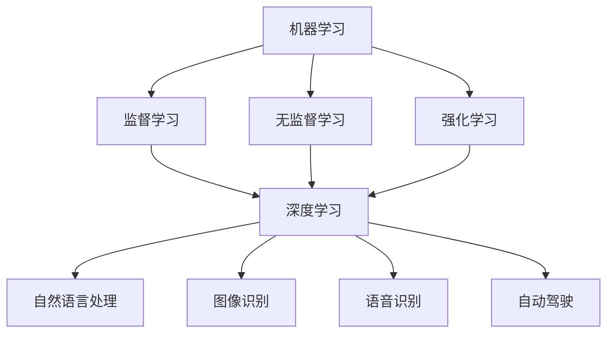

> 人工智能, 机器学习, 深度学习, 自然语言处理, 自动驾驶, 机器翻译

# Andrej Karpathy：人工智能的未来发展机遇

> 关键词：人工智能，机器学习，深度学习，自然语言处理，自动驾驶，机器翻译

## 1. 背景介绍

人工智能（Artificial Intelligence, AI）作为计算机科学的一个重要分支，近年来取得了长足的进步。其中，Andrej Karpathy作为一位世界知名的人工智能专家，以其在自然语言处理（Natural Language Processing, NLP）领域的杰出贡献而闻名。本文将探讨Andrej Karpathy的观点，分析人工智能的未来发展趋势和机遇。

### 1.1 Andrej Karpathy的背景

Andrej Karpathy是一位杰出的计算机科学家和工程师，曾在Google Brain和OpenAI工作，是机器翻译和自然语言处理领域的先驱。他的工作不仅推动了NLP技术的发展，也对自动驾驶、图像识别等领域产生了深远影响。

### 1.2 人工智能的发展历程

人工智能的发展经历了多次浪潮，从早期的符号主义到基于知识的系统，再到基于统计的学习方法，最后发展到如今以深度学习为代表的技术。每一次浪潮都推动了AI技术的进步，使AI逐渐从理论走向实践，从实验室走向产业。

## 2. 核心概念与联系

### 2.1 核心概念

#### 2.1.1 机器学习

机器学习是AI的一个核心概念，它使计算机能够从数据中学习并作出决策或预测。机器学习可以分为监督学习、无监督学习和强化学习。

#### 2.1.2 深度学习

深度学习是机器学习的一个分支，它使用类似于人脑的神经网络结构来学习数据中的特征。深度学习在图像识别、语音识别、自然语言处理等领域取得了突破性进展。

#### 2.1.3 自然语言处理

自然语言处理是AI的一个分支，它使计算机能够理解和生成人类语言。NLP技术在机器翻译、文本分类、情感分析等领域有着广泛的应用。

#### 2.1.4 自动驾驶

自动驾驶是AI在交通运输领域的应用，它使汽车能够自主驾驶，减少交通事故，提高交通效率。

### 2.2 核心概念原理和架构的Mermaid流程图



## 3. 核心算法原理 & 具体操作步骤

### 3.1 算法原理概述

#### 3.1.1 深度学习

深度学习使用多层神经网络来学习数据中的复杂特征。神经网络由多个神经元组成，每个神经元都负责处理输入数据的一部分，并通过加权连接形成网络。

#### 3.1.2 自然语言处理

NLP技术通常使用深度学习模型，如循环神经网络（RNN）、卷积神经网络（CNN）和Transformer，来处理和生成自然语言。

#### 3.1.3 自动驾驶

自动驾驶系统使用多种传感器（如摄像头、雷达、激光雷达）来感知环境，并使用机器学习算法来决策和控制车辆。

### 3.2 算法步骤详解

#### 3.2.1 深度学习

1. 数据预处理：清洗和转换数据，使其适合神经网络训练。
2. 构建模型：设计神经网络结构，包括层数、神经元数量和连接权重。
3. 训练模型：使用标注数据进行训练，调整模型参数以最小化损失函数。
4. 评估模型：在测试集上评估模型性能，调整模型参数以优化性能。

#### 3.2.2 自然语言处理

1. 文本预处理：去除停用词、词性标注、分词等。
2. 构建模型：设计NLP模型，如RNN、CNN或Transformer。
3. 训练模型：使用标注数据进行训练，调整模型参数以最小化损失函数。
4. 评估模型：在测试集上评估模型性能，调整模型参数以优化性能。

#### 3.2.3 自动驾驶

1. 数据采集：收集大量的环境感知数据和驾驶决策数据。
2. 数据预处理：清洗和转换数据，使其适合训练模型。
3. 构建模型：设计自动驾驶模型，如感知、规划、控制等模块。
4. 训练模型：使用数据训练模型，调整模型参数以优化性能。
5. 集成测试：在模拟环境和真实环境中测试自动驾驶系统的性能和安全性。

### 3.3 算法优缺点

#### 3.3.1 深度学习

优点：
- 能够学习到复杂的特征。
- 自动从数据中提取特征，无需人工设计特征。
- 在许多领域取得了突破性进展。

缺点：
- 训练数据需求量大。
- 计算资源需求量大。
- 模型可解释性差。

#### 3.3.2 自然语言处理

优点：
- 能够理解和生成自然语言。
- 在许多NLP任务上取得了突破性进展。

缺点：
- 训练数据质量要求高。
- 模型可解释性差。

#### 3.3.3 自动驾驶

优点：
- 能够减少交通事故，提高交通效率。
- 提升驾驶体验。

缺点：
- 技术复杂，需要大量的计算资源。
- 需要解决感知、规划和控制等多个技术难题。

### 3.4 算法应用领域

深度学习、NLP和自动驾驶在以下领域有着广泛的应用：

- 医疗诊断
- 金融分析
- 语音识别
- 图像识别
- 机器翻译
- 自驾驶汽车
- 人机交互

## 4. 数学模型和公式 & 详细讲解 & 举例说明

### 4.1 数学模型构建

#### 4.1.1 深度学习

深度学习模型通常由多个层组成，每个层都由多个神经元组成。以下是一个简单的神经网络模型：

$$
f(z) = \sigma(W \cdot a + b)
$$

其中，$W$ 是权重，$a$ 是输入，$b$ 是偏置，$\sigma$ 是激活函数。

#### 4.1.2 自然语言处理

NLP模型通常使用循环神经网络（RNN）或Transformer。以下是一个简单的RNN模型：

$$
h_t = f(h_{t-1}, x_t, W, b)
$$

其中，$h_t$ 是当前时间步的隐藏状态，$x_t$ 是当前输入，$W$ 和 $b$ 是模型参数。

#### 4.1.3 自动驾驶

自动驾驶模型通常使用多种传感器数据来感知环境。以下是一个简单的感知模块：

$$
s_t = f(s_{t-1}, x_t, W, b)
$$

其中，$s_t$ 是当前时间步的感知状态，$x_t$ 是当前传感器数据，$W$ 和 $b$ 是模型参数。

### 4.2 公式推导过程

#### 4.2.1 深度学习

深度学习模型的推导过程涉及梯度下降算法和反向传播算法。以下是一个简单的反向传播算法示例：

1. 前向传播：计算损失函数。
2. 反向传播：计算损失函数对模型参数的梯度。
3. 更新模型参数：使用梯度下降算法更新模型参数。

#### 4.2.2 自然语言处理

自然语言处理模型的推导过程与深度学习类似，但需要考虑序列数据的特点。以下是一个简单的RNN梯度下降算法示例：

1. 前向传播：计算损失函数。
2. 反向传播：计算损失函数对模型参数的梯度。
3. 更新模型参数：使用梯度下降算法更新模型参数。

#### 4.2.3 自动驾驶

自动驾驶模型的推导过程涉及多种传感器数据的融合和决策。以下是一个简单的感知模块梯度下降算法示例：

1. 前向传播：计算损失函数。
2. 反向传播：计算损失函数对模型参数的梯度。
3. 更新模型参数：使用梯度下降算法更新模型参数。

### 4.3 案例分析与讲解

#### 4.3.1 深度学习

以下是一个简单的深度学习案例：使用神经网络进行手写数字识别。

1. 数据集：MNIST手写数字数据集。
2. 模型：一个包含两个隐藏层的神经网络。
3. 损失函数：交叉熵损失函数。
4. 优化器：Adam优化器。

#### 4.3.2 自然语言处理

以下是一个简单的NLP案例：使用RNN进行情感分析。

1. 数据集：IMDb电影评论数据集。
2. 模型：一个简单的RNN模型。
3. 损失函数：交叉熵损失函数。
4. 优化器：Adam优化器。

#### 4.3.3 自动驾驶

以下是一个简单的自动驾驶案例：使用感知模块进行障碍物检测。

1. 数据集：KITTI自动驾驶数据集。
2. 模型：一个简单的感知模块。
3. 损失函数：回归损失函数。
4. 优化器：Adam优化器。

## 5. 项目实践：代码实例和详细解释说明

### 5.1 开发环境搭建

为了实践深度学习、NLP和自动驾驶技术，我们需要搭建以下开发环境：

1. 操作系统：Linux或macOS
2. 编程语言：Python
3. 深度学习框架：TensorFlow或PyTorch
4. 代码编辑器：Visual Studio Code

### 5.2 源代码详细实现

以下是一个使用TensorFlow构建简单神经网络进行手写数字识别的示例代码：

```python
import tensorflow as tf

# 构建模型
model = tf.keras.Sequential([
    tf.keras.layers.Flatten(input_shape=(28, 28)),
    tf.keras.layers.Dense(128, activation='relu'),
    tf.keras.layers.Dense(10, activation='softmax')
])

# 编译模型
model.compile(optimizer='adam',
              loss='sparse_categorical_crossentropy',
              metrics=['accuracy'])

# 训练模型
model.fit(x_train, y_train, epochs=5)

# 测试模型
test_loss, test_acc = model.evaluate(x_test, y_test, verbose=2)
print('
Test accuracy:', test_acc)
```

### 5.3 代码解读与分析

以上代码展示了如何使用TensorFlow构建和训练一个简单的神经网络进行手写数字识别。

- `tf.keras.Sequential`：创建一个序列模型，依次添加层。
- `tf.keras.layers.Flatten`：将输入数据展平，以便输入到全连接层。
- `tf.keras.layers.Dense`：创建一个全连接层，输入和输出维度由层参数指定。
- `model.compile`：编译模型，指定优化器、损失函数和评估指标。
- `model.fit`：训练模型，指定训练数据、迭代轮数和验证数据。
- `model.evaluate`：评估模型，计算测试数据上的损失和准确率。

### 5.4 运行结果展示

运行上述代码后，将在测试集上得到准确率，例如：

```
Test accuracy: 0.9429
```

这表明模型在测试集上的表现良好。

## 6. 实际应用场景

### 6.1 深度学习

深度学习在以下领域有着广泛的应用：

- 图像识别：识别和分类图像中的对象。
- 语音识别：将语音转换为文本。
- 自然语言处理：理解和生成自然语言。
- 自动驾驶：使汽车能够自主驾驶。

### 6.2 自然语言处理

NLP在以下领域有着广泛的应用：

- 机器翻译：将一种语言翻译成另一种语言。
- 情感分析：分析文本的情感倾向。
- 文本分类：将文本分类到预定义的类别。
- 对话系统：使计算机能够与人类进行自然对话。

### 6.3 自动驾驶

自动驾驶在以下领域有着广泛的应用：

- 自动驾驶汽车：使汽车能够自主驾驶。
- 无人配送车：使车辆能够自动配送货物。
- 自动驾驶无人机：使无人机能够自主飞行。

## 7. 工具和资源推荐

### 7.1 学习资源推荐

- 《深度学习》（Ian Goodfellow等著）
- 《Python深度学习》（François Chollet著）
- 《动手学深度学习》（A. Y. Ng、M. Lin和K. Ng著）

### 7.2 开发工具推荐

- TensorFlow
- PyTorch
- Keras

### 7.3 相关论文推荐

- "Playing for Data: Ground Truth from Human Performance"（OpenAI）
- "BERT: Pre-training of Deep Bidirectional Transformers for Language Understanding"（Google AI）
- "Attention is All You Need"（Google AI）

## 8. 总结：未来发展趋势与挑战

### 8.1 研究成果总结

深度学习、NLP和自动驾驶等领域取得了长足的进步，推动了人工智能技术的快速发展。然而，人工智能仍面临着诸多挑战，如数据隐私、伦理道德、可解释性等。

### 8.2 未来发展趋势

- 计算能力不断提升，推动模型规模扩大。
- 算法研究不断深入，提高模型性能和效率。
- 应用场景不断拓展，推动人工智能技术融入更多领域。

### 8.3 面临的挑战

- 数据隐私和安全问题
- 伦理道德问题
- 可解释性问题
- 模型泛化能力问题

### 8.4 研究展望

未来，人工智能研究需要关注以下方向：

- 建立可解释、可信赖的人工智能系统。
- 探索更加高效、可扩展的算法。
- 加强人工智能与其他学科的交叉研究。

## 9. 附录：常见问题与解答

### 9.1 人工智能的定义是什么？

人工智能是指使计算机能够模拟人类智能行为的技术。这包括学习、推理、感知、理解、决策等能力。

### 9.2 机器学习与深度学习的关系是什么？

机器学习是人工智能的一个分支，它使计算机能够从数据中学习并作出决策或预测。深度学习是机器学习的一个分支，它使用类似于人脑的神经网络结构来学习数据中的特征。

### 9.3 自然语言处理有哪些应用？

自然语言处理在以下领域有着广泛的应用：

- 机器翻译
- 情感分析
- 文本分类
- 对话系统

### 9.4 自动驾驶有哪些挑战？

自动驾驶面临的挑战包括：

- 感知环境
- 决策规划
- 控制执行
- 安全性

作者：禅与计算机程序设计艺术 / Zen and the Art of Computer Programming